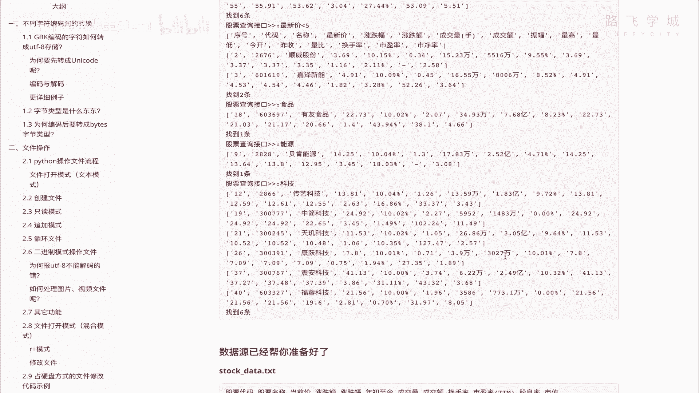

# 【2024年Python】8小时学会Excel数据分析、挖掘、清洗、可视化从入门到项目实战（完整版）学会可做项目 - P55：14 综合实战-股票查询程序需求讲解 - Python金角大王Alex1 - BV1gE421V7HF

OK同学们，恭喜你们，到了咱们这章节最后一块的内容就是综合实战，股票查询程序为什么要叫综合实战呢，它不因为它不光是考核这一章节的，并且是考核咱们这四天来所有内容的一个综合，你把这个东西搞定了。

那太牛逼了太牛逼了，算是非常聪明了，呃怎么讲这个实战呢，咱们直接看需求吧，看需求啊。

在这里啊，他呢是要求你干嘛呢啊，把这个这些从网上截的这些股票数据给他，存到这个文本格式里啊，存到文本格式例支撑后呢，进行这样的一些操作，第一个呢啊程序启动之后让用户用户去查，允许用户呢去查股票信息啊。

股票信息怎么查呢，这个可以模块嗯，可以模糊的查询股票名，什么意思，我比如说输入一个哈工，他就能把哈工智能桌带哈工的全都给我列出来，明白吗，那输一个啤酒，带啤酒的都列出来，然后呃允许我按照股票价格涨跌幅。

比如说股票价格涨跌幅来进行判断，全都给我列出来，明白吗，小于这个百分之，比如说小于多少的，我给我列出来，明白吗，啊这个大于小于大于小于啊，那另外一个就是还可以不光是涨跌幅，还可以对市盈率也可以。

比如说大于多少，小于多少哦，草这里还有亏损的字眼的啊，亏损资源啊，那另外再就是什么呀，对就是这这三个看到没有，允许这个对股票名的模糊查询，允许对几个特殊的进行一个涨跌幅的判断啊。

涨跌幅就是涨跌幅和这个进行，大于小于的判断好吗，然后这个就是咱们的要求，就是咱们要求，那你这个其实有一定真的有一定难度啊，然后查最后执行的一个结果，模板就是这样的，看到没有，你输入换手率大于多少。

他就给你把换手率大于的全都给你列出来，输入这个最新价小于多少，才能给你列出来，输入食品带食品的输入能源在能源的科技的，带科技的产品查出来啊，并且大家给你告诉你查到的几条，看到没有哎，这个你能做出来。

反正是挺棒的，数据源我已经给你存好了，看到没有啊，把这个从从这种存这种格式给你存成的，这种格式，你直接把这个数据源copy过去就行了啊，进行查询，好，这个呢，我在这里不在。

在不在这里录的课程里给大家去讲了，我到直播的时候，咱们晚上不是有直播课嘛是吧，到直播课的时候，我给大家讲一下这个时代这个还是挺牛逼的啊，你一定要来听好了，那个你直接你自己也憋一个小时吧。

看看能不能做出来嗯，那咱们直播的时候一块儿把这个东西搞出来，好啊，今天就到这里嗯拜拜，See you，继续坚持。

