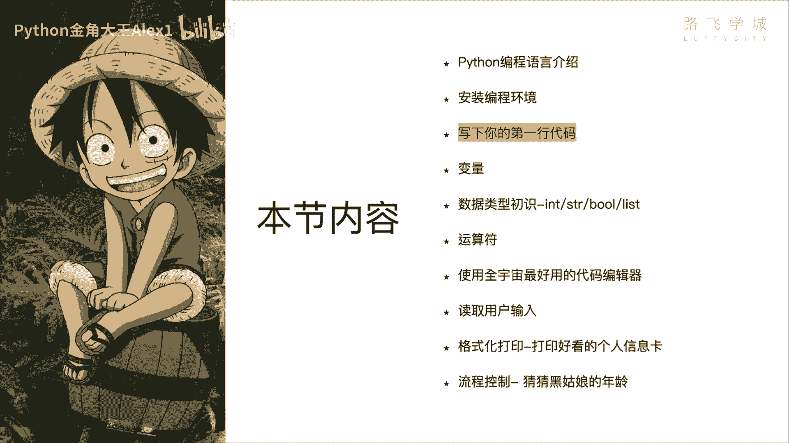
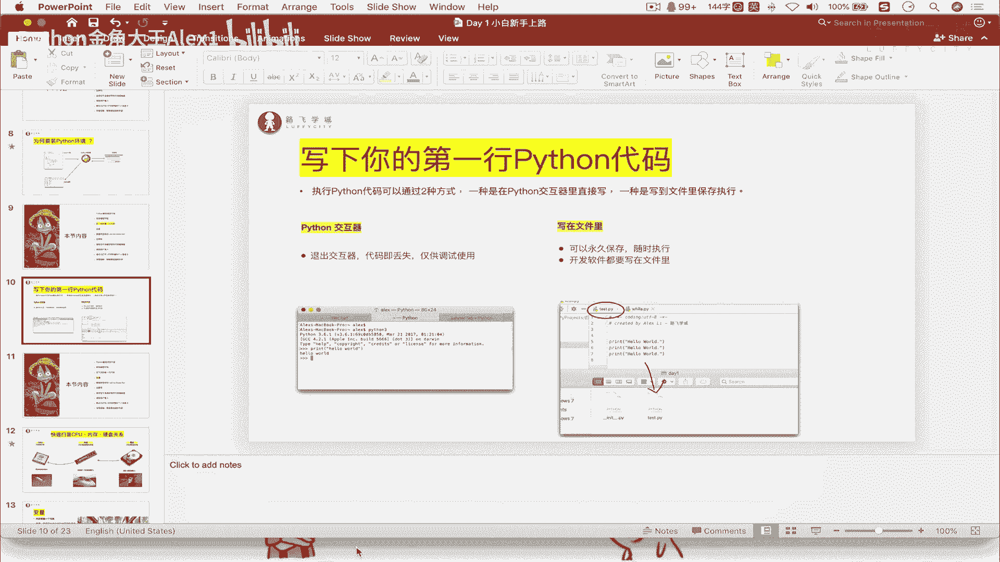
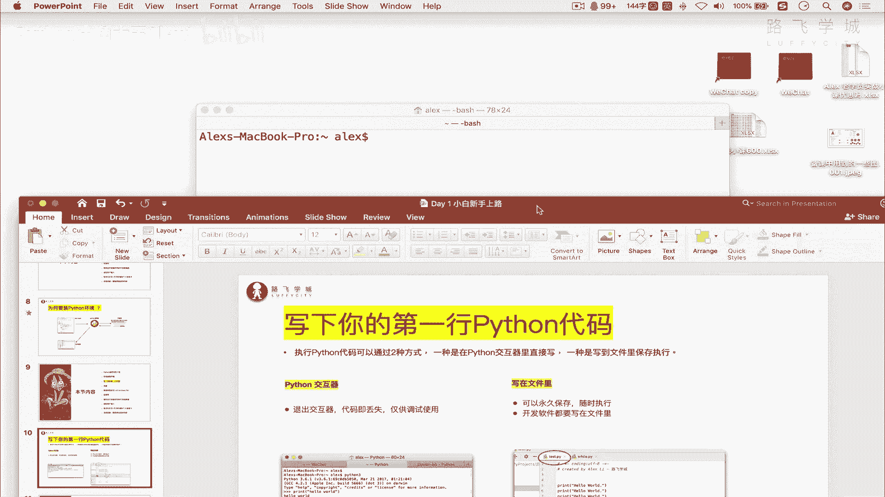
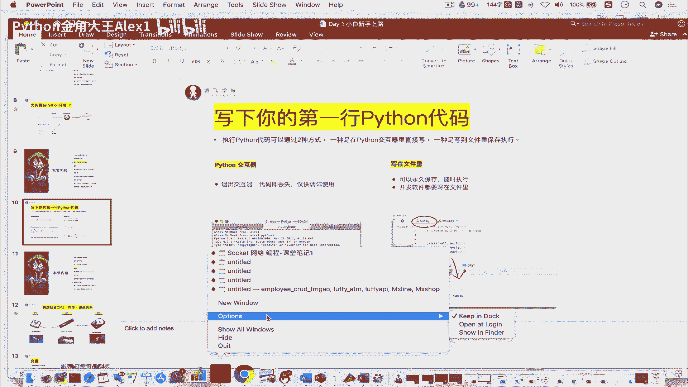
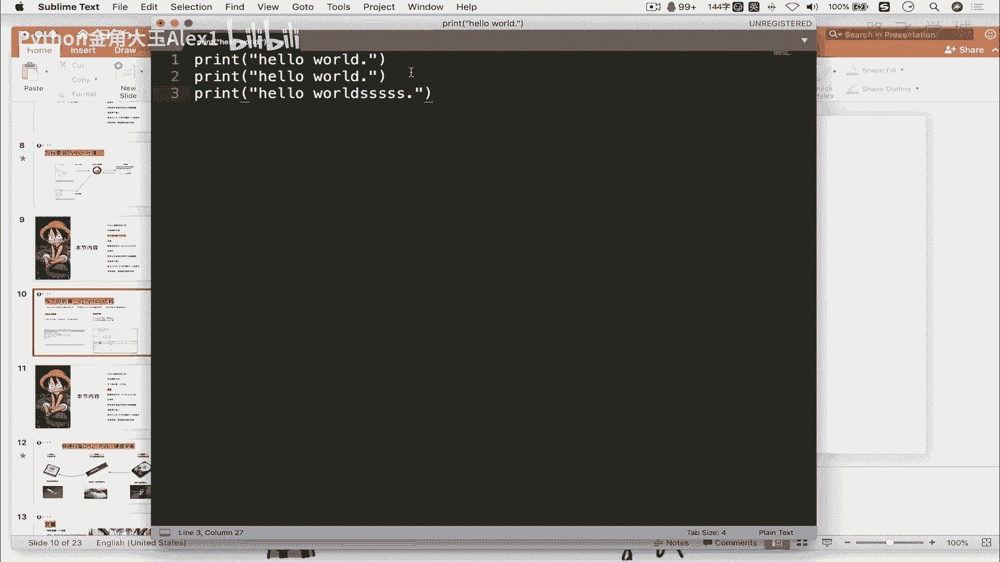
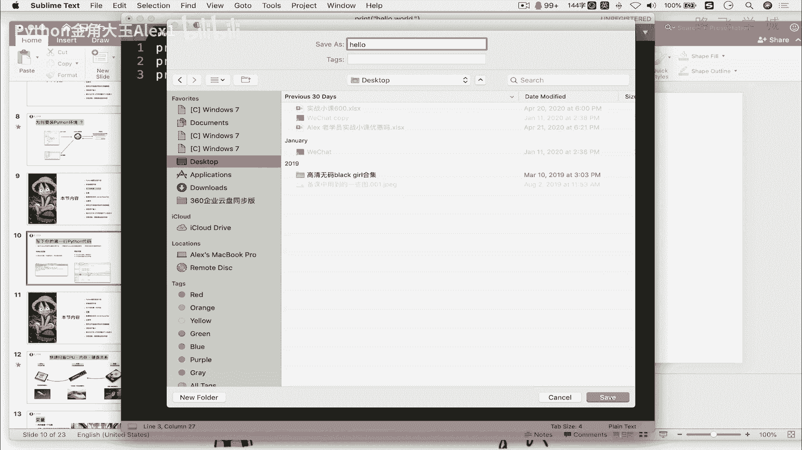
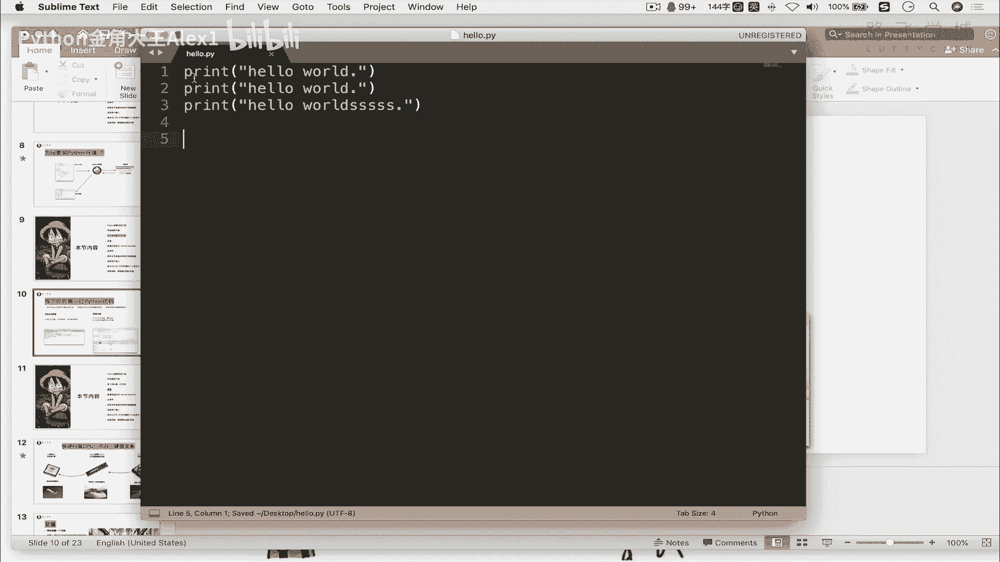
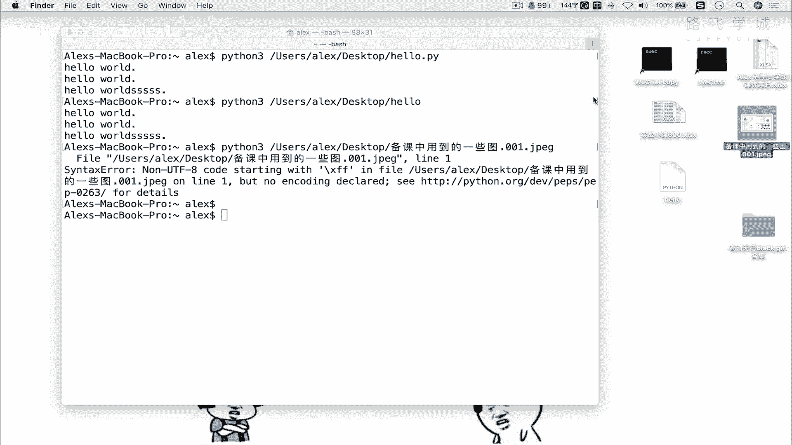

# 【2024年Python】8小时学会Excel数据分析、挖掘、清洗、可视化从入门到项目实战（完整版）学会可做项目 - P5：04 写下你第一个Python程序 - Python金角大王Alex1 - BV1gE421V7HF

OK同学们，那上节课我们一起来安装了Python的编程环境，也就是它的解释器，这节课咱们就来写咱们的Python代码啊，写下你的第一个Python程序，第一个Python程序啊。

好那写代码呢咱们有两种方式啊。

写代码两种方式啊，这个是Python专有的啊，第一种呢是说你可以通过Python的一个交互器，来写代码啊，交互器写代码，另外一种呢是写在这个文件里，写到文件里啊，存起来，那这个交互器是个什么东西啊。

交互器是什么东西啊，很简单，咱们在上节课安装这个Python的时候是吧，最后让你测试验证一下这个Python有没有安装成功，在windows上我让你打开了一个黑窗口是吧啊，这个命令行。

然后输入一个Python嗯，只要能进入一个类似这样的一个方式对吧，在这个windows上就代表安装成功了，进入一个类似这样的一个东西，输入一个Python是吧啊，这个是这这是在windows上。

在Mac上也是打开一个终端，输入Python进入这么一个模式，这个就是它的交互器模式，那Python解释器给你提供的就是Python的官方解释器，它给你提供了一个这玩意儿是干嘛用的。

这个是为了让你做代码调试的，比如说以后你有一句代码啊，你不知道你不知道这个执行出的效果，你就可以呢啊，你就可以打开这个解释器快速的测试一下啊，比如说对吧，执行依据看它的输出结果吧。

这个纯粹就是为了做代码调试使用的啊，做代码调试使用的嗯，那啊它的一个特性就是你只要一退出啊，你只要把这个窗口一关了，这里面写的所有代码就丢了，注意了，所写的所有代码就丢了，OK吗啊。

所以我们一般真正啊写这个开发软件，肯定不在这里写，这里只是作为测试而用啊，一会儿我们试一下，另外一个呢就是写在文件里，写在文件里，它肯定就是咱们啊，以后正常开发软件的一个模式。

它的特性就是说肯定是可以永久保存的，因为文件存到硬盘上可以永久保存，然后随时执行对吧，随时执行，OK那就是这么一个模式，对不对，写在这里一堆代码，然后存成一个文件，OK啊，那咱们就来试一下好不好。

咱们就来试一下，嗯嗯哼嗯哼，我知道啊，我打开我的这个解释器，哎呀sorry sorry sorry sorry sorry sorry，上线诶，在这里吧，打开我的解释器。

你在windows上直接就打开那个黑框命令行好吧，我先给大家试一种在这个交互器模式下，交互器模式下啊，这个执行的方式直接在这里输入一个python3分三，大家看我在这个地方是不是就进入了。

我给它放大一下啊，放大Mac上放大是CTRL键加这个加号啊，这个你的windows上好像不能这么放大，windows上用单击配置就可以了啊，咱们现在就进入了一个交互器的模式。

看到没有输入一个Python，然后看到他给你显示你的版本，然后三个尖括号，你在这里就可以写你的Python代码对吧，接近盘代码，然后你在这里输入什么呢，你在这里输入一个啊，咱们第一行代码就是啊。

这个是每个程序员必须要做的，就是打印hello world，打印hello，向屏幕打印，Hello world，向屏幕打印，咱们要输入的一条指令，一条语句叫什么呢，现在就教给你叫print，看到没有。

Print print，我们称它为一个函数或者叫一个方法啊，叫函数叫方法就行，也就是说啊为什么叫函数，因为它加上括号，加上括号对吧，咱们数学里学一个函数不都加括号了，加上这个括号，你在里面写上。

你想打印的话，注意了，要用引号引起来，双引号好吧，双引号，那在windows上的同学这个时候要注意啊，你输入你这个时候的这个叫什么呀，你这个你这个输入法一定是这个什么英文状态，看到没，英文状态。

你不能用这个全角，你如果用全角的话，你看啊他这个他这个引号是这样的，看到没有啊，他这个引号是这样，这是中文版的引号，注意了，它会报错的，你看到没有啊，说这个什么invite就是syntax error。

是语法语法的意思，语法错误invalid对吧，不合法的这个字符在这个什么在这个这个里面，Identity，这anyway，不知道，那同志们啊，注意了这个地方啊，小白容易犯这个错误，一定要改成英文状态啊。

英文状态，这个时候sorry，并且你这个输入法要改成英文的，看到没有搜啊，A b c sorry，搜狗拼音也可以拼音，我这是英文的啊，对英文状态，然后你再print看着啊，输入你的hello啊。

world对吧，第一行代码我就诞生了，注意了，输完之后引起来一回车，你看这个就是他执行的一个效果啊，这就是你写的第一行Python代码OK吗，这个很简单，是不是很简单，当然你还可以再print别的。

然后你可以上键下键啊，你按上箭头，按上键的话，它就会把上一条命令打印出来是吧，上一条命令，然后总之你还可以在这里print别的对吧，你还可以算数啊，这个3+4哈，等于七对他直接给你执行结果。

所以就是你输入一个指令，直接他在这里给你返回，结果好吧，那现在我要退出退出，直接EXIT咔嚓一回车，sorry1回车，这个时候你就退出了，就退出了这个交互器的模式，它的特点刚才说了。

一一退出里边的东西就丢了，它就没了，你之前写的代码它就没了，你这个时候你这个时候又输入它，就重新进入了一次交互器，相当于你把软件打开啊，就把QQ打开，又把QQ关了，再重新打开那么一个道理OK吗。

所以就重新又启动了，这个是把它关掉好吧，这个就是我们的交互器模式，一般只用在用用作代码调试以后，我们也会经常用啊，先知道这个就行了，接下来我们重点要学的就是在文件里写代码，OK吗，在文件里写代码啊。

那在文件里写代码，我们首先是不是要创建一个文件啊，再创建一个文件，你在你的windows上要创建一个文件。

很简单对吧，你我跟你讲，你就直接创建一个记事本。

就可以创建一个记事本就可以，你现在都不需要用别的，你就创建一个记事本啊，我在我的Mac上也搞了一个类似记事本的东西啊，类似记事本的东西，它叫什么呢，它叫这个啊叫啊，我用的一个专门的编辑软件叫什么呀。

这个在windows上应该也有啊，在Mac上，我这个就相当于Mac上的记事本，看Mac上的记事，把windows上的记事本我在这个地方直接print，看到没有，直接print你的代码，然后print。

Hello world，看到没有啊，JP是一样的，是一样的，你想输入第二行也没问题，你看到没有，第三行对吧，你输别的也行啊，无所谓，注意的，要用引号引起来，这个时候你已经把代码写到文件里了。

它可以永久保存，但是你要存下来，你现在还没存呢啊，你要存下来啊，存到哪里呢，你现在这个代码是在你的内存里。

不是在硬盘里，你还得存下来，你要把它存下来，一右单啊，不一这个保存对吧，我现在给它随机存到一个地方，我就存到我的桌面上，好不好啊，从桌面上我给它起个名字，注意了，这个地方很关键。

起个名字叫注意了点后缀注意了啊，一定要加后缀，大家看看这里有一个图片，它的后缀叫GBEG这个excel点，这是excel的后缀，咱们都知道对V这个word文档就是doc是吧，为什么要叫后缀。

后缀是告诉计算机我这是一个什么样的文件，让计算机，比如说你是一个doc的文件对吧，计算机word就能处理它，你要是一个什么这个GPEG对吧，你用word文档打开它就处理不了对吧。

那我们这个Python的代码也有一个专属的后缀，专属的后缀OK吗，这个专属的后缀不要忘记它叫PY，点PY1看到点PY的对吧，大家就知道这是一个Python的代码文件，OK吧，Python的代码文件。

OK那你要是什么C语言啊，或者是PPPP，我记得还有这个对吧，有P2P对吧，还有java，还有这个C语言，点C是不是啊，它都有这个后缀的，咱们Python的后缀就叫点PY好吗。

然后以后我们起文件都起征点PY，有的同学说非得呃非得说我就不起，我就点点hello。

点hello行不行，咱们一会试一下，咱们先点PY好不好啊，全成点PY，然后你看哎我这个解释我这个编辑呃，这个这个代码的编辑工具有点意思，因为它支持Python的这个代码格式，所以呢你只要存成点PY。

他一看点PY，他就给你把这个代码都给你高亮了啊，你的那个windows记事本肯定不支持这个功能啊，Anyway，那哦你在windows上你可以用一个下载一个叫not pad。

加加notepad加加保存完了它就跟这个一样，保存完了之后也给你高亮显示，就这个有颜色代码有颜色啊，好了，我现在保存完了之后。

同志们，我就可以执行我这个代码啊，我执行我这个代码怎么执行，大家注意了，看着啊，我这个执行咱们看你不能双击就执行了啊，你双击这是什么玩意儿，双击在windows上双击双击，这他妈进哪了，卧槽进到我了哦。

我靠进到我的这个这个qt了，QT回头咱们学啊，这是咱们Python的一个图形界面开发工具，总之你不要双击它啊，双击它在windows你双击也也不要双击，你这样正常的执行是你咱们说了。

这个代码是不是得交给这个Python的解释器来执行，对吧，那你首先要调用Python解释器，对不对，调用Python解释器，你就直接在这里Python d python3对吧，这就是直接一输入就调用了。

然后呢把这个拖过来啊，在我的Mac上一拖过来一回撤对吧，这个时候他就执行了，看到没有，是不是执行了，这样的话相当于Python解释器去执行这个文件，能理解意思吗，这个就是咱们写的第一行代码。

你在你的windows上好好，Mac上好都试一下，反正都是拖过来扔进去，扔到你的windows上，拖过来扔到黑框里，一执行就可以了，好吧，你们自己来试一下，把自己的第一行代码搞定好的。

最后我给大家再补充一下，刚才咱们讲到，说你这个后缀名是不是必须要加呢，不加不行吗，有些同学手贱说我就是不加可不可以啊，不加咱们试一下，效果就这样啊，你在你在你的这个windows上直接这个双击啊。

直接双击，把这个后缀名去掉就可以了，看到没有，这是在windows上，注意在我的Mac上不行，在我Mac上，你这样双击去掉，其实没有真正去，你要这样，你要get info，右单击get info啊。

在这个地方看到没有，把他这个后缀对吧，在这个name extension扩展名啊，就是扩展名叫后缀名啊，把这个去掉，然后这个时候他问你是不是真的要remove，这个extension就是扩展名点PY。

你说remove这个时候才是真正去掉了，OK吗，你这个去掉之后，你会你执行一下，看看它会不会出问题，你会发现并没有报错诶，那既然没有报错，我那就不用加后缀名，不用加点PY了对吧。

哎我告诉你是你是可以不加的，我告诉你这个你加这个后缀名，其实纯粹是干嘛呢，纯粹是为了让咱们这些程序员能看清楚说哦，我这是一个Python文件，我这是一个excel文件，我这是一个图片，OK吗。

那并不是说程序来通过这个后缀名，来去识别它是什么文件，程序就是在咱们那个Python解释器，它你只要把这个文件拖给他，他才不管你是不是Python的代码，他就用Python的语法去解释，如果解释的了。

他就解释的就执行成功，解释不了，他就报错，说啊，你这个什么垃圾软件，你比如说我在这里输了一个python3，我直接把这个图片扔进去，他也会解释，他直接会给你报错。

看到没有说什么syntax error啊，一堆错误，对不对，因为他处理不了，他并不会说啊，根据你这个后缀名来判断什么啊，他就直接去把这个文件啊给你处理了啊，然后发现根根本不是Python的语法。

所以他就报错了吧，所以这个后缀名仅供人们，咱们人类来去识别对吧，因为你不加这个后缀名，说白了这些动力后缀你能分清这是Python代码，这是excel，这是图片吗，分不清，所以一定要加后缀，OK吗，好的。

这一小节就到这里，你的第一次就献给了我。

