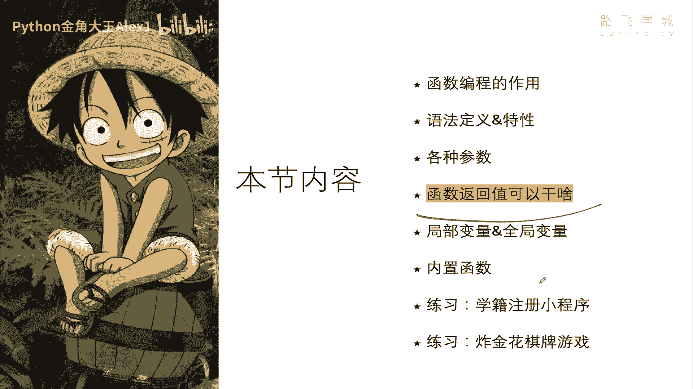
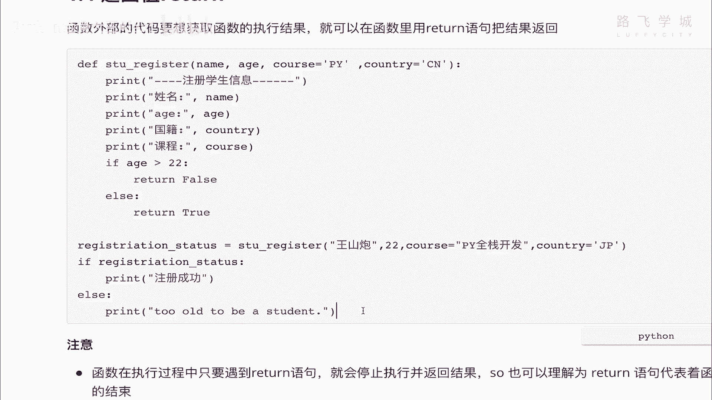
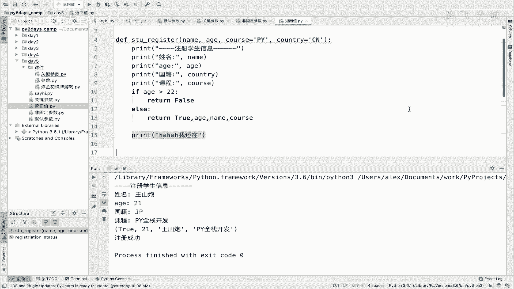

# 【2024年Python】8小时学会Excel数据分析、挖掘、清洗、可视化从入门到项目实战（完整版）学会可做项目 - P60：05 函数返回值的作用 - Python金角大王Alex1 - BV1gE421V7HF

OK同学们这一小节学这个函数的返回值，那函数的返回值是干什么用的。

它有什么作用啊，看一下它的这个呃这个这个作用啊，也就是说你函数外部的代码对吧，因为就是你要调用从函数，就从外面调用这个函数嘛，函数外部的这个代码，如果想要获取函数的执行结果。

那就需要就可以在函数里面用这个return这个语句，把这个函数的执行结果返回啊，把真正结果返回来，给大家看一个例子，大家就能明白了，明白了，大家看我这个还是学生注册这个例子对吧。

那你执行了这个函数之后啊，你在这里，比如说你在这里啊，在这吧，你执行了这个函数之后，那函数里面执行了很多代码，你怎么执行，就是你执行完了之后回到外部对吧，回到这个外部函数退出，那外部。

也就是说我外面调用这个函数的，这个这个这个代码，怎么知道这个函数是执行成功的，执行失败的，比如说那我可能注册的时候走到这一步，咔嚓这个什么呀，这个这个这个这个嗯就就出什么问题了。

比如说我学生填的这些信息，我要写到文件里或写在数据库里，哎写写的时候写写错了对吧，出错了，那这个函数依然会结束，依然会结束，那这个外面的代码调用这个函数的，就不知道说哎我操执行调用它的时候。

它它到底写成功没写成功啊，你得给外面的代码返回一个状态，说我执行成功了，我执行失败了，就类似这种，所以呢那你怎么把这种执行的这个状态，或者是一些其他数据返回到这个调用，你的就返回到这个函数外部对吧。

返回去啊，当做一个执行结果返回去，那你就要用到这个return ok吗，那这个return呢大家来看，我在这里就想想想去通过判断一个值，比如说你的年龄，如果你的年龄大于22岁啊，那我们这个学校就不招。

对不对啊，就不收，比如说我们这边学学学Python啊，就说有的人想想通过Python小白啊，想通过学Python转行，我就建议你说你比如说你的学历，如果是啊低于本科，然后并且你的这个年龄低于超过30岁。

我就不建议你学了，因为现在这个开发行业竞争比较啊比较激烈，如果是你是一个反正学历不好，加上你的这个啊年龄太大的话，就不太适合转到这个行业里来，所以那你就可以做这样的判断，然后他给你填了一堆信息。

我要注册，我要报名，然后你判断完之后说哎不好意思，你不合适对吧，你就要把这个状态给它返回到外面去，对不对，根据他啊，根据这一些里面的一些这个执行执行过程啊，那看我这题做的判断，如果年龄大于22。

我就返回false，就说你超标了，不能注册了，不能注册了行吗，否则的话我就返回注册成功，明白这意思吧，否则返回这次成功，那这样的话你在函数的外部是不是就可以判断，看着就是首先我拿到相当于这个函数执行。

就有结果了啊，就有一个结果有返回值了，返回值你就可以把它存下来，你就可以通过判断这个返回值的这个数据来去，再决定要干什么，比如说啊，如果是true，我就注册成功，否则我就会什么什么什么明白意思吗啊。

那我们可以把这个代码拿过来试一下啊，给大家演示一下，大家看一下啊，那个我在这里可以给大家打印一下，这个print registration，magistration status啊，大家看一下。

然后执行，呃你看这个registration true true的话，你直接是if true，相当于如果if true，那肯定是为真就打印注册成功，但是如果你输的这个年龄是个23岁对吧。

他就会返回另外一个结果对吧，就是false，然后你外面也会导致执行不同不同的流程，明白吗，所以这个就是返回值的它的一个作用，从外外部可以把这个解函数执行结果，执行的一些信息返回给外部，明白吗。

那你在这里返回的数据可不以，可不只是说啊这个什么呀，这个这个只能是这种true或false，你可以返回N多种，返回任何东西是吧，你也可以不返回，哎，有同学说我之前没返回，不返回的话就会这个什么。

就它就是一个NN，不返回就是个NN，大家看你不返回，它就是一个空值，明白吗，他也会判断如果是空值，那肯定就不成立了，所以他就会走这个，那那你如果加上返回值，它就是你返回的那个值。

那返回的值它不一定只是说false或什么，我还可以把这个什么啊，这个这个这个这个name啊，这个这个选择的cos啊，哎可以给它同时返回归去通啊，Sorry，比如说他注册成功了，我可以同时给他返回出去。

注册失败的值，返回这个值，注册成功了，返回那么多值，直接加逗号就行了，你说加逗号加逗号返回到外面是什么状态呢，大家来看一下啊，Sorry，21啊，让他这个成功好吧，你看它会返回一个元组。

也就是一个列表的这种形式，没错吧，哎你就可以根据这个返回的结果，进行各种去取值，明白这意思吗，好这就是返回值的一个作用啊，把这个函数啊return的作用，把函数的执行一些结果返回到外面好吗。

那另外一个他第一个作用知道了返回结果，第二个作用是什么啊，第二个一个特点吧，第一个是返回结果啊，执行结果，第二个是什么呢，这个程序啊执行一遇到return就什么呢，代表着函数的结束，什么意思。

也就是说你看啊我这个什么呀，现在我是把return放在最底部，所以就说后面没东西了，但是我告诉你，我即便在下面写一堆东西，它也不会再执行了啊，我写到这吧，就反正甭管这个成立以后都会执行吗。

对吧应该啊哈哈哈，我还在啊对吧，但是它并不会执行，大家执行看一下，你看也就是说后面这句话永远都不会执行，为什么，因为只要一遇到return函数就结束了，函数就见到return就代表函数结束。

明白意思吗啊，OK所以这句话永远不会执行啊，这个就是它的一个特点好吗啊，OK到此为止，我们其实就把函数的sorry，return这个功能就给大家讲完了，对不对啊，不指定return返回NN。

指定return啊，就会返回return的值，然后呢遇到return就会代表函数的结束，Ok，那大家自己可以尝试着，把一些数据返回到外面啊。

这个进行调用。