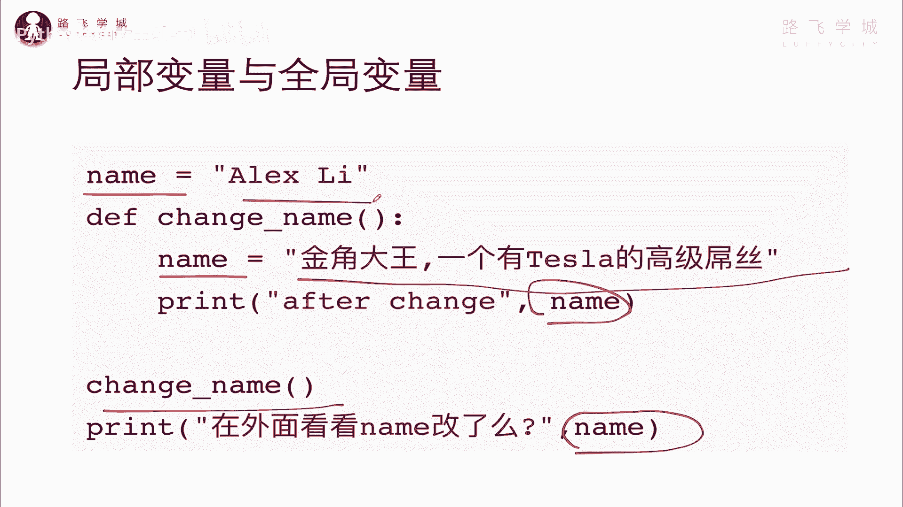
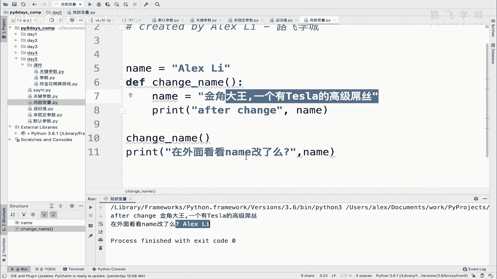
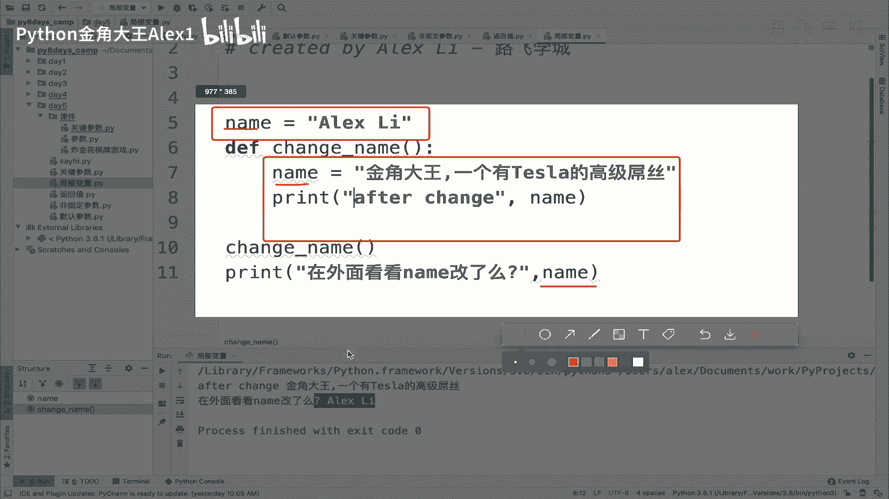
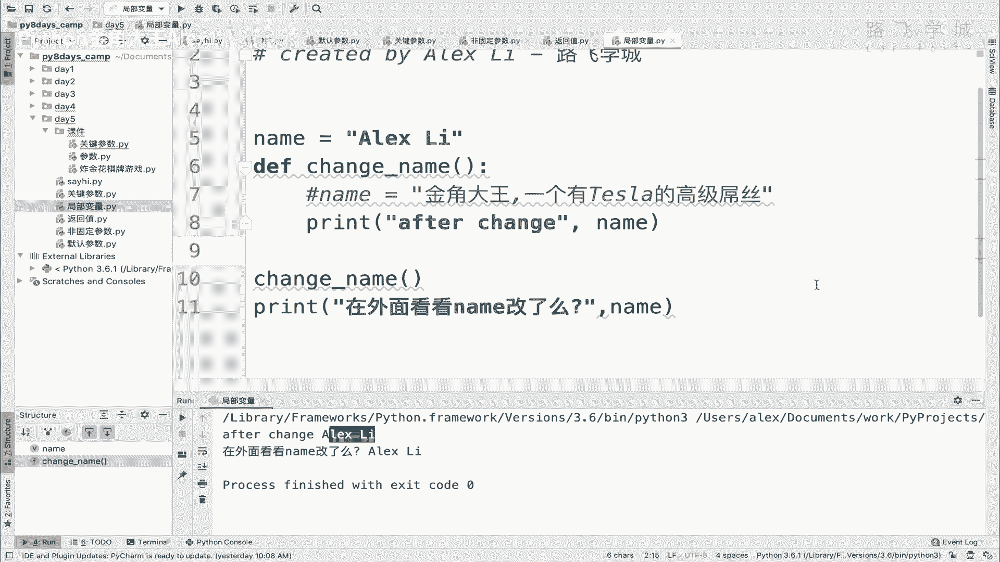
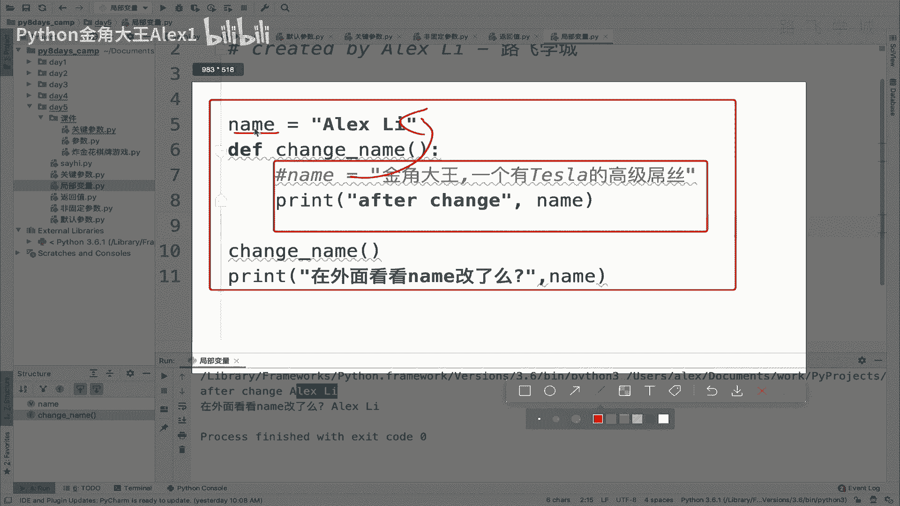
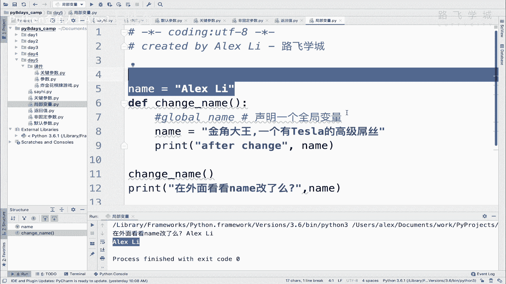

# 【2024年Python】8小时学会Excel数据分析、挖掘、清洗、可视化从入门到项目实战（完整版）学会可做项目 - P61：06 局部变量与全局变量 - Python金角大王Alex1 - BV1gE421V7HF

OK同学们，这一小节咱们来学局部变量and的全局变量啊。

这是什么东西呢，来看这张图，你看我这里定义了一个name啊，在这个函数外面，在函数里面呢又定义了一个name啊，这个应该不叫定义，就是我改了这个name对吧，改成了这句话，是不是啊。

那我改完了之后打印说这个哎打印这个name对吧，看看有没有很正常的，肯定就是改了嘛，对不对，然后我又在呃去调用它，调用完了之后呢，我再去打印这个name，看看改了没有，看到改了没有，正常情况下啊。

或者你们思考一下这个，你说他打印的这个结果是这个呢还是这个呢。

分别是为什么对吧，比如说你说对。

比如说你打印这个为啥打印这个为啥，对不对啊，你们可能有了答案，咱们呢来自己亲自的试一下好不好，亲自试一下哦，OK我把它copy过来，然后呢放到我这个地方，然后呃没啥问题吧，我就执行一下诶。

大家发现一个结果发现是什么呢，这个呃第一行的这个打印打印的是金角大王，特斯拉屌丝，第二个却发现什么呢，what the 竟然没有改，第二个发现就是说他打印的还是ALEX里对吧，还是ALEX里。

他不应该哎我这里面不是已经改掉了吗，他怎么打印的还是ALEX里呢，不应该是金角大王这句话吗，对吧，怎么没改呢，这出了什么问题。

好同志们，这个就是我们要讲的局部变量这个现象，注意了，你看你这个name和这个name，你以为他俩是一回事，但他俩完全不是一回事，他俩没有任何的关系，我告诉你，你可以理解为在内存里啊。

有说白了这个这这个这就就是就是，这是一个单独的空间，这个函数里面又是一个单独的空间，只要你生成一个函数，就会生成一个单独的一个内存空间，那内存空间里面，然后它会存里面的一些啊，变量也好一些这个数据也好。

但是全在函数内部，他俩之间是没有关系的，明白吗，在函数内部所有的这个定义的变量叫全局变量，明白吗，他叫全UT，在函数内部定义变叫局部变量，局部变量局部变量它只在函数内部有效，它只在函数内部有效。

然后呢这个这个这个这个这个函数一执行完毕，哎这个那这些变量就都会跟着释放掉啊，这里面的数据都会跟在内存里释放掉，明白吗，就或者在相当于是说这是两个村，明白吗，两个村两个村里面都有一个叫叫叫name的。

这么这个这个这个这个人民呃，这个这个名对吧，比如说啊两个村里都有叫张三的，你能说他俩是一个人吗，不是是吧，他俩是完全没关系的好吗，好那呃，了解了这个现象之后，所以就是这就是为什么。

你在这里面改了之后是吧，函数一退出跟外面没关系，外面打印的话，它依然是这个什么呀。

打印的这个值我们再来看一下局部变量的，局部变量隐含全局变量的一些其他的一些特性，第一个注意了，函数中内内函数中定义的变量叫局部变量，在程序一开始定义的变量叫全局变量啊。

比如说你在这个程序看到没有这个顶部啊，这块定义都是全局变量，当然你在这里定义一个也叫全局变量，但是只不过是说那你上面的代码就不能用了，因为是先定义再调用嘛，对不对啊，先定义从上到下，先定义调用。

另外一个就是全局变量的作用域啊，是整个程序什么样的作用域就有效范围，也就是这个含这个变量的生效的一个范围是吧，生效的范围是全部整个程序，整个程序明白吗啊只要在外面定义在全程序的。

从它往下的所有地方都可以用它，但是局部变量的作用域是该定义该变量的函数，也就是说这个的作用域有效范围，只在这个函数内部有效，你在外面是调不到这个name的，明白意思吧，在外面调不到这个name。

然后变量的查找顺序是局部变量大于全局变量，什么意思诶，这是什么意思，局部变量大于全局变量，注意了啊，那你看我在这里现在是自己定义了一个name，但是我如果把这个去掉，把这个去掉的话，它会报错呢对吧。

因为我在里面打印这个name了呀，你这里又没有，那会报错了，再看一看，并没有报错，而是而是什么，它直接引用了外部的这个变量，明白吗，外部的这个全局变量。

那好这就是变量的查询数据顺序，他查询设计它现在这个什么呀，现在这个函数内部自己内存空间得自己搞，但是如果发现没有的话，它就会到到更大的一个空间里去找，所以自己内部没有。

它就会跳到这个外面的这个空间里去找，这个啊name，所以他引用的是外面的这个name。

可以查询顺序就出来了，明白吗，先找局部，再找全局，OK好，那个呃，这个没问题了，之后就是说当全局变量与局部变量同名啊，当他俩名字一样对吧，就是像刚才咱们这个现象，那就是在定义局部变量的函数内。

在定义局部变量的函数内，在这个函数里面，这个局部变量起作用，在其他地方全局变量起作用，这个能理解吧对吧，在这个函数里面用局部的函数，外面用全局的，Ok，然后另外最后一个在函数里面。

是不能直接修改全局全局变量的，比如说我想在这里面修改这个外面的值，想改改不了，不好意思，你看我们现在这个情况，就是我们以为是改掉了，其实不是，你相当于在这里面声明了一个新的子弟，就是一个啊新局部变量。

外面的东西你也改不了，OK吗，这是不能改，那有同学说我就要改，我就要改，你不让我改，那他妈什么意思啊，对吧，我就想改我这个特殊情况程序，那就要改怎么办，当然特殊情况想改可以改，那你就得必须单独的干嘛呢。

在这里面单独明确的声明说，我现在要改全局变量啊，我要改全局变量就在这里直接执行一句话，叫global global，然后写你的name，也就是说这句话的意思，其实它叫什么意思啊，叫声明一个全局变量。

注意了，他并不是说要改这个name，他是要声明一个全局变量，什么意思，不是改的话，就是你把它去掉，它也没问题对吧，去掉的话就不存在改了吗，它相当于是声明了一个了嘛对吧，声明一个。

也就是说你在这个地方都可以叫这个名，你在这里都可以调这个name，明白这意思吗，这个时候我们来看一下啊，就一下大家看你看打印了三次，这个这个包括这个是不是啊，哎所以在这里声明相当于声明一个全局变量。

当然你如果在这里把它啊啊这个这个去掉的话，你相当于在这里就是覆盖了外面这个name，然后就是改它了嘛，对不对，明白这意思吗，OK所以global name是可以啊。

这个改就是相当于去修改外面全局变量的啊，但是这种方法我们强烈不建议你用啊，不建议用，因为这个会直接导致你这个什么呀啊，程序的调试变得非常的麻烦复杂，为什么，因为你现在代码你假如有1000行代码。

1000行代码有50个地方都用的这个name变量，那你这个又是在函数里面调用的啊，声明的啊，然后那你函数得先执行啊，是不是你函数如果不执行，对不对，那你直接就这样写啊，那你这个就就会什么呀。

这样这样也能吗，卧槽这样啊，你看你看你函数如果不执行，对不对啊，他就不会去去去改这个什么呀，叫叫啊，说话说多了蒙了，他就不会去声明这个全局变量对不对，那不会去声明的话，那这个他依然就会用外部的。

这就直接导致你就会懵逼了，因为你要看它又没，就是你在调试的时候，看说到底这个变量有没有生效，这个变量有没有改，你要先看有没有执行，然后再去来回的再看在哪里执行的是吧。

你比如说是在第200行执行在1000行的代码，我在第500行执行了这个，那上面有500行，他用的就是这个变量，下面500行就用的这个变量，卧槽那个就乱套了，真的乱套了就非常麻烦，所以建议大家不要用这个。

global不到万不得已明白吗，除非除非必须要用啊，一般的情况下不要用好一般写的，把这个全局变量写在最上面，是最清晰的，好吧。

到此为止，咱们这个局部变量和全局变量啊。