# 【2024年Python】8小时学会Excel数据分析、挖掘、清洗、可视化从入门到项目实战（完整版）学会可做项目 - P64：09 常用内置函数2 - Python金角大王Alex1 - BV1gE421V7HF

OK同学们，我们再补充几个啊，补充几个呃，open这个不说了吧，这就是文件操作的，然后ORDORDORD来着，哎呀来看啊，ORD如果我没有记错的话，他是跟那个c hr是相反的，O r d。

然后应该是传一个字符进去，然后他打印他的阿斯克码的数字，对没错啊，传一个阿斯克码的字符进去，它会把那个数字打印出来，比如说我们刚才之前试过的这个，这个的话应该是50是吧啊，60对吧。

把那个对应的阿斯克码的那个这个十进制的，那个那个那个那个表表对应的值给它打印出来，对不对啊，这个我就不用打印RII啊，这个字符对应的十进制数字好吧，不说了，然后呃看这个啊。

rain print range对吧，已经学过了哦，这里补充一个enumerate，这个东西叫枚举，其实我们应该大概用过一次，对不对，他就是把这个索引给它打印出来。

把什么的索引这个东西就enumerate啊，啊啊sorry，咱们直接点进去吧，看他这个东西呢，就是说啊啊这个什么也是一个可可迭代的，对不对，这里面一般我们会放一个列表，它就会把这个列表的这个呃啊。

这个这个这个这个索引和它对应的值，给它变成一个个的这种小的元组的形式，给它打印出来，是不是啊，我们再来回顾一下吧，比如说我们啊for这个i in index i对吧，不是value这个VR是吧。

VL吧是吧，in这个叫什么enumerate，然后range，然后十啊或者range啊，对range10吧，然后呢他就会把这个什么呀，index和这个索引啊。

sorry把这个索引和这个它的值一块打印出来，大家看一下啊，对不对是吧，左边这个是索引，右边这个是值，对不对，因为我这只是说你看上去是是是是，是你可能不太容易发现，不太容易看啊，对吧啊。

这个jack是吧，那你这样的话，大家来看这是索引，这是这个这个它的元素名，是不是打印这个东西啊，这是enumerate的作用，大家知道一下好，再看一下这个叫什么呀，round round是什么呀。

嗯叫那应该怎么讲呢，就是取取取他突然就忘了，这就是哦去几保留几位小数，保留几位小数啊，你比如说我在这里这个print一个啊，叫什么呀，L l u n d，然后呢你在这里一个数字是，比如说一个小数是13。

14159好吧，那这个时候呢你执行它默认它会干嘛呢，它会只保留整整数，但是你后面可以加我保留两位小数，看明白意思吗，它就会四舍五入的给你保留几位小数可以吗，啊这个呃就是直接是输出。

是这样你就能看出来区别了，看出来他的这个意思好吧，我就给你加中文解释了，run啊，KSTR不说了，把一个把一个什么呀，把一个额数字也好，或者是一个列表也好，变成一个字符串，变成一个字符串。

比如说我们print啊，Str，然后把这个呃你就你就你就可以，你就这样你就把它变成一个字符串都是可以的，快点把它变成一个字符串，你看你打印出来看着是一个列表，但它其实是一个字符串的形式了。

已经是一个字符串的形式了，OK吗好吧，唉把任何任意的这种数据变成一个字符串啊，SAM说过了求和，然后type type是看这个什么呀，看这个数据的一个类型，你比如说就像这个啊。

我是不是给它已经变成一个字符串了，对不对啊，A等于一个，然后呢这个时候啊打印出来看不出来啊对吧，直接打印看不出来它是组块，我type a一下，你发现它就是一个字串，大家看是不是字符串类啊。

这个类面向这个其实就是面向对象的知识，咱们并没有讲过类，但是呢啊你想象一下，就是说这个跟咱们大自然一样是吧，这个大自然是分类的，比如说人类动物啊，这个交通工具，这个这个这个这个这个行交通工具。

然后分另外一个是说学科，对不对，它有各种分类的方式，你比如说按这个按这种生物属性来讲，人类人类所有，这也就是说它在整个的一个啊。

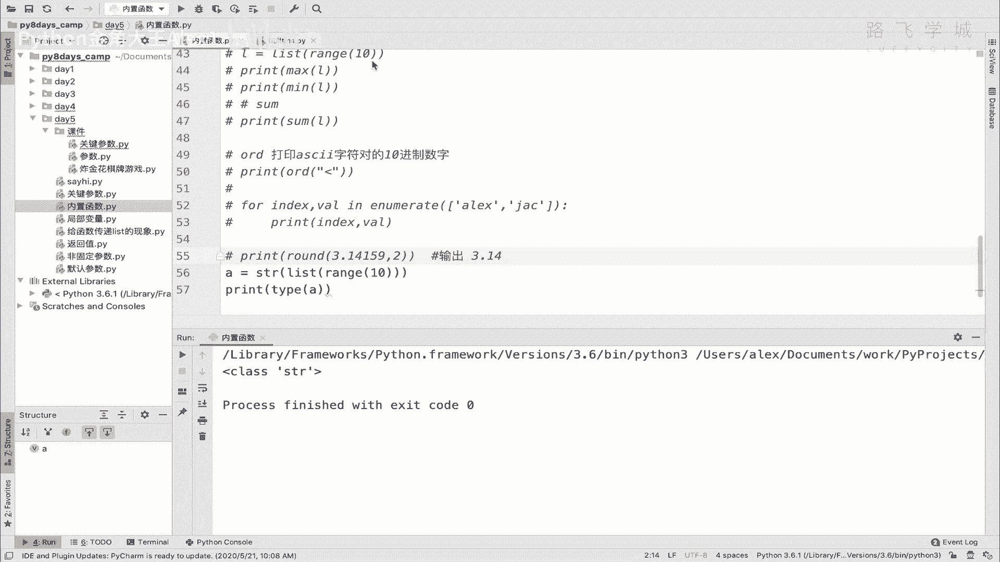

一个一个咱们的脑子的逻辑理解里，就是说你只要是一个人类，那人类它具有的各种特性，比如说他可以走路对吧，可以可以walk，对不对，可以吃饭对吧，可以eat，可以这个说话对不对，可以talk。

那这就是我们可以具备的这些属性啊，具备的这些属性，并且我们长成什么样子，两个胳膊两个腿啊，两只手啊，类似这种，那这些这些都是我们的属性，所有所有这个什么呀，属于人类的人这一类的。

这个人这个类是一个抽象的一个概念，怎么抽象概念，它其实是只是定义好了，我们这个人的所有的属性，比如说你的你是你的身高，不是你，你是长什么样的，你有几只胳膊，几只腿是吧，你是不是能说话。

他只是把这些东西给你定好了，也就是说这些属性要给你定义好了，他把把这些抽象，把这些属性组合起来，就是一个类，所有属于这些这个类的这种这种啊，这个实体实体就是说我们具体的每一个人。

每一个实实在在的这个存在的人对象对吧，都是属于这个类的东西，那只要属于这个类，我们就具备了这些东西，所以在编程里面它也是这么一个构造出来的，构造出来的，也就是说他把这个呃比如说数据类型，这里它分列表。

它分字典，它分这个字符串。

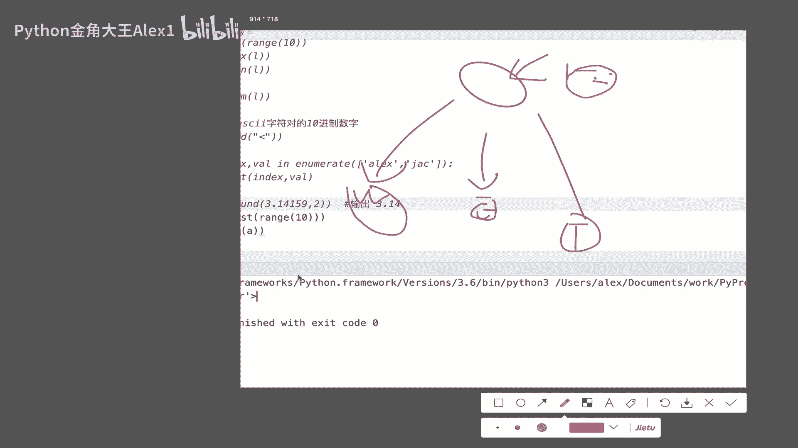

你看只要你是字符串，只要你是字符串，你就可以打一个点对吧，你比如说你就直接可以A点，下面就全都是字符串的功能对吧，字符串的功能，那你只要是列表，你打一个点，它就是全是列表的功能。

就是因为我们字符串是属于字符串类，列表是属于列表类，它也是按这么分分类的，所以你看啊为什么出现一个叫class class，就是类的意思啊，总之这个就是只是大概给大家介绍一下，在编程里面店面啊。

这个这个这个他的一些比如说面向对象编程，他就是讲这些东西的啊，我们这个正式课程当然会讲，咱们这八天清明这个太太太短了，没办法给大家深入讲，这个我大概知道就行了，就在Python里面那句话叫一切皆对象。

一切皆对象，也就就是一切都是面向对象啊对吧，就是每一个具体实实在在的东西，这个这个这个实体都是面向对象，背后都是面向对象啊，OK这个大概一听就行了，你啊好吧，然后接下来给大家讲一下这个zip zip。

最后一个这个zip是干嘛用的啊，zip我觉得还有点意思，这个zip在英文里面它叫它叫拉链的意思，它叫拉链的意思啊，什么叫拉链呢，大家想象的衣服有拉链，把两个把两边给你拉起来合起来，对不对。

诶他这个呢嗯在这个编程里，所以叫zip也是这个意思啊，this嗯好的，你比如说我在这里有两个列表，第一个列表是写的名字啊，这是三个男生对吧，接下来写三个女生是吧，ALEX和黑姑娘。

black girl对吧，然后jack和这个和这个啊，RACHEL对啊，写错了是球啊，然后rain是和这个cc对吧，好这么三个姑娘和三个男生做一个配对，怎么配对呢，直接zip下啊。

直接zip一下就可以了啊，你说的zip下怎么就配对了，配成什么样子叫配对啊，大家来看一下我这个执行效果你就知道了啊，还挺挺有意思的，诶，他跟那个map一样的，也就是说你你现在它并没有真正执行。

以及必须循环的时候，他才能把里面的每一个值给它拿出来啊，啊它每循环一次，它就就就就相当于拉链嘛，每每循环一次，他就拉一格拉一格往上拉一格啊，这种让大家来看一下，你看是不是变成一个什么样的结构。

变成了一个啊，这里面的每一个每一个元素啊，每一个元素相当于把这两个列表给它拼起来了，看到没有，ALEX和black girl配对，他俩配对，他俩配对就这么一个配对的一个结构，对不对，还有同学说哦。

那你说理解，那你说我多出来一个女生，多出来一个女生，是不是可以，那个二女二女侍一夫，哼哼呃，叫什么呢，多出来一个女生叫CATHERINE，行不行，Catherine，这应该是我啊。

我之前一个女朋友叫KATRINA，不叫CATHERINE啊，现在在美国都生了孩子了啊，哎CATHERINE为什么没有出来啊，没有跟任何人进行一个啊配上为什么，是因为它就它就是这样一个结果。

也就是说啊他就是这么111的给他拉上了，如果你有一边拉链掏出了，那就不要了啊，他只会保留，只会保留啊，这个是python3上。

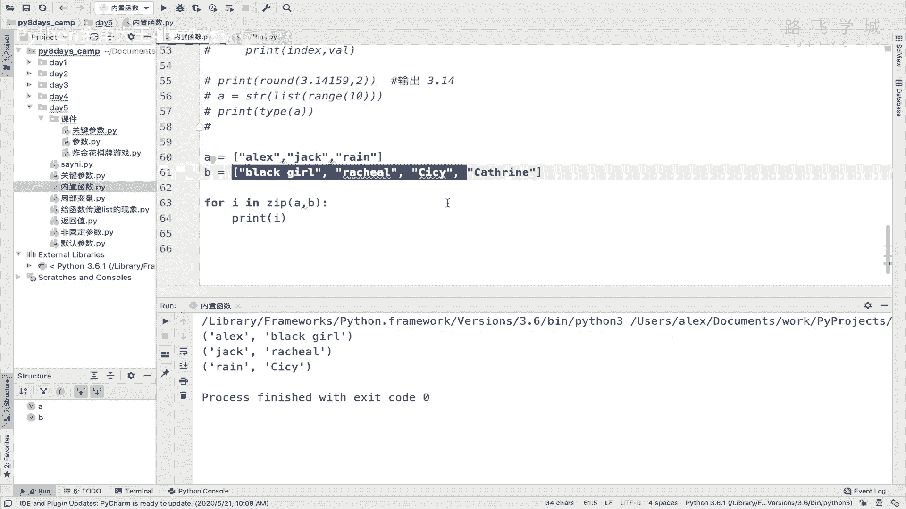

在python2上，它不是这样的，python2上，也就是说这边超出了之后，它这几个会保变成N啊，也就是说它依然有这个配对关系，但是这个这个值就是个NN。

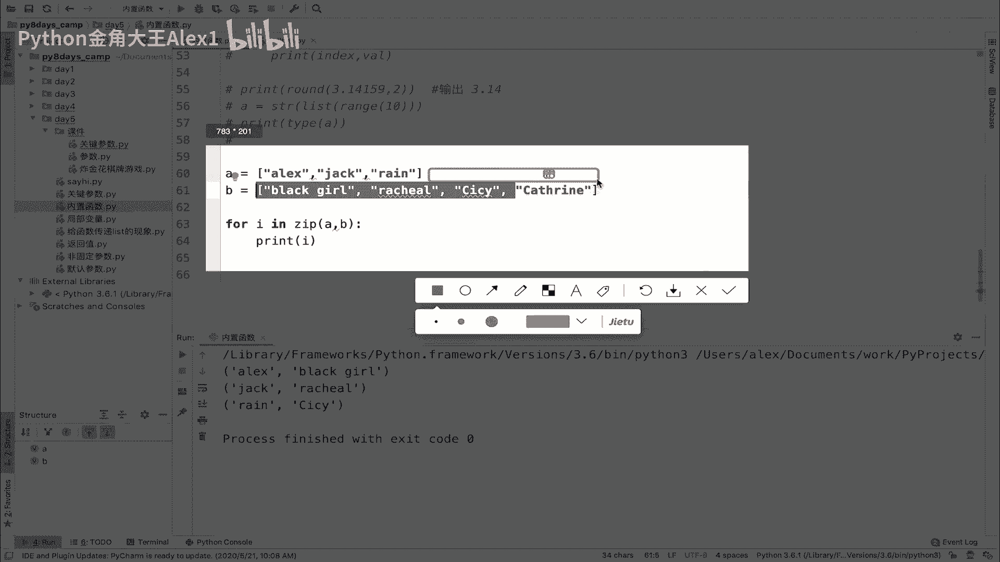

就是一个空，但python3里全都改成了，就是说只保留这个什么呀，只保留能配上的，配不上的就不显示了好吗，这个就是zip啊，可能就是在一些特定场景下可能会用到啊，你大概知道就行了，好到此为止。

咱们这个常用的内置函数就给大家讲完了。

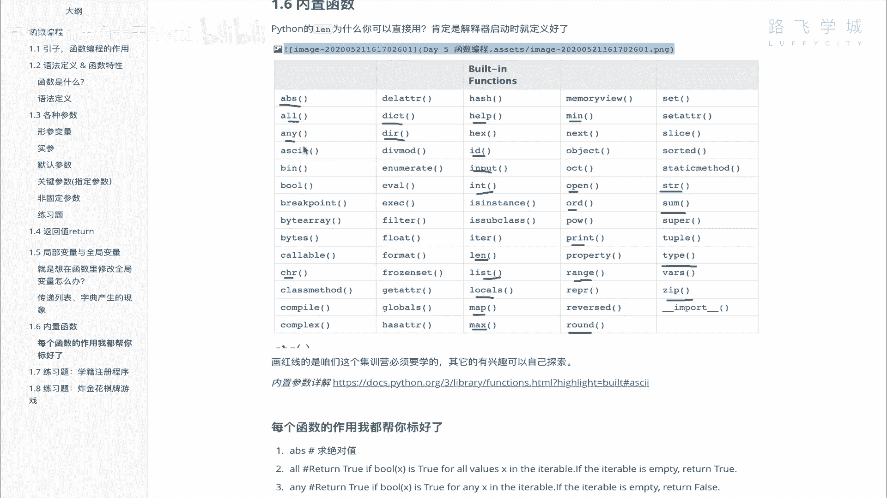

当然还会有几个啊，就是可能你你以后吧现在不需要探索，有有有意思的啊，这个叫啊compile，然后呢这个evil啊和这个，然后啊对对那几个会偶尔会会可能会用到你，你看你兴趣吧，现在先不要去弄了，OK好。

那咱们这个啊什么呀。

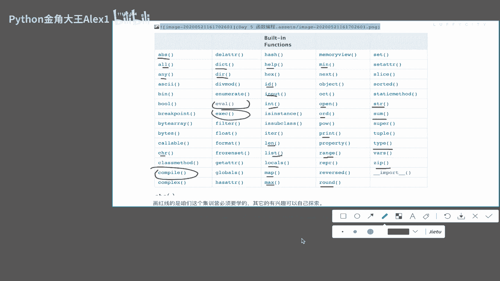

就是就就到这里好不好哦，这里还有一个filter，我给大家讲了吧，反正时间也够啊，filter filter这个呃内置函数是干嘛用的啊，filter内置函数是干嘛用的，把这个给它打印出来啊。

这是一个输出结果，Oh sorry，输出，然后看一下filter啊，呃我看看他这个英文解释是不是很简单，嗯嗯嗯嗯嗯嗯也不简单啊。

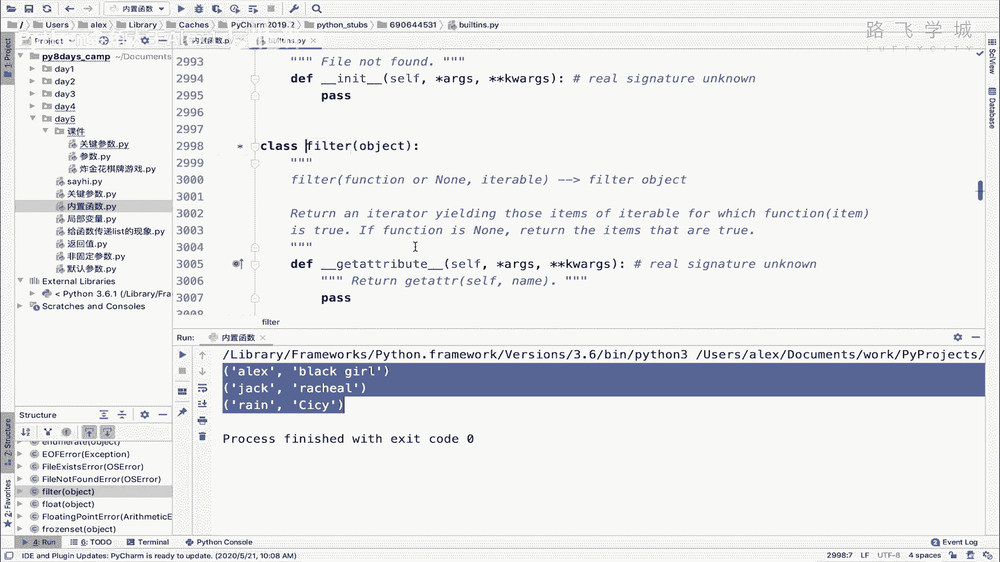

还不简单，但是还是看这个吧，它这个是这样的啊，也就是两个参数，第一个参数也是一个函数啊，或者是你写的还不写也行啊，第二个是一个可迭代的对象，又放一个列表或什么的，也就是说它是要把列表里的每一个元素。

交给这个函数去运行，然后函数返回true的，如果函数返回true啊，就保留这个数据，如果还会返回，不返回出，那就不保留这个数据啊，所以最终得出来的结果就是，最终又会返回一个列表，返回的列表里面都是进行。

也就是说都是经过函数执行，返回处的那些元素啊，明白意思吧。

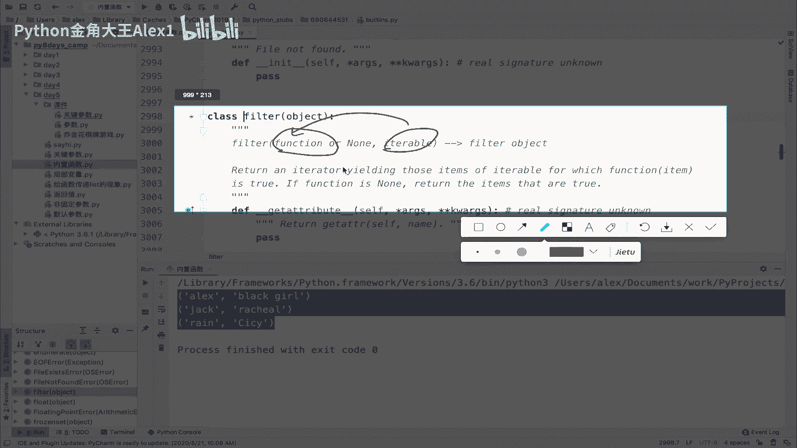

那这个呃这个这个这个这个怎么怎么讲呢，我们来看一下啊，看一下，比如说我在这里有一个列表啊，叫做叫做L吧，然后我这里依然是list，然后range，比如说十好吗，那我在这里就可以干嘛呢，写一个写一个函数。

define一个函数就是啊compare是吧，对比对比什么呢，哦他这个他这个对比就是啊也是传一个值进来，然后比如说如果你就可以判断FX如果大于五啊，我就return x啊，否否则它就是none。

明白意思吧，否则它就是N你你传一个值进来，你就判断这个值是否大于五，如果大于五，你就返回这个X啊，不不不大于五的话，你就什么也不返回好吗，那这个时候我们就可以把这个什么呀，呃我看一下啊。

啊对就可以进行一个filter的调用啊，Filter，然后把这个呃呃compare当做一个函数啊，不要加调用，然后呢把这个L传进去，这个时候就接下来就跟这个map一样了，然后我们来for循环一下。

for i in这个filter ta ta ta，然后我们来看一下print这个I，看看得出来的结果是什么吗，哦写错了写错了写了compare，Compare。

compare compare来执行一下，大家看同志们是不是打印了一个6789哎。

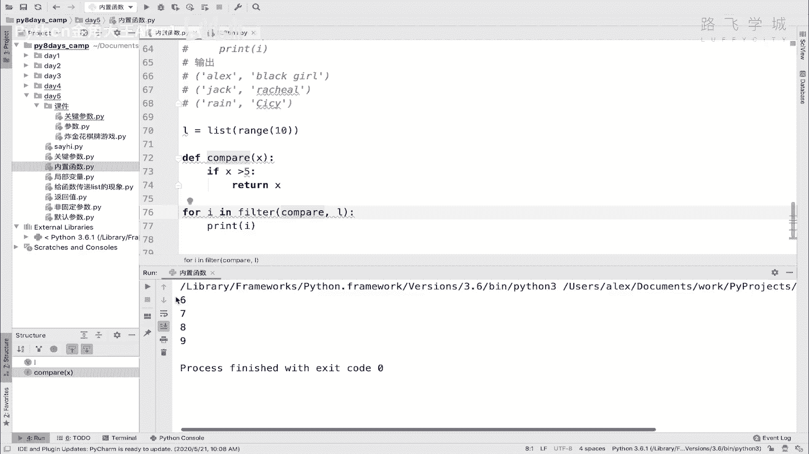

这是一个什么现象，也就是说他会把列表里的啊。

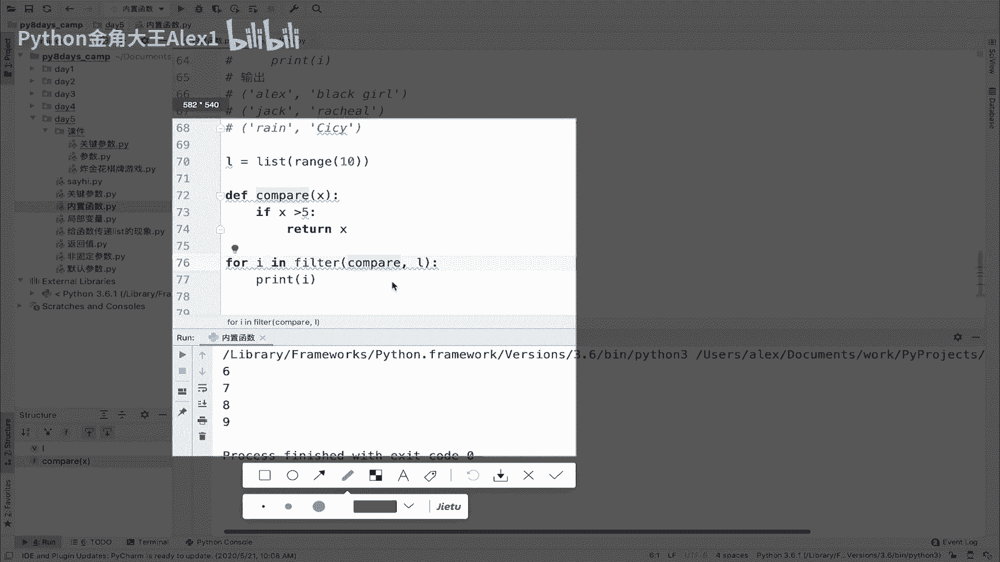

我先打印一下这个列表吧，啊print l啊。

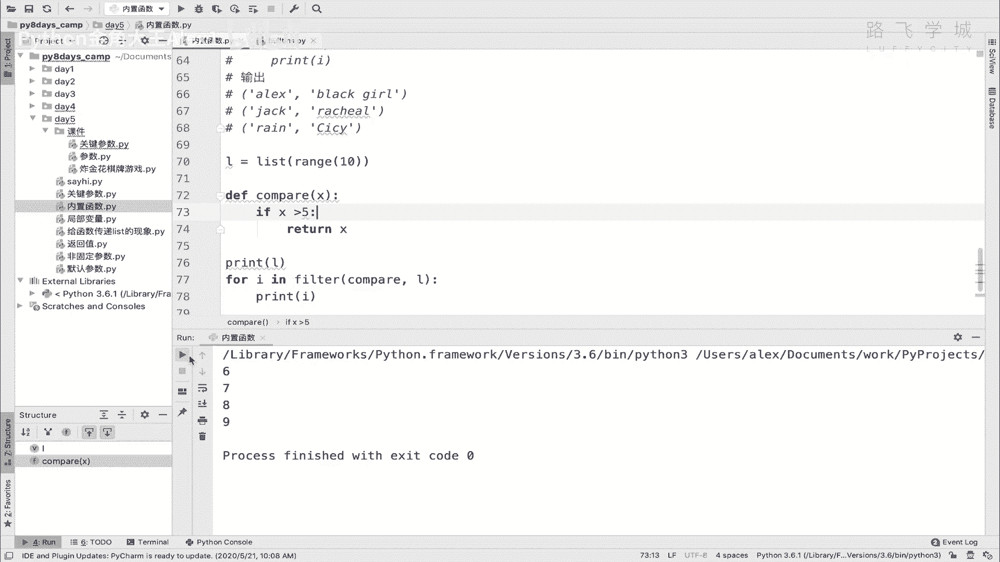

他会干嘛呢，他会把列表里的每一个值看到没有，交给这个compare去运算，然后呢，如果这个compare返回，就是说白了他返回东西了，返回的东西为真，而不是而不是说什么也没返回什么。

返回none的话就为假嘛，它返回的东西如果返回的东西为真的话，那它就会保留，把这个也就是说把这个元素保留下来啊，保留下来对吧，保留到这个这个这个filter的结果里，如果返回的结果为甲，它就给它去掉。

所以filter是过滤的意思嘛，也就是说我过滤出所有为真的东西，所有为真的值，明白吗，那你看值相当于大于五的，只有6789，是不是就啊就只返回6789啊，明白吗。

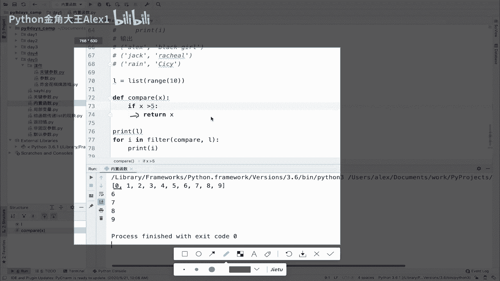

所以这个filter的作用是这个干嘛呀，对啊，就总结一下把，列表里的每一个元素啊，交给这个啊，交给函数，交给第一个参数，也就是这个函数啊，呃这个这个这个运行，然后然后若结果为真是不是啊，若结果为真。

则保留这个值是不是啊，最终相当于返回返回这个什么，返回这个filter的结果好吗，这个就是filter啊，你知道就可以了，自己可以试一下，OK到此为止。

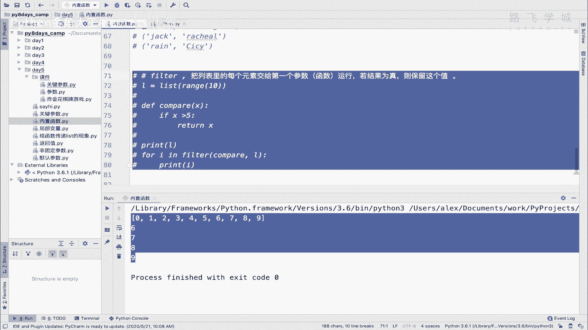

咱们常用的这些就讲完了，大家每每一个我讲的都自己搞一搞好吗。

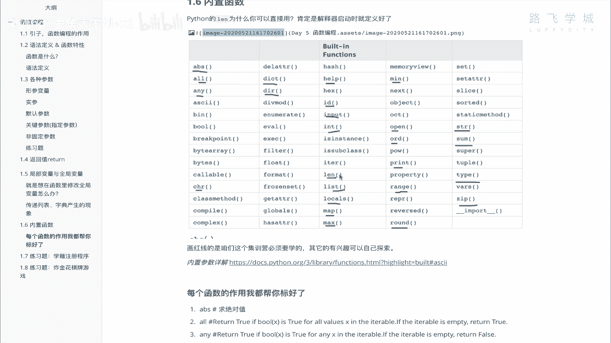