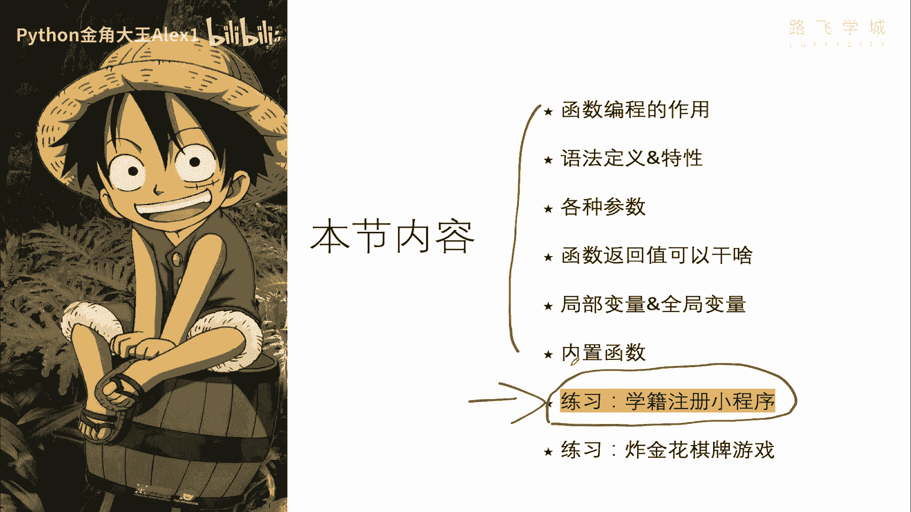
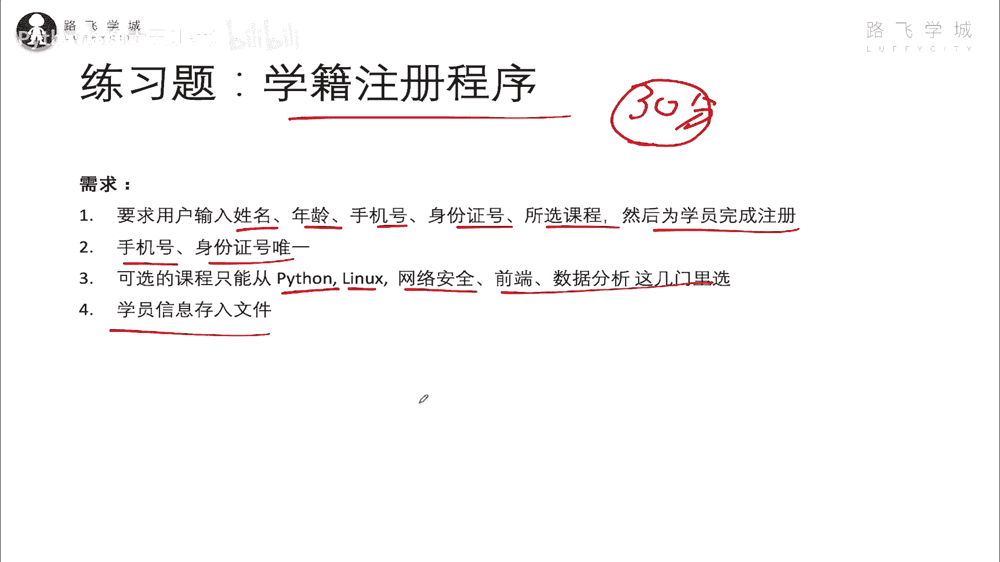
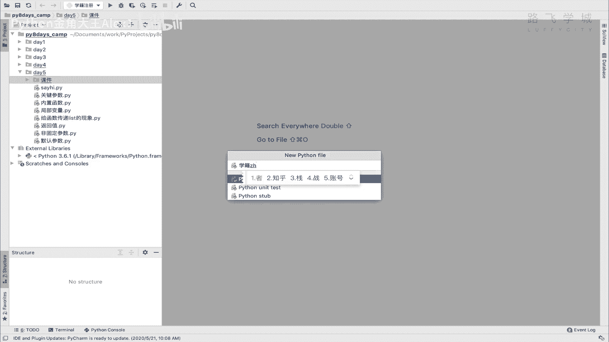
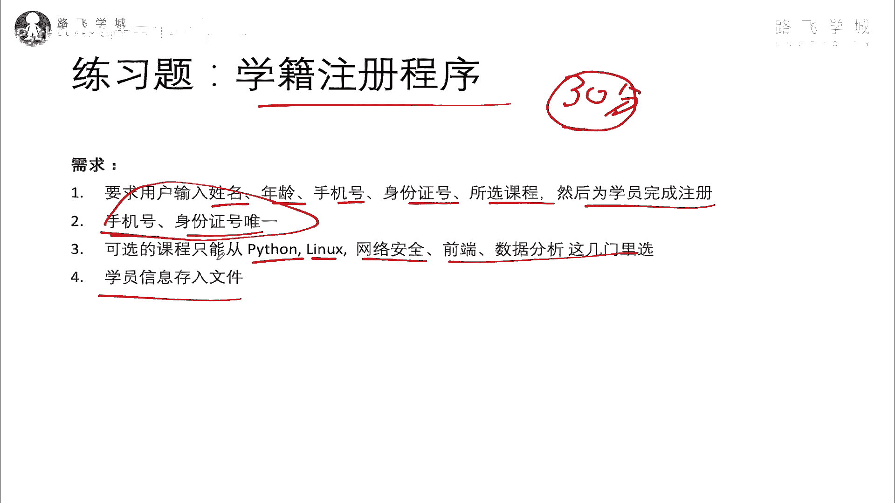
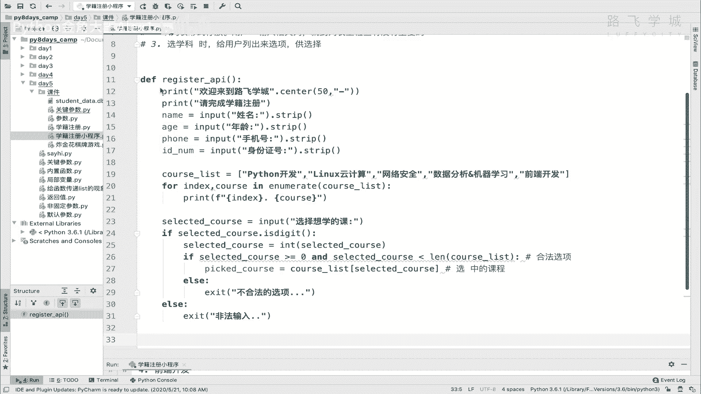
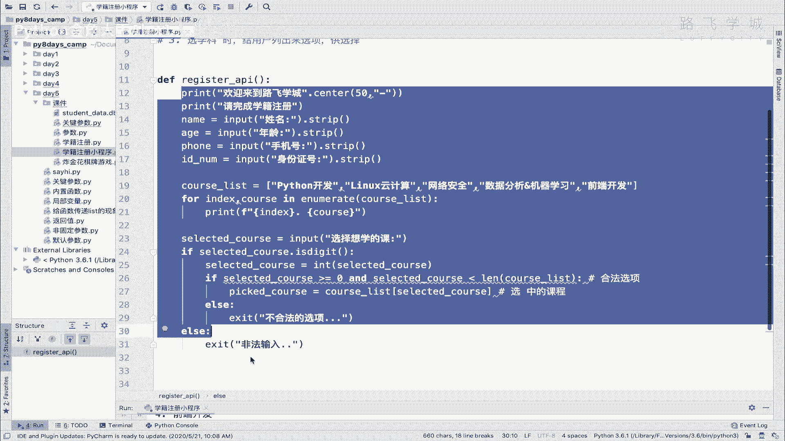
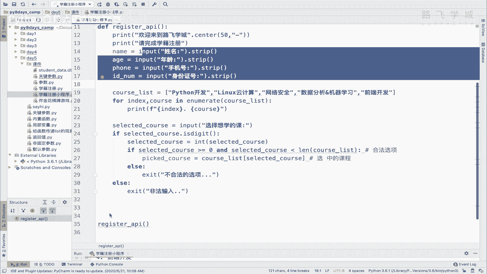
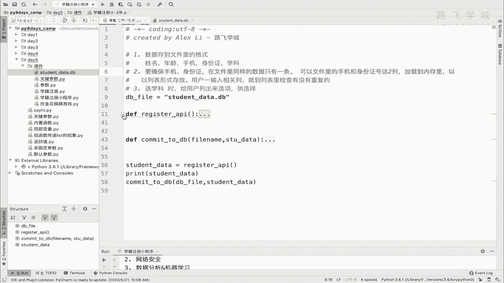

# 【2024年Python】8小时学会Excel数据分析、挖掘、清洗、可视化从入门到项目实战（完整版）学会可做项目 - P65：10 学籍注册小程序代码实现 - Python金角大王Alex1 - BV1gE421V7HF

OK同学们到此为止呢，函数这个啊语法的一些知识，我们就给大家讲完了，那接下来我们就可以用它来嗯去做练习了啊，那首先要说还是那句话啊，咱们这个集训营啊，这只会讲一些函数常用的一些知识啊，啊语法。

那函数还有很多复杂的东西，比如说装饰器呀啊生成器啊，还有B包啊，来自678糟比较多，但是这个就不在咱这里设计了啊，那个毕竟对吧，这只是一个快速的集训营嘛，啊那嗯希望你们报我们的大课啊。

这个正式课程里会有讲的很细，Anyway，那很多同学就是学编程，他会他会他会有很有一个很苦恼的点，就是说老师诶这个语法我也会了，那个语法也会了是吧，但是你让我组合起来，让我去啊写一个什么样的需求啊。

做一个什么东西啊，那我就不会，我就没有思路啊，不知道怎么做，所以呢咱们才会涉及一些练习题，还强制的带着大家把这个思路给大家打通，给他打通好。

那直接咱们就进入这个这个，学籍注册的一个小程序啊，用函数来实现需求，写的很清晰了啊，要求这个用户啊输入这个姓名年龄，手机号，身份证号所选的这个课程，然后为学生完成注册，比如说你在咱们路飞啊报一个课程。

那我们肯定需要你填一些基本信息，然后把你这个选报的哪个课啊选上去，最后让你交钱是吧，那呃然后呢，他第二个要求就是说哎，用户输入这个手机号和身份证号是唯一的，也就是说啊怎么讲。

也就是说你这个这是确认你这个人身份的，你的姓名可以重名，年龄可以一样，但是你的手机号和身份证必须是唯一的对吧，一个人只能报一次课啊对吧，那另外第三个就是可选的课程啊，这个不能随便报啊，你这有固定的学科。

比如说我们用Python linux网络安全这几个课，从这几个里选，第四，把学员的信息存入文件诶，就是这个需求就是这个需求，接下来大家我给你的建议是说，你花一个30分钟的时间啊，想思路啊。

并且同时去尝试去去写，OK吗，哎自己去写啊去搞，然后呢过了30分钟，甭管你写成什么样，如果你能记住写出来，你就多花点时间，如果写不出来，那你就继续的啊，在这个看我接下来讲的视频好吧。

那接下来我就给大家讲思路了，那我强烈建议你要先做一做，为什么，因为你不做，你直接去啊，听我的思路的话，其实呃你没有一个那种就是就自己憋，然后呢憋不憋不通，然后后来别人给你一指点。

你用那种茅塞顿开的感觉对吧，这个东西就是哼叫茅塞顿开吗，上上厕所对吧，你自己先先没有那种憋的过程，所以最后我给你用上开塞露是吧，这个这个这个这个这个这个，你你你没有那种爽的感觉对吧。

你只有自己变得很难受了，然后最后夸开塞露一来顺畅啊，顺畅啊，把一周的屎都拉出来了，哎不对，这个例子不太合适吧，anyway啊，咱们就啊我就我就继续了好吧。

我就继续了啊，那我就给大家去讲，咱们这个啊，就是把这个代码把这个需求怎么做出来啊。

学籍注册小程序啊，那要实现这个需求呢，我觉得第一点啊，首先你要嗯你要确认说他要首先你你怎么讲，你这些要用户输的这些东西，肯定都是要存到这个啊文件里面，存到文件里，所以呢呃这个倒好弄对吧。

我们就是让用户输入这几个字段，然后给它存到文件里就行了，我们需要先确认一下存到文件里的这个格式啊，这个数据对数据存到文件里的格式对吧，你是呃这个一行算是一个学员信息啊，还是说怎么着啊对吧。

这个需要确定清楚，我觉得我们就可以按一行就行了，然后比如说开始是姓名是逗号，年龄逗号，手机啊，身份证，然后呃学科对吧，所选的学科哎，这就是一条信息，那这个你应该会吧，就是从用户那拿到这些信息，让他输入。

然后你给他变成存到这里，对不对，怎么存文件，我也交给你了是吧，哎第一条确认了，这就这个确认了之后，我们接下来第二一个一个面临的很重要的问题，就是说如何实现啊，手机号和身份证号的一个唯一，对不对。

如何实现手机号身份证号的唯一，这是个问题呃，大家想想这个怎么做呢，这个怎么做的，实现手机号身份证号为一，那是不是就要缺了，因为呃他的意思就是说，是不是确保要要确保这个什么呀，手机身份证。

手机啊或身份证对吧，这两个都是它是两列嘛，对不对，在文件你啊这个啊同样的数据只有一条，对不对，比如说我这个手机是单独一列，这一列里面只能出现这个，这同样的手机号只有一条，是不是啊，那你怎么去实现呢。

也就是说你相当于你，你只能是循环这个文件里的所有数据，去判断这一列有没有，比如说当用户输入一个手机号，你要循环这整个一列的这个文件，然后判断里面有没有同样的同样的手机号对吧，就循环判断一些。

所以就说你得把文件里的那些数据，所有的应用学员数据加载到至少这两列吧对吧，至少这两列吧，加载到内存里，然后呢这个用户一输入，你就到这个内存里去判断对就OK，或者当然是说你不加载那条件。

就是说用户啊你你这个输入完之后，你直接到文件里去循环啊，那个就是那个也行，但是你就得不断的每次循环一遍文件，每次循环一遍文件吧，所以我觉得就是说可以把这个什么呀啊，把这个文件里的啊手机和身份啊正号是吧。

这两列这两列啊这个加载到这是呃，加载到内存里，对不对，然后用户然后这个用户一输入啊相关列对吧，比如说是手机或者是身份证号就到啊，就到这个，比如说咱们加载的那两列，给它搞成两个列表好吧。

加载的那两个列给它搞成列表嗯，比如说你列表，啊sorry已列表形式存放对吧，然后呢，用户一输入啊，就到这个列表里，列表里检查有没有重复的，是不是就能实现了这个啊什么呀，唯一性的一个检查。

是不是哎这就这个问题就解决了，那接下来就是一个第三个问题，第三个问题就是说可选的课程只能有这几个。

不能让用户随便输，是不是啊，那你让他这几个，那你怎么办呢，对吧，只能让它这几个，那其实也很简单呀，就是其他的，比如说输入姓名，你直接都都是什么input，什么什么什么是吧，但是到到这个输入课程的时候。

你可以先给他打印一个选项，比如说哎你要选哪个课，让他选哪个，让他输入那个对吧，你选择的那个值啊，就是就是让他输入，你给他列出来那些值，如果他输入的不对对吧，你就这个报错不就完了吗，是不是啊，是啊。

选学科时啊，给用户列出来选项啊，供选择是不是共选择，OK那基本我看看这三点完了之后对啊，其实就是解决这三个问题就可以了对吧，解决这三个问题这个事就好弄了啊，我们在这里尽量要用函数啊，就要用函数。

so所以我们来先解决第一个问题，第一个问题好吧啊，直就是先这样先让用户去输入这些信息吧好吧，我们输入信息这个东西也可以给它变成一个啊，变成一个函数，就是呃register呃，Registration。

register就是注册嘛，GISTER啊，然后register interface API接口好吧，接口，然后直接这样写嗯对直接这样写，先打一句话吧对吧，呃欢迎来到啊路飞学城对吧啊，点center。

然后我这个宽度十后面加一个这个这个吧好吧，那接下来就让用户输入啊这个信息了啊，接下来输入信息了，就是你呀，你去请完成学籍注册好吧，学籍注册，然后后面这个就不用这个了，那，接下来呢就让用户输入信息了。

就直接是name等于一个input啊，姓名，rip对不对，然后it啊，年龄，年龄还有什么呀，手机号是不是手机号，这个咱们应该说是说用户一输入这个，就要进行这个唯一性的检测，比如说输的不对什么的。

咱们先先这样，先不检测，咱们先把这个第一个需求完成啊，再去实现第二个好吗啊，接下来是身份证号，还挺麻烦，身份证号啊，这个还叫id number吧好吗，接下来就是这个叫什么所所选的课程了。

所选课程这个地方咱说了，你你你你不能让自己输是吧，你要给他可选项换上，我们可以定下来，这个课程就是cos list吧，先存到这个里面，然后呢，比如说啊咱们有Python开发。

加上A加上这个啊LINUX云计算，云计算，再加上网络安全是吧是吧，还有这个数据分析，数据分析and机器学习，再加上这个叫前端开发，你看看你们感兴趣哪个，然后给用户直接打印嘛对吧。

直接for这个呃index，然后cos in enumerate，刚学了对不对，然后cos list，然后print f，然后index点这个有个选项，然后POS，直接掉看行不行啊，就让他用户选嘛。

然后给用户一个选项啊，就是selected pose，等一个是吧，等一个这个叫啊啊叫什么input input啊，选择想学的课是吧好，那接下来这个用户输入完了之后，你是不是就要判断啊，就判断它。

首先你这里是直接输出索引了对吧，那你让他通过索引啊去找这一找，找到到到这个列表里找对应的课了，所以要判断他说的是数字，if selected is digit对吧，如果他说的是一个数字。

我就把它转成一个int int，它必须得是int嘛，咱们去，那你去作为一个索引值去取吧啊selected right对吧，那接下来你是不是要判断，比如说你这个索引它是从零啊，就这样吧。

咱们先来咱们先来试一下吧，要不然你可能不太好理解了，直接register API好吗，我直接执行一下，大家来看一下啊，Alex01，然后我的年龄是22岁，我手机号得得得得身份证号得得得得得得。

接下来你看是不是让我选课程啊对吧，那这个时候就涉及到了我说的必须是数字，然后呢我的可选空间是0~4，是不是啊，我如果我不能输一对吧，我也不能说输输这个输这个啊，输这个五，你说你说是不是啊，我想想啊。

我看看我输四行不行啊，对我能输四是吧，我我我不能输五，对不对，五应该已经超出这个范围了，所以我输的值是大于等于零，小于小于四，小于五是吧，大于等于零，小于五的话，那怎么去判断呢，大于等于零。

我们知道那个怎么得到一个小于五，因为它可能是我现在这个课程是五个，但是我有可能说增加七个八个，我是动态增加的，所以你不能在这里说啊，这个小于五写死，你必须动态获取这个列表的长度，是不是列表长度就可以了。

认识一下这个列表是不是正好五个，你小于小于列表的长度不就是四吗，最多能理解意思吗，所以我们一直在这个地方呀，就直接if这个selected course啊，大于等于零对吧，他如果属于大于0and。

Selected course，小于个length，这个什么认识这个cos list是哪，对吧哎这个代表他就是一个合法选项，对不对，那这个时候我们就去这个列表里，他这个课程列表里去取这个值就行了。

是不是取这个值了，就是他选的就是那个呃，选的是哪个，就就就就是那个吧，那好嗯，就去取这个值，取这个值取到取到这个倒没问题啊，这个取到很简单，其实就是啊直接是cost list。

然后selected co是不是就可以了，这就取到这个值了，但是取到之后我们给他把这个东西放哪了，哦对对，存起来是不是啊，就是就是我看一下啊，course啊，这个啊，这里已经有了，就给他存个值吧。

叫再起个什么名字啊，pk的吧，选中的是选中的cos啊，或者对选中的cos等于它对吧，这个是已选中的课程啊，选中的课程好了，那你看我们啊就是这个如果不合法不合法，那我们就给他打印一个说啊print嗯。

不合法的选项，不合法的选项啊，当然啊你可以在这里加上什么循环输的不合法，让他重新输对吧，但是我们在这里就不搞了，我们就不合法，这样吧，不合法直接就退出了，好不好啊，不合法直接退出了啊，包括这个地方。

如果输的不是啊，不是这个什么不是这个啊，叫，sorry不是这个数字的话啊，我们在这里对吧，也是啊，非法输入对吧，咱们就直接退出好吧，OK那到此为止，咱们看啊，看一下看一下，就是选的课已经完成了。

然后相当于用户，你要求就是你要求用户输的信息，用户已经输完了，输完了之后呢，咱们接下来是不是要存到文件里啊，对不对，存到文件里，注意了，那好我现在想要做的是说存到文件里，我单独写一个函数啊。

因为尽量就是你定义一个函数是什么情况下，会定义一个函数，就是说你尽量把这些功能分开，我注册是一个函数，我我存文件是一个函数，明白意思吧，就是就别别把它整到一块儿啊，你整到一块。

说白了这个这个这个以后想改，我跟你讲就会互相影响啊，不好弄，所以呢我们可以这样啊，那那那那我既然是要这个写到文件。

也要单独搞一个函数的话。

我是不是要把这些数据啊，返回给就是给到给到那个函数。

另外一个函数是不是啊，所以我把这些数据存下来，然后返回到另外一个一个返回吧，直接给他返回啊，我在这里先这样，直接，啊data先给一个空列表吧，好吧，这个是一个初始初始化一个啊空空字典。

初始液化这个一个字典，还是为了为了为了后边啊存学员数据行吗，然后接下来在这个cos data里面，就把这些东西存进去，a student s t data里面对吧啊STUD，然后把这个呃什么呢。

就是name是吧，等一个name，然后这不是这不是正好吗，age这是age，然后phone就是phone是吧，然后还有啥id，就是id number，然后selected call。

然后就是cos就是pick的co，对不对，take cos是吧，这里就是因为因为啊这个有的同学说，你你如果不走这个，你看他如果不走这一条，那这个变量不就没有了吗，那你这里不就找不到了没错。

但是我这里已经限制好了，如果白说白了，也就是说如果这条走不到这个这个条件，这其他都是退出，所以他也不会走到这，明白意思吗，所以这个程序也不会有错啊。

那此时我最后就返回一个return一个t data就行了，可以吗对吧，然后我在这里拿到对吧，Student data，对不对啊，就拿到这个学员的数据，然后我直接打印一下就可以了好吗，可以吧。

OK那我们来执行一下啊，刚才执行过来，这个输入一个ALEX为呃，23了啊，手机号136得得得得得得，然后身份证号得得得得得得得得得得得得得，然后让我选一个课，选四，大家看看是不是生成一个字典。

然后这里面信息是不是都存起来了，非常的好完美啊，那接下来，咳咳接下来我们就写一个函数，就就把这些信息存到文件里就可以了好吧，按照咱们定义的这个格式好吗，OK把这个收起来写一个啊啊啊。

这个叫叫commit，Commit，就是提交啊或者save都行，commit to这个dB吧对吧，就是存到这个文件数据库里，那这个地方你注意了，你要把这个咱们数据库的这个文件，相当于对学员数据库的文件。

文件名给他传进去是吧，这个你说有同学说，为什么不在这里面直接写文件名呢，No no no no，我觉得还是传进去，因为你可能啊其他地方啊，也需要调这个数据库文件对吧。

比如说你你去从这个文件里加载数据的时候，就打开文件的时候，现在是往文件存嘛，打开文件可能也需要，所以我这样我就把这种可能到时会应用的这种，把这种文件名啊，因为有可能你以后也会改，所以为了啊，为了这个。

就是就是不在每个函数里把文件名写死，所以我建议你搞一个变量啊，Db file，然后给它起个名字，比如说叫啊这个student啊，data点dB吧好吧，那接下来我们就可以把这个一会调用的时候。

就把这个b file dol name给调进去了，然后呢，那你接下来要干的事情就是什么呢，打开你这个文件啊，先不一会打开吧，你还要你还要传什么，你还把那个学员的数据传进来，对不对。

STU把那个STU的data放进来好吧，然后在这里注意了，一般你的函数啊都要加注释啊，在这个函数你要告诉别人，你这个函数是干嘛用的对吧，我这个就是说把这个啊把学员数据啊，原数据存到文件里OK吗。

这个就是这个叫什么呀，学员数据库文件啊，学员的这个呃单个单个学员数据的啊，dict好吧，还是一个dict模式，OK啊，最终要返回什么数据，这个这个应该也会要在这里加上啊，好。

那接下来我们就直接是首先要打开一个文件O，然后这个file name对不对，然后你你是你，你打开这个文件之后，你因为这个学员这个数据里面，可能文件里面已经有学员的数据，所以你不是你不是创建。

你不能把旧的给它清空掉，你是往后面追加，是不是，所以我们应该以A的模式打开，是不是A的模式打开啊，没错吧，接下来你要拼凑啊，也就是说存到行里的这种文件格式，因为传给你的这个字典呀。

你把它拼凑成这个格式是不是啊，所以呢你在这里就呃我想想一叫直接叫肉吧，行啊，这个呃然后给他拼一个字符串吧，只能是拼字符串了，对不对，拼一个字符串就是看一下嗯，对直接这样写就是什么呢，第一个是姓名。

是不是啊啊still sorry to data，然后里面写一个单个写一个name，是不是啊，然后呢，接下来active data啊，这个没什么，没什么技术含量，就是这么拼呗是吧。

s t u data啊，有些同学说你这你要写那么多，那没办法，这是s to data哈，因为因为你只能这么拼啊，因为他这个行是有顺序的，他这个列是不是啊，那你这为了这个事儿。

你在写什么循环啊什么的就不好，就不太好弄了，更麻烦，还不如就直接这样停了，是不是啊，呃s t u data这个呃，这个这个这个叫叫叫叫叫叫啥呀，身份证号是吧，id part id number好了。

最后一个啊，最后一个叫s t u data下的啊，cos好，最后加一个换行符，别忘了啊，该换行符，那好，你这样拼完了之后，直接F点white就可以了啊，F点white roll是不是就可以了呀，对不对。

然后F点close就行了呀，你就存进去了呀，同志们，你是不是就存进去了对吧，那好我们就可以试一下啊，我们可以试一下，然后同志们，那接下来啊，我们需要做的事情就是先去先去先去调用，先去这个什么呀。

调用这个注册注册接口，然后调用完注册接口之后呢，接下来第二步就是把它存到数据库里，是不是把它存到数据库里啊，那就直接是commit to这个dB，然后dB file啊。

把这个t student data也传进去，是不是，那就OK了，这个时候我们就来看一下能不能传到数据库啊，这个文件里就可以了，是不是能理解吧啊，好ALEX雷，然后24了，然后136身份证号对对对对。

然后三大家看一下文件有没有啊，哎我看看啊，哎我那个函数我靠，我这个写到这儿了，是不是随机注册小程序，Sorry，我写到这了，那好咱们这个文件应该就在这，对不对，大家看哦，我之前我我这不是新创建的文件。

我之前是做测试的哦，我我我本来以为是会这个这个，这个就之前我本来就有这个文件啊，但但是没关系，我即便是哦之前有这个文件，所以它没有报错，因为你要直接是A的话，他还真会报错，因为这个文件不存在嘛对吧。

文件不存在嘛，因为我之前创建了一个文件，你也可以再初始化一个文件啊是吧，我就是之前测试的往下，但总之看这条数据是不是写进来了，同志们，那可以把这个啊删掉了啊，那是我测试的啊，如果你是个新文件。

刚空文件的话，你是不是就应该是这个，对不对，那同志们，我当然我可以再写一条啊，就是jack啊，呃四大家看是不是就又多了一条，没错吧，好到此为止，咱们至少已经干嘛呢，完成了哪几条数据，哪哪个情况呢。

第一个啊已经完成了，存到文件里，对不对，呃，选学科也已经完成了，接下来其实就是差最后一个了，就是什么呀，啊，确保这个确保这个这个这个手机号和什么的，是唯一的核身份证，没错吧，OK这段代码还是可以理解的。

是不是啊，那好那接下来咱们下一小节给大家讲。

