# 【2024年Python】8小时学会Excel数据分析、挖掘、清洗、可视化从入门到项目实战（完整版）学会可做项目 - P66：11 学籍注册小程序-手机&身份证合法性验证 - Python金角大王Alex1 - BV1gE421V7HF

OK同学们，接下来咱们来实现这个功能，就是确保手机号身份证号的唯一好吗，咱们嗯前面讲到的就是说可以把啊，这个账户里面的这些数据加载到内存里，然后提取什么呢，提取手机号和身份证号这两列对吧。

把它分别变成两个单独的列表，用户一输入相关的列就去检测相关的列表，是不是就OK了呢，是不是，Ok good，那这个其实也很简单，所以我们接下来可以写一个叫做叫做啊，先把这个数据加载到内存吧好吧。

load validload啊，验证的数据好吧，validated啊，啊这个这个这个这个validate验证的data吧好吗，然后你要把这个文件名传进去，对不对，你看现在又问，就用到文件名了对吧。

这个file，Name，然后哎对就只传文件名就行了，那接下来就直接是打开就行了，呃，File name，那这个就是用R的模式打开，那呃你你你要加载那两列嘛，所以你要循环这个文件嘛对吧，加载两列。

我想一想啊，你就直接直接加载完了之后，是不是存到存到内存里，以列表的形式是吧，所以我们就直接搞一个吧啊p list对吧，放list，要一个一个空列表，然后id i d number list是吧。

也是一个空列表，然后for line in这个F它是这种的，你是不是要取出这两列来，先把字符串变成一个列表啊，按逗号来分隔，是不是啊，所以你就是line等于一个line点split好，按逗号来分割。

那第几列就是哪个是哪个呢，这是01232和三，是不是啊，所以就是那你的phone啊，这个这个是line2对吧，id number就是line3，对不对，就是这样啊，这个然后呢接下来你就直接把呃。

直接直接添加就行了，对不对，所以你就直接是FLIST点append你的这个phone是吧，然后你的啊这个id number list，这是在append你的这个id number，对不对。

你这样很简单就给它加进去了，加完了之后你就直接return这两个值就可以了，return这两个列表就行了，对不对，这是FOLIST，然后和你的这个id number list，看到没有。

哎你返回完了之后，你这里接下来你你你肯定要调用嘛，从外面去调用，然后你就这个啊，我想想对，在从一开始你就调用它直接是怎么写的啊，直接取这两个值就行了，在外边装list，然后加一个逗号for list呃。

然后这个接下来是i d number，直接等一个load validate，然后dB file i，注意的同志们啊，大家看这种写法，这种写法我这是应该之前没怎么教你啊，怎么讲。

你看它这个函数会返回两个值，是不是两个值，那你其实就可以用两个变量去接它啊，这就是两个变量去接它，这个其实就是相当于啊sorry，相当于就是跟这个是一样的，跟这个是一样的。

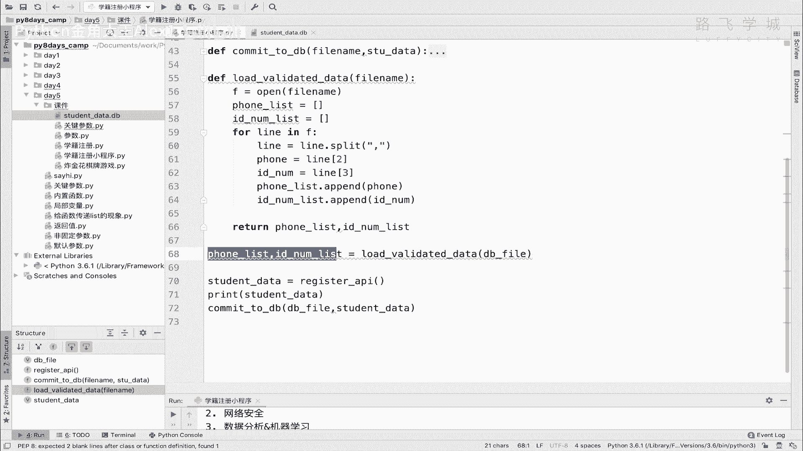

比如说给大家看一下啊，我在这里有一个啊，你A等于二，B等于三是吧啊，他是这样去这个定义一个变量是吧，但是你也可以这样直接是AB等于一个四五，看到没有，这样的话A就是四。

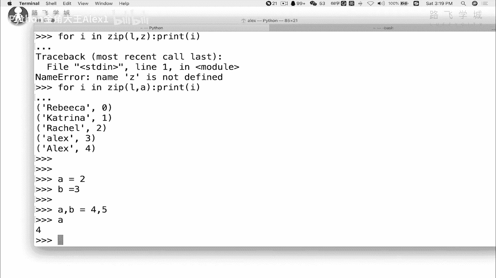

B就是5OK吗，也可以这样写哈啊加三个变量，四个变量都可以。

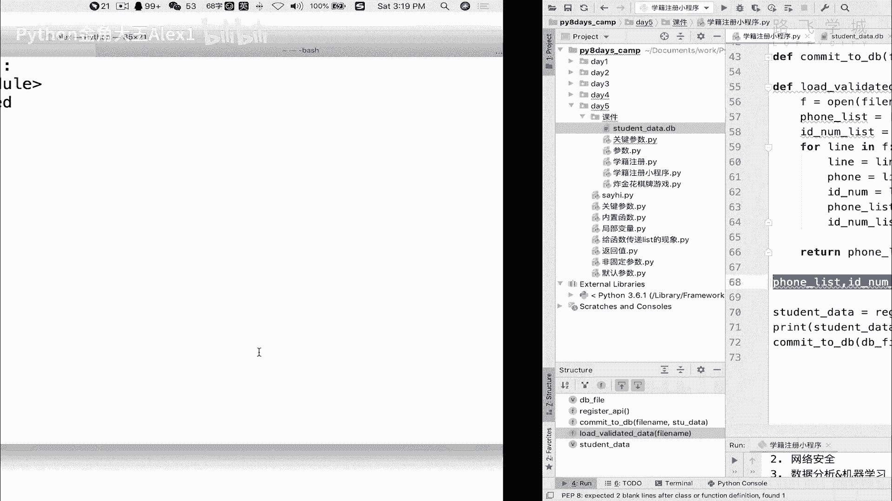

就这样就可以省一行嘛，所以你看我就直接这样写了，然后就直接读取这两就返回这两个值，是不是啊，虽然名字一样啊，但其实它是不一样的，它是从外从里面返回的，OK吗，他俩其实是没什么直接关系啊。

你你这个这个名字你可以随便起好，在外面OK拿到这两个值之后，然后呢我们在这个register API里面啊，就可以去调用这两个变量了啊。

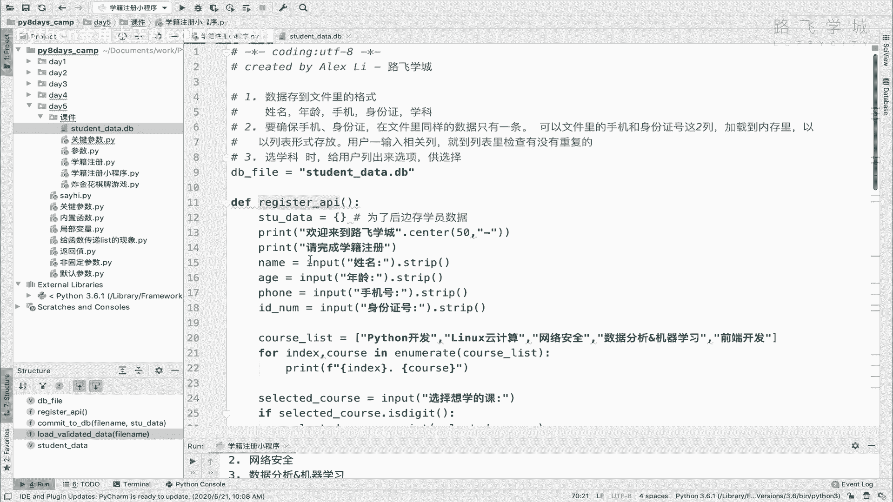

调用变量在用户输入手机之后，你就可以直接在这里判断，if for这个for in这个啊FLIST你就可以直接退出，然后我跟他说啊，这个输入啊就是该手机已注册对吧，然后同时这个身份证也是一样的。

if这个id number对吧，in这个phone in这个id number list。

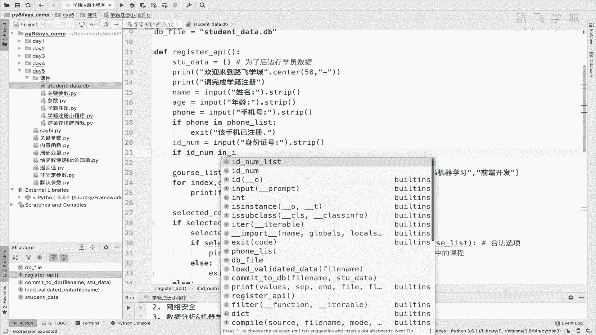

你也可以啊，就说该身份证，该身份证号，账号对吧。

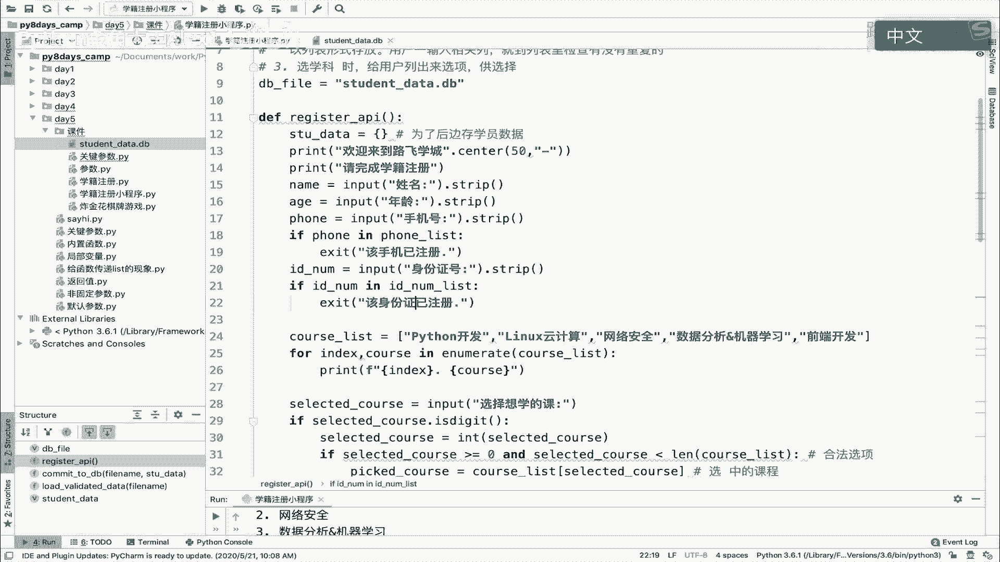

已经注册了是可以的啊，那你就退出了。

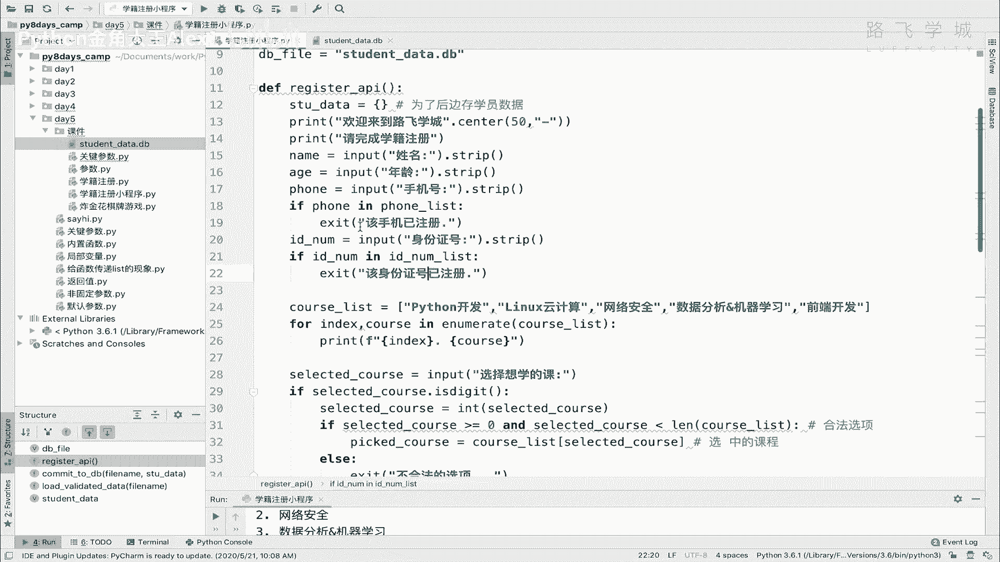

就不让他再再去注，就让他重新再去注册，OK吗。

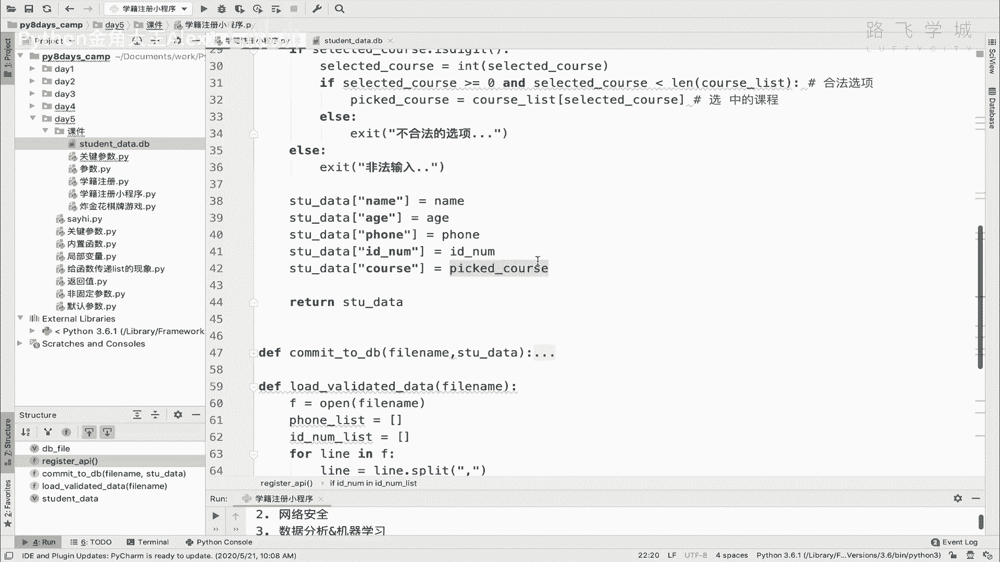

能理解这意思吗，啊有同学说你不是先定义再调用吗，你这个变量。

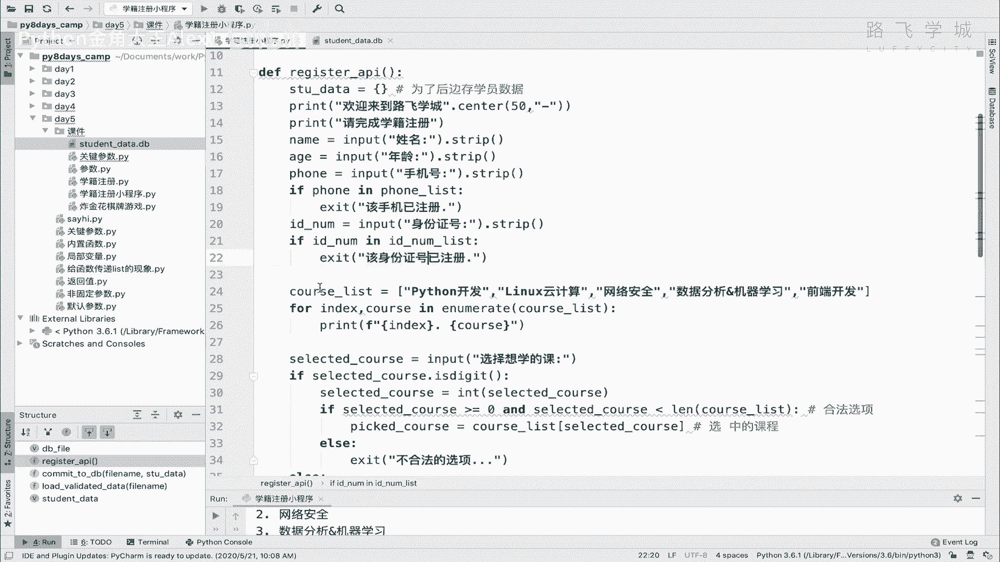

你这个你现在相当于你在这里，就在这个上面就已经调用了。

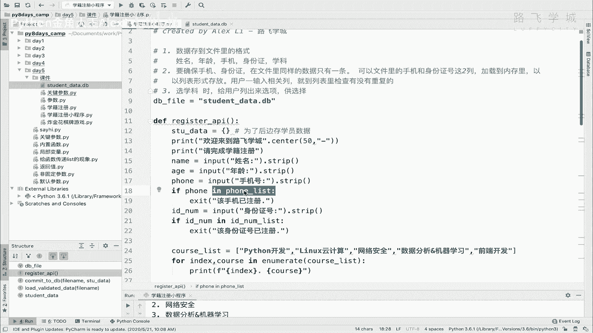

但是你的这个这个这个这个变量，是在这里才调用的，是注意了，你看你这个BGAPI不是在这里才调用的吗，这个函数在这里调用，它才会回到这里来执行，是不是啊，在这执行的。

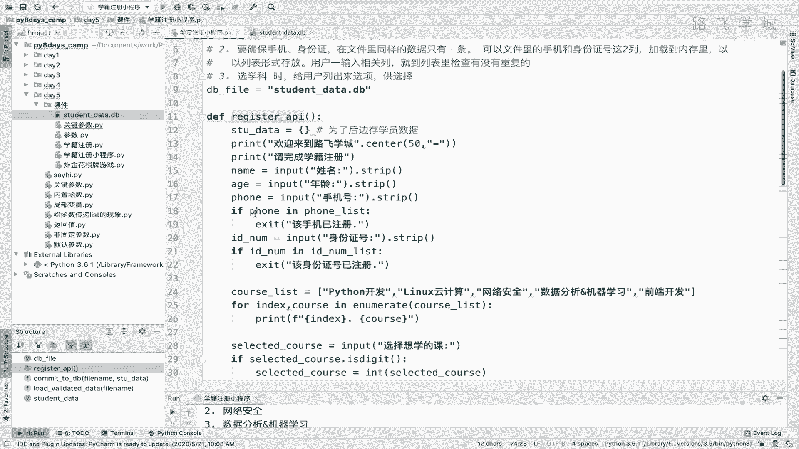

然后呢，你这个拿到这两个啊，列表是在它是在一个函数之前嘛，所以肯定也是先定义再调用嘛，对不对，那这个时候我们接下来执行就没有问题了。

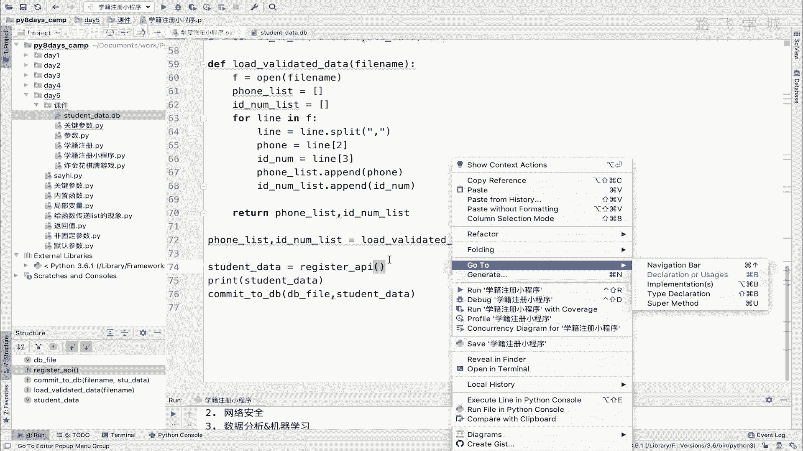

大家看一下啊，Alex，然后22这个时候输入一个手机号，输入一个已存在的手机号，比如说这个ALEX是不是已存在了，这个时候大家看是不是直接给你报，该手机已注册，是不是啊。

那这个时候我再输入一个麦克啊麦克，然后呢这个时候我手机号可以没事了，然后但是我的身份证号，比如说我输入这个，大家看是不是该身份证号也已经注册了，Very good，到此为止，咱们这个啊唯一性的验证。

其实就是啊唯一性的验证其实就写完了。

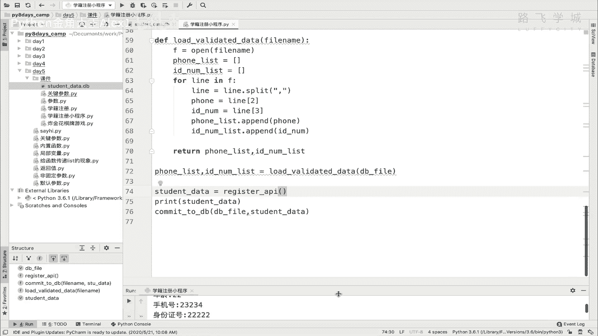

对不对，你看啊，整个的也挺简单的对吧，总共加起来多少也六七十行。

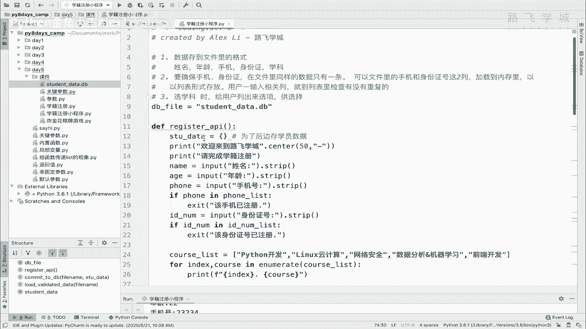

代码也还好也还好啊，没有什么太多复杂的逻辑，当然了咱们这个还是可以优化的，比如说你看啊，我现在只是检测了手机号唯一性啊，那真正你这个啊进行网站注册，或者是说什么学籍注册，你这个输出的手机号。

你必须还得合法的，比如说是得是11位是吧，得是11位，并且是什么幺三几开头，对不对啊，或者你说的邮箱是合法的，或者你输的身份证号是不是要多达到17位，还是18位，它有一系列的验证。

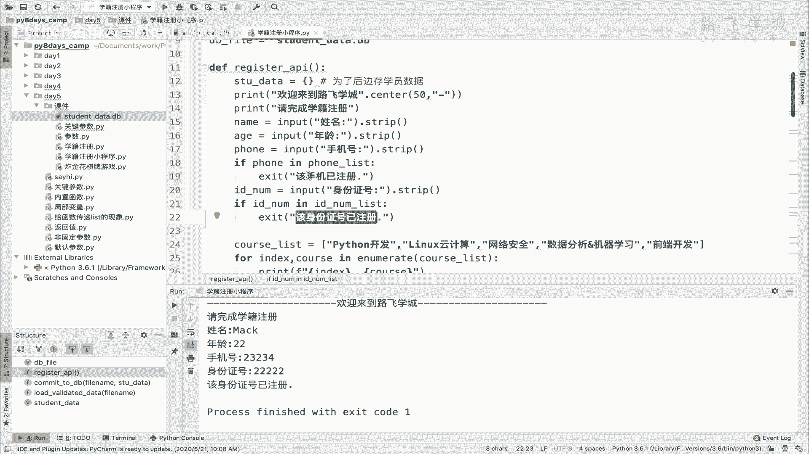

一系列验证，我们只是验证了一个简单的，其实进行即便进行一系列验证。

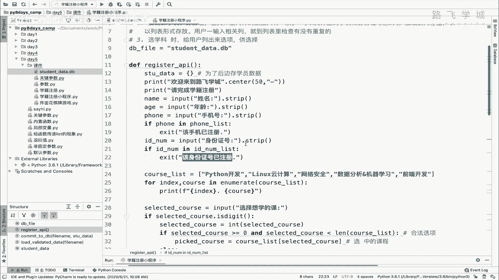

也也倒不难也倒不难，我告诉你一般他都干嘛呢，你现在咱们只是一个简单的验证，要一系列验证的话，你可以单独写一个函数进行一系列的啊，这个操作我可以简单写一个啊，比如说我把这个validate phone啊。

那你就可以把这个值传传进来对吧，传进来就是number，把这个number传进来，然后呢，你首先手机号它是不是得是啊，得是这个数字，得是数字吧，你看我这里的手机号，其实我并没有，我虽然输的是数字。

但是我没有验证，必须是数字，你比如说我输入啊啊啊，Sorry，我比如说你比如说我输的如果不是数字的话，它其实也没有问题啊，先pass啊，pass这个语法就是先先占位啊，就就不让他出错。

你看我输入的这个手机的话啊，我如果说一个这个他也没有报错。

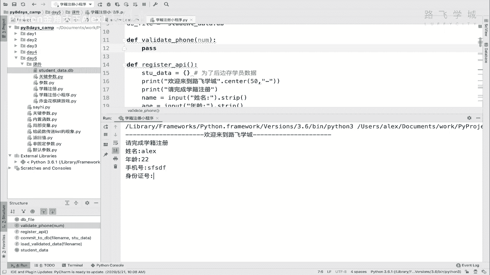

所以他这个也要验证了，所以我在这里其实可以先验证它是不是数字啊，If number there is digit，Is in digit，对吧啊，如果不是对不对，如果不是啊。

如果不是一会儿我就直接返回false了好吗，然后是数字的同时，接下来还得干嘛呢，呃接下来是要这个这个这个这个这个。

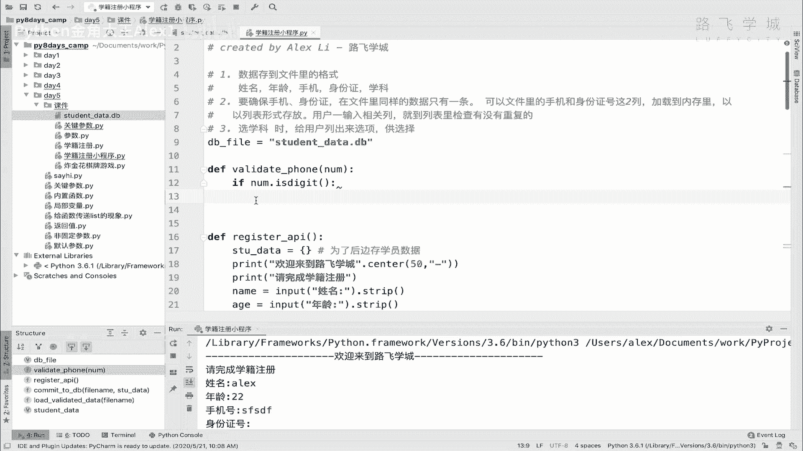

那我可以直接在这里直接在这里写啊，这个手机号不合法啊，必须是数字对吧，我就直接在这退出了，然后还有什么呀，我继续验证呃，这个他除了是数字之外，它的长度对不对，然后得是11位。

是不是if length这个number啊，这个小于11位啊，不等于11位，必须是11位对吧，然后依然可以说，依然可以说这个手机号必须是11位手机号，必须啊，达到11位，好的sorry对吧。

然后接下来当然你还可以，是不是幺三几开头对吧，还有一堆啊，还就类似这样的，你可以加很多的验证，加很多的验证，反正是只要一个不合格，你就退出了，你就退出，那你接下来到最后如果都验证成功了。

你在这里放一个true，对不对，就return一个true，所以呢你就直接在这个地方啊，在这个地方，然后哦对了你你看你这里如果验证不成功，他直接程序都退出了，所以return出不出都没关系。

所以你只需要在这个地方把这个手机哦，还要验证手机号为一性，是不是啊，唯一性你在这里已经验证了，验证完了之后呢，嗯对你其实可以，当然可以把这个唯一性也跟这个这个放在一起。

比如说那你说你如果把唯一性也放在一起的话，那你就得这得把这个FLIST给它传进去，就传到这个里面，他在这里面去判断也行啊，哎你自己可以合起来，我在这里不合了，我在这里就是相当于给你加上了手机啊。

就手机的这个手机号的合法性验证，你就直接在这里写validate phone number，把这个form传进去就可以了，你把方传进去，然后如果不合法，他就直接退出了对吧。

你写这个身份证号的注册其实也是一样的是吧，里面答不答，17位有没有包含特殊X啊，或者什么类似这种对吧，X是那个字符吗，这样的话，哎，你就相当于把这个单独的每个字段的验证，也搞了一个函数吗。

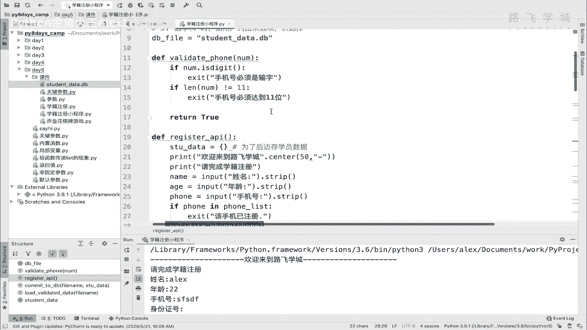

那我们来试一下，Alex，然后22，这时候你手机号输入一个这个，你看他是不是就直接就报错了是吧，是年龄也应该验证啊，啊我输入一个叫不到C位，哎我这个是数字is dj是不是是不是抄错了。

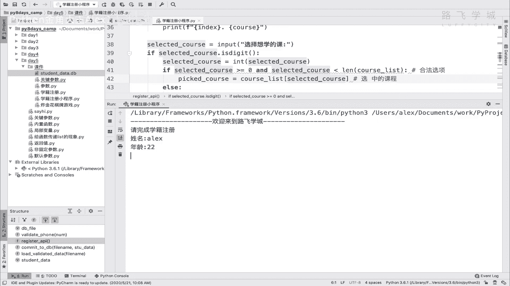

俺手机号必须是数字，Oh it's not，It's not，It's digit，It's not，对吧，如果不是数字对吧，它必须是数字嘛对吧，如果不是数字就报错ALEX。

然后这俩数数的首先不是数字啊，他就报错了，对不对，必须是数字，这个这个这个这个这个这个输了，如果是数字之后，接下来是不是必须得达标，达到11位，对不对，然后看着不到11位，没错吧，好同志们。

这就是单独的，有的时候说复杂验证的时候。

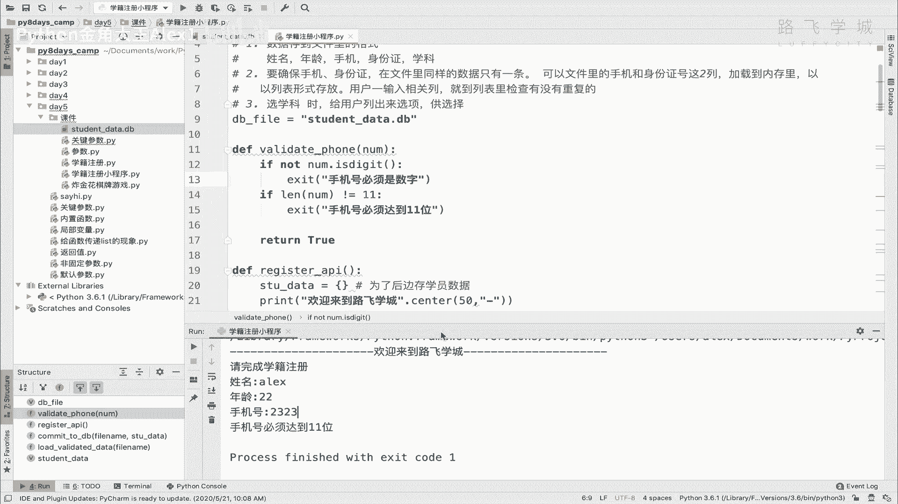

你可以把这个验证的这个字段，单独搞成一个函数啊，这样就比较简洁啊。

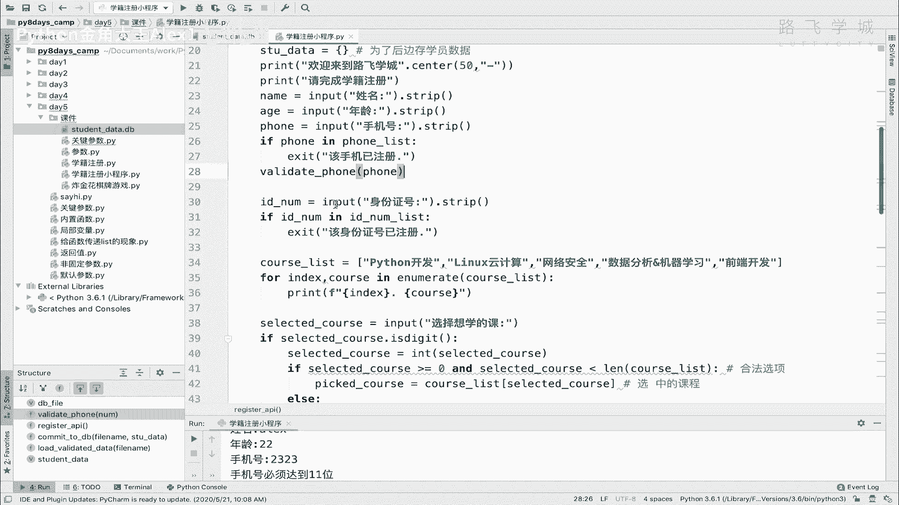

真正在以后生产环节就是你写复杂代码，其实也是这么玩的。

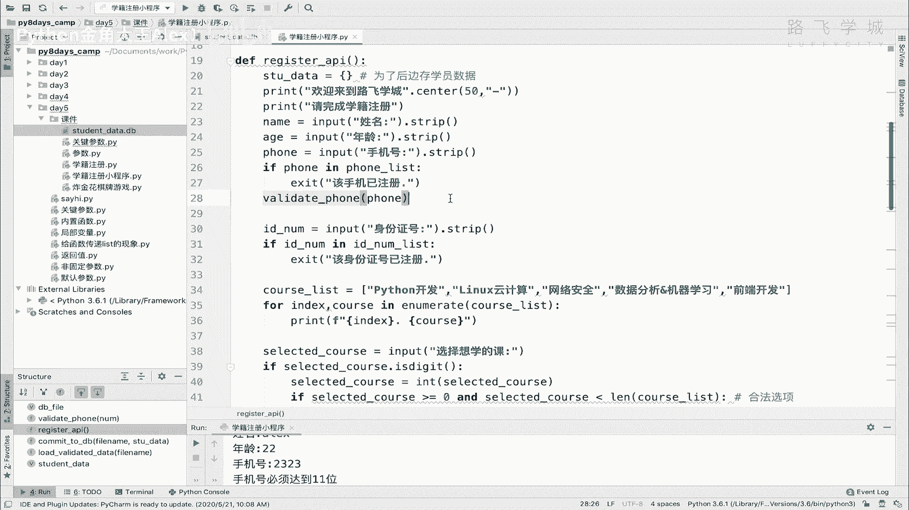

你看那个网站注册验证啊什么的，每个字段都有一个单独验证函数的啊，这个以后再讲吧。

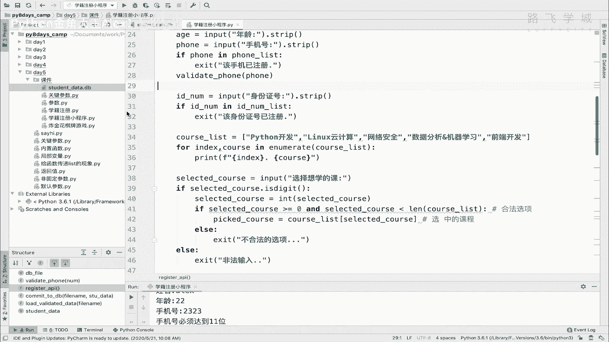

Anyway，这个就是咱们的呃，叫做学籍注册的小程序。

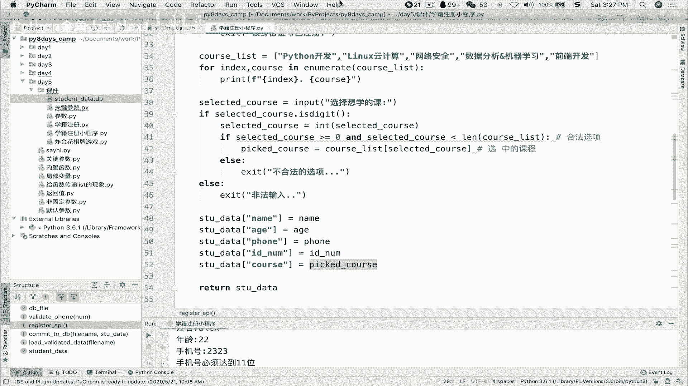

大家明白了这个思路之后，不要抄啊，自己看看能不能把它做出来啊，或者说你看跟你做的有什么不一样。

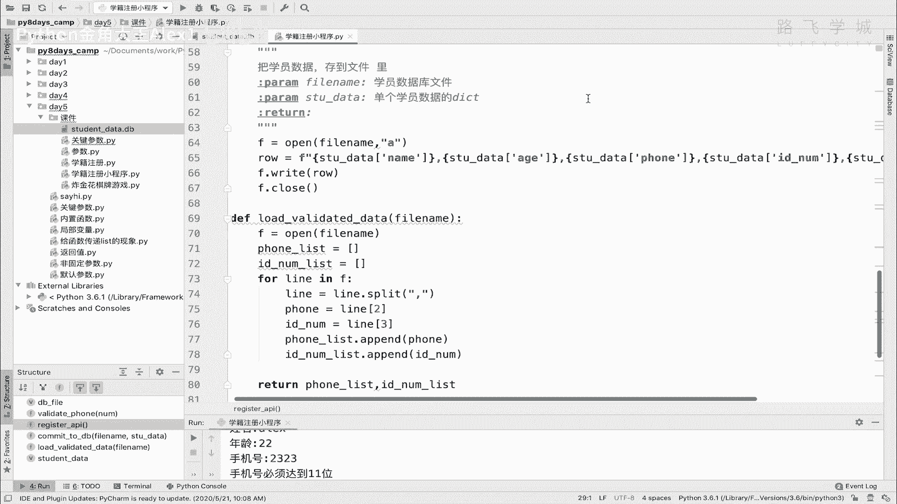