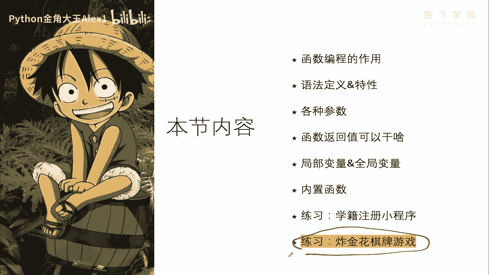
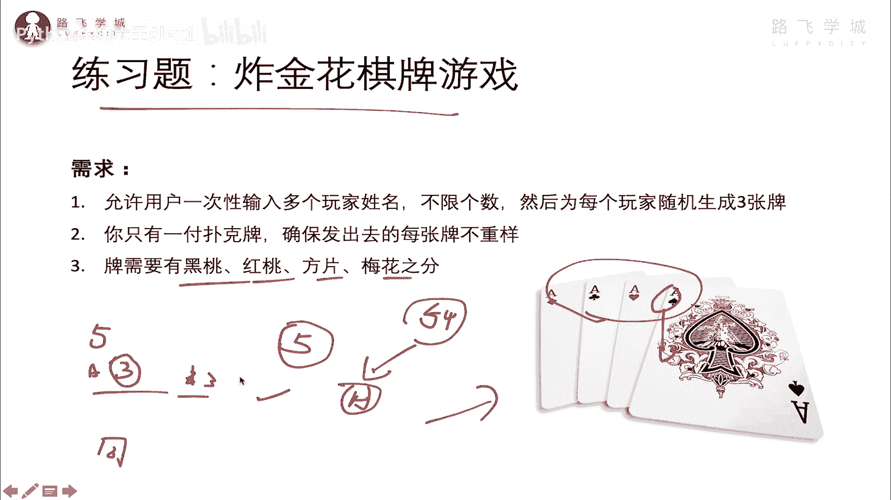
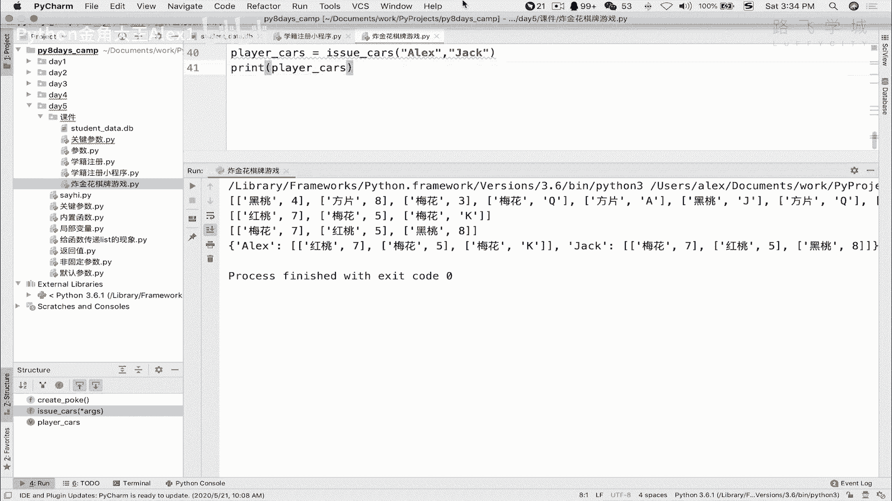
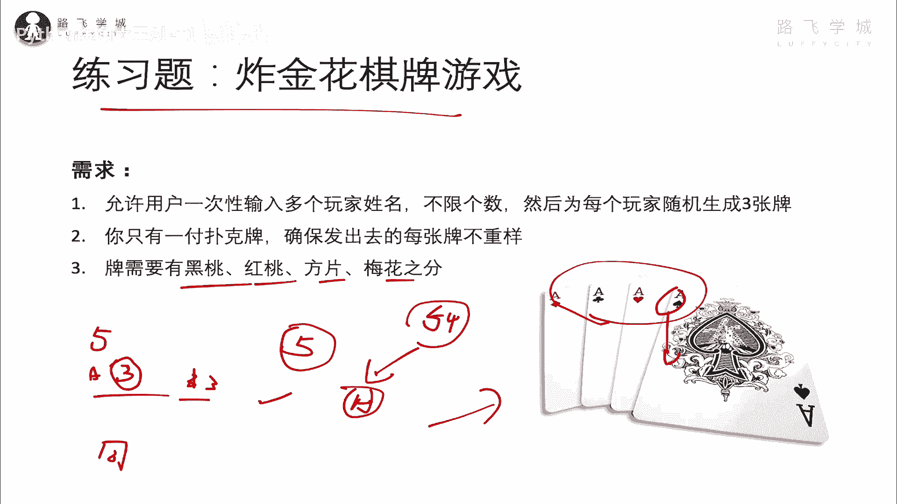

# 【2024年Python】8小时学会Excel数据分析、挖掘、清洗、可视化从入门到项目实战（完整版）学会可做项目 - P67：12 zha金hua发牌程序需求 - Python金角大王Alex1 - BV1gE421V7HF

OK同学们，接下来进入今天最后的一个啊练习题，叫炸金花的一个棋牌游戏。

那这个练习题呢我不给大家带这里代码实现啊，那个我让你自己写这个在直播的时候，直播答疑的时候我们看看啊，这个尽量抽时间给大家讲一下，你看你自己能不能憋出来，先就是大家玩过炸金花吗。

可能在座的女同学没有不怎么玩这种游戏，其实很简单，就是说白了几个玩家在一起，比如说有五个玩家，是不是，那每个玩家呢就是发牌嘛，统一发牌嘛，一共就是每个人玩家里面手中有三张牌对吧。

就是一次性的玩就就玩一次，就是发一共是发三张牌，这三张牌一次性发完对吧，一次性发完之后，每个玩家手里比如说A玩家是吧，有三张，B玩家手里有三张，那接下来这三张牌呢就开始对比了是吧，看谁的大。

他是有一些规则的，比如说你这个像什么同花呀，这不都是同样的花，然后比如说还有同花顺对吧，就又是同花，又是比如说678，它就叫同花顺啊，如果是678，但是不是一样的花，比如说有里面有方片，有梅花。

还有什么这个黑桃，那这就这就这样的一个678，它就叫拖拉机，它的它就比这个同花啊要小，比同花顺更小对吧，还有三个一样的，比如说三个A，这就是三个豹子，三个豹子，那他妈牛逼了，总之啊这就是一些玩法。

但今天我们要做的就是，不不需要让你看这种规则，这种规则就会比较复杂了啊，你现在做不出来，我们只需要让你完成一个发牌游戏啊，就是说我输入几个玩家，比如说我输入五个玩家，把这五个玩家的姓名输进去啊。

alex jack什么什么什么输进去了之后，你就统一的给我把牌都发完，也就是确保这个啊，确保这个每个玩家手里有三张牌，然后并且牌都是完全不一样的牌，就是说因为你这个一张一一副扑克，不就是54张牌是吧。

还50几张，那呃这50几张牌，然后呢，你你你你比如说你给这个给这个ALEX发了一张，那这个牌就没了对吧，你不可能说给ALEX发了这个，发了一个红桃黑黑桃A，结果呢又给这个jack也发了一个黑桃A。

那是不行的对吧，这张牌发给了ALEX，那其他人就没有这张牌了，明白这意思吧，哎这个牌需要有黑桃红桃方片，梅花就跟那个啊，这这这这这些之分啊，最终sorry最终发出来的，最终执行完了之后的结果就是啊。

你可以返回一个列表是吧，列表里面就是每一个玩家啊，每一个玩家都会啊，这个什么呀，这个这个呃有自己的三张牌是吧，你可能的结果啊。

就是就是这样，哎呀我这里给你写到这，我这里不能，我这里怎么给你写出来了，我直接执行一下，大家看最后的一个结果，你可以搞成是这样的啊，搞成这样，看到没有，ALEX有三张牌对吧，你可以字典的形式也行。

然后再可以有几张牌，看到没有哎，就把它梅花什么的，就这种方程列表就行了就行了，这你能返回成这样的一个结果就可以了好吗，OK啊，同志们，这个看看你们的能力吧，怎么把它做出来啊，这个并不难啊。

我在这不讲直播课的时候，咱们来看自己憋30分钟吧。

Ok good，到此为止，今天咱们函数就学完了，恭喜大家坚持学完了第五天的内容，那接下来你要靠你自己去练了C啊。

