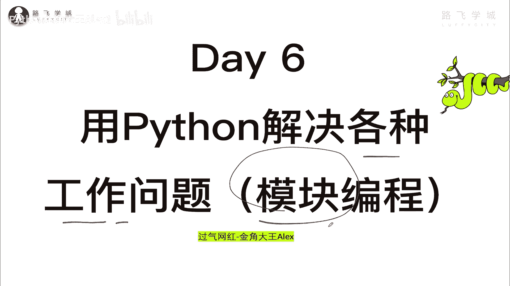
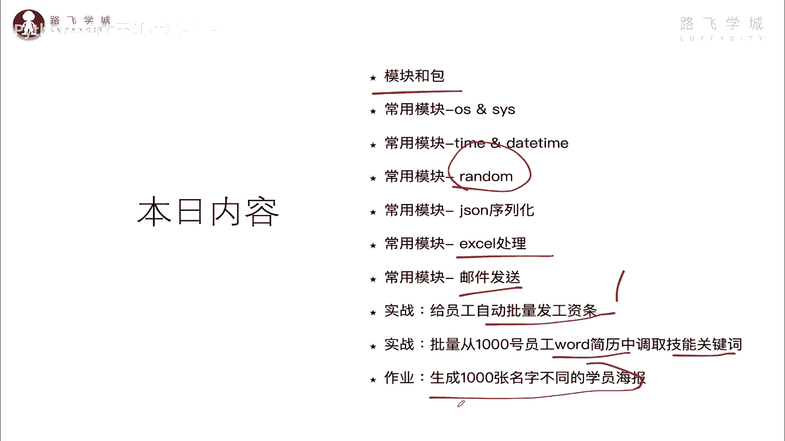
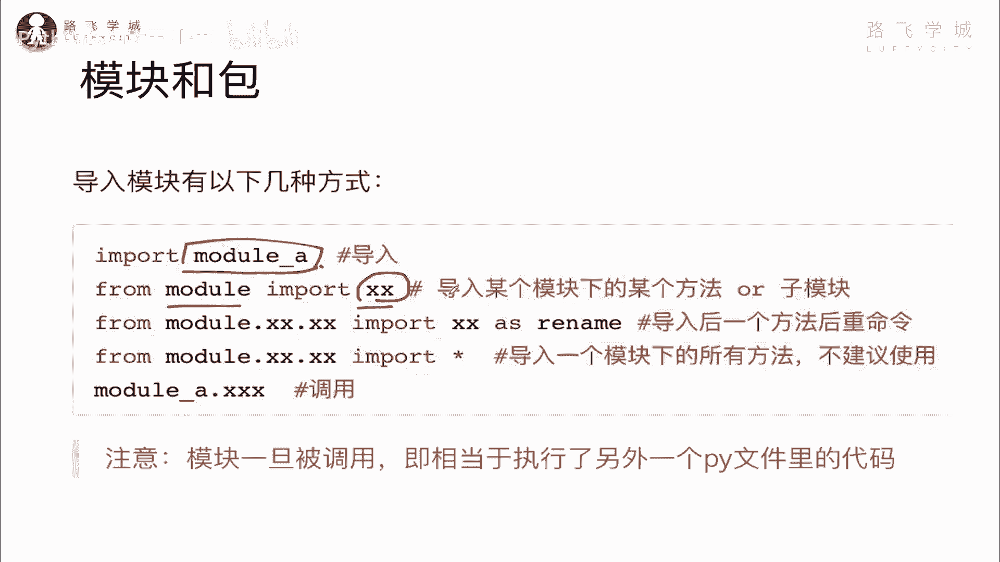
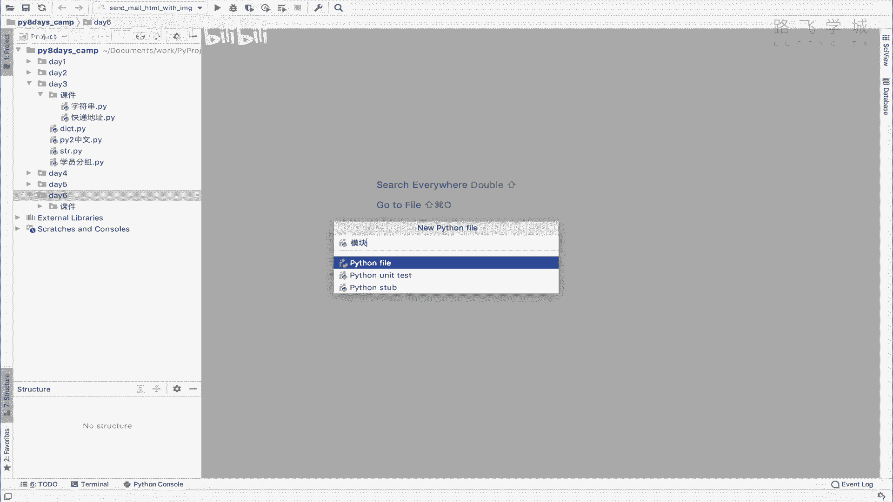
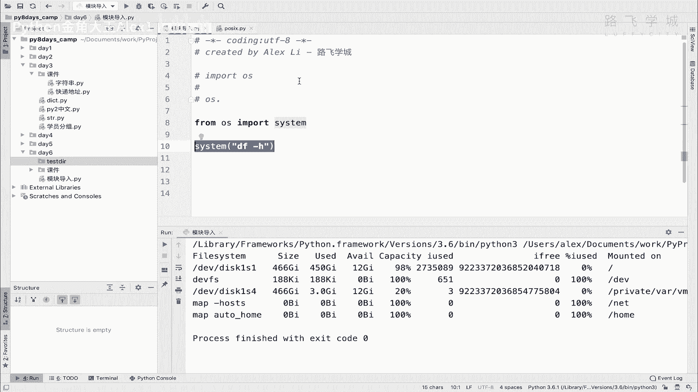
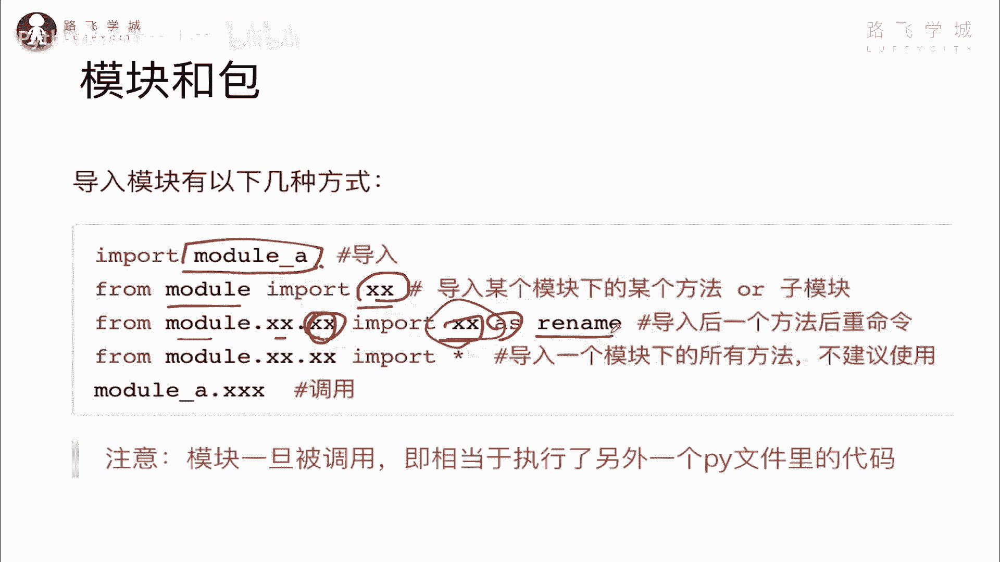
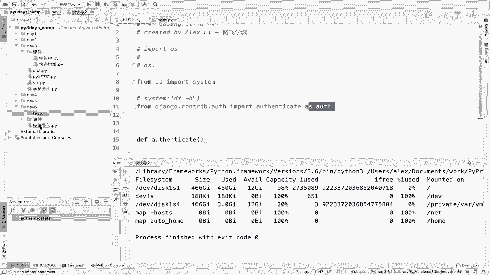
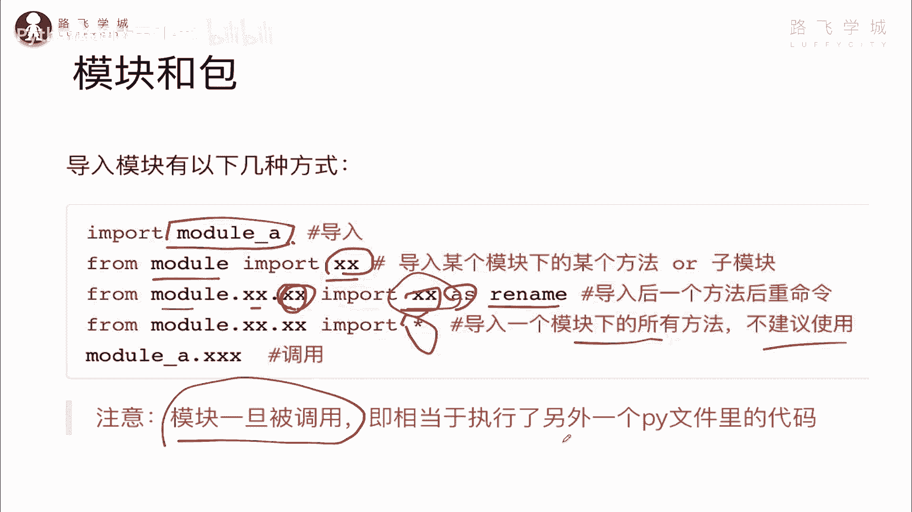
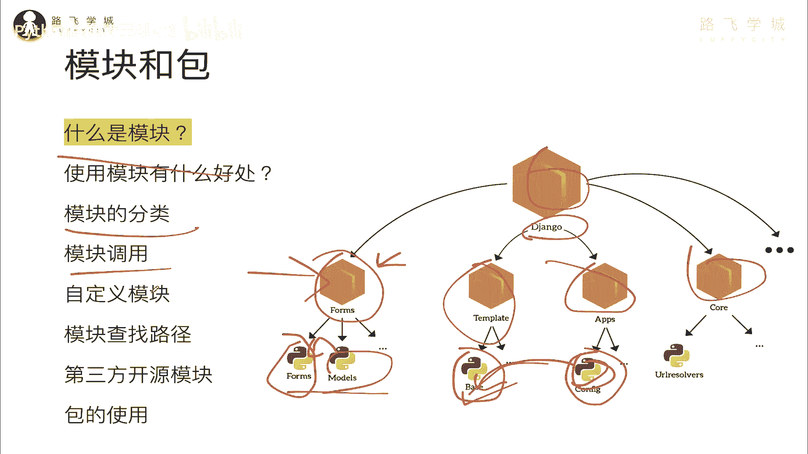

# 【2024年Python】8小时学会Excel数据分析、挖掘、清洗、可视化从入门到项目实战（完整版）学会可做项目 - P68：01 模块介绍和调用方式 - Python金角大王Alex1 - BV1gE421V7HF

OK同学们，恭喜你进入第六天的学习，那今天学完之后，你就可以用Python来去解决各种什么呢，工作上的，生活上的以及感情上的各种问题啊，工作上可以提高效率，生活上可以提高水平啊，这个感情上没对象的。

学完今天你就能找到对象了，哼有对象的学完今天你就要分手了啊，把你分手的女朋友啊分给那个没对象的啊，这个同学啊为什么分手呢，因为你发现编程更像啊，编程更像好，今天的这个重点叫模块编程啊，叫模块化编程。

然后呢，这个呃这也是我们要学的一个知识重点啊。

这是重点好吧，OK不废话，进入正题，那你看东西还是挺多的，我们要先了解什么是模块和包，唉，再去学常用的一些模块，有一些是你能看懂的，比如说excel，比如说邮件处理这个模块是什么东西。

之前我在咱们是不是调用过一个random的，这个东西，在第一天还是第二天，当时就说这就是一个什么呀，Python的工具箱里面有这个，它就是一个宝藏，里面要什么有什么，所以我们今天就把一些诶常用的哎。

这些宝藏给它挖掘出来用一用，然后呢借助我们学的这些模块可以去啊，这个干嘛哎做一些实战给咱们的员工，公司的员工自动的批量发工资条啊，比如说有1000号员工或1万号员工都无所谓，你就可以往他的邮箱里啊。

自动发这个工资条，哎我写了一个小脚本，我备课的时候写了之后就给了我们财务部啊，这个财务部门之前我每天一个个的艾一，一个个的这个这个发邮件，累死我了，发三小时，现在啊就直接一调脚本，2分钟搞定。

然后呢批量的啊从这个word简历中调取关键词，大量的员工简历是吧，哎然后还可以生成1000张名字，不同的学员，优秀学员的海报，所以你看都是说做一些办公自动化，相关的一些事情啊，咱们才学了六天就可以。

那你思考一下，如果我学了六个月的Python的话，那你就封神了啊，你就真的就你发现Python就是汇编程。

你你整个人生就完全不一样了，好吧，OK咱们先学第一小节啊。

先了解什么是模块和包啊，先看这个什么呢，什么是模块，这个咱们讲说在整个编程过程中，咱们现在可能只写了有上百行代码对吧，但是随着你这个软件越来越复杂啊，比如说你写一个游戏，像王者荣耀这种。

它有数10万行代码，你不可能把数10万行代码全放到一个文件里，对不对，因为数10万行代码这个这个里面有各种功能，有负责支付的，有负责这个买皮肤的，有负责判定你这个什么，你是打打游戏，打到第多少个等级。

就N多的，不同的这个代码就有可能是上万个函数，你如果全放到一个成一个文件里啊，理论上来说行不行，当然可以，理论上你放到一个文件没有问题，但是它维护起来非常的复杂，并且那么一个大的软件。

它不是一个人开发的，它是一个团队，可能好几百个开发人员一块儿协作开发，那好几百个人一块儿改这个文件，你想一想会出现什么情况，咱们现在有各种在线办公的，这种这种这种这种工具是吧，比如说像石墨文档啊。

像腾讯文档啊，你可以啊，好多人同时在线改一个word文档，你就想啊他就会人多了之后，他就会改乱了，这个刚添加一条，那个就删了，就就会很乱，你懂吗，所以也就是说好几百人在在协作开发的时候。

你不可能把这个代码全放到一个啊文件里对吧，你肯定要分门别类的去组织啊，去管理，就像我这里一样，你看到没有对吧，哎就就这里有很多个啊Python文件，然后呢Python文件上面还有一层层的目录啊。

这就是目录啊，文件目录，然后呢目录上面再有总目录，这是一个比如说这是个项目的话，你看这是咱们的jungle项目啊，Python的一个外部框架，然后下面他会有唉负责这个表单的，负责什么模板。

负责什么各种app负责核心功能的，唉就分门分成各个目录，然后下面又分成一个个的文件好吗，这个目录我告诉你，一会我们讲这个目录就叫包啊，就叫咱们Python的包。

那下面这些东西呢就是咱们Python的模模块啊，就是模块模块是干嘛，坦白讲它就是一个个的Python文件，一个Python文件就可以称之为一个Python模块，明白吗。

哎然后把这个Python文件放在各个模块之后，互相之间还可以调用啊，就互相可以引入，比如说我这个forms啊，可以引入这个module到这个里面对吧，互相引用哎这个，但是你这样看起来维护看起来比较清晰。

也知道每个啊这个是干这个的，这个是干这个的对吧，并且维护起来也方便，明白这意思吧啊维护起来也方便好，所以其实这个就是模块啊这个东西，那那好，现在我们说了，用模块到底有什么好处呢。

其实我在刚才讲的时候已经体现出一个好处，就是说它可以变异维护，没错，就是它最大的一个好处，就是提高了代码的可维护性啊，其次你编写代码呢也不用从零开始写，什么意思，比如说你写一个代码。

你不就是当你一个模块已经编写完毕了，就是你已经写好了一个模块，你就可以在其他的项目里面应用，比如说你举举个例子啊，举个例子这个啊比如说你写一个，你写一个网站啊，写一个网站，网站肯定有一个认证。

就是用户登录的一个模块对吧，你你要你要让用户登录这个用户名密码对吧，那每个网站都有用户登录的这些东西，所以你把它写好，写成一个模块，把它给它啊，这个放到一个文件里唉，封装好了之后啊，就放在一个文件里嘛。

然后以后你再写一个其他的项目，其他的项目也需要用户认证，你就可以把这个文件直接copy过去，把文件直接copy回在那个项目里，直接用就行了，你就不用完全从头开始写了，白这意思吧。

哎所以这个就是说啊这个怎么讲，还不用重重复造轮子，重复造轮子啊，然后另外一个就是第二点，就是你使用模块还可以避免函数名啊啊，变量名啊啊以及类名啊，后面我们学的啊，这种这种这种一些啊数据。

就是反正总之这个这个函数名，变量名的一些名称冲突啊，名称冲突，咱们知道你在一个Python文件里，你肯定不能啊，你在一个Python文件里，你写两个name等于一个什么对吧。

你比方说你写两个name变量，那他肯定是从上到下执行，第一个就第二个就会覆盖对吧，第二个就会覆盖第一个是不是，所以你在这里写一个二，你在这写一个三，那最终的变量它肯定是三，因为这两个变量是重名了。

是不是啊，但是如果你把它放在两个文件里对吧，放到两个文件里啊，那这两个变文件名的变量是完全互不影响的啊，互不影响的，所以呢就就是可以啊，避免这个啊变量名的一个冲突，哎这个就是使用模块的两个好处。

大家知道就行了好吧，然后接下来我们再来介绍一下什么呀，模块的分类啊，在模块Python里面呢，这个模块分为三种，第一个呢叫内置标准模块，又称标准库啊，这个拍也就是说什么叫内置内置。

就是说Python这个什么呀，你一安装Python的这个环境，这几个这些常用的就这些模块就已经自带了啊，自带了这个标准库呢，差不sorry这个标准模块呢差不多诶，差不多有300多个啊，有300多个。

也就是说，Python解释器自带有300多个常用的标准模块，比如说我们为什么可以直接直接import，什么OS模块，sees模块，对不对，还可以import random模块。

对这些都是Python自带的啊，因为什么呢，因为它就是说你可能写代码的时候，常经常会用到，所以Python解释器就给你啊，就就就就就就什么呀啊你你就直接调用就行了，调用就行了啊。

OK跟标准库这种自带的内置模块相相相对应，相反的一个是什么呢，叫第三方开源模块，这些开源模块是说什么呢，哎嗯它不会随着你的解释器去安装，解释器安装，就是你要是想用这些第三方开源的模块。

开源的开源就是免费的啊，可以免费用了，你想用这些模块啊，那你怎么办，你得从网上去下载安装啊，他Python有一个专门的这个官方的这个啊，就就就是一个宝藏库，就是对吧，就是你你相当于你看啊，就这么讲。

你Python的内置模块，就相当于你自己家里的小院子是吧，院子里面有一些工具好吧，你这个不用出门就可以把这个工具用上了，这个Python第三方的，这后边就相当于一片森林啊，这个森林就是在网上。

然后你要想想要任何的工具，你都可以到这片森林里去找啊，只要把它下载下来就行了啊，这个第三方开源后面我们会讲啊，另外还有一个叫自定义模块，自定义模块就是自己你可以自己写模块，自己写完模块之后呢。

你就可以自己用啊，自己用，或者是甚至你还可以把自己的模块啊，上传到这个啊这个森林里，然后别人也可以到森林里啊，去找到你这个模块啊，你自己写的明白这意思吗，好总之这个就是Python的这几种模块的。

这个这个这个类型，这个类型，接下来我们再学一个小东西，就是什么呀，Python模块的一个调用对吧，也就是说呃，你你你你你既然咱们讲了这个一个模块，其实就是一个文件，是不是啊，一个模块就是一个文件。

那那不同的模块之间就是好几个模块之间，是不是可以互相调用，对不对，它可以互相调用，然后调用的话怎么调用对吧，怎么调用，咱们来看一下，大家看你导入模块的方式有那么几种啊，有那么几种。

第一个呢你就是直接导入，看到没有，直接导入，后面就是写你这个模块名就可以了，写你模块名啊，然后呢一会我们试一下，另外一种呢就是说什么呢，这个啊叫from module import，什么什么什么什么。

这是什么意思，也就是说你你这个意思就是啊，你这个模块里面可能有十个函数，十个函数，你要是这样的话，它就把这个整个模块全导入了，你就可以使用模块下的，你就可以使用模块下的这个每个功能啊，它有十个函数。

你就可以使用这个十个函数，但是如果像这种的话，你不想要那其他九个函数啊，你只想要模块下的某一个函数，你就可以直接from module，import它的它啊，import来了。

这样吧，我给大家来试一下，看看这个效果好吧嗯，sorry快呃，模块导入是吧啊。

然后呢大家看我们啊，sorry我们知道已经咱们学了一个叫啊OS模块，对不对，import os模块，那应该学了吧，OS模块，OS模块呢后面我也会讲，它是一个做系，跟系统进行一个啊交互的一个模块。

系统交互就操作系统进行交互的，我通过OS就可以调用，比如说我去创建一个文件，创建一个系统上的文件，甚至说我去删除一个目录啊，甚至说我去执行一条这个操作系统的命令，比如说你是windows。

我可以执行一条windows的命令，执行一套LINUX命令都可以啊，所以你看OS点一下，你看你就可以用它下面所有的功能了，很多很多很多很多看到没有，其中有一个你看啊，这刚才看到没有。

这个有一个make dir，好像是哦，刚刚看到了，刚看到了啊，uh u啊，对，看到没有，我在这里是可以创建目录的，我一我一执行把这个目录文件放进去，他就把一个目录给创建了啊，你这个什么test这样啊。

咱们试一下会不会创建到这里啊，你看是不是我就在这里创建了一个目录啊，所以哎大家看我这就是导入了一个模块好吗，这就是导入文不用写了好了，我们知道说你想用这个模块下的啊，这个功能的话直接OS点对吧。

就可以调用所有了，哎这个就是说嗯你这样导入的话，哦这个模块下所有的功能都可以供你调用，唉咱刚才讲的第二种方式是什么，From module import，什么什么什么对吧。

那你不想这个你不想用它下面所有功能，你只想用某个具体的功能的话，怎么办，你就可以直接是from这个os import一个具体的功能，它里面很多啊，它里面有这个刚才咱们有一个mic d i r，对不对。

我们还可以有有一个叫什么cas system这个模块，这个system这个模块呃，system这个功能是干嘛的呢，它是让你去可以执行操作系统的命令，什么意思，点进去你看啊。

叫execute the command in the sub shell，什么意思，就就是说执行一个命令在SUSHELL，就是说他你这么一你这么一直一调用，相当于是说调用了操作系统的一个命令。

比如说我这是Mac上，我想查看我查看我的硬盘的一个啊空间，注意了，这样一一执行，它就会调用操作系统，就相当于他在这里给你，你看咱们在这里不是可以起一个terminal吗。

这个terminal就是直接调用操作系统的，这个命令了，是不是啊，哎相当于他在Python里面给你，通过这条命令，直接起了一个这样的一个terminal终端，然后去执行这么一条命令，明白这意思吗。

我们来执行看一下，看着大家看，你看是不是也也去呃这个呃执行了是吧，所以你这样的话就可以调用某个模块下的，具体某个功能，能理解这意思吧，哎这是from os import，具体的这个什么啊。

那你如果这样调用的话，你就前面不用再写OS点什么什么的，直接写这个你这个功能的名字就可以调用了，OK所以相当于就是你这个模块下有十个函数啊。

你导入了具体某个函数好吧，然后接下来还有一种叫什么呀。

诶from module，点点点什么什么什么import一个啊，import它，然后就到这里，我们还是跟上面一样的，你看from一个module啊，然后呢import什么什么东西。

这里是只不过是from modu，点点点是什么意思，它这里有好几层啊，他这就是说，你可以就是就是模块下面也可以有好几层，它是一个层级结构的，你可以导到找到这个总，你就可以只导入这个子模块啊。

相当于你可以理解为这是父模块，这是啊子模块，这是孙子模块，导入这个孙子模块，然后从孙子模块下导入一个具体功能啊，然后呢并且给它重名重命名啊，as看到没有as，然后一个新的名字。

这个语法我给大家来试一下啊，来试一下啊，比如说呃什么呢，首先我可以呃我找一个比较啊，比较比较复杂的模块啊，from咱看有jungle吗，对我们这里装了一个张口，就是咱们web框架，你看啊它这里面有很多。

我可以从这个括号里面，比如说从这个啊control里面嘛啊，然后你看下面还有什么奥对吧，他这个就好几层好几层，完了之后，然后呢我在这里可以import一个什么呢啊，Authenticator。

这是一个方法，看到没哎，这是一个它叫认证方法，那这个时候我就觉得这个名字长，我可以给它干嘛呢，直接给它改成as f，所以这个时候我调用的时候，直接调用else就可以了，我调用else其实就相当于它。

相当于是调用authenticate，只是我重名了，明白意思吧，你这个时候你重名重名了之后，重命名之后，你不能再写调用authenticate，因为它你说我就我就再写这个行吗，不行啊。

因为你应该给它改成这个了，所以你的调用方式就是这个能理解意思吗，所以这个就是重重命名，就是有的时候涉及设，比如说这个名字特别长，你可能给它改一下，或者你导入的这个模块，跟你这里面可能本来就有一个函数。

已经叫这个authenticate了，明白意思吧，你已经叫这个了，那你怎么办啊，你不你不想改这个源码对吧，你改把这个名字改掉了，那你就只能说改这里给他改一个别的名字，明白意思吗。

好这个就是啊这个form from什么什么什么as好。

那接下来我们再来看一个啊，From module，什么什么import星号哎，这个星号我告诉你不建议使用，为什么它是什么导入一个模块下所有的方法，什么意思，大家来看一下啊，还是这个你看我在这里呢啊。

Sorry，我在这里呢直接是from么嗯，from我就是sorry，我就直接from os import星，哎，我直接从from os import性会带来一个什么问题啊，什么问题。

就是说你你你你在调用的时候不用写OS点什么，什么什么啊，你不需要写OS点什么什么OS点什么什么写什么，哎，这样可以吗，不行吧，应该看哎，他说os not define，你不能，你别看它有提示啊。

它是不行的，因为为什么你你现在是直接相当于星号，是代表所有代表所有，也就是OS模块下的所有的这些功能啊，所以你理解为所有的函数都被你导入了，导入了之后呢，并且你调用的方式是这样的，看到没有。

你直接是这样就行了啊，直接这样就行了，看到没有，然后你这个OS你这直接make dir也可以了，看到没有，哎这个然后都可以哎，又多出来一个哎，有同学说这不挺好吗啊。

他相比这种说我要指定名字的去导入不挺好吗，当然不好，为什么，因为坦白讲我告诉你，你不知道你OS下面有多少个功能，你现在不知道，你看你点一下它可能有很多你都没认真看啊，你都没认真看。

那这个就会带来一个什么样的问题啊，带来一个什么样的问题啊，比如说大家来看啊，Sorry，还是大家来看那么多的功能的话，假如你你看就是说比如说这个write功能看到没有，write功能。

大家记得这个文件里是就文件描述就是这个啊，这里有一个write功能，然后你直接导入就导入了，然后呃假如说文件里面文件这里面文件打开，这里面是不是也有一个呃描述，就是呃F点哦，对那个冲突不了，Sorry。

忽略我这一句啊，你比咱再找一个别的吧，那对比如说就叫CHMOD吧，你看你现在相当于导入这个了，但是假如说我在这里直接也有一个也有一个啊，自己写了一个函数对吧，叫CHMOD，所以你这样导入了之后呢。

导入了你你这么一导，然后你调用的时候，说白了你以为你掉的是这个里面的这个呃函数，这个模块里面的这个CHMOD，但实际上你是调用了你本地的这个，并且呢这个你如果写的导入写错地方了。

你写的你不是写没有写到文件开头，你是写到它下面了，这会带来一个什么问题啊，带来一个什么问题信号，看着啊，对对吧，你带来的一个问题，就是说你在这里定义的这个函数，叫CIHMOD。

然后你调用的时候也是CHMOD，你认为你调的是这个，但实际不是它这里面的这个CHMOD这个方，这个函数已经把上面这个给覆盖掉了，所以就会造成很多的歧义，然后就出bug，明白吧。

你说我执行怎么不执行这个执行这个了，那就出bug，所以呢哎这是官，虽然它官方支持这么干，但是极力不推荐你直接这样导入信号，你要真想导入，你就直接像这样一样，指名道姓的我具体导入哪个方法函数。

然后呢哎就这样，或者是你导入整个模块明白吧，调用的时候用OS点什么什么的好吗，这个就是一个要注意的点啊，要不要这么干，不要这么干，然后呃sorry好，其他的呃，其他的就没了，然后那大家再再强呃。

这个这个注意一点，就是说模块一旦被调用，就相当于执行了一个另外一个Python文件里的代码。

明白意思吧，其实就是说咱们看到这个嗯。

看到这里，也就是说我从这里，假如说导入了这个模块里的，这个文件里的这些东西，相当于我只要1import，就相当于它会，它不是，相当于它就会把这个里面的所有代码执行一遍，明白意思吧，你只要1import。

它就会把这个文件里所有代码都执行一遍，OK吗，OK啊，一会我可以给大家试一下，好这个就是啊这个模块的啊，这个分类调用啊。

这几个简单的知识点。