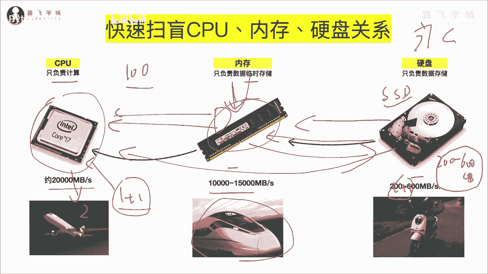

# 【2024年Python】8小时学会Excel数据分析、挖掘、清洗、可视化从入门到项目实战（完整版）学会可做项目 - P6：05 cpu 内存 硬盘 三大硬件的作用与关系 - Python金角大王Alex1 - BV1gE421V7HF

OK同学们，上一节我们写出了我们第一行Python代码，接下来我们学变量这个知识啊，学变量，那在学变量之前，我先给大家啊扫一下盲。

扫个什么盲呢，这个CPU内存硬盘这三大硬件的一个关系，计算机的核心硬件OK吧，以避免有些纯纯纯小白，真的他连内存是干嘛的都不知道，比如说我其中一个女朋友啊，她就不知道内存干嘛的，所以我要快速扫一下啊。

5分钟5分钟啊好吧，那首先先说这个CPU啊，毋庸置疑，大家都知道啊，CPU呢它是整个计算机里最核心最核心的一个啊，元器件啊，电子元器件，它的功能注意了，只负责计算，注意只负责计算啊，它就相当于人的大脑。

但其实又跟人的大脑不完全一样，人的大脑其实是负责两部分功能，一个是运算，就说思考啊，这就叫运算过程，还负责记忆，记忆就是一个是运算，一个是就是存东西，对不对，但是CPU它只有单一的一个功能。

只负责计算吗，他不负责记忆，不负责存储吗，所以它的存储在哪呢，存储在后面这两个一个是内存，一个是硬盘，那注意了这个内存咱们看啊，咱们你手机什么的，买手机也搓内存多大呀对吧，电脑买买电脑内存多大呀。

八个G，16个G哎，这个这个这个这个这个这是干嘛的呢，他负责存储器，但是他负责只是临时存储数据OK吗，临时存储数据，那为什么是临时，这跟他的这个啊，这个这个这个这个呃硬件的原理有关系。

因为它是是是靠电流来通电服务的啊，它的存储方式就靠电流通上电就有数据，不通电数据就丢了好吗，那先知道它是存数据的，那接下来硬盘硬盘也是存数据对吧，就这块啊，这是一个硬盘，这是里面的原理。

这个这个这个剖面图，这是一个什么类似光盘的东西，这还有什么磁头，这是磁头对吧，那这个硬盘也存东西，然后内存也存东西，对不对啊，那区别是这个硬盘是永久存储，注意了永久啊，我的字好看，永久存储好吧。

这个是临时存储好吗，那现在说了，CPU只负责运算，咱们就算1+1=2好吧，那1+1=2，你要想运算它的结果的话，你就要把这个这就叫数据源，是不是把这个数据源交给这个CPU，对不对。

交给CPUCPU运算出来，把这个结果告诉你啊，原来是等于一个二，对不对，那好现在问数据源从哪里来，数据源就从内存或者从硬盘里来，OK吗，咱们这样先把内存扔掉，不管啊，咱们就认为没有这一块。

只有CPU和硬盘，因为它的都存东西，我直接把这个数据源存到硬盘里，行不行呢，我的数据源在这啊，存到硬盘的一个文件里，直接给到CPU，可不可以，当然可以对吧，当然可以，然后呢运算完之后返回结果。

那好既然直接能从硬盘里取数据，那为什么还要内存这个东西，哎对了，这就是这个接下来就很关键了，硬盘因为硬盘非常慢，CPU非常快，就是就是这个硬盘赶不上CPU的运算速度啊。

它的它的它的硬盘和CPU的这个速度对比的啊，是一个什么情况，就像这个注意了咱们的这个硬盘啊，就像这个叫什么雅迪电动车，雅迪电动车跑起来的速度，这个CPU就跟飞机一样啊，你运算速度非常快。

你要把数据给到CPU，那CPU才能去运算，但是由于你这个硬盘的读取存储速度非常慢，所以你要把这个数，因为你要一存数据，先要这个磁头转起来啊，转起来就跟那个留声机似的转起来，然后特别慢，然后呢对吧。

这个把数据拿出来，找到这个数据在硬盘的哪个位置拿出来，再给到CPU，我靠这个这个对CPU来讲一年都过去了是吧，对CPU的这个时间感知好吗，所以CPU特别的快，硬盘特别慢，他俩之间产生了不可调和的矛盾。

再说一下这个速度啊，这个存储速存取速度啊，硬盘的存储速度啊，即便是现在比较快的这个SSD的固态硬盘，固态硬盘存取速度，也就是说在200到600兆每秒啊，之前那个什么IDE的那个硬盘啊。

机械硬盘他妈的不到100兆更慢更慢，所以就是你的电脑慢啊，不不不，有的时候不光是这个CPU满啊，它可能就是硬盘慢导致的啊，那你这个是就是现在目前比较快的SSD，也就是个两三百兆，三四百兆的那么一秒钟。

一秒钟相当于反正就是挺慢的哈，一个大电影两个G的话得读个读，读个小十秒钟，那但是CPU的存取啊，这个速度是多少呢，20个G每秒也就是2万兆啊，2万兆，这中间这中间差着多少倍呢对吧。

200到2万应该是差着对吧，100倍100倍啊，100倍的速度，你看这不就是雅迪电动车跟飞机的速度吗，所以你的电脑就如果是这样的一个搭配，那你的电脑非常慢，但是相当于就是前面是特别牛逼的啊，特别牛逼的。

这个这个这个这个这个这个这个这个高配的CPU，但是配了一个特别垃圾的硬盘，那他俩就没法弄，所以中间出现了那么一个情况，怎么解决他俩的一个矛盾呢，啊硬盘也快不起来了，C p u，那那怎么办。

只能中间插了一个东西叫内存，内存其实追了记关键词，就是为了解决CPU和内存之间的，这个速度不匹配的这个冲突，到啊这个矛盾没有来出来的这么一个东西，它怎么它的它是由电流啊来去实现这个内存啊，数据存取的。

所以电的速度就跟光速是一样的，非常非常的快，那所以呢这个内存条啊，这个内存它的速度就跟什么高铁似的，看到没有，咱们比喻成高铁，它的这个存取速度是一根，当然有配置高低啊，这个这个内存的配置高低不同。

一般是在十个G到15个G每秒存取速度啊，存存存和取得，也就是相当于1万兆到1万5000兆，你会发现比这个飞机慢不了太多，对不对，所以同志们，所以啊这个问题就解决了，如果想要运算。

先把这个数据源读到内存OK吗，读到内存之后，内存在交给这个CPUOK吧，内存交给CPU，也就是说CPU只跟内存去通信，这样的话也就是说你把数据现在内存里，给他存好。

然后再存给CPU的时候就会非常的快了吗，那这就会出现一个情况，有的时候你看大家，大家打开一个特别大的word文档，特别大的，比如说这个word文档100兆好吧，你会发现哎呀刚打开的时候特别慢啊。

可能需要等个十几秒钟，有没有这个情况对吧，有没有这个，但是打开之后再去处理啊，再去里面操作就会很快了，为什么，因为打开的过程，其实就是从硬盘读到内存的过程，这个速度它就会慢，但是一旦读到内存里之后。

再跟CPU进行交互，就会非常快了，能理解这个意思吗，那如果然后接下来你改完了之后，要把它对吧，要把word文档存再存回硬盘，存储硬盘你关闭，所以你保存点save的时候，它又特别慢啊，又特别慢。

因为它要存回硬盘，对不对，重新买，因为硬盘就是这么两三百兆吧好吧，这个就是硬件之间的关系，OK吧啊给这个纯小白扫个盲，好，这一块咱们就过了啊。

