# 【2024年Python】8小时学会Excel数据分析、挖掘、清洗、可视化从入门到项目实战（完整版）学会可做项目 - P70：03 第3方开源模块的安装使用 - Python金角大王Alex1 - BV1gE421V7HF

OK同学们，这一小节呢，咱们来学这个第三方开源模块的一个，安装和使用好吧，那首先先说呢呃这个第三方的这些模块啊。

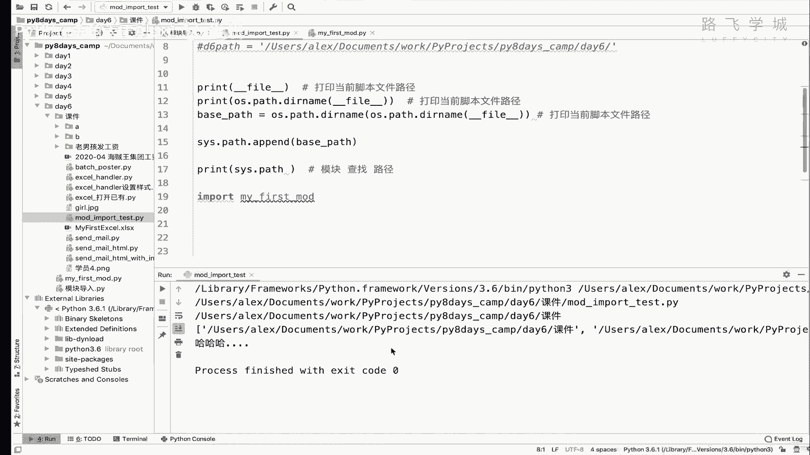

咱们讲过说他就是一个森林，森林里呢有大量的啊，全球的这个Python开发者贡献了他们的这个模块，这个官网就在这PYPI点ORG啊，你可以打开。

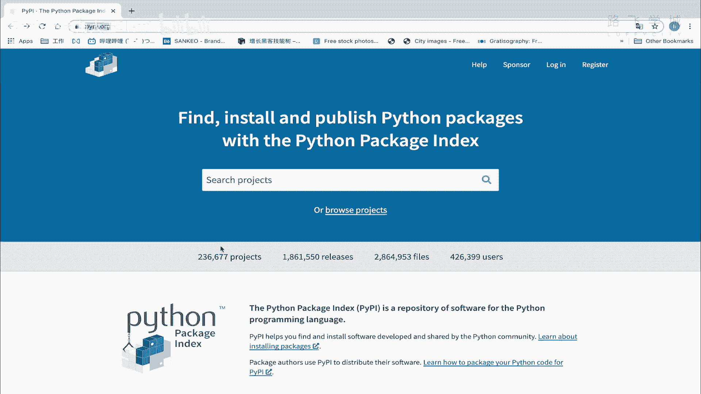

然后你看这个上面写的啊，到现在啊到现在他一共有两二十三万6000多个，23万6000多个pp，以每年平均好几万的这么一个数量在增长，23万多个项目，几乎你所啊想用Python做任何事情。

你在里面都可以找到对应的一些模块啊，那你就在人家的模块的基础上再去改写代码，就会省了很多事儿，明白吗啊，那这个模块我们怎么去下载呢。

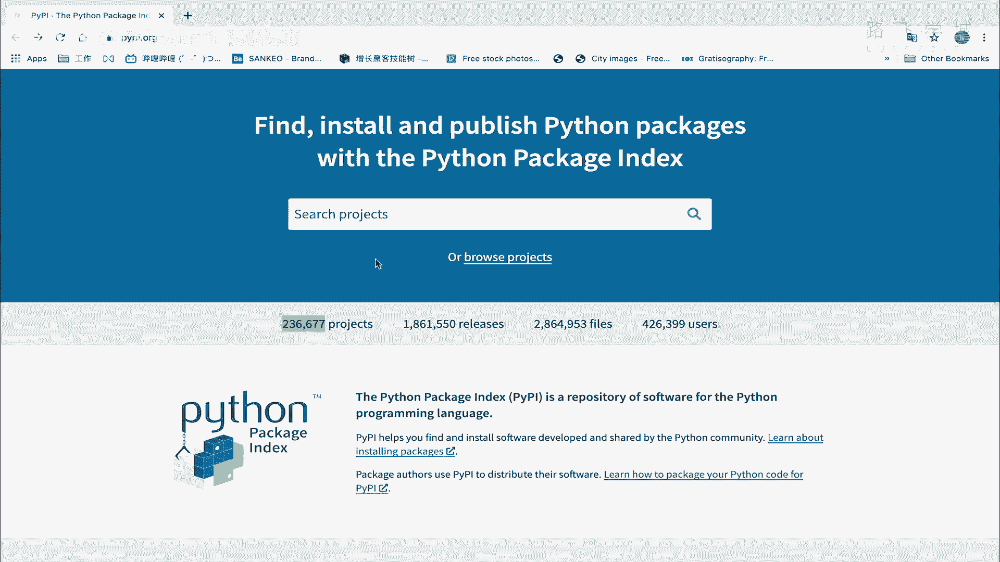

那下载方式有两种啊，一种呢你就自己在这里啊找到它。

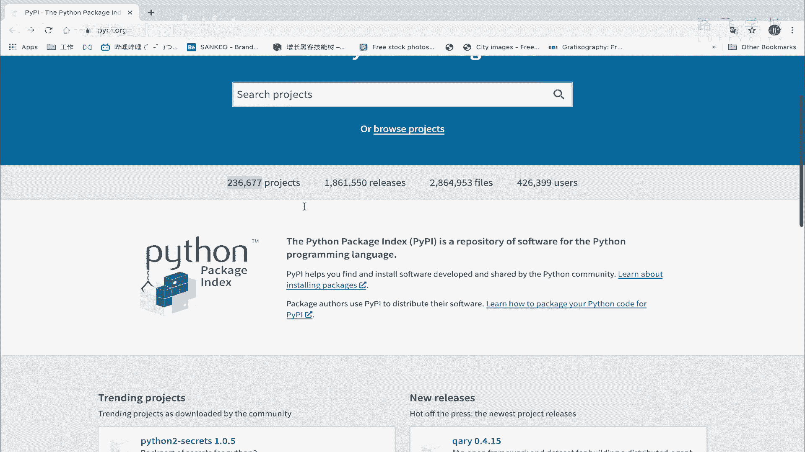

然后就自己点击下载就行了是吧，你自己在这里，然后呢这个呃这边应该有个download，看到没，你download下载下来，然后去压去去安装啊，执行两条命令就行了，但这个呢怎么讲，小白的话呢。

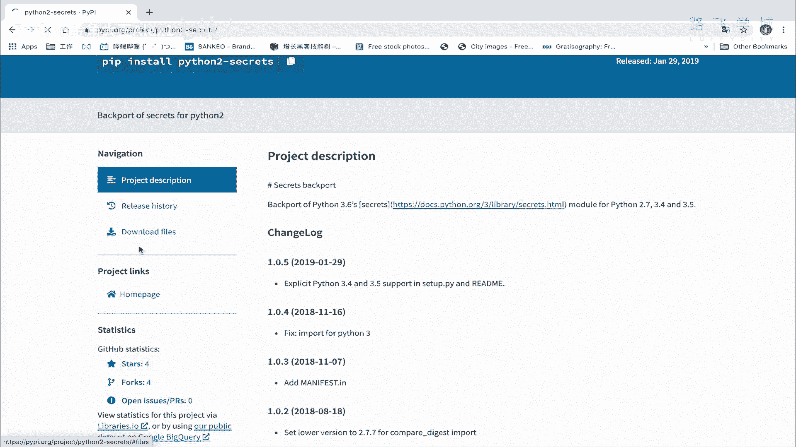

他可能不太会啊，不太会，所以我们还有一种更简单的一种办法啊，更简单的办法就是执行这条命令叫pip install啊，明白吗，Pip install，pip install啊。

pipe这个命令是Python啊，这个解释器自带的一个就是叫包管理工具，它就可以负责啊去安装啊，安装或者卸载，或者是升级这个Python的第三方的这种工具包啊，这种模块明白吗，这种模块。

那这个时候你比如说像这个包，咱也不知道他干嘛，他就有介绍啊，你可以自己看，如果你用得到的话，你就可以执行这条命令，就把它装下来，明白这意思吧，你不相信的话，我把它直接copy过来，你看啊。

直接copy过来。

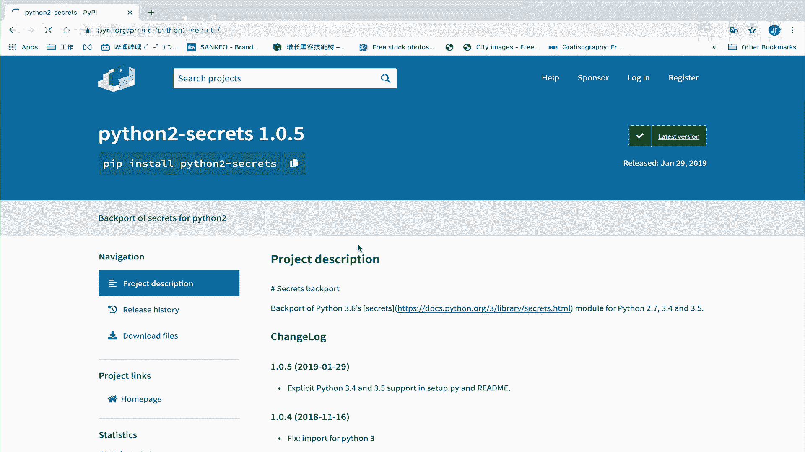

然后我在我的这个这里啊，然后呢我在这里执行，但是我要执行pip pip3，因为我这个电脑上又有啊，又有PAYPO，就是我这个又有python2的，又有PYON3图，我是执行pip3干啥，我一音道。

大家看他呢，其实就是到这个啊，这个官网那个地方呢就去下载这条，就是下载这个包就在安装，但是呢由于啊这个是访问国外的一个网站，所以它有点慢啊，有点慢，但是你看他现在当loading是不是。

然后呢这个successfully installed就是已经安装好了，明白吗，已经安装好了哎所以就是这么简单，你就装上这个包，所以你接下来就直接可以去导入，跟正常的导入方式一样，就可以用这个了。

明白吗，哎这是一种通过命令行安装，还有还可以干嘛呢，还可以通过啊，你说我连命令不愿意敲，还没问题，还可以更简单的啊，就是直接看到没有，你这个PYTHM，在这个地方点这个这个扳手是吧。

然后逮着逮着个扳手呢，走到你这个project这个地方，然后点你的这个project interpreter，就是项目解释器，大家注意了，这个地方是选你的解释器的，对不对啊，你我这里因为有很多啊。

你那可能就一个，然后看看下面这些东西，这些东西就是说你当前这个Python解释器啊，在这个派当前这个Python版本下，你现在安装了多少第三方的包，这些都是第三方的包，你看我装了很多啊。

你看老司机程序员，所以这么多年装了很多，然后呢你如果想去装一个，你就直接点那个加号，看到没有啊，你加号啊，你在这里想装什么就可以装什么，你比如说我们把那个啊。

我们后面学这个叫什么open py excel，哎这个东西这个看到没有，这就是处理excel的，这个是处理excel的，你看到没，可以处理excel，然后你把它一你可以选择版本啊对吧，你有的时候可能要。

但是一般我们不用选，我们就选装最新的就行了，然后那这个时候你就可以install，其他不用选啊，你就可以直接install啊，意思到就可以啊，那我我这个应该是已经安装过了啊，嗯你看是不是啊。

他说install successfully，哎可能我之前没装过，我不知道，总之你看现在是不是就安装好了，安装好了之后呢，同志们，你只要出现这个绿的不报错啊，那就是安装上了，安装上之后。

你在你这个地方啊，你在你这个地方你就可以找到，应该是啊，唉他也不能这个什么还不能还不能这个排序啊，大家看一下是不是有一个看到没有，是不是有个open py excel啊，这个模块。

那这个时候你就可以导入它了，你就可以导入它，你就在任意一个地方啊，任意一个地方啊，你比如说在这里吧啊，你就可以直接import open py excel，看到没有就可以。

就像你正常用自己的模块什么的都是一样的，好吧，哎这个就是安装第三方模块，那这个地方呢我要跟大家讲一讲啊，你们就说咱们现在啊由于各种这个啊，这个这个这个不能解释的原因，我们访问外网啊。

有的时候就被就就就登不出去了，对不对，访问不了，所以这个时候呢或者是特别慢对吧，去国外的网站，所以怎么办呢，哎注意了，咱们现在你现在装默认都是去国外装，所以你会特别慢，有的时候呢还装不上。

所以你可以用一个国内的镜像源，什么意思，国内镜像，也就是说国内它也有一个服务器啊，服务器呢就把国外的这些这个这个官方网站呢，他那个包全都给你同步过来了，所以你在国内的装啊，用国内的镜像就会比较快。

咱们一般普遍用的国内很多镜像啊，但是一般普遍用的是清华的或者是豆瓣的啊，清华或豆瓣的，但是我喜欢用豆瓣的，所以大家看这个镜像怎么配置呢，你就直接看着在这个地方添加号，看到没有。

这里有一个叫manage repository，repository就是manage，你的这些啊，这个叫什么呀啊这个叫啊叫工具，就是模块的仓库啊，仓库这些仓库地址看到没有。

你点进去看这里就是一个豆瓣对吧，但是你可以修改它是不是，但是默认就是这个地址你就可以写啊，然后当然你还可以添加别的，添加别的，它就会依次寻找，比如说这里没有，他就去别的地方找，但一般一个就可以了对吧。

你把它添加完了之后，添加完了之后呢，你把它apply一下就应用嘛，然后点OK就可以了，这样再装的话，它就会从国内这个镜像圆上去装，明白意思吧，这个就是说在你拍唱这个地方从国内装。

但是你在这里命令行如果去安装的话，他依然啊，比如说你要在这里这个命令行安装，它依然是用的这个国外的，看到没有啊，这个这是国外的一个网站，但是你同时说，我如果我也想用国内的这个豆瓣圆的话，怎么办呢。

其实也很简单，你就直接我在这里看有没有啊，我写过没有啊，这个pi就是豆瓣嗯。

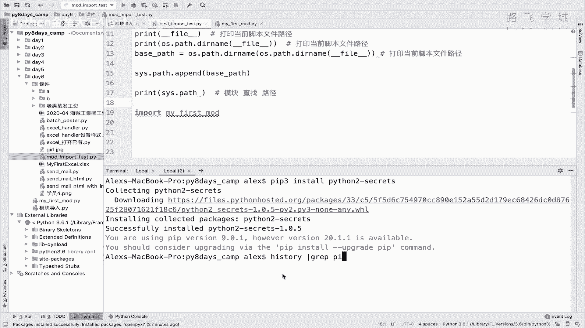

诶在这里没有，那我在这里写过没有啊。

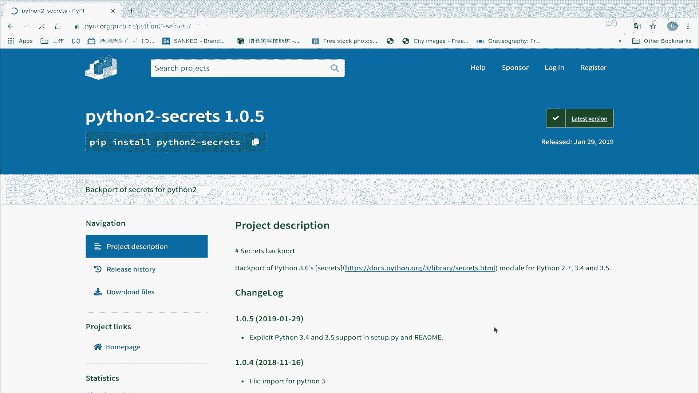

history我是查我之前出过的命令啊，豆瓣啊，没有没有写过，没关系，那我就直接type3，然后in store，比如说我in到我的这个啊，一个一个一个一个项目叫张狗啊，一直到JJ他呢他就好JO。

我已经装过了，但没关系啊，那我再install一个叫SNC吧，啊假如说这个啊他现在默认就是去国内国外，你看到没有，他其实你可能感觉不慢啊，其实其实有啊，我这个网好啊，其实其实是有的时候很慢。

下一个比较大的，所以这个时候呢你可以用过，用那个这个豆瓣圆啊，豆瓣圆怎么办呢，只需要加一条命令叫做什么呢，啊看到没有啊，这个这个唉杠I杠I，就是说我我要去这个网址去下载啊，去这个网址去下载。

然后你直接把这个加上看啊，再把它加上诶，然后呢后面再加到后面，咱们执行一下就可以了，哎你直接加到后面之后啊，直接加到后面之后，这里报了一个错啊，反正就是说说什么。

说这个it's not a trusted or secure host，就是说它不是一个可信的，或者是什么安全的一个主机啊，那这个时候你要干嘛呢，你再加一个参数就行了，他这其实已经给你提示提示了。

就说如果你不管怎样就想相信他的话，你在这加一个这个trusted host对吧，把这个豆瓣的网址啊加到这个里面，然后告诉人家这个pip，pip说我就是要相信这个服务器，明白意思吧。

哎这个时候我一回车就没问题了。

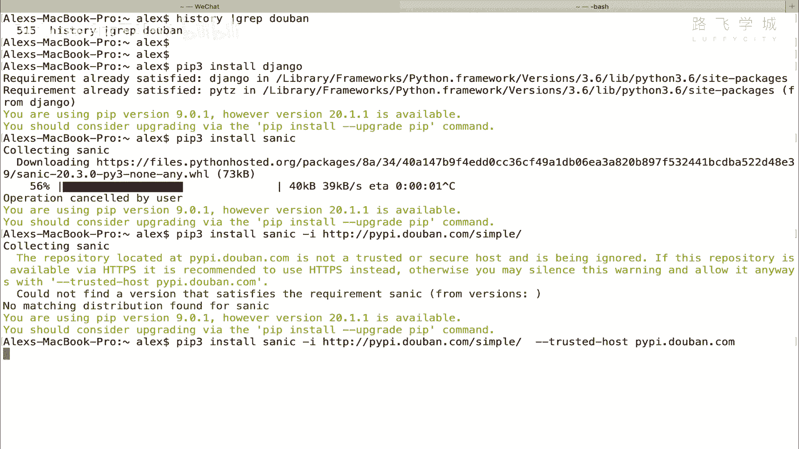

大家看你看你看是不是装的特别快啊，啊装的特别快啊，你要是用这个呃远程的，这个国外的可能要很长时间明白吧。

哎装的特别快快，但是我这个装出错了啊，你看后边这出错了。

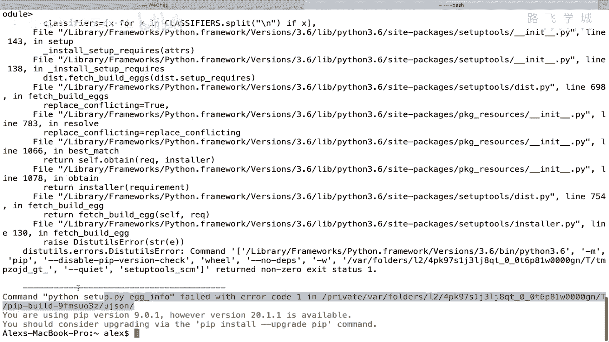

后面出错是出错了，你看出红的就出错，出错是出错啊，咱们现在不在这里解决这个错。

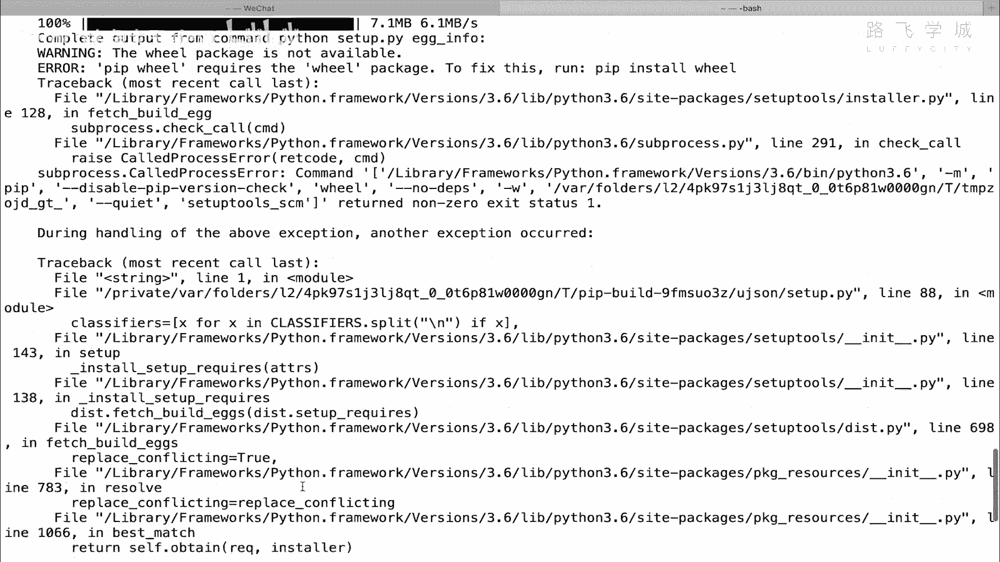

但他这个应该是缺什么东西，没关系啊，但是如果没有出错的话，它就直接最后显示装成功了。

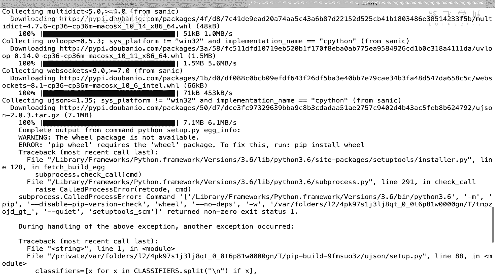

你就可以用你这个装的这个模块了，明白意思吧。

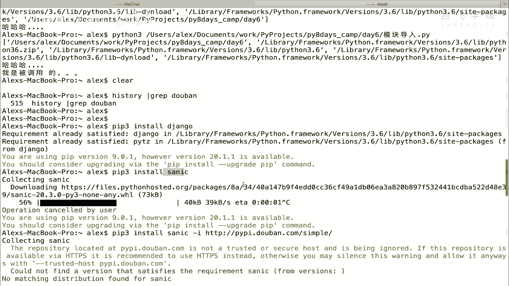

哎这个就是说通过啊这个啊中国这个命令行，来执行国内的这个镜像约好吗，OK这个就是如何安装第三方的这个工具包好吗，啊你们自己可以去试一下，O好了，我们知道如何安装第三方的工具包了之后啊。

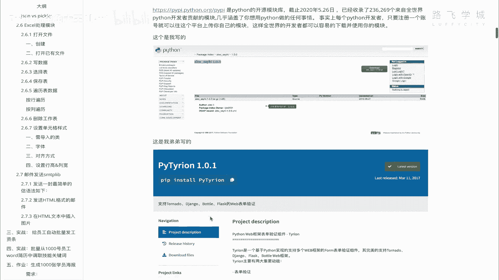

那我还是要补充一个，也就是说呃这个官方网站啊，大家知道它除它存的是全世界所有开发者的，这个就是贡献出来的这种模块，那你自己也可以在上边去，如果就是你说你写了一个特别牛逼的功能，你也可以往上边啊去上传。

你上传完之后就能啊，就说全球的各个开发者就可以找到你，我自己之前做测试，还用过一个叫alex alex test吧。

好像搜一下看有没有啊，还有没有我，我我都忘记叫什么了，好alex say hi啊，Alex say hi，大家看这个是我啊。

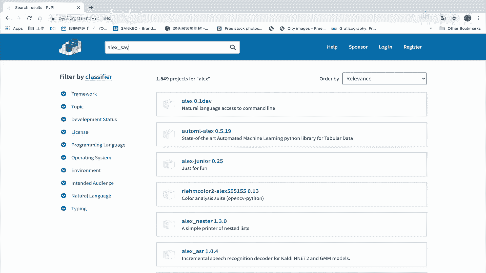

很多年之前呢在讲课的时候，我看这都是什么哪年的了。

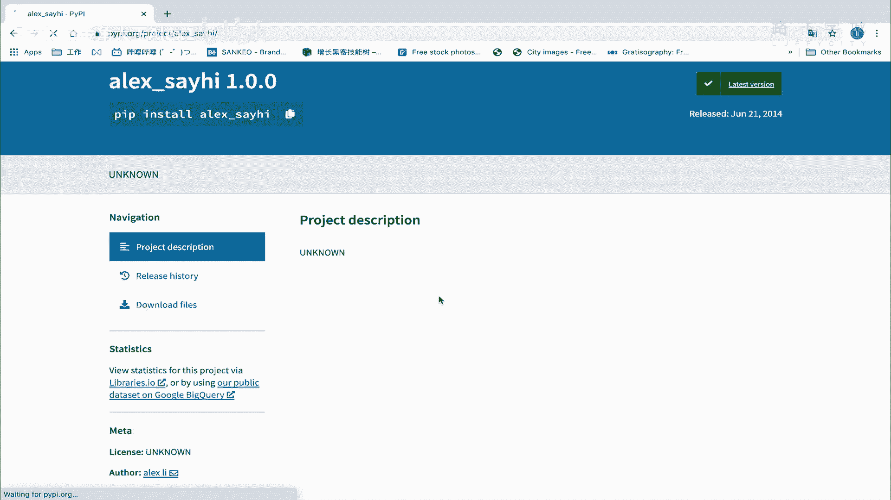

哎你看李杰3721嘛，这是我的邮箱吗。

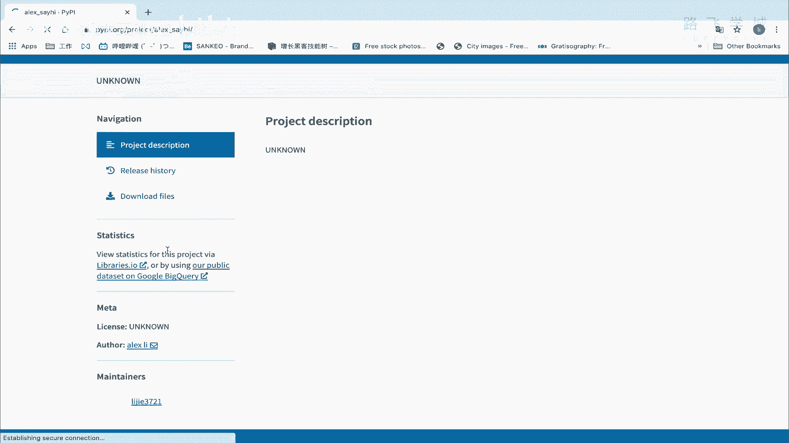

哎哎你看我2014年，你看啊，我是老司机了啊，2014年的时候，我上传了一个模块，所以你你要想下载的话。

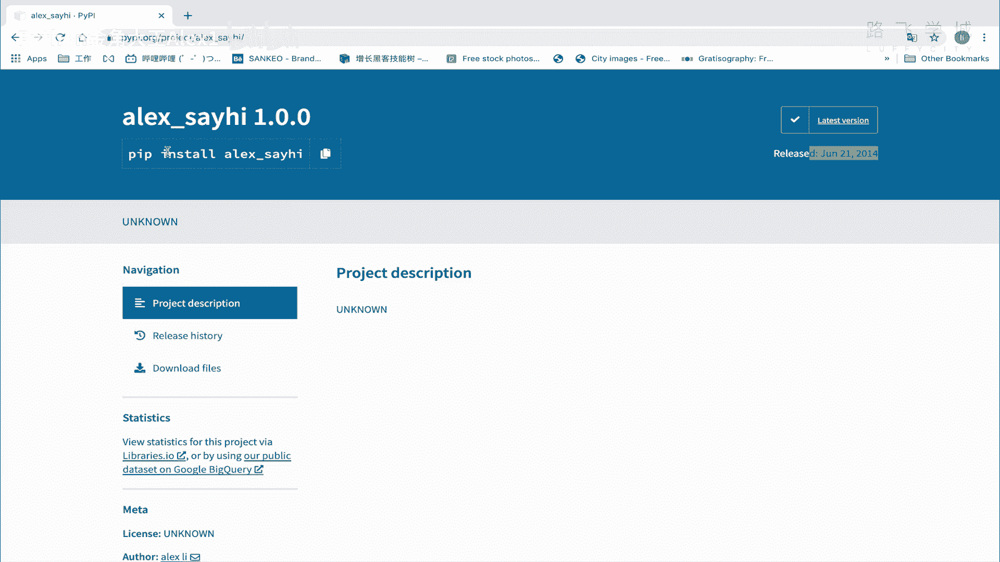

你就可以对吧，你就可以自己下载下来，你打开看里边有那个黑姑娘的照片啊。

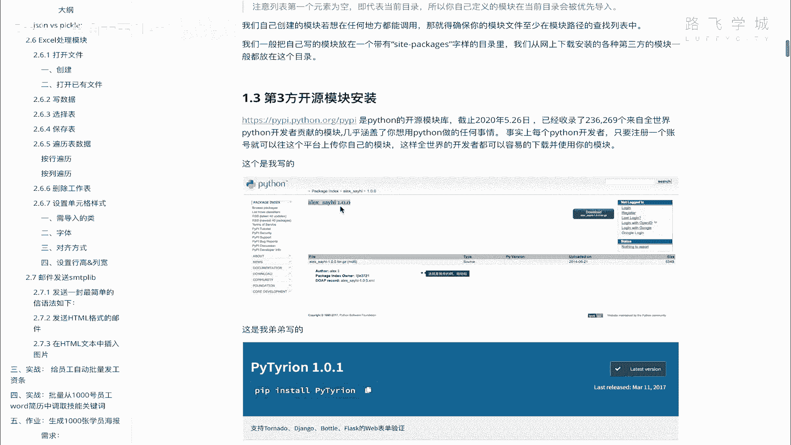

然后这个是我弟弟写的啊，这个黑姑娘她老公啊也是佩奇老师写的。

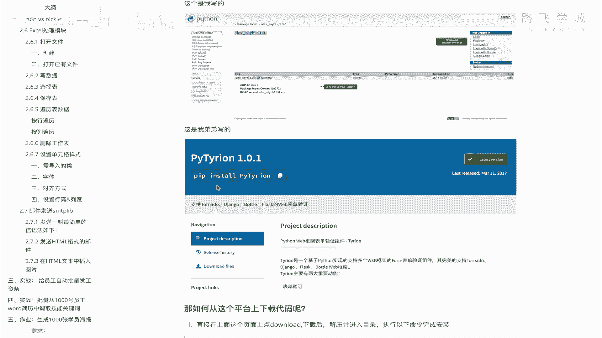

他是一个写了一个什么什么框架啊，你可以用一下，总之每个人都可以装自己的人，就是把自己的上传上去，只要你符合他，符合他那个规则就行，很简单，半个小时你可以学会，但是今天我们不不不给大家演示这个啊，没啥用。

so啊你自己就知道怎么上传这个啊。

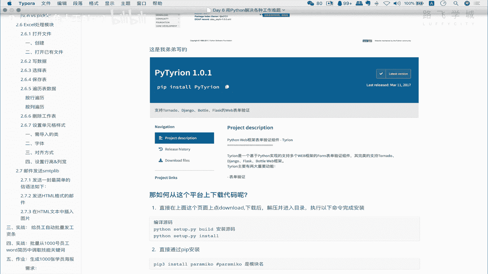