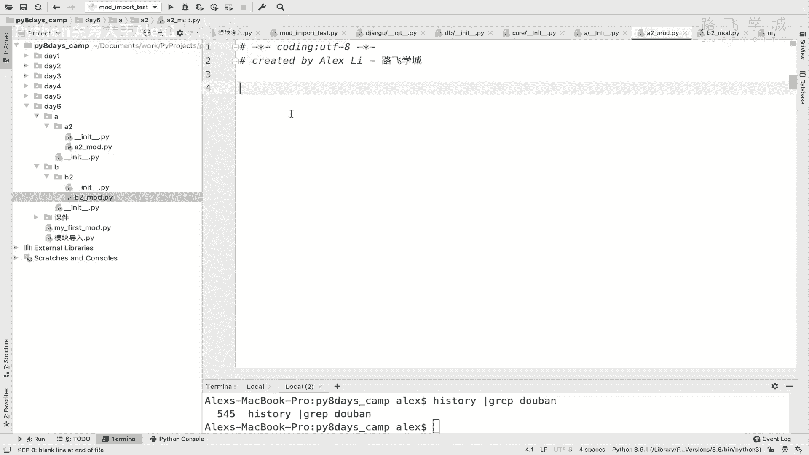
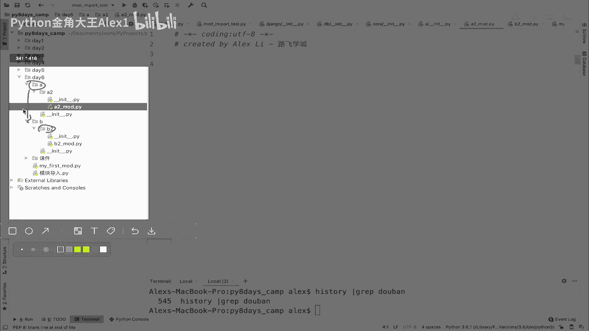
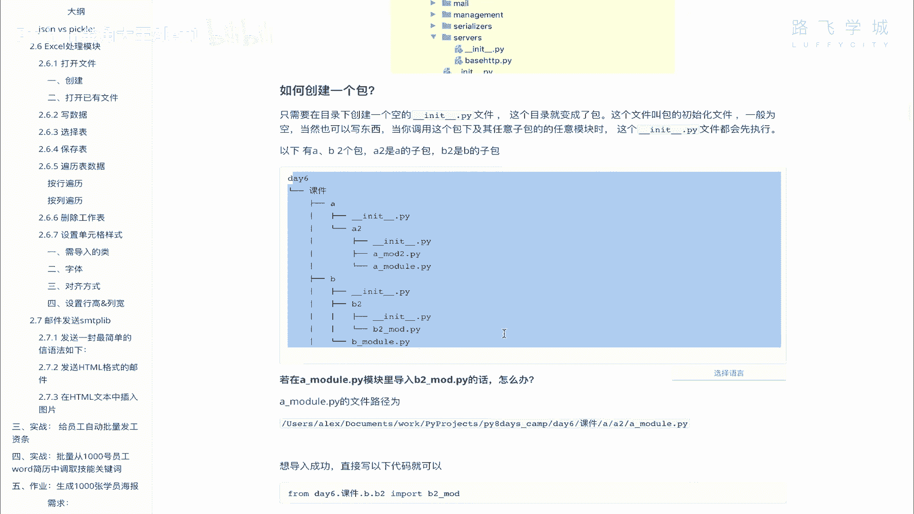

# 【2024年Python】8小时学会Excel数据分析、挖掘、清洗、可视化从入门到项目实战（完整版）学会可做项目 - P71：04 包的使用 - Python金角大王Alex1 - BV1gE421V7HF

OK同学们这一小节我们来学啊，包这个这个使用，那先知道什么是包啊，如果大家知道，如果你写的这个项目比较复杂啊，你现在通过模块来分开分开了，但是假如说你这有100个文件，有100个代码文件对吧。

全放到一个目录下管理的话又会比较乱，所以呢为了方便管理哎，我们就可以引入包的概念，那一个包呢它其实就是一个文件夹啊，一个包其实就是一个文件夹啊，那这个呃你可以把你可以根据，比如说业务线不同。

比如说这个业务逻辑不同，把这个什么呢，把这个不同的啊，这个代码文件放在一个不同的目录下，明白吗，放到不同的目录下，它就是呃相当于你看它这个对吧，他这有一个游戏项目，这个是负责声音的声音画面声音的。

这个是负责图片的，这个负责是说游戏等级的诶，那每个这个目录下都会有好几个文件诶，这个目录就可以被称为一个包，明白吗，一个文件目录就可以称为是一个包好，那我们来看到这里。

你看我拿到我的一个jungle的一个项目，就是咱们以后会学的web框架，那你会打开发现它下面有非常多的这个什么呀，这个目录吗，每个目录都是一个包，还没每个目录都叫做一个包，然后目录下还有子目录，子目录。

最后下面是文件，你这样去怎么讲，给他管理的话就会比较什么呀，就会比较这个叫叫叫叫叫叫方便管理啊，方便维护，你比如说我打开咱们这个就找到这个JJ吗，找到这个账户给大家看一下，哎呀还挺多的啊，找不到啊。

找不到了没有关系啊，你随便找打开一个嘛，你这个看这个吧，看这个GTTP啊，TP就这么少啊，哦sorry sorry sorry，JANGO是一个第三方模块，注意了。

你装的第三方模块都在这个Python的这个side，site package下面，在package下，这里面是自带的模块啊，这是自带的，有200多个，这里是第三方的，找张口应该是能找到的，大家看这里。

然后我们下拉，你看这里有那么多的目录，每个目录都是一个包，你这样你就很容易看出来说哦，我知道这个是负责核心功能的，你看这个字面意思吗，这个是负责他们这个HTML页面展示的，这是负责HTTP啊。

这个反正是一个什么协协议，这是负责网页的表单啊，每个点进去还有一堆东西，看到没有，还可以点一堆东西啊，总之这就是包，明白吗，哎这个就是包好，那我们知道这个包了之后，那现在呢就是说我能看到人家那个包。

我想我自己创建一个包怎么办，哎如何创建一个包呢，其实也很简单啊，如果你要创建一个包，只需要在你的一个空的文件目录下，创建一个int的文件，这个目录就变成了包啊，什么意思，什么意思，什么意思，什么意思。

大家来看一下，你看啊，虽说我说每个包其实就是一个，其实就是一个什么，就是一个目录啊，就是一个目录，但是呢它跟目录还是稍微有点不一样的，你看每个包下它会有一个这个文件，这个文件看到没有。

有的时候它是非空的，有啊一般一般是非空的啊，这里面但是也可以写东西，但是你只要有一个INIT啊，两个下划线这个文件，那这个目录就会自动的变成一个包，明白意思，你点进去任何一个看到没有。

它都会有一个INIT文件，看到没有啊，有的有东西，有的没东西看吧，有的人有的在里面写的东西，有的没写，但总之你看他这个东西，总之这个你是必须要有的啊，你必须要有，要不然他就跟一个普通目录是一样的啊。

有了INIT，它就变成了一个包好吗，那啊咱们就自己来创建几个包，然后并且创建完包之后呢，你这个代码肯定要互相的调用嘛是吧，互相的调用，OK咱们就来吧，咱们就自己创建一个啊。

看一下这个创建好了之后互相调用怎么玩啊，互相调用，那我在这里创建一个包啊，看哎注意了，你用单击注意下面这个地方，你看着啊，你这个是创建目录，这个是建Python package，看到没有，哎。

这俩的区别就是，无非只是这个多了一个INIT文件，I n t，你选择创建包就选择这个就行了，可以了哈，我想到我的这个一个包叫A好吧啊，这是啊A吧，就叫A然后大家看你看是不是多了一个空文件，看到没有。

里面其实什么也没有啊，什么也没有，然后一会儿我就告诉你它是干嘛用的啊，也干嘛用的啊，对然后呢在这下面我再创建一个子包，可不可以啊，哎这个A2可以吧，A2看到没有，然后呢同时我再创建一个B。

啊然后我再创建在B下面再创建一个B2，可以吗，啊那好现在啊它这个结构大家看到了啊，结构它看到了，你看现在呢我在A2下面创建一个模块啊，这个模块就叫啊A2mod行不行，然后我在B2下面啊。

我在B2下面也创建一个文件啊，叫B2mode可以吧，那这个时候我在B2M下面，B2M的下面写写写一个写句话吧，对吧啊，我是B2模块对吧，那这个时候我现在想要做的是，说实现一个跨目跨，不是跨目录了。

他现在就是挎包的一个导入，看到没有挎包的一个导入，这个时候我怎么去导入呢，哎可不可以呢，当然是可以，我从BA2下面去导B2可以吗，A2下面现在就是两个包，好几个包了嘛对吧。

还有不哎相当于是这是他是孙子辈儿，他爸爸的爷爷的兄弟的儿子的儿子是吧，哼是不是，不是是他爸爸的爷爷的兄弟的儿子的儿子，就是你堂兄弟是吧，这就是你堂兄弟，你现在要在你这个模块下把你堂兄弟给你啊，导进来啊。

导进来导进来怎么导呢，你就可以啊，这个时候可以怎么办呢。

所以你说我在这儿呢，所以还记得咱们上一上上节学的那个，就是那个模块导入对吧，你首先你要想导入的话，你是不是你肯定要从这个地方开始导嘛对吧，从AA的评级是A的评级就是B是不是啊。

所以你可能想到的就是说从B点B2下直接导，对不对，直接从B点标一下，你不能说我从这里先回去，你说我怎么回到A2，回到A再回，No no no，你就直接从这个地方从B这一层开始往下倒啊，B这下层往下倒。

所以你怎么实现从BG层往下倒呢，哎是不是得确保什么呀，确保你这个呃怎么讲，他当前的这一层的这个目录是吧，是在那个cs pass那个环境变量里。

对不对啊，你要确保在那里面，要不然他是找不到的，对不对，所以这个时候我就直接啊直接from b点，比如说B2啊，import这个B2杠model啊，大家看这样行不行呢，我们来试试行不行呢，执行一下哎。

报错了，很显然啊，报错了，他报错了，那就是代表代表什么呀，代表print import si print c4点pass啊，用C4点pass，大家看呃这个什么呢。

当前的这个系统就是c pass这个环境变量啊，是在什么呢，是在A2这一层啊，也就是说在我当前文件的这一层，然后现在还有一个呢，还有一个是在这个day，就是这个项目的根目录这一层，明白吗，后面就没有了。

后面就别的了，所以你会导致什么呢，他就是就是这个什么，你如果是就是啊，这个怎么说呢，就是说你你在这一层的时候啊，在这一层的时候，你你直接是说from day6点什么什么B啊，点B2应该是可以的对吧。

因为他在这里是能找到你，导day6是可以的，然后呢，你在这个A2的当前同级目录也是可以的啊，A2同级目录也是可以的，但是都不是，你现在是在day6下面，是不是day6下面，所以你没办法。

你的两个你你你你没办法导你想解决的话，那只能是什么呀，你from a6点看看，day6点看到没有啊，day6点B点B2应该是可以的，因为它这里有那么一个环境变量。

是不是是到到了这个day6这一层目录的是吧，那这样执行是没问题的，大家看是不是就成功地导入了，明白吗，哎所以这个就是一个啊包的那么一个，一个概念包，也是可以互相就是跨层级导入的，看到没有。

只需要点一下就进入了一层目录，点一下就进入了一层目录，明白这意思吗，OK咳咳咳sorry，那那现在我给大家解释一下，这个INIT是干嘛的好吧，I n i t，这个INIT。

一个是说你有了之后就代表它是一个包，另外一个就是说你只要导入它，你只要导入这个，比如说你只要导入这个这个这个这个这个啊，B2它sorry，你只要导入B2下面啊，B2下面的这个B2module。

我跟你讲这一层的这个IT啊，也就是B2的这个包就会执行啊，执行这个it它就一定会执行了，大家来看一下print啊，我这是BB2的i n i t file行不行，B2的i t file。

然后你会发现这个时候我执行A2的时候，我执行AI的时候，对吧啊，我也没有去执行IT，但是呢你会发现这个B2这个INIT的文件，就会自动执行，为什么，因为你只要调用B2的这个包，看到没有。

你只要走过了B2的这个啊，就B啊，B2的这个包看到没有，从这个B2的包里面下面去掉东西，它就会执行B2下面的IT明白吗，那你说哎这个B下面也有一个NIT啊，他会不会执行呢，我们来看一下B下的BINIT。

对吧哎这个时候我们来看看啊，你说，哦你说你看我这个文我这个调用对吧，也经过了B是不是经过了B下面的B2，那个B会不会执行呢，咱们看一下，大家看B也会执行，所以也就是说这个什么呀。

就是你你你现在相当于是B2，是B的儿子嘛对吧，你调用B2B2下面的NIT会执行，但是B这一层的啊，就是爸爸这一层的这个NIT它也会执行，明白吧，他这个顺序就是顺序是什么，先执行B的，再执行B2的。

明白吗，哎那位同学说了，你你你这个这个这个为什么要执行它呀，为什么要执行这个文件，哎注意了，这个就是说你以后写程序啊，写程序有的时候你调用一个包啊，有可能就就干嘛呀。

只要别人一调用你包下面的任何一个文件，你就可能就想默认初始化执行一些动作，要初始化执行的这些动作，就可以写到这个INIT的文件里，明白吧，写到INIT的文件里啊，对所以咱们当然啊可能短期内用的会比较少。

你就知道就行了啊，知道就行，只要一导入INIT就会执行好吧，OK那这个就是包的这么一个概念啊，包的这么一个概念，然后大家可以自己创建一个包，可以创建一个这个结构的包，然后试一下互相导，OK好吧。

