# 【2024年Python】8小时学会Excel数据分析、挖掘、清洗、可视化从入门到项目实战（完整版）学会可做项目 - P73：06 时间处理模块time - Python金角大王Alex1 - BV1gE421V7HF

OK同学们，这一小节呢我们来学时间处理模块，那时间处理呢分两个，一个是这个time，一个是DTIME，我们分别来讲，先说这个time模块，那我们讲之前先讨论一个问题，在什么情况下会涉及到时间处理。

其实非常非常多啊，你们现在比如说这个你像机场上，机场里的那种啊，这个飞机时刻表，火车时刻表对吧，包括你这个到任何一个地方，包括你现在这个微信支付，支付宝支付，你买东西是不是都记录一个日期时间呀。

所以所以你写程序啊，就以后到处都得得处理时间，明白这意思吧，那这个咱们就来看一下啊，看一下这个什么呢，呃这个就是我们写程序对时间的这个处理啊。

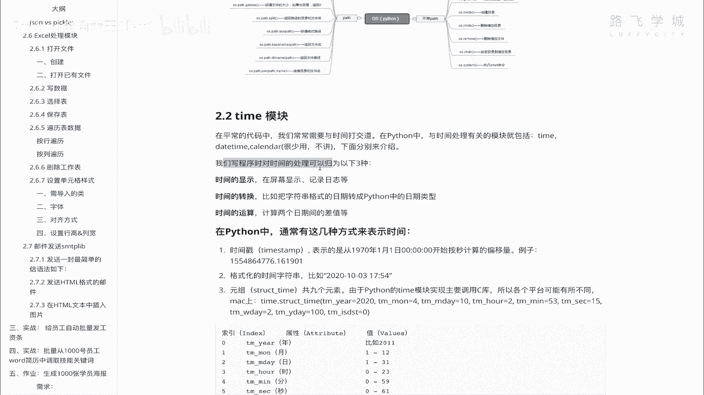

啊我在这里做了，给大家做了一个归类，归为三类啊，也就是三种场景吧。

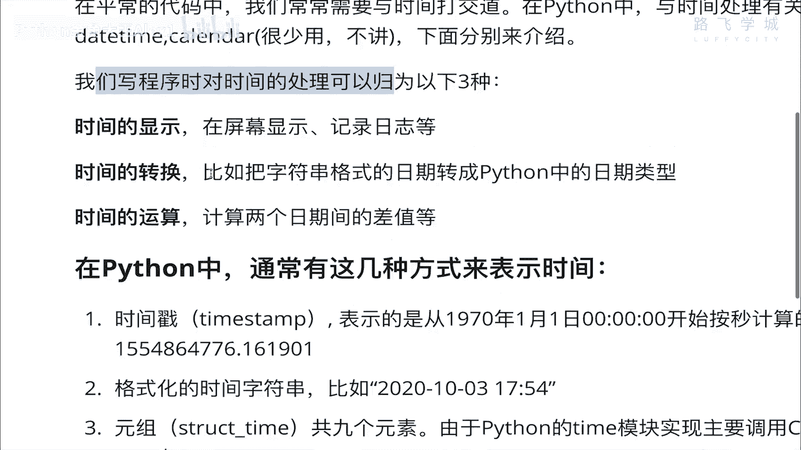

三种场景，第一种呢，你是可能说你涉及到对时间的这种显示，比如说在大屏幕上显示，或者你要记录日志这种，对不对啊，记录日志，然后第二种场景就是干嘛呢，你涉及到对时间进行一个转换啊，什么意思。

也就是说我给你一个字符串对吧，长得像日期格式的一个字符串是吧，比如说我就随便写一个，比如说啊这个2020杠二零对吧，R2杠零几030404，大家一看，这就是一个日期，但它其实是一个字符串。

那字符串是没有办法进行日期运算的，对不对啊，这这就没办法进行运算的，所以你要想运算，你把它转成一个日期的格式，这样他就可以去判断唉，我离过年还有多少天对吧，所以呢你要就涉及到把字符串转成这个啊。

Python中的这种日期，这种类型它是有一个专门的类型的，就是处理日期的啊，那所以这是时间的一个转换，当然你也可以把这个日期类型，转成这种字符串格式，因为你要打印，然后在屏幕上显示。

显示的时候还是一个字符串格式嘛对吧，那啊写到文件里也是字符串的对吧，然后另外一种就是说时间的一个运算不，比如说我比较两个时间的日期的啊，这个这个差值对吧，比如说我算啊今天是多少多少号。

然后我判断诶还有多少天是吧，我女朋友这个生日就要到了对吧，你要准备好礼物，那你设写一个程序自动提醒，比如说还有七天的时候，那你就要进行这样的啊判断嘛对吧，跟这个他的生日和你现在的时间进行一个比较。

唉这就是时间的一个运算啊，时间显示，时间转换和时间运算这么三种场景好吗。

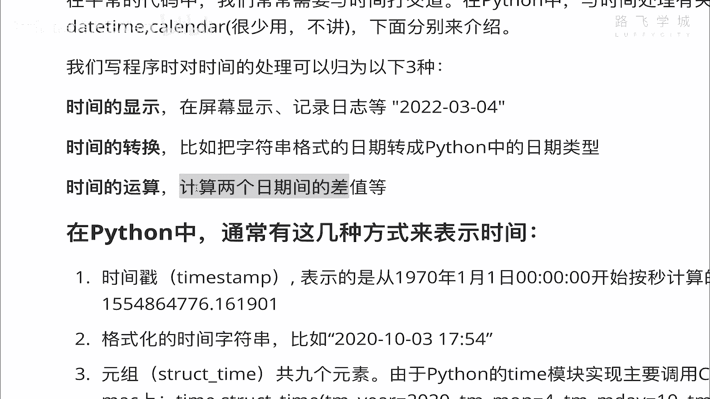

OK知道这三种场景之后，接下来我们来看啊，要在Python里面如何表示，就是在Python里面表示时间啊的，就是就是时间这种对象，时间这种数据类型不能叫数据类型，实际这种这种格式就是这种数据。

就这种类型有几种啊，有几种时间对，有几种时间类型这么讲啊，有几种时间类型。

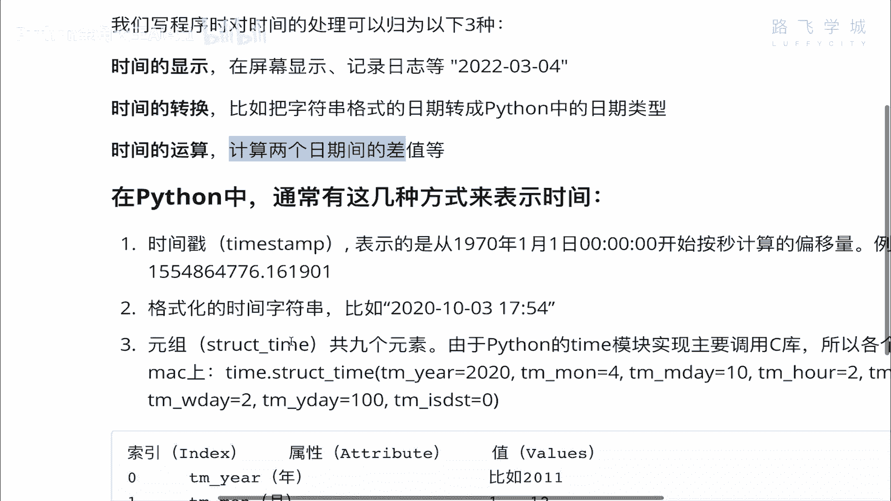

第一种呢叫时间戳啊，小白肯定没没接触过，小白以为就是说就是正常。

不就是这个这种日期对吧，这个小时分秒吗，但是在计算机里有一个叫时间戳的东西啊。

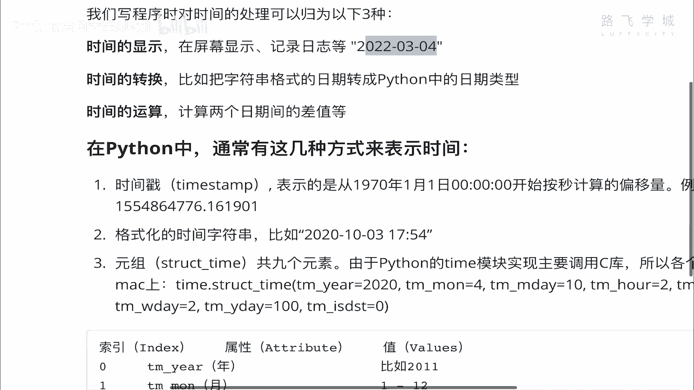

时间戳就是说它是干嘛的，它是一串数字，它们就长这样，它的开始时间是从1970年1月1日，开始计算，从那个时候开始计算往后的偏移量，也就是说往后每过一秒就加一，每过一秒就加一，一，直到现在明白吗。

你知道现在为什么是从1970年，因为那个时候地球诞生了啊，不是啊，那个时候是说世界上第一台啊，这个叫什么呀，就是这种我们目前用的这种操作系统诞生了，就是UNIX系统啊，就是现在所有操作系统的鼻祖啊。

这种就是UNIX操作系统啊，unit操作系统，但总之就是可能是为了纪念那个时刻吧，所以从那个时候开始，1970年开始，1月1号啊就记录时间戳，所以其实啊他是因为每一秒都会增加，每一秒都会增加。

所以呢就是你要是往这个1970往后走啊，那就是负数了啊，往前走它就是正数，哗哗哗的往往前走啊，那咱们很多时候进行这个时间运算，比如说看这个时间过了多少秒啊，算这种的，其实都是用时间戳来算的，明白吗。

另外一种叫格式化的啊，另外一种叫格式化的时间字符串啊，比如说像这种，这就是一个时间字符串，它大家知道它是一个时间，肉眼可看可理解的是一个时间格式，但它其实是一个字符串。

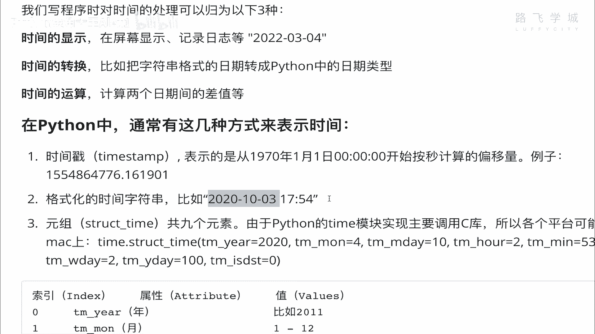

明白吗，唉还有一种这个时间的啊，类型就是什么呢，元组的形式就是以你还是那句话，我们没讲元素，但你理解就是一个列表的形式，明白吗，它里面共有九个元素，共有九个元素，然后这个什么呢。

呃这个这个这个这个这个颜色是这样的，看到没有在一个列表里啊，我就说它是列表了啊，在那么一个括号列表里面，你看这几个元素分别是这么几个值啊，这是这是这是这个year，就是当当前的这个哪年哪月哪日哪小时。

哪分哪秒啊，当天是周几啊，0~6表示啊，就是比如说零他就是周日一就是周一，然后今天是这一年中的第多少天啊，这一年中多少天，然后这个是是不是夏令时啊，夏令时就是咱中国不涉及啊。

就欧美国家有的时候设计夏令时，他要调那个时间啊，调时间对，这是一，所以这个就是三种格式时间戳啊，格式化的字符串啊，然后还有这种元组的这种对象，时间对象明白吗。

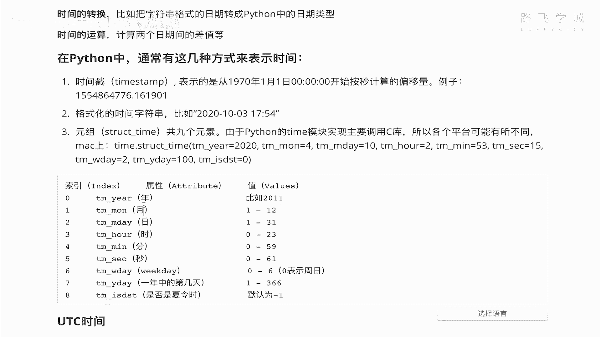

好一会儿我们都会涉及到啊，现在才知道啊，另外再再讲一个小点叫UTC时间啊。

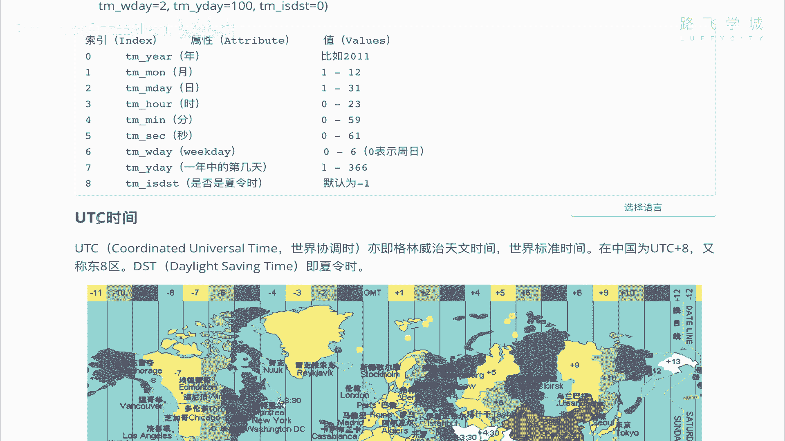

你可能会看到UTC时间叫世界协调时，其实就是格林威治时间。

我们小学的时候就应该知道啊，有一个什么世界时间标准啊，就分时区的中国是在第八区对吧，其实东八区是不是东八区，这边是西区，这边是东区啊，从这个零开始看看，gm g m t啊，这是零啊。

这个应该就是在英国伦敦那个格林威，是格陵兰岛的格林威治对吧，应该是格陵兰岛啊，我忘记了，总之往后不断的移，你看中国这整个这一片区域，都是咱们中国人自己，为了其实啊为了这个什么呀。

为了这个啊国内计算时间方便，所以整个中国区都算东八区啊，都算动漫区，但是其实中国北京和新疆差着好几个小时了啊，实际上差好几个小时，你看啊，其实要要要要你看新疆的话，这个只对着这根线，是到孟买了。

你看看到没有到孟买，孟买是家东五区，是不是咱们是东八区，所以你看他们其实是什么，包括你看那个香，包括那个行，那个sale，就是首尔的话，应该是到这都已经是东九区了啊，到这已经都扭曲了，你看上面对不对啊。

所以总之这个啊咱们其实跟日本差一个小时啊，差哎差两个小时，你看日本的两个小时，总之这个就是格林维治。

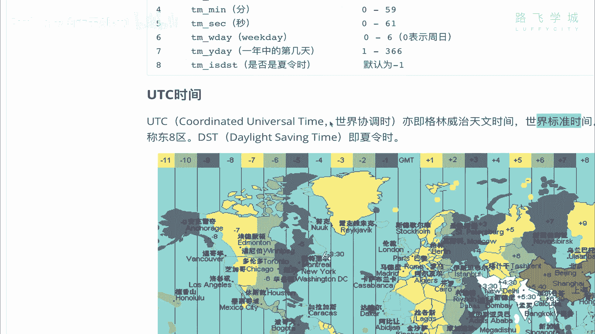

就是UTC时间，大家知道就行了，所以你要写的那个程序需要跨国的话，比如说我之前在金融公司，它涉及到一些全球交易系统对吧，那你就要处理这种国际事件好吗。

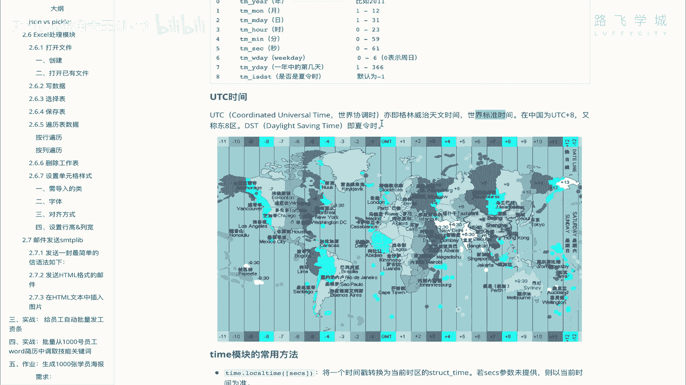

OK在国内的软件啊也不涉及，总之知道这些之后。

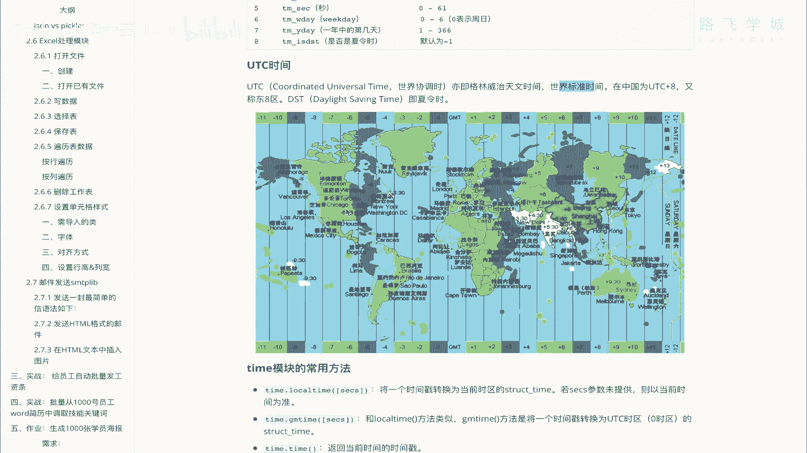

我们就来看啊，这个time模块的一些使用方法，使用方法在这都列出来了，我们可以依次的啊都来试一试吧。

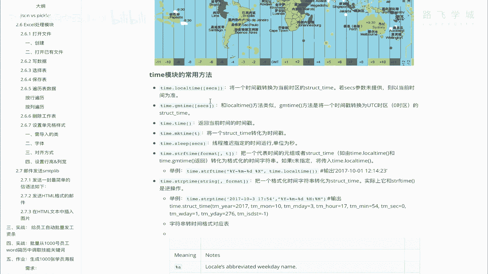

有一个叫time local time，Time time。

点local time，看到没有，这个是干嘛呢，把一个时间戳啊，这样吧，我们先返回啊，我们先返回时间戳吧对吧，先返回时间戳，看就time their time。

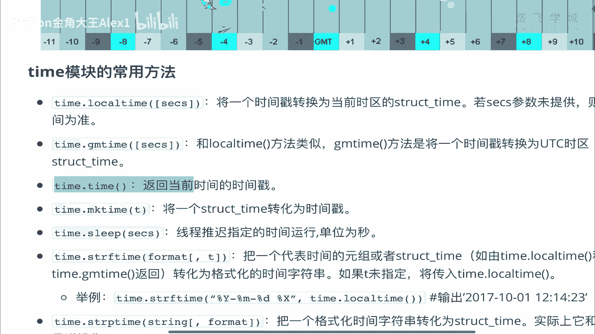

就是时间戳可以吗，我们来搞一搞嗯，这个对，直接这样，Sorry，啊import time是吧，print time time time对吧，其实就把这个时间戳打印了，大家看啊，你你每执行一次。

他这现在是五九，对不对，每执行一次，它就他就走嘛对吧，现在六十五六十五秒了，好吧啊这个所以你就很容易去判断啊，你这个程序过了多少秒啊，再学一个新的东西叫sleep sleep。

叫time sleep sleep5秒钟，看到没有，我现在开始记录一个开始时间，这是开始时间对吧，然后过了五秒钟之后，我就print啊，这个cost这个时间是多少呢，是是什么呀。

当前时间time time对吧，然后减个s time，你就可以计算出来你这个程序运行了几秒是吧，运行几秒我给你三秒了好吧，我们执行一下，看来看一下，哎是不是花了三秒钟，看到没有啊。

三秒钟后面这些毫秒不错了，三秒钟那个就是sleep，这个是说用时间戳进行运算啊。

直接加减乘除，加减号加减就行，然后接下来就是这个什么呀啊就可以学这个time。

Local time，time and local time是干嘛呀干嘛呀，把一个时间戳转换成当前时区的。

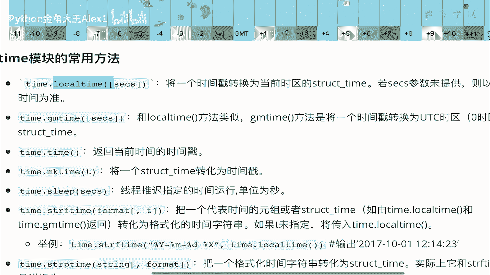

这个什么时间对象啊，时间对象还没给大家讲呢，是不是我们就看一下我这里有吗啊。

嗯没关系啊，他对对，你这个就它就会转化成一个实验对象。

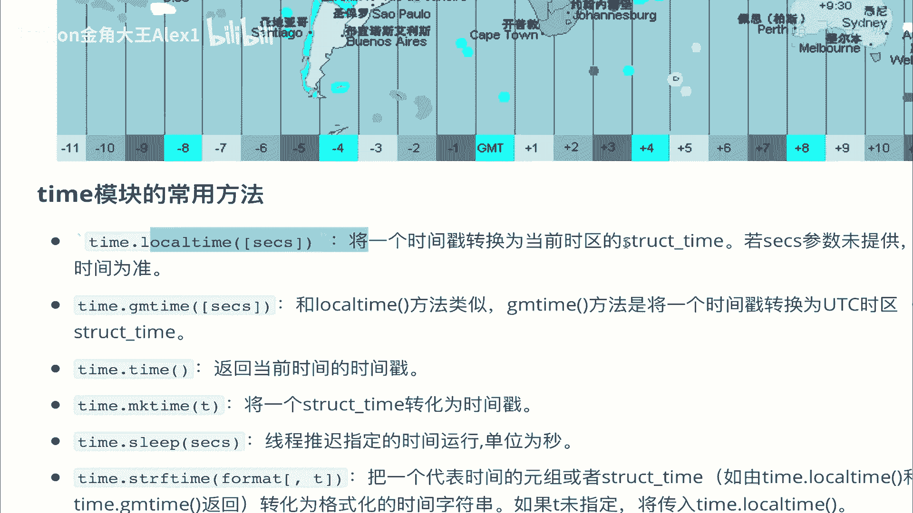

就是那个列表的形式，列表形式啊，然后呢你这里面是可以提供时间戳。

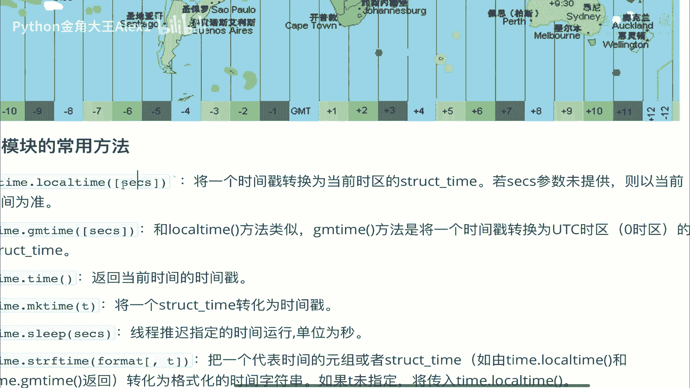

也可可以不提供，你不提供就以当前时间为准啊，咱们就直接调用一下啊，调用一下print time，点local time啊，Local time，然后呢，你啥也不写，它里面就会他就返回把当前时间看到没有。

它转成了一个，是不是有那么一个啊，叫它叫时间对象元组格式的啊，就是列表格式的二零多少多少多少年，你看今年到现在的是今年的149天啊，你就很容易通过这个数拿出来，今年已经过了多少天了。

是不是已经过了多少天了啊，那包括这周这周是周几，现在是周四是吧，周四的话，那就是从零开始，周日就是周零嘛是吧，01230123啊，0123，Sorry，sorry不对，1234，Sorry，1234。

那周一是周一是一，周一是一对吧，周二不对，周一是零，Sorry，从周一开始。

那我写错了啊，从周一开始啊，从周一开始，周一开始啊，在这。

周一是零，那周一是零的话，周日就是六啊，对不对，周日就六了啊，这个这个记不记错了，Anyway，所以就是打印，当然你可以写时间戳，你比如说随便写一个，那咱也不知道它是什么时候，咱们获取一下哦。

这就是1970年，看到没有，1970年的1月16号啊，1月16号你再加一个四，可能就就过了好多年了，好还是再加个四，一下子到了2012年是吧，你再加几个哼，就到了多少年了，卧槽4万多年4万多年啊。

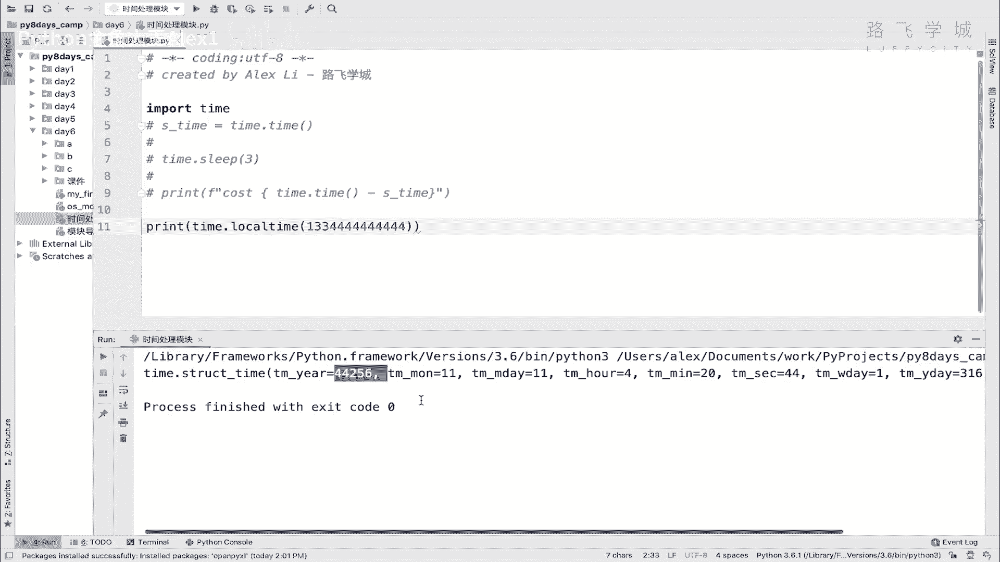

我孩子都有有有好多个了啊。

好这个就是local time，然后呢，接下来看这个什么gm time，gm time和local time方法一样，只不过呢它是干嘛呀，将你的这个时间戳啊，将你的一个时间戳转化为UTC时间。

就是UTC时间，就是零时区的转化成，对它转化成格林位置的这个啊临时区的时间。

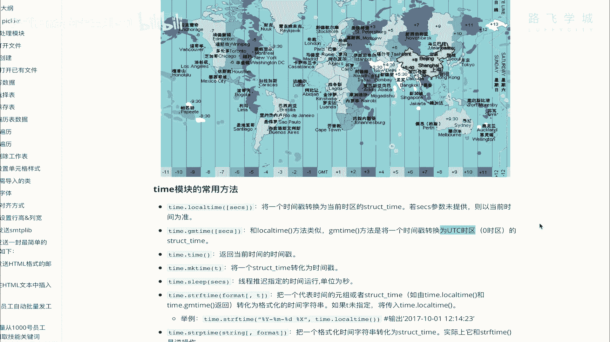

然后我们就也一样来看一下，就GEMT啊，Gm time，然后不写东西不写东西的话，这不就是啊，sorry不就是当前的时间嘛对吧，咱们来看2020年5月28号7点啊，5月28号7点看到没有。

但实际上我们现在已经是啊，这个十下午三点多了。

下午三点多了对吧，所以其实就减八个小时嘛对吧，到临时去，OK好啊。

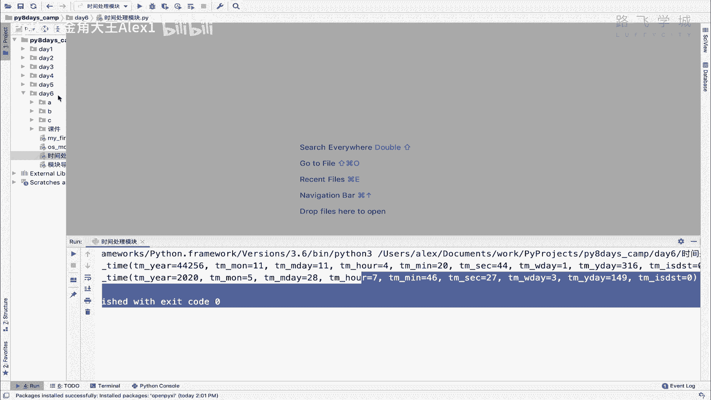

稍等啊，我这个拍照出了问题，我重启一下啊。

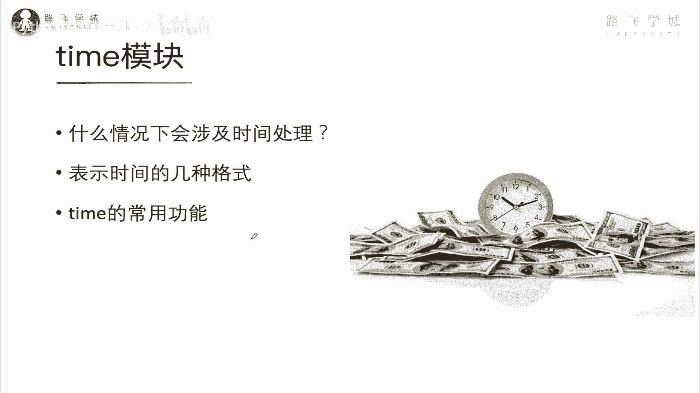

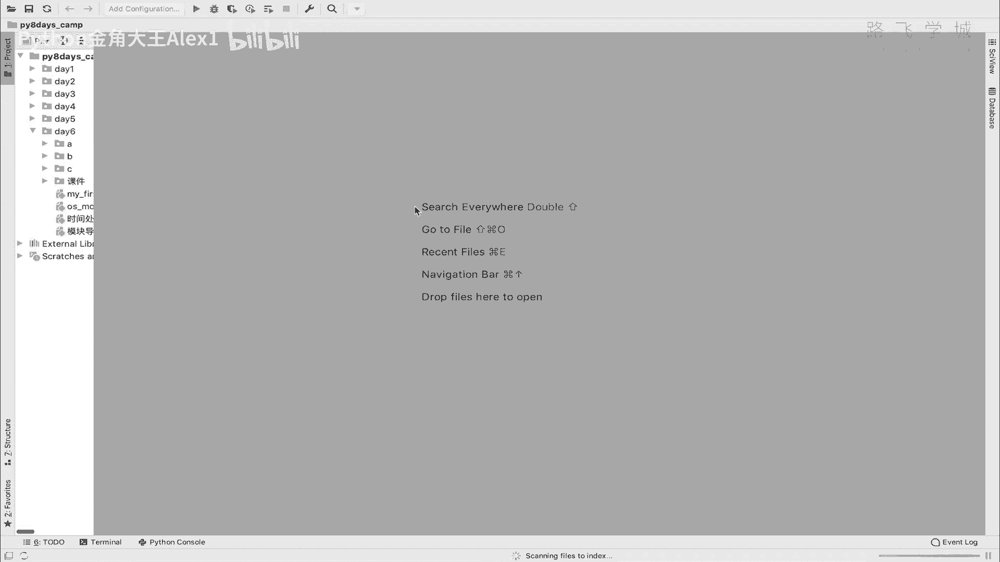

那我们继续我们继续啊。

然后再来看他们的mk mk time是干嘛，降一个时间对象转化为时间戳，诶，这个有点意思啊对吧。

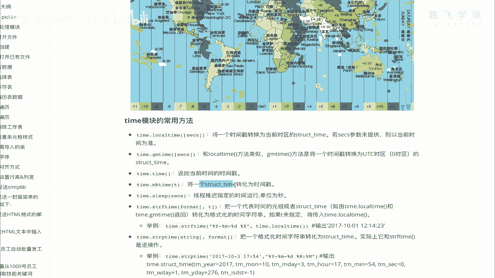

就转回来了，转回来了，你看这个是sorry，现在这个是把时间戳转成这个这个时间对象嘛，对不对，就是元组的形式，列表的形式，那我们再把它转回来，转回来的话啊，比如说这个嗯，给它赋个值吧，算了就直接这样吧。

直接这样print p点mk time，然后呢，你在这里面写这个什么呢，time点local time，local time会转成那个这这种格式，对不对，我们再给他转回来，它就又变成一个时间戳了。

是不是又变成一个时间戳了对吧，有的时候可能有用啊，你先知道这个方法，OK那接下来这个呢比较重要啊，比较重要，STRF是什么意思呢，把一个什么呀，把一个日期啊，这种元组的这种列表的这种格式的这个日期啊。

给它转成一个什么呢，指定的字符串格式啊，指定的字符串格式什么意思呢。

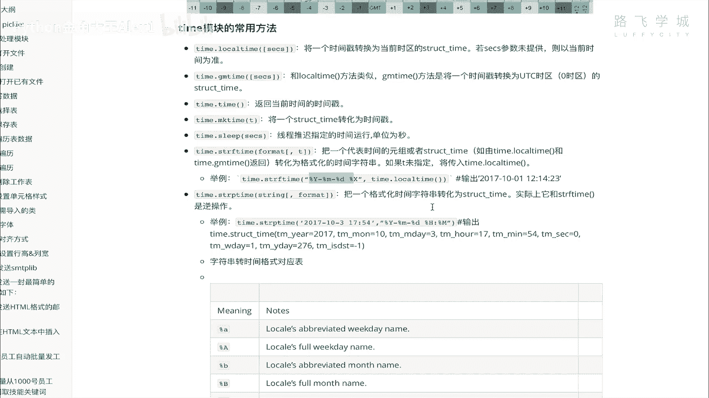

你看这里就举了一个例子，你前面第一个参数就是写这个格式，这个格式已经规定好了，百分号Y啊，Y就是大写的，Y是年的意思，百分号就是这个这是固定语法，然后呢就这中间这个你是自己加的啊，然后百分号M就是月。

百分号D就是这个这个这个叫什么来着啊。

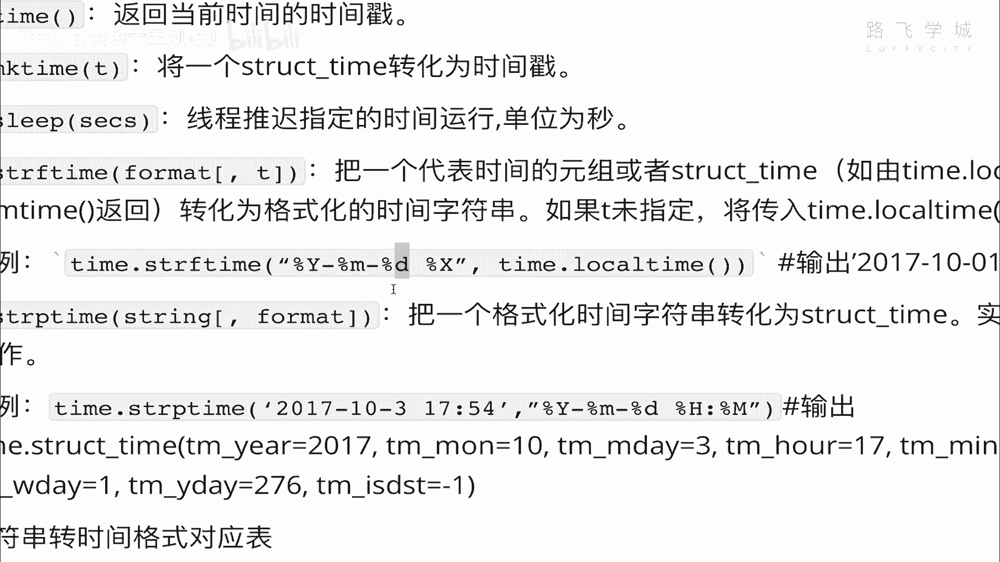

天然后百分之X就是什么呢，就是这个看到没有小时，然后分秒看到没有，他后面写这个时间对象嘛，时间对象啊，元组形式的时间对象，那这样相当于就是把这个时间对象，转成一个字符串的格式输出，它就是这个样子。

明白意思吧，就是这个样子啊，然后我们可以来试一下啊，可以来试一下哎，这种这些东西，你看说这个这个这个是写死了的吗，对他是写死的，就是大Y，大写的Y就代表你，那这些这些这些在在哪里定义的呢。

人家这里你看啊，我告诉你看这里有一堆的什么Y啊，M啊，还有H啊，什么乱七八糟一堆，你都可以自己试啊，可以自己设，我来给大家试几个是几个呃，直接print time点这个什么呢，time点嗯。

T r f time，然后前面写日期，你如果只写一个，也可以只写一个，你后面啊，注意你可以不跟不跟的话，它就当前时间当前时间，大家看这是2020啊，然后我可以跟东西，对不对，跟一个M诶。

他就拿到这个月是吧，我在跟这个，当然你不一定非得是这样，你可以这样啊，只不过我们写法一般是这样，你也可以斜着，是不是就是这个叫呃叫天啊地看到没有，然后呢你还可以跟小时对吧，然后跟大写M是分钟。

然后大写的S是秒啊，大写S是秒，大家看一下，看到没有，你是不是就把一个日期格式给它打印出来了，没错吧啊日期格式打印出来了，然后他这里还有很多诶很多参数啊，很多参数我不会给大家都试了。

你可以自己有兴趣自己试一试，并且他这个时间显示还可以，这个什么24小时时间显示，还是12小时的时间显示12小时的对吧，他有什么pm，什么乱七八糟的这个啊看一下啊，你看AMPM再打开这个P看一下。

打个P看一下啊，是小写的P大写的P啊，这是pm是吧啊P哦，现在就是下午了呗对吧，下午了它就是显示是啊，PM对，总之还有还有很多，还有很多你都可以自己去试啊，所以呢这个啊是经常用的，就是干嘛呀。

把字符串啊，把字符串转转成这个叫啊，不是sorry，把时间对象转成字符串哎，跟他正好相反的，这个是什么，这个这个是说反过来把字符串转成时间对象啊，比如说你现在有那么一个东西了，是不是啊。

现在哎呀这个太复杂了，我写的有点太复杂了，我搞定了，大家看啊，我现在已经有那么一个东西了啊，有那么一个东西了，然后呢CHAMSTR是不是啊，已经是一个字符串的格式了，然后那现在比如说你确实是在生活中。

你就拿到了那么一个东西啊，拿到那么一个东西之后呢，你涉及到说你要想对它进行一个运算啊，它是一个字符串的格式，你没办法，所以你必须要转成一个啊这个日期格式对吧，时间的这种格式，那怎么转呢。

哎就是这个命令啊，这个命令就是这是什么呀，先写成这个啊，叫啊时间对吧啊，转租串这个下面正好相反啊，下面正好相反，就是字符串转时间和字符串转时间怎么办呢，呃就是直接print time点。

这上面有个time点这个STR啊，sorry啊，是不是不是time点是time点STR，这个相当于看到没有，那他就是这样的，你看第一个参数是这个字符串，看到没有，直接把那个时间的字符串给你。

放在第一个参数后面写这个格式，也就是说你要把它转成日期的啊，时间的这种再转回去是吧，再转回去，那你得告诉人家这个time，说你这个字符串是什么格式的啊，也就是说你告诉他前四位是代表年。

中间这个是代表月对吧，你得告诉他，你不告诉他，他就会转错了，他就根据你的这个格式来去转回去，就其实相当于你得把这个格式写一遍，明白意思吧，那我们就来FST r p time和s t r p time。

然后呢先把这个time s t r放进去，然后接下来你得写这个格式啊，你不写它会报错的啊，那必须得写，看到没有，你得写，然后呢你在这里写一个，比如说大写的Y你如果只写这一个的话，它只能转回去一个啊。

All sorry，说不行，还不能他得都写，看到没有都写，那你就得你就得把这个什么呀，把这个啊小写的M也放上去，然后小写的大写的啊，Sorry，大写的D小写的D对吧，那这个时候咱们来看一下啊，还是不够。

后面还有三个转换不了，对不对，那你继续得写好H啊，M是吧，还有一个秒看到没有，这个时候同学们这不可以了吗，啊这不就可以了吗，哦这里还有个空格，卧槽现在这么严格了哦，是的对吧。

这个在Python之前没有那么严格啊，之前对大家看哎这样是不是就可以了，你看相当于你又把一个字符串又转回了，这个日期的格式，这样你就可以对它进行运算了，能理解意思吗，OK好。

这个就是s t r p t s t r f time，所以他俩这个容易记混啊，容易记混，那容易记混怎么办呢，同志们，很简单，我跟你讲，我给你画了，我就知道你容易记混，我也容易记混，我画了一个对应关系图。

注意了啊，你看其实呢无非就那么点事啊，无非就那么点事儿，首先一个是把时间戳啊，就把时间戳的格式，比如你是一个时间戳，你想给它转成一个时间对象，你就干嘛呢，就是这么转蓝色的这条线，Gm time。

时间戳放进去咔嚓，他就转成了一个什么啊啊，gm time或者是local time都可以啊，就转成了一个时间出，就转成一个这个时间对象对吧，然后把时间对象想转成这个什么呢，转成这个字符串。

你就STRF对吧，就转成字符串，然后把字符串想转回去呢，转成这个时间对象，就是s t r p time，看到没有啊，他俩是对应的，然后时间戳啊，这这个时间对象再转成时间戳呢，就是没mk time哦。

mk time给大家讲一讲，这个没讲啊，mk time我们来看一下，就你记住这张图啊，或者你不用记，你把它存下来以后涉及到时间转换的时候，你就找这个图就可以了好吗，Mk time。

这里是把一个啊时间对象转化为时间戳，哎我是不是讲了呀，哎我这个脑子不行了，讲了讲了讲了讲了算了，你自己试一下就行了啊，对吧啊，对应这张图就全记住了好吗，OK这个就是咱们的time模块啊。

自己主这些重点的都要试一下好。

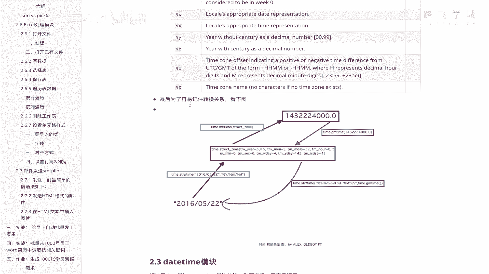