# 【2024年Python】8小时学会Excel数据分析、挖掘、清洗、可视化从入门到项目实战（完整版）学会可做项目 - P74：07 datetime模块进行时间运算_1 - Python金角大王Alex1 - BV1gE421V7HF

OK同学们，那咱们来快速的学一个这个data time模块啊，这个主要是表达日期的，用data time模块呢跟time模块，OK同学们，咱们来快速的学一下data time模块。

它跟那个time的那个模块的区别啊，这个那个主要表达什么时间戳呀，一些日期格式字符串啊，这个主要是第一个日期的表达。

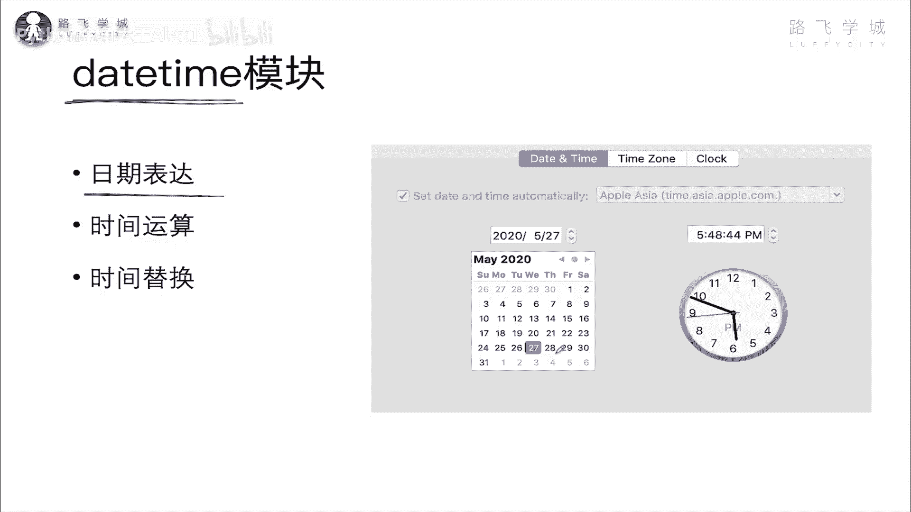

也就是它主要表达那么这种到天的这种日期啊，sorry然后这个啊进行一个时间的运算。

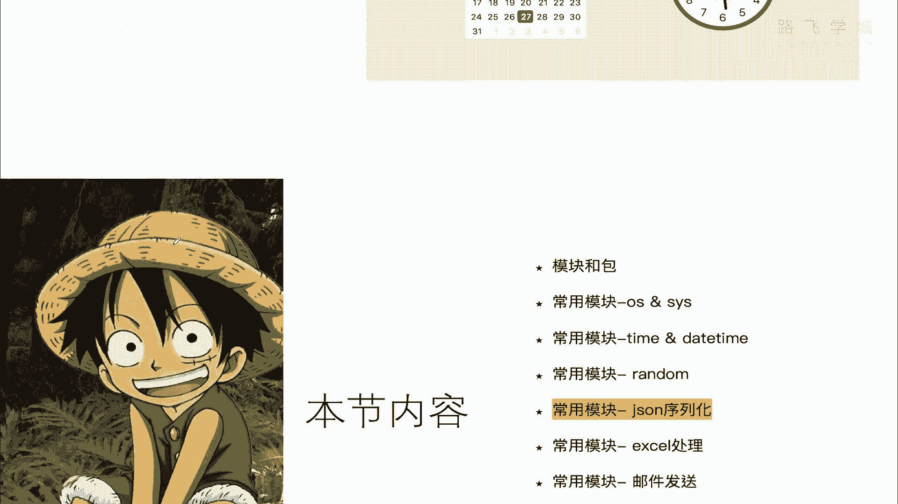

比如说啊多少天多少天之间的运算，然后还有一个进行时间的一个替换啊，这么三个事情哎呀一讲这个time模块。

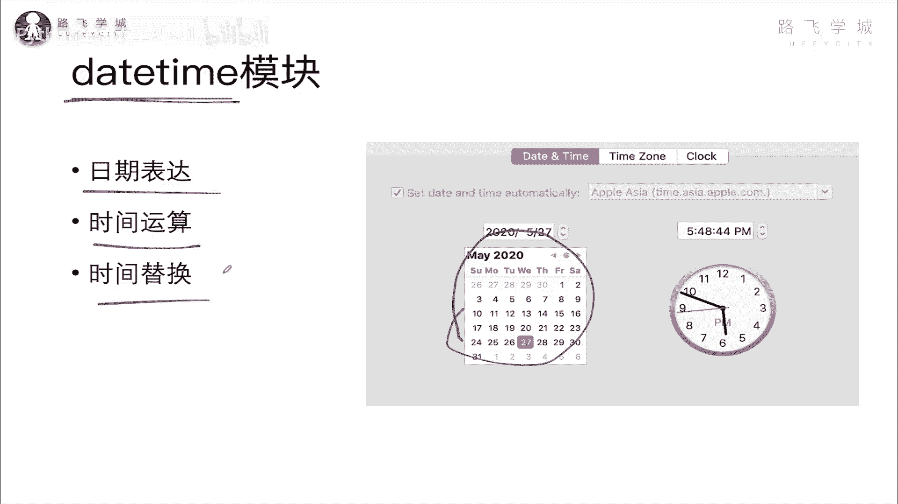

就感觉这个时光飞梭对吧，时光飞梭。

再过5年，看我现在的视频，那就想一想，嗨。

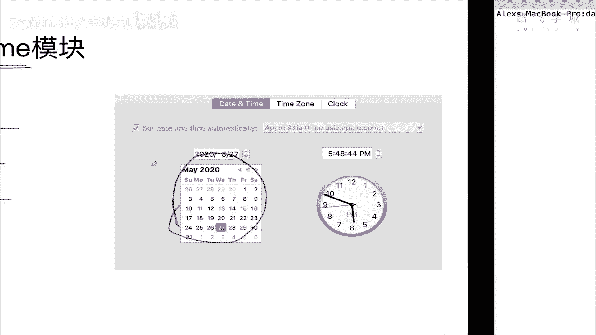

廉颇老矣是吧，有一首歌叫什么来着，叫叫什么来着，叫什么，忘记名字了，叫好，年轻的时候快乐那么简单，养生对茅台希望前途灿烂啊，忘记名字了，星光背后是吧，Anyway，唱的很好听啊。

那咱们直接来来来学这个time模块啊，哎你看啊，他这个里面呢有有有有好几个好几个，就是这个time里面daytime里面有好几个这种啊，子子类子类，咱们就叫子方法吧，然后呢第一个是表示日期的这个类啊。

它是一个类date，那就能打印当前的年月日，然后啊这个是表示什么呀，表示这个时间的可以打印当前的小时分钟啊，秒什么的，然后这个是表示直接打印啊，打印日期时间这什么啊，一会试一下吧啊打印时间间隔啊。

这是打印时区的，这就操作时区的，这个不用管啊，所以这是一堆，但是当然每个里面都有很多方法，但是这现在呢我跟你讲我们常用的啊，你记住你记住这么几个就行了，第一个返回当前的日期类型啊。

就是data time NO，data time点NO就可以返回当前的日期类型啊，然后呢啊这个这个这个这个，接下来可以进行时间运算，咱们先看这个吧，返回当前的时间类型啊。

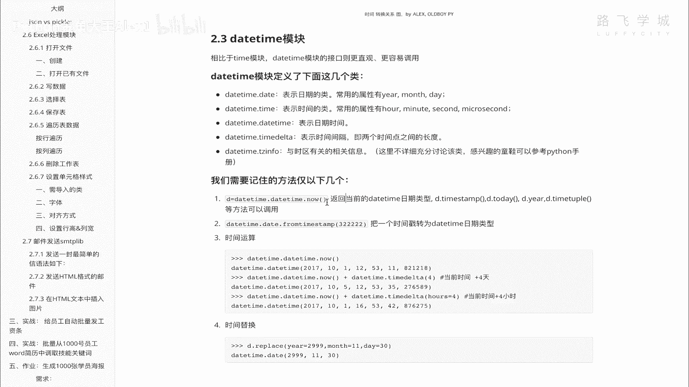

返回当前时间类型，为什么会爱上你，推动脑袋哒哒哒哎，直接print data time，点data time，点NO啊，OK吗，这个就把当前的时间打印了，看到没有哎。

就打印成一种默认打印成这种格式的好吧。

打印这种格式的，然后啊这个当然你还可以打印什么呢，你把它存下来，存下来之后。

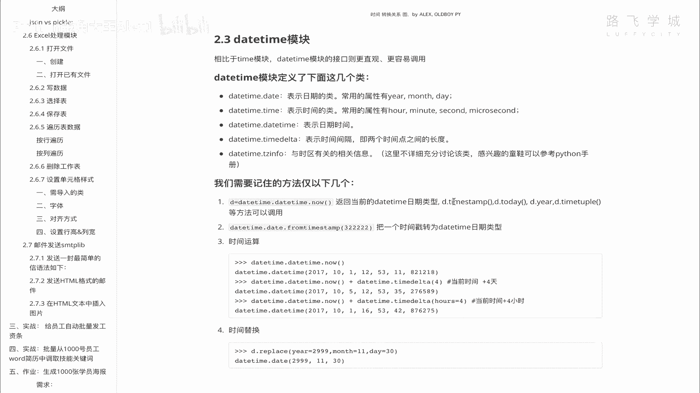

你可以打印他的时间戳，你比如说，你可以print d点什么呢，地点你看接下来就跟time模块串上了对吧，也可以进行这个日期格式的一些啊，这个这个啊比如说改成字符串啊，字符串格式啊什么的。

也可以打印时间戳，是不是啊，也可以打印这个什么呢，today啊，看到没有啊，today是什么呀，哦打印today就是这个当前时间，然后TMTMTM页呢不行没有TM1啊对。

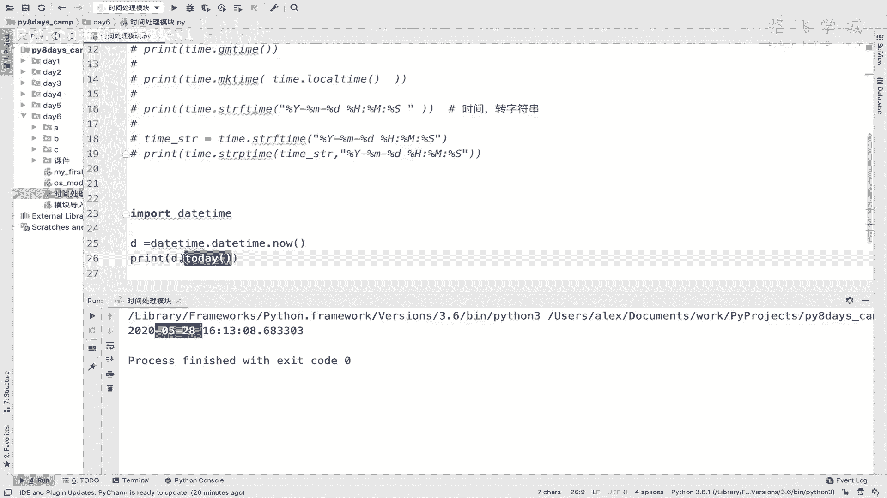

还有这个可以变成时间对象，time to元组的，看着对吧，你看是不是就跟time模块串上了。

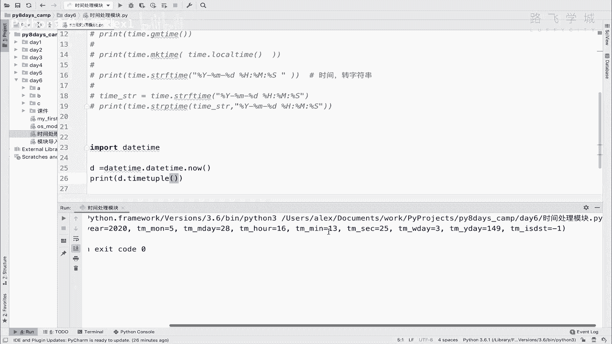

对不对，串上了啊对所以你大概知道就行了，大概知道就行了，那另外一个就是说from from time step，这个是什么意思啊，把一个你可以把一个时间戳转成这个。

DTIME的类型，把一个时间戳啊，就是时间戳，比如说啊放放嗯，data print date time点啊，叫什么啊啊，Time step from from dtime，点dtime from。

对这样啊，From time step，然后你随便写一个时间戳，然后看看它就会打印成什么时间类型了哦，看到没有打印成这种这个日期考试的时间类型，还是一个时间没啥用啊。

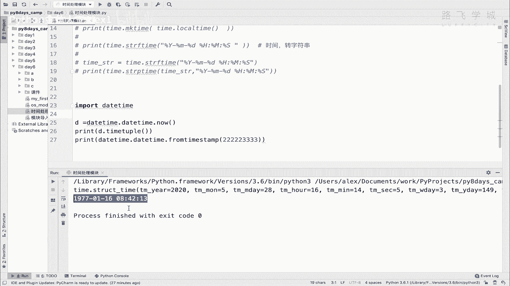

知道就行好，其实重点重点是这个啊时间的运算，这个是最重点的。

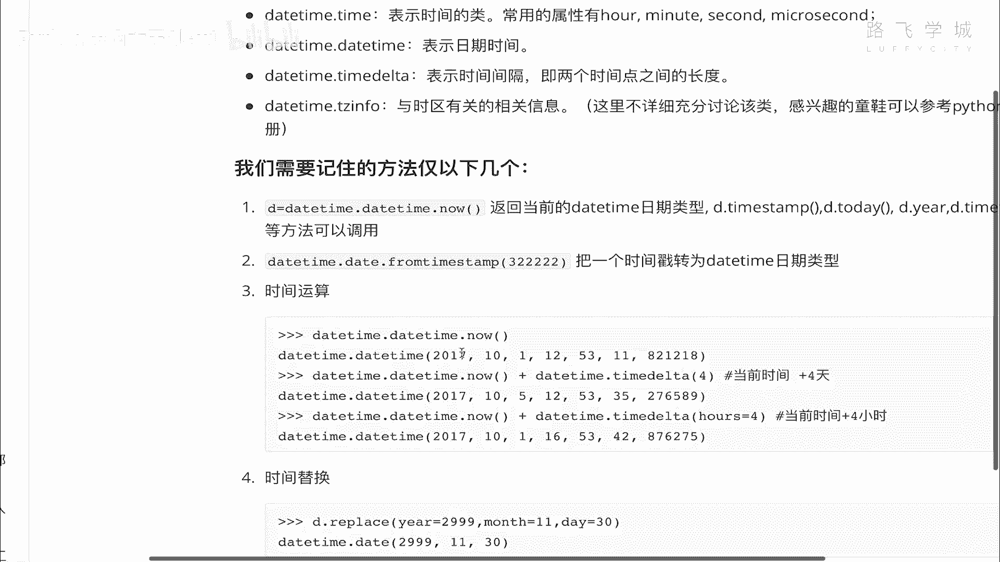

就是你可以进行时间运算，咱们呢啊现在就拿到一个当前的时间。

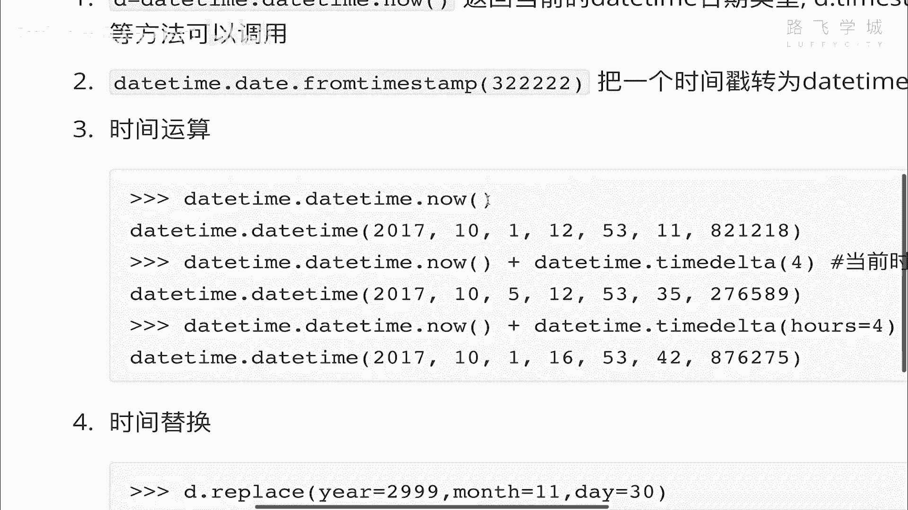

然后看啊，重点这个是time dtime，Time，Delta time delta。

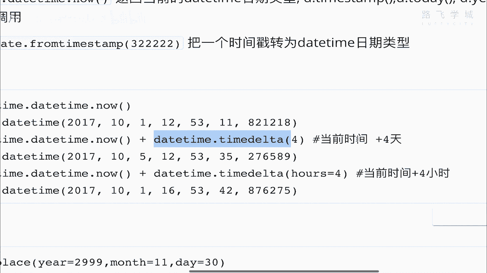

哎你这里面写了一个四，就是在当前的日期上再加四天。

看到没有，加四天，然后你里面还可以指定可以指定啊，我们来看一下，我现在比如说我现在的时间是一九啊，不不用了，我就直接啊，现在D嘛对吧，print d现在是这个时间，对不对。

然后呢我在这个D的基础上加一个什么呢，Data time time d time delta，看到没有，Time delta，这里面这里面参数可以写很多，看到没有，哎你你可以啊，点进去，点进去之后呢。

我看一下啊，你可以写分钟写秒写小时啊，然后还可以写这个天默认就是天明白吗，那这个时候我们就在这里先加一个五天吧，打印出来是什么时候啊，就6月份了，看到没，2020年6月六月这个2号对吧。

但现在其实是5月份，5月份对吧，当然你还可以减加一个负的，他就减五天，看到没有，是不是减到5月23号去了对吧，然后当然你还可以在这里指定啊，你比如说ours等一个啊，20点你给他改成20点。

看着这个14就会变啊，我看哦对sorry sorry，他是加20个小时，不错了啊，你加五个小时吧对吧，是不是就变成了20一点呀对吧，所以你就可以进行这样的一个时间运算啊，时间运算啊。

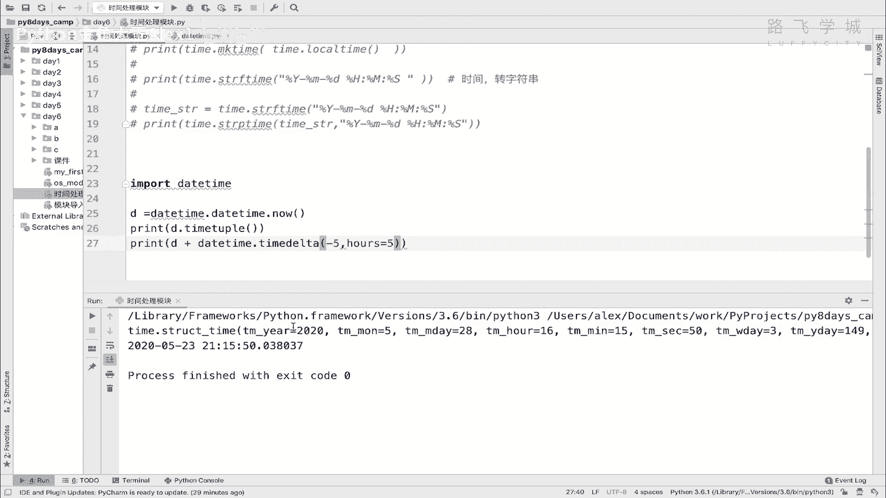

你直接相加是不行的，你必须要通过这个time delta明白吗，time delta你可以自己加一加试试啊。

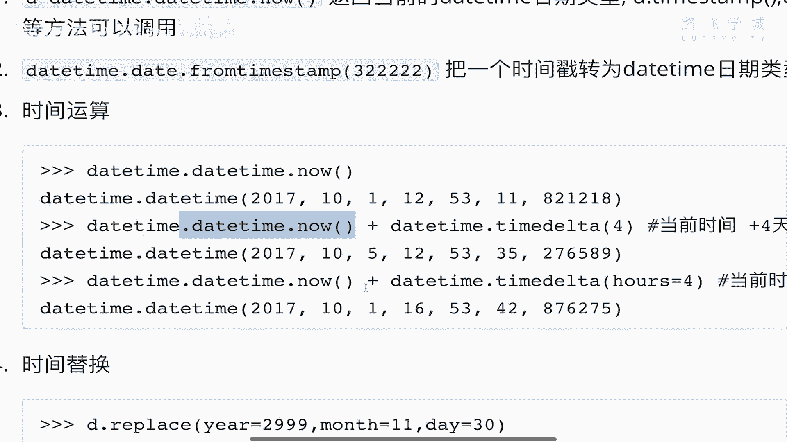

加加试试好，这个就是时间运算，另外一个就是时间替换啊，这个也是有用的啊。

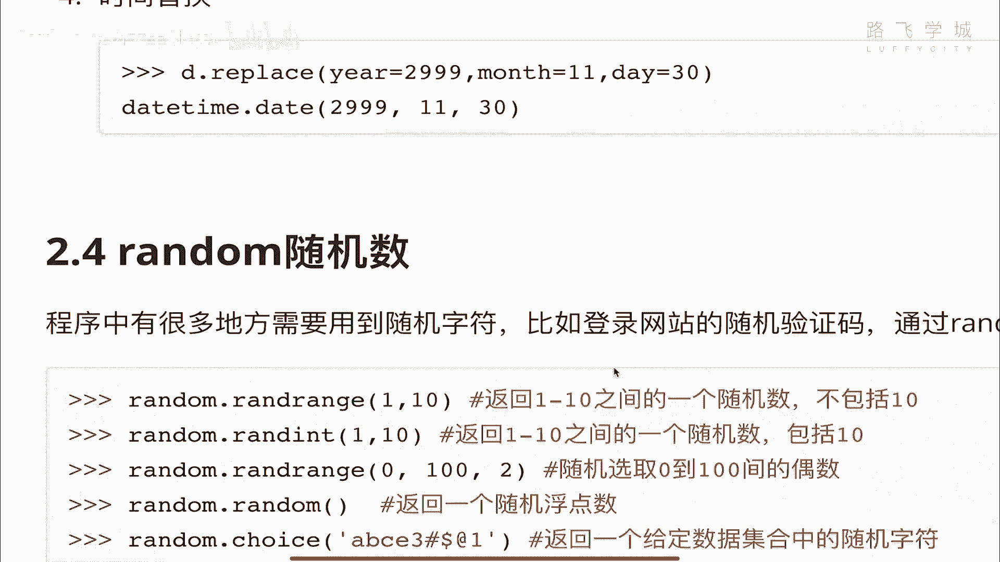

这个也是有用的，比如说你想你比如说我想直接把啊。

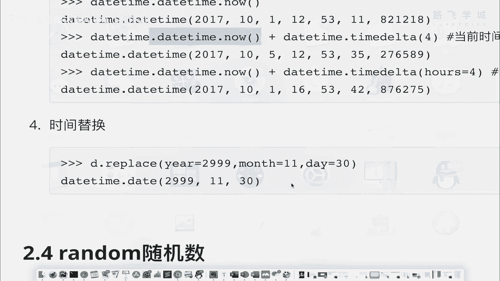

直接把这个时间往后拨个1000年，现在是两千二零年，播个100年吧，就是2120年对吧，2120年，那可怎么办啊，我就直接D点replace，看到没有，我看了replace，你可以指定换哪个。

我就直接把这个year给它换掉，换成啊换成这个21002120年看到没有，那这个时候你看一下，就一会一下子往后拨了100年，然后你再把这个month也换掉对吧，2020年的也就是100年之后啊。

我那时候已经50多岁了啊，50多岁了，然后呢改成那时候的8月份对吧，哎8月份大家看一下，细看，大家猜测一下，8月28号那个时候会发生什么吧，啊100年之后，100年之后啊。

好这个其实我们感觉100年之后是很远，但是呢对于那个100年之后，就是就是就是啊啊，这个80年之后出生的人来讲，20年也就20年的时间很快就到了，对不对。

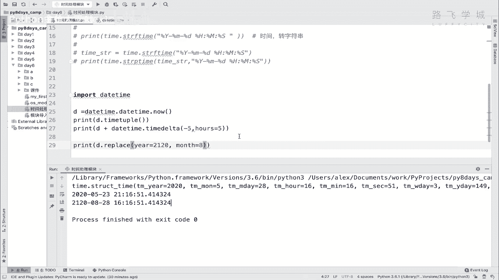

OK这个就是时间运算啊，时间替换时间运算这两个，OK你记住这两个就行了，同志们，到此DTIME咱们也讲完了啊。

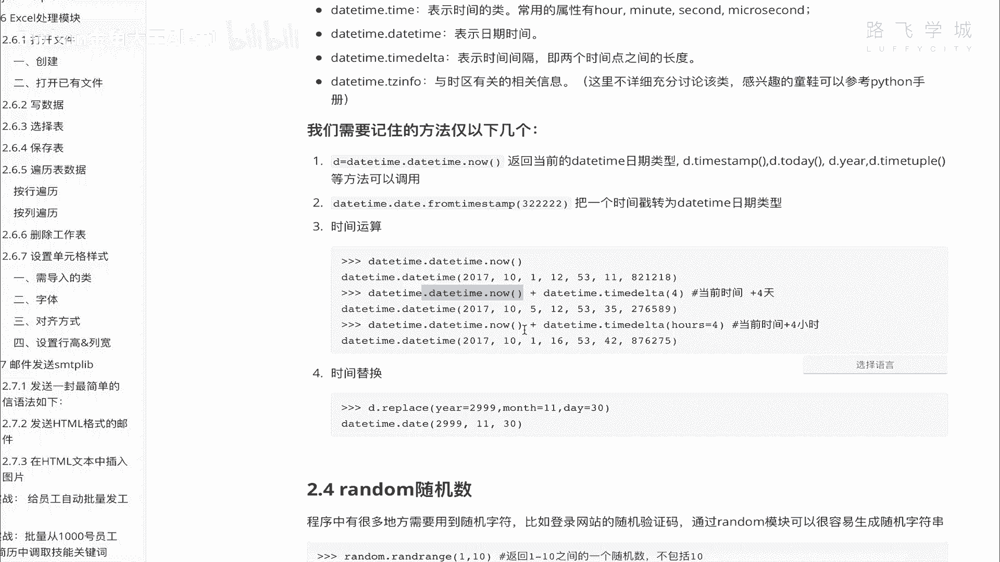

你们自己也再试一下。