# 【2024年Python】8小时学会Excel数据分析、挖掘、清洗、可视化从入门到项目实战（完整版）学会可做项目 - P77：10 花式遍历excel数据 - Python金角大王Alex1 - BV1gE421V7HF

OK同学们，咱们接着上节啊，咱们打开一个呢已经存在数据的一个excel啊啊，然后对里面的数据进行啊读取呀，操作呀。

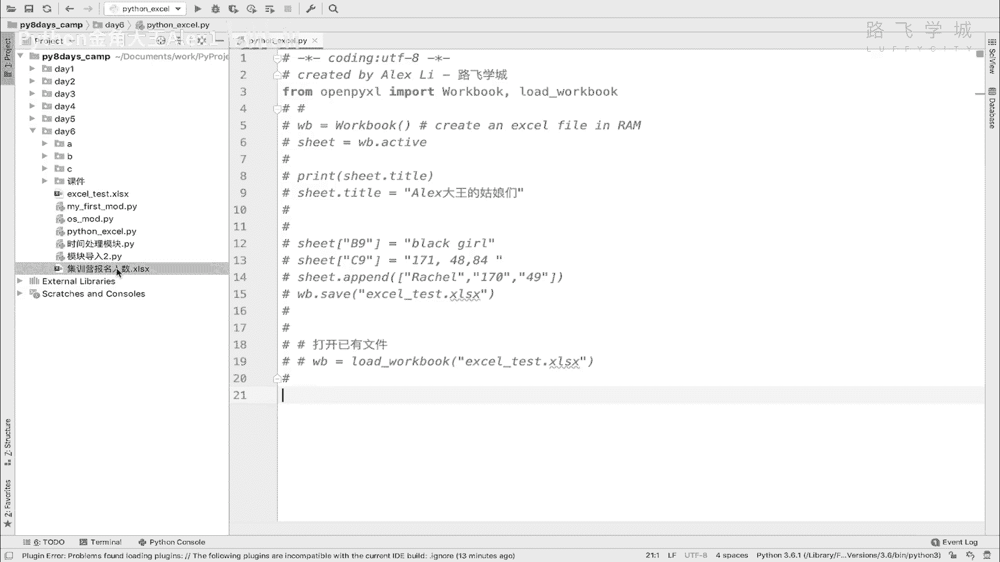

便利好吧，呃来大家看这里，我这里有一个已经存在的文件，它有两个表sheet啊，啊这是咱们集训营报名的一些数据啊。

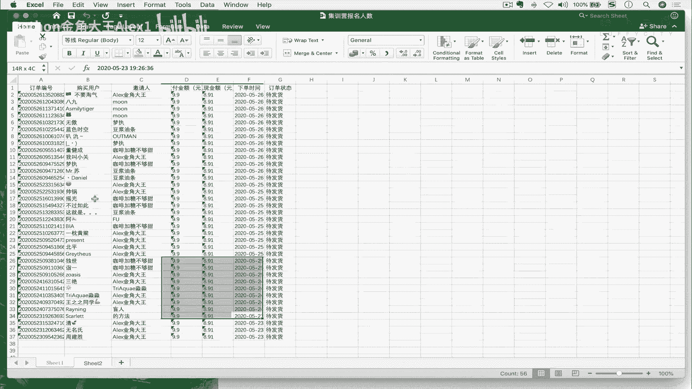

找了一点，那我们就啊针对这个文件我们干嘛呢。

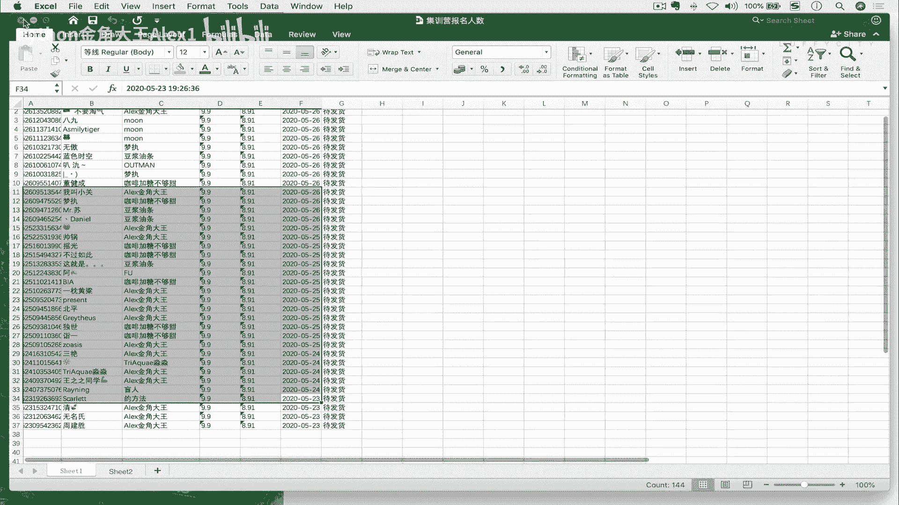

我们就去对它进行一个打开，然后读取里面的内容好吧，sorry啊，直接是WB等于一个啊，load你这个文件，然后叫做集训营报名人数，第2XLS哎是XK然后接下来呢我们要干嘛呢。

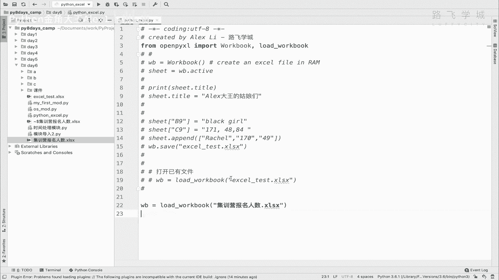

我们你你你要操作，你现在这里有两个sheet，看到没有，你要去拿到。

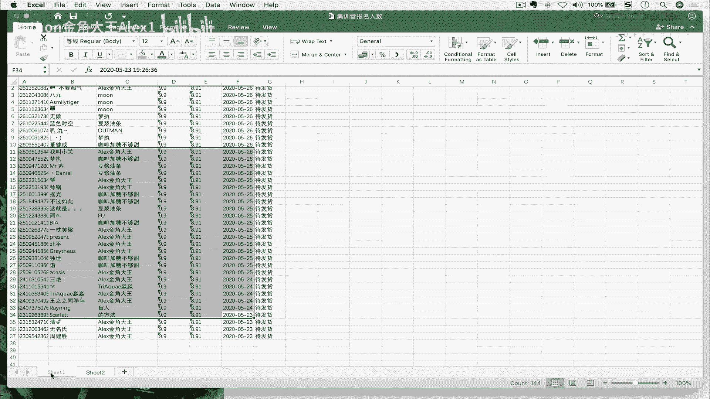

哪个是你你你你你要去把你这个sheet，你要取哪个，你取这个还是取这个。

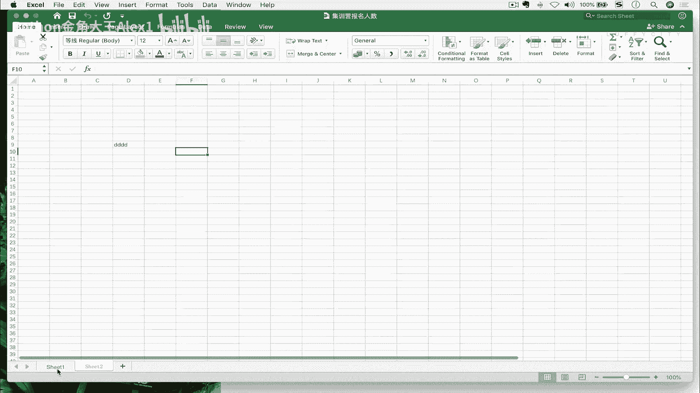

所以你要先去确定啊，我们可以先打印一下啊，怎么去获取所有的sheet wb点啊，这个什么呀，这个这个sheet names啊，names就能把所有的这个sheet打印出来，看到没有打印出来啊。

第一个第二个，然后你想去哪个去哪个呢，你还可以打印，就是get sheet names，Get  names，应该是呃什么呀，啊对也是一样的，跟上面一样的，把这个名字打印出来，然后我们还可以干嘛呢。

就是直接获取第一个获取第一个怎么获取呢，WB点这个什么呀啊，叫get sheet by name，看到没有，Get sheet by name，然后里面直接输入你的sheet，一看到没有。

你这个时候其实就拿到了第一张表，这个这个对象，相当于就是你可以拿到第一张表的对象，你就可以操作这第一张表，相当于你在内存里已经把第一张表拿到了，你可以操作它，你看啊你先print一下它啊。

啊print下套唉，它就是一个啊，就是相当于第一张表的啊，这个整个excel文件里，第一张表的这个，一个在内存里的那么一个对象啊，内存的对象，所以我们接下来要操作它好像就是啊，等一个等于什么呢。

接下来我是不是可以读取里面的值啊，我随便读一个，比如说直接，想读一个B第第二列就是B吧对吧，第二列的这个第五行，第五行不行，咱们来看是什么数据运行一下哎，大家看它会打印一个叫cell啊。

cell呢它是一个代表一个单元格对象，什么意思啊。

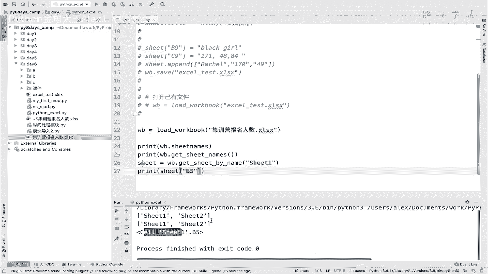

就是这个嘛，看到没有代表哎，这是这是什么玩意儿啊，一个头像哎这个单元格是一个对象啊，你可以对单元格进行样式操作呀，给他改啊什么的，它都是一个，就是每个单元格都有自己的属性啊，都有自己的属性。

我们呢现在想拿单元格的值啊。

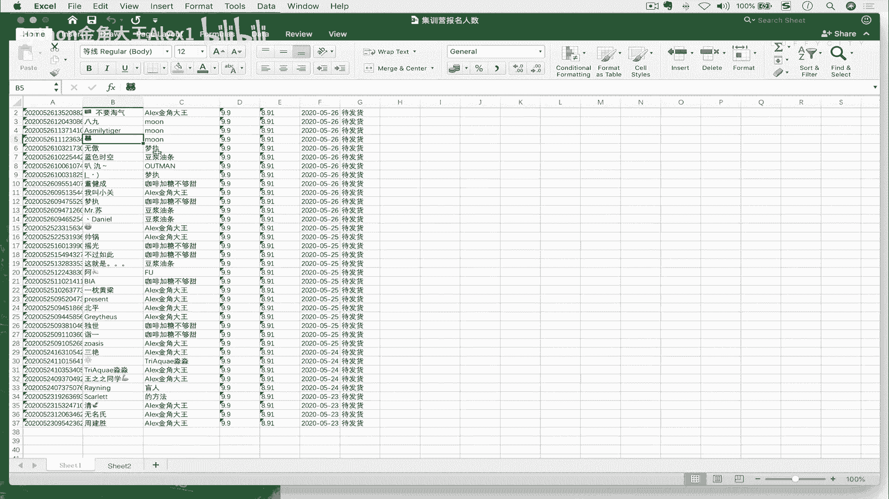

想要拿单单单元格的值怎么拿呢，直接看啥啊，直接是呃点value，啊点value啊，save点value其实是点value，然后执行，大家看是不是就打印出来了，哎就把这个小熊啊给它打印出来了。

那好我们就获取到的值，获取到这个值之后，同志们，我们现在只是获取到一个。

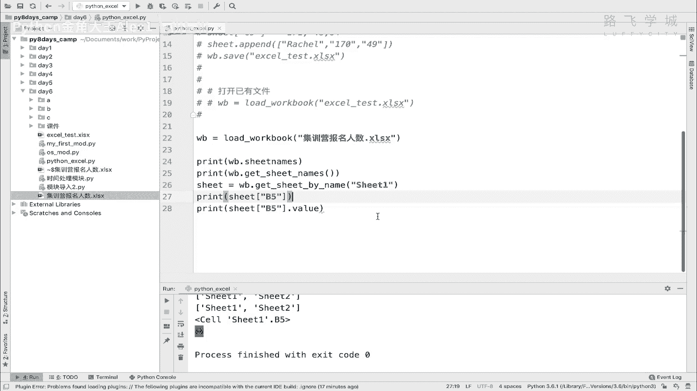

我们比如说嗯想获取想获取多个啊，想获取多个，或者是这样吧，我们想寻循环啊，对想获取多个怎么获取，比如说我想获取从这个啊。

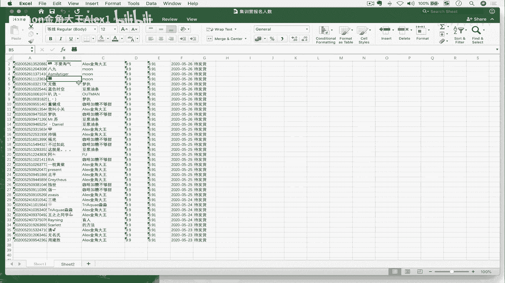

从这个什么呢，从这个B6到这啊，这几个数据是吧，这几个数据可不可以获取呢。

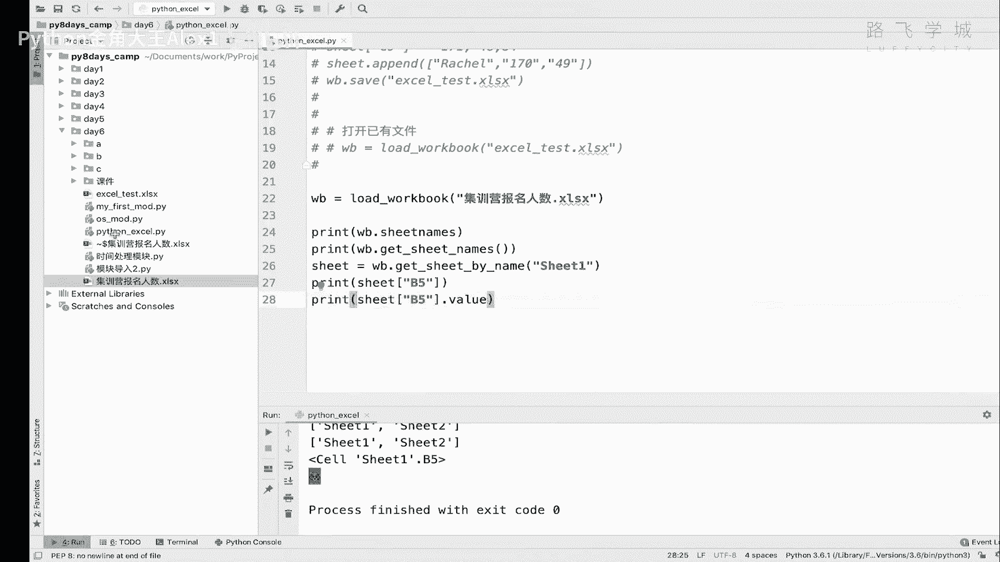

我们来看一下啊，看一下看一下看一下看一看，看一看看一下看一下啊，好像我这里没写，但是我们来试一下吧，是不是这样是可以的呢，我们来试一下，直接B6到这个啊，计时吧好吧，然后我们来看一下可不可以啊。

可不可以，这个我也不确定，哎大家看是不是没有问题啊，哎好开心，你看它就可以类似这种切片的形式，看到没有，哎你就获取到了一个列表啊，一个元组的形式，然后我们可以是不是可以循环，就可以把这个数据打出来了。

for这个cell in这个它对不对，sell这单元格嘛，然后呢这个print cell每一个的value是不是就可以了，咱们看一下呃呃呃诶不行吗，直接那直接打三呢，sell点VAL嘛，对不对，哦对了。

Sorry，Sorry，你看他获取到的每一个是一个什么呀，是一个又是一个小元组，你必须拿到第一个值之后，才是拿到的这个单元格的对象啊，你是这样拿到SL0，看到没有跳零。

然后呢给他打印他的value就可以了，看一下大家看是不是就把这个value打印出来了。

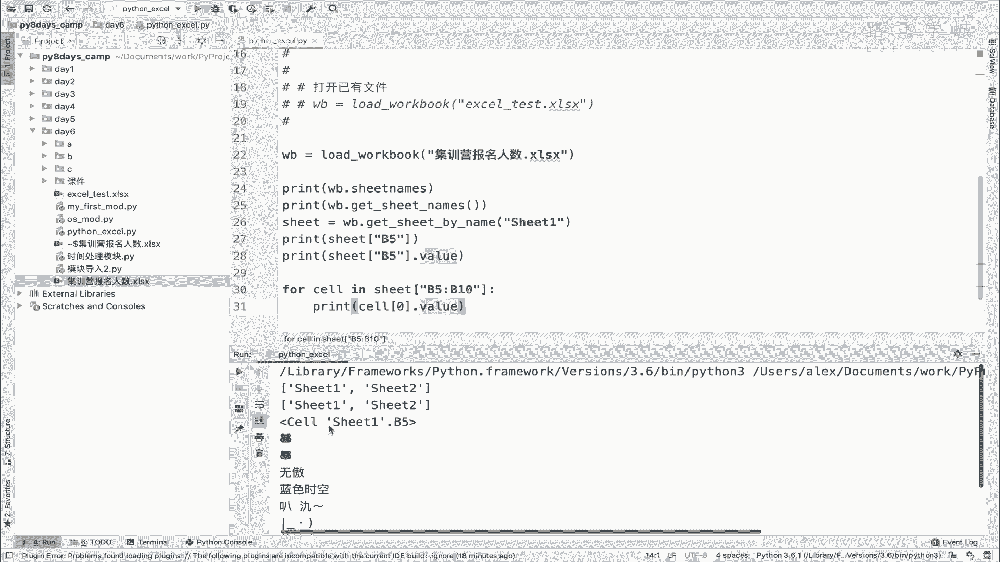

明白吗，哎这个是说这个什么呀，这个这个可以可以切片似的，就是说我直接获取到这一段的纸，它也是可以的，明白吗，那我现在如果想去对整个这些数据，进行一个循环，全都打印出来，可不可以呢，当然也是可以的啊。

稍等把这个啊啊，这个获取这个指定列的切片数据。

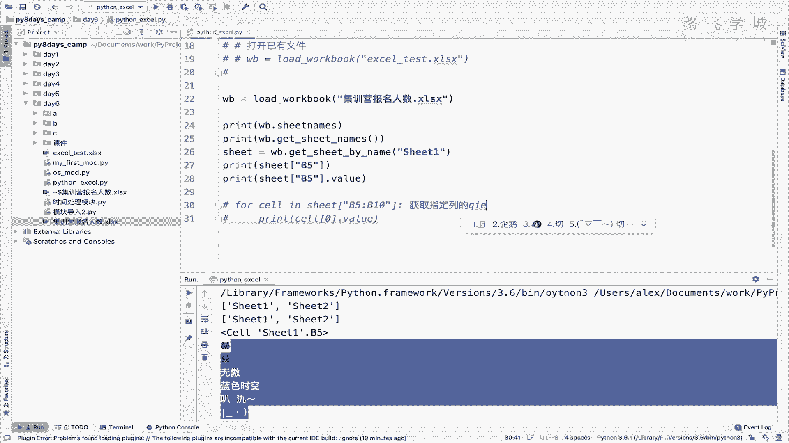

是啊，这边数据，然后我们现在来看我循环我的这个什么呀，循环我的这个表循环这个表可以这样，你看啊直接是什么呢，直接循环你整个表看到没有，按行循环，按行循环，然后在行里面每一再找。

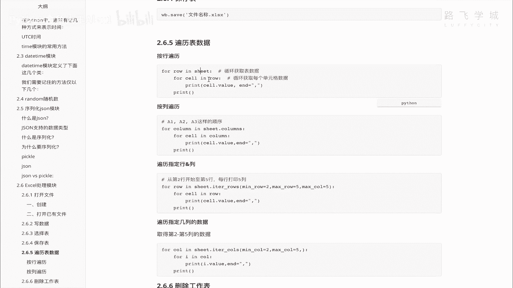

每一再在行的时候再找每一列，就是先按行一行循环。

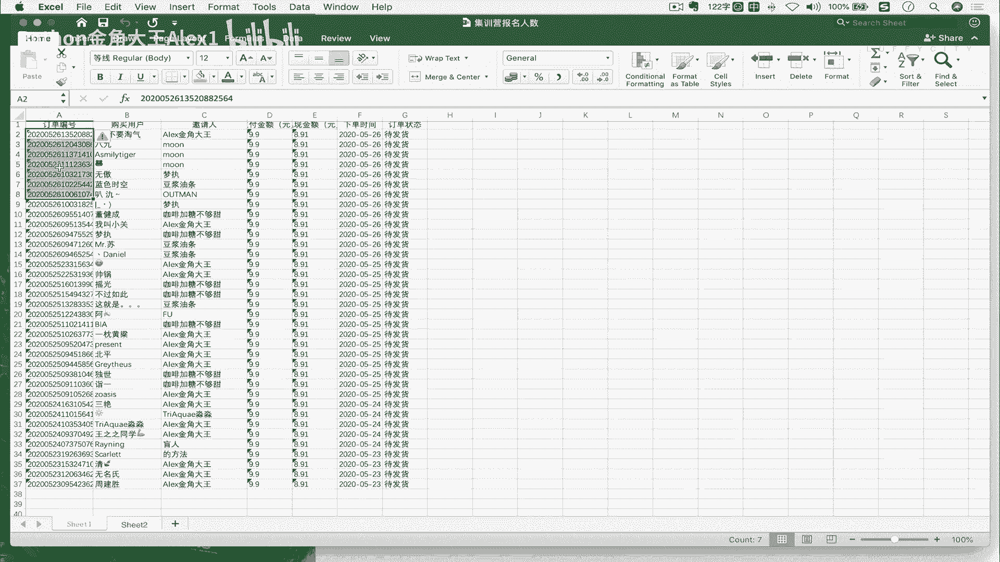

然后在这行的时候每一列再去循环对吧，每一列代理循环来，大家我们来看一下。

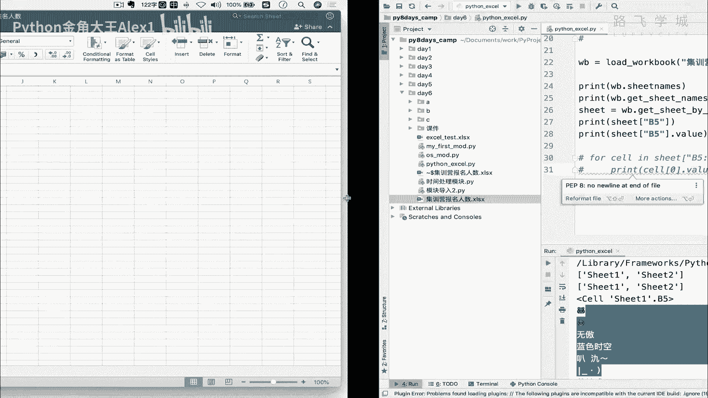

你直接for循环for这个录音，这个这个sheet in这个sheet是吧，这个时候你print的是肉，看着你print的肉执行一下，大家看你看他print是一个大的，一个一个一个一个元组。

一个一个括号的一个列表，然后呢大家看每一每一个括号里面又有很多列，看到没有，A1B1C一是吧，A二B2CS，然后所以呢我再继续循环这个每一行的数据啊，每一行的数据我怎么循环呢。

所以在这里project sl啊，in这个roll是吧，然后print cl是吧，点value就出来了，大家看一下princel value，同志们，大家看一下，你看是不是就出来了，对不对啊，订单编号。

这是第一行，是不是啊，这是第二行，这是第三行，第四行，第三对不对，但是这样打印出来感觉有点乱，是不是啊，我想让他也像这种类似这种格式打印。

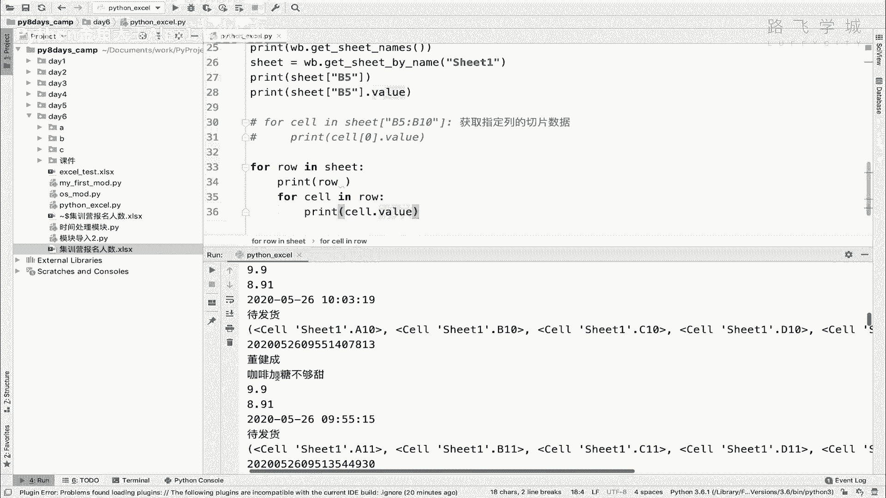

对不对，第一行那就全在第一行是吧，那没问题啊。

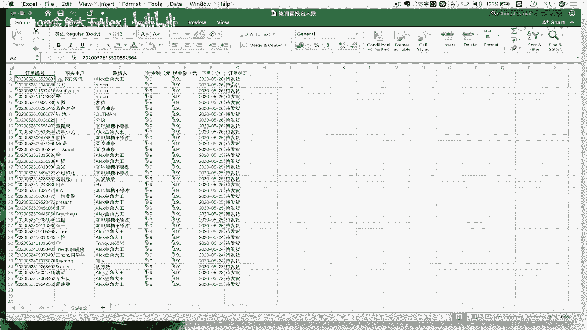

没问题啊，怎么做的，很简单呀，咱们直接print的时候让他干嘛呀，不要换行就行了，是不是end再等一个空格和逗号，是不是，然后在这里再加一个print换行，这不就解决了吗，把这个去掉啊，这个不要。

这不就解决了吗，我们来看一下，哎，同志们看是不是这些数据就出来了。

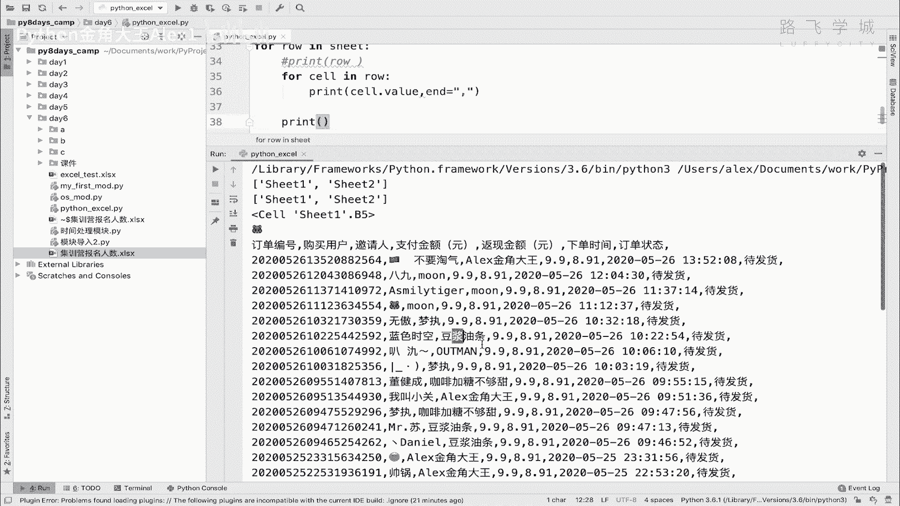

没错吧，哎这些数据就出来了，好这个就是循环咱们的这个excel循环。

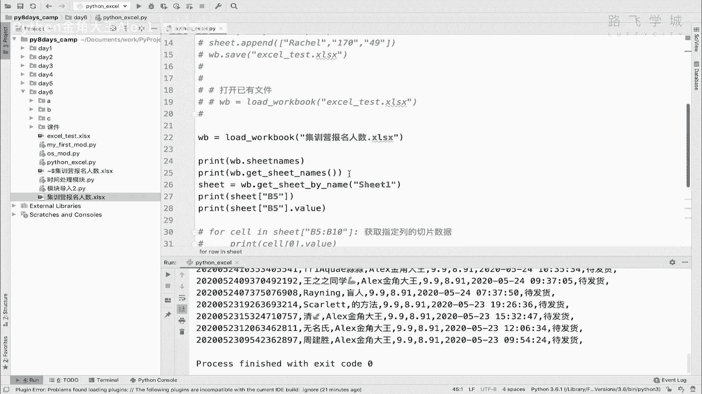

咱们excel好吗，循环完了之后，我们还可以指干嘛呢，我们现在是整个文件循环，你还可以干嘛呢，你还可以指定的这个说我只循环其中一部分，怎么选指定循环其中一部分呢，啊你就可以你就可以这样，你就可以这样啊。

这个for row in这个sheet eees这个语法，然后在这里说指令我从第二行开始循环。

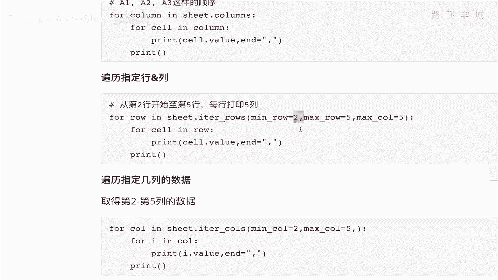

循环到第五行，然后呢只循环其中第几，其中几列啊。

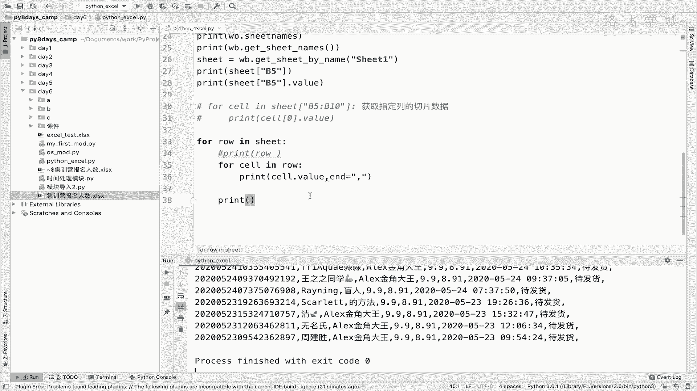

什么意思，咱们来试验，比如说我想循环从这里看到没有，从这里我只循环就是先画这么一块，假如说看到没有循环这么一块，那就是从第四行开始循环到第二行结束，然后呢啊12345循环五列，看到没有，那你就怎么写呢。

直接啊直接是。

直接是for这个诱因，这个sheet点一，点it rules是吧，it rose是这个语法，it rose对，然后呢这里面写他怎么去提示mu啊，从第四行开始，然后max ro啊，就max到第21行。

然后max max这个column c o l是它的列嘛，column一共是五个，看到没有，你这样带for style in这个肉是吧，那print cell点value啊。

然后end等一个他然后print啊，大家来看，这样的话是不是就能实现到2~21行是吧，没关系啊，是咱们来执行试一下就知道了，大家看是不是从第四行开始的啊，AA什么A什么，是不是从这开始的，到什么结束呢。

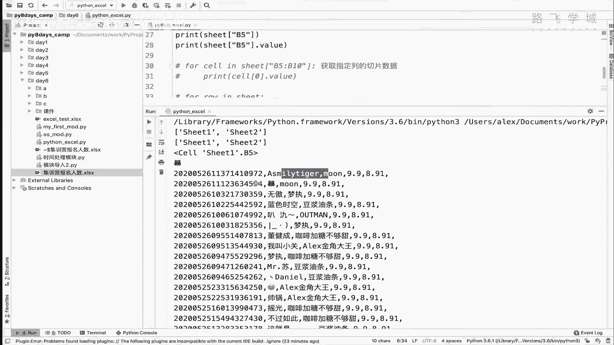

F u f u f u f u f u，因为我们是写的21行嘛，所以得到这个B5BB一下。

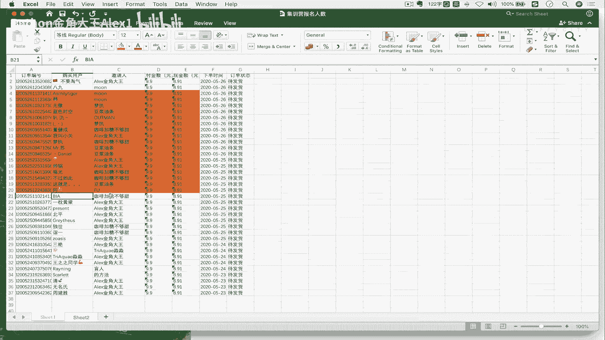

是不是到B这个地方哎结束，然后五一共是五列12345。

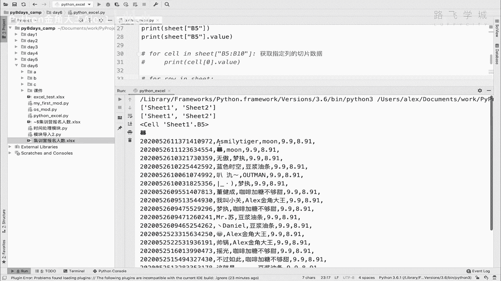

是不是后面这个什么时间呀状态呀都没要，没错吧，所以这就是说你还可以就是选定一块区域啊，这个是还是挺有用的好吗，然后我们现在的循环都是针对什么呢，就是从就是行的循环，行的循环就是对吧，先循环到一行。

然后在行里打印每一列数据对吧，它还可以做一种什么呢，按列的循环，也就是说我指定循环这两列，看到没有，我指定循环这两列的数据，明白意思吧，指定学完这两类的数据，那可怎么做呢啊那可怎么做呢，哎这可以做的啊。

我就只要这个邀请人和那个和这个什么呀，和这个啊付款金额好吧。

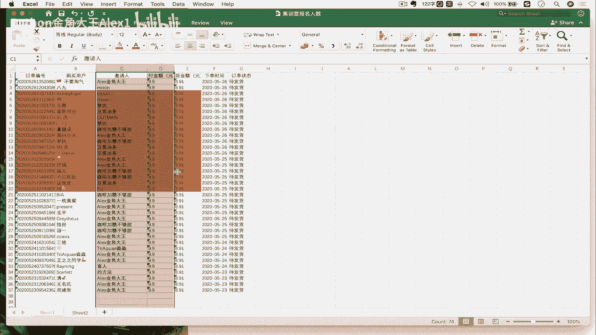

那就是DC和D点，C和D点啊，那这种循环是指定列循环在哪呢，对按行遍历，按列遍历，看到没有，直接是forecall in这个sheet columns，然后呢你接下来就是这个什么呀。

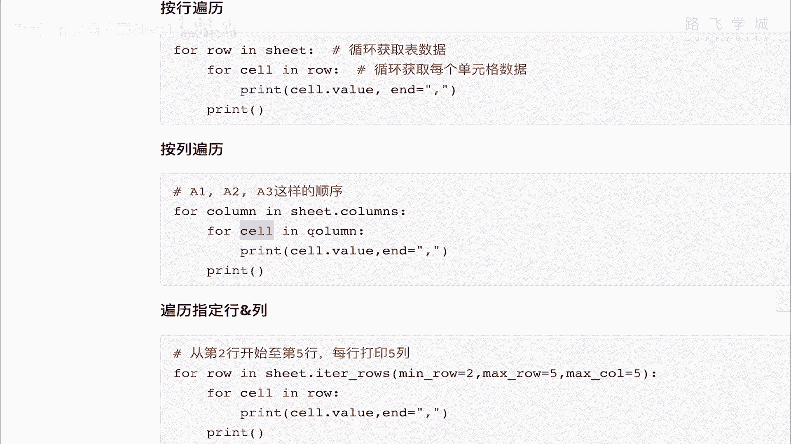

就是循环每个column，然后打印里面的这个值就是按列来循环，我们来试一下。

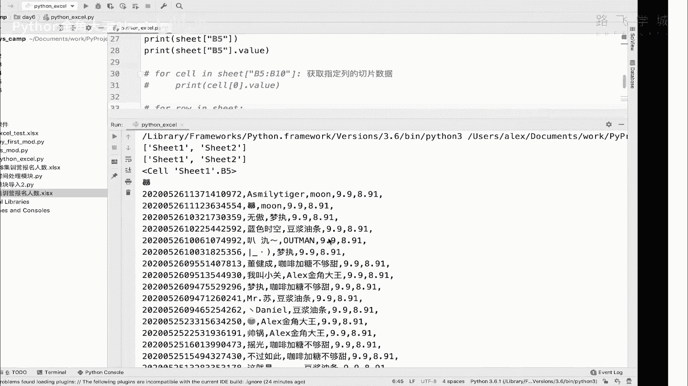

试一下，上面都是按行，接下来是按列，按列循环啊，然后他就是for这个column对吧，in这个啊，点columns哎，怎么都不提示了，不提示我可记不住语法呀对吧，COLUMUMNS对。

已经重度依赖代码编辑器了，然后你print coo l，咱们来看一下print c o l啊，咱们来看一下，大家来看一下它这个循环它就是看到没有，就全都是就是按列了，直接A1A2是A3。

A4到尾部看到没有。

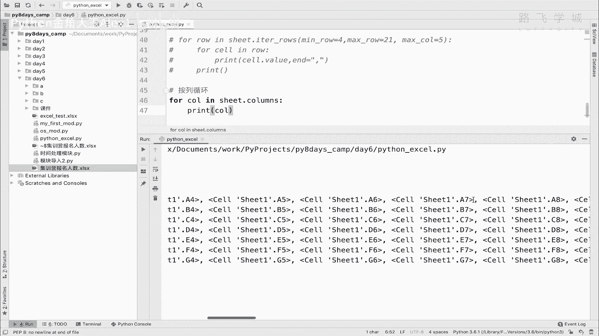

看到没有，看到没有，全都是A开头的，你看相当于比如说A走到A的话，就是就是这样先走下来，然后再走这个是吧，再走这个就这样的啊。

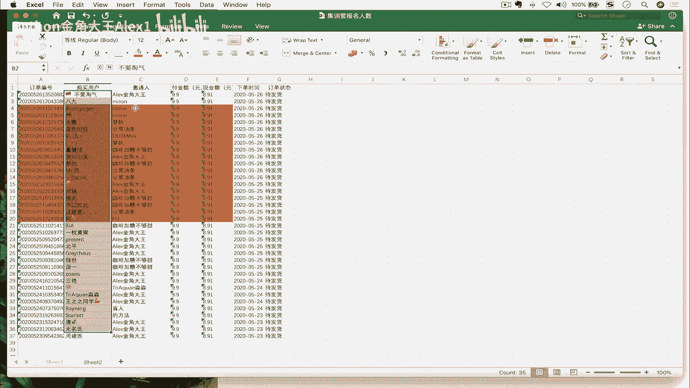

明白吗，然后我们来去啊，Sorry。

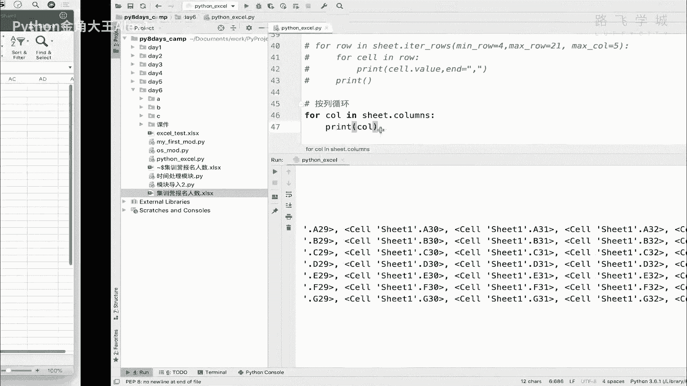

打印打印什么呢，打印这个啊，再去循环这个for cell in这个coo l啊，然后print cell点VLUE，然后N的等一个他，然后print，这个时候我们来看一下，它出现的结果就是什么样子的呢。

他就会发现，你看他会把订单编号全都变成了一行啊。

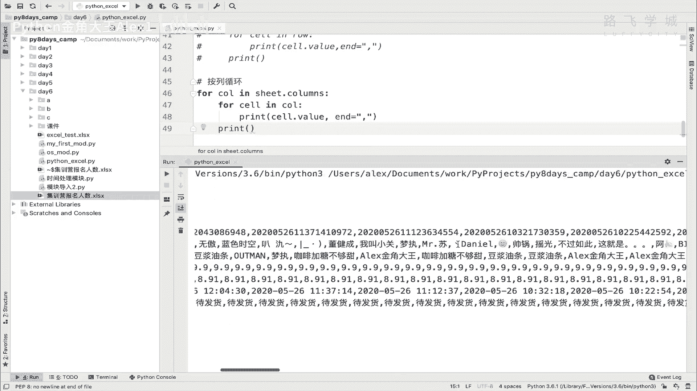

订单编号全都变成一行，你看也就是说在这里订单编号本来的话相当于，对不对，每一行是是是是是这样打印的对吧，他现在再给你竖过来了对吧。

先把订单编号打印完再打印这个再打印，那个看到没有邀请人什么的，对不对，那好这个就是案例啊，有的时候还是有用的，有的时候还是有用的，那接下来还可以按列进行这种指定的列循环，我不循环所有列。

我只循环这个什么呢，我只循环这个啊，叫做邀请人和这个，那就是C和D是不是啊，所以呢我就是for啊，这个叫iter cos，应该是这样啊，记不住了啊，max啊，对应的就是这个max column啊，不对。

就是main column，main column就是从这个什么呢。

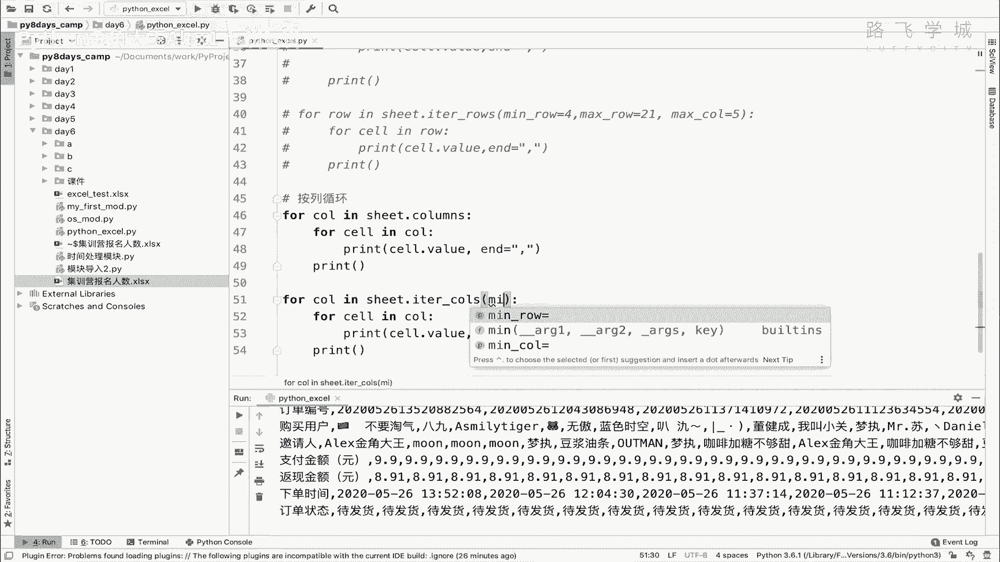

从这个那就是啊应该是一二，他应该不是从零开始，从一开始1233，然后到四对吧。

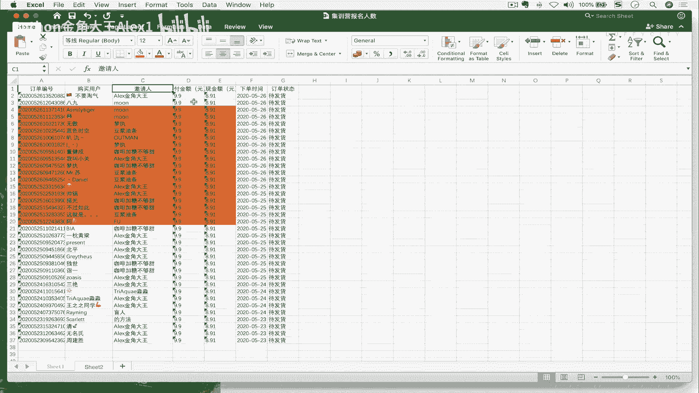

3~43，然后max column4，看到没有，然后呢，当然你还可以指定入啊对吧，MR啊，MIU是第四行，第三行，然后max ro也可以啊，max ro对吧，第20行啊，可以吧，这样也是可以的。

然后我们执行一下。

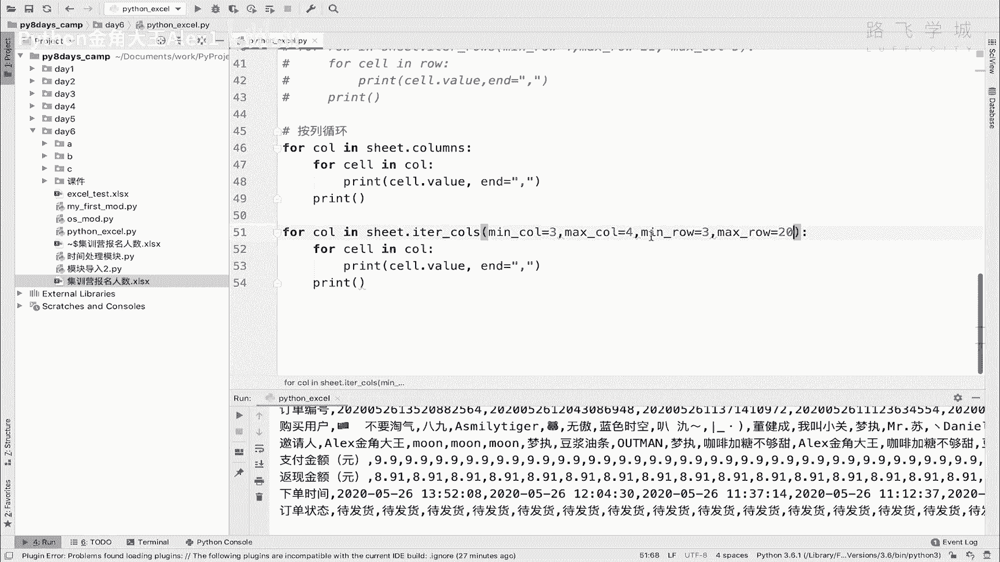

执行一下啊，这个都撕掉。

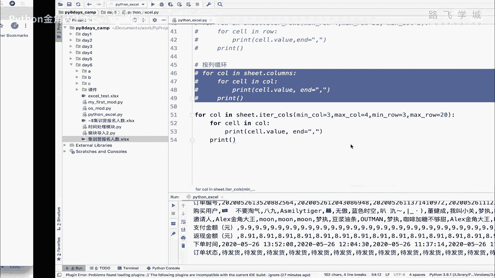

然后上来，大家来看一下看一下啊啊啊啊哎呀，你这个设置的这个我看看啊，设置了这个肉之后，他就把这个表头打印不出来了对吧，这是入职后这啥玩意。

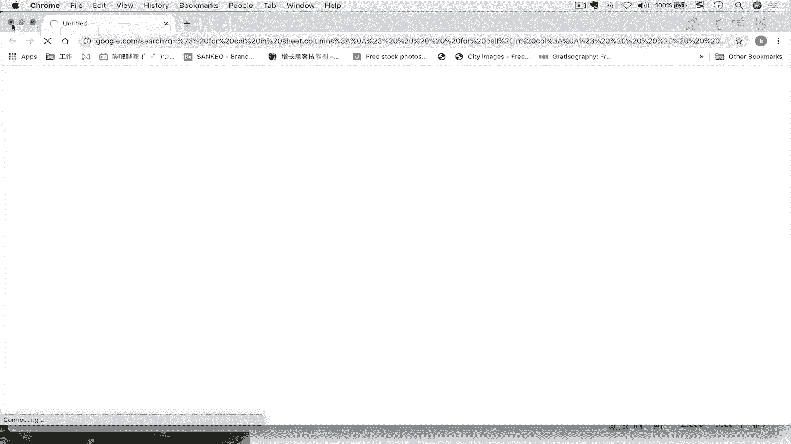

这是入从三行开始，它是从这里的，看到没有打到这是吧。

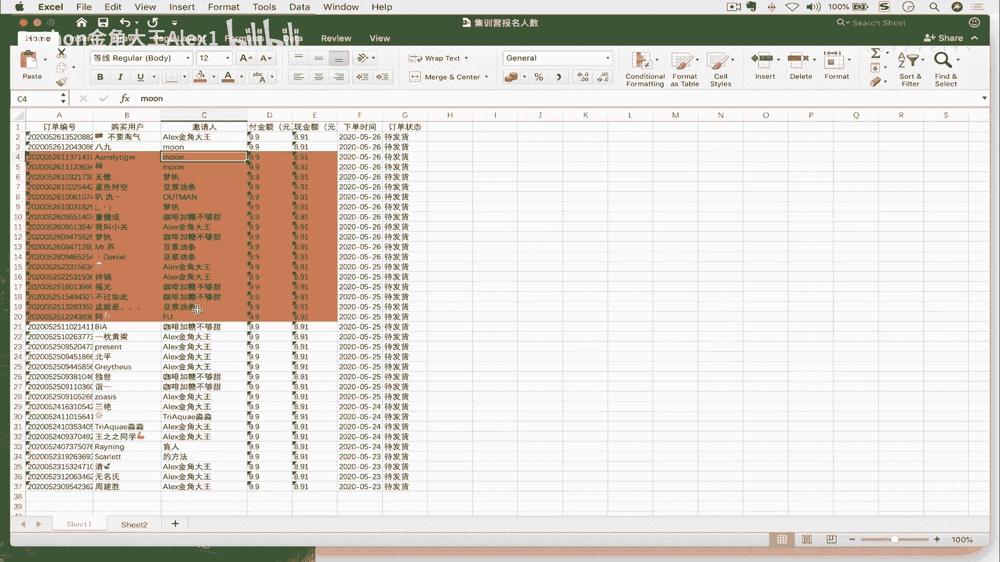

就从这里打到这MN到FU是不是看到没有是吧，9999，这个没什么好看的好，那这个就是啊按列循环指定的列循环好吗，好到此为止，我们看还有什么呀，还有什么没讲啊，还有什么没讲啊，还有这个这个删除对吧。

删除的话就直接remove一个就行了，Remove，然后它就保存一下就可以了啊，这个你自己试一下啊，接下来就设置单元格样式，我们下一小节嗯，对这个就没什么问题了，基本上咱们就讲完了啊，基本上就讲完了。

就这么简单，你看是不是操作excel表还是不难的是吧，那现在我们嗯干嘛呢，我们可以这样，我们可以给这个已有的这个文件给它改个改改，就是给他改个数据，改个数据，然后给它保存下来啊，看着啊。

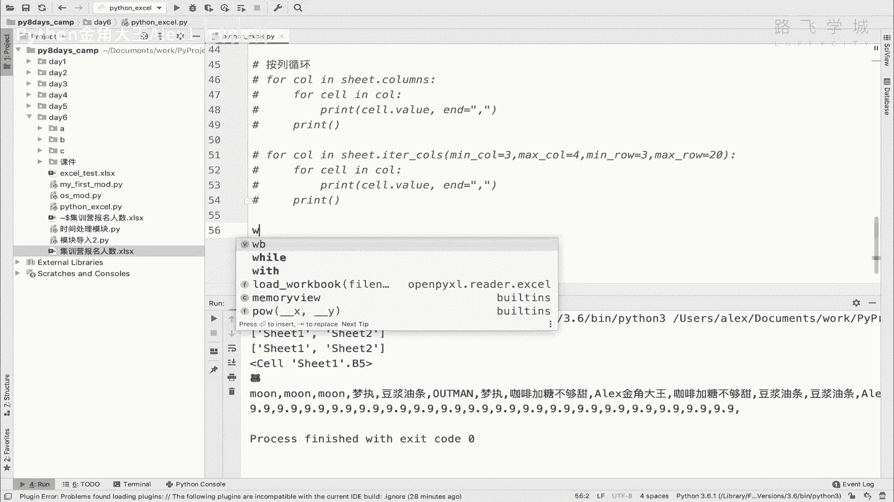

然后我们把这个BB5吧，B5是谁呀。

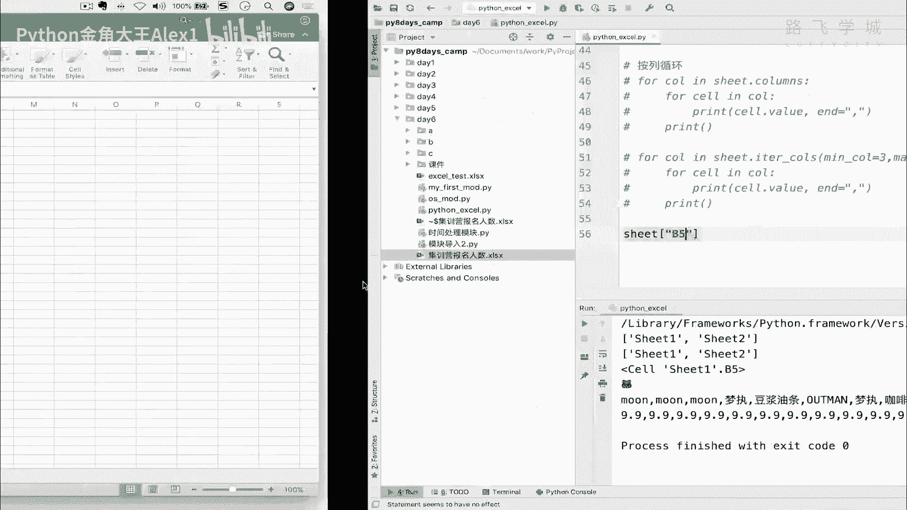

B5还是这个谁呀，小虎是吧，小小熊小熊这个头像我们给它改成啊，这个金角大王是不是啊，这个时候改完之后呢，注意了，你最终要保存是不是啊，这个叫啊WWB点save，是不是按save的话。

同志你你现在在你你没有办法，你就是你你不是说改到原来的这个文件里，你要改回新文件啊，你要你相当于你是改回到一个新的文件里，你要想改的原来文件，它其实也是把原来的给它覆盖明白吗，因为现在全都在内存里。

这些数据明白吗，那咱们给它改成差点二吧，啊啊跳点二，然后这个你一执行，那他肯定就改了。

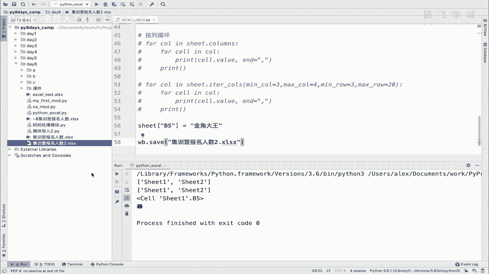

对不对，是不是改成金角大王了，那有同学说我不想这个什么。

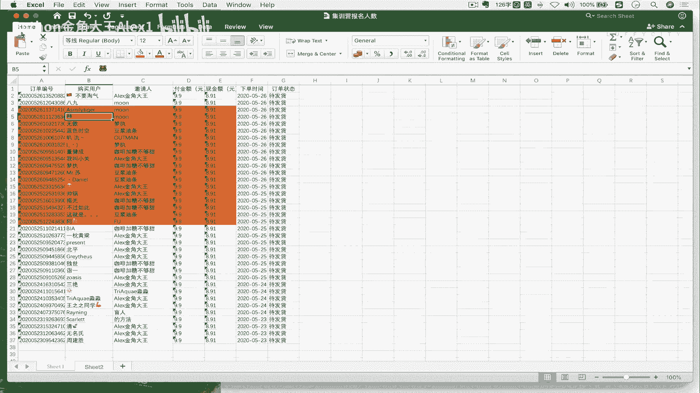

我不想改，我就想覆盖那个覆盖那个也没有问题，那你就得那你就那你来吧，对吧啊，大家看你就覆盖了对吧，相当于又保存回去了，OK这个是修改好吧，好同学们，那大家你们自己对吧，就把从头到尾都试一下好吧。

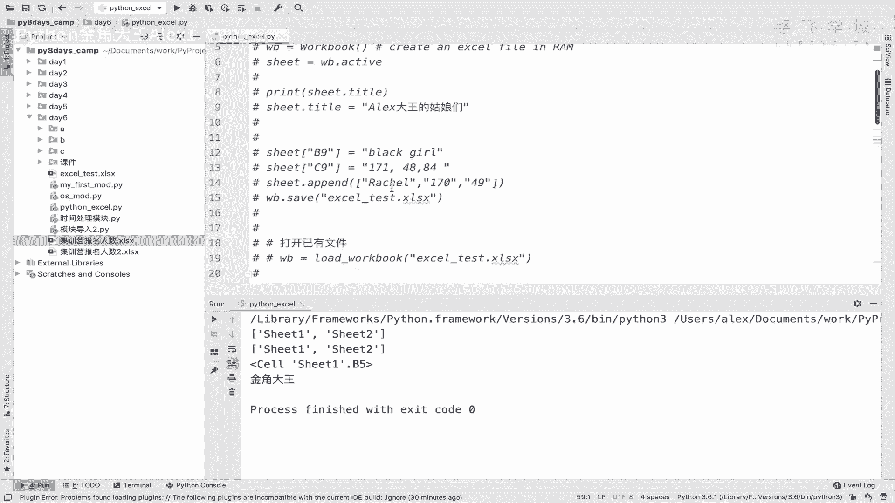

OK那这一小节就到这里，下节我们给这个表里面上一些样式啊。

上一下样子啊。