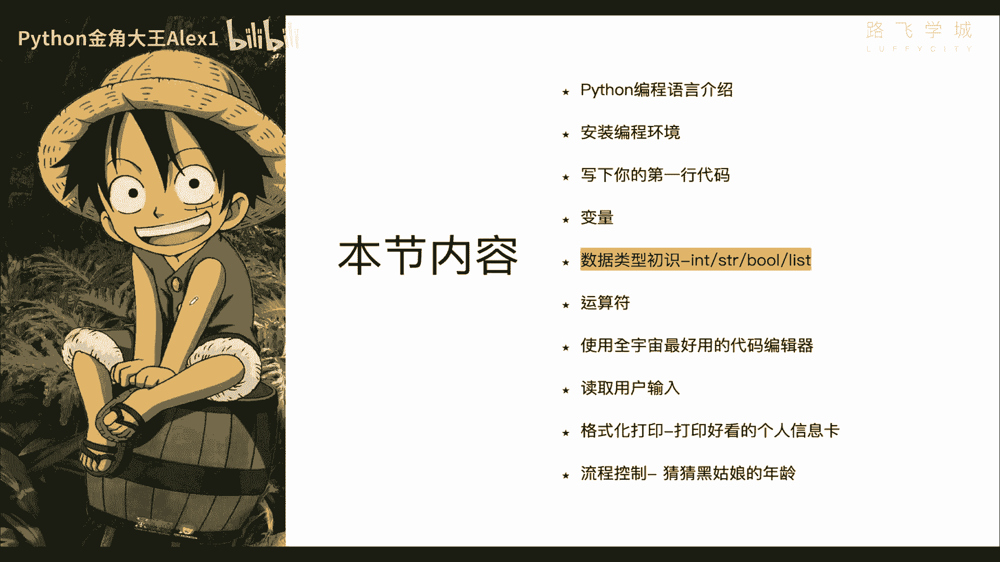
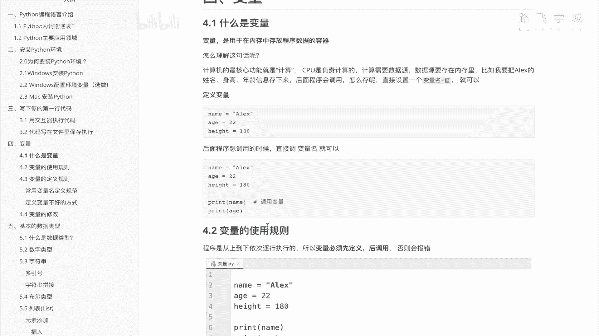

# 【2024年Python】8小时学会Excel数据分析、挖掘、清洗、可视化从入门到项目实战（完整版）学会可做项目 - P7：06 变量来了 - Python金角大王Alex1 - BV1gE421V7HF

OK同学们学完了CPU内存硬这个硬盘的关系啊，这节正式学变量，因为咱们会用到啊内存，那咱们直接说这个变量先不用看这些图啊，这些文字不用看，直接说这个变量，所谓这个变量啊。

就就是顾名思义就是可变的量，也就是可变的值，就是可以变的值，OK咱们之前学数学的时候，是不是啊学过变量对不对，但我记得小学就应该学小学五年级，这么忘记了啊，比如说咱们定义一个方程。

是不是X等于一个Y加个六，是不是啊，那X和Y它都是变量，我们比如说给Y赋个值啊，X就就是等于十，是不是啊，那相当于这个其实就是临时，这对吧，它就是代指一个值，我们附近什么去啊。

它就是导致这个输出会有变化，好这个是纯粹为了计算用的，但是在计算机里这个变量啊，计算机这个变量呢它的定义还是不一样的，计算机的变量来看这一句话啊，它是干嘛呢，它是用于在内存中啊，注意了。

用于在内存中存放啊，内存注意啊，关键词存放程序，数据程序什么数据程序运行数据啊，这地方少了一个运行运行数据的一个容器，能理解意思吧，存储程序运行数据的一个内容器，也就是说它它只是为了在内存中存数据。

OK吧，那好先大概记住这个，那咱们现在来说了啊，现在来说这个啊，直接说你看你这个程序运行过程中，你肯定需要CPU进行计算，对不对啊，计算的话它就要数据源，数据源存在哪，数据源就是存到内存里。

所以我们称之为对吧，在内存中存放数据，对不对啊，存放数据怎么存呢，怎么在内存里存呢，用变量的形式存好吧，那接下来看图说话啊，看图说话，说内存呢其实就像一个巨大巨大的一个仓库，注意了，巨大巨大仓库啊。

可以你想象下看不到头啊，巨大，那它里面可以存很多很多东西啊，那你存进去了之后，你是不是要取对吧啊，你你存很多东西，你就要分门别类的存啊，你看他这里像咱现实中和生活中的仓库，他搞了很多货架是吧。

你存进去了要取，你取的话，你是不是得记得记得要存在哪了对吧，你比如说我之前我存了一个存了一一件衣服，存到哪个地方了，对不对啊，那你要可能存在这个地方了，你就要提前记下来，要不然你找的时候找不到。

是不是啊，哎所以呢咱们现实生活中啊，咱们要存东西的话，咱们要存东西的话都会干嘛呀，至少要你要要干嘛呀，给你这个先把你这些货架给你干嘛呀，给你啊，这个编号好了，对不对，你你看人家这里是不是有编号啊。

对不对啊，在这个070420是吧，咱们比如说举个例子，Sorry，Sorry sorry，咱们比如说举个例子啊，你这个啊存在这个地方，咱们管它叫C区啊，C区对吧，然后啊第五层啊，假如说是第五层。

然后呢五杠幺零好吧，这就是咱们的这个命名规则，就是C区D5个货架的第十，第五个货架的，比如说第十个物品好吧，第五层的第十个物品，OK这个是咱们的编号，所以你要存在仓库里存东西，肯定要有一个这样的编号。

这是第一点，那除了编号之外，你还要什么呀，你还有有这个货物本身，我这个衣服是不是一个实实在在的东西啊，所以你还要有货物本身对吧，货物啊本身或本身，那除了这两点之外，是不是就够了呢。

NO我告诉你还差一个东西，还差一个东西是什么呀，需要一个实实在在的货架，也就是说你要存这件衣服，你是不是这里有一个小格子，这是一个货架呀，那这个货架是真实存在的，对不对啊，它有一个实实在在的货架啊对吧。

所以呢你会发现啊，要真正说白了存这个东西涉及到三个东西，一个是这个货架实实在在的，一个是货物本身，还有一个是这个货架所在的这个编号，你给它起的名字明白吗，所以是三件东西能理解吗，三件东西好吧。

那好我为什么给大家举这个例子呢，是因为我们在内存中存数据。

也是需要这么三件东西啊，也是这么三件东西，哪三件东西呢，变量名，变量值和内存地址啊，变量名变量值，内存地址，首先说这个变量名是什么，变量名其实就是咱们的这个编号能理解意思吧。

因为你要给这个货架起一个编号，对不对，因为你要以后去取的话，你要去根据编号去找，是不是啊，所以我们在内存中也是起一个变量名，这个变量名就是货架编号，注意了啊，注意这个对应关系变量名，货架编号。

那我们的变量值是什么呢，变量值就是实实在在的货物，也就是我的这个衣服本身OK吗，这是变量的值OK吗，那内存地址是什么呢，内存地址其实就是你实实在在的货架，这个实实在在的小格子，那内存地址。

也就是说我在真正的这个电脑的内存里，这个到底是哪，就是它实实在在在应内存的这个芯片里的，哪个位置来存了这个变量的值对吧，然后你给这个内存地址起了一个编号对吧，因为人人去找的话，对不对，就容易找。

OK所以咱们也需要三样东西能理解意思吧，那我们来你大概理解这个概念之后，我们来看一下这个变量的一个定义啊，你比如说我在这里我进入Python的交互器模式啊，我在这里咱们说你需要三样东西。

一个是变量名是吧，定义啊，定义一个变量就是变量名，比如说我这个变量名叫name ok吧，然后它你你起了编号名之后，你要给它赋值啊，也就是说你要把这个值存进去，就是实实在在，你把那个衣服放到那个货架上。

对不对，那就等于等于就是赋值的一个过程，OK吗，你起个名字对吧，叫ALEX，这个叫变量的值OK吗，这个叫变量的值，然后一回车看到没有，其实就存下来了，存下来了，这个是变量名，这是变量值。

也就是这个其实相当于货物，咱们刚才讲到了，是不是它的编号啊，就是这个编号OK吧啊，变量名就是它的编号，这个值就是这个实实在在的货物，看到没有实实在在的货物，OK那咱们调用它啊。

刚才这是定义这个是调用一回车，看到没有啊，你直接输入变量名就可以调用，就像我们去找这个货物，我是不是记住货物编号，我就可以找到我这个货呀，你在内sorry，你在这个计算机里输入变量名。

就可以找到你的这个实实在在的货，就是这个值变量值好吧，那学了知道这两个东西之后，是不是还缺一个内存地址啊，也就是这个货架这个小方块是不是实实在在，他真正的在这个仓库的哪个位置是吧，这是他的物理位置。

是不是实实在在的位置，咱们起的编号只是人给的，随随机起的，我也可以叫C区，我可以叫D区，随便对吧，那这个实实在在的位置，咱们怎么去找到，怎么去看呢，在内存里是id。

通过一个id的函数把你的这个name看到没有，name这个变量名也是这个编号存进去放进去啊，看它打印出来了一个这个数字啊，这一串数字注意了，这一串数字其实就是相当于这个货架，实实在在的物理位置。

也是它在内存里的这个地方啊，内存里的这个地就是这个仓库里这个地址，也就咱们在计算机里管它叫内存地址OK吗，所以这就三个值啊，变量名，变量值，内存地址，能理解这意思吗。

OK好那这样我们就理解了这个概念之后，我们接下来咱们刚才讲了这个等号，是不是就是它赋值的那么一个过程是吧，接下来我们来看你赋值完了之后，你再输入一个name，这个东西叫什么，这叫调用，OK吧。

我现在再存一个值，存一个值，存一个年龄对吧，我是23岁啊，咱们现在都给加上引号啊，加引号啊，注意了，你要存的时候，你存的是一个文字啊，文字要给它加引号啊，文字加引号，然后edge现在呢注意了。

我已经在内存里存了两个变量了，相当于我在货架里放了两个货物，OK吗，这两个货物的内存地址肯定是不一样的，看到没有，一个是八零对吧，后面是八零，一个是168，对不对，存在不同的地方啊。

计算机会随机的给你自动存在一个位置，那咱们调用它输入就可以调用了对吧，输入就可以调用，也可以直接打印，你直接print看到啊，直接输入你的变量名，不用加引号啊，因为你调用的时候不用再加引号。

直接调变变量名就行了啊，大家来看是不是就调用了，对不对啊，打印edge也是一样的好吗，这都调用了，好注意，这里有一个规则叫什么呢，一定要叫先定义啊，先定义后调用OK吗，明白这意思吗。

就是你其实像你在货物货货货架上存东西，就是取东西，你是不是要先有东西，你比如说先把货已经放在这了，你才能去取，如果你根本就没有在这里有货，这是个空的空的，你取也取不到东西，对不对，取不到东西。

所以咱们计算机里也是一样，你直接没定义啊，你就调用，你比如说我再定义一下我的这个我的hometown，对不对，Homhometown，比如说这就是调用了，但是内存里有这个值吗，它是没有的。

你根本就没有定义，它就报错了，报错说什么name error啊，这个名称名称错误，说这个什么呢，name就是这个变量啊，hometown根本就没有defined，DEFIN的，是定义，没有定义。

那你怎么调用呢，所以注意了啊，一定要先定义后调用OK吗，先定义后调用好吧啊，这个是它的一个调用规则好吗，调用规则，那知道了这个之后，我们再来快速学一下，也就是说咱们的这个变量啊，是有一些定义规则的啊。

是有些定义规则，怎么定义规则呢啊，变量的调用规使用规则我们都知道了啊，怎么定义我们也知道了对吧啊定义我知道了，那我们看他的这个啊定义规则，注意了你呢首先第一个啊，首先第一个就是呃我我我我我我直接说吧。

就是他他不能随便起名，比如说咱们这个啊，这这个这个这个这个获取编号对吧，我们起成这个样子，他是你不能随便起啊，你要有有一些规，有一些遵守一些基本的规范好吧，遵守基本规问关呃，说话说完什么了。

这基本规范是什么呢，啊看这里第一个在程序全局都会用到的变量，尽量定义的文件开头是什么意思呢，什么意思，你这个程序可能要写啊，从上到下1000行代码OK吧，1000行代码。

那你这个咱们这个规则又是先定义后调用是吧，也就是说，如果你预料到你这个变量会在整个程序对吧啊，第300行，第500行，第800行都会用啊，所以这种变量尽量的定义在文件开头，这样的话就不至于报一个。

就不至于说中间啊，你一调用找不到就报错了啊对吧，所以这是一个建议啊，尽量的就是全局，就程序全局应用的尽量点击开头，第二个就是什么呢，变量名只能是字母数字或下划线的任意组合，其他形式均不合法，什么意思。

你的变量名不能随便写啊，只能是数字字符串和下划线啊，其他的比如说我写一个叹号啊，比如说叹号name等于一个什么什么什么什么，不行啊，这个这个只能是name，比如说二啊，它等于一个22，这是可以的对吧。

并且可以你可以加上下划线啊，也是可以的，OK吧也是可以的好但是这个什么呢，你的还有一个就是数字是不能开头的，数字不能开头啊，你这个啊比如说2name，这个是不行的，你看着啊，它就报错，明白意思吧。

这里也写了数字第变量名的第一个字符，不能数字，必须是字符串或者是下划线或者是下划线，所以你任何特殊字符，比如说你的叹号，你的星号，你的什么加号，乱七八糟都不行，只能是下划线唯一一个这种字符是可以。

然后数字的组合比如说二这样二是可以的，这样二是可以的对吧，但是这个没有意义，你一般人没这么写啊，就对吧，那还有对不对，你中间空格行不行呢，比如说我的name are of alex对吧，这样行不行呢。

这样也不行OK吗，这样也不行，也会报错对吧，所以你比你只能连起来对吧，你只能连起来，那大小写行不行呢，大小写是可以的，你比如说an name对吧，然后of alex这样是可以的对吧，大小写它是区分的啊。

注意了，你说这俩它会认为是两个变量，能理解意思吗，他会认为是两个变量啊，它不会它不会当做一个，这是大小写，它是区分的好，所以大家明白了吗，它只能是字母下划线数字的任意组合，其他形式不合法啊，另外第四条。

这些关键字是不能用的啊，关键字不能用的，为什么，因为它是属于Python内部自带的啊，也就是说Python已经自己占用了，比如说咱们这个print看到没有，在这里Python已经用过了啊对吧。

他这个你就不能再用它，你就不能再用它能理解吧，但你不用记啊，同志们，你不用记啊，这个以后的随着我们学的更多，这些东西你默认慢慢的自己就记住了啊，你不用现在记啊，你就知道它有些关键字不能用就OK了。

好不好，这个就是变量的定义规则好吗啊，我们学了怎么去变量的这个这个这个概念啊。

变量的这个稍等啊，变量的概念，变量的定义，调用变量的定义规则好吧，接下来下一节我们学变量的命名规范，和一些基础的操作好不好。

