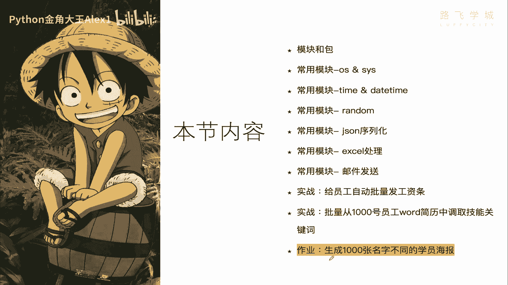
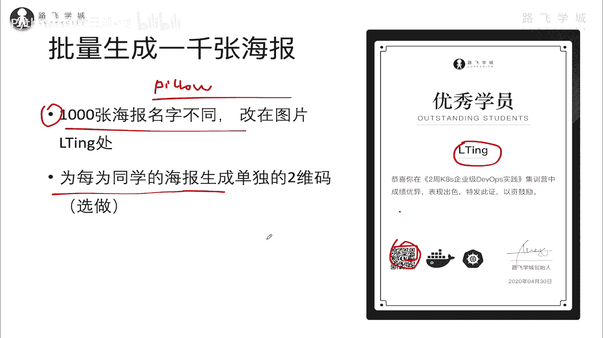

# 【2024年Python】8小时学会Excel数据分析、挖掘、清洗、可视化从入门到项目实战（完整版）学会可做项目 - P82：14 作业需求-生成1000张不同名字的学员海报 - Python金角大王Alex1 - BV1gE421V7HF

OK同学们，接下来到咱们最后的两个实战，一个是批量从原啊word的1000个员工，word简历中调取技能关键词，这个应用场景是什么呢，大家你们公司是不是这个就是入职的时候，都要交一份你的简历。

是不是让这个人事去存档，假如公司大了之后有1000个员工，对不对，那这个人是不进行这个技能，比如说他想建一建一个在线的这个人才数据库，就直接的把就相当于把你每个员工打上标签，说这个员工会这个技能站。

那个员工会那个技能战对吧，这样的话他以后想比如说做什么新项目，就很容易从内部去调配一些资源嘛，那你总不能让人家每个简历打开去看，去去去什么，这个就很费劲，所以你就可以通过写一个脚本啊。

自动的把这个呃就是word文档里的，就是你你可以去根据关键词去搜索，比如说你搜一个大家都会会Python的员工夸，他，就把这1000个简历里，所有会Python带Python关键词的都给你啊。

筛出来的那些简历，所以其实就是从啊1000个文档里就筛选一些，筛选一些特殊关键词啊，那word呢它是一个微软的一个东西，它它不是一个普通的文本文档，就跟excel一样。

所以你需要专门的一个模块去使用它啊，是去操作word啊，那这个呢我们就不给大家去实战讲了，因为它的技术难度跟咱们上面这个操作excel，发工资条其实是一样的，只不过模块不一样，你可以自己去研究。

那我觉得大家还是要有自己学习的这个能力，自己探索的这个能力对吧，自己可以去研究啊，难度不大，然后咱们你直播课的时候啊，如果有时间我给大家讲一讲，如果你有兴趣的话啊，在这个在这个直播课的时候，咱提出来。

咱给大家讲一讲，这个我都写完了好吗，好，接下来呢就是生成1000张不同名字的啊。

这个学员海报诶，大家看这张图，这是路飞的一个啊，做了一个海报，我需要大家看到这个地方就是写名字的，我需要大家呢根据这张图，用这张图啊对这张图片进行一个处理，然后先有一个1000个员这个学员的一个名单。

自己生成一个随机，然后就把这个名单给他扔在这，就每个每一个学员生成一张图片，每个学员生成一张图片啊，这是第一个基本需求，这个需求我告诉你，你自己研究一下就能做出来。

用Python的一个叫pillow模块啊，Pillow，就枕头的意思是，pillow模块就可以简单实现这个功能好吧，然后另外一点呢就是第二个可能会有点难度啊，就是说什么呢。

还要为每个学员生成一个单独的二维码啊，就像这种二维码一样，你可以把它贴到这个地方，你就覆盖在这里也行啊，生成一个二维码，给每张海报生一个二，生成一个二维码，然后呢允许这个别人扫对吧啊，扫到哪都无所谓了。

反正就是二维码要不一样啊，不一样，然后相当于呃二维码我就这么讲，他自己是一张我，我给大家讲一下这个逻辑吧，二维码，其实这里相当于是一张图片，这海报又是上一时间，又是一张图片，相当于把两张图片拼起来啊。

就这样做，这个的话可能有点难度，总之你自己去研究啊，把它做出来，交作业交作业，那我们当然直播课的时候，会给大家讲这个实现的方式，但是呢你自己先探索探索，看看能不能搞定，你能搞定，我觉得你这个集训营了。

争取就没有白学好吧，那咱们第六天的内容就到此为止了，这个今天学的东西还都挺有用的，是不是记得给我点赞哟，爱你哟。

么么哒，拜拜。