# 【2024年Python】8小时学会Excel数据分析、挖掘、清洗、可视化从入门到项目实战（完整版）学会可做项目 - P83：01 Web开发涉及的技术介绍 - Python金角大王Alex1 - BV1gE421V7HF

OK同学们，恭喜你进入咱们第七天的内容，那今天我们要学的叫web开发初探，为什么要在这个时候学web开发，才刚第七天，那我要告诉你，真正我你要系统性的报我们的班去学习。

那这个web开发应该先学两个月Python，再学这个，但是为什么这里就要学呢，因为咱们八天高强度的这个集训营在最后一天，第八天，也就是明天你要学爬虫，爬虫就是什么爬网站上的这些数据是吧。

这个网站你要爬网站数据，你要理解了解人家这个网站的结构，技术的一些里边用到的一些技术是吧，要不然你怎么去爬数据，你怎么能把数据拉下来，对不对，所以这就是为什么要放在这里的那个位置好吧。

那今天的这个内容呢涉及到这些个这些个啊，就是web开发到底是个什么东西哈，HTML是啥对吧，HTML里面这TMHTML，就是做网站开发常用的一些啊技术，然后网页怎么去布局，CSS的样式是干嘛的。

然后我们最后学一个注册啊，开发一个网站注册页面啊，所以今天学完之后，你就可以自己写一些简单的网页了啊，其实网站开发呀基础的虽然它东西很多，但基础的并不难啊，没有什么太多逻辑性可言。

你就是不断的照着操作写代码就行了啊，写代码就行，比较简单，OK但是挺有意思的，那咱们废话不多说，先进入第一小节。

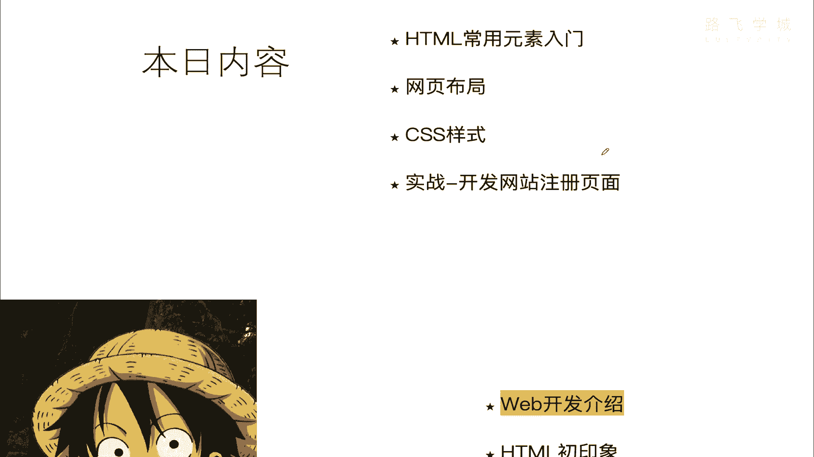

OK先要了解一下什么是web开发。

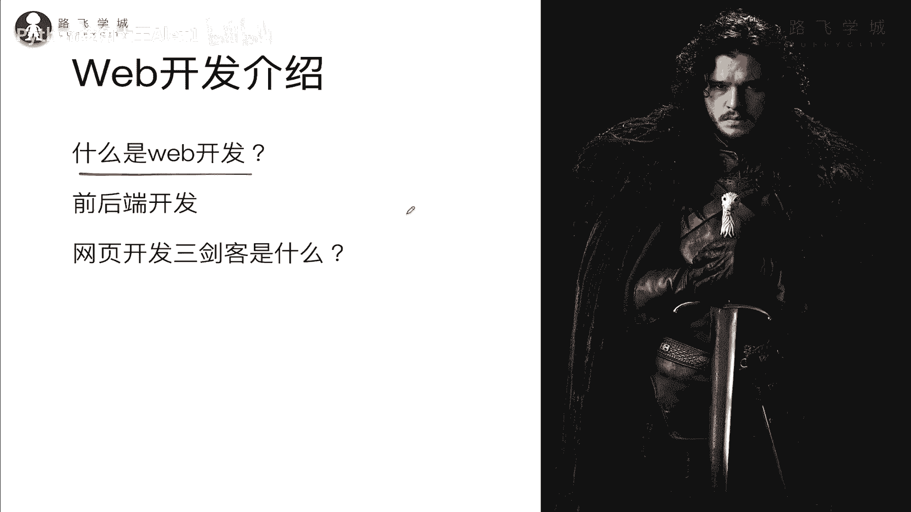

呃，这个就来看这个东西，大家看这个网站，首先首先说web开发，其实说白了就是在写做网站开发，就叫网站开发，然后呢就是写网页，明白吧，就是写这网页，你看你这里面的这些网页啊。

看到这些东西其实背后都是由这个什么呀，都是由代码来实现的，大家看对不对啊，一堆东西我靠你看你感觉看着好复杂啊，实际上好丑对不对，没有结构可言，其实是有的，只不过呢它为了提高这个啊传输速度。

它进把这个文件进行了压缩，所以呢把一些什么换行啊，什么都给你去掉了，但实际它是有有规律可言的啊，我们后面会讲，那也就是说你看到的这些东西，其实就是由代码来实现的，对不对，就是由代码来实现的。

那我们要学的就是这些代码是怎么写的，明白吗，那好现在再来说了，看一下这些代码，是想一下这些代码是怎么变成这个，好看的页面的，是怎么变成好看的页面的，同志们，就是因为有浏览器告诉你。

是因为浏览器把你帮你把这些源代码给你去，解释成了这个东西，明白吧，解释成这个好看的页面，所以这个浏览器其实他的角色，就跟我们的Python的解释器是一样的。

Python解释器把咱写的Python代码干嘛解释并执行，是不是啊，那这个浏览器把写的这个流，这个这个前端就是网网页开发的代码，干嘛给他解释，并且叫渲染，渲染就是对吧，这也是解释的意思。

然后渲染执行最后变成了一个这样的啊，这些代码，所以你可以大概的理解为，浏览器就等于Python的解释器，他俩的角色是一样的好吗，OK知道这个之后我们要了解的。

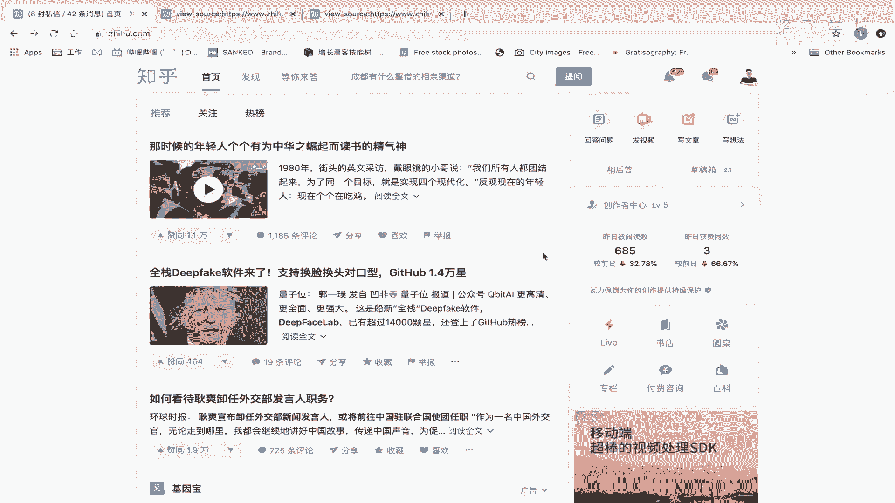

要要了解一个事是什么呢，啊这个网页开发啊。

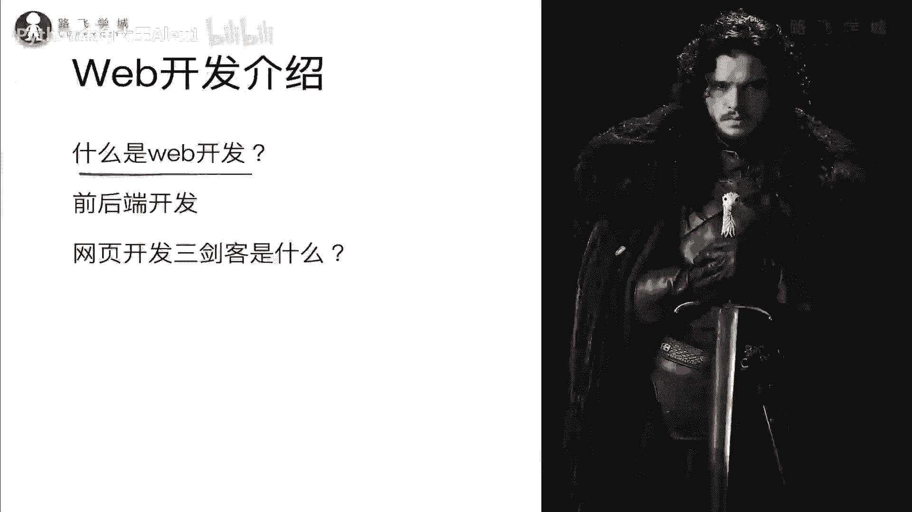

它是有专门的语言的，也就是说你看他写的这个东西，肯定跟我们Python是不一样的，哎那这些专门的语言它分为三个组件叫什么呢。

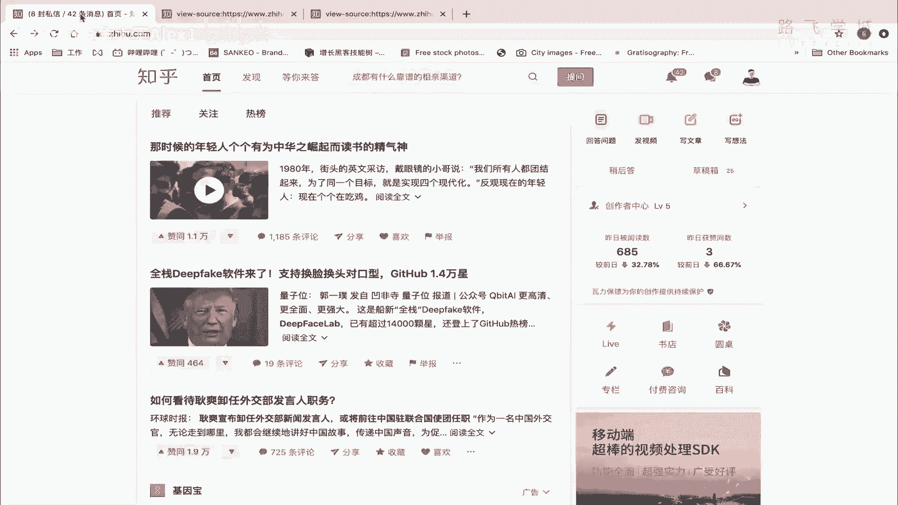

就叫做网year2开发三剑客啊，网页开发三剑客，那同学们说哎是不是这个剑客啊对吧，这个人大家知道吗，如果看过权力的游戏都知道啊，这个就是the the the king of the north。

是不是啊啊北境之王老牛逼了，大家有空一定要看这个冰与火之歌啊，如果没看过冰与火之歌的人，不配称我的学生，哈哈哈对吧，特别牛逼，Anyway，那网页开发三剑客是什么东西呢，如果你对技术稍微有所了解的话。

你就应该知道是HTML，CSS和JAVASCRIPT，Javascript，我们分别来介绍一下这是什么东西啊。

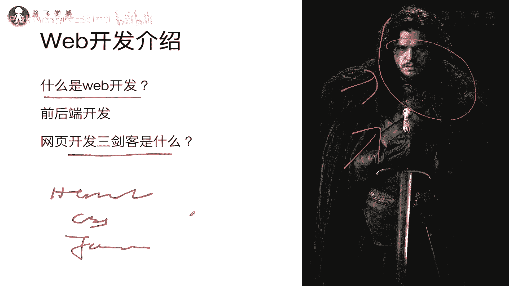

这难道说这是三门语言吗，NO不是啊。

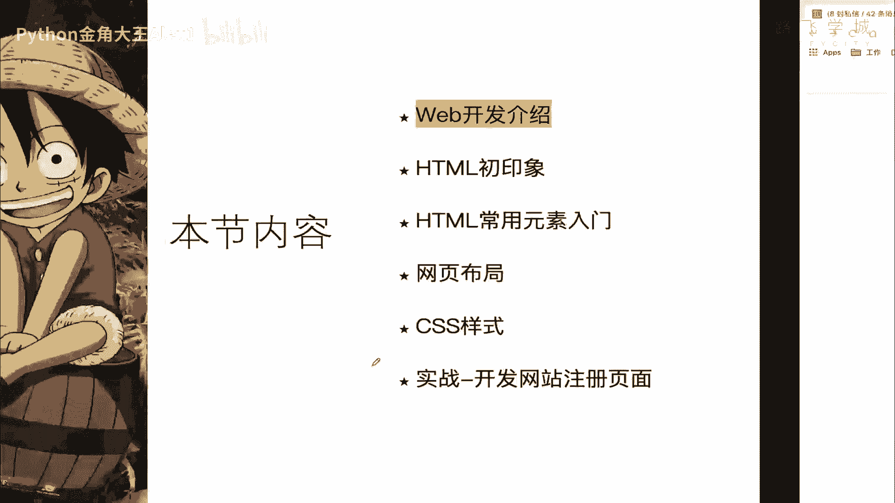

不是三门语言，我们来看一下啊，他们三个组合起来统称为网页开发的，就你可以理解为三个三个组件吧，三个组件，那首先先知道HTML是什么HTML呢，它叫什么超文本编辑语言，超文本编辑语言啊。

你不你其实你你不需要记这些概念，你知道它是干嘛的就行对吧，知道它是干嘛，是最重要的，它是用于创建网页的标准标记言，你看这个也不理解啊，所以呢那还是看白话吧，白话就是他主要负责什么呀。

编写页面架构有点像什么呢，大家建房子的时候，你是不是要把那个那个什么承重墙啊，乱七八糟都建好对吧，哪里放窗户，哪里放门，也就是说你就这么讲，你这个房子的整个的架构建造完了之后，没装修之前。

那个是不是就是毛坯房，对不对，那个毛坯房你可以理解为，就是也就是说就是在这个网站网页开发里面啊，就是这个HTML做的事情，就是把你这个网页的架子给你搭起来，明白意思吗，把你网页的这个架子搭起来，为什么。

因为你因为是这样，同志们，你这个网页你看这个网页它是有结构的，它有什么结构啊，你看它是不是首先它有标，它有上面这个菜单，菜单栏，它有这边的内容栏，它有这个侧边栏，侧边栏还分了好几块，是不是啊，明白吗。

那它是有结构的，那这种结构就是用咱们的HTML这门啊，这个这个组件来给它实现的，明白吗，哎你所以你要学会HTML的这个组件的这些啊，怎么用这个组件对吧，来去搭出来这样一个结构，你要学那个东西之后。

你就可以也做出来这样一个架构的一个网页，明白这意思吧，这是HTML干的事情，就是相当于你理解为就是毛坯房，他就负责造毛坯房的好吗啊，然后呢CSS是什么啊，叫什么kiss cdding。

Kiss kadding，然后style sheet这个不管它是干嘛的，它是用于渲染HTML元素标签的样式，你不理解，因为你也不知道HTML是干嘛的，那你就可以这么理解啊。

它相当于就是给你的毛坯房做装修，就是你的房子装修完是什么样子的，这个装修你你要选沙发，你要什么白色的墙，什么厕所，什么地板砖，类似这种东西是吧，哎都是属于光装修的过程，那在网页开发里面是干嘛的。

告诉你你的文字，你看这是不是蓝色的，哎这个是不是有这个有红色的对吧，这是不是有图片，这里是不是有这样的排列对吧啊，这就包括这种小logo，这些东西都是通过CSS来实现的，明白意思吧。

也就是它让你的网页变好看，你如果不用CSS，那它就是一个毛坯房，就特别特别特别特别简陋，特别特别简陋，明白意思吧，你有了这个之后，哎你的网页就可以变好看好，所以它更多是一个装饰性的，那么一个东西明白吗。

装饰性的，所以我们要学CSS怎么去怎么去啊，用CSS把你的网页变得好看，比如说改变颜色，改变字体，改变背景，加上图片，类似这种东西都是CSS做的事，好吗好。

那接下来三剑客里的最后一个剑客叫JAVASCRIPT，哎JAVASCRIPT是什么啊，是不是，你看这是两个组成的，一个是script，是脚本的意思，java就是一个编程语言，对不对。

那好同志们说这个是不是老老师，同学们说唉老师这个是不是就是呃叫什么呀，java的一个简单版本，这不是java脚本嘛，是不我就要跟java就是java编程一样是吧，同学说老师我这个Python没学明白呢。

你让我学java，我靠我就懵逼了，那现在我告诉你啊，同志们，这个JAVASCRIPT跟java一点关系都没有，它跟java的关系，举个例子，就像周杰伦根周杰这两个人的关系，明白吗，哎你不要看到周杰伦啊。

跟以为他跟周杰有什么关系，这他妈两个人完全没关系，只是起的名字差不多而已，明白吗，所以没有任何的关系，互相一点关系都没有好吧，那JAVASCRIPT就是咱们网页开发里面的啊，一个脚本语言对吧。

单单独的单纯的以单独的一个脚本语言好吧，那他在做的事情是什么，可以让你的网页动起来，让你的网页动起来，比如说你一张图片啊，你这个啊鼠标放上去自动放大，大家看那个电商是不是有那种放大镜啊对吧。

你把图片放上去，哎它就给你自动放大了那个图片啊，让你看的更清楚，你的按钮，比如说一个按钮自动变色，你的鼠标放上去啊，这个颜色按钮就变了，提交表单，比如说你提交表单的时候，这个这个用户注册啊，认注册。

然后你输的用户名密码不对，哎他会给你提示报错啊，类似这种东西，包括他的你输的邮箱格式不对，手机格式不对，他都给你报错，这些东西都是通过JAVASCRIPT来实现的，明白吧。

所以他干的事情就是让你的网页能动起来啊，网页能动起来，那你比如说同志们，大家看啊，我在这一点看着啊，看到没有看到切换了吗，哎我这一点这个切换就是这个行为。

这个切换的这个动作就是由JAVASCRIPT来实现的，明白吗，那我在这一点你看往下拉也是明白吧，他也是啊，看看我这个经历啊啊啊对吧呵，这个去哪个公司哪个倒倒闭，诺基亚飞信是吧，都被我干倒闭了。

总之收起来他也是什么呀，这个这个这个JS实现的，然后呢，你在这里一点看到没有，哎出现这个东西，它也是JSJAVASCRIPT来实现的，那所以JAVASCRIPTJAVASCRIPT干的事情。

就是让你的网页能够动起来，明白这意思吧，让你的网页能动起来，所以这三节课你明白大概明白什么意思了吗，这个是造毛坯房，这个是给房子装修，这个是说什么呀，让你的网页能动起来，那有的人还把这个呃什么呀。

网页这三节课比作为什么呢，这个HTMLHTML就是什么呀，人的人的这个骨架，也就是说骷髅对吧，就是就是就这个只有一个骨架，明白吗啊人的骨架，然后呢这个CSS就比喻是成什么呢，把人穿给人穿上衣服啊。

你这个骨架穿上衣服之后啊，你就变成了一个骷髅人，那不是就变成了一个正常的人，然后JAVASCRIPT就是说哎你这个人能吃饭，能走路，能说话哎，怎么实现呢，就是通过JAVASCRIPT好吗。

就是反正另外一种举例吧都行，只要你能理解就可以了，那同志们啊，大家来看这个是啊。

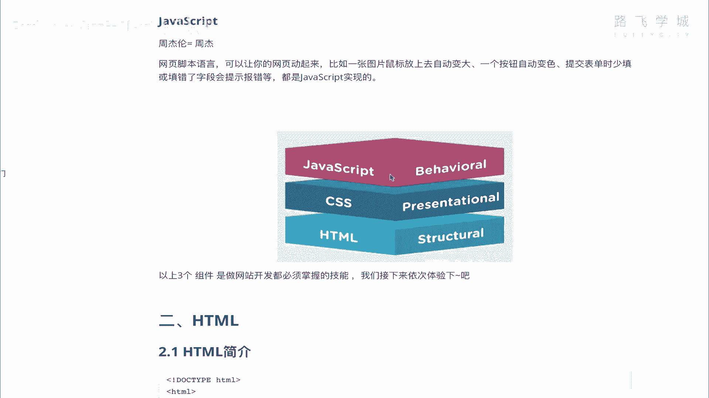

网站一其他网站一个图，我觉得也可以理解，就是说看到没，HTML这个叫structure structure，其实就是一个架构的意思对吧，就是说白了你造房子，把那个基本的啊基本的承重墙什么都给你建好。

OK然后CSS represent叫PRESENTATIONAL，就是说什么表现什么意思啊，就是让你把你房子装修好，behavior是行动动作的意思，让你啊他没办法让房子动起来啊。

但是只是比如说让我们的这个啊，让我们的人动起来啊，这个就是JAVASCRIPT做的事情，好，那这三个东西大家大概有一个了解了。

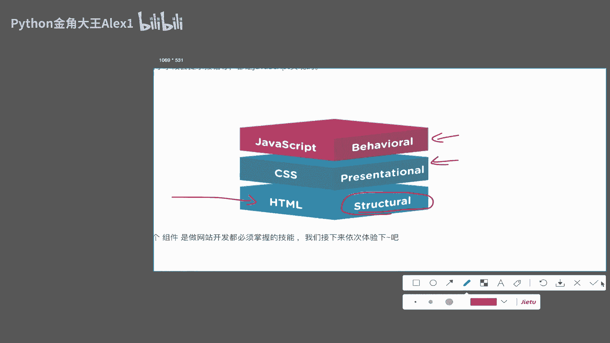

是不是啊，哎这三个东西的配合就可以做出来，这种丰富的网站。

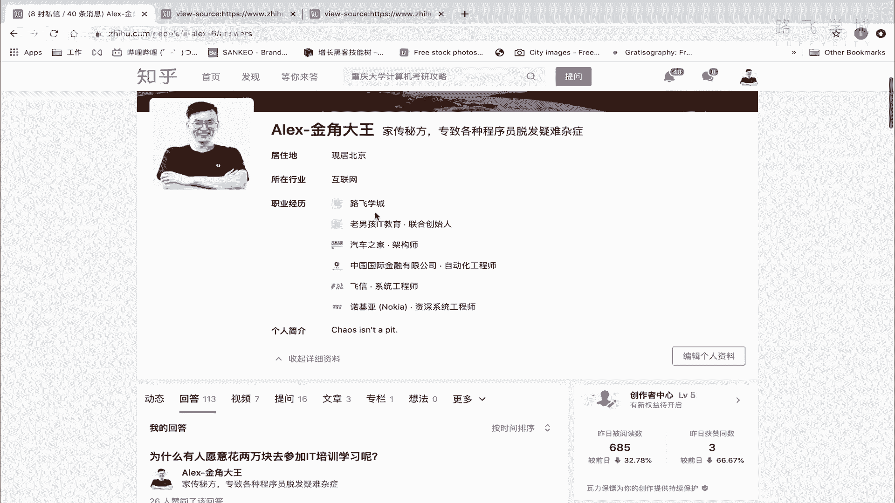

明白这意思吗，好那理解了这个之后，最后再讲一个东西叫做前后端开发好吧。

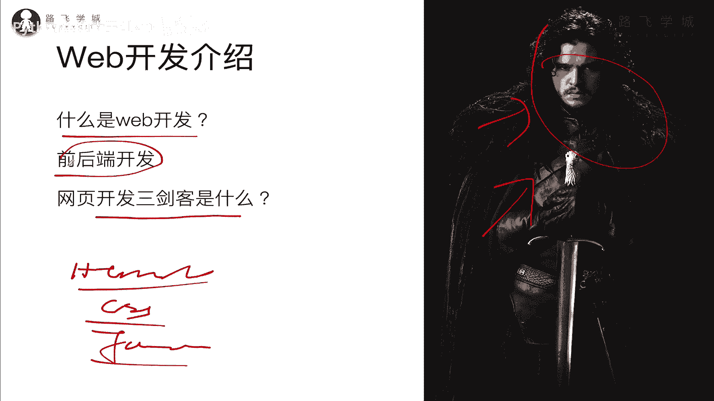

前后端开发，那喝口水啊。

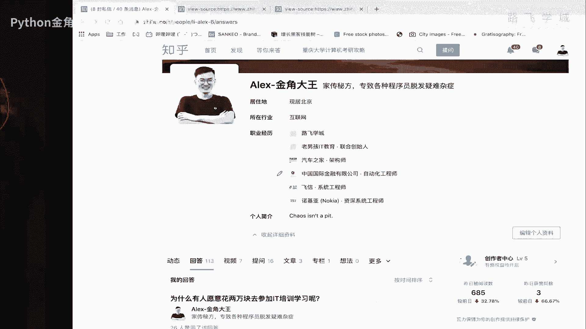

喝口水说话有点快，同志们，我在这里你看看到的这些所有的数据哎。

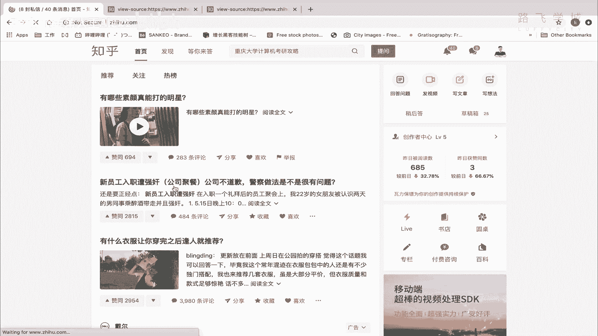

素颜能打的命令，啧啧长得还行诶，同同学们，大家来看。

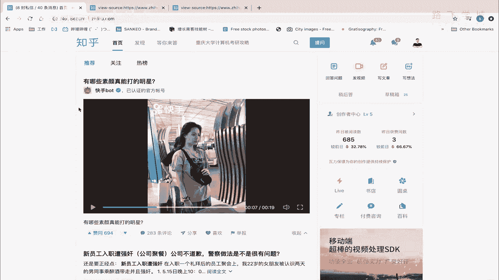

你看我在这里看的视频也好，包括这些啊，文字也好，这些文字它不是在浏览器上的，它是浏览器，只是负责渲染这些页面渲染，你这个把你这个代码渲染成这样对吧，但是这里代码里面的这些数据看到没有。

这些数据它不是什么呀，他不是在我本地的，它是从后后端服务器，也就知乎这个网站的服务器上给我抓下来的，明白意思吧，从知乎的服务器上给我抓下来，也就是说那相当于我在浏览器看到的这些东西。

都是已经从知乎网站上啊，从知乎的服务器上给它给它给它下载下来的。

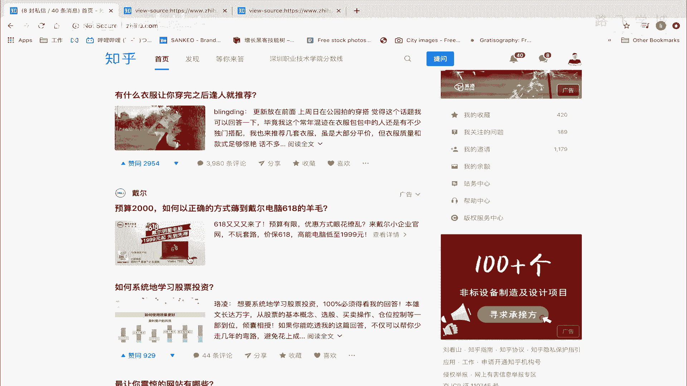

你可以理解为是下载下来的一个文件，明白吗，从知乎的服务器上下载一个文件，只不过在我本地的浏览器上打开啊，打开，然后渲染成这样的一个效果而已，明白吗，所以呢这里面就涉及到一个东西。

就是说哎这是知乎的服务器端，这个是我的客户端，明白吗，那我呢现在打开，现在我要去访问这个知乎，我在这输入域名，对不对，输入域名之后呢，相当于发了一个请求，发完请求之后。

拿服知乎服务器说哎这个客户端想要这个网页，我就给他返回，返回什么呢，就给给给这个客户端返回这些数据，然后所以他把这个什么呢，也就是说知乎首页的内容，返回到我本机浏览器了，也就是说这个时候同志们。

我知乎哦，我这个当前这个电脑拿到的是知乎，知乎给我返回的，相当于我从知乎上下载的一份数据，明白吗，下载下来的一份数据，注意了，那我就在这个本地去解析，用通过这个浏览器解析，然后去哎最后看出来这个效果了。

但那中间一定要强调大家理解啊，我现在从注意了，去知乎上拿这个数据，然后下载回来了之后，假下载回来之后，假设我不刷新这个网页，我这个网页一直放在这，放一天，放一天之后，人家知乎这里的那个页面的内容。

人家知乎服务器数据可能已经变了，明白意思吧，已经变了之后，但是如果我不再主动去拿，我不再刷新这个页面，因为我一刷新页，这个页面它就会再去服务器端再去拿一次，明白吧，如果我不刷新。

那本机的这个东西就会一直是这样，它不会再变了，它是因为你已经相当于下载下一个文件来了，明白吗，那知乎服务器上的在变的这些东西，他不会主动推给你，明白吗，他这个服务器永远都是被动响应。

什么被动响应就是你去请求我，你的客户端去请求我，我就给你返回，我就给你响应，如果你不许不去请求我，我不会去主动来找你说，哎对吧，这个这个这个这个我我主动给你推消息，不会的，明白吗，就像百度对吧。

你访问他他才给你，你搜索他才给你出内容，你不搜索他直接对吧，跑到你手机上跟你说来买不买，附这个莆田医院的药，他不会这么说的，对不对啊，所以大家要了解这个东西啊，那在公司里啊。

同志们在你们这个以后到企业里啊，这个做技术这个开发是分前后端开发的，前后端开发是什么，注意了，你现在背后你现在这些所有的这些啊，比如说这些数据对吧，包括这里有广告啊，这些都是知乎接的广告。

那这些东西就是啊怎么讲，这些数据都是存在这个后台的服务器里的，存在后台的，这个算是存在后台的这个数据库里的啊，就是你你你这个知乎服务器上啊，有有一数据库要存这种数据。

那也就是说决定着这个网站页面上显示什么，比如说你是显示呃，呃这个这这条消息还是显示这条消息，这是个广告对吧，还是显示别的，这个是后端的这个业务逻辑，就是后端有专门负责写业务逻辑的代码的人，干嘛呢。

把这个业务逻辑写好，也就是说你只要调，你只要这个什么请求我这个URL请求我这个网址，我就后端给你返回这些已经设计好了的数据，前端只是负责展示给他，展示的好看而已，所以在公司里它分为一个叫前端开发。

一个叫后端开发，明白吧，那前端开发干的事是负责把是负责什么呢，去后台请求数据，然后呢把这个数据进行一个好看的渲染，就就把它变得好看，比如说这个网页的架构怎么设计的，怎怎么怎么排，比。

比如说这边放侧边栏对吧，这边放广告啊，那这里显示内容，这是前端工程，就是负责前端开发的人，也就是网页端开发的人干的事情，但是真正还就是说这些数据啊从哪里来数据，这些是由后端的开发人员来提供的。

所以现在都讲的是说前后端分离，前后端分离就是后端开发，后端的前端开发前端的，他俩通过这种什么呀接口来互相的交互，也就是说前端需要请求个数据，你就去后端找一个接口去拿啊，然后后端就给他返回，是这样的。

然后可用户呢在这用户你请求的啊，怎么讲，你打开的这个网页，然后呢他先到这个前端，然后前端再去请求后端，后端再给你返回，再这样明白这意思吧，这个就叫前后端分离啊，你大概了解一下就行，先大概知道啊。

也就是你知道公司有负责前端开发的人，有负责后端开发的人，负责前端开发的人，一般是女生，后端开发一般是男生，他俩老死不相往来，谁都找不着对象啊。

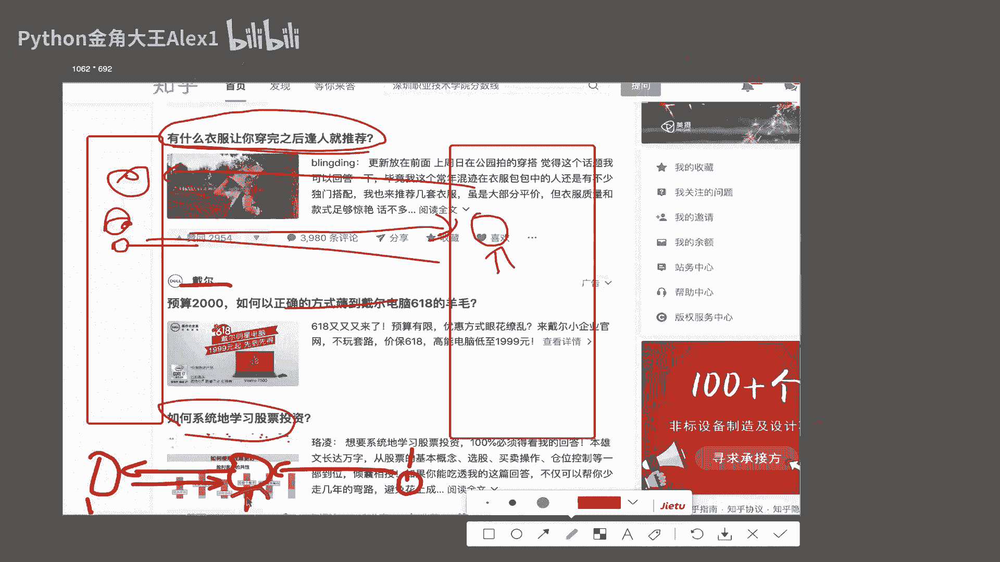

这就是这么个情况好吗，OK我们公司之前那个前端长得还挺好看。

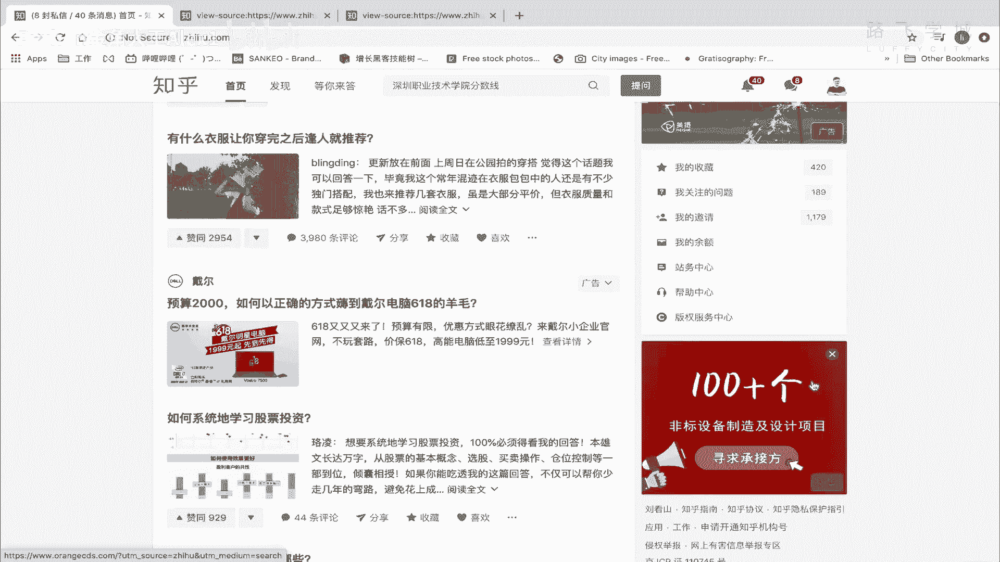

OK大概知道了这些之后，我们就把web开发的基础的一个啊，介绍的一个逻辑给大家讲了好吗，接下来我们就讲嗯这个分开来讲。

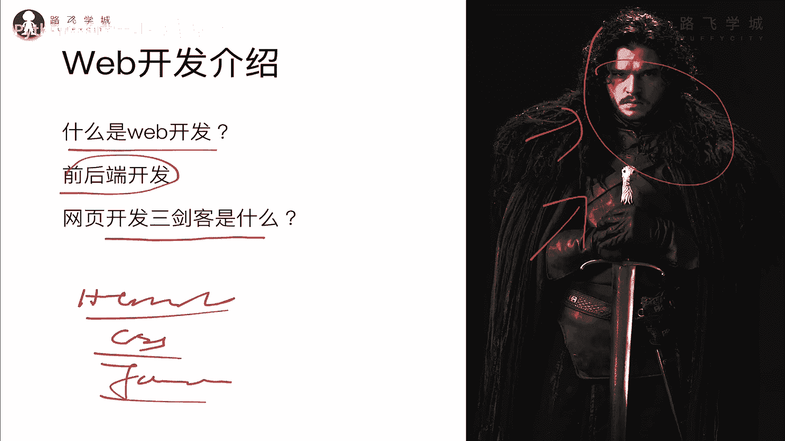