# 【2024年Python】8小时学会Excel数据分析、挖掘、清洗、可视化从入门到项目实战（完整版）学会可做项目 - P86：04 div 区块元素 - Python金角大王Alex1 - BV1gE421V7HF

OK同学们，这一小节啊，我们专门来讲一下div的区块元素啊，因为它比前面这个要稍微复杂一点，DIV区块元素到底是个什么东西，我们讲DIV之前它也是一个元素啊，为什么要加上区块元素。

那咱们在讲div之前先理解一下啊，什么叫区块元素啊，那区块元素呢，其实就是首先HTML我们前面讲的那几个那几个都，每一个都是一个元素，那几种元素或者是或者叫标签啊，每一种标签。

那美就是大多数的HTML的这种标签，被定义为块级标签或者是内联标签啊，元素啊，叫元素要不说都行啊，会计标签或内联标签，什么叫会计标签呢，会计标签就是说只要啊以新航来开始和结束，比如说我写一个H1。

它就是一单独一行，你再写另外一个H1，他就换了一行，这就叫会计标签，就是说白了只要以新航结束和开始，那就是一个会计标签，那内联标签是什么呢，咱们再讲啊，超链接和图片的时候，发现它不会换行是吧。

那就是因为它不会以新行开始，他就是直接，你比如说你你你你比如说你放五张照片，五张照片他就并排的排那个排那么一排行，排那么一行，直到那个屏幕被占满，它才会这一行被占满，它才会往下一行去挤下去，明白意思吗。

他就没有换行这个这个自动换行这个概念在那，然后TD就比如说列表里的这种列A标签啊，还有这个BB就是干嘛的加粗啊，B还没有讲过是吧啊，就顺便就很简单，你比如说你想给一个给，那么这里面的这一个值给它加粗。

怎么怎么加粗呢，就直接是嗯，直接是在这里，你比如说我给它加速就B就行了，然后斜杠，看到没有，他就会把这一段字给他加粗，大家来看一下，看到没有，cos它就被加速了好吧，它也不会出现换行的这种效果。

OK所以这些不会换行的都管它叫内联标签，可以吗，那知道了这些之后，我们再来看div div呢，它是一个叫会计标签，就区块的一个标签，它是干嘛的，会换行的，另外它会自动的实现一个换行。

那它的作用是干嘛的呢，它的作用是它，首先第一它本身其实没有特别特定的含义，比如说像H1代表是标题，1P是代表端的，它本身没有这种的含义，他做的事情就是说把其他的TML的这种标签，给它组合起来。

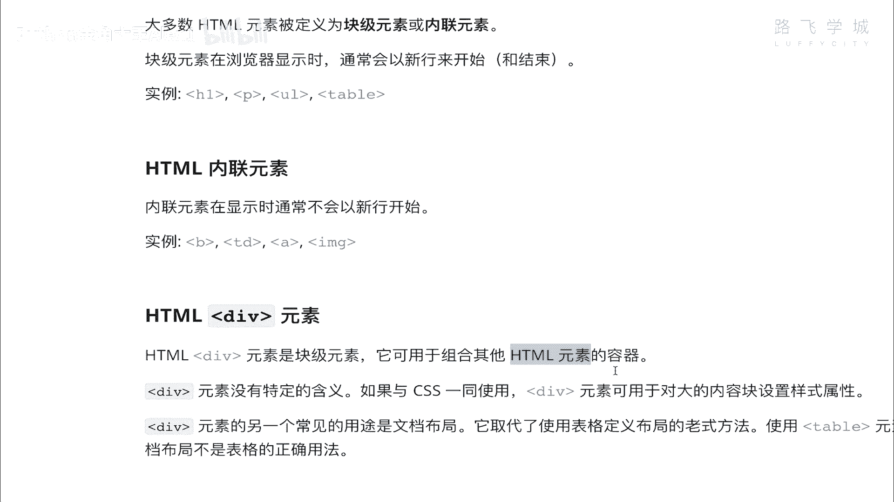

作为一个容器，什么意思呢，也就是说我在这，我在这里相当于是一个大箱子，这里面呢这里装着H1H2段落或者什么的，哎我相当于就只是把这些东西装起来了，哎同学说了，说我装这些东西有什么用啊，有什么用对吧。

我为什么要装起来，其实告诉你装起来是为了进行网页布局，注意了，网页布局其实就是用div，那为什么要装起来，用网进行网页布局呢，是因为你看咱们像一开场给你们演示的。

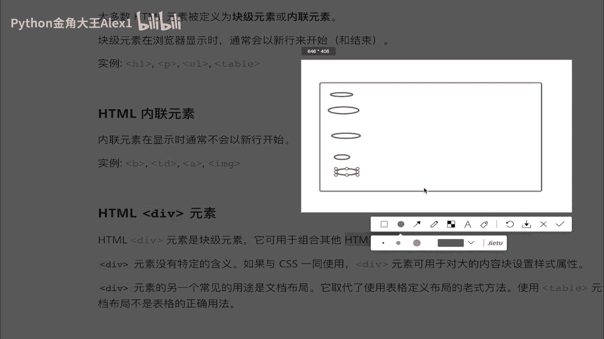

像这种哔哩哔哩啊的这样。

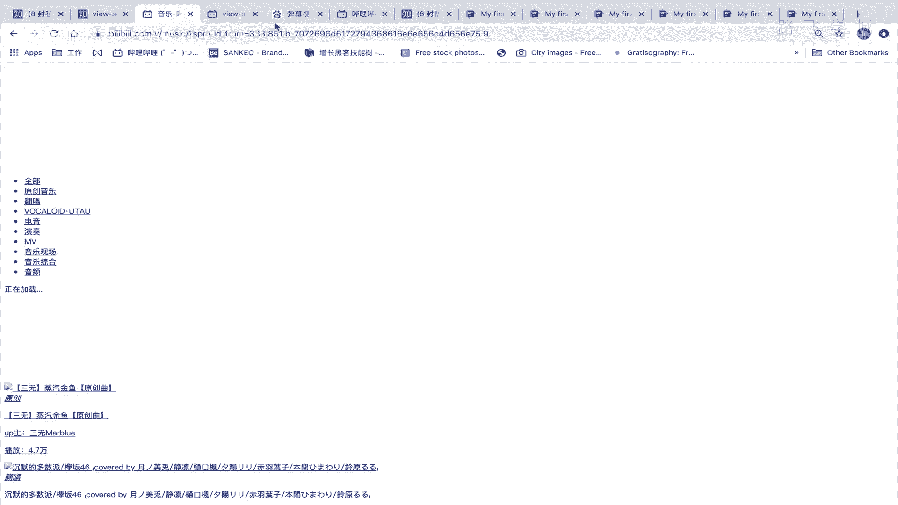

像这像知乎这样的网站，它是分很多块的，对不对，它分像在这里，你看像这种内容块，像这种标题是吧，像这这一小块这一小块它怎么去分出来这些块，明白吗，那你说我这一个，我我正常的话都是从上往下排的。

但是我现在出现了左右类似这种，对不对，那这种这个相当于一块，就比如说所有在这一块的，你看所以在这一块的文字，我可以让它字体统一的大小是什么样子的对吧，它的颜色是什么样子，在这里的对吧。

我可以统一让他的这个样格式是什么样子的，对不对，或者在这里统一是表现一个什么样的形式，就是把把把这里面的一些一堆的HTML的标签给它，分门别类的，按照这种布局给它分开啊，这个怎么分开呢。

就是通过div这个容器啊，通过div这样，这样的话你就可以对这一，这比如说你在这一个容，在这个容器里的这四，这这这所有的元素给它统一的都往右排，明白吗，那你把这个div往右排了，他就跟着。

因为这几个装在div里面，他就跟着一块往右走，明白吗，包括这里面呢，你让他所有的样式都都这个都都这个颜，比如说文字的颜色都是什么样的，你就可以通过这个容器，也就是说在这个容器里的。

所有的这个文字都按什么样式都是可以操作的。

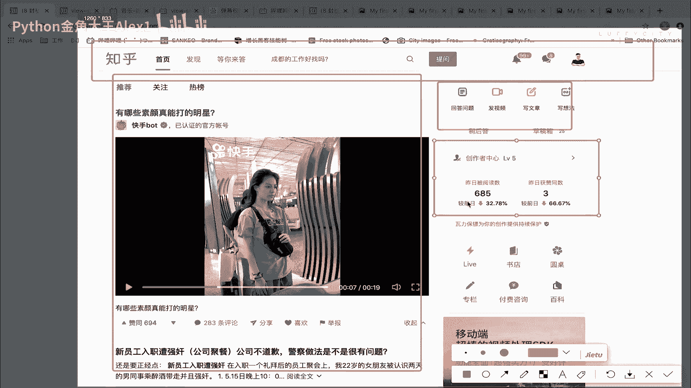

所以div它的作用就是干嘛呀啊，可以将你的页面啊这个去按去去进行布局啊。

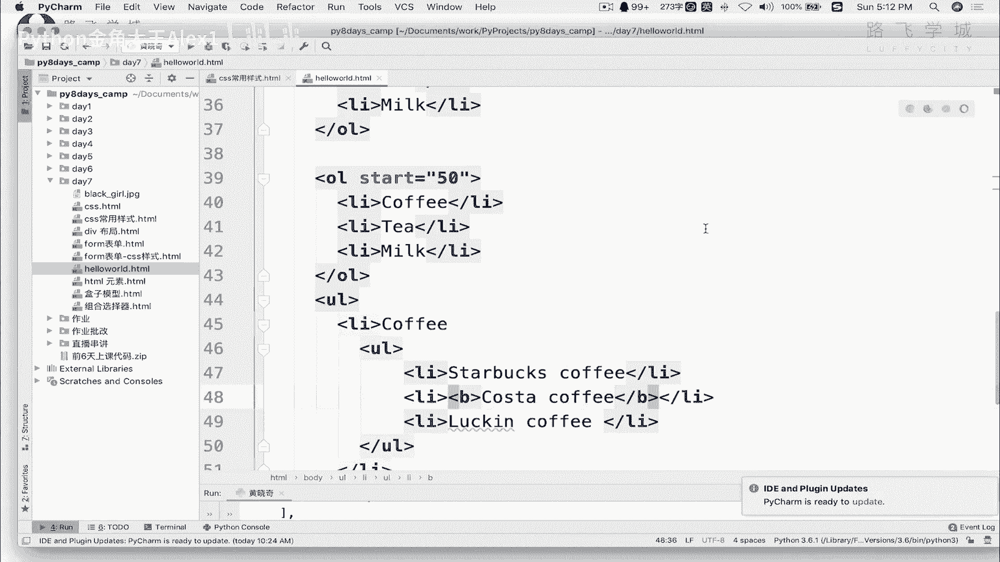

进行布局。

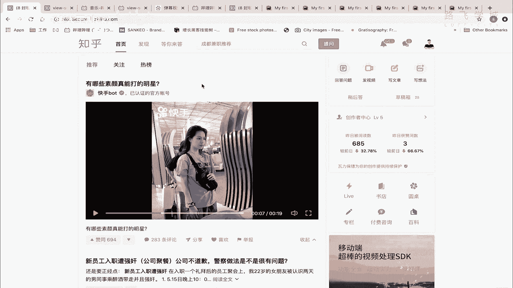

OK好，他就是个容器啊，它就是个容器，接下来继续看好，我们知道了这个之后，咱们一会儿来看一下到底怎么去布局好吗，还有一个叫sp span呢，它是一个叫什么呀，叫内联标签，内联标签它是干嘛的呢。

它是一般就就是在用CSS，也就是装样式的时候才会用到这个，那怎么会用呢，就是说比如说我这那么一段文字对吧，我想把这四个字给它变成红色，变成红色的话怎么办呢，你就可以。

因为你你不想你不能在这里写一个新的P，一写的新的P它就会换行，对不对，你写一个B是可以的，写个B它会加粗，但它只是加粗，它不会换行，但它只是加粗，你想让它变颜色怎么办，你可以在这里加一个span标签。

给这个span进行一个加颜色，也就是span包裹起来的，这几个字就会自动跟着变颜色，明白意思吗，所以它一般是操作文字的，然后div是进行容器的，那我们虽然没有学cs，就是那个样子。

但是我们啊这个来看一下div的这个效果啊，div效果啊，你就知道它是做什么用的了，我在这里写一个div吧，好吧嗯，大家啊，这样你看我在这里，其实咱们之前写的这个东西，已经是有很多东西了。

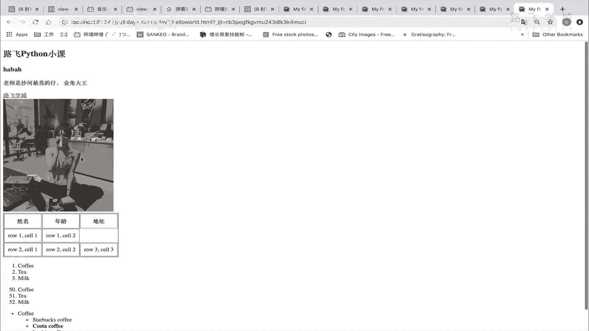

我就在这里可以通过不同的div给它分开，看到没有，我比如说我的这个表格全都在这儿，对吧啊，就就是这个叫什么呀，表格是分在一块，然后上面这几张图片再再一个再一个叫呃。

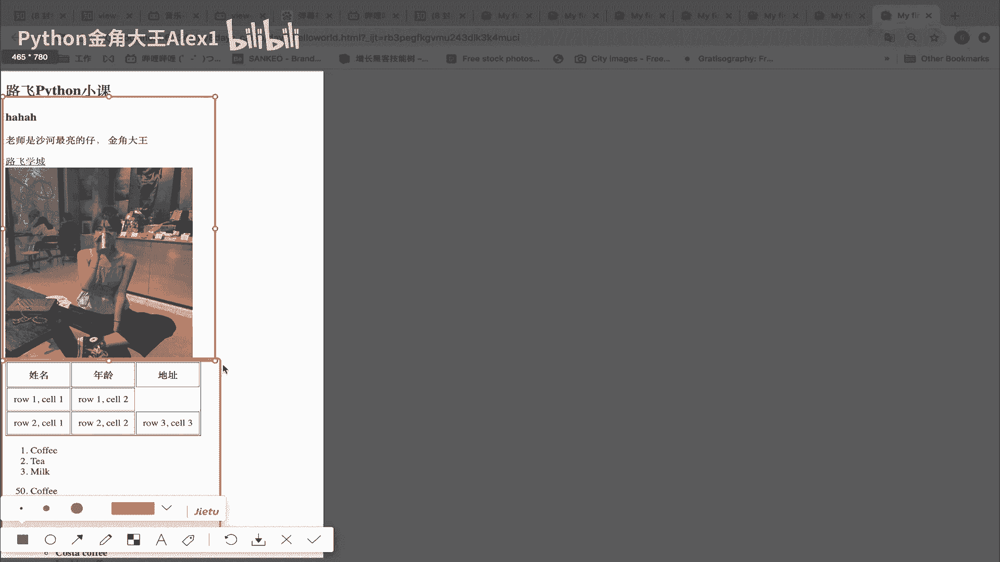

盒子里就容器里好吧，分成两个容器，咱们来看先分一个吧，先先先先把上面那个拿出来啊，在哪呢，Body image，看到没有，这几个，我在这里呢就可以写一个div，div然后你呢反正copy过来。

啊注意了你的标签啊，一定都是说啊开有开，有始有终，你不能光写一个div，后面没有结尾，这整个页面结构就会乱了啊，好多新手就会犯这样的毛病，所以呢一开始你写这个代码，写这个TML就要用这种编辑器。

你用什么这个这个这个叫什么记事本写，我靠那你就这个标签的对吧，肯定你就很容易乱了，你想用拍照嘛，就很容易这样看到没有好，那我现在div了之后只是这样写，它没有任何意义，它没有任何，它不会有任何变化对吧。

它它但是你可以对你，你可以干嘛呢，你这个时候你可以给这个整个div的容器，给它加一个颜色啊，这个就涉及到咱们后面后面才要学到的什么呀，CSS样式，不过我们先来学一下，你看效果就可以了。

这个其实就是给这个标签加样式啊，也就是说这么一个容器，我给它涂上色啊，怎么涂上色呢，就是这个background就叫border了啊，先加border，border等一个啊，就是加边框等一个呃。

这个one dx dash这个啊这个yellow吧啊，这个其实就是给我的这个div加了一个标签，咱们来看一下这个效果啊，看一下效果呃，大家来看一下哎，看不太清了，其实已经有了加red，你就看到了啊。

大家来看一下，看到没有，看到没有，这就是我的一个整个的一个div，这块全都是我这个div的，明白这意思吗，当然我是可以给他，你看他现在占满全屏的，我是可以给他，就只到这儿看到没有，我就可以这样写嗯。

写什么呢，对了，这里面其实就有点像咱们Python字典，一个K1个value好吗，这个这个K就是它的属性名，value就是他这个属性给它赋的值，然后我加一个冒号，分开再写下一下一个属性就是叫什么来着。

less啊，给它改成一个啊500PX啊，像素是500PX，这个时候你再来看一下同志们是不是到这了，对不对，到这了之后，注意了，我告诉你，我还可以给它加样式，加什么样式的，就是还什么，我把这个往下挤。

往下挤啊，看着怎么往下挤呢，我就直接写一个啊，写一个新的属性叫margin bottom，margin bottom就是下编剧，按照包装下边去啊，你看着啊，你不用你不用，你不用记住这些东西，明白吧。

这是CSS样式，我们后面会学啊，再过两节课我们就会学，你只需要看它是往下挤的，看到没有就会往下挤下来了，同志们，这样你就是不是就能大概理解div是干嘛的了，我就对一组数据是吧，我比如说我想给他往右摆。

看到没，我想给他往右摆，怎么办呢，没问题啊，我就直接这个啊，直接还得再继续写，叫什么呀啊那就写的比较多了啊，Position，等一个什么什么什么什么什么relative，所以你不需要管啊。

然后呃叫叫叫什么来着，那个600PX，假如说啊你看着我写了一堆，它就会往往往右挤，看到没有明白这意思吗，所以我是不是这一组数据都挤到右边去了对吧，一组数据都挤到右边去了，这样你能理解这个意思吗。

那我是不是再改一改，是不是就能改成来向人家知乎这种对吧，他为什么全都在右边呀，这个为什么在左边呀，都是因为排好了的，你就单击看它的审查元素，他肯定也是这样子的，他这里肯定你看是不是一堆的div啊。

你比如说先看这个它就是一个div对吧，肯定都是一个点，看到没有div嘛，对不对，Div，然后他这个啊这里就是它的样式嘛，一堆样式啊，那肯定我看看啊，嗯啊呵呵啊，反正这个比较复杂嘛，东西也不好解释。

总之通过div来实现的网页布局，能理解意思吗，啊能理解意思吗，OK这个好，这个我们大概明白了之后，接下来哦对再给大家看一下这个什么呀。

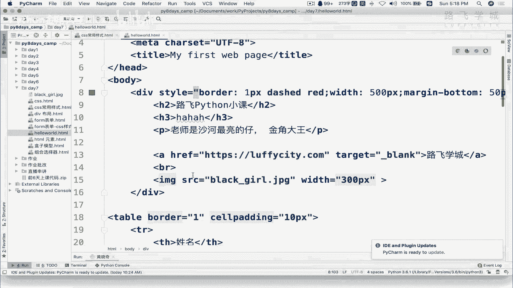

SPA啊，span咱们说span是不是可以给我这个什么呀加样式。

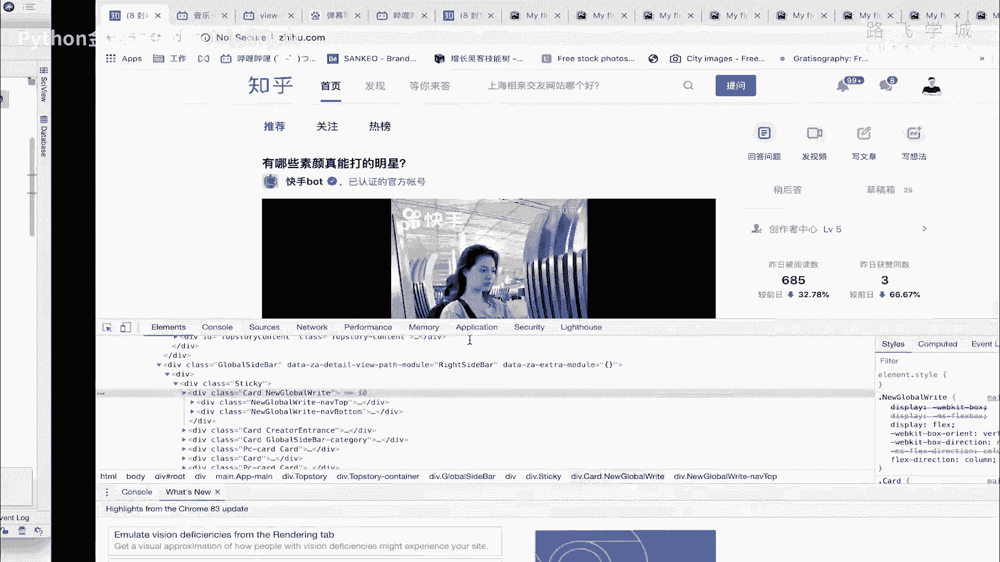

是不是，比如我这个金角大王给他重点的突出，是不是给他变个色，怎么办呢，我就在这里可以加一个示范，看到没有，我把这个金角大王一今年大码给它移进去，看到没有，他在这里写也写一个样式style。

然后color等一个啊，red看到没有啊，然后就可以了，刷新一下，看到没有哎，所以ban是给这种文字进行一个样式描述的，DIA是进行这种啊，把一堆元素给它组合起来好，那同志们。

你们也可以抄一下我这个代码实现一下，把这个啊往后移一下是吧，里边这些这些语言这些样式什么意思呃，这个不好解释，因为现在你还没学，后面我们都会学啊，反正前面就是加边框宽度，后面这个呢就是什么呀。

把它往下挤，把那个表是吧，这边就是往右排，这个可能不太好理解啊，不太好，但总之就是这样好，咱们div的作用。

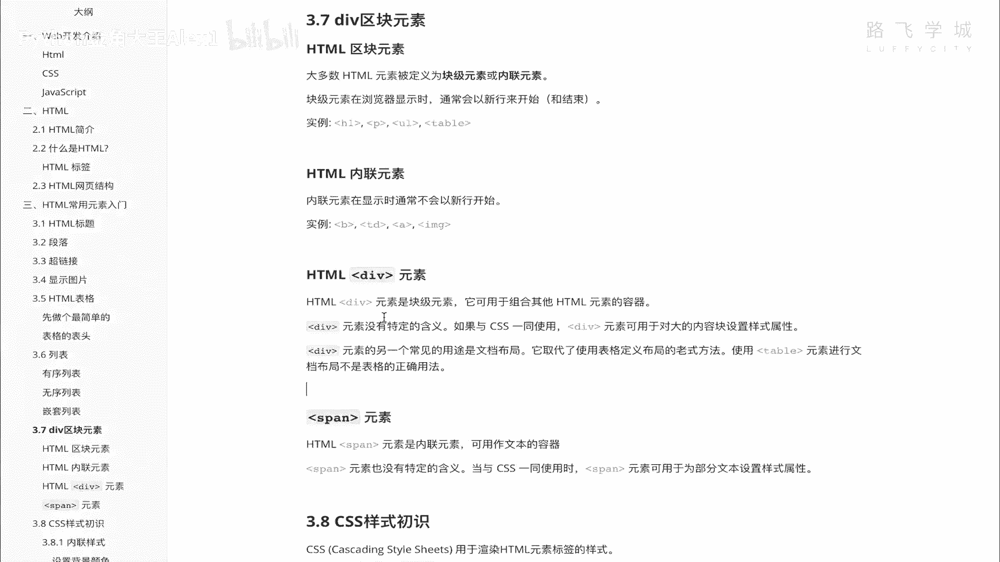