# 【2024年Python】8小时学会Excel数据分析、挖掘、清洗、可视化从入门到项目实战（完整版）学会可做项目 - P89：07 HTML 表单 - Python金角大王Alex1 - BV1gE421V7HF

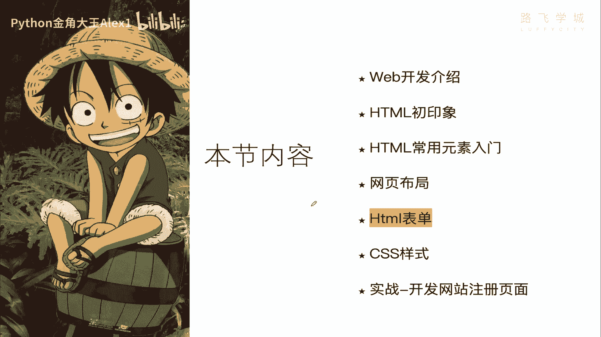

OK同学们，这一小节呢我们来学HTML的表单，这小节有点意思啊，你看像这个网页的表单，看到没有，这些东西都是用ETML表单来实现的，咱们来看一下表单的分类，有文本框，就是这个东西有文本域。

就是这个东西有下拉列表，就是这个有单选复选，看到没，这是复选框，单选框是个圆的圆的，还有按钮看到没，就这个基本上就是这么几类喽，写出来就很简单了，这就是一个form表单表单，然后一点提交。

夸他就把这些数据提交到后台的服务器啊，你比如说注册呀或者什么的就就OK了，那咱们就来自己实现一下。

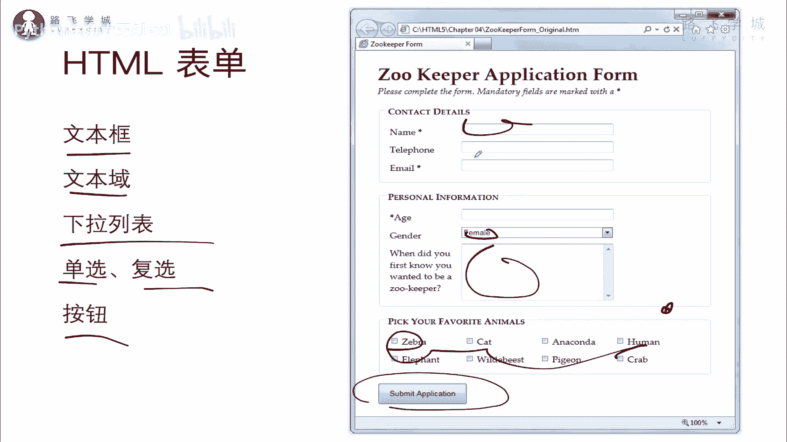

好不好，自己实现一下啊，来一下嗯。

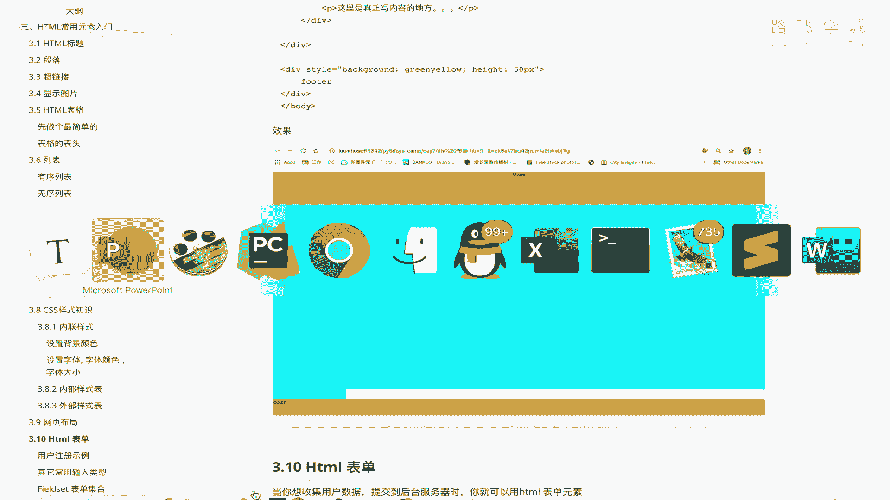

我看一下啊，我们直接创建一个新的吧，叫表单，单这个课件，OK那我们现在在这里当然要写一个D，写个div咯对吧，一般会放到div的啊，一般你的各种元素都都先先搞一个div，先要有容器再写元素好吗。

那接下来写你的form表单，form表，看到没有，它的代码结构是这样的，看到没有，form开始结束，然后呢，接下来里面我比如说写用户名啊，用户名就直接是啊啊这个啊，别用户名了啊。

咱就写一个类似类似的一个网站注册行吗，类似网站注册，看到user用户名，然后你在这里直接写，注意了，它是一个input标签，看到没有，input标签就是咱们的文本框。

大家注意里边写属性叫tap等一个text啊，一定要写啊，是一个文本，然后你就可以了啊，可以了，那咱们来看一下是不是在这里就可以写东西了，看到没有写东西了啊，那这个时候咱们再来写。

比如说让你提交你的用户名password是吧，把密码也输进去，注意了，这个就不是text了，因为你输text可以，但是他的你的密码就是叫什么呀，铭文的铭文呢会带来的问题就是什么呀。

你这书不就让人直接看见了吗，是吧，让人家，所以他不会换行啊，他不会换行，你想换行得自己强制换行，那怎么办呢，我可以让他输入密文的，密文的，稍等先，咱就让他自己放行，直接写password。

它支持password，这个时候大家来看一下，看着啊，看到没有，就是这个密文的，我们网站的这些呃，用户登录的这个字段，都是用的这个password字段好吗，那接下来这就是文本框。

我们还可以写这个文本域对吧，你的比如说个人介绍，啊啊或者你写一个还可以写一个你的年龄是吧，出生年龄对吧，年龄吧，这个时候呢也是input，但是你要求他是不是可以，要求他必须数数字是吧。

你就可以在这里写一个，看到没有写一个number，看到没有a number啊，他甚至还支持date啊，日期出生日期看法啊，在这里这是很多种类型，咱们看出现，date看看啊，咱们看看。

我都很少用这个date来试一下，看还能这样写呢，还能选呢，我挺牛逼，是不是是不是挺牛逼，看到没有哎，这个应该是H5的新控件，之前应该H4里面不只是这样，总之我还可以选，你看这里只能输入数字。

我输入文字不行，只能输入数字，看到没有啊，我今年23岁啊，就是这样好换行换行换行，那接下来我们还可以探索啊，还有什么东西，文本框输完了，我们输入文本域好吗，个人介绍，然后呃直接写在这里，先写一个换行吧。

因为这个文本域挺大的，直接叫一叫taxi啊。

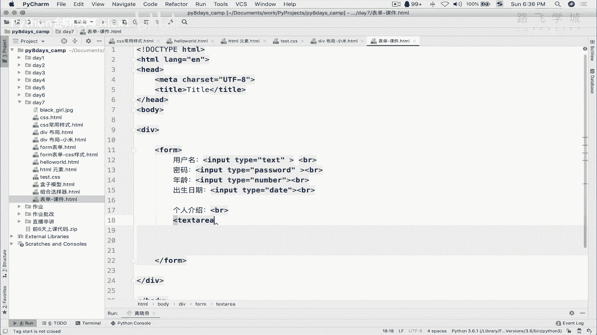

taxi就可以了，大家来看一下。

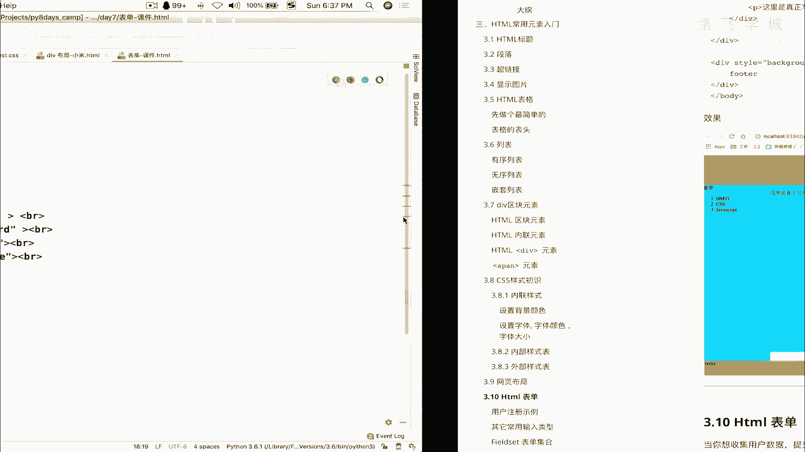

看到没有哎，你还可以定义好，让它比如说这么大怎么办呢，直接写cocos多少列呢，比如说是50个字符，rose多少行呢，五行看到没有，这个时候你还可以写police holder啊。

police holder是干嘛的呢，请输入不少于50字的个人介绍，大家看一下啊，play hold是干嘛的，看到没有，是不是宽了呀，整个默认就宽了，那这个时候你看着他。

是不是知道place holder干嘛了吗，他是个提示符，是不是提示文本提示告诉你在这填什么，能理解意思吗，好那到此咱们写了这个还有什么呀，单选框复选框下拉列表好吗，我们可以让他选你是男是女。

是不是是男是女就可以啊。

叫什么呢，Hold on，这个应该也是不换好的吧，咱们来试一下sex sex是吧，等一个，呃叫男女，就是呃叫什么来着，叫叫input tap，等一个radio，看到没有，这个就是单选框啊，同志们。

这个就是单选框，然后你写一个难，然后接下来你再写一个input，哦注意了，这个input它没有结束符，这个告诉你啊，它是没有结束符的，你不需要写结束符，然后再写一个type，等于一个啊，Radio。

然后你写一个女可以吗，这个时候我们来看一下，看到没有，是不是你可以选，只能选一个，他这可以多出来，哦对了，他俩是没关系啊，他俩现在是没有关系，你可以让他设置成最后让他只能单选啊，这个晚点我们再聊啊。

但是正常这就是一个单选框，要不选这个要不选这个好吧，OK这个是单选框，还有复选框，复选框我们先这样吧，让他回车，这个也是不换行的，我们这样我们先不不加复选框，我们先干嘛呢，我们先把这个叫什么呀。

因为这是一个表单表单，最终我要把这个数据提交到后台了，是不是我先把这个提交按钮写上，提交按钮就是tap也是啊，type等一个submit，看到没有啊，然后这个应该是个value，value等于一个啊。

注册啊注册咱们来试一下啊，大家看是不是啊啊，这个value就写的，这个value呢就是相当于对吧，这里显示的值，那这个时候呢我就要提交了，对不对，我这个提交是不是要提追了，你在这里提交的话。

他就会把这些数据都通通的提交到后台，明白意思吗，提交后台，那这个时候提交到后台哪个地方呢，你提交到后台对吧，你你比如说你提交后台一个网址，是不是你得有一个网址，所以其实说白了我告诉你啊。

你这里要想提交到后台哪个网址呢，啊就那后台他肯定有一个接口嘛，就服务器的这个URL的一个一个地址啊，这个去接收你这些数据是不是给你提交哪呢，提交就是写在action action这个地方。

就是你比如说我提交到啊，这个随便你写了一个叫路飞这个啊，提交提交到test url吧，因为这个东西不存在嘛对吧，它是不存在的，但是你注意了，你这样一写的话，他俩一点你看到没有。

它是不是直接提交到你本机的，就是这个这个这个地址的这个test url里面，也就是说如果你真有这个地址的话，你这个地址就会接收这些数据，他现在是没有404嘛对吧，那注意了，这接下来这不是重点。

重点的问题是什么呢，你这些数据你怎么提交到后台呢对吧，怎么提交后台呢，后台怎么去取到这些数据，你写的这些，你输的这些内容，比如说你输的用户名什么的啊，所以后台他要你把这一堆数据给到后台。

后台怎么把这些内容取出来呢，他怎么知道这个说的是啊这个什么呀，这个说的是用户名，这个说的是密码，他怎么知道他自己判断类型啊，说这是text，我这里可以好几个text对吧。

我可以我可以我可以写这个叫做啊这个什么呀，嗯叫sorry，爱好行吗，这两个text他怎么知道这个是用户名，这个是什么呀，它区分不了的呀，你这里写的这个用户名，爱好只是为了给浏览器上的用户看的。

后台可是不管这个的啊，所以你必须要有一个值让告诉后台，我这个是什么用户名，我这个字段是用户名，这个字段是这个啊，叫叫叫爱好对吧，所以呢这里就出现一个叫name字段，看到没有，name字段。

其实就是这个相当于这个标签的一个变量名，后台就通过这个name啊，就是后台你就是你在这起的这个name，name name等于什么，就是相当于这个的变量名，后台就通过这个值来取。

比如说我叫username，那然后呢这个叫password，Sorry，这个就好比啊这个叫password，注意了，这个很关键啊，对了你提交到后台，也就后台就是认为你这个字段的变量名。

你这个字段的名字就叫username，就是这个啊input标签，这个字段的名字就叫username，他就通过username这个变量名来去取，你这个input输入的值，不相信的话，你在这里也能看到。

看着我在这里输入一个ALEX爱好girl对吧，特别是黑girl black girl，那我的密码你看不到，对不对啊，二十十二岁，这个时候我一提就要注意了啊，大家来看一下，你看注意了，看到这个东西了吗。

这个问号什么什么的，这中间是and符，这就是区分的啊，注意了，你看这个user里面等于alex hobby，等于一个什么什么girl，然后password等一个ABCH等于12，注意了。

这就是提交到后台的一串数据，他到后台的时候会变成一个字典的形式啊，字典形式，这就是K这就是value后台拿到这个字典，通过username就取出来，你说的ALEX，你说的hobby。

你说的password能理解意思吧，所以这是name的作用啊，因为现在我没有跟后台真正的交互，所以你没有办法给你演示，在后台取到它的数据，后台取到就是文本数据好吗，但是你理解这个意思就行了。

OK那么接下来我们再来看啊，这个什么呀，叫复选框，复选框的话就叫check啊，sorry tap等于一个checkbox，看到没有EBOX，然后呢，嗯你这里后面直接写，你这直接写，他这个时候。

你就相当于你的爱好吧啊爱好，然后呃这个girl，然后嗯这个car对吧，然后潜水，然后还有编程是吧，这是我的爱好啊，抽烟喝酒烫头，大家来看，你看到没有是吧，就是负相框，就是这个好吗，那你提交到后台的话啊。

提交到后台的话，那这个东西也得给它起名字啊，并且你在这里还要起值它，它注意了，你提交后台他不会，你看现在这个爱好就是这个复选框是没有的，你你要给它取值的话，就是什么呢，先给它取一个name，等于一个。

哦你刚才有一个内容的，你要是H吧，H o h o b，注意了，这几个都是好比，Hobby，然后呢你在这里得给他写个value value的话，这个是girl啊，因为这个是给用户看的，这个是给后台取的值。

那意思吧可能不理解不理解没关系啊，这个反正现在也不涉及到了，不涉及到打一笔啊，这个是holding是吧，Python那同志们大家来看一下，我在这里如果选了girl和这个编程的话。

我提交大家看它就会干嘛呢，你在这里看到的是啊，它是两个变量名，看到没有，都是一样的，后台会把它变成一个列表的形式来取啊，就是取到取出来的话，就是说这是列表里的两个元素，GIL和Python好吧。

就能取到这种复选框的值啊，好最后再来看什么呢。

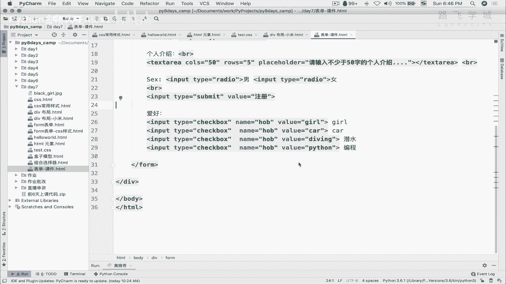

还有还有还有啥还有什么还有什么。

最后我们看啊啊哎对，最后其他的东西就没有了，还有一个小点啊，叫什么呀，叫field set啊，叫看到可以长成这样的样子，是不是好看一点，就是分组，看到没有分组啊，这个怎么做呢，其实很简单。

我直接把它copy过来给你讲一下就可以了，你比如说我在我这个地方啊，啊我直接我直接copy这一段吧，对大家看啊，大家看field set，其实就是说一组一组这个字段的集合，看到没有，然后注意了。

这里写了一个legend，legend是干嘛的，这里三个字段，这个没什么好说的，对不对，我们直接看效果，大家来看一下，你看是不是合在一块了，这个personal personalia啊。

这个文字所在的就是这个legend。

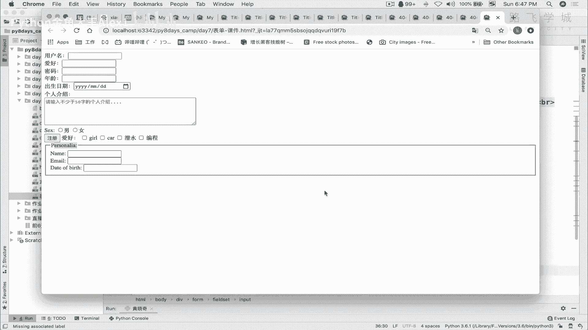

看到没有，Legend，其实相当于就是把咱们的什么呀。

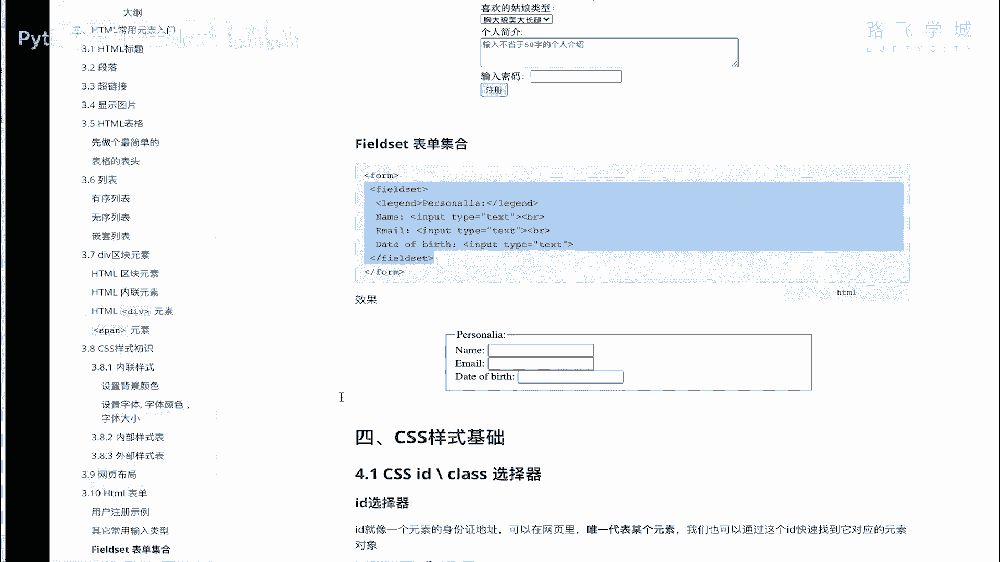

把咱们的这个这个这个字段给你，这些字段给你包裹起来了，看到没有，这样看上去整个好看一点，有点像这样，是不是啊，对不对，有点像这样啊，好这个就是field set啊，你大概自己试一下就行了，哎到此为止。

咱们那个什么呀，form表单最简单的一个用法已经给大家讲完了，看到没有，最简单的用法讲完了，我给你要求的练习是什么呢，你写出来一个这样的格式哦，稍等少了一个，看到没，ginger下拉下拉这个列菜单。

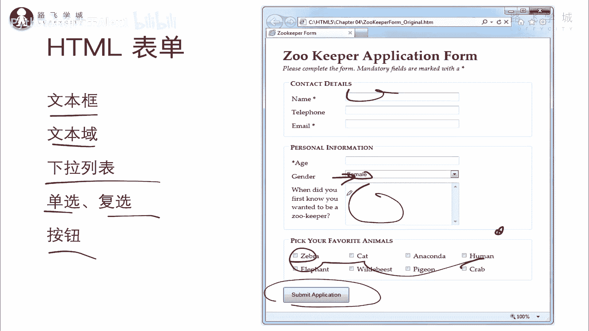

对下拉菜单我们把它讲一下啊。

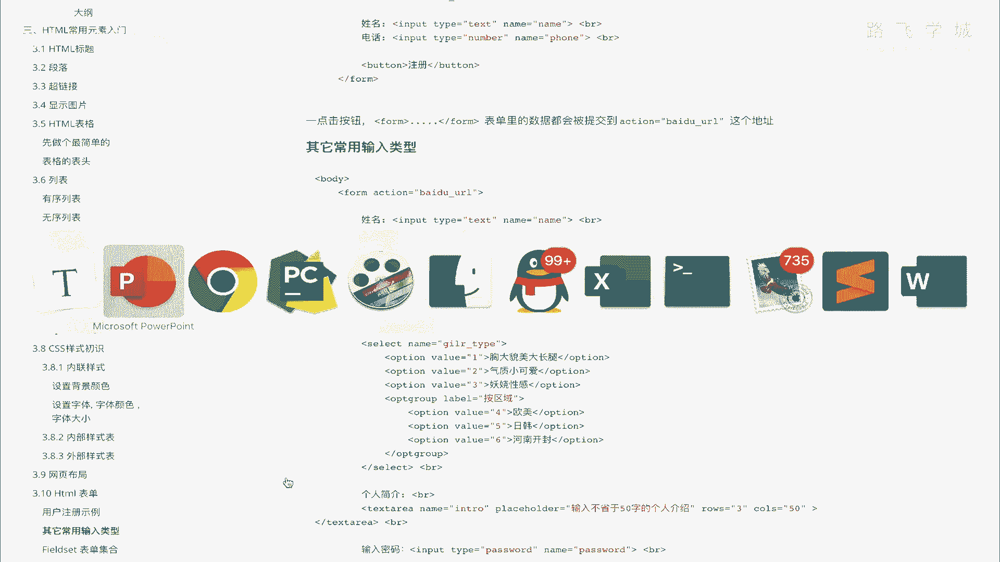

OK下拉菜单怎么弄呢，直接是叫select，看到没有select select，然后呢注意了，接下来你这里面写的是什么呢，叫option up，不是up成功，Option，然后注意了这里面。

比如说嗯这个让你选择你的喜欢的类型，喜欢的姑娘类型可以吗，这个时候你的option我把它放在这个里面，放到我们的，放到我们的这个，集合里这是表单，集合里，好吧啊，可以吧，然后这个小可爱也行。

然后对就是就是微胖型是吧啊，我是不行啊，我不喜欢没关系，总之这么写完了之后，同志们，你的下拉菜单就出来了，大家来看一下是不是啊，来看一下，但是你想往后台提交的话，那你选中哪个，你是不是还得给它值啊。

所以你要在这里赋值，你这里因为它单选框嘛，你在这里单选嘛，你得先写上变量名，叫比如说嗯好，这个叫叫favor，你喜欢的girl type，对不起，这个变量名，然后这里呢是想你的value value。

就是说第一个选择第一种类型，比如说啊这是第二种，这个是第三种，看到没有，那这个时候同志们，你选择了一个小可爱，是不是第二啊，啊一提交大家看是不是就这个二啊，然后后台就可以拿到这个数据，拿到你选的数据。

明白吗啊，他在这里还可以加一个叫什么呀，就是在这个下拉菜单里还可以再分组啊，叫option grou，Option group，看到没有叫，比如说按区域分，对吧嗯比如说我喜欢的是也是option啊。

写一样的啊，喜欢是欧美的，啊日韩的啊，河南开封的是吧，这三种类型啊，那河南河南开封单独拿出来啊，大家来看一下，你看看出这个区别了吗，其实是按组来按组来分类了嘛，是不是这个是不能选的，就选一个。

其下面是一样的好吧，就做了一个分类好，这个就是下拉菜单，同志们啊，都给你讲完了之后，我给你布置的练习题，就是什么来着。

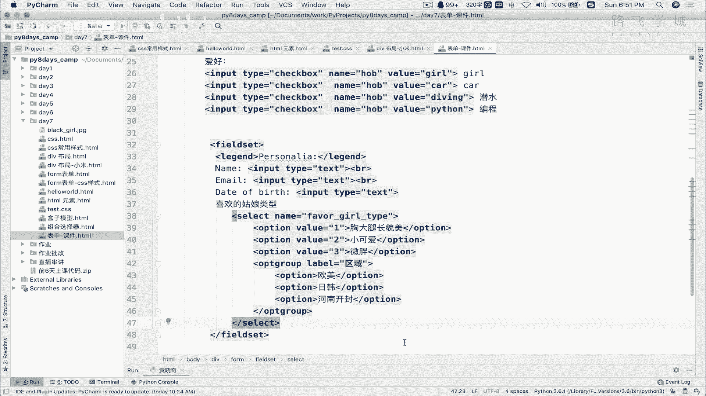

就是什么来着，A co，这个自己做一个跟这个一模一样的表带好吗，一模一样的，长成一模一样的，分三个表单的集合，把这些字段都给它加上去就可以了。

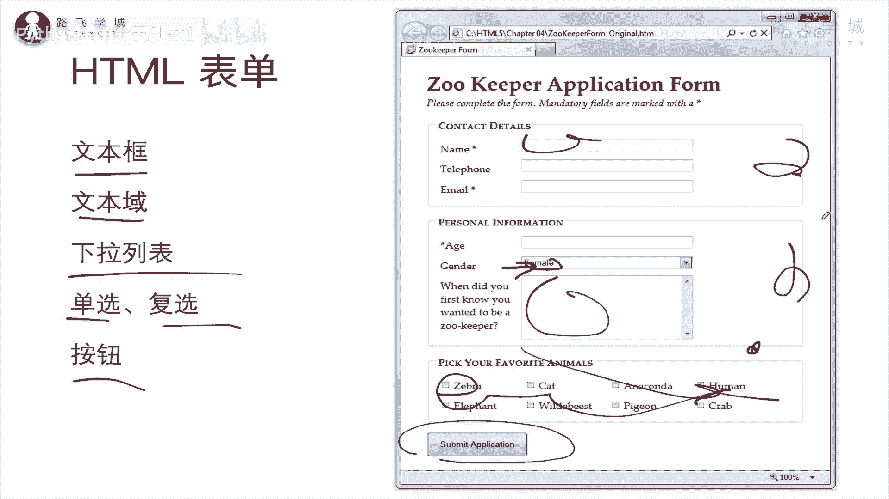

好这是HTML表单。