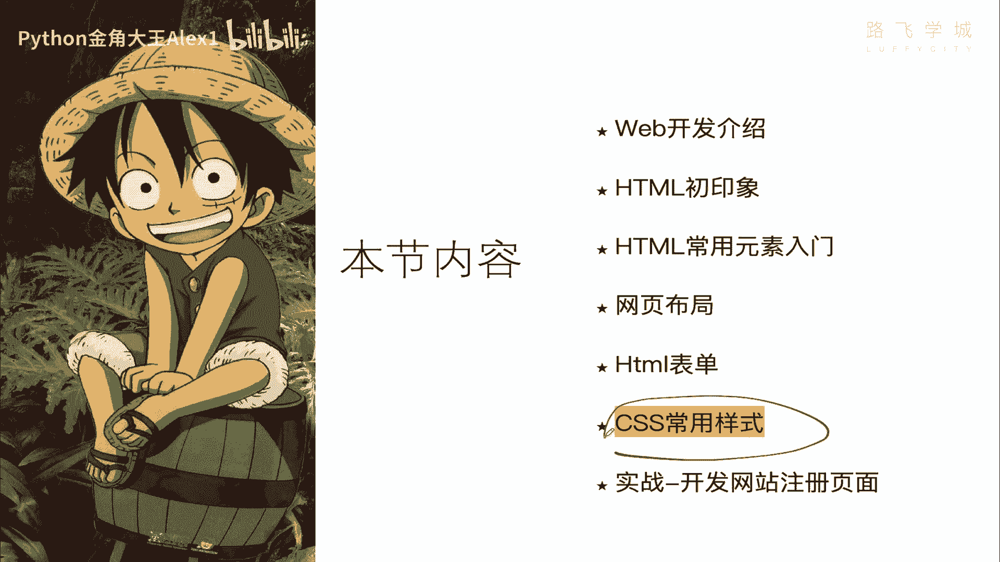
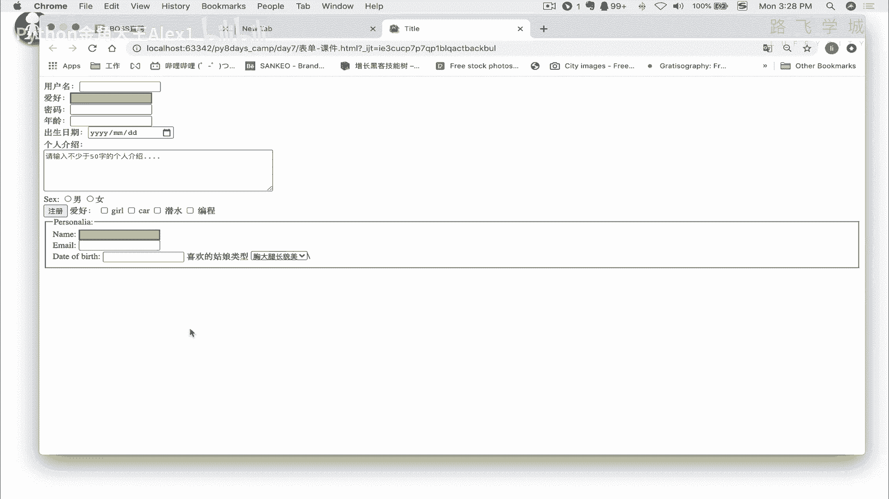
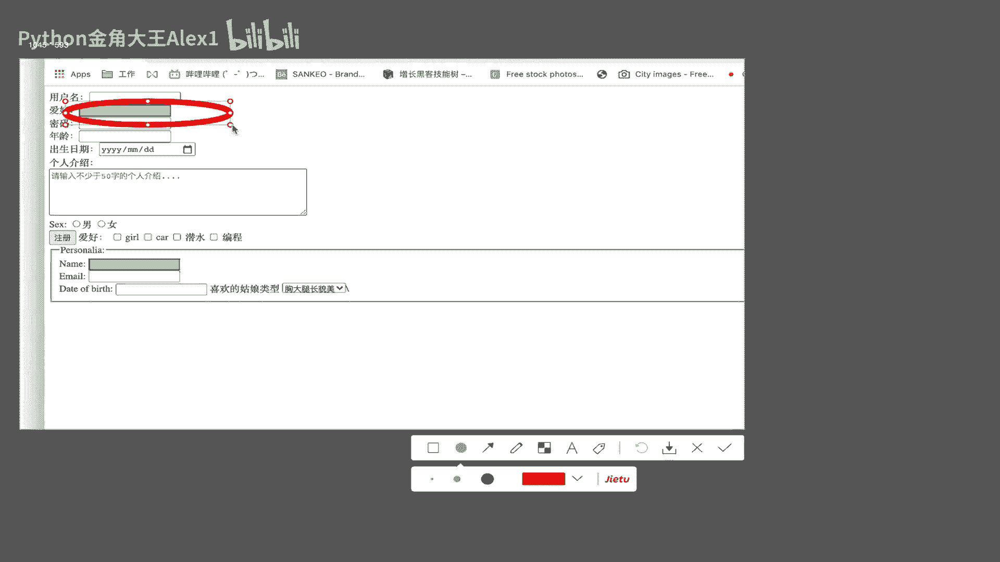
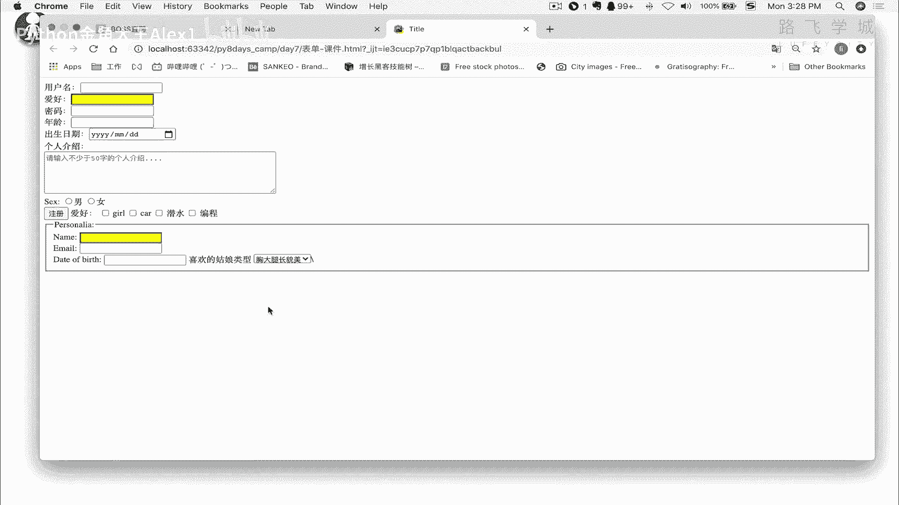
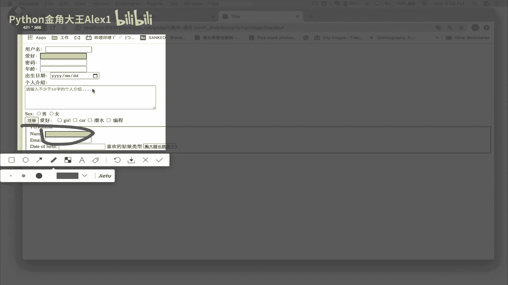
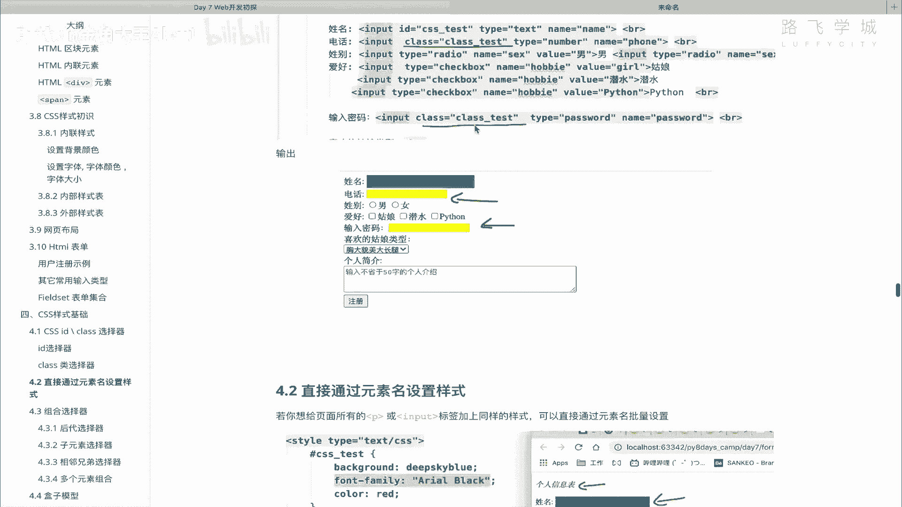

# 【2024年Python】8小时学会Excel数据分析、挖掘、清洗、可视化从入门到项目实战（完整版）学会可做项目 - P90：08 CSS id & class 选择器 - Python金角大王Alex1 - BV1gE421V7HF

OK同学们到此为止呢，咱们就把HTML的这些常用的标签给大家讲了，比如说表单呀啊段落标题，还有这个叫table，还有啊图片类似这些东西对吧，那注意了，当然HTML还有很多，那这个还有十几个吧。

其他的一些标签，那些标签呢，还是那句话，我们这是一个web开发的初探啊，这个外前端啊它是一个专门的学科啊，你要是认真学能学好几个月，所以我们只是为了学后面的爬虫，先把基础掌握啊，这几个就已经够你用了啊。

够你用了，你全学完能盖，就是你把这个HML的全全学完，当然比如说你你能盖楼盖这个摩天大楼，但是我们现在已经给你够学的这些东西，够你盖一个什么呀，茅房不是平房啊，平房，那接下来呢我们就来装修一下。

咱们这个毛坯的平房好吧，就是学这个CSS的样式。

那这里面涉及到啊学哪些东西呢，叫什么啊，id class选择器，什么选择器，这选择器这是个什么东西啊，那先直接说一下，就是选择性的看法，其实就是你要给咱们的这个啊标签加样式。

你是不是得先找到一个咱们的标签，比如说这是个P标签，对不对，那你怎么找到这个标签呢，注意听你找到这个标签的方式，看你可以有很多种啊，你你你有好几种方式找到他，那就是找到标签。

就是我们管找标签的这么一个东西，就叫做选择器，你通过一个选择器来去找到这个标签，来去改它的样式，改它的背景啊，改颜色呀，明白吗，所以我们可以通过什么id class，还通过什么标签名，还通过什么组合。

一会都会讲，OK啊，这是选择器，那接下来盒子模型一会说，然后常用的一些CSS属性，加边框啊，加背景啊对吧，放大呀，缩小啊，加字体啊，常用的一些属性都可以给大家讲好吧，先来看啊。

这个id class选择器好吗，嗯我直接跳到这，首先说这个id啊，这个东西，id这个值其实我们在前几节已经大概提到了啊，就是说你咱们这个HTML上面有那么多的标签啊，TML上面页面上有N多个标签。

那假如说1000个啊，那1000个里面可能有500个P啊，500个P标签，你怎么从这1000个里面，定位到专门的一个P标签啊对吧，1000个里面只找到对吧，千里寻他对吧。

就知道这专门的一个P标签怎么办呢，所以你就可以干嘛呢，给这个P给你想的找的那个P标签，定义一个专属的名字啊，唯一的一个名字就可以用id来实现，看到没有，Input id。

这是它的每一个标签都有一个id属性，所有的标签都可以加这个id的属性啊，就是给它起一个名字，这个名字应该是在要在全全局页面，整个tb页面里面全都是唯一的，就它一个名就像变量名一样。

你起了重复的就会把之前的覆盖能理解意思吗，就起这一个，OK那你起了这个名字之后，后面对吧，那你你你你你拿着这个标签了，你能找到这个标签，找个标签干嘛，你可以给他啊，加样式对吧，加样式诶，给它改颜色。

那咱们怎么找的，给怎么改它呢，看就是在这个叫内部样式表里看到没有，直接加一个井号，后面加上标签呃，这个id的名字后面就可以给他写样式了，能理解吗，后面可以写样式了，那这样的话它就能说白了。

这就是叫id选择器对吧，通过ID来找到这个标签，给它加样式，叫id选择器可以吗，那我们就人肉的来试一下好不好，大家看我这里呢有不少的标签啊，input或者什么的，那我就这样，我就给我咱们这个啊。

这个这个这个这个这个用户用用户名吧，爱好吧，这个地方加一个id好吧，id我就叫hobby，行吧啊，叫hobby，那这个时候你加上了这个之后，那咱们就要在这里啊就去选择它，先写上一个style呃。

他这个时候注意了，加井号，看到没有，直接写叫hobby，那这个时候啊后面就可以写你的样式了，你比如说给他改一个背景，My background color，Background color。

这就是它的改这个标签的背景的一个属性，然后我们给它改成叫啊yellow行吧，哎改了这个yellow之后，同志们我们就来看有没有实现，大家看是不是已经加上了这个效果呀，那这意思吧，哎已经加上了这个效果。

这个就是id选择器，OK那我们说这个hobby这个id啊，像他要在全局页面里就是唯一的啊，唯一就跟身份证号一样，你不能重复，还有同学说我就是想重复可不可以呢，唉你想重复呢，咱们就来看一下重复的效果。

比如说我们找一个哎，找到这吧是吧，到这你看他其实拍场面已经告诉你啊，这个红的飘红了就出错了，但是这个浏览器啊，就这个ATML它跟Python也不一样啊，这个出红的是吧，Python就执行不下去了。

但浏览器它可以执行，咱们看它的效果啊，哎大家来看一下。

发现一个问题，你看这个我靠，你写了两个id。

发现这两个id都生效了，是不是都生效了，没有错啊，这个我觉得也是这个什么呀啊。

HTML它不严谨的地方，你这个地方你就应该说，你说白了你从上到下解释，你就至少如果重复的，那你相当于下面这个就覆盖上面这个，你应该改这个，但不是它还就都都给什么了对吧，就会导致很多新手他就很很很很迷惑。

说哎那既然他不限制我以后就写多个id就行了，这个时候只能是靠，也是他语法上没有严格限制你，咱们只能靠开发规范上，也就是说你不要这么干，你全局就要写一个id，明白吧，全局写一个id。

你不要管他说哎他怎么都能解释，这是他内部解释，这个这个就是浏览器解释的不严谨啊，这个对语法上，但是我们就要写一个明白吗，你CSS虽然是他能找到，这两个都给它加样式对吧，虽然即便你是一样的。

但是后面我们学到JS，就是那个就是什么让你这个页面动起来，那些东西，你再搞两个id的话，就会有更多的问题了啊，就不是这么简单了好吗，总之不要别看它这个效果，但总之不要写写两个好吗。

OK这个就是id选择器啊，那选了D选择器之后，我这里就来了一个问题，问题就是什么呢，说哎老师你看啊，你这个id选择器，就是说你给一个呃input加了一个样式，但是我觉得这个太慢了。

假如我这里有啊是啊100个这样的输入框啊，我想把这种所有的，比如说我就想把这种所有的这样的一些输入框，都给它加上样式，看到没有都给它加上样式，那我还不得一个一个的写，每个都加id，那个效率太低了啊。

那怎么办呢，你要想解决这种问题啊，想想解决任务有两种办法，两种办法啊，就批量加强什么两种，第一种就是说你干嘛呢，不要用id了，而是要求用类选择器，叫class选择器，类选择器就是干嘛呢，相当于把怎么讲。

所有的就是你你依然想写一个选，写一个这个这个这个样式表，然后呢让所有的这个啊input都应用这个样式表，那所有的样式，所有的这个input都会跟着去变颜色，就是变样式，明白吗，哎叫class选择器。

一会讲，还有一种叫元素选择器，元素名选择题，就是说你直接找到所有的input都给他加样式啊，都给这两种，我们分别来看一下，你就明白区别了好吗，咱们来先看一下叫class选择器。

class选择器呢它的这个写法啊，它的写法就是在这个地方加一个属性，比如说你想给这个，你想给这个number加一个样式对吧，那你就接着叫class class，然后叫什么呀，class test吧对吧。

就样式啊，就咱们这个类选择器，类选择器的一个样式测试，给它起这个名字，注意了，你想给哪个字段叫什么什么添样式，你就改哪个，比如说我在这里还有一个叫啊，这个这个这个email对吧啊，给这个name加上。

给这个email加上可以吗，相当于现在我注意了，我加了三个地方，是不是email啊，然后这个呃呃哪里呢，好年龄，这三个地方，当然现在他还没东西啊，刷新一下，现在还没东西，因为没有加样式。

你写了你你把这个类写到三个地方之后，你接下来要声明这个类，对不对，那怎么办呢，你在这个地方注意了，它不是井号了，井号是ID，你现在是点点是class来sorry，下点是class，看到没有。

哎这哎这个叫class选择器好吗，类选择题O，那这个时候你再在里面写的东西都是一样的了，OK吗，你比如说你给他写一个background color，等一个等一个orange好不好。

然后呢啊你这个时候我再给他加一个样式吧，border border等一个，比如说order等一个啊，two p x两像素的这个dash的，DX的DX的这个吧就给他加点。

就是说两像素DX的就是点你看一下效果就行了，诶大家来看一下有没有意思，你看是不是我给这三个字段都加上了样式，明白吗，那你要想后面比如说你给这个taxi也加这样的，也很简单啊。

你就只需要把这个taxi也干嘛呀，copy这个copy这个东西，对不对，那你这个时候刷新一下，你看对吧，就超级简单，你就很容易给多个字段啊，这个加上你的样式就统一的样式，你要改就统一改了，对不对。

你比如说我不喜欢这个颜色啊，你你给它改成一个啊，这个这个这个这个这个green green yellow是吧，历史那是一样的呀，你看就都批量改了，这个就是就就感觉很牛逼，是不是就就效率很高。

就夸夸夸批量改了，你比如说有的时候网站上对吧，你这个有的网站它支持说切换主题，是不是一一点夸整个网站颜色各个地方全变了，就是怎么定义的，就是通过这种类类选择器能理解意思吗，哎class选择器诶好。

那这是一种，说白了批量给很多个字段加样式的一种方式，还有这是第一种，那第二种是什么呢，就叫元素选择器啊，元素选择器是什么意思啊，直接写上，比如说这个元素名，咱们现在叫input标签，是不是我就直接看着。

同志们啊，啊除了除了这个id和类之外，我直接在这里取元素名，比如说我直接写input，我靠还能这么写呢，PS还可以这么写啊，你直接在这写了一个input之后，注意了，你就可以给它加样式了。

你这个时候加样式你就可以改了，看着同志们，Back ground color，你给它改成一个blue，sorry啊，把这个改成这个样子，同志们啊，注意了，这个意思是什么呢。

给所有的input标签都改这个样式，看完所有的input标签啊，注意了，所有的input标签，这个时候我们看一下还会出现一个什么效果，大家看一下啊，你看首先呃确实是给好多input改了这个样式。

你看是不是啊，这也是，但对，但是我这个什么呀，你看我这个爱好是不是input，然后这个这个这个这个年龄什么的也是input，但是他们为什么没改呢，对吧他们为什么没改呢，看到没有，是这样子，对不对，哎。

这个地方其实就要考虑到一个叫什么，优先级的问题，你看啊，首先我们说input是给所有的啊，给，给所有的input标签啊加上样式，对不对，这个是它的效果，也就是说里面有多少个就加多少个啊。

那理应来讲我们这里面包括这个用户名啊，啊这个sorry这个爱好啊，这个年龄啊也都要加，但是实际上这些没有变，为什么呢，是因为你看啊你的你的这个taxi啊，taxa不是input，所以才不会员。

你的这个这个这个年龄啊，还有这个爱好爱好用的ID年龄是用的class，对不对，那他们还他们没有跟着这个input标签会变，它是还是用的自己的class，那这个就是优先级。

也就是说你的这个什么class和id的，这种样式的优先级是大于这个什么呀，这种直接在这里写的啊，元素的这个这个这个优先级明白意思吗，就是它的优先级是大于它的，要这么讲，这是我看啊，我写到这诶。

sorry啊，元素名啊，对吧，这个r i d and class选择器的，样式优先级大于这个什么呀，元素名选择器对吧，结果就是相当于，如果你已经如果你已经在这里给某个元素，单独的设了样式。

那你上面这个元素啊，这上面用标签名直接给给设置样式就不生效，能理解意思吧，好那那怎么解决呢，我想就让它全部生效，那怎么办，你就只能把它先给它删掉，你比如说你把这个啊或对，或者你把这里什么也不写对吧。

你这什么也不写，他就会用上，因为什么也没有嘛对吧，这是空的嘛，那他相当于相当于就用这个了，对不对，你看着刷新一下，看到没有啊，什么也没写，他是不是就用上你自己的这个元素名的选，择去了，对不对。

那tt area是因为对吧，它是它不是input，所以它不会设置样式O那好同志们，我们现在就讲了，给大家讲了三种选择器，id选择器，class选择器，以及直接通过啊元素名是去设置选择器。

你看我在这里写的有input，我还可以给P标签设置对吧，就是反正只要是标签名都可以设置，OK吗，好那你们自己来试一下，把我这个图上的课件上。

