# 【2024年Python】8小时学会Excel数据分析、挖掘、清洗、可视化从入门到项目实战（完整版）学会可做项目 - P94：12 定位&布局 - Python金角大王Alex1 - BV1gE421V7HF

OK同学们，接下来咱们来学一下这个position定位啊，那它是用来干嘛的呢，我给大家看一个效果，你就知道了啊，那我在这里打开咱们的知乎啊，然后大家来看一下啊，忽视人民，怕美帝，美帝发人。

OK大家看一下啊，我在这里往下刷，看着啊，往下刷会发生一个什么效果呢，发生什么效果呢，注意了，你看下面都会往下不断地走，但是大家看这个呃叫菜单栏，它是不是一直固定在这个地方啊，看到没有。

他这个菜单栏并没有随着你整个页面往下走，相当于有点像是说白了，假如说这是两层纸，你下面这张纸不断的往下滑，但是上面这个这个这个值一直固定在这，就是固定住了。

就有点像哎大家学过excel里面有一个冻结单元格，是不是那个单元格就是你可以冻结一行啊，然后那一行就是那个表头嘛，然后他就他就可以一直固定在这个位置，明白吗，那这个东西是怎么做的。

这个东西就是用定位做的，我们用单击审查元素啊，大家啊审查元素，然后我们来看一下呃，看一下啊，点到这个地方来，然后我们看一下，看到这个position了吧，position啊。

这个relative是什么意思，先不管我在这里给它取消掉，然后我看应该下面还有个东西，看看还有没有啊，还有没有a position，然后稍等啊，哎，呃我看这里还有吗有吗有吗有吗有吗，有没有那个诶有吗。

诶你看这诶不对啊，他没有他没有什么呀，我把这个我把这个让他替补去掉，没有变，然后，哎在这里大家看看到没有，这里还有一个position啊，他俩是有什么继承关系，你不用管啊，忽略掉。

但总之你看是不是出现了，看到没有，看到没有，这个菜单栏是不是就没了，它就不会再固定在这了，明白这意思吗，好这个东西就是用定位来实现的，OK那所以咱们就来学一下啊，学一下，那他这个定位呢有那么几种属性啊。

有那么几种属性啊，就是一个叫啊absolute，Fixed relative static，咱们呢这节课只学几就只学会什么就行了呢。

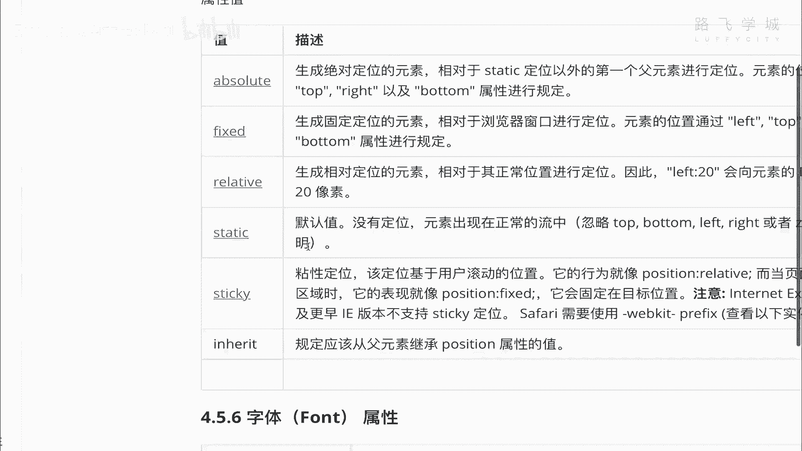

只需要学会fix和relative和static是干什么用的，其他这些啊，这些我们现在这个课程不涉及啊，不涉及，还是那句话，咱们不是一个前端课啊，那absolute我告诉你。

它的效果跟这个relative非常的高度相像，稍微有点区别，但是你要想解释清楚这个区别需要花一个小时，所以我们absolute也不讲，指你明白fix relative static就可以了，好吧。

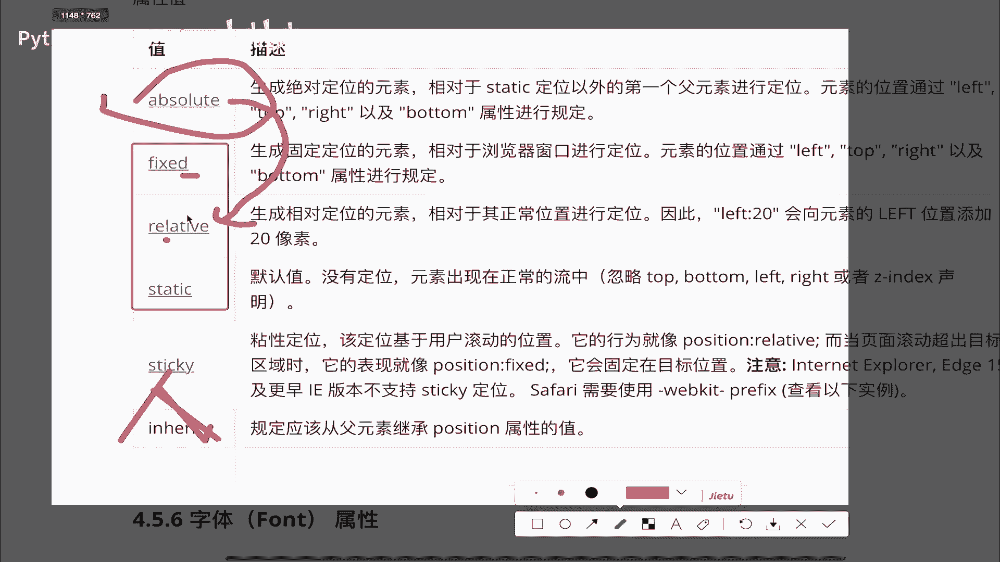

我们先从这个fix来去讲啊，fix它到底是一个什么样的作用，你看他说生成固定定位的元素啊，什么叫固定定位，然后相对于浏览器窗口进行定位啊，其实就是说相对于浏览器的这个窗口，我把我这个比如说容器。

因为它这个定位一般是针对容器啊，当然你也可以针对什么字这个这个这个标题啊，什么也可以，但一般是针对这个容器啊进行定位或者图片，那呃怎么讲，它是相对于浏览器的这个位置，比如说我相对于浏览器这个啊往下走。

比如说100像素，明白吗啊，然后那个元素的位置是通过left top，right bottom这四个数这四个值来去进行规定的，什么意思呢，我告诉你这个定位它有两个属性啊，两个属性来我给大家演示一下。

就看出来效果来了，首先我们在这里就拿这个页面来搞吧啊，盒子模型还是这个看到没有，我们现在就拿呃这个什么呀，就是这个蓝色的div来进行测验，现在呢它是直接顶头顶着浏览器的，左边也顶，右边顶，上边也顶。

那我们现在想让它根据浏览器，就是就是浏览器的这个边往下，就比如说浏览器在这，它这个呢这个框就往下走个100，就是跟浏览器永远保持100，上面100，左边100好吗，那怎么去实现呢。

哎这个就要用到fix的定位，OK这定位这个时候我们来写一个报呃，第一个第一个应该是第一个应该是box1，对不对啊，蓝色的box1可以吧，我们在这里就给他写，首先你要先确定一个叫定位的模式。

因为它定位有好几种，有有fixed relative，好吧，我们这叫position，然后定位模式是fix的，这个就是说相对浏览器的一个固定定位啊，要先确定啊，你要定位的模式看到没有啊。

OK咱们现在fix是相对于浏览器定位，然后呢接下来再去确定说我离浏览器高多少啊，这个啊就是就是从从帮，从这个浏览器这个边上往下走多少，往右走多少对吧，所以你就是top，然后相对浏览器高，比如相对浏览器。

比如说50PX，然后left啊也是50PX可以吗，你这个时候注意了，同志们，你看着你看着这个效果来了，执行诶，大家发现什么问题没有，首先先两个问题，第一个，你这个框是不是相对浏览器上面往下走了。

50像素，左边走的50像素，对不对，这是第一个问题，第二个问题是你这张下面的，本来在下面的图片给挤到上面去了，是不是这两个问题对不对，所以我们分别来解释啊，那第一个问题就是说。

它相对浏览器从上到左都移动了，这个50像素，没错吧，诶这个就是定位的效果啊，就是对吧，相对于浏览器的这个这个边儿对吧，往往右走50，往从上往下走，50好，这个可跟那个margin不一样啊。

咱们上节课学的这个叫margin，就是啊DIV的外边距，它也能产生这种效果，比如说相当于这个这个怎么讲，就是呃我要写一个main等于50，它也会往下挤，但是不一样的地方在于什么呢。

那个你相当于是把你那个你用margin，相当于把你这个div盒子这个容器给它扩大了，相当于我这个边距外边距扩大了，对不对，那人家这你人家这个定位可没有，你可没有，你这个定位的话，你这个盒子依然是这么大。

只不过我把你这个盒子又往，真的是不实实在在往右移了，你会发现你的盒子，其实还是你并没有任何的外边距，看到没有，大家来看一下我的margin，看到没有，看到没有闪的这个这个margin并没有任何的变化。

它没有增大，明白这意思吧，啊它只是实实在在的位置往右移了好吧，这个是MARIN和这个这个定位的区别啊，像这种情况下，你想移动一般还是要用定位来做的哈，还是要用啊这个定位来做，不要用margin。

因为你只要一用margin，就会导致说白了他呃你在这里看不到的，这个边看不到的东西是空的，但是它实实在在是有编剧的，对不对，那你有编剧的话呢，那你以后再放一个其他的元素，在这那个元素跟这个编剧是相。

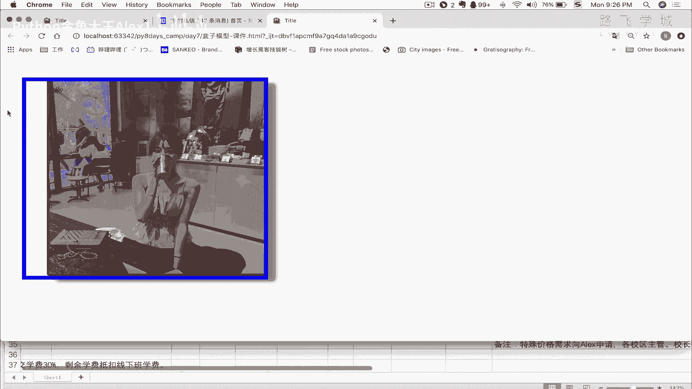

当于，这个相当于任何其他元素都要跟这个什么呀，比如说你以后在这里想插入一个其他元素，插入不进去的，因为它跟这个编剧必须对，它必须要就这你这个编剧已经把它撑开了吧，对不对。

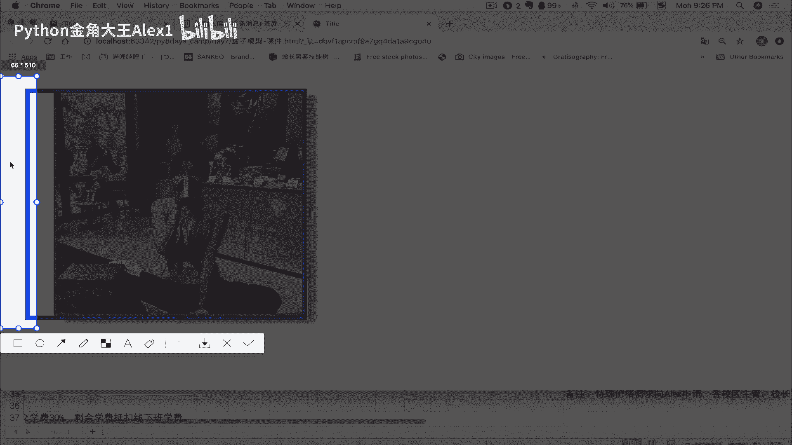

没意思吧，但是定位不不会出这个问题，定位你说你以后想在这里插一个别的东西，能插进去的，可以吗，好这个就是第一个问题，我们解决了好，那第二个问题是什么，第二个问题是下面的这个图片为什么一上来了，OK吗。

那现在就像这么讲，这个其实有点像咱们之前学的这个浮动啊，这两个div浮动是什么意思，就是说你要这么理解你，你可以把它想象成就正常的话，它就是上下嘛，从上往下排，一行一行的，从上往下排。

但是那是在相当于这两个元素啊，这两个div是在同一个图层上的，大家可以你可能没做过P，但是你大概理解一下这个图层就是一张纸上，就相当于是一张纸啊，一张纸上再画画两个，画两个div，画两个方框是吧。

在一张纸上，那是它就是从上往下排，但现在变你这么一做一个定位，就相当于是什么呢，把下相当于是说把你这个什么呀，把你这个蓝色的这个框注意了，是蓝色的这个div，这box1嘛把它给扔到另外一张纸上了。

就是把它从之前那张纸上给拿出来，放到另外一张纸上，所以现在是两张纸，是两个图层，注意了，它是两个图层，这两个图层互相之间没有任何的关系吧，已经没有任何的关系了，明白吗，就是在你的页面上，现在有两层。

指两个图层，一层上放了一个容器，所以那既然你把这个蓝色的这个div对吧，从原来的这个第一个图层上，给他提到第二个图层上了，那我相当于原来的这个位置是不是就空了，空了之后，那下面这张图片。

下面这个这个div就自然而然地移上去了，就移上去了，能理解这个意思吗，这个就是为什么它会往上移，OK可以吗，好这个你能明白了，这个你能明白了之后就这样吧，我给他搞出来一个。

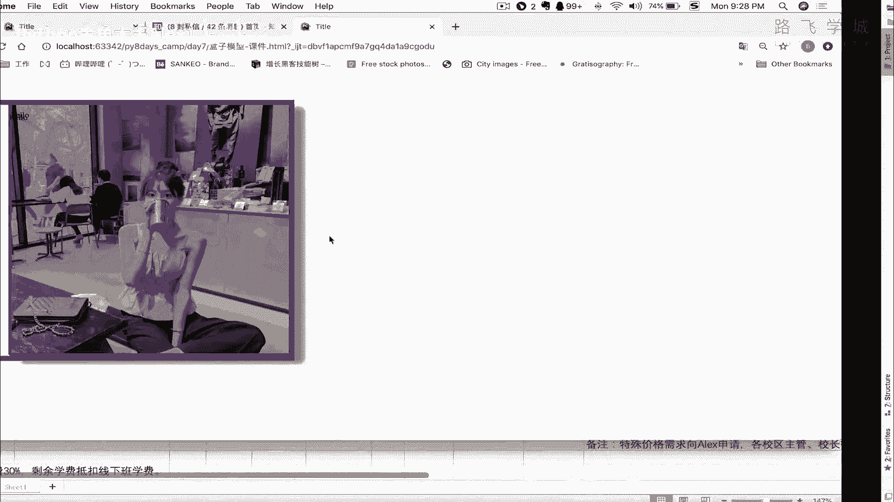

又搞出来一个向下向下一个100吧好吧，这样可能更容易区分开他俩好吧，这个是现在是呃两张图片啊，没有关系，那接下来我们再来看另外一个属性，这是fix的，我们明白了啊，向着是按着就是根据浏览器来去。

这个啊叫什么呀，就是固定在热哦，我这里补充一下这个这个什么呀，这个嗯这个蓝色的注意了，无论你下面这个什么呀，现在是它永远是相对于浏览器，就是在这个位置，无论你这个页面有多长多高多高，什么意思。

你比如说像这个咱们的知乎，你看他是不是可以不断的往下滑呀，它不断往下滑，但是我们自己这个页面，即便它不断的往下滑，我告诉你这个什么呀，一这个蓝色的，而这个蓝色的也依然会在这个位置上啊。

我可以给你演示一下来，我在这里再做一个div好吗啊，div这个div叫box3a hello s，然后呃我想想啊哦对在这里给他copy一个什么吧，copy copy一个三，然后把它的高度改成1500。

可以吧，改成1500，给他改个呃，背景改改个green，求分开好吗，我现在有又生成了一个div，它比较比较长，他就把这个页面给撑长了，这个时候大家来看一下啊，看着我往下滑，你看到没有，你看到没有。

你看这个蓝色的框动了吗，蓝色的光会永远固定在这个位置，因为它是相对于浏览器的好吧，这个就是fix自己聊，自己搞一下，接下来我们来看一下relative，relative是干嘛的呢，叫相对定位。

相对定位是什么呢，那么对于其正常位置进行定位，这是什么意思。

哎我给大家演示一下，就能看出效果来了，大家来看一下，我这个看到没有，我这个蓝色这个地方是不是有一张，是是不是有一个hello这个字眼呀，对不对。

我对这个hello进行定位啊，进行定位，大家看一下这个效果啊，我怎么怎么搞呢，我是不是要对这个box一下的星，box一下的P，对不对啊，然后进行一个定位，先把他的color咱给他改掉，改成一个red。

看的清晰一点，然后position给它改成一个叫relative，而不是fix了啊，这个时候同志们啊，同志们，我现在什么也不动。

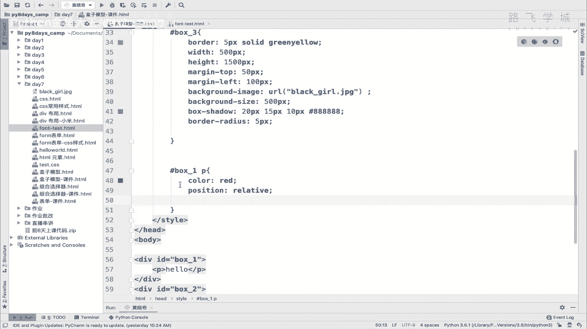

它其实没任何变化啊，你肯定要加上，就说怎么个定位法嘛，对不对，他没有任何变化，所以现在我给它改。

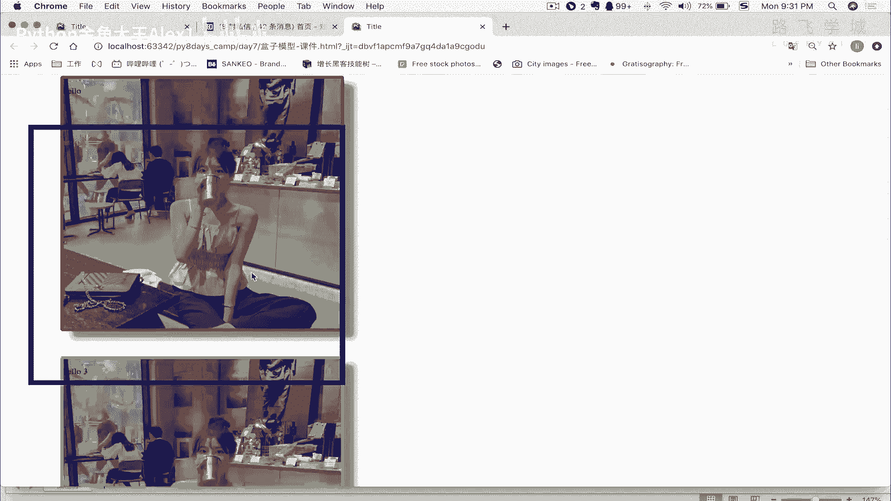

按top就按安卓吧，left啊，给他定位一个，比如说啊这个定位一个100吧。

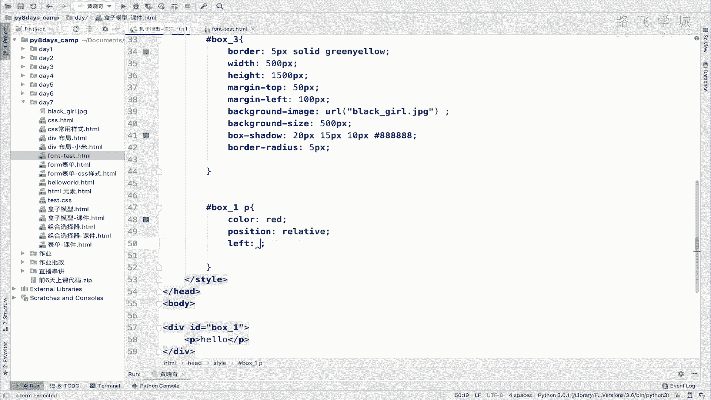

100px，咱们看看啊，也就是说我现在给它往右移一摆，我就问你一个问题了，我是按照什么。

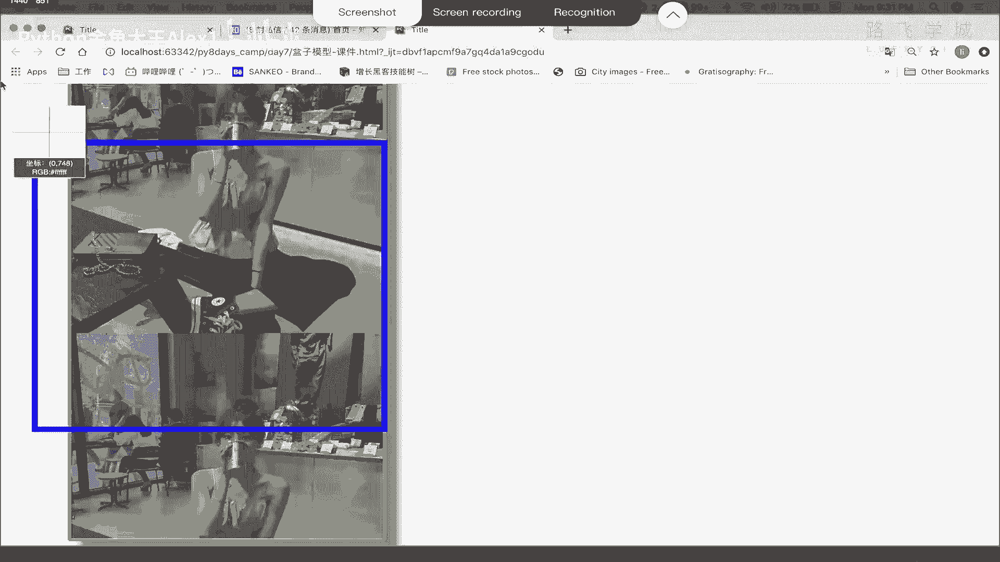

以我是按照这个从浏览器这个地方移，还是按照从这个地方移，还是按照我这个本身当前所在这个位置，一明白我意思吧，啊我现在不确定这有三个可能，一个是按浏览器的窗口，一个是按我这个负极的div。

因为我这个是在这个是在这个负极的，就是我这个P是在这个div这里吧，另外一个是说我按照我当前的位置。

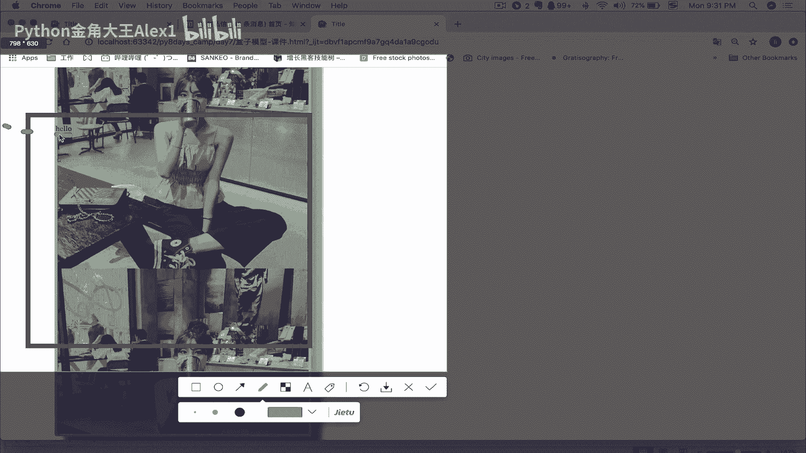

三个位置，对不对，大家来猜一猜。

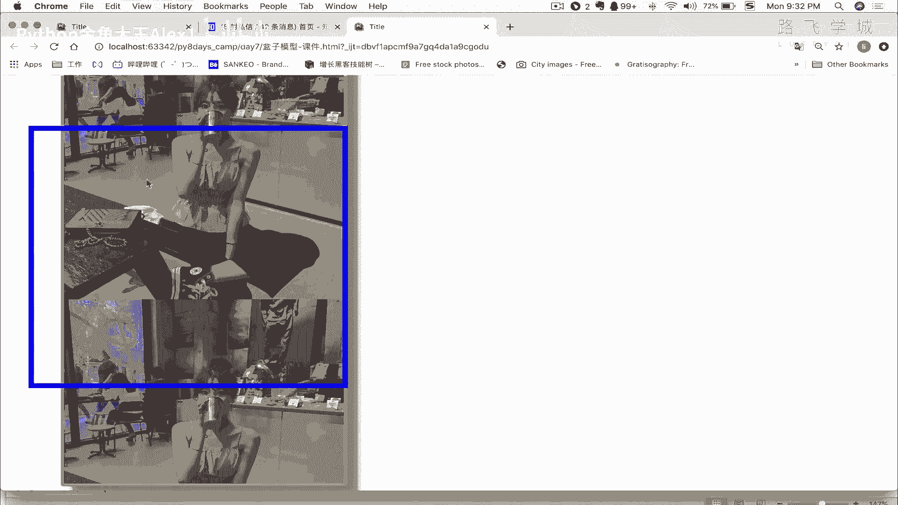

哎大家来看一下啊，同志们啊，同志们，我告诉你，你看他是注意了。

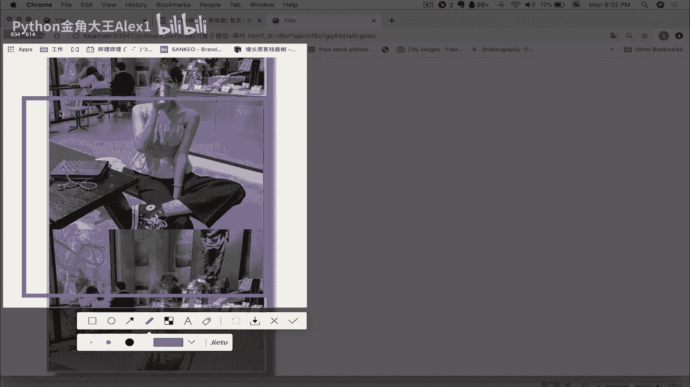

因为有移的是100像素啊，100像素的话，大家肉眼也能看出来对吧，你这个如果是从浏览器开始移的话，肯定超过100像素了，没意思，从浏览器开始肯定超过100了，然后从这个这个什么呢。

通过那现在是通过哪里移的呢，我告诉你，他也不是通过这个div这个地方，就是就是以它为定位，往往右移的，不是它是相对于自己原来的位置往右移，什么意思，注意听啊，它是相对于自己原来的位置。

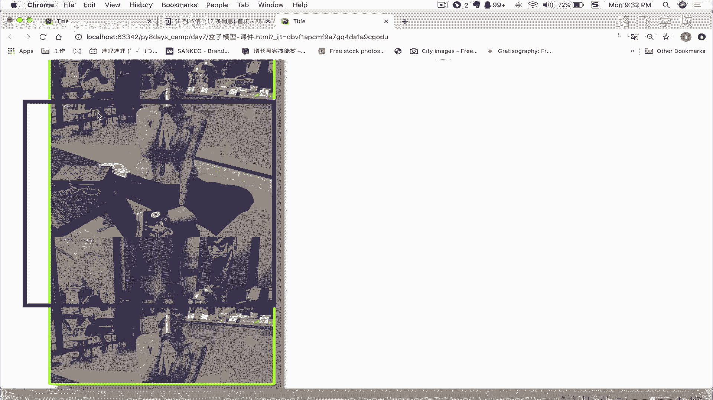

他自己原来的位置在哪，他自己原来的位置是不是在这，这是它初始的位置，它是相对于初始的位置往右移，明白这意思吗，哎这个就叫相对定位，相对于自己当前的位置往右移，或者是从这个位置往下移。

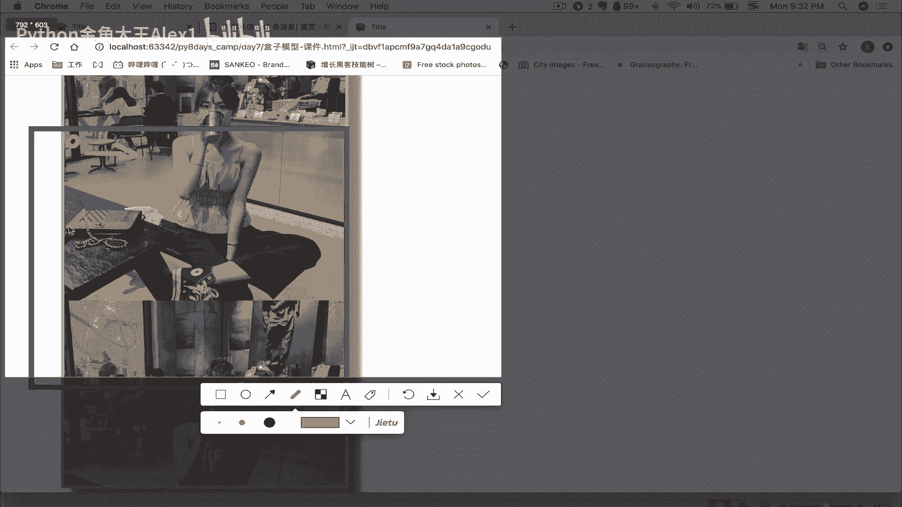

你这个时候往下移的话，它也是一样的效果啊，你这个比如说，top对吧，然后等一个100X。

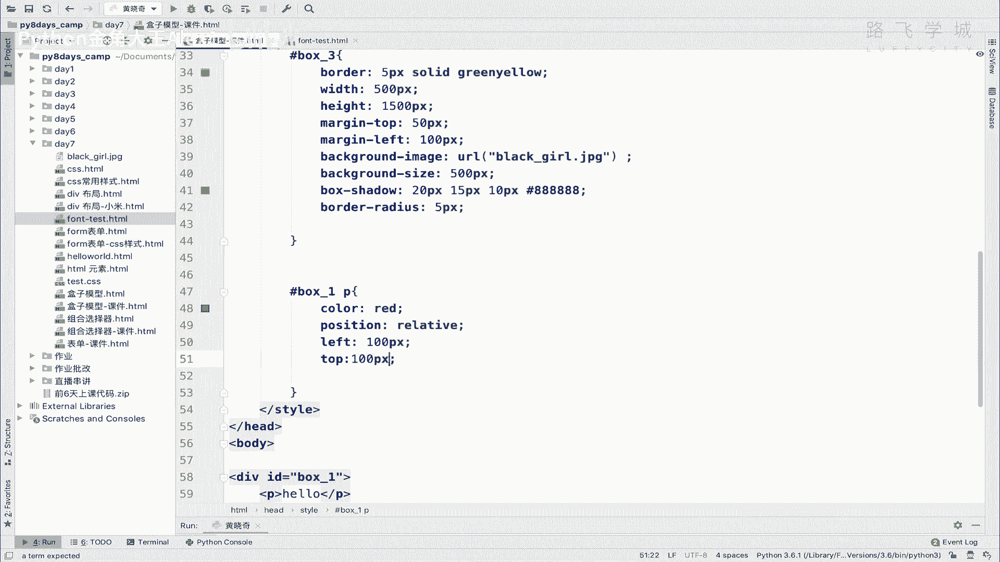

那它也是相对于当前的位置往下移，看到没有，从这个位置往下移一摆，从左边移到右，从上面移到下，OK这个就是相对定位啊。

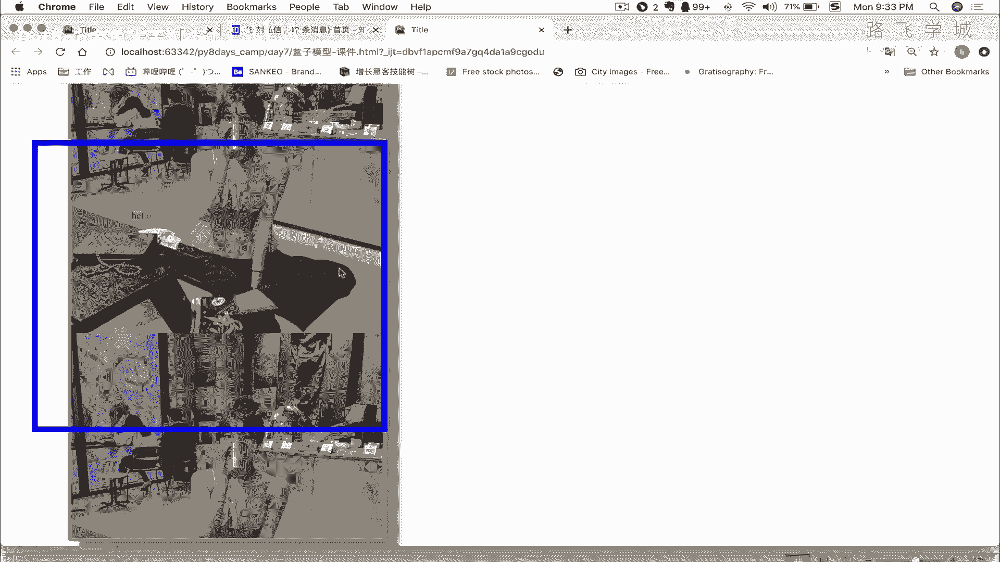

相对于自己原来的位置好，明白了这个之后我们再来最后看一个叫static，叫默认值，OK吧，默认值是什么意思，就是没有定位，也就是说你这个元素一赋值的时候，每个元素其实默认都有一个定位。

只不过是它说白了有一个默认值吗，你看不见，那这个默认值都是static，就是没有定位，那当你把这个position写成没有定位的时候啊，position的一个static的时候。

你的什么top bottom left，这些东西都没有效果，都不会生效，都会忽略掉，明白意思吧，好你这所以这个是static，下面这两个我们就不看了，用不到，然后还说了一句话。

absolute跟相relative有点像啊，比较像，但是我们不解释了，你如果真的有兴趣，你可以自己去查一下吧，百度搜一下absolute和relative的区别。

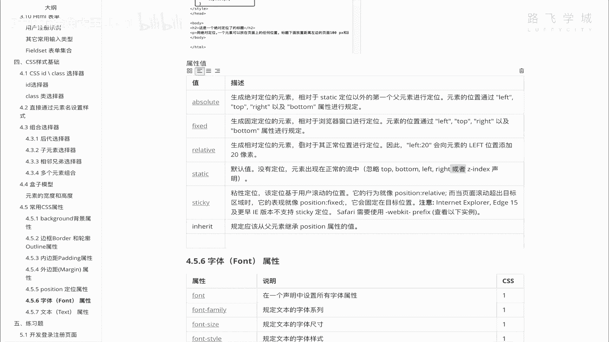

Anyway，那我们关于定位就讲到这里啊，这三个值你知道就足够了啊。

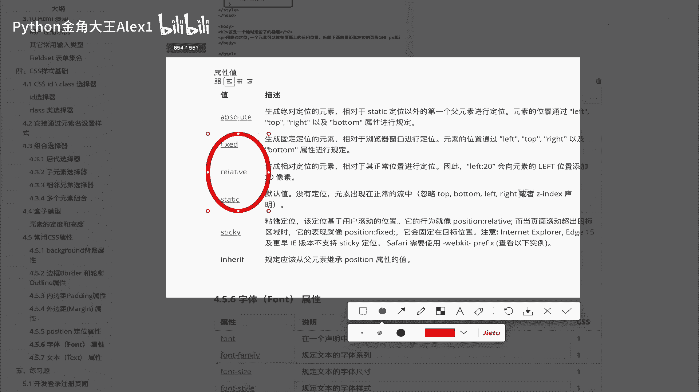

以后我们做这种网页的定位，对不对，包括像知乎上什么的，就各种网站上你就一看你就知道了，他为什么他为什么能浮在这里，就是因为哲学原因啊，就是因为定位的原因好吗，OK这个就是定位啊。

那接下来最后咱们再来顺带的啊，说一下这个啊字体和字体的属性，字体属性其实很简单，没有什么好说的了，就是color我们都用过了，对不对，还有这个啊什么呀，就是就是这这这一堆啊一堆。

这里有这个什么像像text decoration，我觉得它有一个好的一点，就是说大家可以一点，那啥一点就可以跳到他这个关嘛啊，网站里这里都有样式的示例，看到没有。

比如说这个给这个text decoration，就是装饰装饰什么呢，大家看点进去看到没有，他有这个实际的代码，你可以改对吧，比如说这个是OVERLINE，就是在上面加一横线，中间加一横线。

Line through，这是德拉，你的下面加一行线，你每一个这里的例子都可以直接点过去去试，明白这意思吗，改过去式，所以你自己去是就OK了，我就不在这里，这个text line这个也给大家看一下。

比如说咱们这个文本居中看啥，大家看你看，比如说你写一个作文的标题，是不是让它居中啊，居中怎么办，就是text line等一个center就可以了，OK吗，好自己，其他的有兴趣可以试一下。

All right，在接下来最后一哦，这是tap on，还有一个是字体啊，字体在这字体的话就是什么呀，你可以啊，font是一个综合性的数据，就是你font可以设置下面给这个font这个属性。

附下面任何一个属性啊，或者是你看这里有一个叫font family，就是干嘛呀，规定它的字体，然后大小，然后这个是其他的一些样式啊，这些还有一些其他什么粗啊什么的都可以，每一个你都可以点进去是好吗。

我们接下来直接这个呃，先去看一下怎么讲，看一下这个family吧，看一下family啊，然后他是用了一个什么字体叫times new roman，是不是啊，他这个就是呃我看一下啊，就是就是就是啊。

或者或者这样吧，我在这里直接给大家改一个字体好吗，改个字体all right，咱们在这里直接是，后来啊叫啊叫叫H3吧，我给H3设一个字体，然后我的字体叫font family等一个平方可以吗。

就是我的平方字体，然后我的font size，等一个30PX，OK这个时候我们来看一下，大家看看，这就是一个平方字体好吗，并且他的字明显就大了，OK还可以加什么斜体呃，叫什么来着。

font style是不是italic对，Funstyle sorry，Italic，这是斜体啊，看着看到没有，还会斜，Anyway，当然你还可以给它加颜色，总之这个就是字体的一些样式。

你可以自己来试一下，好吧，这个这么没什么逻辑性，自己调照这事就行了，OK这就到最后了，我们来啊给大家布置一个综合的小作业，这个作业就是什么呀，让大家开发一个啊，根据前面学的知识综合起来。

开发一个这样的页面，看到没有，这个页面你看是不是有文本的居中啊，有这个不同的div，对不对，然后还有图片摆在这，还有这个文字写啊，还有这个输入框啊，你当然不用真的获取验证码啊，这个这个你写静态的就行了。

你不不用让它能点，反正就是这些东西是吧，有表单，所以你就把前面的东西都啊练习啊，就是综合起来了，这个是早上应用啊，就能做出来的话，你基本上你今天东西就没有白学，ok good啊。

恭喜你坚持到最后倒数第二天，明天我们就可以学爬虫了，基于我们已经会的这些web开发知识，Good，今天必须把这搞定好了。

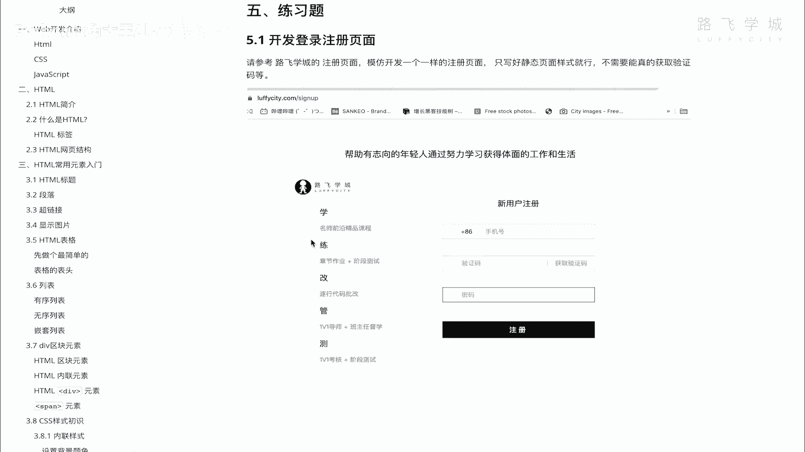