# 【2024年Python】8小时学会Excel数据分析、挖掘、清洗、可视化从入门到项目实战（完整版）学会可做项目 - P96：02 数据分析S03D01（下） - Python金角大王Alex1 - BV1gE421V7HF

发现北方的底妆卖得好啊，然后这个眼妆卖的差一些是吧，组间可以做这样一个总额的一个比较啊，这就是对滴这个啊堆积条形图的作用，另外呢还有这个百分比，堆积条形图什么意思啊，啊百分比嘛对吧。

就是我们可以看到我们，你像我们这个堆积条形图呢，它主要是这个就这个我们这个刻度啊，是以什么是一个数量为单位的，如果是这个百分比的话呢，我们这个刻度是什么，是以百分比为单位的啊，堆积条形图OK啊。

所以他怎么办怎么办呢，也是一样的啊，把这个选中，然后选择插入条形图，这是什么，就是百分比堆积条形图啊。

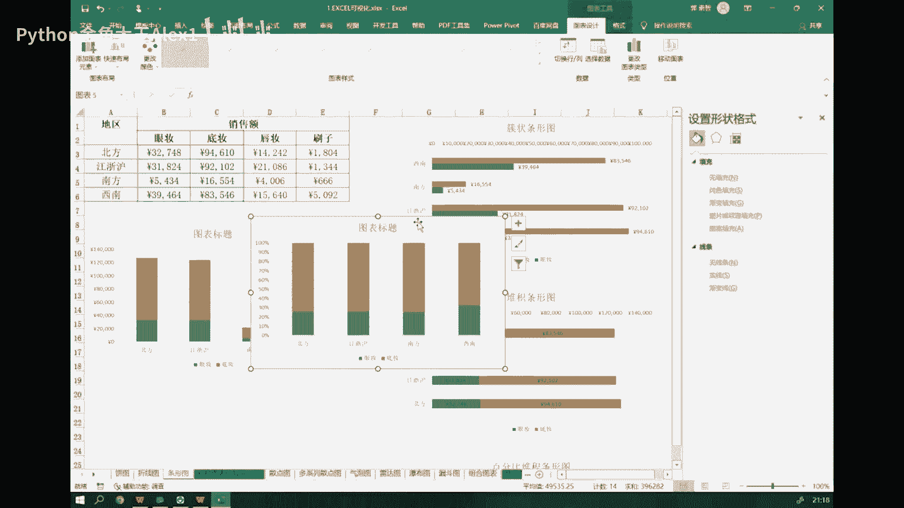

最上边什么呀都是百分之百啊，你看你会发现这个，其实这个逻辑是跟你那个线形图的，什么堆积线形线形图，还有你那个百分比的折线图，不都是一个道理对吧，因为它总体啊都是百分之百，然后那我们可以看到北方啊。

他这个底妆的百分比更高，但是呢组组与组之间的大小我就比较不了了啊，因为他看的是什么，是每一个组内的一个构成关系，OK啊好，那另外呢我们这边啊还要给大家说一下什么，就是关于这个坐标刻度的问题啊。

坐标系的问题，这个坐标系啊其实我们也是能调的，就是如果我们不去手动调的话，能默认它会给我们就是你的数值，比如说我们这个是百分比对接图的话，那么它其实给的就是百分比，这个你给的是一个正常的销量的。

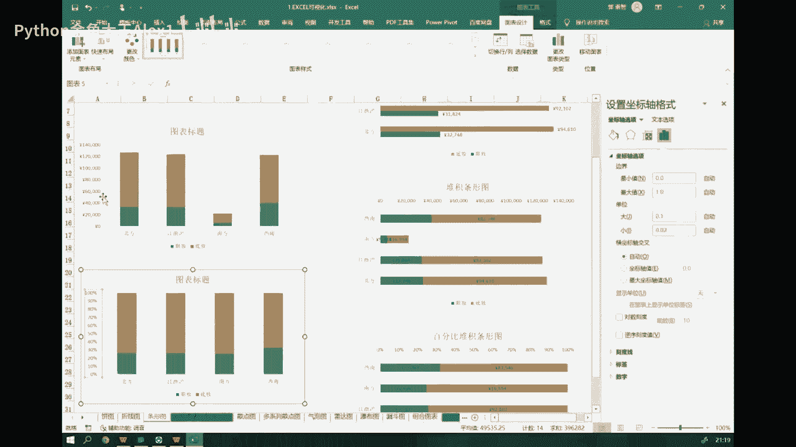

销量的一个图的话，那么我们这个坐标轴的刻度呢，就是以这个销量，就是以你数值的销量来给我去做一个，上下边界的一个界定的啊，比如它啊这个最多是一百二十十四万对吧，零到14万怎么来的，零到14万就是把北方啊。

就是把北方这个眼妆跟底妆加到一块啊，然后江浙沪加到一块，南方加到一块，西南加一块，最终我们得到了一个范围，这个范围就是我这个刻度的范围，这个范围我们可以手动调整，比如说我我现在呢想让它高一点。

我变成20万，是吧，也可以，我先下边界呢，我想调的第一点我给变成一个负的2000是吧，这都是可以调的啊，给它调回来，然后呢另外呢我们这个坐标轴啊，它其实也可以去做一个什么，做一个逆序是吧，倒着放啊。

往下放啊，然后另外呢还有什么还有个主次之分啊，主次之分这边我们演示一下，就是你可以同时呢再去添加一个这个次坐标，坐标系，什么时候会用这种情况呢，比如说我们想要展示的两组数据啊。

它们会有一个明显的量级上的差异啊，那这种情况的话，我们可以给它添加一个次坐标轴，好，我演示一下啊，怎么加这个次坐标轴呃，幺八，比如刷子吧，刷子这个它的这个单位明显要比眼妆要小很多，对吧好。

那我们先来去做一个簇状条形图，我把这个眼妆和这个刷子给它都选中，这个也选中好，我们先点一个插入，我们选择这个簇状条形图，好，现在能看到什么，我们现在能看到呢，就是我我们这个刷子啊，刷子这个东西啊。

哎呀这个北方怎么跑这来了，调一下啊，这画的不对，我们选这一列再选这一列啊，然后我们点击一个插入，然后选择一个簇状条形图好了，先是两列，对吧啊，其他先不改了，我们就先研究这个坐标轴的问题啊。

那我们现在明显这个刷子这个这个柱状图啊，它的高度很小，显得没有了对吧，可能可能有些情况比你这个还要极端，比如它可能是百万级别的，而他可能只是个位数级别的，那我们就没有办法在这个图里面看到。

我们第二这个刷子这组数据，它的一个大小关系了，对不对，那怎么办呢，哎那好我们就可以选中它，好我先选中这个刷子，这一组数据干嘛呢，我给你单独的去放一个新的坐标轴，在右侧看到了吗，在右侧啊。

这是不是有个次坐标轴吧，选中它看到了吧，然后这个重叠啊，重叠我们可以给他做一些调整，啊这我就不细调了，总之就是你你要调成什么样子，比如说我得让两边都能看得到对吧，两个柱都能看得到。

OK你看现在我们能看到什么对吧，我们能看到两个柱子啊，当然你可以把一个调成空心的啊，一个调成实心的也行啊，两个柱子，但是他们用的坐标系是不一样的，红色用的是右边这个坐标系，而蓝色呢用的是左边这个坐标系。

好像这个小功能啊，就是我们就可以做做一个比较高级的图像啊，做什么图像呢，做这种图像。

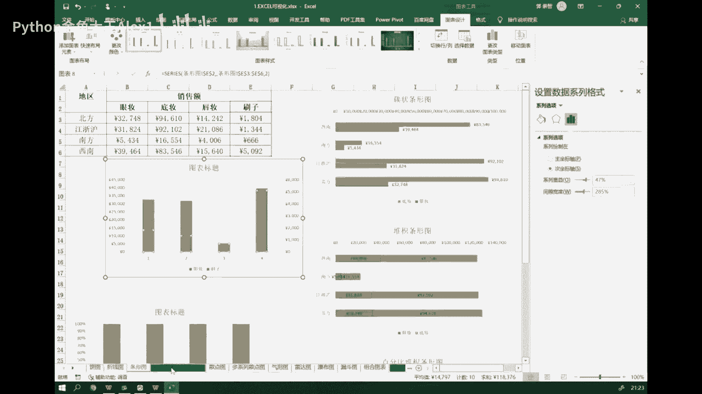

这种图像看看啊对吧，我们做两个对比啊，AB产品的一种对比，这种图是怎么画出来的呢。

啊我们来我我大致给大家演示一下，其实这个是想给大家留作业的啊，我我给大家先简单演示一下，然后你课下呢啊，课下的话你你就要别别去看啊，你回忆的去做，尝试着去搞啊，其实就几个核心啊。

我我首先把这两个产品呢给他选中啊，选中以后呢，我给你点击一个插入，然后选择一个这个条形图啊，这个得放横着的啊，不要这个插入，然后一个水平水平条形图，OK好了啊，现在你想啊，你现在想把其中的一组数据啊。

给它放到左侧，给它放到左侧怎么办呢，它如果它是不是一个一个量级很大呀，是也是一个零，大概是几几千的一个一个轴啊，所以如果它是对称的话，难道你保证我中间这个位置，它是两边都是这个对称的。

所以你想保证两边都是对称的话，那我就得保证我这个刻度两边对称的，所以首先我第一件事，我就先把我的刻度啊，啊把我这个横轴的刻度给它变成什么呢，给它变成坐标轴，我把它变成负的8000到正的8000。

看到了吧，就直接把我这个坐标轴啊，给它往左边放大一倍，唉放大一倍，然后现在干嘛呢，现在我再把其中一个啊，给它放到我的次坐标轴上去好，你放到次数次数标坐标轴的时候，你会发现有点小问题，为什么。

因为你现在上边这个刻度跟下边这个刻度，它不是对齐的，所以你要想保证他们两个图，红色的柱跟蓝色的柱，他们是处于一个一样的，一个量纲缩放级别之下呢，那我就得保证我这两个什么两个坐标轴啊，它们是完全一致的。

所以我现在需要怎么样呢，我把上边这个次坐标轴吧也做一些修改啊，也变成-8000到正8000，就跟下边保持一致，Ok，好啊，那然后呢，因为你你现在这个它是负数了，我现在还是在往往正方向展示。

所以我可以怎么样呢，我可以把上面这个轴啊，给他做一个逆序的处理啊，那我就选择上面这个轴干嘛呢，我把它做一个逆序，是不是转过来了对吧，转过来了，然后接下来就好办了，就剩什么剩我们这个X轴的这个刻度了。

我要把它放到左侧这个位置，而不是放到中间，那就调它的位置嘛对吧，那我选中它啊，我编辑谁，我就点谁选中它干嘛呢，找啊找他的这个位置跟位置有关的，看标签有位置对吧，标签位置在这儿呢，他先是放到轴旁了。

那好我们先给他改一下啊，我给它改成一个放到第一位，什么叫第一位，就是它会放到你主坐标轴的最小值的那方向啊，那么你下边是那个主轴嘛对吧，它放到主轴的最小值的方向放到左侧了好了，你这个图就做完了，对不对啊。

跟下面一样的啊，那其他的边边角角的设置是吧，我们怎么去加这个标签啊，还有比如说我们这里边的这个7000，这边也是7000，两边都是正数，那我这边这边是负的，这边是正的，这怎么调的啊，这怎么调的。

这个调你通用格式啊，通用格式咱们在录播课里面有啊，你去翻那个里面能找到答案好吧，算是给大家提的一个小小的一个作业，的一个小难度吧，啊大家可以去找怎么去把这个符号给它变没啊，怎么变美。

OK但你不能说把它变成8000到正8000，那这个就不合逻辑了对吧，我们现在只是展示啊，在展示形式上做一个变化，就像我们刚才说的那个1000啊，这个东西一样啊，就是我们看似它的展示形式是带个这个符号的。

但实际上呢单元格里面它只存了一个数字啊，这个是通过什么，通过这个通用格式就可以处理掉，OK啊好这个可能是你要面临的一个难度啊，唯一的一个难度，但是你可以在录播课里边的第二天啊，能找到答案。

OK啊我就不提示了好然后至于怎么对称，刚才我已经演示过了。

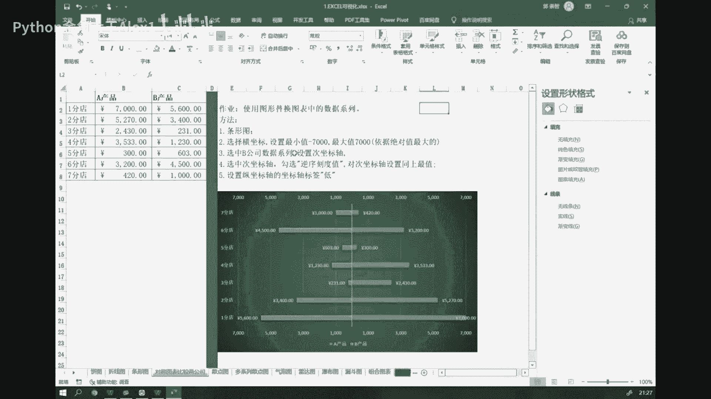

好接下来呢就是我们这个散点图啊。

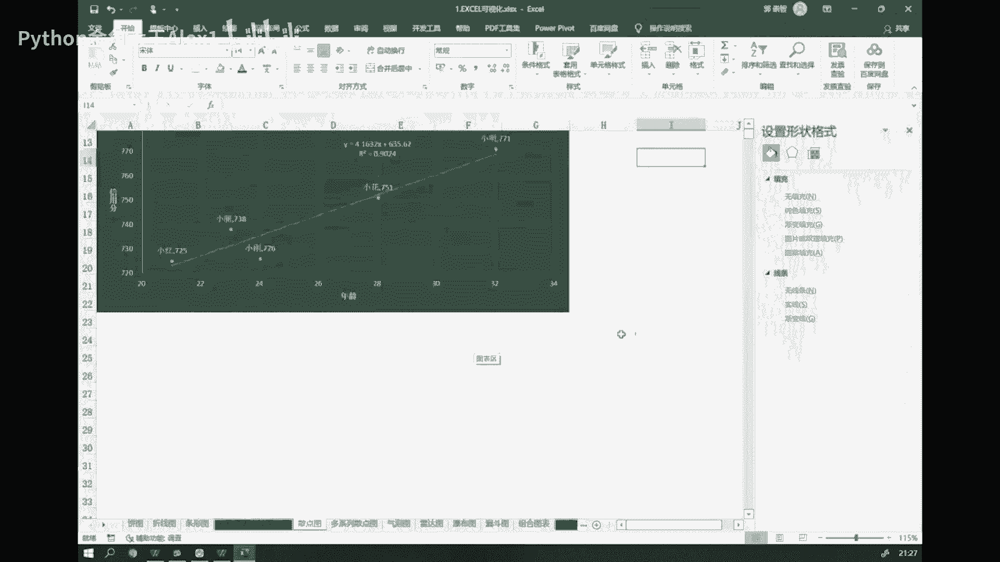

现在是09：30啊，我们休息5分钟，好吧啊，休息5分钟，我们回来继续啊，好大家等我5分钟，我上个厕所，好了回来了，同学们，来大家还在听课吗，还在听课的，我扣个一啊，时间挺晚了啊，能坚持到现在不错啊。

还挺敏儿好学的啊，OK啊咱们继续啊，啊接下来呢我说这个这个散点图。

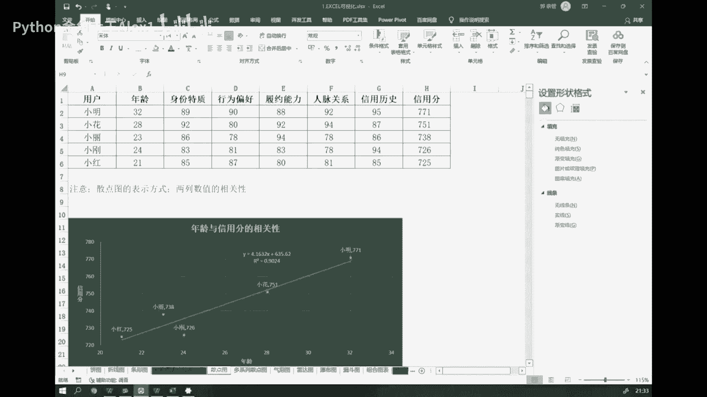

散点图呢啊那它呢是来表达关系的，这里边儿啊可能就要提升点难度了啊，大家有没有有没有做过这个事啊，就是你有没有做过趋势分析啊，同学们有没有做过趋势分析的。

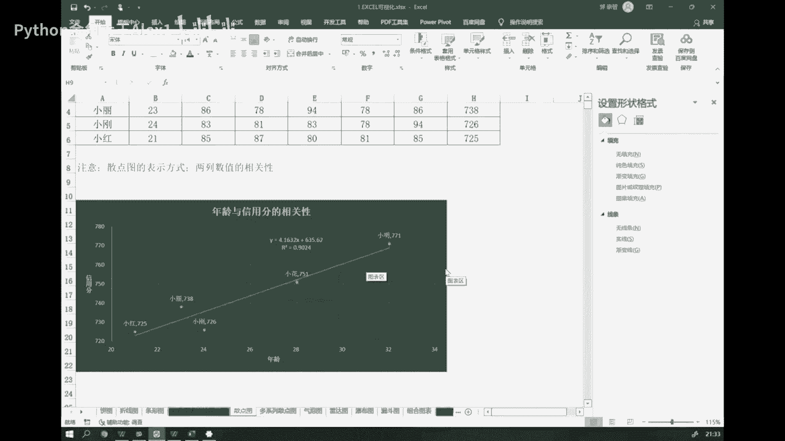

就是啊这个有的人啊，可能会教你这样去做趋势分析，比如说这个咱们这个图表里边有一个，有个这个功能啊，就是呃这个迷你图用过吧，有这样一个东西，迷你图嗯，这样啊，比如这儿啊，我们插一个迷你图。

然后进来我们选一个折线，然后这个数据范围呢我们选择它，好对吧，这样就得到了一条折线啊，然后那这个它是一个趋势分析吗，同学们是吗，显然这个不是啊，这个不叫趋势分析，什么叫趋势分析呀，你这个最多叫什么。

这个最多它只能叫做一个嗯，算是一个就是一个一个历史数据的一个，归纳总结而已啊，什么叫趋势分析。

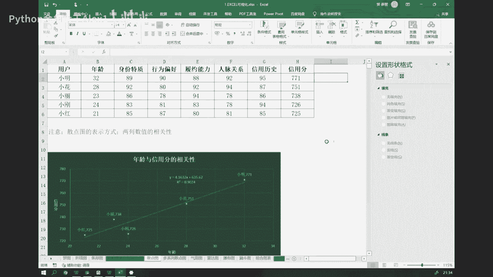

就是就是是这样的，比如说我我如果如果知道了啊，咱们以这个房价为例啊，比如说如果我我可以根据一些历史数据呢，我知道了，比如说一个100平米的房子，然后他卖200万，然后一个200平米的房子呢。

他卖这个这个405万，然后呢我可以得到两个点，然后再来一个吧，比如再来个150平的房子，然后我大概卖到310万，这有点OK，那现在呢如果我想知道，如果我现在想买一栋300平的房子。

我大概需要花多少钱呢是吧，所以说如果说我们只是在做这种折线图的，这种简单的关联啊，这个东西其实你很难去表达，我只能说它能表达一个趋势，但是我没有办法用它做趋势分析，为什么，因为我没有办法算出来。

300平的房子是多少钱啊，我不知道大家能不能get到这个点啊，就是我只能描述这种只能叫描述描述性统计，他没有办法去给出未来的一些预测，而你要想做趋势分析的话，那一定是要有预测能力的，那什么叫预测能力。

我们可以可以归纳出一条线来找到一条规律，就是大差不差，是这样子的啊，你有了这个规律啊，规律然后那么这条线才能帮你预测，为什么呢，因为如果你一旦得到了这条线，假设这条线啊，大概是这样画的。

然后呢这有一个点，这个点这个点这个点，这呢都是我们的历史数据啊，横轴是平米，然后纵轴呢是房价，是价格好，我们得到了这样一条线好了，那我问大家啊，我们我们上过初中都知道啊。

我们想表达一条直线的话是有一个公式啊，是不是可以用一个Y等于一个WX加上B啊，这个公式大家认识吧，认不认识啊，认识我扣个二，这边啊我们说X是自变量对吧，然后Y呢就是因变量，如果说我们找到了一条线。

这条线呢如果可以用这个公式来描述，当然这个W跟B我们现在可能不知道啊，我们假设知道啊，假设W和这个B啊，它是已知数，那我们知道W这就是斜率嘛是吧，W是我们这条线的斜率，而B呢就是我们这条线的截距项啊。

截距项呢就是我们这条线穿过了Y轴以后，然后他跟Y轴的交点的那个值嘛对吧，这是我们截距啊，有了斜率和截距以后呢，我们就可以描述一条，在二维空间当中的这样一条直线，好了有了这个直线的话呢。

我们就有预测能力了，为什么呢，因为现在我可以把300往里面一带，我就知道了，那我如果一个房子是300平米，根据我们的公式，我们可以得到一个结果，就是它的值应该是300W加上B，因为W和B是已知的。

所以我们这个Y呢就已知了，这才叫预测能力，是不是啊，这才叫预测能力，所以说你如果是说我只是做一个线形图的，这样的一个展示，这个其实不叫趋势分析，它只是一种归纳而已，那好了。

问题就在于我们怎么去把这条线画出来啊，怎么把这条线画出来，这是问题啊，其实这是什么呢啊，这已经是在搞数据挖掘的一个范畴了啊，挖掘的范畴好了，那你看挖掘到到底是什么东西啊，就是我们在我们在应用层面。

我们如何去利用现在的挖掘技术，来帮我们去解决，这种可以做这种前置的预测型的这种分析，而不是我们复盘式的那种归纳型的那种分析呢，对吧，因为你预测的话，我们可以提前把控过程，但是你可以去做复。

你可以去做调整对吧，我们可以减少损失，或者我们可以扩大利润，但是如果你说只是做复盘的话呢，那你你过往的这一期，或者你过往的这个历史的数据呢，它就已经是定型了，我已经没有办法去进行调整了。

所以为什么说现在大家都是在做这种，数据驱动型驱动化的这种转型啊，包括我们现在的这个互联网，它对于这个传统企业的这种技术上的加持，其实在数数据化啊，数字驱动这一个层面上啊，他是做到做了一个非常大的这样的。

一个推动作用，当然了，你想搞定这个事儿，它就需要很多的基建，比如说我们大数据基建啊，比如说你这个网络啊，网络硬件的一个普推广，然后包括我们人工智能算法的一个普及啊，它它真正能落地到我们这种。

民营的企业当中去啊，而不是那种高高在上的什么智能驾驶啊，人脸识别呀，神经网络那些东西啊，所以这个东西是我我们近些年来啊，在这个国内在做数字化转型，其实非常庞大的一个一个一个这样的一个群体。

不论从企业端还是从个人端啊，我们都是在搞这个，所以说你像近些年为什么也就是今年对吧，你你可能会参，咱们在座的同学，应该有好多参加过不止一个数分的营，对吧啊，那么本质上真的是去学一个excel。

就可以搞这个事吗，当然不是啊，所以说我们现在啊稍微扩展一点，让大家研究一下啊，就是到底数据分析师们在搞什么事情啊，其实在搞这种事情，这个事情你你你还真不一定说我非得懂算法，我非得非得是个硕士学历。

然后我非得是在一个什么高薪的，it企业当中才要干，实际上我们在形形色色的岗位当中啊，不论是大小规模的行业当中，我们都可以做这样一件事情啊，这个就要远远要比你做这种归纳，它要高端许多对吧，也亮眼许多。

而且你是有理论支撑的，好啊，我现在就告诉你用excel怎么去干这件事啊。

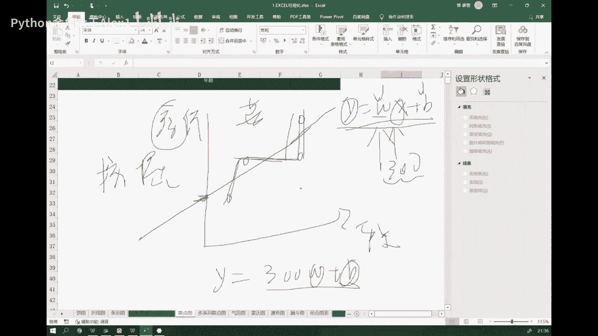

OK好，首先呢我们先从最基础的说起，就是我得先聊，先来能搞清楚我们数据的一个分布诶。

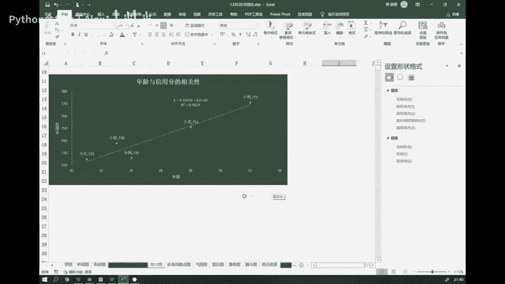

假设啊我们现在不是房价和平米的关系了，假设我们认为啊，一个人的信用评分和他的信用历史之间呢，是有一定的关联的啊，那比如说你现在想去做一个一个人的信用评，分的一个预估，或者说一个自动判定的话。

那么我们要去根据我们的用户的信用历史呢，来给出这样的一个结论，所以这两者之间呢是有关系的，关键是我要怎么去找到我的关系，哎我要怎么找到的关系，其实这类问题，我们可以扩展到很多的场景之下啊。

很多场景是这样，那比如说我们这个呃，就比如刚才的房价跟平米数的关系，或者比如说我们说你一个用户的一个消费，就是一单的一个消费的一个账单啊，一个账单和他的一个小费的一个水平对吧，一个消费的水平。

然后我们能不能做一些预测呢，啊那我们可比如说我们现在是做酒店的，OK我们就是卖服务的，我们服务就是高端啊，我们是个五星级酒店好，那我们现在可以去给他做一个硬性的一个，小费的规定。

我们可以根据过去的两年的历史数据，我们每一个高一个这样的一个，一个高端客户过来消费，然后他会给我们一些小费，我们可以去找出一个什么呢，一个用户能接受，而且我们的利润又用最大化的一个，小费的一个硬性标准。

比如说你来消费500块钱，Ok，那么你就应该支付我们，20块钱或者15块钱小费，但这个标准你怎么定，你总得有依托，你不能拍脑门直接给个结论，对不对，所以这种情况呢，我们也可以用这种方式来来做这种分析啊。

他用excel完全可以搞定，你不用去搞什么Python，搞什么人工智能不用啊，你你听了这个你就能搞了啊，怎么搞，OK以它为例啊，以这个信用历史的信用分为例好，我要先研究，因为我所有的这种推测。

一定是要基于历史的这个数据的真实情况对吧，我去进行一些科学的推导的，所以那你首先必须要有真实的历史数据作为依，据好了，这就是我的历史数据了，那么我先把这两个历史数据啊，做一个关系的这样的一种表述好了。

怎么表达这两组数据之间的关系呢。

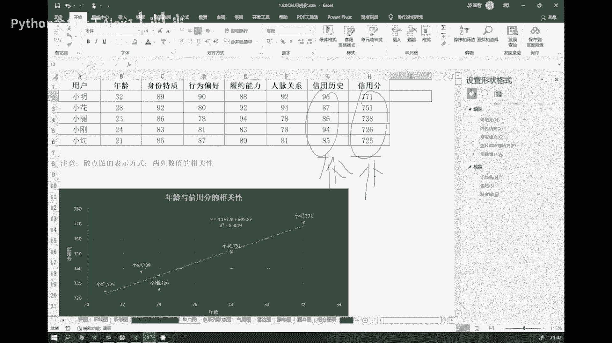

显然我们可以用散点图的方式来进行处理好啊。

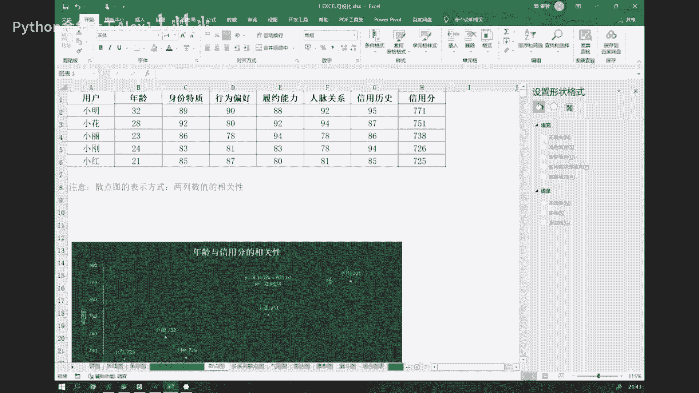

我把这个图给它丢一边去啊，那就删了吧。

那我先选择这两组数据啊，我们直接点击插入，然后呢选择这个散点图好了，现在呢我们可以看到这样的一个散点图，当然这个点的大小你可以再调整啊，比如说我们现在嫌它小，那我们去调这个标记嘛，对不对，标记。

然后他现在是什么呢，是这个啊，在标记选项里边它是个圆，然后这个大小我们选内置的圆，然后呢我们把这个大小调的大一点，啊大概这么大，OK然后颜色你不喜欢的话，我们换一个，比如我们换一个黑色的点好啊。

然后横轴和纵轴分别是啥呢，那我们先想显示横轴和纵轴的标签怎么办呢，点加号是吧，我们选择数据标签诶，不是这个啊，应该是选择我们这个坐标轴标题对吧，横轴和纵轴都给他选出来啊，然后横轴标题呢这个是什么。

显然是我们的啊，信用历史，然后上边Y轴标签呢显然是我们的信用分，好啊，那么现在呢，我们是画了一个比较简单的一个散点图，这个散点图啊，它表达的是我们信用历史和信用分，之间的关系啊，通常我们会读成啊信用分。

随着信用历史的一个变化啊，他俩之间的关系好，那么我们现在如果想去算出信用分，给我们一个信用历史，我们想算出一个信用分来，我们就需要找到一个能代表他们发展趋势的，或者说两组数据之间关联的这么一条线。

这条线呢其实并不一定非得是直线啊，当然当然了，我们更期望是直线，但有些时候呢可能我们这个表现规律是这样的，比如说随着我们这个消费越来越高，然后呢反而我们的小费会降低了啊，也可能会有这样一些曲线。

当然也可能是这样成长的曲线，也可能是更弯弯曲曲的一条曲线，不重要啊，不论哪种曲线，我们呢其实都是可以通过一些数学的这个，描述规律来去对他们进行展示的，比如说我我们这个Y等于WX加B。

那么这种情况就是显然就是什么一元一次函数，对吧啊，那么它其实就是一个一条直线，那如果你加上一个二元一次方程呢，比如说Y等于这个啊，W1X方加上W2X加上一个B，那么你这个曲就变成了一条曲线了对吧。

我们其实可以通过来变换我们的公式，然后来去拟合不同的事物规律啊，这个其实都一样，道理是一样的，O那我们现在就以最基本的这种直线的方式啊，我们就假设认为根据经验来看，我们认为信用历史肯定是越高啊。

他表现越好，然后我们的信用分肯定也是越高的，他俩一定是这种啊线性无限增长的，OK好，那么我们怎么去找这条线啊，那我就有一个问题了，比如说我我们现在可能会画出这么一条线，也可能会画出这么一条线。

比如这条线是A这条线是B好了，我现在想问大家，A跟B哪条线，它更能代表我们信用，历史和信用分之间的一个关联性啊，大家直观的感觉A跟B哪个更好一些，如果让你选，你会选A还是选B呢，大家可以给我一个答案。

123，好我们有两个同学选A了啊，还有吗，好像多数都是A是吧，好那好了，那么你可以你可以不用回答我啊，因为这个问题不好回答了，就是你可以自己去反思我为什么会选A，到底核心因素在哪儿啊。

啊我相信大家心里一定有这样一个声音，A离所有的点更近，是不是A这条线离所有的点更近一些，而B呢会远一些，唉其实本质就这个道理，所以说其实本质上呢我们想找到，因为我不论是A这条线还是B这条线。

他都可以认为是一个Y等于W，X加B的一个表示，只不过呢A这条线和B这条线，它们的W和B的值不一样而已，所以如果我想找到一条能够更加准确的去评估，我这个信用历史和信用分之间，关联的这样一个规律的话。

那么我我就这个问题就变成了，我如何去找到最优的W和B的问题对吧，那么怎么去平衡量我，我这个我我这条线是最合理的呢，怎么去衡量它呢，哎我们现在就有一个办法，什么办法呢。

啊这个办法我们假设这条线如果它是最优的啊，假设这条线我们可以用Y等于W，X加B来表示的话，如果这条线是最优的，那么一定是我这条线离所有的点的距离，最接近啊，最接近的话呢，怎么表示呢。

假设我们现在这个点啊，这个点它的横轴是94，那么我的我的纵轴是这个700，假设721啊，我就不对那个数了好这是我的真实情况对吧，那如果我把这个94作为一个自变量，X代入这个公式以后。

他得到的Y是不是应该在这条线上啊，这能理解吧，同学们，那么它也会有一个值，大概是751好，那么如果你把94带进去以后，我们会得到一个Y值，这个我们叫Y撇，然后我这个94真实对应的值呢，有也是721。

那么它叫Y好，这个Y跟Y撇之间是不是有这么大一个差异啊，有这么大的一个差距，对不对，这个差距，我们可以认为是我们这条线在这个样本点上的，一个什么呢，一个误差我们也可以把它叫做一个损失好。

那么你现在有几个点，有1234，有五个点，这五个点是不是都能算出来这样一个误差呀，比如说我们它叫德尔塔Y吧，德尔塔Y数据等于Y减去Y撇啊对吧，你有五个点，那我们有下角标YI，我们求个和对吧。

但是你这个差可能有的是有的是正的，就是负的，比如说这个点它的差是什么呢，是这个负的对吧，而这个差呢是正的，所以如果我们单纯的把所有的这些差，如果做内核的话呢，会有一个正负号抵消的问题，所以怎么办。

我们可以做一个平方，或者是做一个绝对值，来把我们这个损失啊给他表达清楚，同学们能跟上吗，到这儿能跟上吗，我们现在表达损失，为什么要表达损失，因为我们是要求损失最小的啊，我们要求损失最小的情况。

他这个时候对应的W和B的值是多少啊，损失最小意味着我们这条线它最好能理解吗，同学们，当然这样，你不理解也没关系啊，因为这块我讲的其实粗糙了一点，这些这个圈其实属于是数据挖掘的一个，线性回归算法啊。

为什么要讲他呢，因为这个excel就能做这件事啊，你不需要懂机器学习，你也能干这件事，OK啊我们现在啊现在啊这个公式可能有点绕啊，先不管它啊，就是我们现在在做什么，我们现在在做的事。

我现在这条线如果能够去表达，能更更加的去去适合来表达我趋势的话，那么一定是我这条线离所有点更近啊，那我就需要把它转换成一个数学问题，怎么转换成数学问题，就是我这条线如果离所有点更近。

那么一定是我这条线离所有点的，这个距离的和啊，这个距离的和总体来讲是最小的最小的好，那我现在问题是我怎么去表达这个差，就他们两个之间的差异，就是用这种方式来表达，那这个公式其实是什么呢。

就是我我的每一个每一个真实的Y值，减去我的预测的Y值W乘以X，再加上那个B这里边每一个X和这个Y呢，我都是用I来表示啊，比如说X1和Y1表达这个点X2，Y2是这个点X3Y3是这个点，这都是已知的对吧。

这些点都是已知的，我把它们都带进去，能求出来这样一个值，然后把每一个差呢都给它累合到一起，加到一起，我就得到了一个这样的一个东西啊，我为了抵消负号，我把它平方化了好，那这个问题呢就变成了。

我要求这个函数的什么呢，最小值，因为我我要让我的误差最小嘛对吧，我想求它的最小值，如果这个最小值能求出来的话，我觉得可以把这个W和B求出来，怎么求呢，要用到一个数学的方式啊，什么方式呢。

哈这里边就稍微有点难了，如果你不回忆那个大学数学的话，你可能会不知道怎么求啊，其实它是能求的，怎么求，因为整个这个函数里面有两个未知数，一个是W是B我想求它的解的话，就是要找到一个等式。

就是什么什么等式呢，因为你想求它的最小值，其实本质上就是求这个函数的最小值，这个函数是个平方函数，所以它的函数曲线是什么样的，是这样的一条线，它的最小值在哪，就在这个切线上。

这个位置就是我整个函数的最最低点啊，那么这个最低点我想求两个未知数，怎么求求偏导数，就把W和B都求出来了啊，也就是说你你你你忘了这个求法无所谓啊，但是我告诉你，你用高等数学的这种方式是能把它求出来的。

所以说他如果一旦求出来了以后，那么现在你这个公式变成什么了呢，就是你这个Y等于WX加B这个事啊，W跟B已经是已知的了，所以呢你就会得到这么一条趋势线，我们把它叫什么呢，叫回归曲线啊，虽然它是直线啊。

但是我们都是统一叫回归曲线，这是一个泛指，有了回归曲线，我们先不论你的信用评分是多少，比如说是97分，我们往里面一带，它就可以得到一个值，这个值可能不是特别准的，但它一定是我们最接近真实的那一个啊。

可能会有误差，但它一定是最接近真实的一个，所以他完全可以作为我们对未来的一些评，判标准啊，我们可以以它作为一个标准的去做一些，我们业务上的一些取舍啊，所以这就是为什么说现在搞数据分析的人。

他要懂一点算法啊，其实并不是说我要去明白，算法是如何一步步推导的，本质上是解决什么，是解决这个问题，我连如何利用一些现有的功能，现有的功能去帮我解解决我的预测问题啊，这个才是你我们说身为一个数据分析师。

他去搞的搞事情的啊，好那么这个功能我们在excel当中怎么做啊，看啊我们在这选择你这个图像啊，然后点加号，这里边就会有一个多的元素叫什么叫趋势线，看到了吗，趋势线看这是不是出了一条线呢。

这条线就是他帮我们算好的，这条线你改不了啊，你改不了，他帮你算好的，但你可以改什么呢，啊我把这个展开点，这个更多选项在这里边啊，我们可以看到啊，它有什么它有你看有这种弯的是吗，是指数的。

还有这种线性的直的，还有对数的这样的曲线，还有什么，还有多项式的这样弯曲的曲线，还有这个成立的，还有移动平均的对吧，这些其实都属于是回归算法当中的一些变化啊，一些变化，然后呢这里边我们还可以干嘛呢。

比如说我们还可以显示公式，看到了吧，显示公式有什么用，这个1。744不就是你的W吗，这个586。25不就是你的B吗，好了现在你有了这个东西，你可以干嘛，你可以给你个97，你就可以把Y值算出来。

给你个91，你也能把Y值算出来，给你个83，八十四都能算出来，对不对，所以你看虽然你不懂算法，但是你其实拿excel一样可以去跟别人秀一下，你说我现在再给你做一个趋势分析，什么叫趋势分析啊。

这叫线性回归啊，线性回归，但遗憾的是啊，遗憾的是，你现在只能做这种单因素的线性回归啊，你可以用它去研究两组变量之间的关系，但问题是如果你想去做这种多因素的，比如说用户流失了。

它并不是由于某一个行为导致它流失的，而是由由于多种不同的遭遇，导致它的一个一个流失的，那么这个问题就不再是一个Y等于W，X加B的问题，而是什么呢，是一个Y等于W1X1加上W2X2，加上W3X3。

加上加好多，然后加，最终加上一个B就说你有很多的X1X2X三，有很多的因素在影响着这一个结果，那我们要求的就是每一个因素对我们这个结果，所承担的一个权重，这个东西就可以简单写成一个向量的乘法。

一个W乘以X，这个才是真正我们的搞AI的，那个所谓的线性回归模型，他就厉害了，如果你在对这个Y再做一些映射，我们可以完全可以把它，比如说Y小于小于某一个阈值thread的时候呢。

它就是它就是一个流失用户，Y如果是大于某一个值的时候，它就是一个不流失用户，那么这种情况就映射成了一个叫二，就二分类问题，这就从回归又演化成了一个分类问题，所以这就是机器学习它所研究的东西啊。

他是帮你去做这种预测的啊，好这块扩展了一些啊，所以这是这个其实才是说现在搞数分的那拨人，他们能要到18K20K啊，甚至说30K就起步就能干到这个薪资的，它本质的意义并不是说他会做了个excel啊。

甚至说他会用到了什么power bi taber这种工具，然后呢，说背几个统计学指标就可以拿到这种高薪了，其实不是啊，其实这就是他技术给他带来的一个，真正的一个一个变化对吧，当然了。

你你可能如果不懂编码的话，可能我就只能局限在excel啊，或者说我局限在像SPSS啊，像这种MATLAB啊，这种现成的这种建模工具，但是呢你还是会被工具所限啊，真正说你达到一个更高层次的这种建模的话。

一定是要通过这种编码的方式，去解决这类这类的诉求啊，OK好，其实这个散点图散点图一般的话，如果说只是讲这个点的话，我觉得没有什么意思啊，没有什么意思，就是我还是希望说。

因为毕竟可能我跟其他的这种讲师不一样，就是在于我是我是搞挖掘的，所以说我还是希望通过这种统计工具上，我去让大家意识到啊，或者说不论是他对你有没有用吧，那就让你感受一下，真正我们在做这种所谓的可视化。

或者这种统计工作的时候，我们我们，我们我们可以往哪个方向去做一些提升是吧，而不是只是把视角集中在，我怎么去做一个sum函数的处理啊，我怎么去做一个饼图的绘制啊，这种很很低端的问题上啊，因为你做这种东西。

它它说白了只是一个最最基础的一项工作啊，一个一个随随便便一个，比如说我们刚毕业的一个一个一个大大学生啊，哪怕做个实习岗这种这种也是他能做得了的啊，所以说这种东西其实本质上啊，本质上其实是解决不了。

真正的我们我们的日常工作的问题，OK啊好，另外一个散点图，散点图有些变化啊，就是我因为正常来讲我的散点图呢，它表达就是XY的这两组数据的一个维度，那如果我们想表达第三维的话呢，就可以用这种气泡图啊。

气泡图，比如说我我们现在呢有XY两种数据啊，不管它是什么吧，然后呢我们又想表达第三维就是大小，那这种情况呢我们就可以用气泡图的大小，我们看我们不但可以表达横轴和纵轴，还可以用气泡图来表达它的一个大小啊。

那这个东西啊，比如说我们现在想展示这组数据好，那我们点击一个插入，然后选择这样一个气泡图，诶啊选择一个气泡图，然后这个图不太对啊，换一下先删掉啊，就如果你你通过这种便捷的勾选的方式，然后插入。

如果你发现有问题的话，那你就直接这么干啊，直接点插入，然后选择一个图像，我们后来我们去后边去配置这个数据啊，在这里边去配置数据，怎么配置呢，右键然后我们去什么选择数据对吧，你看这边这么多啊。

我把全删掉啊，全删了，OK我们先添加啊，添加我们系列名称，我们我们第一个系列就是什么，就是这个X啊，系列名称X啊，然后那系列的值呢就是我们X这个轴，OK然后Y轴呢Y系列的值就是这个Y，然后再把Y的值啊。

这个是Y啊，这什么，然后呢这个气泡大小我们点这个size好，那系列名称得变一个啊，比如我们就叫随便来一个吃饭吧啊，随便来一个，OK好，我们点击确定确定好是吧，现在就是你不但可以表达横轴和纵轴。

还能表达我们这个size，但其实我们这个气泡图啊，你还可以，你要你要真想表达，你还能表达到第四维，就像下面这样，我颜色也可以来区分类别对吧，就是比如说我这里边儿啊，我类别这一项你看有吃饭，有游戏。

有衣服，有娱乐对吧，我可以用颜色来标注他们啊，那这种图怎么做呢，这种图就得咱们就得自己做一些，小小技巧的调整了，因为它默认是不支持这种展示方式的，怎么做啊，给大家演示一下，就是我们一组一组的来。

比如说我可以把吃饭这是一部分啊，然后游戏这是一部分，然后衣服这是一部分蓝蓝色，然后这边这是一部分，好啊，你现在有这么四类数据对吧，吃饭游戏，衣服娱乐，OK好，我们现在一组一组来啊。

比如说我们现在还是我们先插入一个这个，气泡图，西巴图啊，然后还是把里面的数据给删掉啊，全删了啊，一组一组添加，我们先添加什么呢，系列名称，比如这个系列名称，我先添加示范这一组，然后呢我的X轴是这一组。

然后Y轴呢是这一组，然后这个size呢是这一组，OK好现在我就把什么，我把师范的给加进来了，然后呢再加啊再添加，然后系列名称游戏，然后X呢就是游戏对应的这一组X，然后这个Y呢就是游戏对应的Y。

然后气泡呢就是游戏对应的这个气泡啊，就到这，你看这样是不是就加进来了，你看蓝色的就是什么吃饭那一波，然后那这个红色呢就是游戏这一波，当然了，衣服和娱乐怎么加啊，这个就不解释了对吧，道理是一样的啊。

也是什么选择数据，这里面继续怎么样添加啊，就可以了，好啊，这就是我们用气泡图做第，四维数据的展示的时候，所以说你如果说我们在一个图里边，我们碰到三维甚至是四维的这种数据的情况啊。

你就会想到气泡图是可以帮你搞定这件事的，OK啊好，然后后边呢就是雷达图，瀑布图和漏斗图。

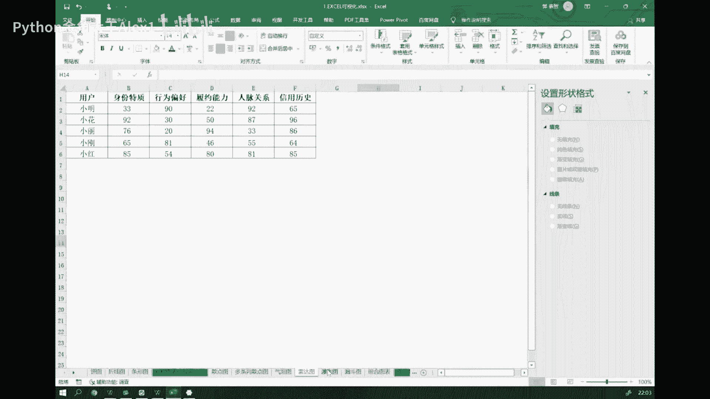

这几个图呢其实就是大同小异了啊，比如说我们这个雷达图吧。

那雷达图的话呢，它其实也无外乎就是我们表达一种这个，对比关系对吧，然后比如说我们现在有有这样一个情况啊，比如说这个呃，你可你可以把身份特质，行为偏好，履约能力，人脉关系，然后作为我们这个雷达图的五个角。

也可以把小明小花小丽小红小刚作为五个角啊，两种表达表达形式啊，比如说我们现在先画一个最简单的，就把这个把这个身份特质，每一个人的身份特质做一个雷达图展示好，那我们再插入，然后你在这看不到雷达图对吧。

那我们可以选择这个推荐的图表，然后这边呢我们可以在所有图表里面，找到我们这个雷达图，好，默认就给我们勾选上了，好直接确定就行了对吧，这样的话我们就出来了啊，就是在身份特质这一项上啊，小花小红得的分高啊。

然后小明很低，小刚跟小丽呢，其次是吧好那同样道理，如果我想表达一个人的什么身份特质，行为偏好，履约能力这些属性怎么办呢，把它们选中啊，把这些选中，然后也是点插入推荐的图表，然后我们选择所有图表。

然后选择我们这个雷达图，确定看两两个表的区别在于什么，就是你这五个角上的一个什么啊，这个类别不一样对吧，类别变样啊，OK好了，那么你有了这两个基础的之后呢，那我们就可以继续往里加了，比如说以这个为例吧。

现在呢我们能看到小明的展现形式是这样子的，如果我们想想看小明和小花之间的，这个各种这些属性的一些对比，怎么办呢，那我们黑树可以点击右键，然后选择数据，怎么样往里面添加系列呀。

因为你这个系数就是系列啊对吧，好添加系列，把谁选进来，把小花选进来，然后呢值呢就是小花对应的这五个值，OK点击确定确定是吧，小花就进来了啊，小花进来，现在你看不到小花跟小小明了对吧。

因为缺什么不缺图例了，所以在右边加号，把这个图例选中，OK好图例的位置调一下，我们调到啊底部好，那可以继续加吧，把小丽也加进来，怎么办呢，右键选择数据，那添加系列，然后系列名称小丽。

然后我们这个系列值把小力拖拽到最后回来，确定是吧，加进来了，然后呢颜色稍微处理一下啊，颜色做一些变化啊，然后样式做一些简单调整，OK啊这图就完事了，好那现在如果你想把这个什么。

你想把小明小花小丽放到这个角上，然后身份特质这些词放在里边怎么办呢是吧，那你可以做什么选择，数据做一个行列交换就行了啊，变成一个三角形，OK啊好，然后瀑布土这个瀑布图啊，它其实是一个这个图，注意啊。

这个图咱们那个WPS就没有了啊，这个是咱们excel才专有的啊，它它是表达什么呢，它其实除它一直到最上面这个位置啊，就是这条线到这什么说是百分之百了啊，但是这里边咱们这个案例啊。

这个东西用的稍微有点不太好啊，我一直没调，它其实正常来讲应该是我们横轴啊，它也是跟七，就是跟时间有关的啊，就第一期，第二期，第三期，第四期一到第12期哎，比如全年对吧。

我们到年底一共啊我们销售额是百分之百，那我们可以看到每一期的销售额的一个，贡献的一个占比啊，占比以及和他这一期贡献的一个高，我们可以很明显的看出来哪一个月对吧，他贡献的多是吧，哪几个月发展的快等等。

这些信息啊，都是通过这样一个图来表示的啊，当然它也可能会出现这种就是往下跑，然后再上去，那往下跑的话就会出现这种负负的啊，OK好它呢，就是你我们在这个excel当中是可以直接插入的啊，我们这选中它。

把这个选中，然后直接插入，我们选择这个瀑布图，看到了吧，直接就可以插入了，所以如果如果大家有这样的诉求，比如说我们是连续多少期，然后每一期的一个占比啊，那么你可以尝试用瀑布图来表示啊。

因为你用别的图的话，你可能也就是柱状图或者是堆叠图对吧，可能都不太好看啊，用这个图又高端对吧，别人用的就少啊，上镜率又低，所以你用它比较炫啊，然后另外一种的漏斗图，漏斗图就很帅了是吧。

这个漏斗图啊也是excel给你提供的，也算是一个小福利啊，什么时候你用漏斗图，就是你去描述一个完整的事件的时候啊，比如说最典型的就是咱们在那个互联网的那些，移动端产品上啊，网站的那种产品上。

它往往都会有这样一些行为漏斗啊，我们叫用户的行为漏斗，这个漏斗其实有很很多范畴啊，你往大了往大了放的。

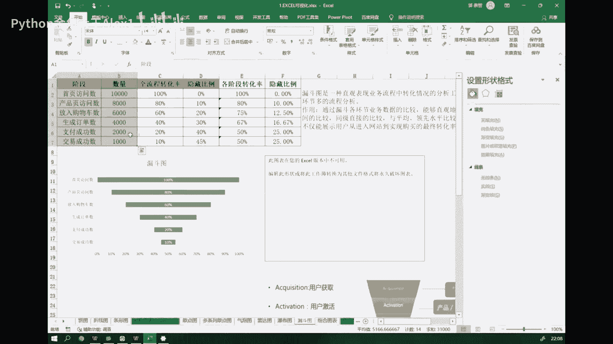

还有一个还有一个这个模型，叫什么叫AARRR模型，它也是就是网站获客啊，一直到裂变整个的一个运营总体模型，它其实本质也是一个漏斗模型啊，那比如说我们用户的一个行为漏斗，它也是一个漏斗模型。

简而言之呢就是你你所有的事件，就是咱们互联网上有一个词啊，就大家都会会会认为这是一个装逼的词，叫什么叫颗粒度，但是我也很反感这种词啊，颗粒度尤其是大厂阿里腾讯百度这种字节对吧，他们经常会讲颗粒度。

大家知道什么叫颗粒度吧是吧，颗粒度啊，听过吧，应该什么叫颗粒度呢，其实就是把你的一个任务啊，一个任务或者你驱动的一条业务线，你要把它怎么样呢，把它给它做到一个环节清晰啊，越清晰越好，越清晰越好。

为什么呢，因为越清晰你的流程流程化就做的越标准，你就越可控啊，所以他们会强调这种所谓的颗粒度的问题啊，那么其实本质上呢，你颗粒度其实还是一个数字化的一个过程啊，因为如果你没有数据支撑的话，你怎么控呢。

对吧，你说我们这工作做得好，什么叫好啊对吧，什么叫好啊，这本质是一个什么你量化思维的问题，比如说小明这个人很好，好在哪啊，为什么好啊对吧，再比如说小明啊，说说爱一个人需要理由吗，怎么叫什么叫理由啊对吧。

这个理由怎么去界定呢，对不对，就这这些问题，其实如果你有量化，你有统计，你就如果你泡在数据分析师，这样一个工作环境当中呢，很多这种问题啊，你就会变得更加的怎么讲，叫现实了吧啊就现实了吧啊。

我们是我们形容这个爱情是吧，爱情太现实了，你会有这样一种感受，就是你你所有的问题你不再去主观评判，因为你知道主观并不客观啊，就是主观并不一定好使，你比如说老板问你小明这个人好吗，你说挺好的啊。

然后老板心里觉得这人不好，他的理由是这个这个人迟到了三次，上个月竟然对吧，然后你的理由是，这个人上个月居然居然才才，怎么样才迟到了三次，我都迟到了七次，所以你们两个人的评判标准是不一样的。

即便数据是一样的，但是呢你们得到的结论是不一样的对吧，所以说好还是不好，这种它是主观臆断啊，而只有数据可以说明事实对吧，它也不含主观色彩，你跟老板讲说，小明这个人上上个月迟到了三次。

但是他上个月的这个OKR完成的很好，他完成了120%对吧，那么那你不用说好，也不用说不好，老板自然会有一个评判标准，所以本质上，这些东西都是你要通过一些数据化的思维，去管控的。

包括现在很多我们去做业务也是一样的，你在公司做工作，你有没有想过，你为什么有的时候我们去汇报工作也好，或者说甚至说我们跟跟我们的父母，跟我们的女朋友，跟我们的家人，跟我们的兄弟去解释一些事情的时候。

我们会得到一些误解，为什么呢，因为我们阐述的事实呢，它是无法量化的啊，无法量化的，那又由于每一个人的这个评判标准不一样，它会产生一些落差啊，就会产生一些误解，就是这个问题啊。

所以说那我们在企业企业管理当中更是这样，我们我们10年前就在讲，说所谓的什么精细化管理对吧，精细化什么叫精细化管理，我们那会儿讲说联想的办公桌，每次开会啊，杯子斜着看，竖着看，横着看是一条线。

我们那会儿讲精细化管理，已经是是那样的一种维度，但是现在你讲精细化管理的是什么，就是数字化管理，本质上就是这个啊，因为你现在硬件还有这种软件行业啊，这种还有包括数据化的这些基建，它都已经储备到位置了啊。

所以说我们是可以做这样事情的啊，啊所以说那我我们其实如果你你可以设想，就是在你日常的工作当中，或者说你在一些社团活动当中啊，你你有没有一些场景是可以这样去颗粒化的啊，那如果你能够颗粒化的话。

那我其实就可以去对我的过程去进行监控的啊，那关键是你要有这个模型，那而关键是什么呢，是你你在这个行业上，是这个业务线上，你是有一定认知的，你可以把很多核心的环节给它抽象出来，你知道这个在这个环节上。

这个指标就是我的最关键的指标，比如说我做一个网站，那么前三个月我最关键的指标就是获客，然后三个月以后我可能关注的是留存啊，这几个月以后，我可能关注的是是这个忠实用户的付费转化，再过几个月。

我可能关注的是我的老粉丝的一个转发啊，转发裂变对吧，你比如像现在字节一样，那字节你将它从1817，1819这几年其实在做什么，他在一直在做增啊，在做在这个用户的新增，它关注的是增量市场啊，关注的增量。

但这几年呢他知道增量跑不动了啊，一一个这一天日活四五个亿的，一个一个大庞然大物对吧，他他已经增不上去了，怎么办，这时候别让我就不跑了，别跑怎么办，做留存是吧，所以不同时期。

我们关注的核心KPL是不一样的啊，那本质上这些东西，我们都是应该通过数字化的方式，去对它进行处理啊，去才能监控得到啊，因为你这种东西，你你靠经验或者或者靠拍脑门的话，其其实是完全没有任何的决策意义的啊。

所以说像这种环节上，那我们的漏斗图它的威力啊就显示出来了啊，所以说如果我们是做一些在普通的一些工作呃，企业当中可能没有很庞大的这种数据体系的，公司的话，诶那大家不妨试一试，是不是可以看看看看看。

能不能在某些工作的环节上，我们去做，有意的去往这上面去靠一下对吧，然后在公司我们也去晾一把啊，晾一把对吧，至少可以可以碾压一些，那些整日混吃等死的一些同事们，对不对啊，可以去惹眼一把啊。

当然如果说单纯从画图，我的逻辑上讲，其实没什么好说的了啊，因为就是一个插入就完事了啊，所以我讲这些东西的话呢，是希望大家能够真正在工作当中啊，能够去用到一些数分的这样一些理论体系，然后能帮助你啊。

不论是站得更稳也好，我希望希望你们能够在一些理念上啊，甚至说在一些啊方法上啊，有有一些新的一些感知的啊，哪怕说你你不会，但是你知道这个方向上我是可以做一些努力的，哪怕我百度一下或者怎么样是吧。

我们是可以做一些这样的调整，而不再是局限在过去的那种，说我我就是领导让我去做一个什么图，我就给你做出来哦，我的想法就是做好看一点对吧，配色再调一调啊，大小粗细再搞一搞，这种东西不需要花时间的啊。

就就一个WPS会员给你给你弄得明白的啊，其实没必要啊，反而是你应该在这些问题上啊，去动一些小心机啊，才对咱们来讲是有一些好处的，OK啊，比如这里面它是一个典型的，就是一个网站的一个付费逻辑。

你看它就很抽象的很清晰，首页访问，其次是详情页，其实是购物加购，然后生成订单，支付成功，交易成功，就基本上你任何一个平台上，我想去完成一次交易，就是靠这些，没别的，再比如说网站的一个运营上对吧。

就是先获客，然后激活，然后留存变现传播，就这点事，那么你在其他的场景下，你能把它做到这么严谨的一个，并且能能量化的这样一个环节的一个转化嘛，对吧，如果你能转化成这样子，你的报告一定是出奇的精彩的。

你哪怕你的图做的很丑都不重要啊，因为这种东西是真正在互联网圈混的人，他才知道的一些逻辑对吧，如果是在一些传统企业，或者说我们从事的是一些相对来讲，更基础的岗位的话啊，可能我们即便是我们我们听过。

也很难会有真正的一些用武之地啊，OK啊，所以说这个这个是希望大家能够啊，能够去好好研究的一个东西啊，就是基于这个图我们去延展出的一些思想啊，比如说我在我在问，就是大家愿意听这个话题吗，如果愿意听的话。

我可以再给你说一个小例子，大家如果想听的话，给我扣个一，因为时间挺晚的啊，我怕大家想睡觉了，嗯嗯好，OK啊好，那我就那我就说几句啊，说几句啊，就是我问问大家一个问题，你知道你知道这个嗯，阿里啊。

不是别说阿里啊，百事可乐和这个脉动谁的品牌价值更高，同学们，这个问题能搞定吗，或者说你有答案吗，可口可乐跟百事对，可口可乐跟脉动两个品牌谁的价值更高啊，可口可乐是100，那个脉动是二，谁更高呢。

品牌价值，但是在思考还是没有答案的，或者你想不清楚的给我扣个三也行啊，大家得动啊，你不动的话，我不知道，我不知道你们有没有在跟我互动啊，你要想不清楚，那你就给个三啊，好我看到了我看到答案啊哈哈。

事出反反常必有妖啊，你这个跟都选C这个逻辑是一样的，OK啊好啊，其实大家给的答案差不多，肯定是百事嘛，肯定是可可口可乐嘛对吧，但是问题就在于我们都知道它的品牌价值高，但是你怎么去评估它高多少对吧。

高多少是高50%还是高70%，还是高20%，你如果能把这个量化出来，那么你就有商业价值了，如果你量化不出来，没有任何意义，明白吧，很多很多时候，其实我们有就是有一些假的互联网思维。

就是比如说哪个哪个哥们儿，他曾经讲说我我当年就想过那个点子啊，我当时我当时要做的话，我就起来了，比如像抖音那个那个平台，我当时就想做了对吧，那我就没做，我要做的话肯定起来了。

很多人会有这样的一些马后炮啊，其实这个本质是什么呢，是它是没有这样一种，就是真正行动起来的这样一个过程的，所以说就是说这种说这种结论很容易，但是你要想真的把它能够科学地证明出来，这就很难好。

那我告诉大家这个事谁能证明啊，谁能证明阿里阿里它就能证明啊，阿里就能证明阿里是怎么证明的啊，大家说一说啊，你就知道这个现在的数据分析，就是这个现在大厂他们怎么去干干活的啊，鼠标怎么没了。

就是就是这个首先啊首先你你一个品牌价值，我其实无外乎就可以概括这么几点，我见过的，听过的，了解过的，购买过的，多次买的，然后推荐的大家想想是不是这点事，对不对，如果你能把这些环节都能够捕捉到。

那你就厉害了是吧，但问题是你怎么知道我见没见过，你怎么知道我买没买过，你怎么知道我买了几次对吧，这个问题就很难了啊，比如说我们以往的这种，比如说这个像光我们我们那个比如开车啊，你你走高速。

那么我们会看到很多在路边放那种大牌子对吧，那是一种广告啊，那种广告它能锁定一个用户看过你吗，你锁定不了啊，包括你在网页上去投放一个，比如说banner那种year啊，那种banner页的那种广告。

你能不能锁定一个用户，他们有没有看过你那个东西是能锁定的，这就是互联网产品，跟我们传统的企业的那种推广方式，它们它们的变化，因为所有互联网产品，它都是有数据在后台进行管理的，就是我们现在啊。

比如说你现在去随便上网打开一个网页，OK你你已经做了一次PV了，然后你关掉再进一次，又来一个PV，比如说我们直播间，现在我们可以看到直播间在线人数多少对吧，那边是什么352，那个叫什么，那叫PV啊。

PV但实际上我们在线学院多少个对吧，是49个啊，所以这个叫UV啊，就是你进一次出一次，进一次出一次就会进一个PV啊，这种都属于统计，就是这只是一个很很浅层，很简单的一种统计。

这种这种统计十几年20年前我们就在统计了，但是现在其实会有越来越多的，我们的复杂行为都会被统计统计下来，这个呢我们在数据分析这里边，我们叫什么叫买点，叫前端买点，什么叫买点，就是你用户不论是点击界面。

甚至说你浏览时长，你去跟客服的聊天和你的购买记录，你跟客服的纠纷，然后你退货历史，你的收货地址等等等等，一切信息，你只要点过摸过划过碰过看过，浏览过所有信息都可以记录下来啊，但是这个事儿。

你说我想评评评价一个品牌价值的话，你说我就是一个做美团的，比如美团就是我的，你能不能评估出来，其实不好评估，为什么，因为我用户不可能随时都在你美团上，我在你美团上的时间是有限的啊。

但是我用户一天24小时的时间是固定的，说白了我一天能上网的时间，比如说就是十个小时好了，这十个小时我可能是在微信上，可能是在抖音上，可能是在啊这个淘宝上，可能是在B站上等等等等啊。

当然也可能在路飞的官网上有很多种可能，但是你你就这么点时间，你一定是被这些个平台，衣食住行等等等等，各个方面都把你的时间牢牢地控住了，OK那你知道阿里现在有多少家吗，子公司嘛，多少家这种控股公司嘛。

对多少家并购的收购的公司嘛对吧，可以说在阿里生态下啊，在阿里生态下，所有的衣食住行方方面面，他都有那种独角兽，独角兽型的产品，也就是说阿里想了解我们的一切，都是有可能的，能理解吧，虽然说也会有一些纰漏。

但是他已经最大限度的能做到什么呢，做到一个产品，哪些用户在哪里看见过，在哪里买过，在哪里推荐过等等等等，一切的东西，他想追踪他都是可以拿得到的，这个东西你说我是路飞的一家什么。

我比如我们路飞是一家什么机构，我想干这事儿能干干不了，因为你没有那么大的一个平台，你包括像我们比比较熟知的一些大厂，他可能也做不到，因为他的生态没有那么完整，所以我的数据获取就没那么完整啊。

所以阿里呢它是具备这样一个先天因素的，这是什么因素，就是我前端数据采集的一个什么呢，这样一个基础可以认为是一个基础，所以你看阿里真正的布局在这，所以马云跟你讲说，我们未来阿里巴巴的这个核心竞争力。

就是用户的信息，为什么他讲的可不是说淘宝那点信息，他讲的是他整个生态之下，你买衣服对吧，你你买你送快递，然后你去导航旅游是吧，学习等等等等，一切的一切，阿里都是能控制住的，他都能看得到。

所以这才是信息啊，可不是淘宝天猫那点信息，那点就是啊九牛一毛的信息对吧，所以在这样的一个大背景之下，他才能够去看到这些东西，所以阿里才有非常著名的，一这么几个营销模型啊，一个是什么呢。

一个就是FAST模型，一个就是AIPL模型，一个呢就是grow模型，那么一个是研究什么呢，一个就是研究我用户群的，就是我玩品牌价值的，一个是玩用户增长的，一个就是玩什么品牌潜力的啊，你看所以这种模型。

你你虽然说你也你也可以通过看一些文章，能看明白他们是怎么搞的，但是这个事儿你想搞你就搞不了，为什么很多传统企业想搞也搞不了，为什么，因为传统企业还卡在我连前期的数据的处理上，采集上都是磕磕绊绊的。

比如说我们现在很多问题，老板问你为什么上个月销量下滑了，你给我个找个理由啊，可能你是干财务或干销售的，我们我们没有办法给理由，为什么，因为我们的理由都是依据经验给出的，一些主观判断。

但是老板呢他会这么问对吧，首先老板可能没有这种数据思维对吧，再一个可能他在日常的这种管理习惯当中，也是习惯了这种主观化的，根据自己的一些历史经验来做判断啊，当然了，不是说这种大佬们的历史经验不好啊。

问题是他缺了一个非常有力的工具，就是这个数据很多很多问题我们无法去进行，最终啊，甚至说我们做了很多次复盘，依然没有得到一个很有效的起色，其实本质上是什么，就是我们没有这样的一个量化的过程。

这个量化过程不是说我们没有这个思想，很可能是因为我们没有这样的条件，很可能是我们在采集数据上是有很多难度的啊，也有可能是我们在数据的对接过程当中，产生了很多的脏乱差的这种复杂的处理，清洗的。

就这个问题我们我们hold不住，比如说给你一堆发票，100张发票，OK都是照片的，我们光去干这个活儿，可能三天就进去了对吧，而事实上呢在一个互联网公司，可能就是20分钟的事儿，甚至说10分钟的事儿。

甚至说一分钟一个代码就搞定的事儿对吧，所以说我们就难免我们这些传统企业，他们在盈利的这种效率上，其实很多时候并不是业务上的问题，真的是我们的形态的问题啊，所以现在为什么很多公司在做这种数字化转型。

你包括移动对吧，移动联通石油石化对吧，不都在陆续的出自己的线上产品嘛对吧，其实本质都是这些问题，OK啊好啊，所以像这种AAR模型，它一定是出现在互联网时代的，没有互联网依托的话，不可能出现这种。

包括现在还有很多的什么4P营销理论啊，还有什么4C啊，还有还有我们传统的什么5W2H这东西，他们都已经不再是传统的那些老观念了啊，他们其实本质都是什么都是数据，所以你像现在那种做产品经理的啊。

做运营的对吧，做那种高级的财务管理的啊，还有做那种产品，做产品出产品的，还有做那种那个嗯做做运维的啊，做运维的，甚至说测试的这些人对吧，基本上还甚至说人事啊，就大厂的那种人。

比如你像那个你像那个美团对吧，他们怎么去管理那么多的外卖小哥对吧，怎么去控啊对吧，其实这些你会发现这种现在这种所谓的，高端一点的这种职位啊，他们基本上都是要去利用这样一些数据的一些，清洗呀分析呀。

然后量化呀这样一些方式，借助我们这种互联网的行业经验啊，去去解决这类问题，所以说你像现在这种什么产品指标，像以前你比如说你倒推5年吧，5年以前，其实连这种产品指标都是产品经理的事。

而且还得是那种好的产品经理，不是说那种只会画原型图啊，对这个需求这种人啊，但你现在你在看的话，基本上各行各业的这种高端岗位，都是要在在搞这种数据思维啊，你像现在一般大佬，就是就是现在那个办公室啊。

尤其是高管层啊，就像我们这个嗯，像你像我们公司啊，基本上高管就是人手必备的两本书，一本就是增长黑客，一本就是精益数据分析，就这个AARR模型，它就是增长黑客里边提出来的啊，数据清洗就是我给你举个例子。

就比如说你你现在数据是什么样子的呢，就是你比如你首先你量级肯定是很大的那种啊，肯定很大，比如你335百条这种，或者说几千条，这个这个他达不到清洗那个那个概念，就是它的清洗就是很low的。

我正常人就是可以通过首条就可以搞定的，他我的时间成本我是能cover住的啊，真正的清洗是什么，比如说我拿的数据，这这里边它有异常的，你怎么能快速的把它找出来，而不是塞，因为你可能几10万。

甚至甚至说几千万上亿几个亿条数据，你不可能说我去手动肉眼去看对吧，这是一个问题，还有我这个类型，比如说突然某一条数据是错误的，你怎么给他找出来，还有我类型去做转换，你怎么找出来。

还有我我要做一些特征延展，比如说我现在现在有有一些，比如说这个什么呢啊，比如BMI这个指标啊，就是身高体重的一个占比啊，就这个指标我需要快速的把它运算出来对吧，那再比如说我数据之间。

它们之间是有什么是有关联的，比如我这张表是我的order订单表，那张表呢是我的user啊，user id这样一个表，还有一个是什么我的一个RON，我的一个什么什么发货地区表好了，这些表之间是有关联的。

你怎么能快速关联，你用excel去搞吗，同学们是不是，比如order里边它是有这种有用户id的，有产品id的，然后还有个什么产品类别的表，好了，你的你可能你你打你的业务如果很复杂的话。

你光表就干了几几十类甚至几百类，然后每一张表呢又分好多期，好多期你又要去做汇总，那这种情况下对吧，你一定是要去把先把数据给它梳理出来，你你你梳理好了以后，你才能去再做后边的分析吗对吧。

还有比如说我刚才举的例子，你现在拿到就是一堆原始的图片，你怎么办，这个图片你必须要录入，你现在是什么，你现在你你有几千几千万个客户，你怎么去录入，你根本不可能说靠手动去录入对吧。

这种它都是我们属于数据清洗的范畴，就是可以这么讲，就是你在做啊，就是当然前提是你你所有的指标体系，然后你的分析逻辑都已经设计好了，然后你的数据采集也没有问题，你都能拿得到，你想要什么数据都有。

OK在这个环境当中，你的数据孤岛要打通啊，比如说美团和这个嗯，和天猫，还有淘宝，还有这个嗯高德好了，这些这些数据就是这些平台之间的数据，我要怎么打通对吧，因为他们用的肯定不是一套数据库嘛。

我数据存放的地方肯定不一样嘛，我要打通它，OK那我的字段之间是怎么关联的对吧，那我在关联过程当中会不会有一些什么疏漏，比如说它叫A在这个平台，它叫叫AB了，那个平台它叫AOC了对吧。

那我怎么去把这些关联给他搞，搞定到一起，所以这个事情其实很复杂，因为它一旦量级大起来以后，不只是逻辑问题，它还有效率问题，比如说你现在去查，你像我们公司之前，就是也是在做那种数据中台啊，什么意思。

就是类似于它可以对接数据库，可以对接报表，然后中间数据处理，还甚至我建模我都能cover的这么一个平台啊，是我们自己开发的，他我们当时开发所有的产品设计，都花了好长时间，花了两年时间。

然后包括我们编码测试，但最后上线了俩月就不要了，为啥就那么多人大数据工程师，然后包括我们数据分析师，还有那个后端开发，还有产品经理，我们那么十几个人的团队搞了两年，最后不要了，干俩月。

为啥那么多钱都投进去了，效率不够，什么叫效率不够，我一条语句查询，我五秒出不来，我花钱买一个一年就是20万，我秒传，我秒出来，秒出来，那这就是差异，为什么人家卖那种S服务，它就能卖出来钱。

而我们自己花那么多钱去开发，这反而是什么，反而是亏本，就是这个道理，因为因为效率它是一个很很重要的一个事情，它并不是说我们我们企业容忍不了效率低，我们企业有时候是可以容忍的，但是用户他容忍不了。

你现在回想一个一界面，你加载三秒以后打不开，你还会看吗，八成的人会直接划走，不干了，对不对，一个app我注册两次失败了，我还会用吗，直接一个差评搞定了，直接卸载了，对不对，所以用户对你的忍耐度是不行的。

你先想想你百度搜一个词条，然后你搁那一直转圈转圈转圈转了20秒，你还会还会搜吗，不会搜了对吧，所以说百度它它一定是在检索上，一定是要高效的这种东西，就是你你做数据清洗的意义啊，OK啊好啊。

又扯远了扯远了嗯，还有一个组合图表，这个再说一下组合图表，组合图表的话呢，它其实跟我之前给大家讲，那个就是你你做主坐标系和次坐标系，道理是一样的啊，我看大家还在吗，大家还在吗，还有人在听我课吗。

还有43个同学哈啊你们还可以，还挺给力的哈，它其实本质上还是我，我是做主坐标系和副坐标系的问题，为什么这样做呢，就是我我们有我们经常会看到这种图，就是右边这种图关了，这种就是组合图，哎这种组合图。

然后这种它也是组合图啊，它区别在于什么，这有人说这不这玩意不就是一个一个线形图吗，这什么叫组合图不一样，但在哪儿呢，在这儿啊，坐标系不一样，看了吧，它是两种不同的坐标系，当然比较常见的是什么。

是这种不同图像的这种组合啊，不同图像的组合，比如说我我去，我既想表达我的什么呢，我的这个大小，然后又想表达趋势，我们通常会这样去理解问题，但其实我告诉你不是啊，不是这样的啊，因为你如果想表达。

比如说我同时想表达大小，又想表达趋势，你用条形图就可以搞定了，你同时想表达大小，就想表达组成，你用堆叠条形图也可以搞定对吧，你想表达大小，你想表达占比，你用那种什么百分比堆叠条形图它也可以搞定。

它总有图能适合你，你你你需要的，但是呢如果你碰到这个问题，他就搞不定了，什么问题，比如像这个，你销售数量和销售额之间有明显的量纲差异，什么叫量纲啊对吧，这是千级别的，这是什么10万级别的，对不对。

明显的量纲差异，所以说你像这种东西，我直接来给你来一个什么这种线形图也好，直方图也好啊。

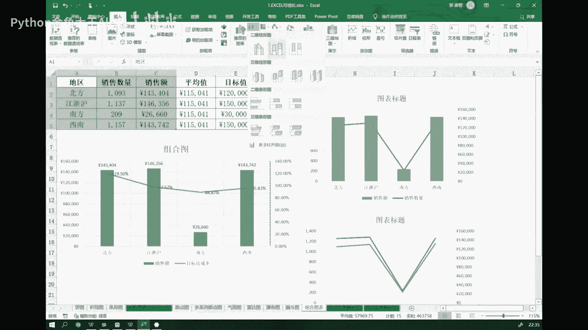

就是柱状图也好，这都是你会看到这样一种，让人很很无奈的一种表达方式。

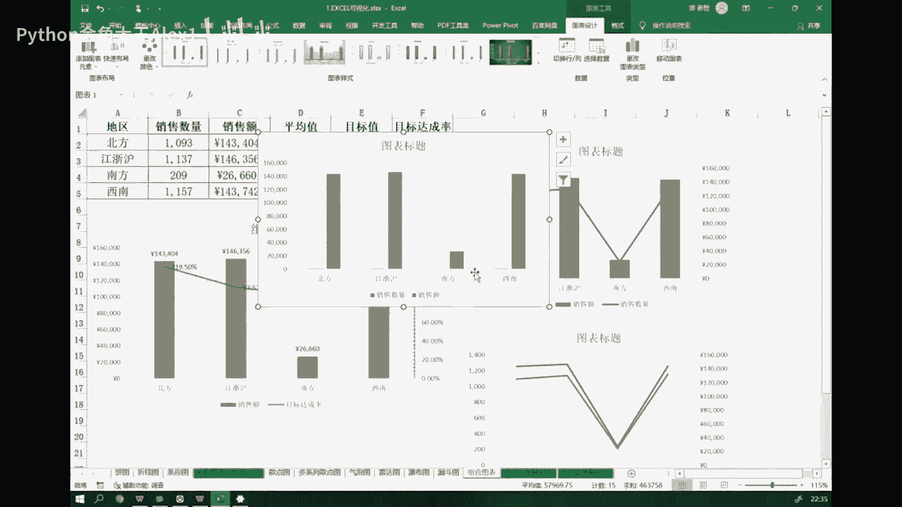

就是你看它是一个队列图啊，你注意看这，你看这啊，这是有东西的，对不对，只不过呢因为这两个量纲差异太大了，导致了我这个图根本就看不见。

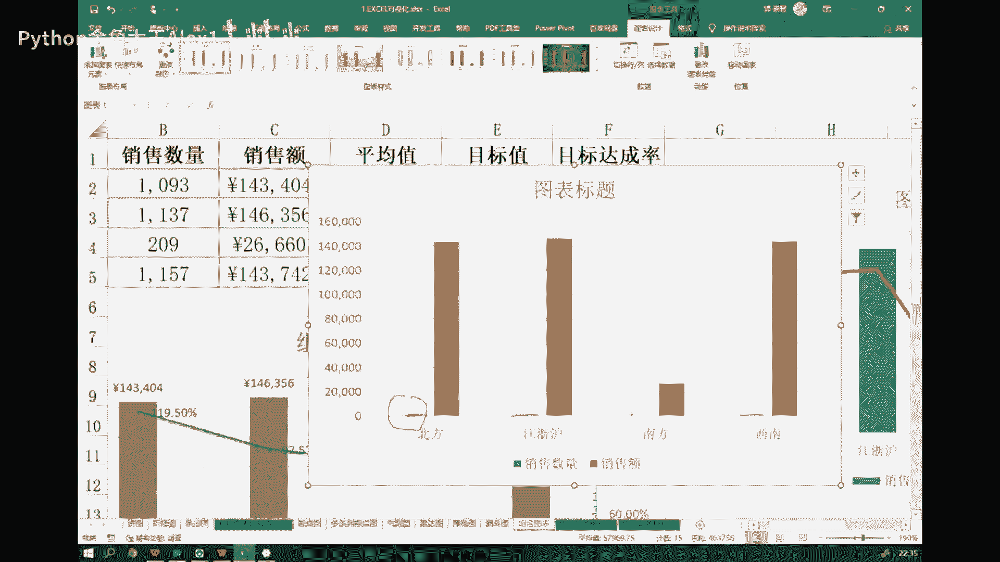

是不是根本就看不见，所以这种情况我们才会用什么，才会用组合图啊，但其实说到底啊，说的高大上，其实本质上就是两组坐标系而已，这个事儿啊能不能干，我们自己也能干，我不用搞组合图，我就直接怎么样。

我选中选中其中的一个系列，OK干嘛呢，我把我的这个编辑栏打开，打开，然后在这里边我找啊，找我这个系列的销售数量，红色销售额的啊，销售额的干嘛呢，我把它放到次坐标轴上去，次坐标轴上去，然后呢。

那个被盖上了是吧，被盖上了，那我换一个图呗是吧，换一个图就行了啊啊，就是区别是什么啊，这样的啊，还是得用那个什么图，就这样看不清，这样啊，我先调一下啊，我先把这个尴尬的事给他搞定，我先把它做一个无填充。

然后加上一个实现的线条，然后加上一个颜色，加个红色吧，醒目一点，然后粗一点，看到了吧，就这两个图啊，它是不是就是覆盖到一起了，对吧啊，覆盖到一起了，所以说那我现在其实表达的是两个柱。

但是由于我我我这两个柱啊，用的坐标系不一样啊，所以呢我可以这样表达，当然这个问题呢，如果我们用这个这个这个叫复合图的话啊，它就不需要调这个问题了，我看看啊，它这个我插入，然后我来一个这个组合图点这个好。

现在还是我把这条趋势线啊给它变一下啊，给它变成一个次坐标轴，看到了吧，这个组合图呢，我就可以直接不用像我刚才那样调它俩之间，我我得调透明度，因为它不是重叠的吗，啊它不是重叠的，所以这样就可以显示出来啊。

OK然后这是一种你也可以自定义，比如说我我不希望一个是住，一个是一个是条形图，我想做其他的情况，那怎么办呢也行啊，最后我还是插入，然后我这个组合图啊，我就可以创建，你看啊，它默认是什么，你看坐标轴。

我说可以勾选一个次坐标轴吧，比如说我现在把销售数量放到这个次坐标轴上，然后它就是簇状条形图啊，我可以给它改成折线图，是不是这个也可以改嘛对吧，把它改成柱状图就回来了，然后它我也可以改成折线图对吧。

那这样的话，他俩就什么销售数量是在我的这个次坐标轴上，而销售额呢是在我的主坐标轴上对吧，那我诶对你看这样不就出来了嘛，对不对啊，也是也就是说我们用这种组合图啊，方便方便哪儿了。

就是你不用担忧我两个图会覆盖到一起，像我们这种条件图它会覆盖到一起，对吧啊，就是这样一点，但本质上其实就是什么，就是给你加了一个两个独立的坐标系而已啊，仅此而已，那你就要知道我的应用场景是什么啊。

绝不是我为了符合表达两种逻辑，而是什么，而是为了解决我的量纲问题，这个是最主要的量纲不同，我就是复合图啊，或者说就是不同的坐标系，OK啊好啊，然后这两个作业啊。

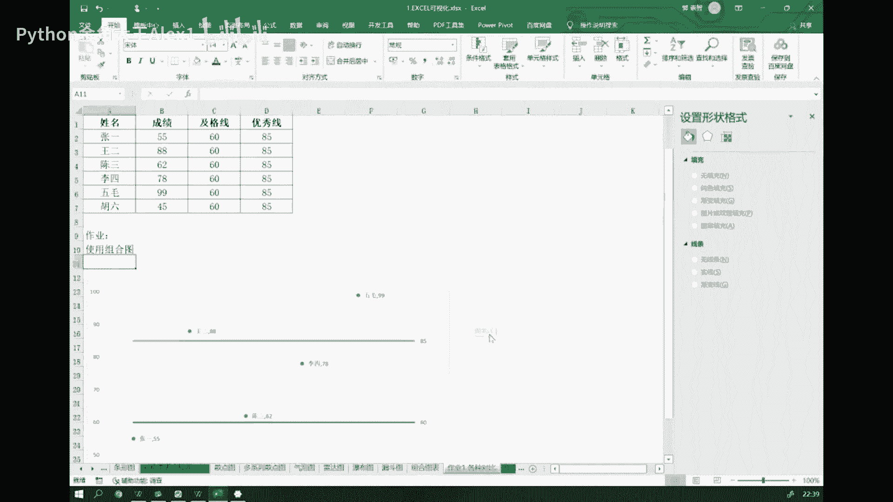

这个一个，然后还有右边这个作业，这个作业其实我已经在家做过了啊。

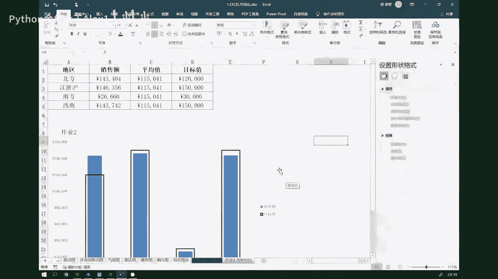

但是咱们课下可以做，然后加上前面那个加上这个作业。

OK啊，加上这个作业啊，然后呢啊我期待看大家把这个作业完成好吧。

大家如果做完的话，可以发到群里面啊，然后我们会有小惊喜给大家好不好啊，然后我也会看啊，我看你做的好不好。

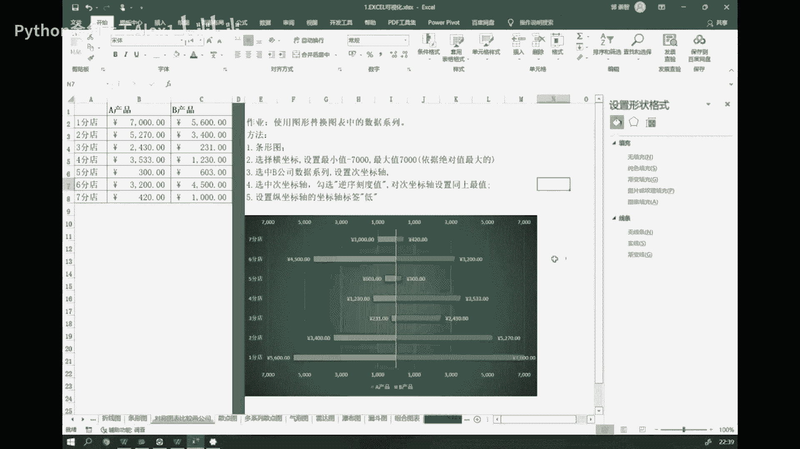

在咱们这个学习群里面把这个作业啊，给我发出来，就是就是我我这个sheet里面标了绿色的这三个。

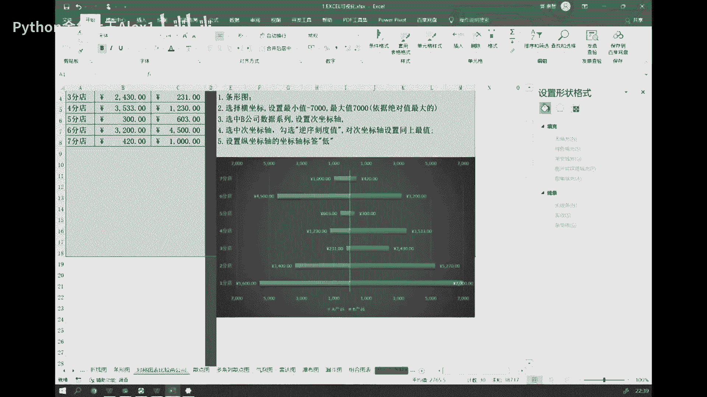

这个这个还有这个啊，OK然后你你做完以后，你可以把这个图啊直接复制啊，直接复制啊，你创建一个新的sheet给它粘到这来啊，粘到这来，这样的话呢你可以做一个汇总，这样我方便一次性看到好吗，同学们收到了吗。

你们会写我的作业吗，会写我给你们布置的作业吗，会的话，帮我扣个一好不好，OK啊好啊，如果你不好意思群发的话，你也可以发给啊，芳芳老师在咱们那个群里面发给芳芳老师，然后芳芳老师会汇总给我，我会检查。

我会评优好吗，评优啊，就在那个咱们不是有个微信群吗，同学们知不知道，就是咱们那个路飞的老师，应该给你拉到微信群里，如果没有的话，你可以问一下咱们路飞的那个，就联系你的那个老师啊，联系上课那个老师好吧啊。

然后咱们做完作业啊，然后那个你发到群里也行，然后或者你直接去发给芳芳也行啊，不过你最好是发芳芳吧，因为他需要整理一下啊，一会儿让发包在群里面跟大家去，那个打个招呼啊，就是把作业发给他。

然后我会统一给大家看一下，当然了，咱们这几天啊，咱们开营这几天期间，大家也要把每一天的那个录播啊，也要看一看啊，然后有什么问题，不论是录播的，还是咱们在工作当中碰到的这些工具化的啊，一些这个诉求啊。

大家可以在群里面活跃起来啊，我会时时关注啊，我这几天啥事不干就服务你们好吧，我会时时关注大家的问题，然后呢，尽可能的啊，在这个最快的时间给大家做解答好吗，嗯啊录播的话，课下去找啊。

找咱们也是找找那个你的，就是拉你学习的那个老师，找他要啊，我会统一给他整理好，发给他发给他，然后他们他们会给你们发啊，Ok，好啊，好的我期待明天看大家的作业好不好，今天时间也不早了啊。

然后我们就先讲到这儿，然后明天呢嗯明天我们还是八点准时上课啊，我看今天有多少人啊，现在咱们直播间还有37个了啊，有哈哈，又跑了两个啊，我希望明天咱们在座的各位明天还能来，好不好，明天我们讲。

明天我们要讲这个excel的统计啊，统计啊，然后呢今天本来是想给大家聊那个power bi的啊，但是呢由于时间关系啊，今天没法给他讲power bi了，明天我会先给大家去讲power bi啊。

让你感受到啊，什么叫降维打击好吧，就你今天学的这些所谓的绘图方法啊，在明天的power bi面前不值一提，一文不值，对TBI啊，OK啊，让你看到真正的高效工具啊，所见即所得啊，又好看又高效，又可视化。

又可交互，又可以发布到web，可以发布到移动端，好吧啊，希望我期待大家明天来听课，OK啊，讲完那个以后，我才给你们讲讲什么呢，给你讲这个excel的那种统计函数啊，但统计函数的话讲就讲几个大同小异。

你们就都会用了好吧，明天power bi啊，我们明天PYEHS不会讲啊，PYEHS的话嗯，可以那个报咱们那个数分的那个小课啊，那个课讲的全那个像那个课，因为你拍一下是肯定要学Python的好吧。

Python不可能这个三天讲不会讲不会，就只能是带你写几个案例，你能你能知道我大概怎么怎么去搞这个事儿，你可以照葫芦画瓢，能能去解决几个场景啊，但是你想你有更多场景，因为你拍PRESS。

肯定要去做那种交互了对吧，还发布网页这种东西，如果你仅仅是想发布那种网页的那种，可交互报表的话，不用搞PY1SS就学power bi就够了，Ok，好啊，那今天咱们先到这儿好，先到这儿啊。

然后大家早点休息啊，拜拜。

