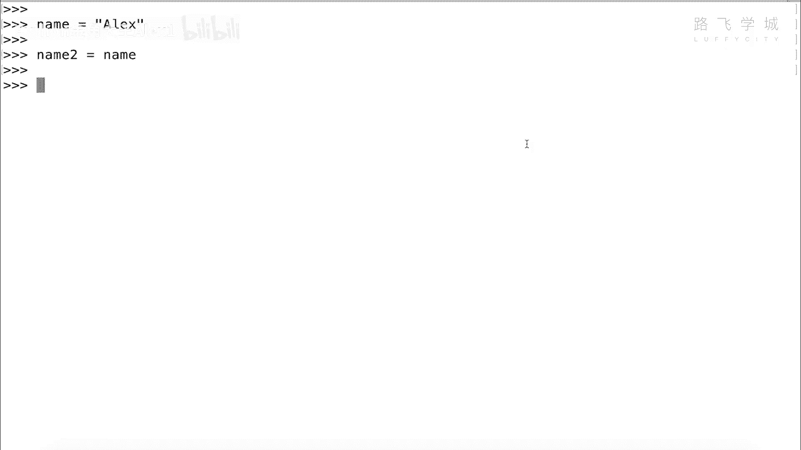
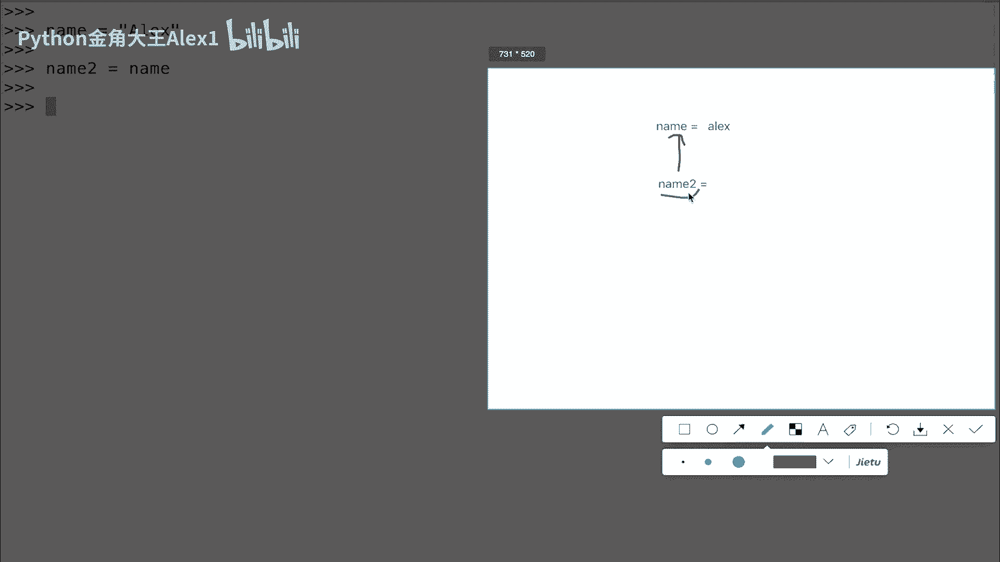
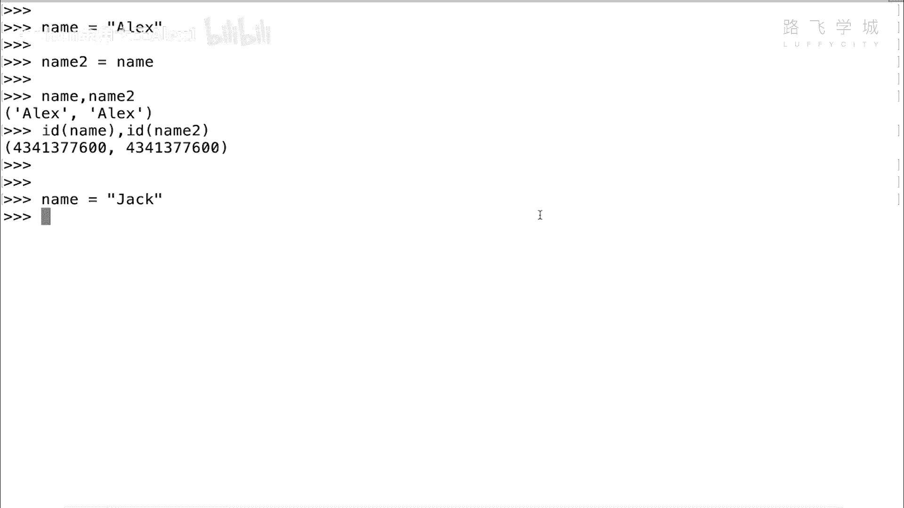
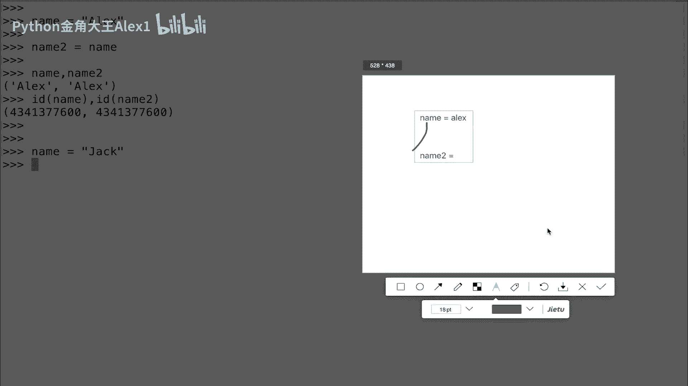
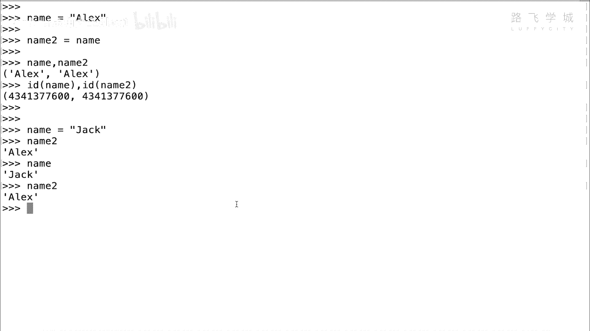
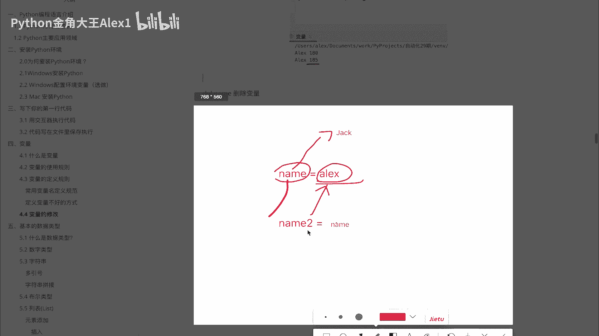
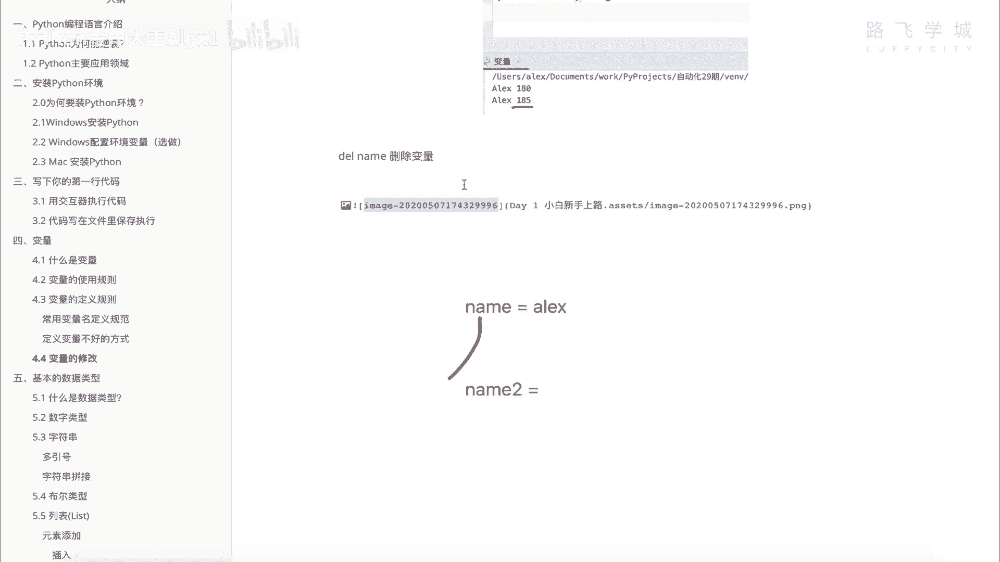

# 【2024年Python】8小时学会Excel数据分析、挖掘、清洗、可视化从入门到项目实战（完整版）学会可做项目 - P9：08 变量的修改与删除 - Python金角大王Alex1 - BV1gE421V7HF

OK同学们，这小节咱们学这个变量的修改和这个删除，那我们讲到说这个变量呢定义好了之后，可以后边被引用调用对吧，我们也可以修改它，修改它或者是删除它，咱们来看一下啊，首先我在这里啊重新进了一遍嘛。

我在这里定义了一个变量啊，叫ALEX对吧，这是我，那我现在后面引用，是不是直接print或者直接调用就可以了，那我现在呢假如说我后面这个程序不需要了，对吧，我用不到这个name了，我就想把它删掉啊。

Sorry，咱先别讲删除了，先讲修改吧，对吧啊，我想把它修改掉，我现在改名了，我不叫ALEX了，我叫这个什么呀，金金角大王对吧，金角大王啊，O那这个时候同志们，你就直接只需要做一件事。

给它重新赋值就可以了，你看啊，我现在从这个name改成啊，这个从ALEX改成金角大王，这就叫修改，这就叫修改完了啊，那它底层的一个原理是什么，它底层一个原理是什么呢，很简单。

再回到咱们这个仓库这个地方啊，还是那句话，变量名相当于看着变量名，相当于我们的这个什么呀，这个这个货架的一个编号好吧，我原来注意了，我原来这个货架编号啊，指向的就贴在这个货架上，贴在这个地方。

它叫ALEX是不是叫ALEX好，那现在呢我给ALEX改名了，注意了，我给ALEX改名了，但是这个编号没有变，我改成什么了，我改成那个金角大王，注意了，它底层的在系统的一个原理。

相当于看着把这个货架号接了下来，注意了啊，接了下来他的修改是这样，它不是注意啊，他不是把这个货拿出来对啊，存的是ALEX把这个货拿出来，然后换成那个金角刀，No no no。

它的原理是把这个编号接下来贴到这儿，这意思吗，他把编号接下来贴到这儿，OK所以在这个地方，这个地方存的这个货就是金角大王，明白意思吗，所以他干了一个事，他就指向了这个地方看吧，那同学们说了诶。

那你这个ALEX这个值还在不在啊，我告诉你ALEX这个值还在的OK吗，还在的，但是由于你已经把编号啊，货架的编号接走了，所以你是没有办法找，直接再取到它了，再取到他了。

但是我告诉你他是在这个货架上还是在的OK吗，那同学们问了说我靠，那你这个改了名之后，就就相当于贴了一下编号，你就你就你那原来的货就一直存在这，那慢慢慢慢你这个仓货仓库不就满了吗，不就爆掉了吗，对不对。

没有错，所以呢Python的解释器它有一个自动回收的机制啊，叫垃圾回收，垃圾回收，什么叫垃圾，也就是说你只要是无主的货物，就认为你是垃圾，什么叫无主货物，没有贴编号OK吗。

所以Python解释器会定期啊，一般就是在一秒钟之内啊，就会弹内部一个回收机制，就是来去扫描一下所有的这个货架，只要上面没有贴编号的啊，就代表是无主之物啊，无主之物就是垃圾就给他收走，就给他删掉OK吗。

给他清空了，所以你不用担心，你只需要干把编号啊，这个贴走的那么一个动作就行了，这是变量修改的一个内部原理，OK吗，变量修改的内部原理啊，好就是这个那变量的删除呢，稍等稍等，诶诶诶sorry，Sorry。

Sorry，Sorry，你在这里，你修改完了之后，咱们再来看他的删除，你说我后面我不用它了，对不对，我不用它了啊，Sorry，我不用它怎么办，你想删掉很简单，直接DEL用一个DEL方法。

这是我们新学的啊，DEL方法在这里啊，直接是啊DL这个name对吧，就是删除你的电雨量，OK吧，删除你的变量，咱们来看一下，你删除完之后再来去掉这个变量，你看啊，还有吗，他直接说变量就没有定义了。

能理解意思吗，那这个删除在底层的原理是什么，直接彻底的就把这个什么呀，把这个编号给扔了就不用了，就就就之前那个修改是把编号移到这，现在是把编号直接扔了，给扔垃圾桶里了，所以这个编号就没有了。

所以就把它删了那个货物，但是有没有真正删货物呢，其实并没有，你删的是编号，那个货物还是通过它Python的解释器的垃圾回收机，制定时的把这个啊对吧，没有编号的货物给他回收是吧，你删完了删的只是编号。

OK就是这个，那接下来再给大家讲一个小的小的一个什么啊，这个地方很容易懵逼啊，很容易懵逼，现在我这个name重新命名一下，这个name叫ALEX好吧，然后呢，我可以干嘛呢，我又起了一个叫name2K吧。

name2name2干了一个什么事啊，内蒙盖尔是不是我不是给它赋值，再赋值成一个什么键，进角大，往后压力山大，我赋值直接赋值name哎，同学说我操，你这是什么骚操作，大家看啊，能理解意思吗。

就是我相当于把这个name2的这个变量的，这个这个直直接指向了这个name变量啊，可不可以这样呢，可不可以这样呢，可以的，你理解的逻辑相当于是这样。

你理解的逻辑是啊，我看我给你画一下吧，你的逻辑可能是这样啊，这个这里是啊name对吧，然后等于ALEX，然后呢你这里起了一个name2对啊，然后呢你等一个这个你相当于干了一件什么事。

你你理解的是内马尔直接指向了他，所以这样的话，你调用内马尔是不是也能等于ALEX对吧，是应该是这样的呀对吧，因为我那边指向他了嘛，他又指向他，我所以相当于相当于是给name起了一个别名。

对不起了，别名也是找的ALEX，你是这么理解的，对不对，哎并且我们看实验效果，它也是这样的name，然后打个逗号内二，大家看其实显示的都是ALEX好，可以逗号先打印两个变量啊，呃你看显示都是ALEX。

然后我们看一下内存地址的话也是一样的啊，内存地址啊，ID2对吧，是不是一样的诶那确实就没错，也就是说他俩指向的都是一个，实际的实际的内存地址，那咱们看这个图啊，相当于是什么呢。

相当于啊相当于相当于我拿这个拿这个产品，看着这个还没有被被污染，被我画的啊，假如说这个是name，OK吧，这一块是name，对不对，我现在呢起了一个啊，另外一个编号又在这里起了一个编号叫N2，对吧。

就是name2，然后把这个编号指向的这个对不对，指向了这个编号是不是哎，然后呢，所以相当于起了个别名，我通过name n2也能找到它，通过这个name也能找到它，咱们的理解是这个样子的，对不对啊。

这是咱们现在的理解啊，但是实际上是真的这样吗，注意了，跟上我的思路，实际上是真的这样吗，这个时候怎么来验证一下，我现在呢现在他俩都一样，对不对，我改个名，我把name啊改成它原来叫ALEX。

我改成一个啊，jack ok吗，那如果符合我们之前那个逻辑的话。

我们之前还是那句话再换一下啊，我们刚才那个逻辑是不是name等一个ALEX，然后呢这个name2，等一个name对不对，等一个name其实我们认为就是相当于它指向了哎，Fuck，它指向了他对吧。

指向了他，然后呢我就找了一个，也就是说ALEX跟着，也就是说name现在给他改了，改成jack了，那内蒙二应该也是改成JK了，对不对。

也是应该是改成JK的，对不对，那我们来看一下是这个样子吗，我先把这个图贴到这里啊，一会咱们来画，咱们是这个样子吗，我们直接name2，大家来看，卧槽奇迹出现了，你会发现name改成了jack。

但是name2还是阿里克斯，what这你的价值观可能就要崩溃了。

你再思考一下这个逻辑啊对吧，你的这个啊，这个这个这个他已经相当于内已经一，大家知道修改的话，其实就是把这个编号在移嘛对吧，就给它改成修改，给他改成了这个对吧，改成了jack，对不对，改成JK了。

那你这个既然name2指的是name，所以他也应该跟着改，但实际的情况是什么，实际情况name2还是ALEX，所以我告诉你，通过这个现象，我告诉你，我们刚才认为的这个这种指向思路是不对的。

咱们实际的指向是什么呢，name2等于一个注意了，name2你在这里等于一个name name，它实际上指向的并不是直接指向的name，这个这个这个这个什么呀，这个变量名它指向的是什么呢。

也就是说他先找到name这个变量名，指向的这个内存地址，然后这样能理解意思吗，它是这样，它并没有指向这个name name name啊，变量名啊，它指向的是name变量名所指的这个值，所以呢才会导致啊。

这个其实也就是，实际上name2跟name这个变量名没有任何关系，他只是借着name这个变量名，找到了这个ALEX这个值能理解吧，所以name改了之后跟内蒙二没关系。

内蒙二还是ALEX能理解意思吗，再用这个货物的原理给大家讲一下，你就应该清晰了啊，讲一下清晰了啊，比如说大家看你在这里啊，咱们这个这个地方存的这个货叫ALEX，对不对，然后呢。

我在这里这个地方这个这个这个名字叫name，对不对，叫name啊，注意了啊，这个写的不好，叫name啊，然后这个地方是N2，对不对，这个地方是N2啊，也就是我们的内存二，我们认为说白了。

这里这个货物编号是指向了这个货物编号不是，其实它只是指向通过这个N这个货物编号，找到了这个货物，也就是说N2指向的不是这个货物编号，它指向的是什么，指向的是这个货，OK吗，然后接下来第二步N这个变量。

也就是说这个货物编号把它接下来了，接下来贴到哪了，接下来可能贴到这了，也就是说它贴到这个位置了，所以这个地方就是jack ok吗，但是贴到这没关系，他跟这个跟原来的这个N2没关系。

因为原来的N2是直接指向那个货物，所以虽然N移到这了，那N2还是在这，N2还是在这，所以他俩所以N2不会跟着这个N改，能理解意思吗，哎这个就是他俩之间内部的一个关系啊，你你你再好好捋一捋好吧。

所以这个时候你看他们的这个变量的这个值啊，就是sorry内存地址都是不一样的啊，它都是完全啊改了，我不用我不用看，就就就就就行了，先看吧对吧，是两个不一样的内存地址好不好，哎。

这个就是它的一个底层的一个啊。

一个一个原理的一个原理，好吧，你在啊理解一下，OK不不明白的，你可以问我啊，单独问我啊啊这个私信问我，OK好，这个就是变量的修改，到此为止，变量这一块我们就全部讲完了，接下来就可以真正用变量来。

把它放到我们的程序里进行各种操作了。