# 【2024新版--5天拿下Python金融量化+股票分析+数据清洗+可视化从入门到实战】100集（全）附视频课件 资料 代码等等 - P12：11 捕获股票上涨的日期 - 写代码的程序猿儿 - BV1Q7SdYkEhS

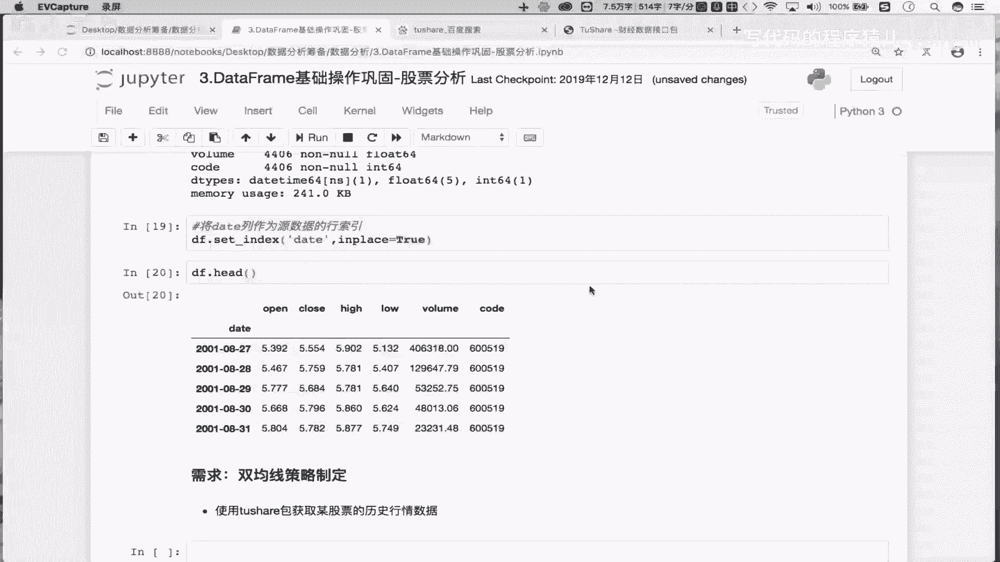

OK那么这组股票历史交易书啊，我们给它进行了预处理的操作之后呢，那么接下来我们看一下后续的需求。

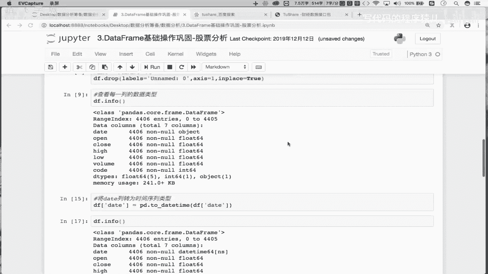

那首先在这明确一点，为什么需要将将data那一列转成时间序列。

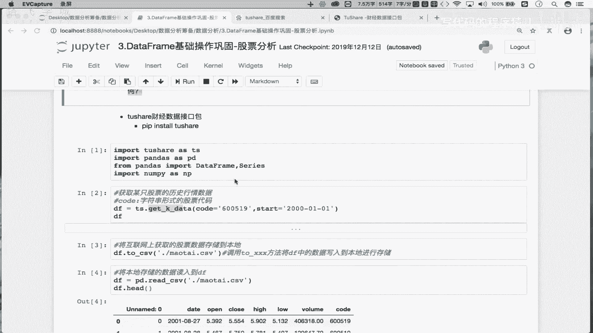

为什么再次把它作为行索引呢，是因为你看后边在需求当中。

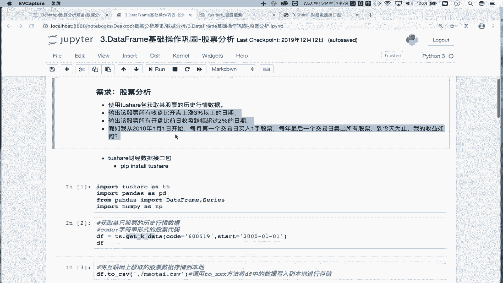

我们是不会用到相关的什么呀，用到时间的，你看用到日期，是不是后边需求都会用到日期啊对吧，因为我们如果后边的需求需要用到日期，那么意味着我们如果把原始数据当中的日期，由字符串转成时间序列。

我们就可以使用时间序列指定的相关的特性，来完成后续的需求，OK吧，所以说你就先跟着我的步骤，一步一步去走就可以了，那么接下来看一下第二步干什么呢。

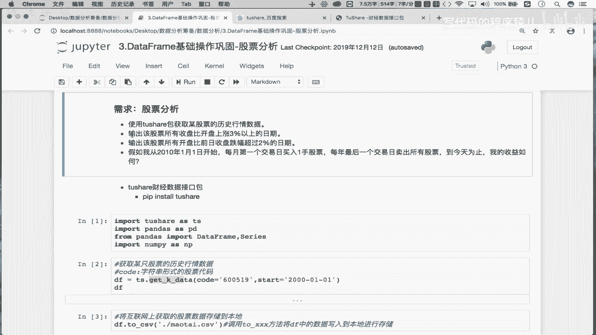

需要让咱们找出啥呢。

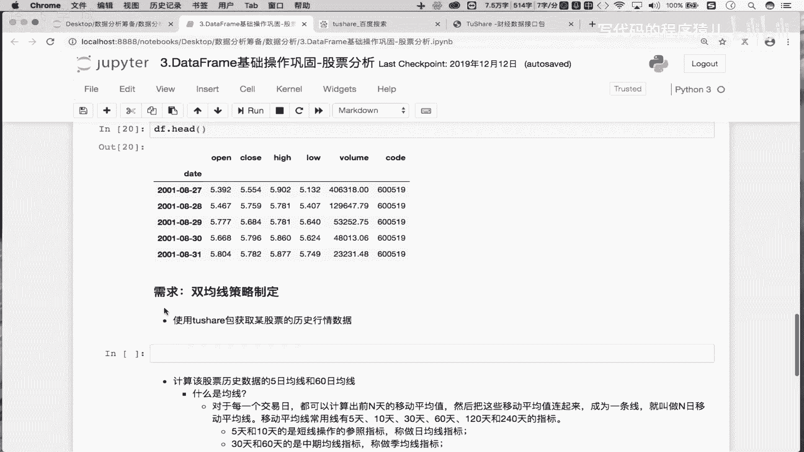

好在这需要让我们找出该支股票，就是茅台支支股票，所有收盘价比开盘价上涨3%的日期对吧，那可能我们是需要去总结，去分析出茅台几支股票，它的一个涨幅的情况吧对吧，那涨幅3%的情况。

到底是分布在哪些日期当中呢对吧，比如说他可能是分布在这个3月份，6月份比较多，那么意味着来年我就可以在3月份，6月份去买这支股票，那么它涨幅的几率就可能比较大，是不是啊，可能是这样的啊。

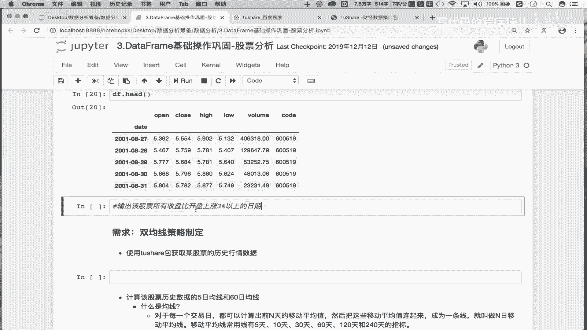

那所以说在这咱们就来实现一下，那首先open是咱们这支股票的开盘价，close是咱们这支股票的收盘价吧对吧，我们要输出收盘比开盘上涨37%，那这块的话我们的这个先写下我们的伪代码吧。

伪代码伪代码怎么写呢，是应该是我们的收盘价，收盘是不是减去开盘，然后再除以开盘，是开这个收盘比开盘上涨3%啊，是大于0。03，是不是3%，那么我们的伪代码是不是该这么去写啊对吧。

收盘减开盘除以开盘大于0。03，它所表示的就是我们的收盘，比开盘上涨3%。

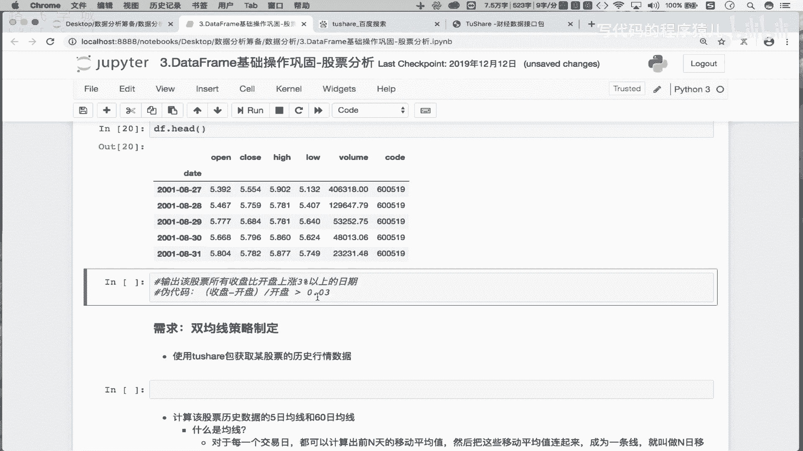

对不对，我们最终要的是日期啊对吧，要是日期啊，那然后的话我们的伪代码在这可以转成，真正的代码，怎么转呢，首先我们知道开盘是谁，开盘不就是我DF当中的什么呢，open这列嘛是吧。

那取出的不就是一个series嘛对吧，既然这个series是不是减去我们的收盘，close是不是也是一个series s，让两个SER数相减，然后再除以谁，再除以我们的开盘DF中括号open这一列。

那现在啊我们最终让它大于个0。03，你看这是不是一个逻辑判断的表达式啊，逻辑判断表达式最终返回的结果就是什么，比如说我说五大于三，那返回值是什么，应该是真或者应该是假吧，是不是返回布尔值啊。

那么这个表达式最终返回的也是一组布尔值吧，对不对，走，你看这返回的是一组BD值。

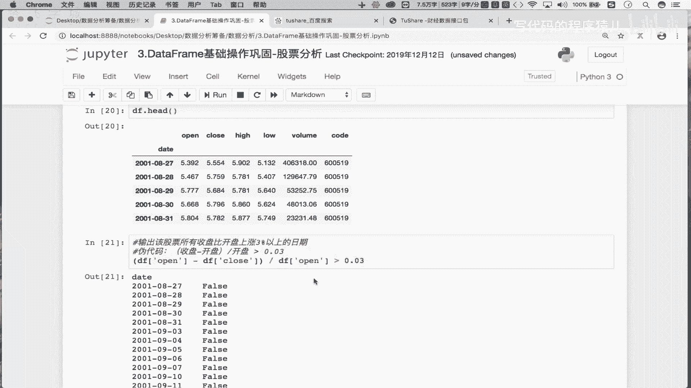

返回的也是serious，那bl值当中的true跟false啥意思呢，比如说你看8月27这一天返回的是false，意味着什么，意味着8月27这一天是吧，是不满足我们的收盘比开盘上涨3%的吧。

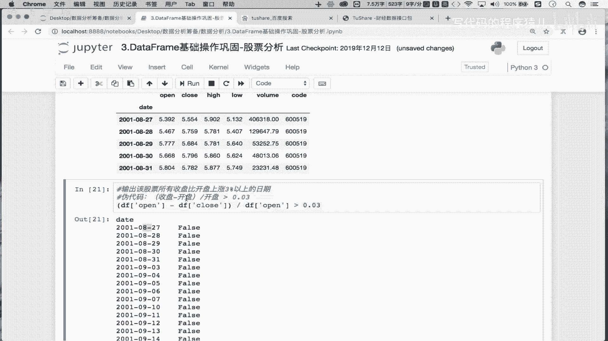

对吧，那就找处呗，看有没有处啊，一定是有出的，你看这个是不是有出啊，2020年1月3号是吧，这是true，意味着我们的1月3号这一天。

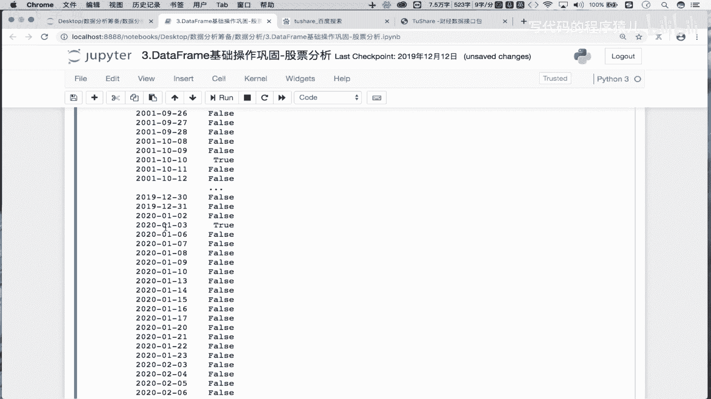

是不是满足收盘比开盘上涨3%的日期啊，对不对，你要知道收盘比开盘涨3%，意味着这只股票是不是涨了对吧，那如果开盘比收盘涨3%，意味着只股票是不是跌了，对不对啊，好那这个基本常识你是需要有的啊。

那现在这返回了一组布尔值。

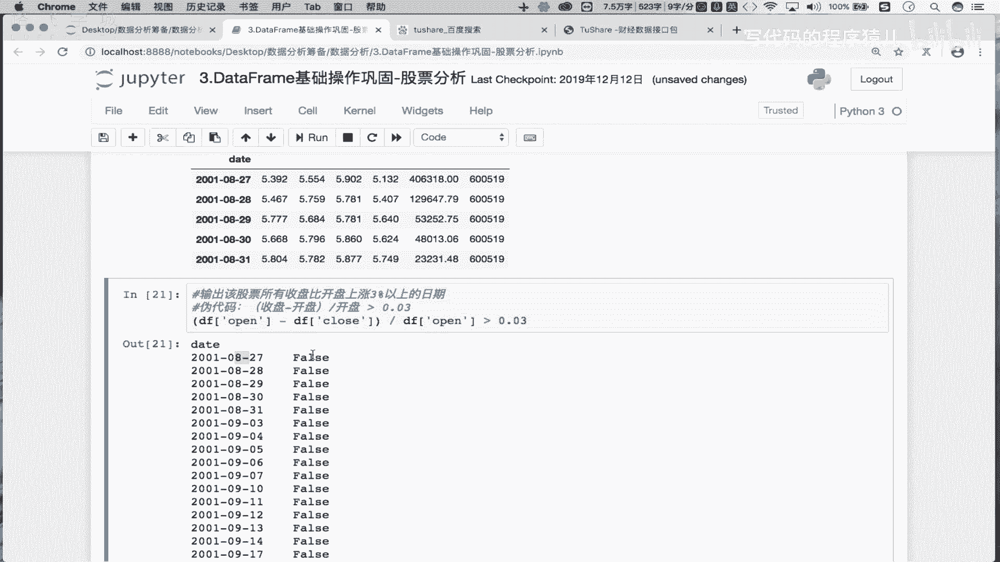

那布尔值有了之后，咱们应不应该拿到所有处对应的日期啊，true对应的日期刚好是我们的需求，让我们找到的日期吧，那true对应的日期怎么去找呢，对不对好，那这块的话大家啊，老师给大家去分享一个经验哈。

一个经验，那就是说在什么呢，在我们的这个分析的过程中啊，如果如果如果产生了什么啊，如果产生了什么呢，布尔值布尔值则啊，则下一步马上将不R值作为原数据的行索引，OK吧这一步什么意思呢。

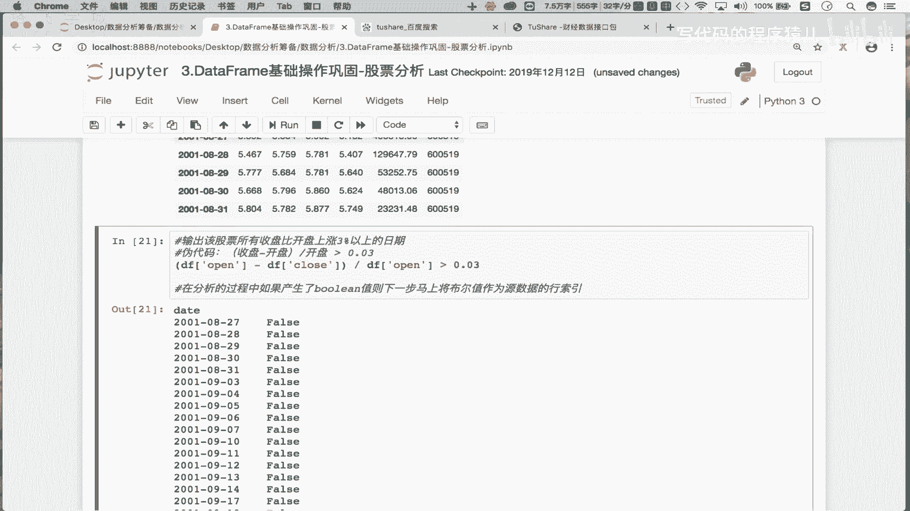

为什么将布尔值作为原数据的行索引呢，你比如说哈，比如说现在我这是一个data frame，可以吧对吧，那现在这里边是不是有五行数据啊对吧。

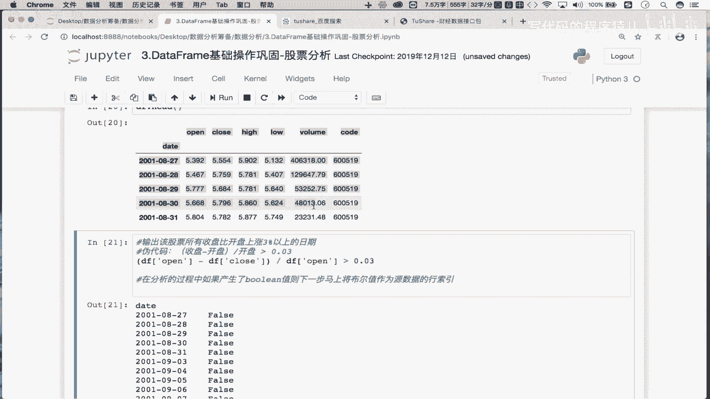

有五行数据啊，你比如说在这的话，我想干啥呢，我想DF对吧，我是不是想取行啊，是不是D2lock是取行，对不对，取行啊，那我取哪些行呢，比如说哈我们这是可以写一个什么，写一个2001杠零八杠二七。

是不是取这行对吧，也是不是可以取这行啊，是不是根据我们的行索引去取行对吧，除了放行索引，我们还能放什么呢，可以放布尔值看一下，比如说我这放了一个什么呢，True false true，看这返回的是什么。

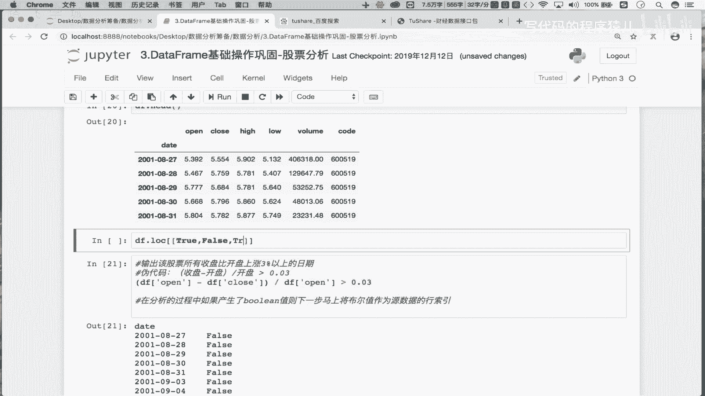

走看这儿返回的是两行，为啥呢，是因为这里边有两个处吧。

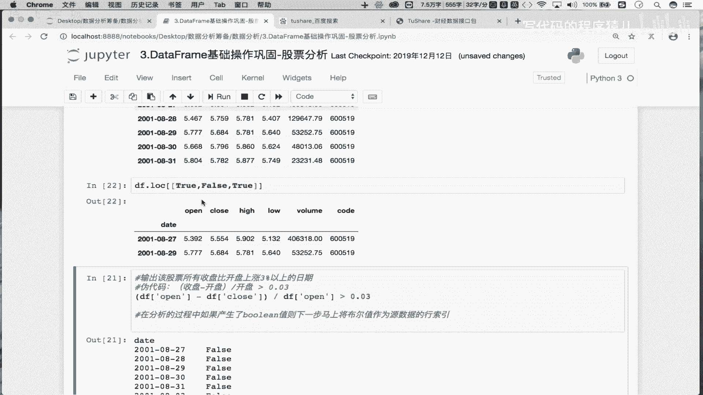

你看这两个处分别对应的是20，27跟29，这两天是不是你看28哪去了，28对应的是不是false啊，那么意味着，如果一组布尔值作为原数据的行索引的话。

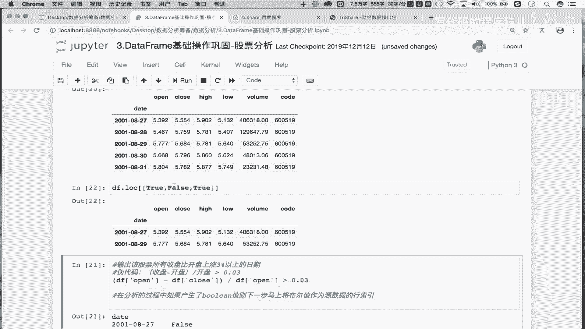

就值可以将true对应的行取出。

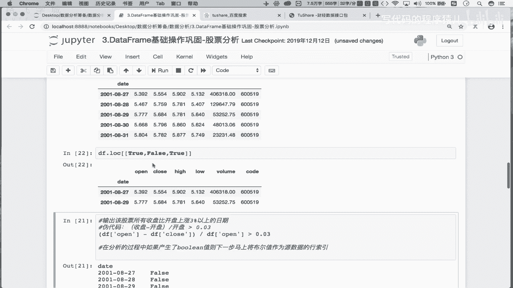

false对应的行忽略，是不是是这意思吧对吧，咱们已经做了验证了吧对吧。

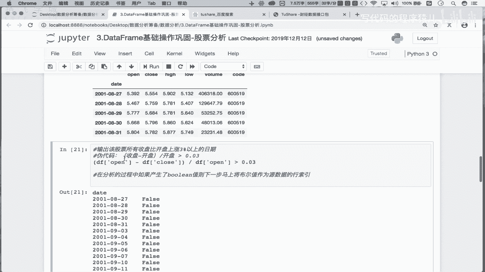

所以说在这我们去解释一下啊，那就是说如果什么呢，如果布尔值作为这个DF的行索引，则可以取出什么呢，取出，true对应的行数据对吧，然后是忽略，false对应的行数据吧对吧，就是它本身具有的特性。

你看现在我们这儿干什么呢，是不是将这个表达式返回的这组布尔值，作为原数据的行索引怎么做呢，DF是原数据吧，说点儿lock中括号这里边是放我们的行索引，放谁呢，就放这个表达式返回的这组布尔值吧，对吧好。

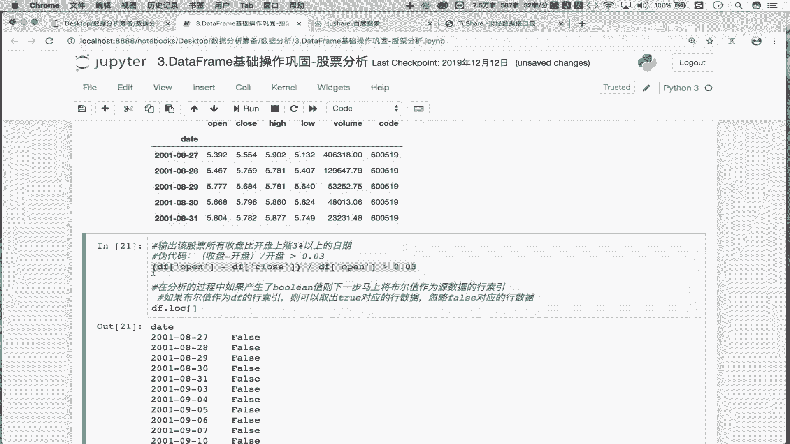

我就把它扔到中括号里边，是不是就给了对吧好走，你那这一步啊。

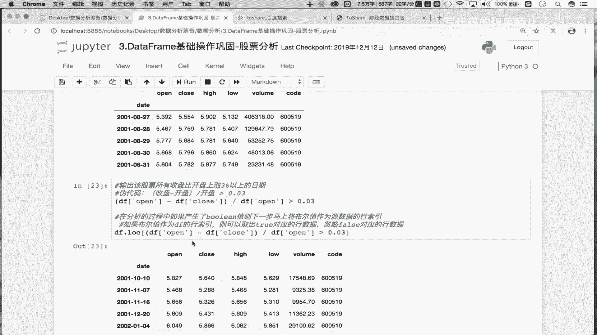

这一步我们就获取了什么，就获取了处锁定的行数据了吧是吧，获取了对应的行数据，那么true对应的行数据就是满足啊，满足我们需求的行数据吧对吧，那满足需求的行数据有了，最终我们想要的是行数据吗，不是吧。

最终咱们想要的是不是时间对吧。

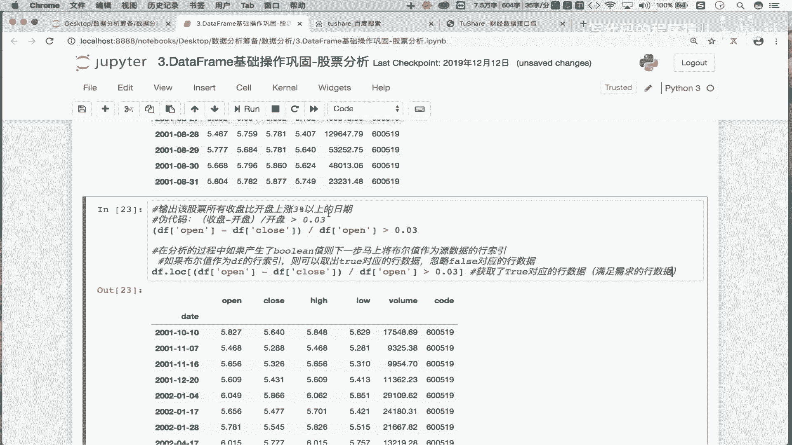

要的是时间吧，那你看时间不就是我们行数据的行索引吗对吧。

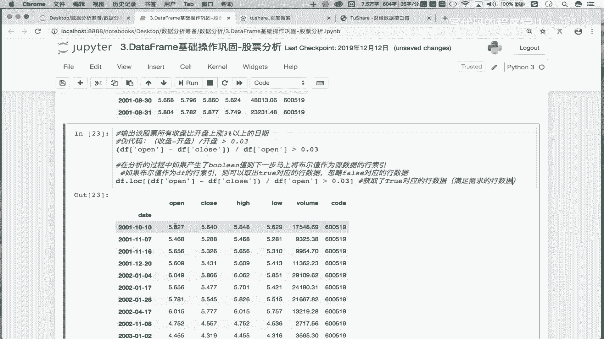

那最终将这一组行数据的行索引取得，是不是就可以了，你看这个表达式返回的不就是一个data frame吗，将这个data frame的点儿什么呢，点儿行损是index啊对吧，那这是不是就捕获了捕获了什么。

捕获了一一个data frame行数据啊，行数据不就是我们想要的这个时间吧。

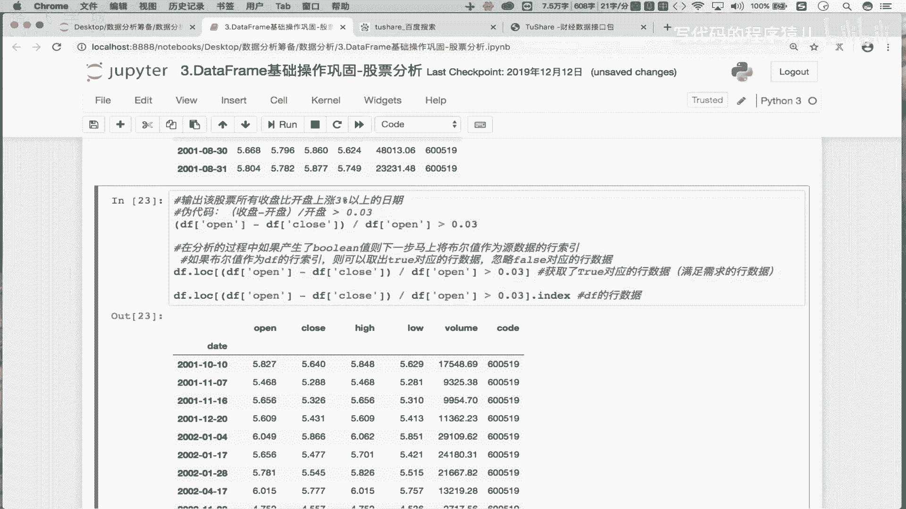

JONY看最终我拿到的这些时间，是不是都是我们的满足需求的行数据，对应的行索引，那么这些行索引刚好就是满足我们的，收盘比开盘上涨3%的日期，OK吧好，那所以说在这个需求的实现过程当中。

咱们在这就学到了一个经验，就是说如果一旦拿到一组布尔值之后，这组布尔值就可以作为frame，这组原数据的行索引了，那么如果将一组布尔值，作为原数据的行索引的话，我们就可以取出处所对应的行数据，对吧好。

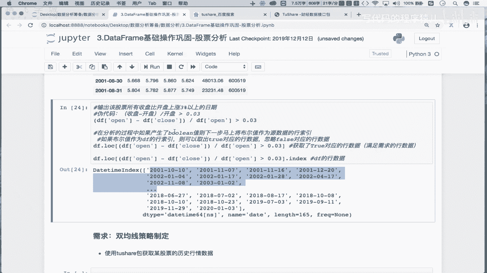

那这个需求咱们就实现了吧，OK吧好，那么大家需要勤加练习好。

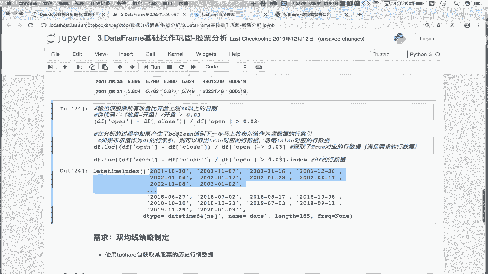

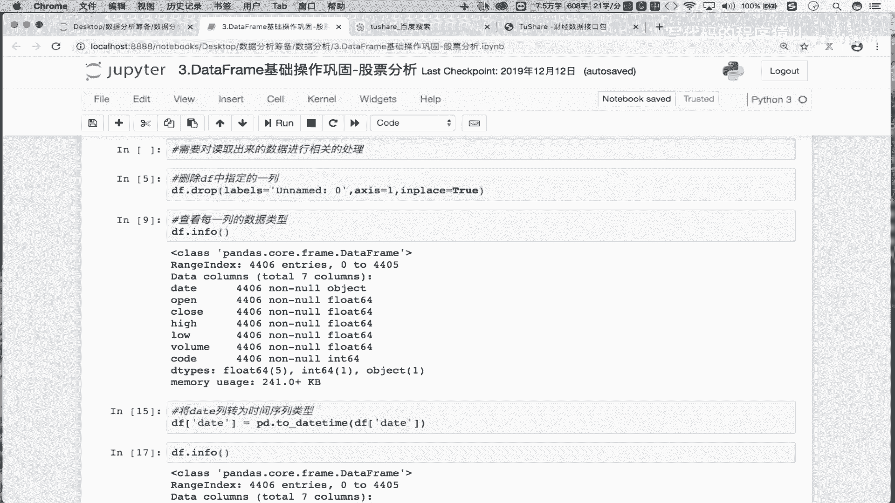