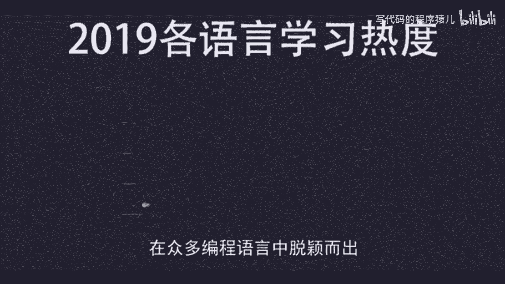
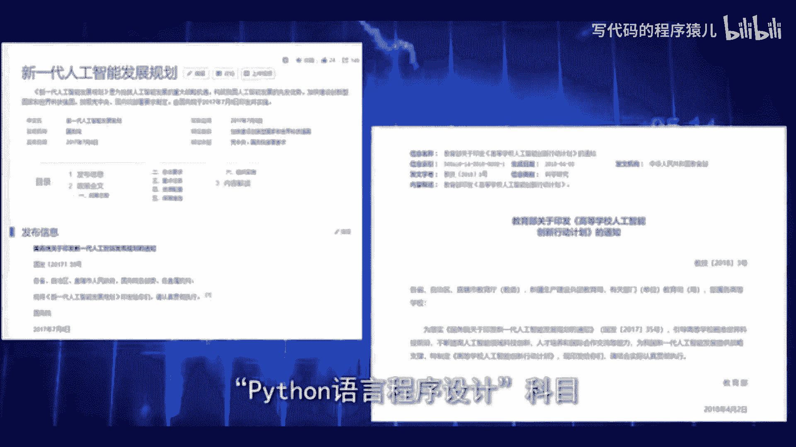
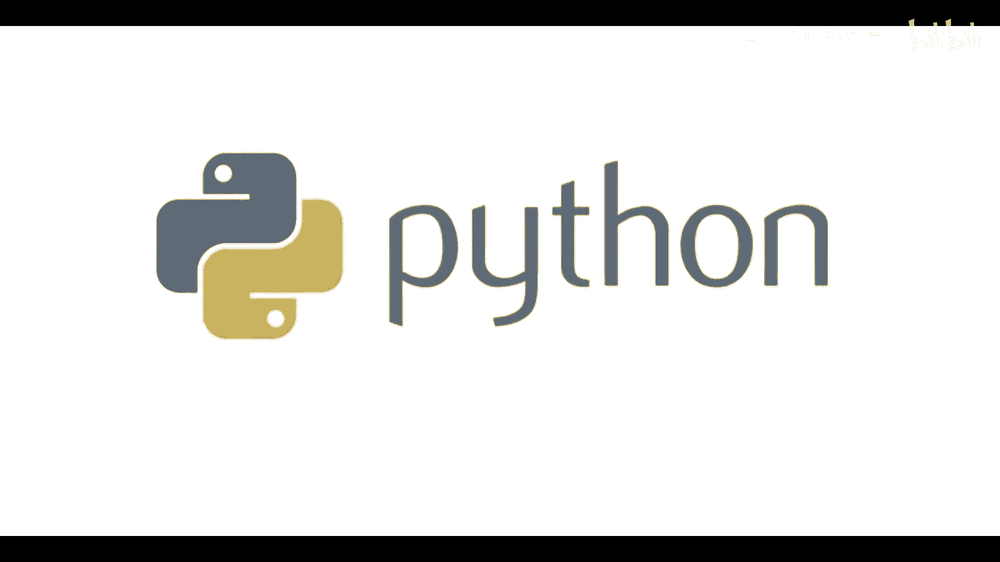
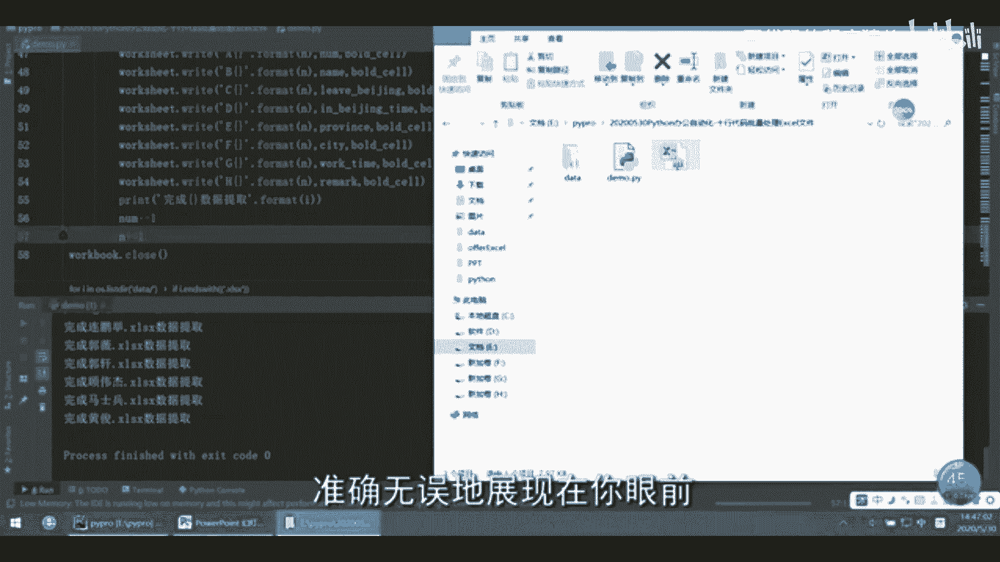
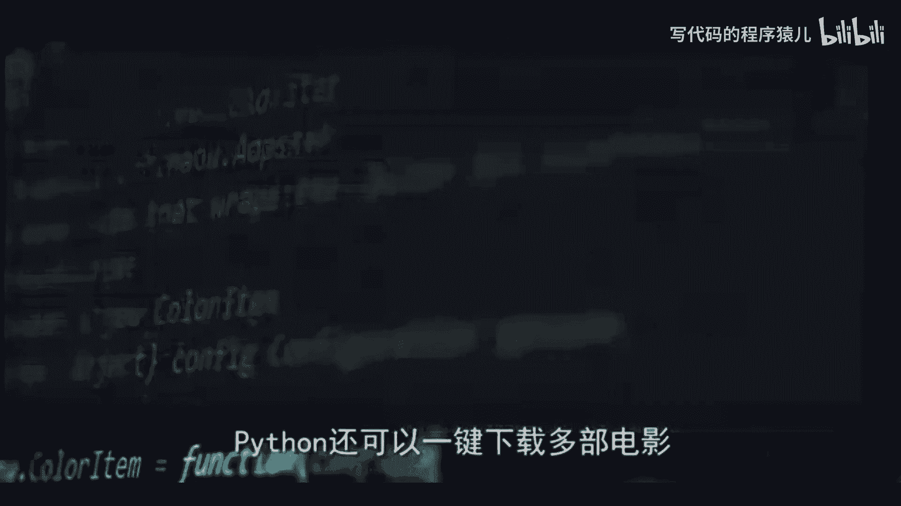
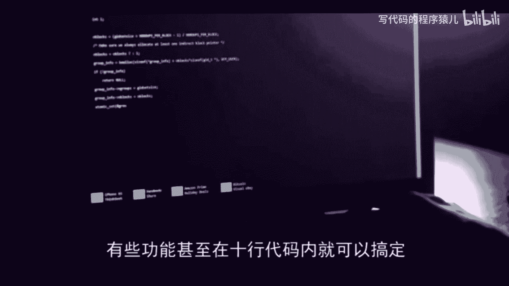
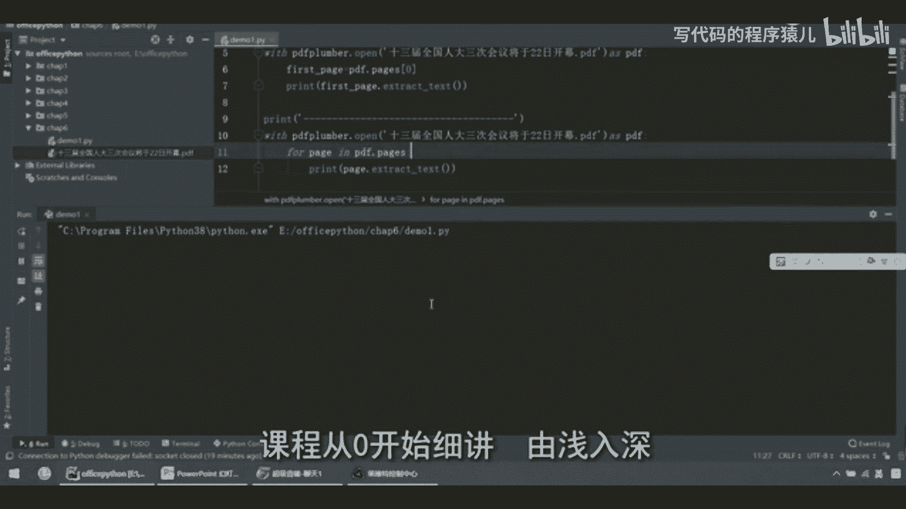

# 【2024新版--5天拿下Python金融量化+股票分析+数据清洗+可视化从入门到实战】100集（全）附视频课件 资料 代码等等 - P1：00  python简介 - 写代码的程序猿儿 - BV1Q7SdYkEhS

在本期视频开始之前，请问能先给个三连吗，啊你要白嫖啊。

那就给个免费的赞呗，谢了，这对我真的很重要，科技高速发展的今天，计算机已经成为人们工作，生活中不可或缺的部分，Python作为如今最受欢迎的计算机编程语言，在众多编程语言中脱颖而出。

掀起了一股全民学Python的风潮，也在2018年的计算机二级考试中，加入了Python语言。

程序设计科目，浙江省更是在2017年就将Python编程，加入到高考中，国家大力推行这些政策，也从侧面说明了，Python在未来科技发展中将起到举足轻重的作用，在工作中，潘森更是受到各大企业的喜爱。

很多本不需要Python的工作岗位，也因为Python能帮助使用者更快速的完成工作，而要求员工会使用这门简单高效的编程语言，派森为什么能击败一众对手，成为最适合人工智能的编程语言呢。

其最大的优点就是简单易学，语法简洁优美，新手也能轻松看懂，其对于数据的处理，也因为它自带各种工具包，而拥有得天独厚的优势，相对于其他编程语言，Python还有着很多优势，正因为如此。

国家才会如此重视Python编程教育，企业也对能使用Python的求职者青睐有加，我们在百度指数变化中可以看到，泰森已经远超java以及其他竞争对手，成为现今最受欢迎的编程语言，说了这么多。

PON究竟能干什么呢，PON可以应用于我们生活工作中，非常广泛的领域，举个例子，老板给了我们一个任务，把很多excel里面的所有数据，整合到同一个excel表格中，我们当然可以逐个复制粘贴。

但是这种方法费时费力，还费键盘，而Python却能轻松帮你搞定。

你需要做的仅仅是花费12分钟来输入代码，最后点一下运行，Python，就能把处理后的excel表格，准确无误地展现在你眼前。

不仅如此，Python还可以一键下载多部电影。

批量自动发送邮件，批量抠图等等等等，有些功能甚至在十行代码内就可以搞定。

本Python教程为Python全栈教程中的基础入门版，主要适合零基础学员和，编程基础比较薄弱的学员学习，课程从零开始细讲。

