# 【2024新版--5天拿下Python金融量化+股票分析+数据清洗+可视化从入门到实战】100集（全）附视频课件 资料 代码等等 - P4：03 numpy数组三种神秘创建方式 - 写代码的程序猿儿 - BV1Q7SdYkEhS

能把这个环境的安装呢给大家进行了一个讲解，那么这一小节咱们就来看一下，在我们数据分析当中，常用模块的一个基本的使用，OK吧，那么在咱们整个数据分析当中哈，我们有三个模块需要让大家进行一个掌握。

那么这三个模块模块被称之为，我们数据分析当中的一个三剑客，分别是我们的NIPPP模块，pandas模块和matt plot lib模块，那就是说咱们后期所讲解的数据分析。

所有的操作都是围绕着这三个模块展开进行的，OK吧，那么首先咱们先来看一下第一个NIKE模块，它的一个基本的使用，那首先这三个模块摆出来之后呢，首先要给大家进行一个初步的一个介绍哈。

那么这三个模块重点的一个一个事情，就是说我们重点是要学习这个pandas模块，那就是我们的pandas as，这个模块是咱们的一个什么呢，重点操作啊，重点操作啊，那就是说咱们在数据分析当中。

重点所讲解的就是pandas as，重点所使用的也是pandas as这样的一个模块，那么剩下的NIKE跟matt plot lip，也是需要会被用到的，但是相对于重要性来讲的话。

并没有pandas as要高，OK吧，所以说咱们整个课程的一个中心，就是要学习pandas模块。

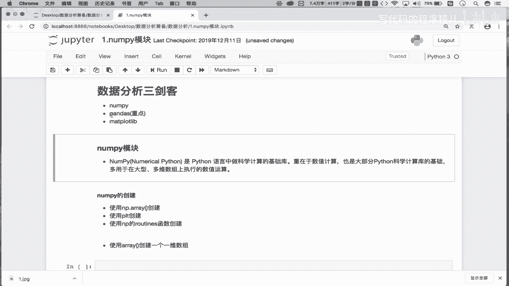

那第一点我们首先先把net模块的一个基本使用，给大家进行一个介绍，OK吧，那么这个net模块在后边，主要是为了给我们的pandas模块提供数据源的，是这样的一个关联，OK吧。

等我们讲完pandas as之后，你就知道什么叫数据源，为什么NIKE可以给pandas as去提供数据源。

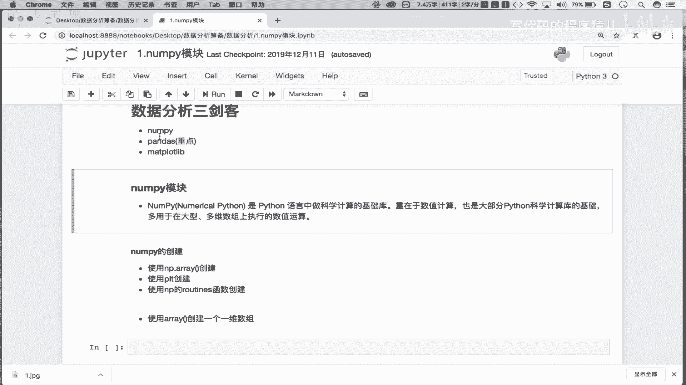

OK吧好，那首先呢，先大致的介绍一下这个NIKE这样的一个模块啊。

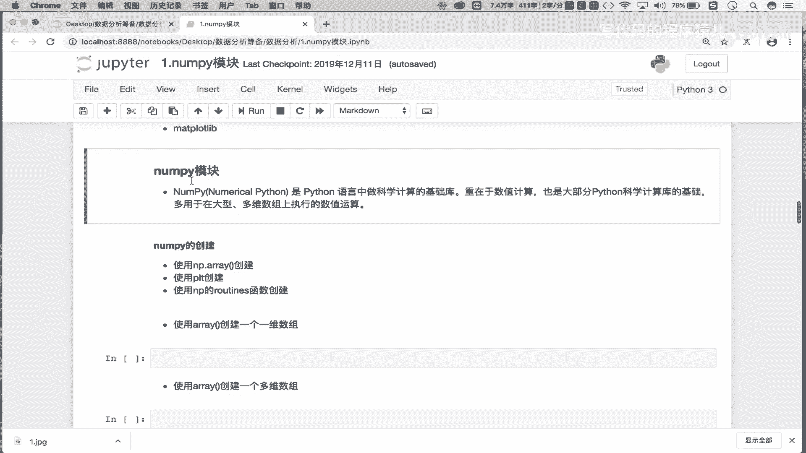

首先这个nip的话，你就可以把它理解成是一个一维或者多维的，一个数组啊，那如果各位同学，你有其他编程语言的一个经验的话，比如说你之前接触过C语言，接触过java对吧。

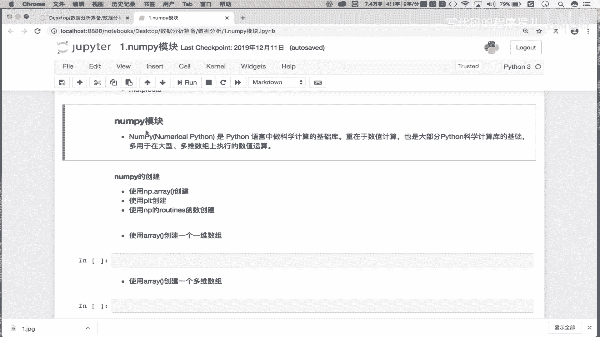

那你一定知道什么叫数组吧对吧，那如果你只接触过Python的话，在Python当中咱们是没有讲过数组的吧，但是我们是不是讲过列表啊对吧，那这块的话如果你不知道什么是数组的话。

你可以暂时的把数组当成一个特殊的一个列表，或者说把列表当成一个特殊的数组都是可以的，OK吧啊那所以说甭管是列表还是是数组，它表示的都是一种数据结构，那只要是数据结构。

那么意味着它们表示的都是一个容器吧对吧，那么容器里边是不是可以装载数据啊对吧，所以说咱们nip模块所对应的这个容器。

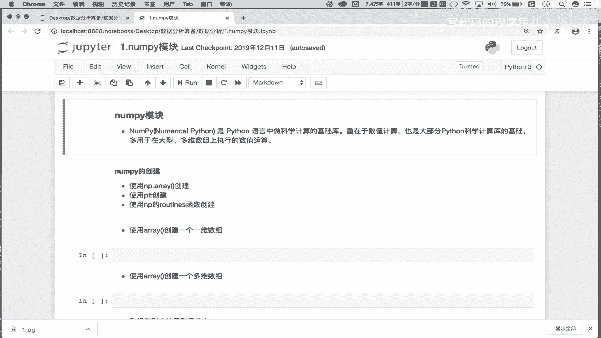

叫做数组，这个数组呢是可以装载相关的数据的，OK吧，所以说暂时我们先把NPP模块当成是一个，一维或者多维的一个数组，OK吧，那么什么叫一维，什么叫多维呢对吧，这个维度怎么去理解呢。

那你比如说咱们之前可能接触过列表，比较多是吧，那我如果定一个列表a list，如果这里面放的是123，那么我们就可以暂且把这个列表，称之为一维列表吧对吧，那何为二维列表呢，比如说我a list中括号。

那这里边的话是列表套列表，好比如说这123下边是456，我们就可以把这个列表称之为是二维的，它的维度是二，是列表套列表就是我们的二维列表对吧，那三维列表跟二维列表它的含义是一样的吧。

列表套列表是不是这套列表是我们的三维的，是不是，OK吧，我这举的是列表，那我们的数组也是一样的，它是有一维数组，也有多维数组，OK吧，那我们的数组跟列表一定是有区别的，那至于这个区别是什么。

稍后我会给大家进行一个介绍，OK吧，所以说暂时你先把我们的NAI模块，当成是一个一维或者多维的一个数组就可以了，那么这个一维或多维的数组主要装载的数据，就是我们的数值型数据，所以说我们的NIKE模块。

重点的操作就在于，它需要对我们的数值进行运算，那就是说如果在后期的数据分析当中，我们需要对一组数值进行某种形式的运算，我们就可以先把这个等待被进行计算的数值呢，先给它装载到我们的nip数组当中。

再基于nip数组相关的特性，进行数值的某种形式的运算，OK吧所以说第一点啊，我们NIPPP模块重在于数值计算，那也就是说我们想使用NAI模块充当容器，充当数组的话。

那么我的这个数组当中所放置的所存放的数据，一定得是数值型的数据，OK吧，还有再有一点，就是说，nip模块，也是我们Python这个科学计算库的一个基础，OK吧，什么意思呢，那就是说我们的这个科学计算库。

就表示的是我们的NIPPP模块，那么这个nap模块当中已经给我们封装好了，各种各样不同形式的基于科学计算对应的操作，所对应的工具类，那就是说比如说哈，我们后期想对一组数据，进行一个反三角函数的运算。

那怎么办，那我们需要自己手动的去实现反三角函数吗，不需要，那怎么办呢，我们直接去调用我们当前nip模块当中，给我们封装好的工具类，那相关的工具类就可以帮我们对一组数值，进行反三角函数的一个运算，OK吧。

所以说nip模块的介绍重点在于两点，第一点它是一个容器，容器装载的数据是数值型数据，那我们的NIKE，主要是对我们的数值型数据进行运算，是不是第二个重点，nip模块是我们Python科学计算库的基础。

那么意味着nip模块当中给我们服装好了，各种各样不同形式的科学计算所对应的工具类，对不对，直接基于这几个工具类，就可以对nip数组所存储的，这些个数值型的数据进行某种形式的科学计算，OK吧好。

这个是NIPPP模块的一个基本介绍。

介绍完了之后呢，那么接下来咱们来看一下，你想使用NIKE数组的话，你得先创建我们的NIKE数组吧对吧。

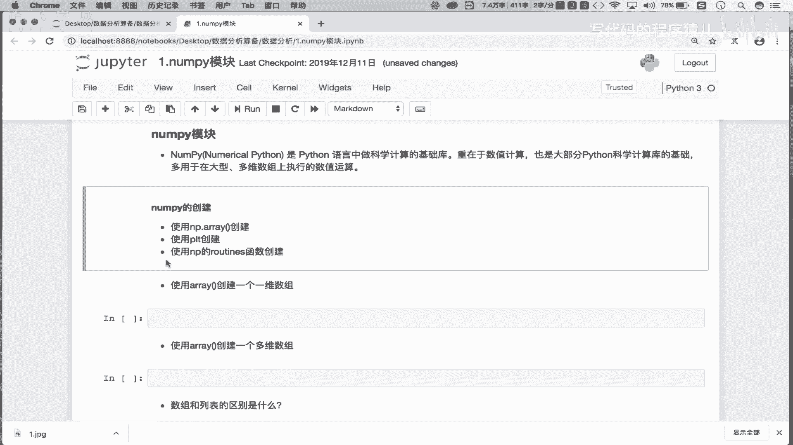

nip数组怎么创建呢，首先在这import，我们得先导入一下我们的NIKE这样的一个模块，好给它起个别名叫做NP，这个别名叫什么都行，只不过我们业界约定俗成的都叫做NP，可以吧，下次再提到NP。

它所指的就是nip模块，那一提到nip模块，它所指的就是需要创建一个，一维或多维的一个数组吧，OK吧好那模块导入之后呢，那么接下来咱们就需要去创建数组了吧对吧，创建我们的nip数组，那这个nip模块。

需要我们自己单独的去安装或下载吗，不需要，因为我们只需要安装好UNACCOUNTER，这样的一个集成环境，集成环境当中就已经帮我们集成好了，各种各样的这个模块都已经给我们装好了吧，对吧。

就不需要去装了啊，好那模块导入之后呢，在这呢我们去创建一个什么呢，一维的数组吧，怎么创建呢，NP点array，调一下array这样的一个什么呢函数就可以了，那array怎么用呢，如果不知道怎么用的话。

咱们可以按一下shift加tab对吧，打开array这样的一个函数或者方法，它的一个帮助文档吧，那这块的话，我们就会知道它需要传入这么几个参数吧对吧，那么每一个参数所表示的含义是什么呢，点一下加号。

他就会告诉你是吧，每一个参数所表示的含义是什么吧对吧，都会有一个大致的一个介绍，OK吧，那这怎么去用呢，首先参数一是谁呢，参数一是object，object表示的是我们的数据源。

那就是说我们如果想创建一个一维数组的话，我们需要往这个一维数组里边，是不是放一组数据啊，放谁呢，比如说我放一个123可以吧，123这是参数一，参数二是我们的d tape表示的是类型，那第一type好。

我就让它等于一个什么呢，等于一个某种形式的数据类型吧，OK吧，那么这个DETAPE所表示的是谁的数据类型呢，是我们nip数组的数据类型，还是数组里边所存放数据的数据类型呢，OK吧，那这我就说一下。

它所表示的一定不是我们数组的数据类型，因为我们数组的数据类型一定是固定的，你比如说我列表对吧，列表的类型一定是指定好的吧是吧，谁是可变的，列表当中所存放的列表元素的类型是可变的，是不是。

那放在数组当中也是一样的，所以说这个DETAB，表示的是我们的数组元素的类型，那我可以先不给它赋值，不赋值的话，d tape会有一个默认值，会有一个默认值，默认值表示就是说我传入的数据。

初始原始的类型是什么，那么我的数组元素的类型就是什么，OK吧，那我先使用默认的DETAPE吧，对吧好，我叫做error等于，那么意味着我使用error这样的一个变量去接收，error这样的一个返回值吧。

对吧好，那在这的话我们就可以在这干啥呢，在这儿打印一下error，挡一下返回值，看它返回的是什么吧，走你看返回的是这样的一个形式，那么这个形式对应的返回值表示的。

就是说我们创建好了一个一维的nab数组啊，创建好了一个一维的NP数组，那么在我们的cell当中，你如果想打印某一个变量的值，是不需要写print的，直接把变量的名写到cell当中，按下这个执行的快捷键。

就可以显示出我们打印变量所对应的一个内容。

OK吧，那这块的话我们就创建了一个一维的数组吧，能创建一维数组，照样可以创建什么呢，是多维数组啊，怎么创建呢，NP点error可以吧，好那数据源我给他传一个二维的列表，123好，是不是列表套列表456。

那现在我的这个error，数据源对应的是一个二维列表，那么意味着我创建好的。

一定是一个二维的数组吧，走看一下现在所返回的是不是二维数组啊，它是由两行三列组成的吧是吧，你要知道一维表示的是一条线，二维表示的是一个平面吧，是不是一个平面就是一个。

你看我们的表格可不可以表示一个平面呢，可以吧，那表格是不是由行和列组成的对吧，那所以说现在所返回的两行三列，这样的一个平面，意味着它所表示的就是一个二维的NB数组吧，对吧。

所以说在这我们就可以通过调用array，这样的一个方法，去创建一个一维的或者多维的奈维数组吧，当然你也可以创建一个三维的，五维的十位是不是都可以啊。

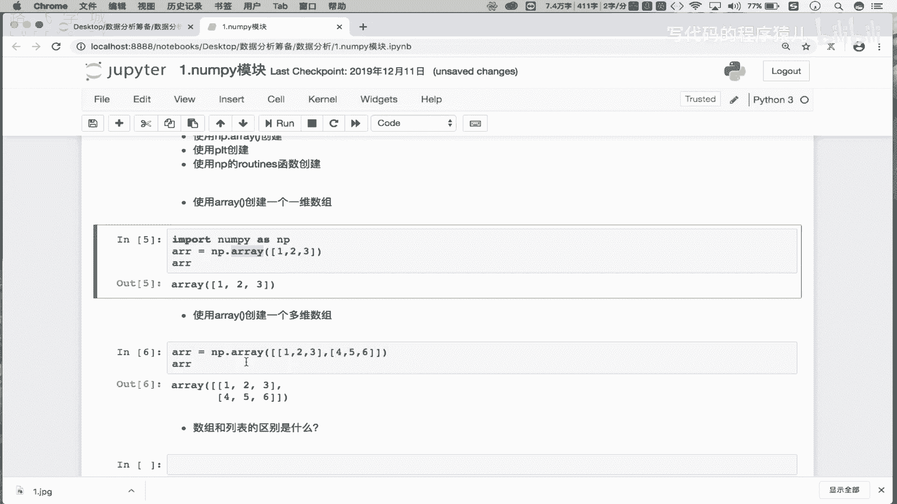

但是通常情况下我们用的最多的就是什么呀，一维的，二维的和三维的，因为维度再高的话，就不便于我们人类的一个理解了，OK吧好，那现在我们知道如何去创建一个，一维或多维的NP数组了，我们已经讲解了一种。

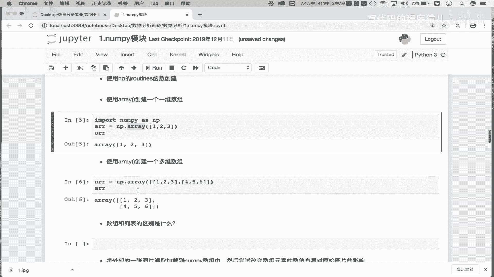

一种创建NP数组的形式了吧，对吧好，那现在呢，我们掌握了这种初步的数组创建的形式之后，接下来我们来看一个问题，那么这个数组跟列表到底有怎样的一个区别呢，对吧，我们说数组可以是一个特殊的列表。

或者说列表也可以是一个特殊的数组吧，那么列表跟数组之间一定是有区别的，区别在哪呢，我们来试一下，你看np d r array好，我再次创建一个数组吧是吧，好一二点啊，2。2好，再写一个three。

OK吧，那现在意味着我所创建好的这个数组当中哈，它存放了三个数组元素吧，这三个数组元素的类型都不一样，是有整型浮点型跟字符串类型啊对吧，那现在我创建好数组之后，我来打印一下，看一下创建好的数组。

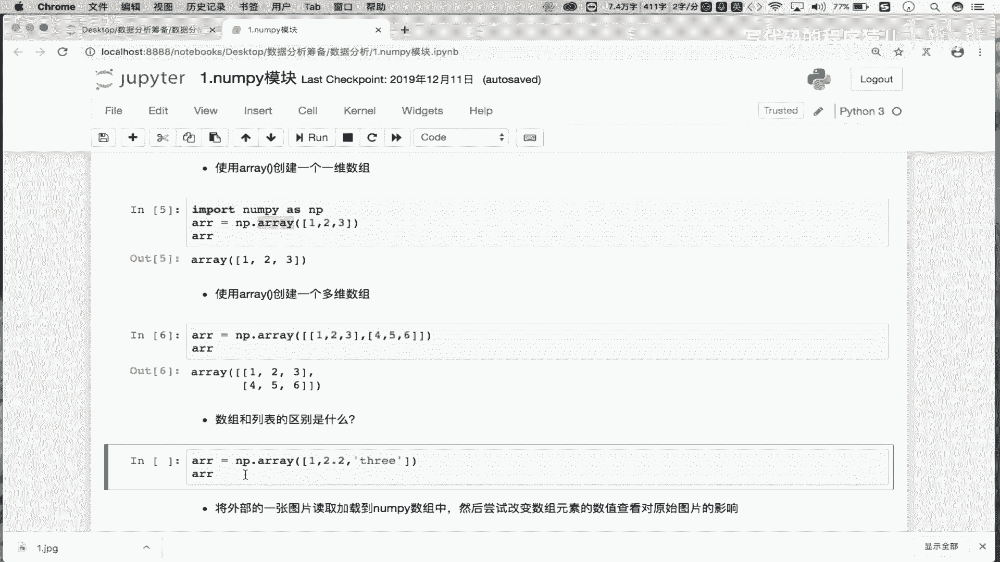

它的数组元素的类型到底是什么吧，走执行会发现，那这儿给我返回的这样的一个数组，元素的类型统一都被强转成了字符串类型吧，对不对，你会很奇怪的发现哎，明明我原始的数据既有整形，也有浮点型，也有字符串。

为什么最终都给我强转成了字符串类型的，那这种情况在我们的列表当中会不会发现呢，不会发生吧，因为我们知道列表当中的列表，元素的类型可以是不同类型的吧，那在我们的数组的演示当中，你会发现翻译什么呢。

发现我们在这块会发现，这个数组中存储的数组元素类型，必须是统一类型的，不是不可以是不同类型的数据啊对吧，如果你原始的数组元素类型是不同类型的，最终一定会给你强转成同一类型的吧对吧。

那为啥会强转成字符串呢，比如说我这如果没有字符串类型，看一下没有字符串类型会转成什么呢，走不都转成了浮点型啊，那么意味着在这儿，我们的数据类型是有优先级的吧是吧，数据类型是有优先级的。

那意味着我们的字符串它的优先级大于谁呢，我们的这个浮点型对吧，浮点型大于整形吧，OK吧，那就意味着如果啊，你原始的数据当中有字符串类型，那么最终都给你转成了字符串类型的数据吧。

是吧，如果没有字符串，有浮点型都转成浮点型，如果字符串也没有浮点型，也没有，最终都转成了整形吧对吧，那这个就是我们的列表跟数组的一个区别，OK吧，列表跟数组的一个区别好，那这块呢我们有了一个体现。

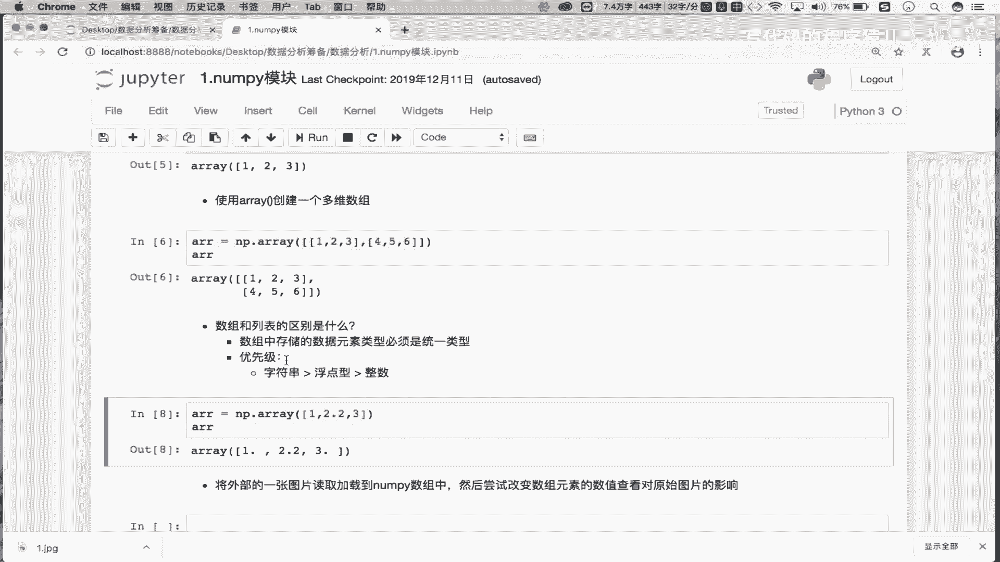

那么接下来我们再来看一下什么呢，看一下我们的这个nip数组。

另外的一种创建形式，好在这我们有一个需求，我们说需要将外部的一张图片读取，加载到nip数组当中，然后尝试改变数组元素的数值，看一下对原始图片的一个影响，OK那我们说这个nip数组它是一个容器，对不对。

容器容器里边势必是要装载数据的吧对吧，那你想一下不同容器所装载的数据，会对数据有怎样的影响呢，你比如说我们的列表是容器对吧，我们的字典也可以表示容器吧，那我们的数组又可以表示容器，对不对。

那你会发现不同的容器所装载的数据，对数据的组织形式是不一样的吧是吧，你会发现列表是对数据进行列表，元素形式的组织，而我们的字典是对我们数据进行键值，对形式的组织吧，并且你数据装载到不同的这个容器当中。

那么最终我们可以基于容器原始的特性，对数组进行不同形式的操作吧，对不对啊，你比如说我们的列表，是不是已经帮我们封装好了，相关的属性和方法，可以帮我们数据进行某种形式的运算，对不对，包括字典也是一样的吧。

OK吧，所以说我们的数据装载在不同的容器当中，那么这个容器所具有的特性，就可以对我们容器当中所装载的数据，进行不同形式的处理吧，OK吧，那在这的话，我们重点所学习的就是我们NIKE数组这样的。

一个容器是吧，看它有怎样的特性，那么基于这些个特性，可以对我们装载在数组当中的这些个数组元素，可以进行哪些形式的不同的处理，是不是OK吧，那这儿咱们就来看一下。

怎么将外部的一张图片装载到NIKE数组当中呢。

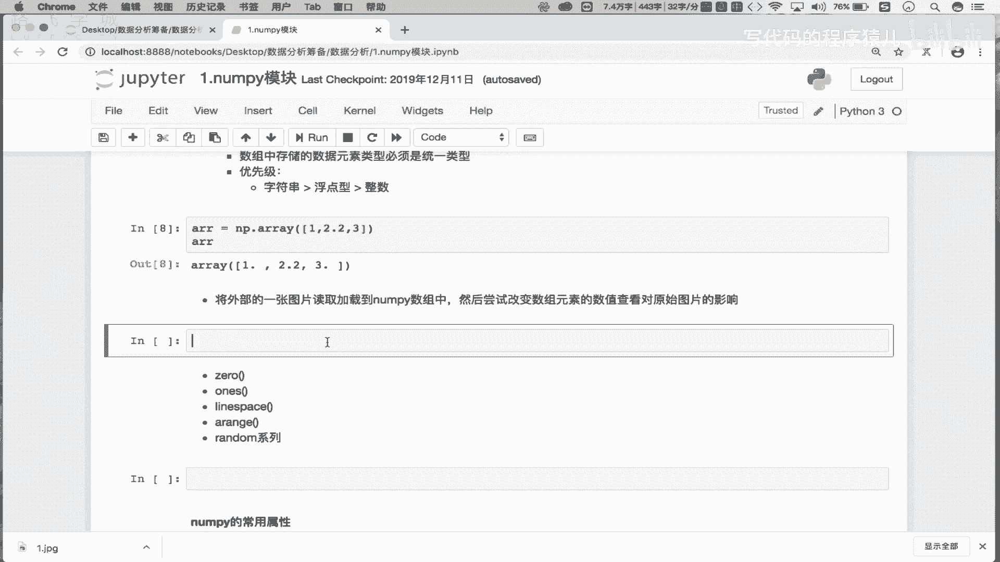

OK吧，你看在我当前目录当中。

有一张图片叫做一点cop j，可以吧，我就将一点QPZ，它的图片内容读取到我们的NP数组当中，那我们知道那图片本质意义上来讲，它是由二进制数据构成的吧对吧，它是由BS类型的数据构成的啊。

那么所以说BT类型就是二进制类型吧，二进制类型的数据也是数值型数据吧，我们是可以把它装载在我们的NIKE数组当中的，是不是是吧，那怎么去玩呢，首先我们在玩这个操作之前，我们得先接触另外的一个模块。

叫什么叫做plant lib，它是我们三剑客当中的最后一个模块，OK吧，那这个我们到后边会系统的去讲，那现在我们就先来初步的去使用一下啊，使用一下，第二，Plot i s p l t。

那我们把这个might play lip模块导一下，并且给它起个别名叫PLT可以吧，是吧好，这是别名，那然后呢PLT点调一个方法叫做i m read，是读取啊，读取谁呢，在当前目录下。

有一个叫做一点JPG的一个图片文件，是不是我给它进行一个读取，那这个MR的读取完了之后，会将读取的数据给它放在一个nip数组当中，那在这的话我们可以接受一下叫做image杠array，可以吧。

那这个image跟array，就是我们的这个ray的所返回的什么呢，返回的这个数组啊，返回数组，那么这个数组中，装载的啊，数组中装载的就是谁呢，就是我们的这个图片内容，是不是呢，咱们在这查看一下。

打印一下image error吧对吧，走看一下。

现在这返回的是不是一个NP数组啊对吧，是几维的NP数组啊，是几维的，看一下这是不是三维的难民数组啊，为啥是三维。

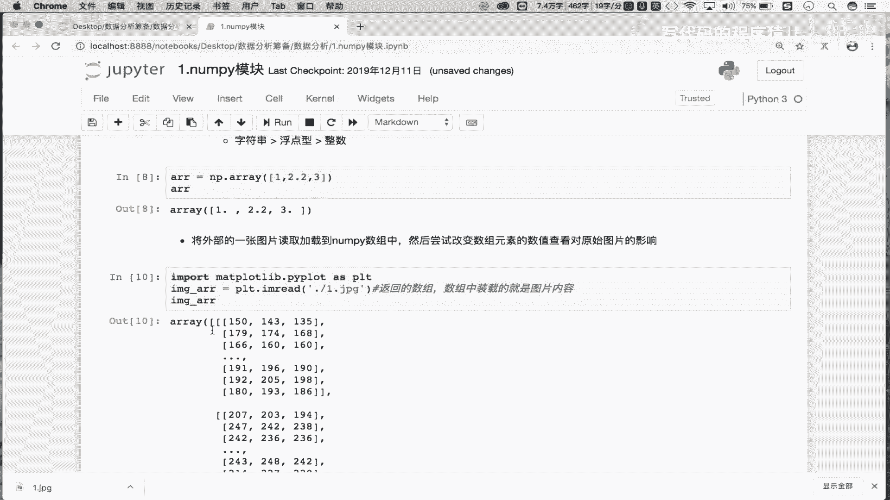

你看一维的NP数组是不是只有一个中括号，对不对，我们之前所打印的二维的NP数组。

是不是两个中括号对吧，那三维的nip数组一定有三个中括号了，是不是，所以说这返回的是一个三维的NP数组，那这里边所存储的数据，就是我们读取出图片所对应的数据吧，OK吧好。

那么这个三维的NP数组表示的是图片数据，那么这个图片数据我们可以给它进行显示，i m show好，将读取出来的image error是吧，放在M数当中进行图片的显示走。

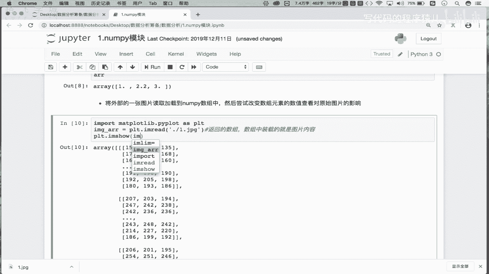

看结果这块是不是把图片读取到坐标系当中了，对不对，所以说这块m show表示的是说将什么呢，将nip数组进行可视化展示吧对吧，那刚好我这块的NP数组，所存储的就是一张图片数据啊，我把图片数据展示出来。

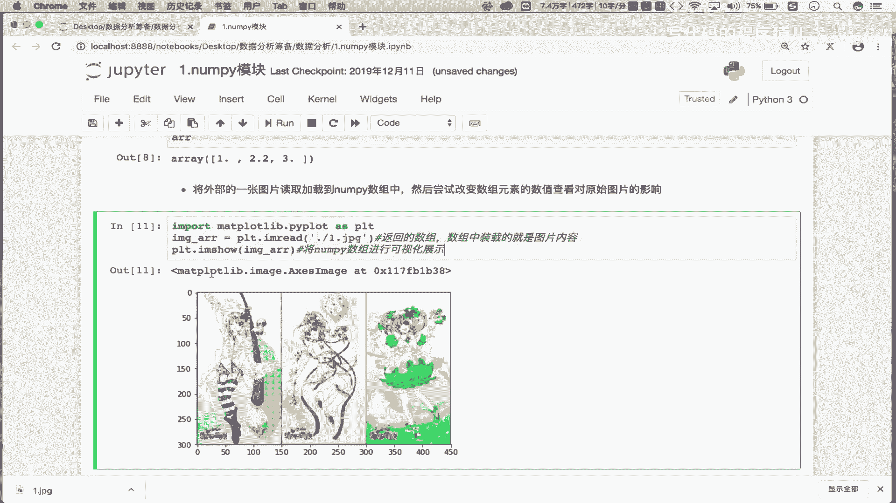

不就是看到原始的图片了吗，OK吧那我们看一下，现在我们知道这个image啊。

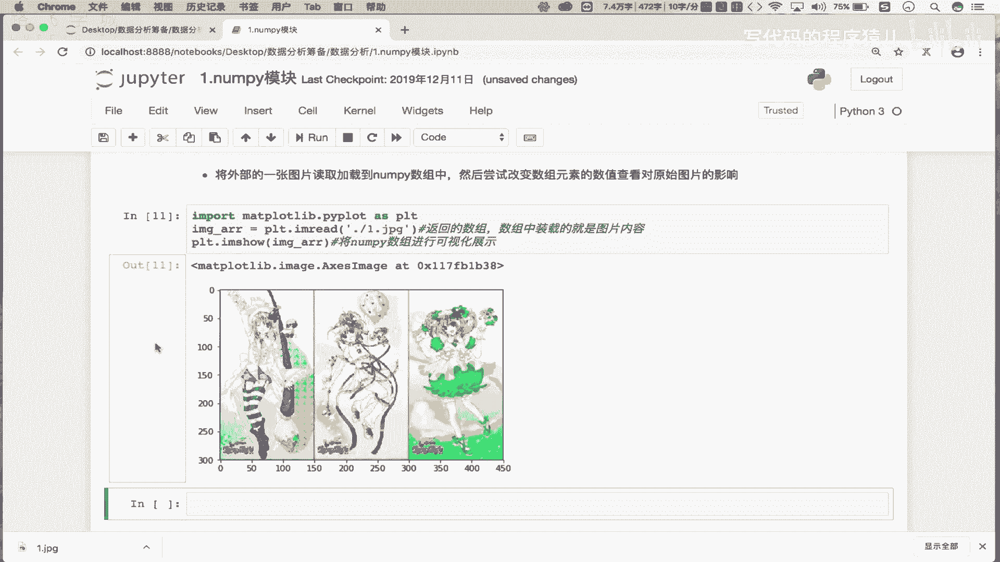

image error里边存储的是我们原始图片的数据吧，那如果我在这让image error让他加，让他减等于一个，100对吧，啥意思呢，让数组名减等于100所表示的。

还就是说将数组将每一个数组元素都减去一个，100吧对吧，那最终哈最终我们在p LT d i m show，是不是再展示一下in mazr是吧，现在这个image error。

当中存储的还是图片的原始数据吗，不是了吧，因为我们在这是将图片原始数据进行了一个，数值的相减的操作啊对吧，那对图片原始数据会产生怎样的影响呢。

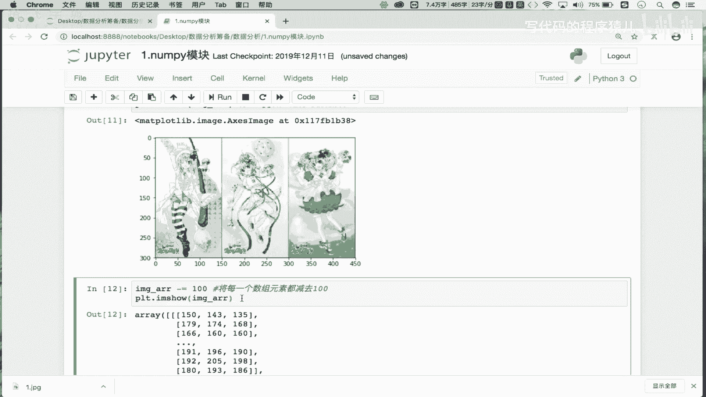

看一下仔细看一下啊，好，那在这的话，我们执行他这给我们报了一个错对吧，这个减等于啊减等于有问题啊，那这的话我们就让他。

减去一个100OK吧。

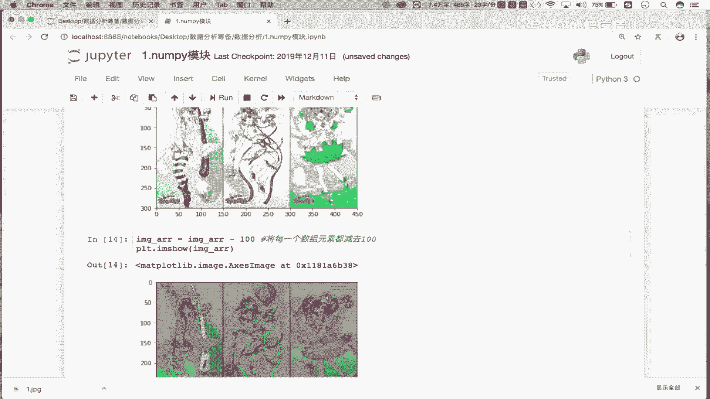

那看一下，那现在我们再次显示这张图片，你看这张图片跟原始图片。

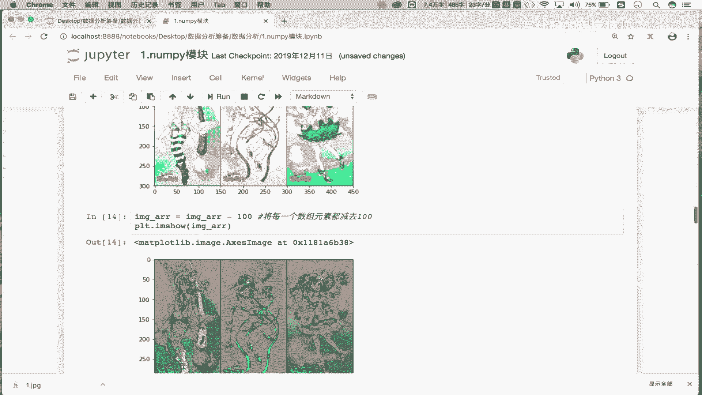

就有一个很明显的差异了吧，这个差异就源于我们在这儿将图片的原始数据。

都减去了一个180OK吧。

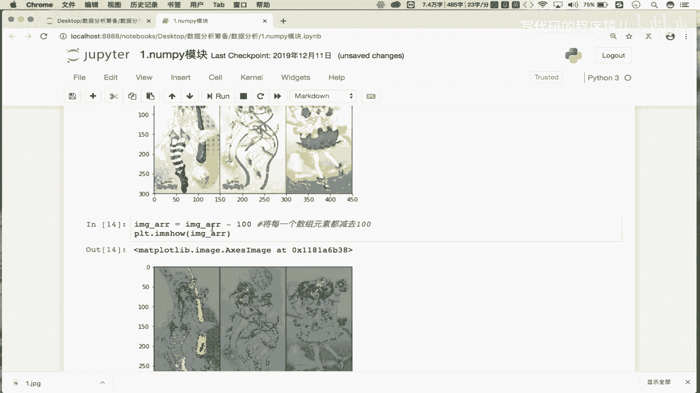

所以说你会发现，你看现在我们貌似是对图片做了，某种形式的处理，是不是你想，比如说咱们之前所用的美图秀秀对吧，用的一些个修图软件，他们为什么就可以对图片进行某种形式的，这个处理呢对吧，处理的本质的原理。

不就是在对图片的数据进行某种特定形式的处，理和运算吗，对吧，比如说你想瘦脸，怎么瘦脸呢，你一定是有一个固定的算法，它可以将图片当中的脸部的数据进行一个指定，然后对它进行某种形式的算数运算。

就可以达到一个瘦脸的一个效果吧是吧，所谓的瘦脸效果也是对我们整张图片，脸部的数据进行了某种形式的处理和运算。

是不是OK吧啊好，那这块的话，我们知道在这使用m read，可以给我们返回一个什么呢，nip数组吧对吧。

并且数组当中的内容源于外部的一张图片，是不是OK吧，所以说你看第一种方式叫做error。

它可以帮我们创建一维或多维的内维数组。

第二种方式叫做m read，它可以帮我们返回图片所对应的一个，多维的NP数组吧。

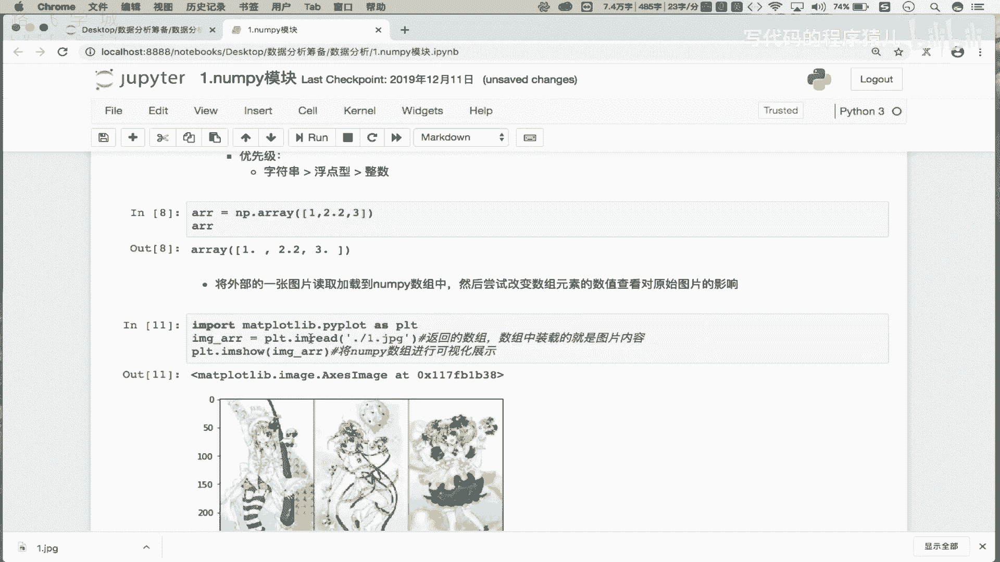

OK吧好那最后一种创建数组的方式啊，就是我们这块所列举的这几个方法啊，那意思是一下NP点什么呢，NP比如说我NP点一个once吧，once看一下once需要传什么参数，这首先需要传一个什么呢。

传一个sheep是吧，sheep sheep啥意思呢，sheep表示的是形状的意思吧，OK吧，比如说我这写一个三次啥意思，那么意味着我想创建一个形状为三四的，一个nap数组。

那三四表示的是三行四列的意思。

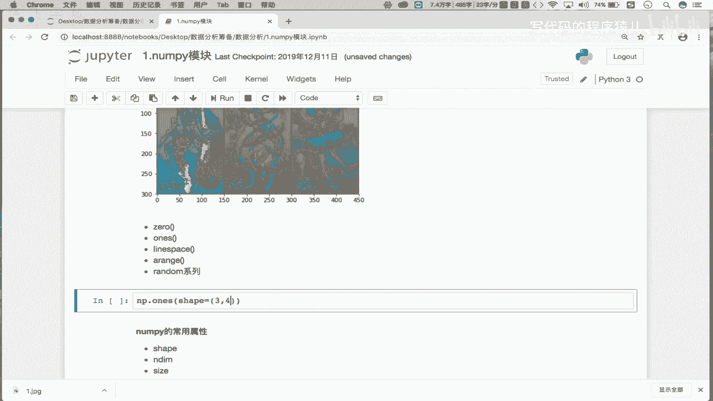

OK吧好我们试一下走，你看这所返回的是不是一个，三行四列的二维数组啊，并且二维数组当中，内部所填充的这些个数组元素都是一，是不是都是一吧，OK吧，那显然zero填充的都是零了，对不对。

好这个zero跟once我们用的不多啊，我们重点从LSPACE开始啊，LSPACE开始np d r lin space好，这需要传什么参数呢，首先第一需要传一个start好，我就从零开始stop。

从100结束好，第三个参数叫做number吧对吧。

number我让他等于一个20好走，你看这返回的是不是一个一维数组啊，110位数组啊，数组元素有20个吧，那就意味着number表示的是返回数组元素的个数，是不是，那last space啥意思呢。

你会发现每两个元素之间的差是固定的吧，那么意味着它所返回的是一个什么呢，是一个一维的一维的，等差数列，啊一维的等差数列所对应的一个数组吧，返回的只能是一维的，不能是多维的，OK吧好。

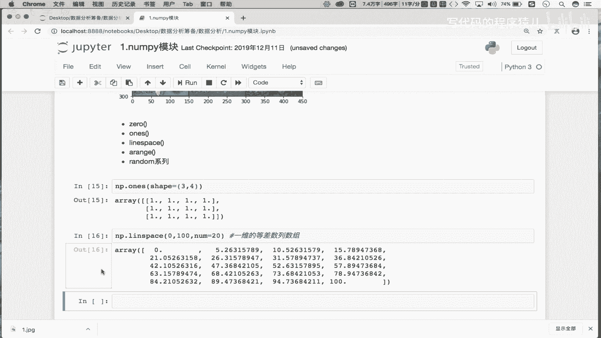

这个是我们的LSPACE，除此之外还有一个叫做arrange吧，Np d r arrange，range好看。

它的参数参数一啊，是一个start吧，好从十开始吧，参数2stop到50结束吧，好参数三叫做step，是不是是step是步法的意思啊对吧，step然后等一个二好看。

它返回的是啥走现在返回的是不是从10~50，每隔二所对应的一个数值啊，对不对，那它所返回的是不是也是一个什么呢，等差数列啊对吧，返回的也是一个一维的等差数列啊。

只能是一维的，你会发现这块的，我们的less space跟位置，返回的都只能是一维的数组吧，而zero跟once它里边都会有一个sheep的参数，sheep可以指定维度，是不是啊。

所以说zero跟shift可以返回一维的，也可以返回多维的，而我们的less space跟arrange只能返回一维的。

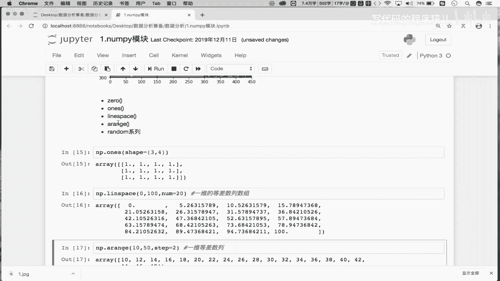

对不对，最后一个random啊，random random是随机的意思啊对吧，那这我们来试一下np d r random，点random int啥意思呢，我们让它返回一个什么呢，随机的数组。

什么叫随机数组呢，看一下它的参数参数，1low最小值吧，从零开始好，high是不是最高值啊，到100结束好，这里边呢有一个size是不是好size，size跟我们的sheep是一样的，指的是形状。

比如说我这写一个五三，什么意思，就表示是五行三列吧，那么意味着，现在给我返回一个五行三列的二维数组，数组的元素是从0~100之间的随机数，是不是呢走你看一下再执行走，你又变了吧。

是不是每一个数组元素都是从0~100根，的一个随机数啊对吧，这个是返回的是一个我们的一个呃随机数，随机的一个啊多维数组吧。

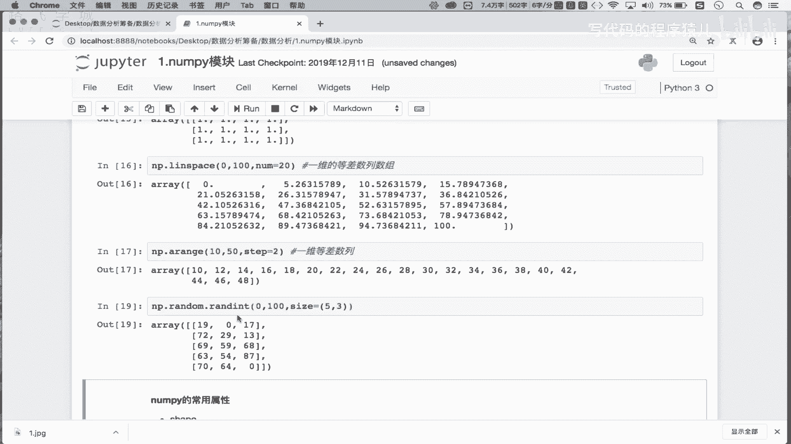

OK吧好，那所以说，现在我们通过这这几个函数的一个介绍。

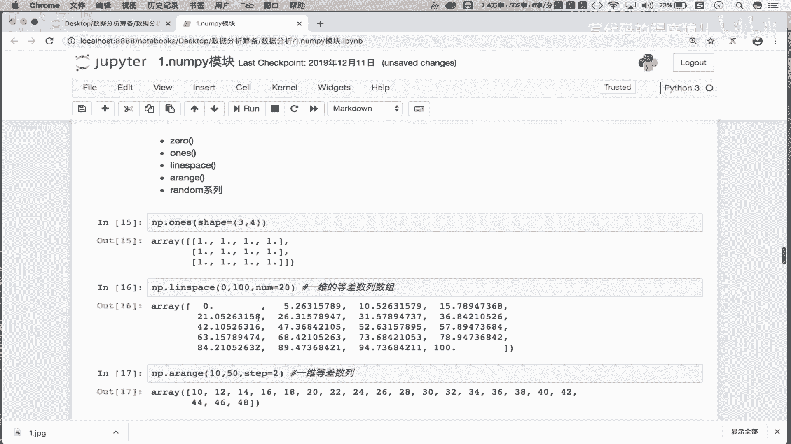

意味着通过这样的几个函数，也可以帮我们创建一维或多维的NP数组了吧，那么至此的话，咱们就有三种方式创建IP数组。

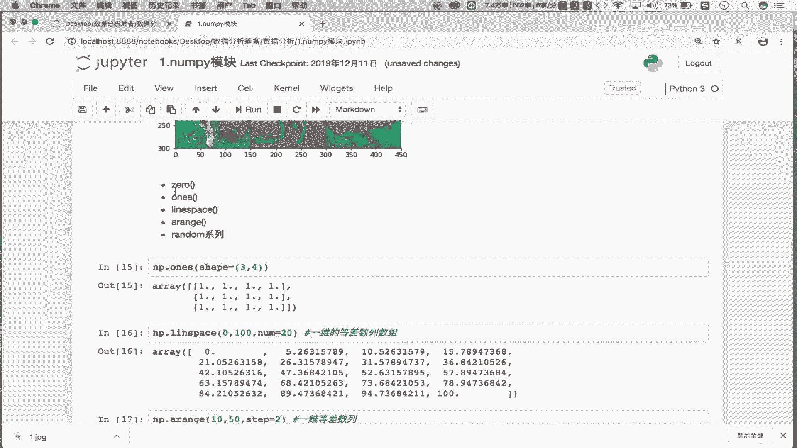

这是第一种方式，不是第二种方式是我们的什么呢，叫做m read返回的图片对应的NB数组呗。

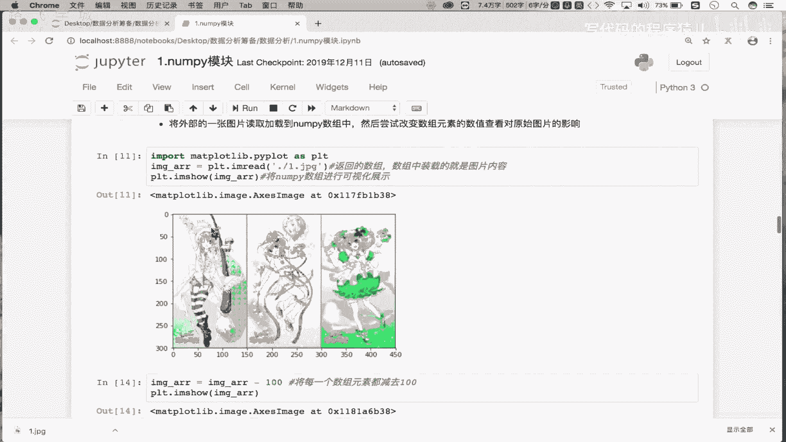

还有第三种方式就是我们的什么呀。

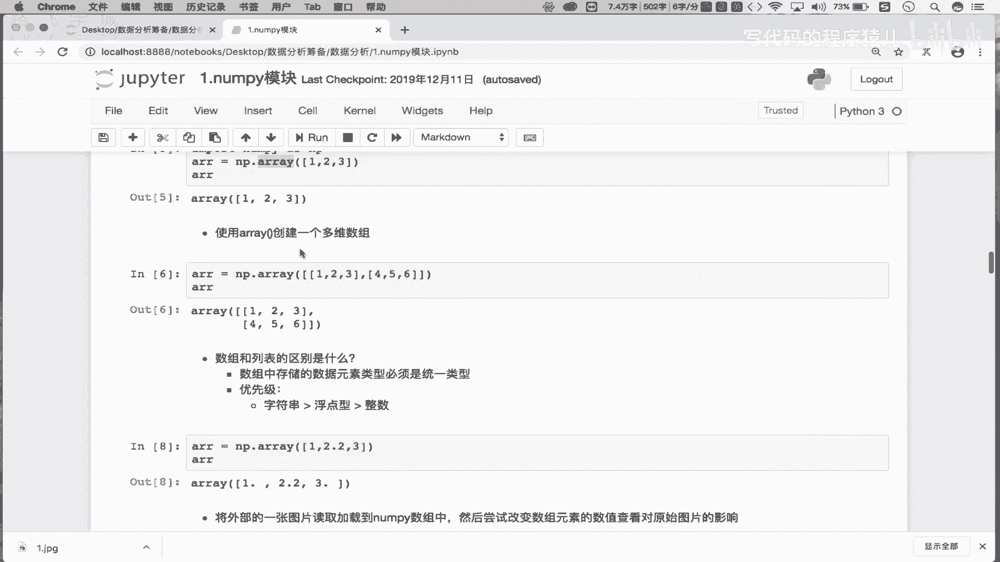

array给我们所返回的NB数组吧对吧，那么这几种方式都可以给我们返回nap数组。

OK吧，那么至此的话我们就可以去创建nap数组了吧。

nap数组你可以创建出来，接下来我们才可以去使用它吧。

OK吧，并且目前你会发现，我们在这所创建的这些个NT数组里边。

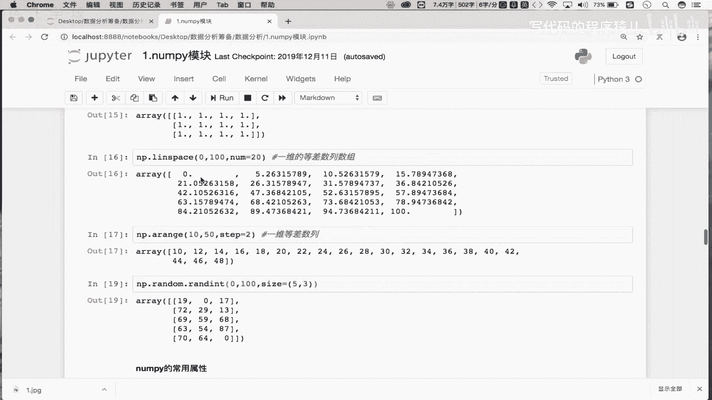

所存储的数据都是数值型的数据吧，对不对。

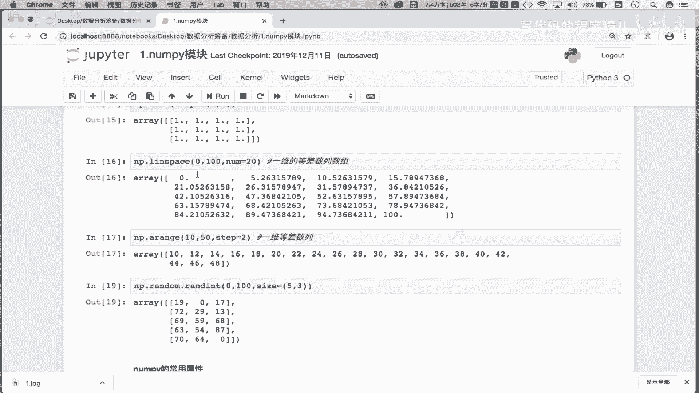

OK啊。