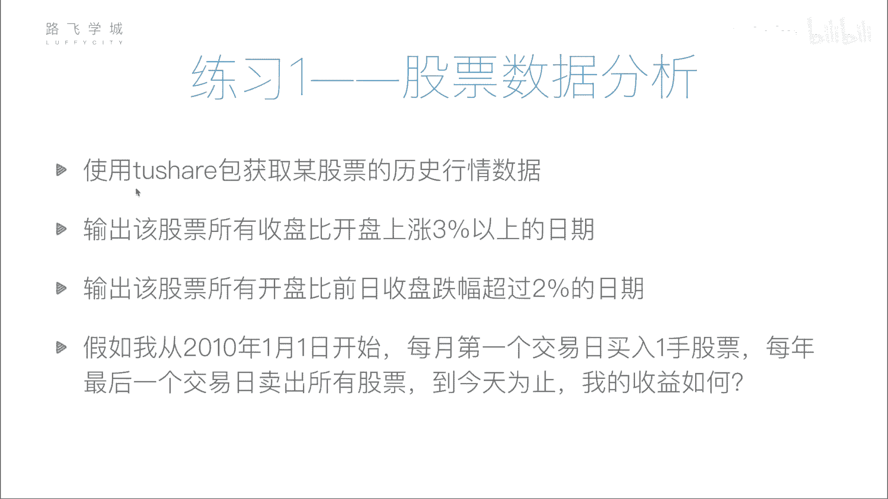
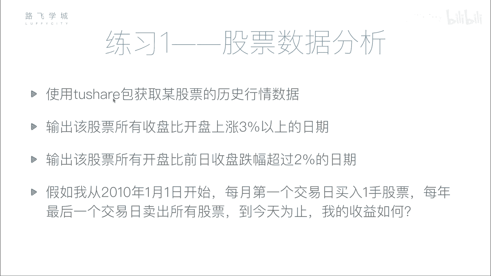
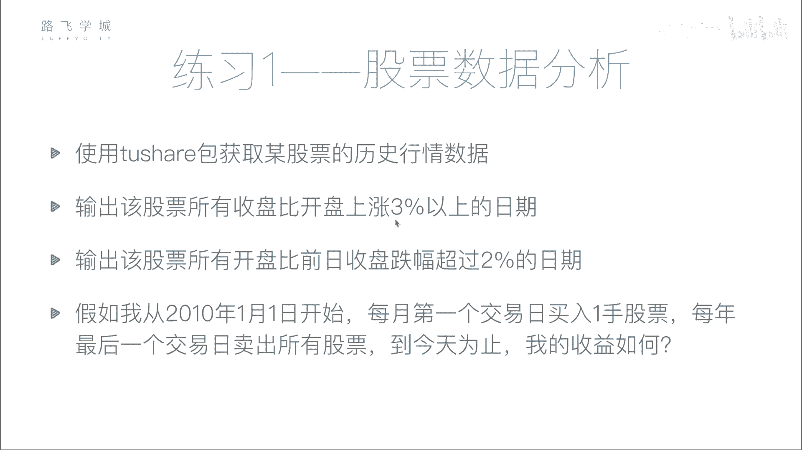
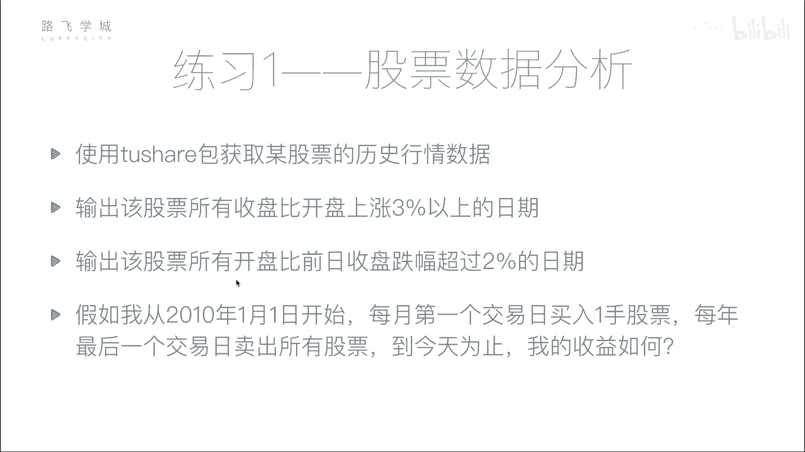
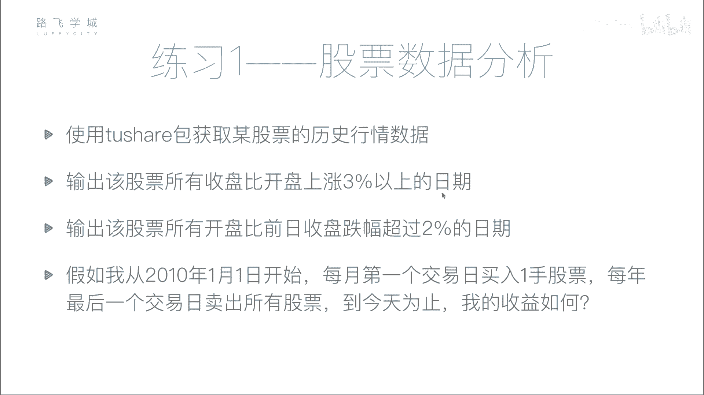
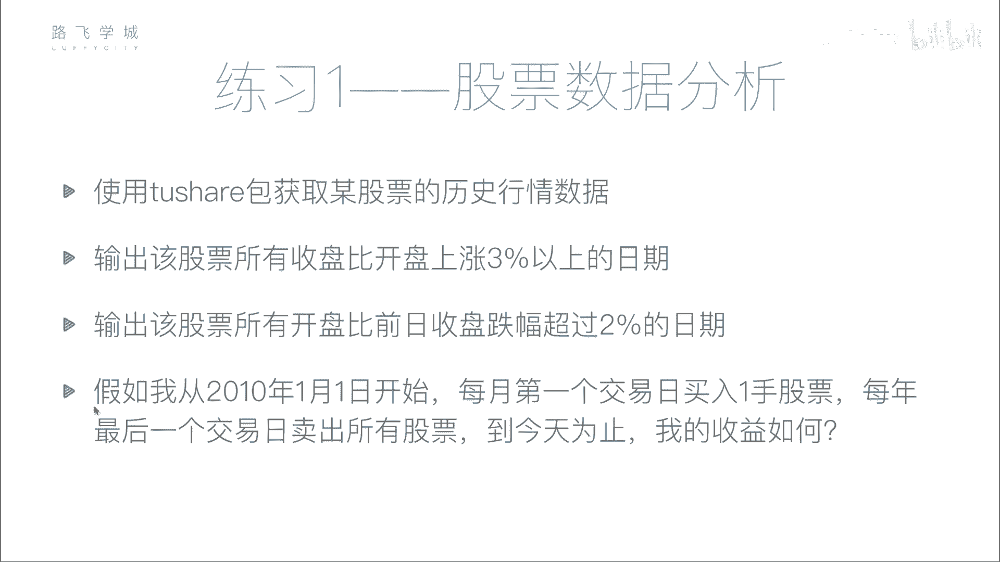
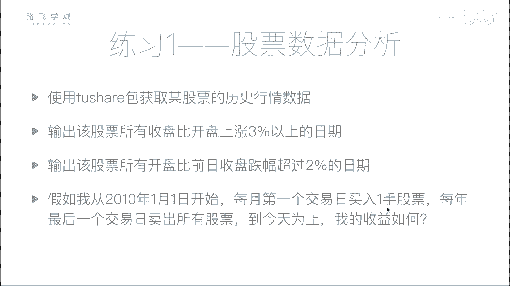

# 【2024最新系统课程】用Python开发金融量化与股票分析交易平，实战项目70集，学完做项目！ - P40：40 股票分析作业说明 - 少川plus - BV1ptDWYzEWG

好同学们，那我们接下来做一个练习啊，就是做一些金融的分析啊，首先我们刚才给大家说了那个to share包，对不对。

大家做了这么几件事，第一个你先用to share包获取掉某一只股票啊，是哪个哪个都行，把获取它的历史行情数据，就是从他这个上市其实也不用，你可以从取一个近的人，比如说08年或者是10年都行啊。

开始就是它的历史行情数据全部爬下来，存到一个CSV文件里备用，因为我们每次我们每次都去，如果每次都去调它的接口的话，会比较慢，所以不是存在本地啊，好第一个，第二个从这个这就是这些数据爬下来之后对吧。

我让你获取所有啊。

就是收盘比开盘上涨3%以上的日期，就是哪些天，这个股票是涨涨的幅度大于3%的哦，啊，把这些日期给我返回到一个列表或者数组里啊，这是第二个题，第三个第三步啊，什么呢，获取所有开盘比前日收盘的跌幅超过2%。

这这个是自己比自己。

第二个是就是同一天的收盘和开盘比啊，上涨超过33%，这个是自己比，当然大家可以试试用什么布尔型索引，一下就出来了。

这个不一样的，这个是这一天的开盘跟前一天的收盘收盘啊。

这个大家可以先试着写一写啊，因为有一个之前有一个函数没有给大家讲，叫shift函数，你也可以查一下好用，它的话也是说就是比如说这一天今天开盘，今天九点比昨天收盘，比昨天四点的时候跌了超过2%。

就一开盘就跌了2%，把这些日先输出出来好，第三问，第四问，其实前面三问都是一个相当于是初步的分析，当然我这个出的题比较简单了，实际上你要根据各种指标来做啊。

当然指标我们现在没有讲啊，就先做一些简单的就是涨幅，跌幅你把它输出出来好，最后一问是一个简单的策略模拟是啥呢，假如我从10年1月1号开始。

每月第一个交易日买一手嗯。

啊每年最后一个交易日把所有的都卖了，就抛出啊，就1月1号买一手，我看可能不是一号，1月1号应该放假，你可能1月4号买一手，一手至少100股，一手买100股，2月买100股，3月买100股。

4月买到12月11号买100股，然后12月31号可能不是，12月31号就是最后一交易日啊，你要考虑到就是有不交易的时候，把所有股票都卖了，那么到今天为止，今天是多少，17年12元。

随便大家就是你学习的时候，那天为止啊，你赚了多少钱还是赔了多少钱，嗯啊你可以假定说假定你刚开始有一个亿啊，随便了，你的收益就是说你假定你的钱是无限多的，反正你就照着这个策略买啊。

当然这个策略估计哎你说好还是坏呢，其实我也不好说嗯这个策略没有任何道理啊，就是纯粹是一个简单的不能再简单的策略啊，就是但是先给大家，在没有讲任何的金融策略知识之前，先练手，就是这样来做啊。

那说一下你抽一率就是你赚了多少钱，然后你就是就输出你赚了多少钱就可以啊，不用管收益率，就是输出你赚了多少钱，你的股票啊，那最后就是你的收益怎么算，比如说你现在是这个可能是没有，到最后都卖出去你的钱。

你现在的钱减去你之前的钱是你的收益，对不对，你最开始的钱其实就是你最开始的现金，那你现在的钱实际上是包括你现在的现金，再加上你现在股票里的钱，那你股票里的钱有人说怎么算股票的钱。

你可以比如说你按照当天的开盘价来算，我们不知道收盘价，我们按照当天的开盘价来算，或者你按收盘价其实也行，差不了多少，你按当天的开盘价乘以你这只股票的数量，就是你股票的价值，那再加上你的现金。

就是你现在的钱减去之前的钱，就是你的收益就是赚了多少钱，好，就这意思，那这个作业大家可以试着自己做一下，那做完的话可以看我们下一个视频，那下一个视频里。

