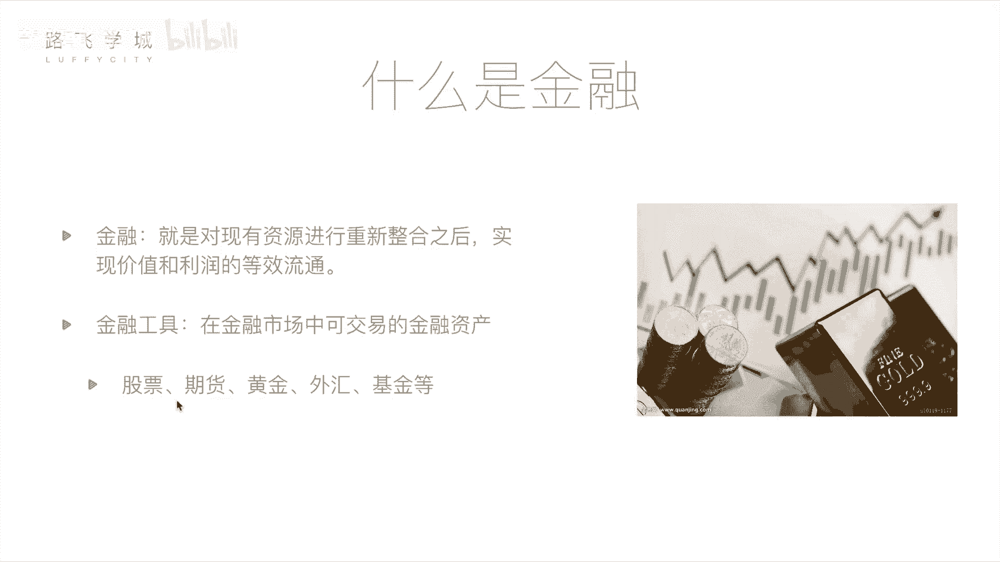

# 【2024版量化交易】全B站最实用的金融分析与量化交易实战课程，整整100集，3天从入门到项目实战，学完即可做项目，少走99%的弯路~ - P1：01 金融量化分析-基本金融知识介绍 - 敲代码的流川枫 - BV1uFCVYYETd

OK同志们大家好，我是路飞学城的讲师ALEX，这位是我们路飞学城的讲师天宇同学啊，天宇呢是清华大学的计算机系的博士啊，我是博士后，他是我的师弟，我是安保系的啊，他是计算机系的，Anyway。

那今天呢给大家讲这个金融量化与数据分析啊，就跟金融相当于计算机，当计算机跟金融结合起来之后，会产生什么样的火花，好不好，那呃先说一下啊，这个在计算机在金融领域那做呃，这个呃就相当于做量化相关的嗯。

自动化交易相关的，其实用Python程序写的比较多，是不是啊对啊，那所以呢今天我们所有的课程都是基于Python相关，OK现在呢我们就直接开始，Ok，那接下来由我给大家讲一下这个金融。

量化和数据分析相关的课程啊，那我们开设这一模块，主要是针对于两部分人群吧，啊第一部分就是对于那些有一些金融基础啊，或者说正在炒股的一些股民们，那他们可能会想哎现在这个人工智能啊，包括什么计算机啊。

互联网加这些东西都这么发达，大数据等等等等，那有没有可以，是不是可以通过计算机编程的行为，来自动化的镜头，那我可以告诉大家是有的，那这个东西就是我们接下来要讲的叫做，量化投资，怎么炒怎么美，谁跟你说的。

不要听他胡说啊啊，第二部分呢是针对那些有一定编程经验，学过我们python1些基础模，基础模块基基础知识的一些同学，但是他不懂金融对，但是他可能想诶金融这么赚钱，那我不如去炒一点股嗯，对不对。

那但是他又想把自己的这种，相当于不要盲目的去炒股，你要想把自己的这种呃这个专业技能利用起来，我会编程，但是我不懂金融，是不是不是可以自动化炒股了对吧，OK好，那我们接下来讲我们这个模块的第一部分。

就是金融与量化分析啊，那这一部分主要是介绍一些金融，包括股票的一些基础知识，还要给大家讲解一下什么是量化分析，也就是怎么样通过计算机编程的方式，来帮我们炒股好。

首先，我们来看一下什么是金融，那定义上来说，金融就是对现有资源进行重新整合之后，实现价值和利润的等效流通，这个概念看起来可能非常抽象，但是大家应该都知道金融这个行业就是花钱，对不对。

就是啊我通过一种某些手段让我不用干活，我可能最后就多了起来，也可能少了钱，对不对，这是大家生活中的一些理解，那其实我们说金融这个行业并非也不一，完全像大家说的就是一种投机行为啊，就是说我你不赚，你不干。

不干活也能赚钱，不劳而获，不是那样的啊，其实金融这个行业对于国家，包括对于其实各种个人来说都是有好处的啊，我举个例子，比如说我是一个千万富翁啊，当然我不是啊，那他是一个你你不是。

比如说我我我我我我我是一位千万富翁啊，我有钱，但是我这个钱不知道该怎么用，对放在银行里存着，放在银行的利息的一利息太少了，对对我想再多点，我想变成亿万富翁，对啊，那但你又不想干活，对，那我怎么办啊。

我也没有什么钱生钱，对我也没有什么好点子，我也没有开公司的什么办法，那我怎么办，钱生钱，但是他他是一个特别有想法的人啊，他最近创业了，搞了一个什么搬砖公司，靠搬安保公司啊，安保公司安保系的都行啊。

这个创业非常好啊，我觉得他这个点子非常好，他这公司将来一定能大卖好，那我怎么办呢，我把钱投给他，他是一个创业公司公司的老板，他肯定需要钱，他需要钱，那我的钱没有地方用去，我把钱通过金融融给他。

那他比如说过了5年十年之后，他这个公司上市发展起来了，上市了，有钱了，他之前就相当于翻了50倍，对那我们来看我10年前的这一次，我把钱给他的这一次金融行为发生了啥，首先他得到了钱，他的把公司标钱。

对他公司做大了，那我的话我把钱给他了，我你自己钱生钱，我自己肯定从他那得到了一些回报啊，我们先不讨论这个金融过程具体是怎么来的，我肯定他给要给我回报，那我自己的钱肯定多了，那其实这是一种双赢下yes。

相当于这样就刺激了呃，这个整个经济的发展，整个让钱去到该去的地，要他的地方也对好，那其实这就是金融啊，那我们平常来说，更讨讨论的更多的是一些金融工具啊，也就是在金融市场中可交易的金融资产。

那金融工具这个名词大家可能不熟悉，但是下面这几组词大家可能会熟悉一点对啊，股票期货，黄金外汇和基金，这样啊，相当于刚才他通过，刚才说他通过某种手段把钱融，就是融给我，不能白给我，肯定通过某些手段。

这些手段你就可以理解为是金融工具，其实刚才我把钱融给他的这个过程，可以理解是股票啊，我通过买他们公司的股票，股票这个概念是咱们接下来这门课程，讲的核心概念，我在这里先跳过，那我简单先说一下后边这几个。

这几个金融工具是什么意思。

期货这个金融工具来说，它相对于股票，首先说结论，它相对于股票风险很大，同时收益也很大，就说你要么赚的那个盆满钵满，要么赔的身无分文样对，那具体来说期货是一个什么呢，期货相当于他这个名词。

相当于现货这个名字，现货是什么，比如说就是大件的商品，比如说煤炭啊，煤炭有一个市场波动，今天是十块钱，明天是11块钱，后天是20块钱啊，举个例子，那你今天这个你比如说你20块钱的时候买的，买了一个煤。

买的煤，然后你等到十块钱卖出去了，你就赔钱了，也赔了，这叫做炒现货对对，如果你十块钱买进去，20块钱卖出，你就赚了呀，这叫炒现货，那期货是什么呢，期货比如说啊，我是一个这个啊发电厂公司的老板啊。

我需要煤，但是这个煤个煤炭的价格会变动耶，那我判断接下来半年之后，这个煤炭的价格从十块钱会涨到50块钱嗯，但是我如果到半年之后，用50块钱的钱价格来买煤的话，我的成本会提高，我的利润会变少。

那我不想这样，那我怎么样呢，假如说他是一个卖煤的耶，哎煤老板对，从搬砖变成安保变成卖煤的了，好他是一个卖煤的，那它觉得接下来半年煤炭的价格会跌，会从十块钱跌到五块钱耶，那他怎么办，他想半年之后卖出去。

他如果半年之后五块钱价格卖出去，我就我就按十块钱，还不如回去算，那这是他的风险，对不对，是煤炭会跌的风险，对我来说是煤炭会涨的风险好，那他的判断跟我的判断不一致啊，我碰到他了，正好我们俩人一拍即合。

也立了一份合同，什么合同呢，就是半年以后，我以现在煤炭十块钱的价格向他买，比如说买5000吨对好，那在他在他来看，接下来半年半年之后，煤炭价格会跌到五块，对那十块钱的价格买入，他每吨价格就能赚五块钱。

也对他来说是赚的，那对我来说，半年之后的价格，我预计会涨涨到20或者涨到50，那涨的话，我以十块钱的价格买入，相当于说我是赚的呀，那这就是相当于是两个人对未来这个货的价格，走向趋势判断不同。

导致的这个产生了一份期货合约，对这份期货合约也就是最终到半年之后，如果是相当于不是十块钱涨到15，我我我其实是额，相当于怎么讲，你赔了我赔了，因为我少挣了五块钱，因为我还要按十块钱卖给你，对不对对。

但是如果说到了半年之后，他真的跌到了五块钱，那你就赔了，你明明可以从市场上从其他家花五块钱，其他没看上，花五块钱买煤，但是因为我俩的合约在你必须十块钱买我的对，就是这个意思嗯，所以其实为了双方规避风险。

对大概就是这么一个，其实期货的这个具体他的高赔率还原因，还有一点它涉及到一些保证金之类的东西啊，我们这不展开了，不过多展开了，感兴趣的同学可以查阅相关资料，好黄金这个东西相对于股票来说。

它的价格比较稳定啊，就是是一种你需要保值的时候的，一种投资的选择啊，因为什么呢，我们说这个这要讲到马克思主义经济哲学了啊，黄金是自古以来的，我们叫货币啊，硬通货，那其实我们现在发行的是人民币啊。

美元也好，这个东西在经济学上的这个纸币对他一般啊，实际上之前的是这个黄金啊，因为他就是地球上存货就那么多啊，你没法，你想要多要没有，那黄金来说它的价格的波动啊，就是黄金，你看今天可能我也不太清楚啊。

可能200块钱，明天可能二百五嗯，后天可能300，然后过两天可能跌回二百五，当然没有这么多啊，只是举个例子，波动不会这么大的，它的波动不是特别大，除非出现挖出来一个特别超级大的金矿对吧。

它的价值的波动产应对第一金子的这个发掘啊，你你挖出来一个大金矿了，整个市场上金子变多了，你肯定就下课就要下跌耶，对不对，那如果整个什么市场上钱多了对，那进价就要上面对，因为你钱多了嘛，钱多了。

金子大家都想买金子嘛，但是金子就那点嘛，谁都想要金子嘛，就简单例子来说，这些钱和这些金子是等价的，对金子多了它就贬值，金子就不值钱了，钱多了金子就值钱了，对就是这个意思对啊，那这个外汇来讲啊。

外汇是什么呢，就是我们中国啊人民币和美元不是有汇率吗，一美元等于现在可能是五点几人民币，六点几，六点几吧，我可能是几年前了，六点几人民币啊，那这个汇率比如说6。3，这个1亿美元等于6。3人民币。

这个汇率是会波动的，对那今天的汇率可能跟明天的汇率不一样啊，那某些这个金融公司或者投资机构，他们就抓住这一点啊，来什么呢，来通过两种币种之间进行外汇的一些操作，来算钱。

对那补一个补充一个说汇率为什么会波动呢，啊那这个东西其实就是美国也在不断的印钱，中国也在不断的印钱，是不是啊啊，并且中国的经济也不在不断的发展，那相当于比如说中国经济，但是中国的经济5年每年增长10%。

5年就发展了很多，所以那就意味着什么呢，我们的钱会变得更值钱，因为以前就是5年内没有增发嘛，嗯对吧，但是我的经济变好了，所以创造了更大的价值，那有钱又只是那些，所以那就相当于一块钱能买个东西。

以前的购买力就大了，购买力就大了，之前一块钱只能买一个包子，现在一块钱可能能能买那个价格，包子俩包子都买一份档，但是相当于这个时候中国的货物要运到美国去，那你就要结算的时候要用这个要要要什么。

比如说我我这个东西在中国值这些钱，那到底美国算值多少钱呢，这就跟汇率，汇汇率了算对吧，这个东西大的投资公司，大的金融公司会玩这个东西，小小小散户玩这个没有意义，一般个人投资者不会因为他的波动太小了。

不会去做外汇啊，你拨动这个一分钱，你投10万进去是吧，挣十块钱没什么意义，对好吧，OK好，那基金啊，这个东西基金公司的一种产物，那举个例子啊，比如说你个人想去买股票，想去买期货。

想去买各种各样的这个金融产品，但是你不懂，但是整个市场上就是他有懂的人啊，比如说我这个基金公司，我这有十个这个呃基基金经理，那他们都懂，都懂这些金融的东西，他们有一些就是我做了10年了，做了20年了。

我这个什么给公司赚个几百万，几千万啊，我有懂这些东西，那个人我不懂，那我怎么办，我把钱交给你这个基金公司的这个基金经理，你帮我，你帮我去投资啊，你帮我去炒，然后赚的钱给我给我点，给我点，对你也厉害。

我也在那这个基金公司，他本身会吸纳各种，就是投给你这个基金的散户的钱，对那你自己就有，比如说每个人投给你10万块钱，来1万个人，你就有十分钱，对对，那这基金经理用他自己的某种策略在看哎。

我是最近炒股票好还是炒期货还是炒黄金好，他自己判断他各种各样的都可能都炒一点，然后最后可能里边有赔的，有赚的，他最后可能如果他经验真是那么丰富的话，他可能会赚一点，对对吧，那他赚的这一点哎自己留下一点。

公司留下一点，然后其他的钱分给你的某些这个散户，散户们，对你的投资者们好，那这就是个人，就说我个人给基金公司的这个钱，就叫做这个基金的金融工具好啊，这个就是常用的几个金融工具对啊。

所以基金的这个他的投资率，其实呃他的回报就是他的这个风险比股票小，当然收益也比股票小，对对好，那接下来咱们重点讲一下这个金融，这几个金融工具里边最常见的一种叫做股票，股票。

