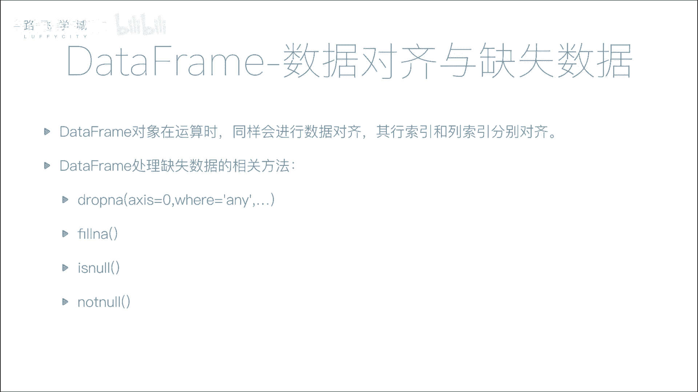
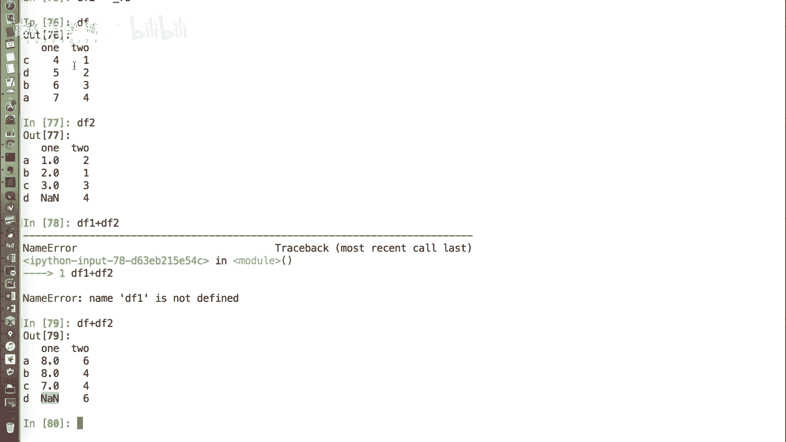
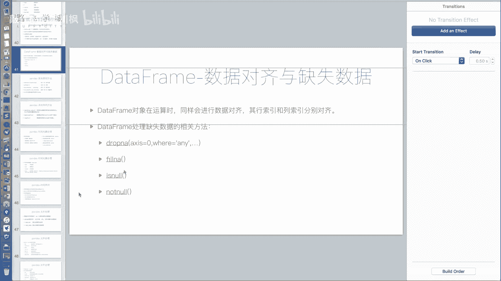
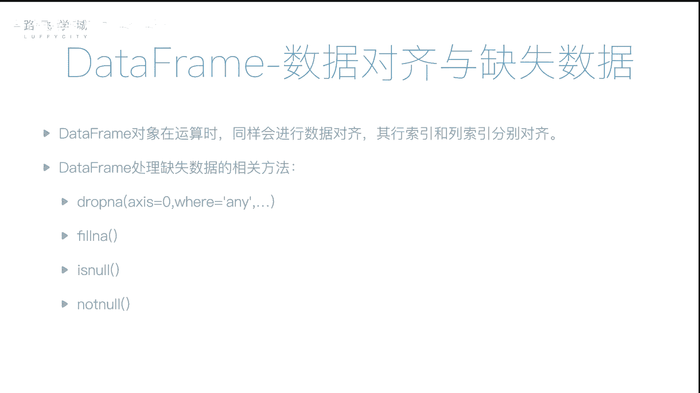
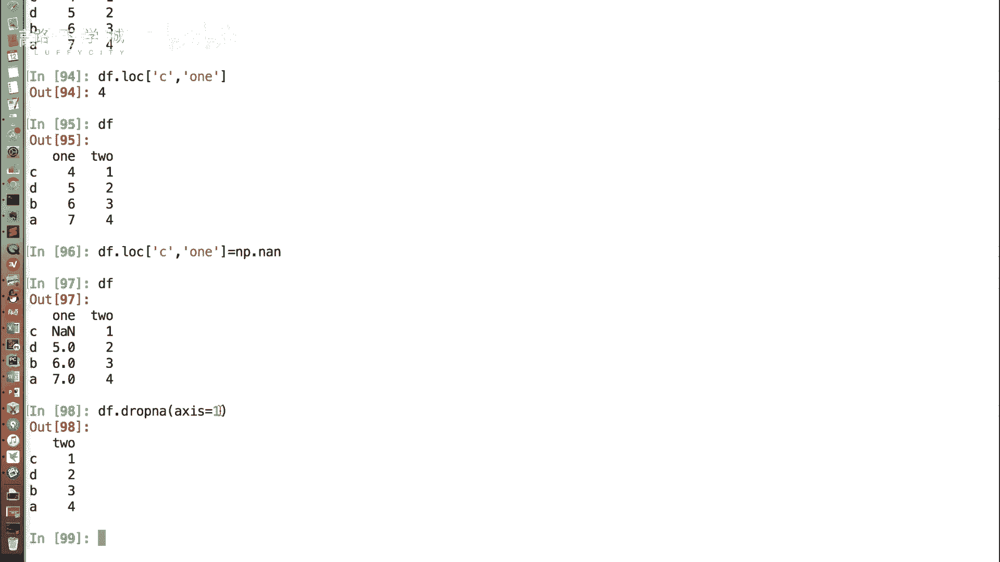
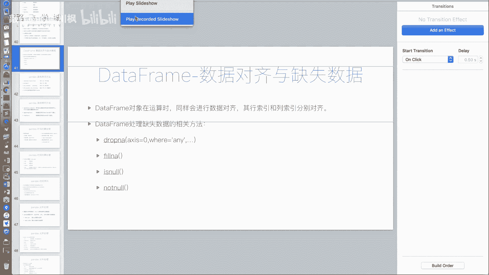
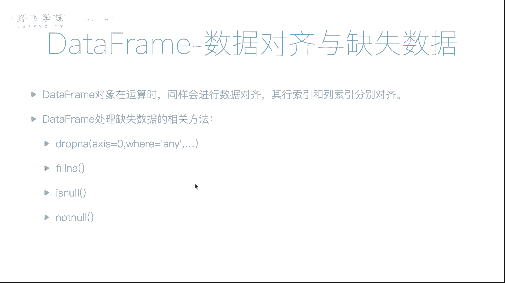

# 【2024版量化交易】全B站最实用的金融分析与量化交易实战课程，整整100集，3天从入门到项目实战，学完即可做项目，少走99%的弯路~ - P25：25 DataFrame数据对齐与缺失数据处理 - 敲代码的流川枫 - BV1uFCVYYETd

好，那我们接下来接着给大家说一下，data frame这个对象的数据对齐和缺失，数据处理的啊，一些一些功能嗯，那和我们的series对象一样，data frame也涉及到一个数据对齐的事情。

它的数据对齐，因为它有两个索引，有行索引和列索引，对不对，那么要按照行索引和列索引分别对齐。

好比如说举个例子，我这里有了一个data data分配对象，比如说我再创建一个，好我们看这有两个对象啊，他们现在这个行索引是不一样的，对不对，顺序是不一样的。

那我如果data frame df1加DF2啊，不好意思，DF加DF2，它你看它返回的结果啊，one的这个位置这个八是七，加上这个一得到的啊，那如果你看哎。

我这个data frame df2里有一个NN的值，那它加谁都是NNN嗯啊这是说对齐，有行索引对齐，但如果列的话，它也是要对齐的啊，但是我们这个两个列是顺序是一样的啊。

如果它顺序反过来，它列也是需要对齐的。

这是它的这个数据对齐，那还有处理缺失数据，它的方法跟pa跟这个series对象啊，有大部分是相像的。

有一点区别，首先是相像的，乡下的，我们看DF啊，DF2这个对象有一个缺失值，好相像的一点是什么，就是我如果把它填充上填，把这个缺失值填充上一个值，就是DF2点FNA啊，比如是零，那就填充成零啊。

这个和我们之前说的那个是一样的，不一样的地方在哪，不一样的地方，在DF2点这个drop n a，它你看我们可以看到结果是什么，结果是把D这一行删掉了嗯，那也就是说它默认的这个drop n a。

这个方法是做什么的，如果你这一行里有一个缺失值，我就把这你我就把你这一行全部删掉嗯，但是有的时候我们可能不希望这么做，因为有可能我这一行有可能有好多列，它可能只有一个缺失值，有可能其他后边数据我都需要。

那我可能需要什么呢，填充一个只，如果你这一行哎，不填充，我们已经说过了，填充在那个对feel已经说过了，都一样，我需我可能需要，如果你这一行所有的值全是缺失值，我才把你删掉啊。

比如说我DF2改造一下DF2，好我给它加几个缺失值，DC行的第二，我们把C行的to列和D行的to列都是什么，N我们现在可以看到D行，整个这一行全是缺失值，C行只有这一个值是缺失值，对不对，对不对好。

那如果我们执行就是什么都不写，执行drop a的话，C行和D行可能都没有对，但是按照如果我说只有这一行都没有的时候，我才把它删掉，那也就是说啊只把D行删掉，C行保留，那怎么写。

就是DF2点drop n a有一个how参数，how参数，传字符串all就是全部，也就是说你看all传进去的话，只有D行函数，也就是说你只有这一行，所有的都是NL才把你删掉，嗯啊这是全部。

那它默认的参数是any啊，默认参数是any，如果你传any进去的话，和不传是一样的好，这是这是这一个，那还有一种，比如说我有可能是什么呢，啊当然一般情况下，我们我们都是拿这个一列作为一个属性。

拿一行作为一条记录，和我们的数据库保持一致，对不对，那如果啊不是，如果说我的每一行是一个属性，每一列是个系列，也就是说如果有一个缺失值，我想把这一列删除，怎么删除，比如说我举个例子啊，来看下DF。

好这个DF现在有一个值是缺失值，那如果我想有一个缺失值，我不删除C行，我删除one这一列怎么删除呢，这个参数在对，在这个参数在好，在好多data frame相关函数里都会用到。

它是它的意思是轴嗯啊呃默认的话是零，我们这传一进去就是X轴对，也就是什么呢，我的一个data frame对象，可以看成是一个二维的对象，就是竖竖直的方向，一个轴水平的方向，一个轴横向一个轴，竖向一个轴。

那X等于零的时候，它默认的是就是一行是一个证，那等于一就是一列是一个证，那你如果传递X等于一进去的话，他就是按照列为单位啊，你这个地方有NA，你把这一点删掉嗯，好睡着了，哈哈哈哈哈好。

这是这个data frame的啊。

缺失数据的处理部分啊，drop n a有这么两个参数，FNA等于is not和not now，和我们之前讲过的series，的缺失数据处理方式完全一致，好，以上就是我们讲解的data frame的。

