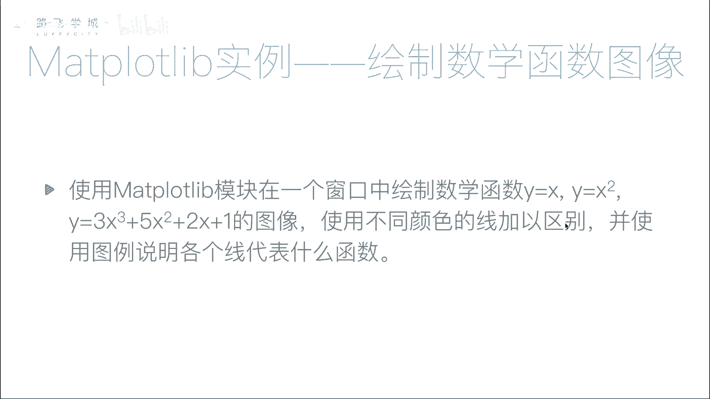
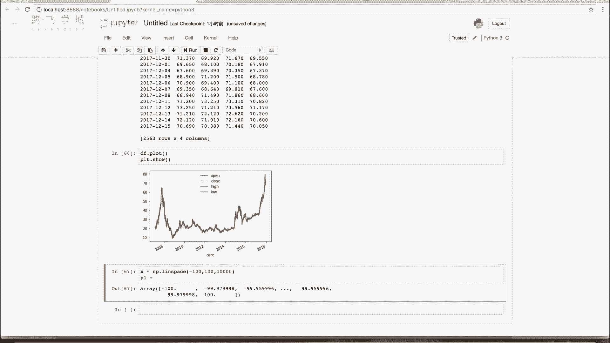
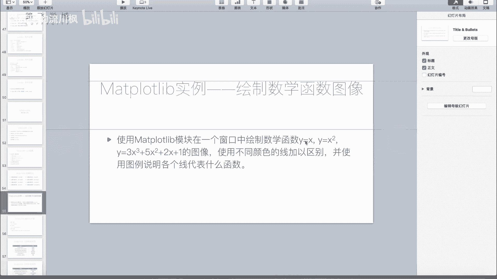
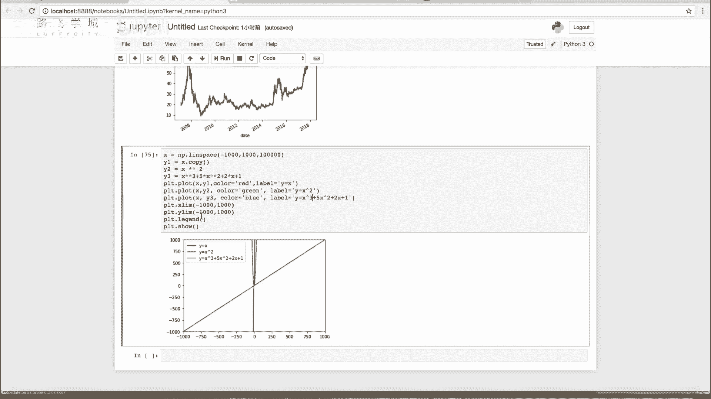

# 【2024版量化交易】全B站最实用的金融分析与量化交易实战课程，整整100集，3天从入门到项目实战，学完即可做项目，少走99%的弯路~ - P35：36 使用matplotlib绘制数学函数图像 - 敲代码的流川枫 - BV1uFCVYYETd

好同学们，那下接下来我给大家说一下，这个作业该怎么去做啊，有的同学可能没有思路，怎么做呢，画图像没有说过，我只说过了这个X和Y，然后怎么着我们就怎么画图，但是其实实际上计算机你说他是怎么一个曲线。

是怎么画的，一个圆是怎么画的，计算机是不是只有点，你所谓的线也是不会是你一个两个点连出来，这条线上一些点点点点点，对不对，比如说你拿画图，你画一个圆，小时候不知道大家玩过没有。

就是windows自带的画图，画一个圆，你把它放大了，看它实际上就是一个一个点，然后比较像一个圆，其实不是一个圆啊，那曲线也是一样，对不对。

比如说啊Y等于X方，我X我是不是我找好多找一个X列表，这每两个元素是不是差特别近就可以，比如说是0。0010。0020。003，0。0040。05，然后都把这个X1个列表比，说是0~00吧。

-100~100可以吧，-100~100，-100，-99。99999啊，-99。999899172494，一直到100，就是很长的一个列表或者数组，然后你再把这不是X吗，你再把每一个数做平方。

不就是Y了吗，对你把这个XY放到CONTROT里是不是可以了，我们来看一下啊，先看一下简单的Y等于X好。

那我之前说的这个就是密集的这个点生成数组，怎么生成的啊，之前给大家讲过，不知道还记得不记得我们的number py里，有一个叫做lin space的space参数啊，第一个参数是起点，第二个参数是终点。

第三个参数不是跟我们的a range差一点，不是不长了，是你要把它分成多少份，比如说我们给它分成1万1万分应该就够了啊，你可以看一眼还是什么，是-100-99。979998哦，反正就是很密集的一些数。

那可以了，你如果觉得不够，你可以分成10万还卷啊，F你自己试，对不对，好，这就是XY呢，Y 1y1。

就是我拿Y1Y2Y三，表示这三个函数的YX都是一样的吧，Y1是不是就是个X对啊。

就这就这啊，或者就是你不放心的话，你可以copy一下，copy啊Y2是不是X情况对X，那number py我们是是不是直接这么写，或者你这样写也行，嗯number py吧，可以直接对数组进行运算。

Y3你就把它写出来，你看3X的立方，三乘X的立方加什么立方嗯，加五乘X平方，五乘X的平方加二乘X加一，对不对，加二乘X加一，啊三个函数算完了，那接下来我们是不是用plot函数点T点。

plot lot什么XY1啊，不同颜色我们就把它区别出来啊，区别出来这个color，比如说第一个是red，然后啊别忘了label啊，里面还有图例，这个写就写Y等于X嗯。

第二个PRT点plot x y2color等于，比如说这等于什么green label，label等于Y等于X方平方啊，P r t p l o t x y3 color。

再等一个red green blue录，label label等于啊，这个叫Y等于3X的三次方加上5X的平方，加上2X加上一一，最后PRT点pl啊，首so，诶诶似乎少一条线对，少了一个是哪个线的啊。

少了XA哎，Label plt，点legend来，有没有加legend嗯，蓝色的，绿色的，红色的呢，红色的是Y等于X，红色的线呢我也不知道去哪了，把它注释一下，再看看，嗯他是一个都有啊，那样等下。

哦我知道什么情况了，因为应该是因为这个我们的这个X的立方，涨的太快了，然后那个X方，我把这个三比如说我把这个三去掉，把这个三去掉，就是因为它们的它们的值不太一样，有一个线看不太出来了哦，你看这是蓝的吧。

这是绿的，那根是红的，Y等于X就比较，你看你看这个，你看这个Y是这个是-100~100，这个是三多少300万，你看他那个线就是跟这个这两个线比较贴近的，重合了，太小了，我把这个X的立方减小一点。

我再试一下，还是不行，那还是不行，我们这样我们设置一下啊，我们设置一下什么，我们设置一下这个Y点，这正好遇到用到我们什么y live啊，我们就看什么就看啊，-1000~1000嗯。

哦这样子你看你看这个X像条直线的啊，你看这个这个就是比较，就是比较比较其他长的，其实你看刚开始的时候X的立方这数学知识了，不想给大家多讲，你看X的立方这长的比较快，所以他长得这么快的时候。

他看不见嗯啊就是这个长得太快了，所以你设置一下外力嘛，你设置一下Y的范围之后，就能看出来嗯啊包括你也可以把X呃算了，我们让X和Y1边查，比如说X是-1000~1000。

那注意你这就要这也变成-1000~1000，比如说我们可以多加几个，这再加个10万，看这是真实的主角，这是矮，这是这个斜线是正的啊，这个你看长得多快，因为立方嘛，我这个函数可能画取的不太好，差太远了啊。

反正方法就是这么个方法对吧，就是把我们的number py的那个实数组啊，那个n d array用过来啊，直接这样就可以用来画数学函数图像了啊。

这是很常用的，比如说有一些这个数学的一些实验啊，或者一些什么东西都会用到的，就是换绘制数学函数图像的啊，例子啊。

