# 【2024版量化交易】全B站最实用的金融分析与量化交易实战课程，整整100集，3天从入门到项目实战，学完即可做项目，少走99%的弯路~ - P39：40 tushare包介绍 - 敲代码的流川枫 - BV1uFCVYYETd

好同学们，那到现在为止，我们这个金融啊，量化或者说数据分析，或者金融分析的三大主要工具包，讲完了，number py pandas和matt pot lab啊，那接下来就是我们要想讲几个什么呢。

怎么样用这三大模块做一些简单的金融分析啊，说到金融分析，我们就需要有数据啊，之前我们是给大家是，我们这有一个这个那个CSV的数据，一直用它来做，那这个数据是怎么来的，就是我们有一个to share包啊。

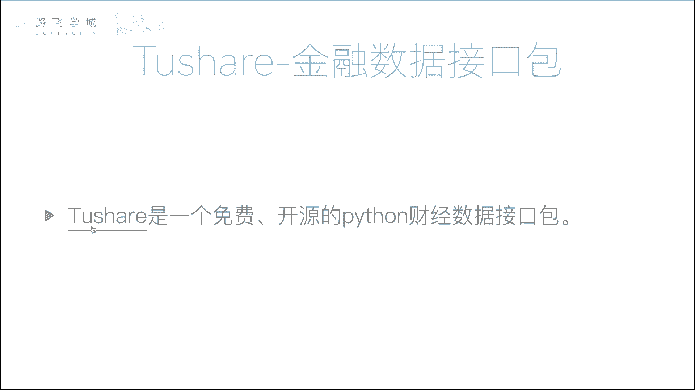

大家可以看一下这个啊，网站上to share是一个免费开源的Python，这个财经数据接口网啊，然后它相当于其实就是主要就是股票。

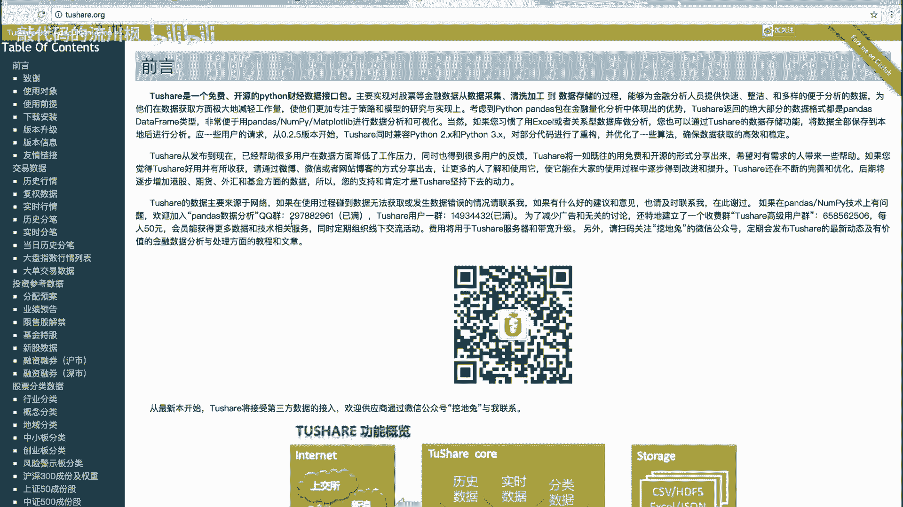

主要就是股票啊，它的来源就是他去，比如说上交所，然后新浪新浪财经，腾讯财经，凤凰财经等等地方爬到数据之后，它存在它的里边，它自己本身有一个服务器，那么我们下载下他的包之后，我们调用它的接口。

调用它的函数。

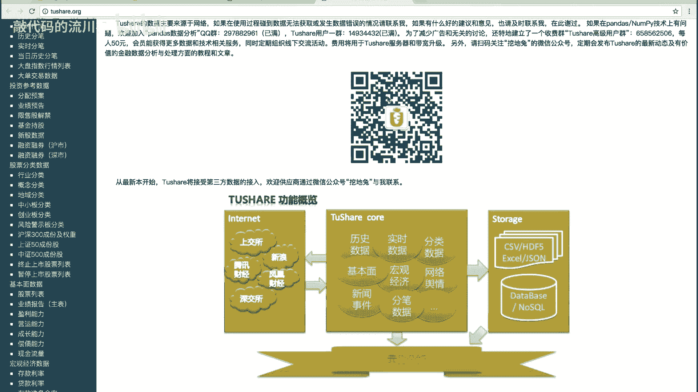

就能够帮我们把他的数据下到我们这来啊，对那你可以看到他这。

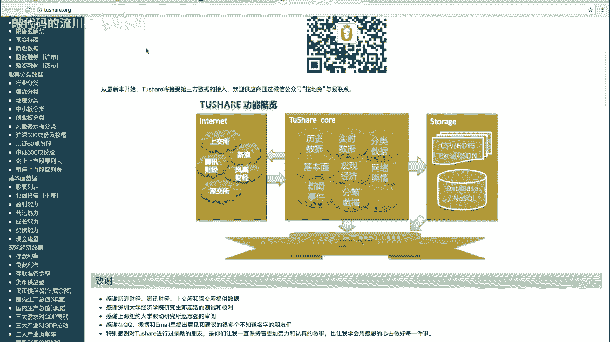

他这是我们国内自己写的一个图，SHER报啊，就是中国国内的A股。

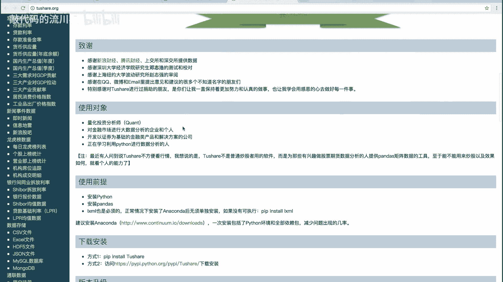

主要是那下载的方式就是安装啊。

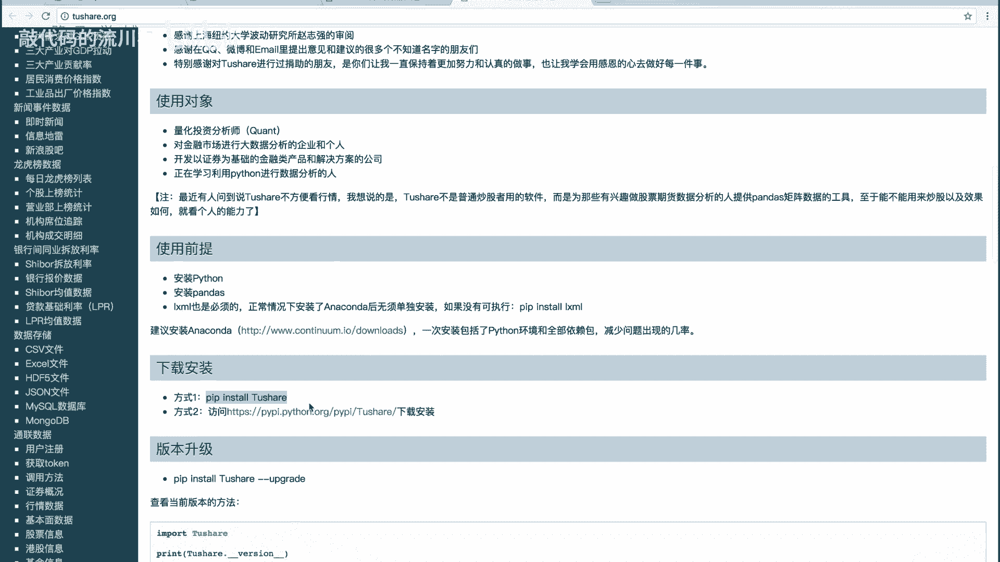

直接安装就可以了，对当然你pi pip直接安装的时候，可能会报一些错，就是他可能会报，可能会你缺少这个包，就他提示你缺少哪个包，你就把那个包装上之后再装to share就可以好。

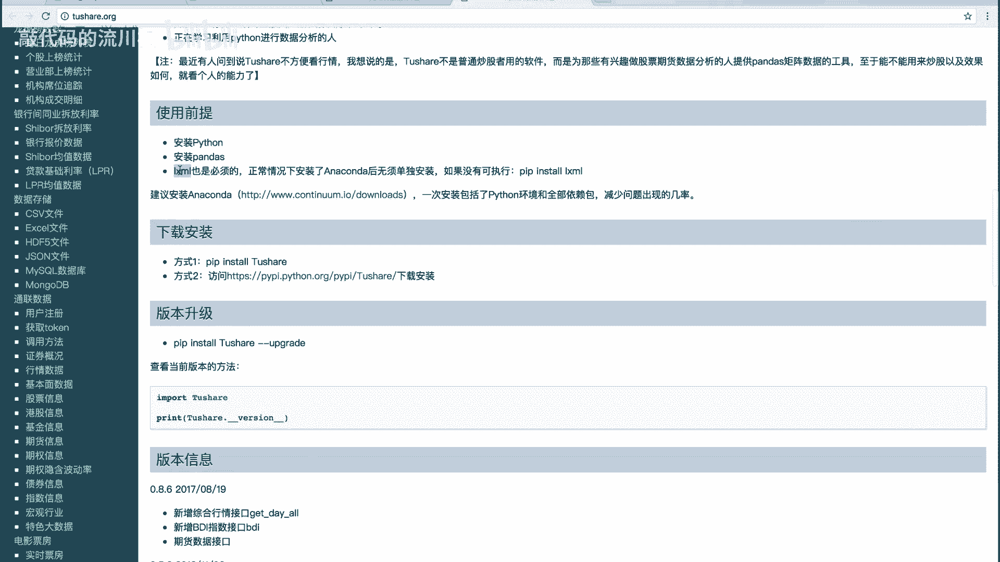

啊写法我这已经装好了，就是to share啊，当然我我一般习惯我习惯性as ts。

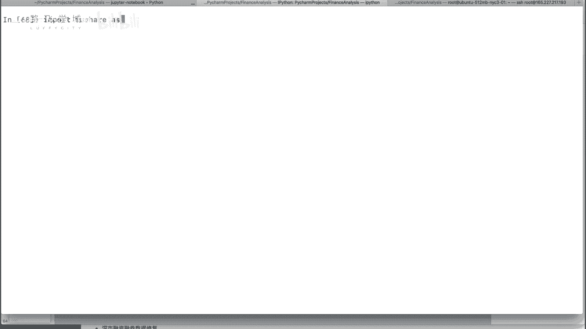

当然你就to share也行，那它有一些常用的接口。

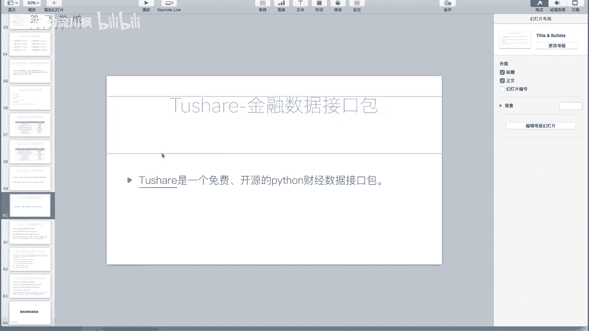

比如说我们用的最多的应该是历史数据啊，历史行情。

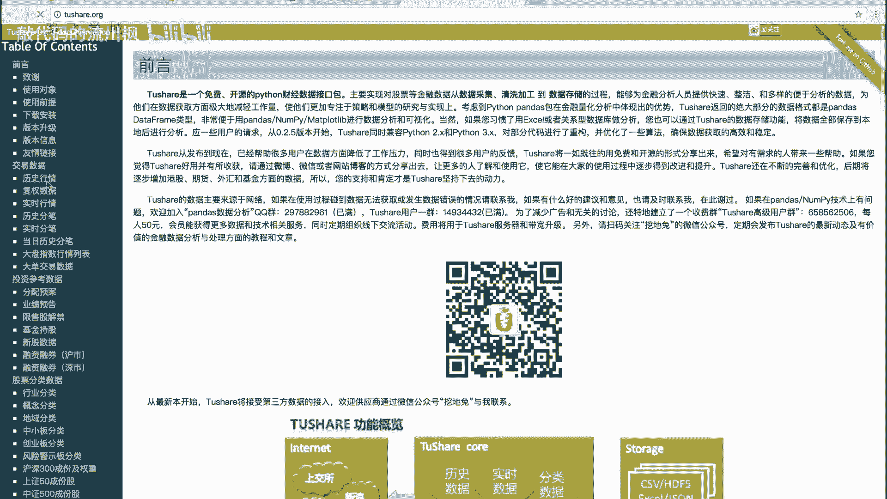

历史行情可以看到这有一些说分说明啊，他这又推荐了一个新接口。

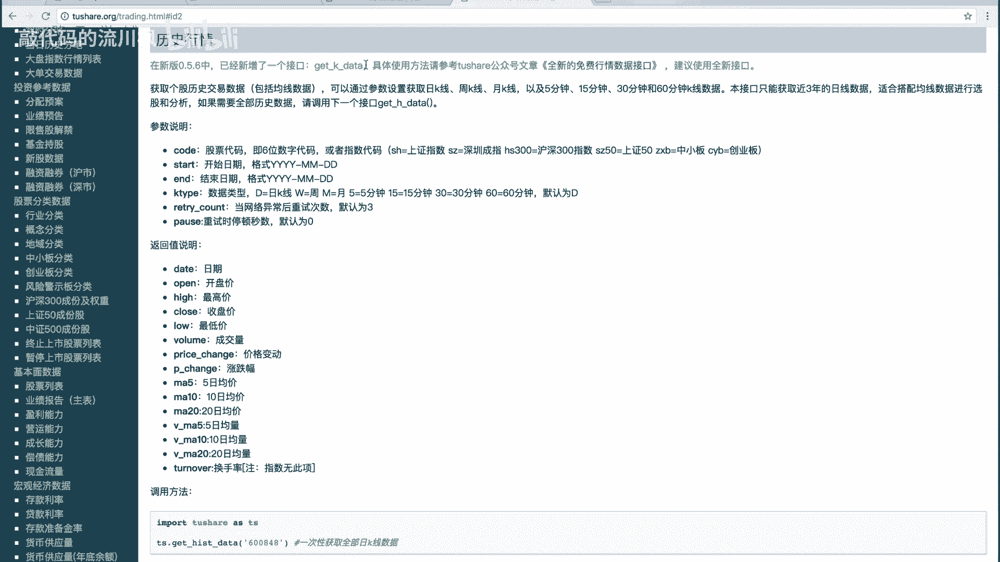

你去看一下这个文章里就是get k data啊，就是获取K线图。

这个这个过的做的好浮夸，get k data这个接口啊，有几个参数code，正确代码就是你获取哪个股票。

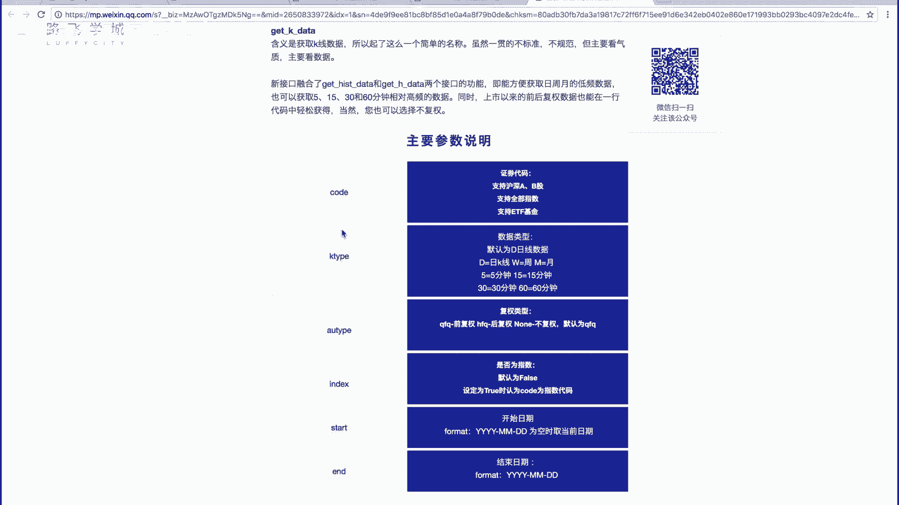

写一下TS点，get k data好，哪个股票，比如说就是之前我们写的那个，用那个601318好，直接这样传进去，按一下回车，等一会啊，看来网速还不错。

等一会儿我们就这出现了一个这什么data frame，对吧，这是pandas data frame结构嗯，就说明他也是用pandas库来做的好，可以看到有几列，第一列date日期开盘价，收盘价，最高价。

最低价，volume成交量啊，code就是你的股票代码，所有列都一样啊，那我把它保存下来，我用DF等于啊，我把上面这一行哎，DF等于TS点，Get k data，601318是不是就可以把它保存下来。

然后再点to csv就可以了，嗯啊但是我们默认可以看到他这个data，最开始是从15年开始，对啊，我也不知道他这个就是你不传参数的时候，他不是说把这个，把这个所有的K线图都给你下载下来。

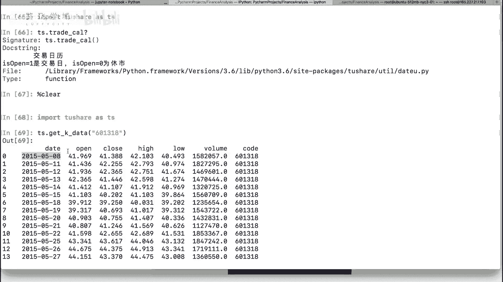

它是应该是把最近一段时间的，都给你下载下来啊，可以看到code没有了，对不对，k type可以传，k type就是日K线，周K线和月K线啊，这个我们之前没有介绍过什么呢，我们的K线我们说开盘价，收盘价。

最高价，最低价是一天的，那你一周的是不是也可以做一个，你一周的开盘价，就是这周第一天的开盘价，一周的收盘价就是这周最后一天的收盘价，那最高价和最低价也是一样啊，这是周K线和月K线都有。

当然还有什么5分钟K线，15分钟K线，这这都有，但是用的最多的还是日K线，而日润最多还是日K线啊，key tab当然可以不用传，那这个au tab是复权的问题，那关于复权的问题，我们这儿不做过多的介绍。

大家默认QFQ前付权就可以啊，没有问题，就是复权涉及到就是股票，这个涉及到当这个增发股票的时候，或者说这个当你分红的时候，或者增发股票的时候，他有一个股价的复权问题，这个大家可以不用管它。

就默认是QFQ就可以好，index设置为指数啊，设置true的时候，默认code为指数代码啊，就是如果你要获取，比如说上证啊，或者是真正获取我们大盘的指数股的时候，你的index要设置成true啊。

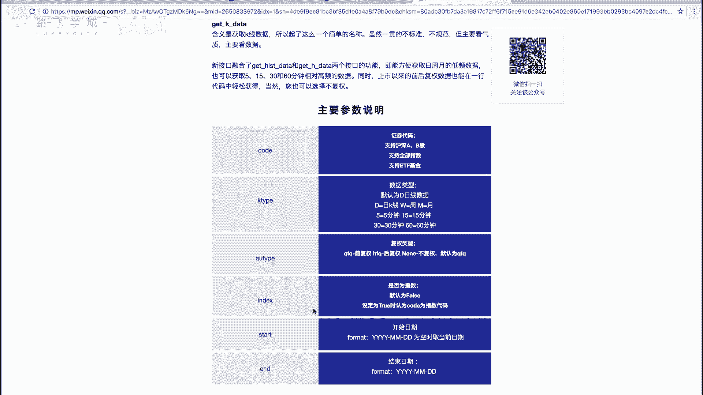

就是你这扣的，比如说你的那个上证300是什么来着。

我们查一下啊，上证300，上证50，看成50的代码应该是000050，我印象中2000016好。

我们可以看一下，对你这如果直接传0000166的话，有点慢嗯，好，嗯他并没有虽然出来数据了，但是这个数据还是价格啊，如果你要指数数据的话，你的index等于true，有点慢，因为这个数据比较多。

没有14年开始好，你看到这就不一样了，这个价这就不是这是指数数据了啊，设置成true之后，这就是我们要的指数据，我不太清楚这个数据是什么啊，这个就是指数数据了，就是我们上证这个就是综合的时候。

不可能说股价这个东西，3126不是一股3000多块钱啊，没有什么这么这么贵的锅，炒一手3万啊，那就是这是指数数据啊。

就是index好，那最后还有这个接着看啊。

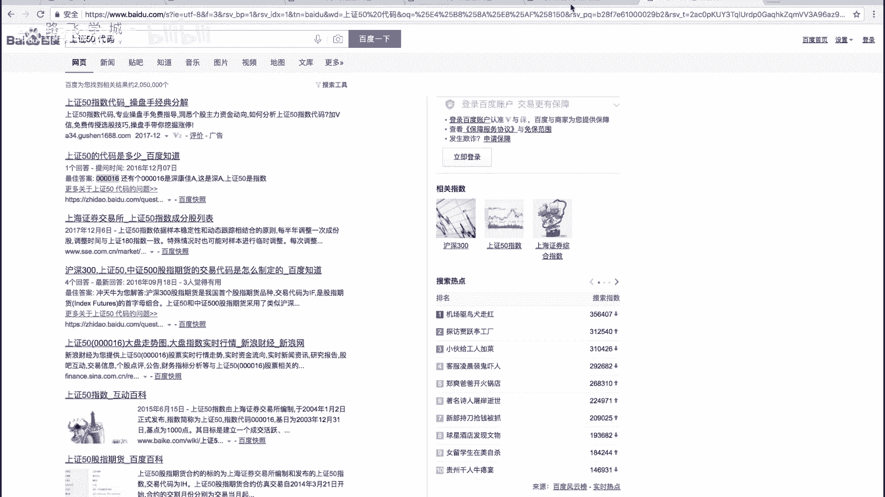

他这还有一个start和end啊，这两个参数是最才是最重要的，就是你设置你要爬的日期。

开始和结束是你的范围，因为我们之前说了嘛，你默认的话他是从15年开始爬的啊，那比如我们还是用这个601318，那如果说我想爬全部的历史数据嗯，end可以不用设，End，不设的话。

它默认是今天你设置一个start start，你说我不知道这个股票是哪天上市的，那其实你设置一个够早的时间就可以，比如说我们国家是1970年，90年开始的，90年还是91年开始这个成立这个交易所。

那你设置一个1988年肯定是没有问题的，你设置这个时候他不会说给你，就是从1988年开始发，他应该是从这个股票第一天开始上市的时候，给你爬数据啊，我们可以等它下载完了看一下好，这更慢。

因为他这数据应该是，我记得是从零几年开始的好，这是我们这个to share最常用的，那你把它这个股票每一个代码都给下载了之后，你可以存到文件里，你可以存到数据库里啊，随便你存下来之后。

相当于是你把这数据爬下来，当然大家也可以写一个，就是写一个程序，爬取一下你关心的所有股票的这些数据啊，都不难，DM保存下来之后点to csv就可以啊，这些这个我们也讲过。

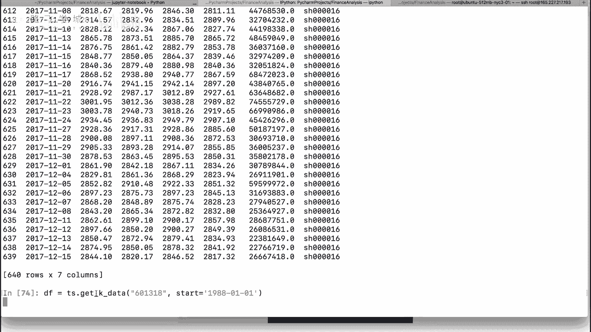

这有点太慢了，好那我们接着说吧。

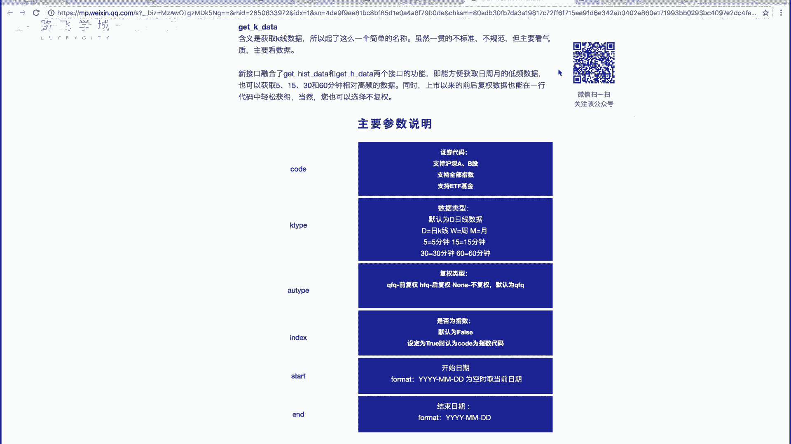

除了行情数据，除了历史行情，还有各种的。

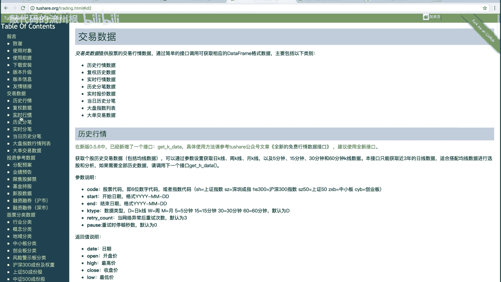

比如说实时的就是获，其实说所谓实时就获取今天的啊，他这个应该不能做到说是获取到上一分钟的，他只是说获取今天的trade啊，这个吹的限价我觉得他应该不会是特别准时，我不确定他是不是准时啊，你们可以试一下。

因为我觉得他这个是他可能是用了一些，比如说新浪的或者什么之类的接口，有可能会差上几个tick，如果你要做高频的话，大家你们需要验证一下，这个是不是达到了高频的质量啊。

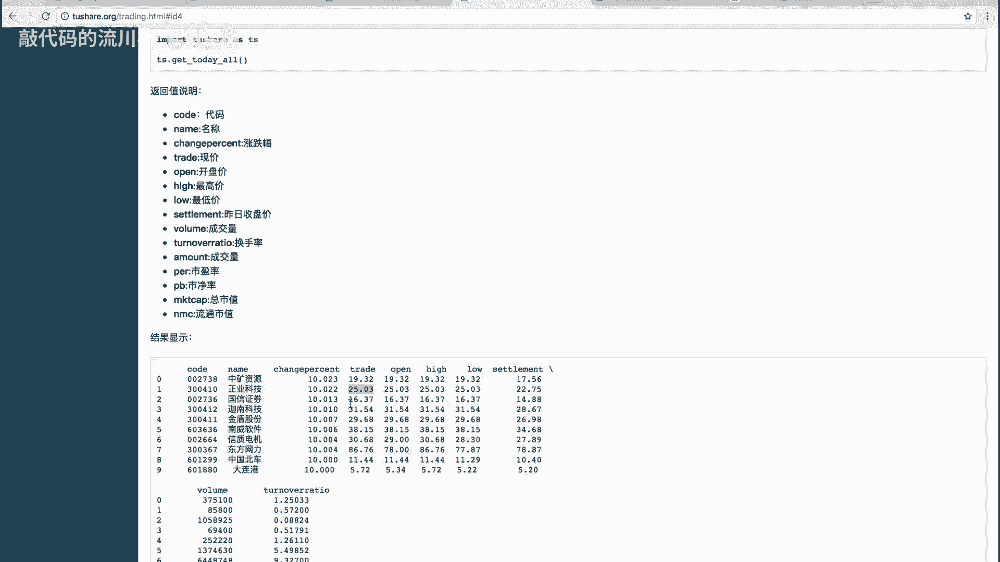

这个就是这叫什么这个啊，实时的数据，然后实时的分比，历史分比，实时分比。

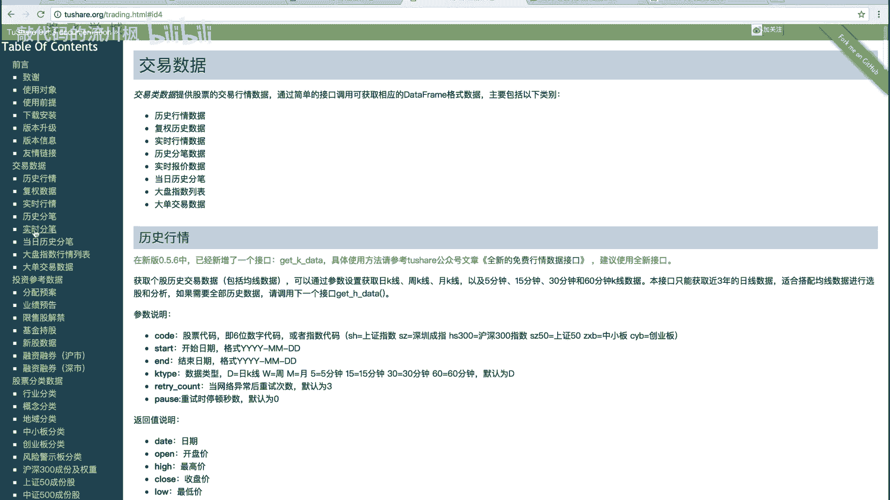

然后大单交易大盘指数都有啊，每个都有一个固定的，这个每个都有一个它的接口，然后有一些说明，有一些样例啊，比如说实时分比，Get your time cos，然后历史分比啊，大盘指数get index。

就是所有的指数都给你列出来了啊，它的改变量和涨跌幅啊，开盘啊，这是这是收盘，这是昨日收盘的点，这是今日收盘的点，最高点和最低点最低点，因为他那个什么呢，他那个，快开盘点了，他没有开盘的点。

嗯好那这些我就不给大家一一细讲了啊。

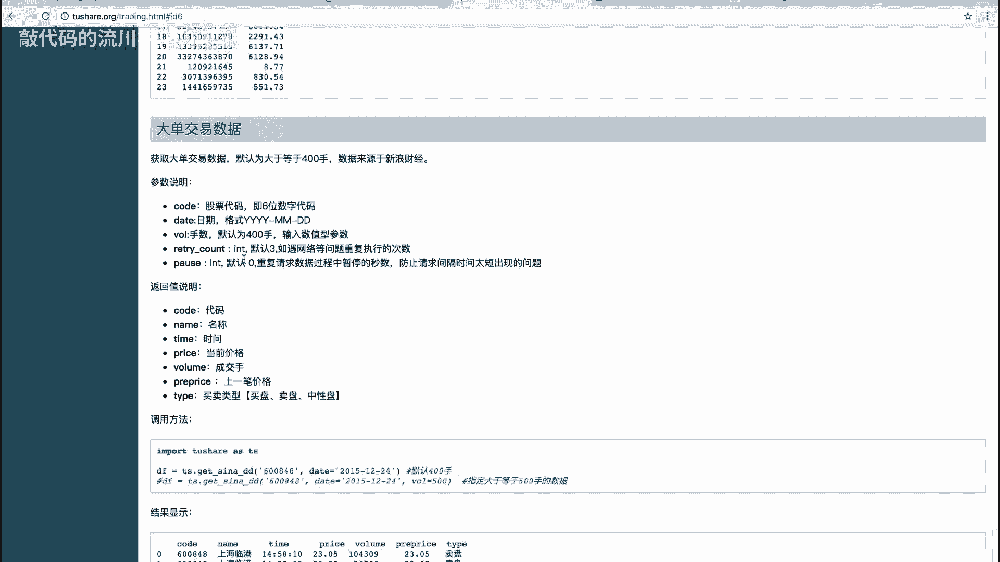

我们现在就是我们给大家讲这个是为了，因为我们接下来要用做一个简单的分析，那我们用到的用刚才我们说过的这个get k data，已经足够了啊，就是你大家需要用这个接口，把一只股票的所有数据都扒下来。

存到一个CSV文件里。

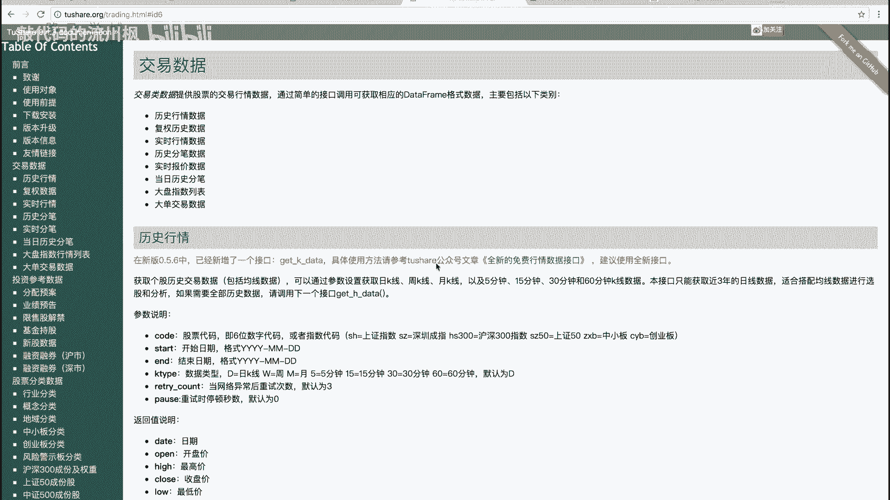

好看到出来了，是07年开始，那就07年到17年，一共2500啊，所以还是挺大的一个数据，你把它存到文件里，接下来你只需要读它。

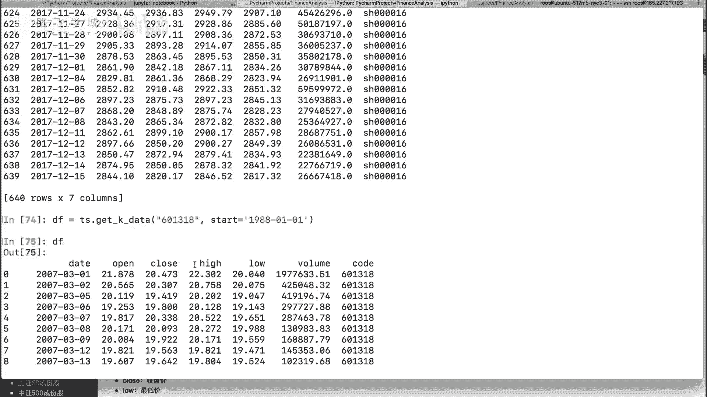

我们做几个例子，大家看一下，好好。

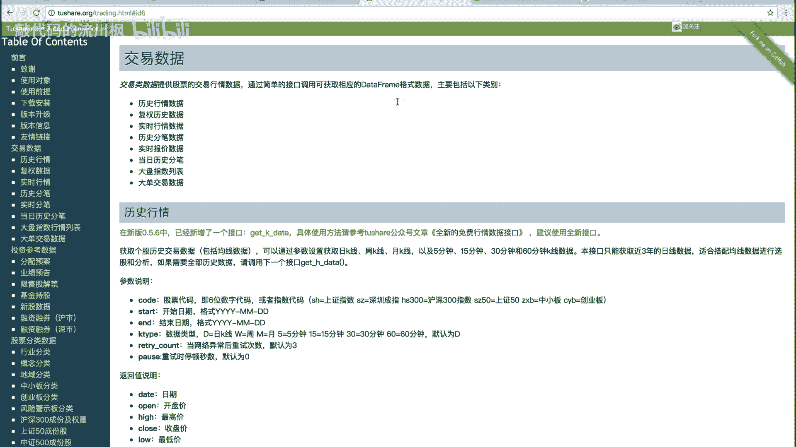