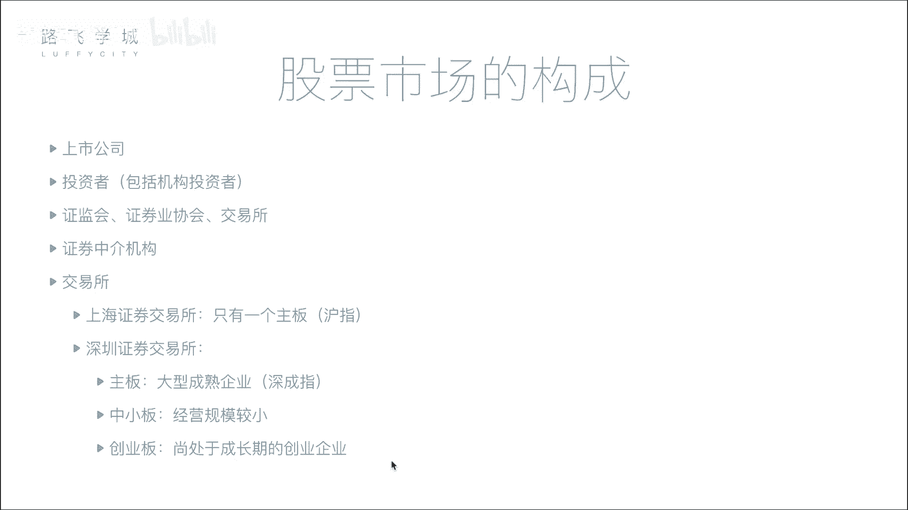
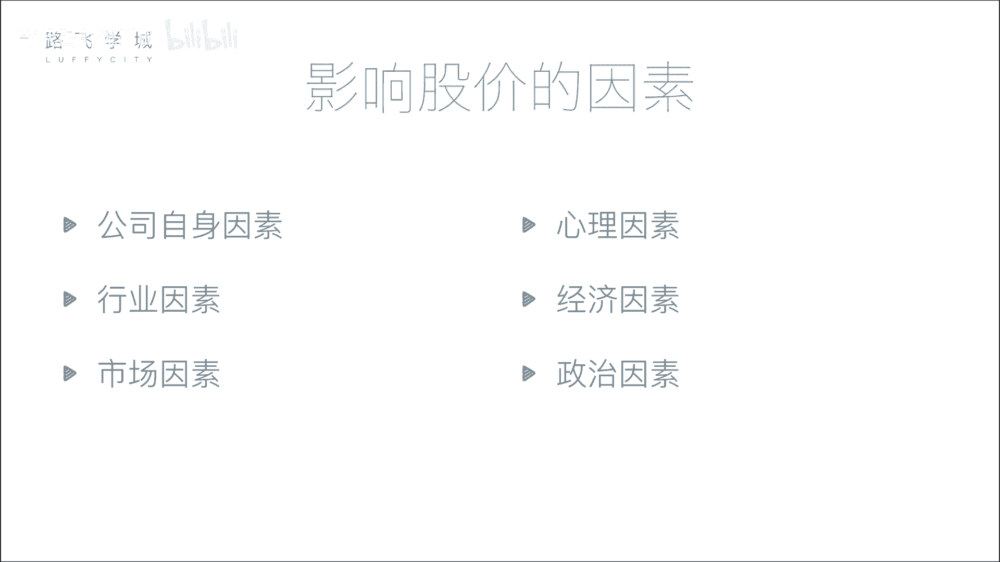

# 【2024版量化交易】全B站最实用的金融分析与量化交易实战课程，整整100集，3天从入门到项目实战，学完即可做项目，少走99%的弯路~ - P3：03 金融量化分析-股票市场构成 - 敲代码的流川枫 - BV1uFCVYYETd

好那介绍完股票的分类，我们来说一下股票市场的构成啊，也就是说你这个市场有哪些人啊，首先第一个公司和投资者啊，分别是啊要钱的和出钱的嗯，哼公司融资消费者的这个投资者进行投资嘛，嗯那但是俺们说这个上市也好。

这个就是炒股，不能让你公司和交易投资者直接进行交易啊，那你有什么这个什么暗箱操作呢对吧，就说最常见的证监会啊，这是这个证证券这个行业的一个啊，做监管的一个机构啊，比如说你的公司想要上市。

你需要把各种材料交给证监会啊，啊比如说你这个公司的一些，比如说我你这公司我判断你是不是有七大行为，有洗钱等等，各种各样的违法行为，都是证监会来进行监管，对啊，这一权力是特别的大，对他有行政。

它能决定你这个呃这个这个股现在能不能上市，另外你上市还能给你撤下来对啊，判断你这个公司是不是在干正事啊，是不是不干好事，那第二一个证券业协会它的作用比较弱一点啊，这是一个存这个比较常用的一个。

比如说大家可能考一些这个证券从业和证啊，他主办的啊，他的交易他的作用弱一点啊，第三个交易所啊，交易所就是提供一个场所，我们说就那个大市场是他来提供的，上海深圳那两个一个两个大房子，对。

全全全国的这个股民都在那在大房子里交易啊，这个要说到就是很久很久以前，就是西方传过来的嘛，那个时候是真去交易所对，你要去抢风口排队，然后自己对就那种错啊，当然现在的话大家都互联网做网络。

连到那个大房子里，所以交易所对交易所的功能就在于，他要处理各种各样的请求啊，真真正现在排队，我这排骨和卖股票的人不多了没有啊，不是也许有没有不能这些是吧，好还有一个就是证券中介机构。

嗯啊就是我们俗称的可能是一些券商嗯啊，他是用来干什么的呢，就是我们说个人股民是不能直接买卖股票的啊，中国不能直接我去交易所买卖股票不行，你要在券商开户，比如说这个有各种啊，什么这个我我我来解释一下。

我来解释，OK那呃首先呢是这样，不是说个人股民不能直接买股票，而是说成本太高，为什么呢，因为呀在西方的时候，就是大家一开始都是说排着队去那买票嘛，但是相当于你之前买股票没有电子化的时候。

你买一个股票给你一个凭证，对不对，相当于这些你给那那穷人说我买十块钱的股票，我还给你弄个凭证，那这个凭证要要核实的，对不对，你要确保公司股票就这么多，你不能多发了或少发了。

所以就成本其实中间手续比较麻烦，所以后来就是说人家这个证券交易所，就不像相当于小股民去对，这是相当于你十块钱，不好意思，不服对吧，我们的门槛就是多少钱，对不对，然后另外一个就说了，那那还有一个就是什么。

你要想买股票，你必须到证券交易所里边来买，我不在外面卖，能理解吧，那怎么办呢，你你想里边来买，那怎么能去把有钱人过滤出来，没钱人就不让他进来了，卖席位呃，一个席位几万美金对啊。

但那个100多年前美国啊对吧，那100好几万美金就是非常贵的，所以穷人就直接就没办法了，但穷人也行，你炒股票怎么办呢，那富人就这样，我先买了一个席位，我自己的这个股票交易是是有限有限量的。

这个席位就我坐在那派一个人天天在那里超火，但我不可能每天交易好多股票对吧，我又想把席位费挣回来，理解吧，回来干嘛，我又开了一个业务，说哎我这个有钱人啊，我再派一个小弟天天到那个场外。

就交易所外面去找一堆人说哎，我现在有这个买卖的资格，你们谁想买，你把钱给我，我叫我帮你去买，所以就是那个小股民对吧，一堆小股民凑起来这个钱就多了，然后交给那个有钱人，让他有那个席位，让他帮着去买卖。

能理解吧，对IK，那现在衍生到现在呃，这个情况就是说啊在国内也是啊，就是你你只有在证券交易所里有席位，你才能去买卖股票，那小股民是没有没一个席位好几百万啊对吧，你没有钱买这个C位，所以那怎么办呢。

那你就通过这个叫重证券中介机构啊，就叫券商，比如说中信证券，我之前的公司中金证券，中金公司，海通证券，然后什么乱七八糟的，他们就干嘛，就就就在那个证券交易所都有席位，对对不对。

然后他又想把这个席位费挣回来，是不是啊，所以他就干嘛呢，相当于开发了一套软件，比如说我们炒股用的什么，这个就是每个证券，还有每个证券同花顺啊，对不对，首首创证券不是同花顺吗。

是吧啊啊用的这个同花顺或者一些炒股软件，这个炒股软件就是这种券商给开发的对吧，它相当于是说哎，你先连这个券商的这个这个服务器，然后你把指令交给他，然后他再帮你转，通过他在证券交易所的席位。

去帮你的指令下达给这个证券交易所，帮你买股票理解吧，那就这么一个东西啊，然后接下来就是这个交易所啊，交易所中国有我们有两个啊，一个在上海，一个在深圳啊，简单说一下，每个交易所它都有叫做板块啊。

上海来说简单只有一个主板叫做啊，就是主板，深圳的话它是分为三个板块的啊，有主板，中小板和创业板啊，所谓中小板和创业板是什么呢，就是相当于国家对一些小公司，或者是一些刚创业的公司的一种鼓励啊。

可能你公司的体量不够大不够大，不能上升成长，成长性非常好，但是我为了想让你快发展起来，对国家经济有较好处，哎我给你开了中小板和创业板，没错就是小规模的公司，你可以在这两个板块上市，对中小板可能会呃。

现在上中小板的这个要少一些，因为它的融从在中小板上融那个融资的，反正就是融资的少一些，但现在其实一般的公司会上，创业板或主板比较多，但上主板比较困难吧，他要求特别严格，就是你这个要求。

你每年盈利是5000多万还是多少对吧，净利润还是啊有可能对，但创业板就是说连续3年还是两年3000万，净利润就可以，那所以你会发现，比如说像乐视啊，就上了创业板啊，对就是我这个公司有可能特别需要融钱。

但是我又没有那么大的体量去上主板，那我就可以上个创业板，创业板也可以融很多钱，比如说像乐视吧，暴风影音嘛，对吧啊，这个都是好，上面是创业板啊，那对于每一个板块来说，我们来说都有一个叫做它的。

所有的那个我们平常说叫大大盘啊，那个大盘是什么呢，其实就是一个指数叫这个上海的主板，它的大盘叫做沪指，嗯啊啊也叫做上升指，这个指数是代表什么意思，你会下一节讲吗，还是我会现在讲啊，现在没错。

指数其实就是反映了你这个板块内，基本上所有股票的一些综合的表现，嗯嗯我的智商不够高，你解释一下，比如说你这个呃，这个这个上海这个板块有3000只股票好，我把这3000只股票它有可能有涨就有跌的可能。

两举个简单例子啊，可能2900只股票都在涨，100只股票跌了一点好，那我整个的大盘，要表现出这所有股票的一个综合的表现，那我这个大盘给你一个指数，它其实就是一个曲线嗯，他他表现的肯定是涨了对。

就是所以说大盘，简单来说就是表现一个市场的一个是好，向好还是向坏，对这个所以就是说中国股票人家就就是对，别比如说相当于一个概括性的东西，说哎中国现在这个股票行情怎么样啊。

你总不能说3000只股票里面有1000只涨了，2000只跌，不能这么讲，因为你要是看整体的一个趋势，就是说哎那怎么整体的趋势呢，就是说整个市场盘子可能里边有1万亿人民币，那么一个市场盘子。

那这1万亿里面可能就是说有这个，对对，这个盘子的这个股票都在涨涨，那其实就整体都在涨，整体向好对吧，这些不是一只股票买，可能好几百只股票啊，对不对，那把这些几百只股票打一个包。

综合起来相当于搞一个平均值啊，这什么搞一个这种趋势图，按这个趋势图，他就整体相当于整个大盘就是好的对，相当于股票行情就不怎么样对就那么一对，所以他是大盘，就是表现在你这个盘子整体的一个走势，122。

那上海它的牌子叫做沪指，沪指300，深圳它的三个板块，这个主板叫做深成指啊，中小板就是中小板指，创业板就是创业板指啊。

好好，那接下来我们说一下什么呢。

