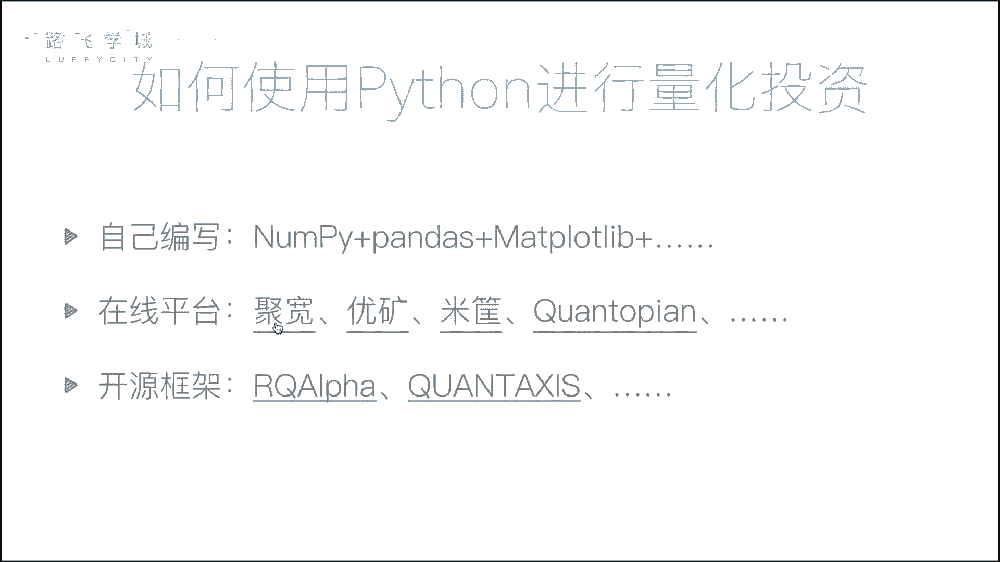
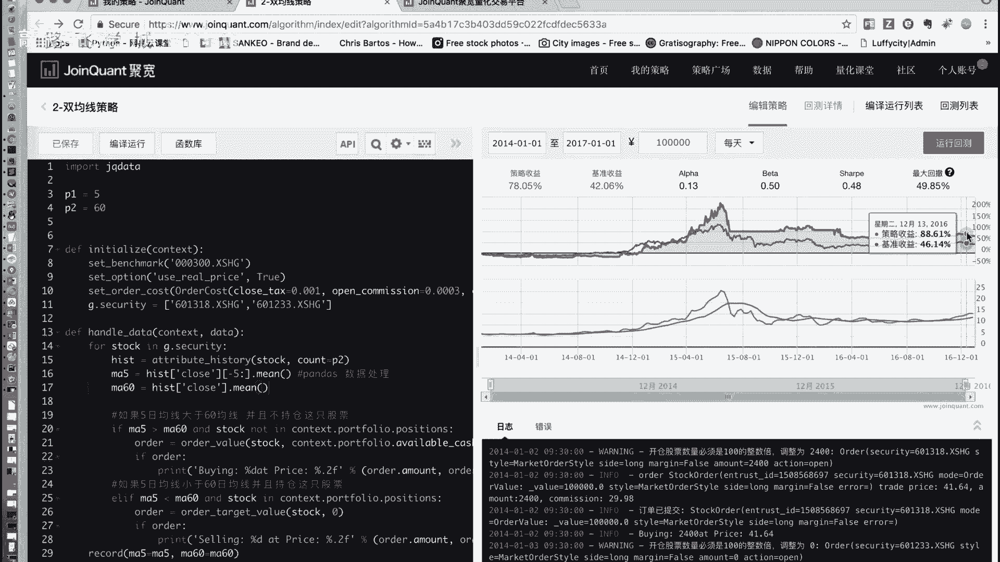
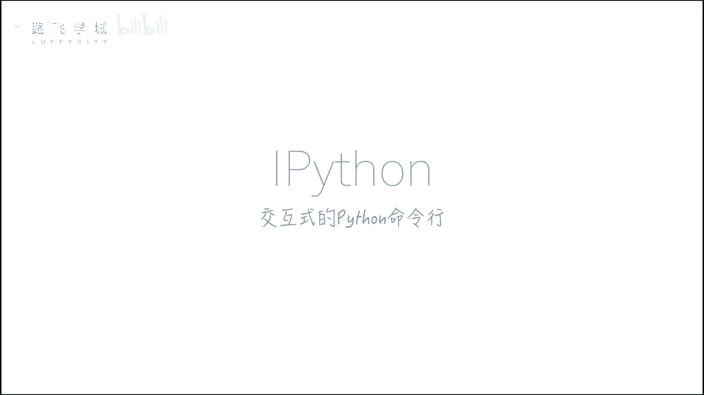
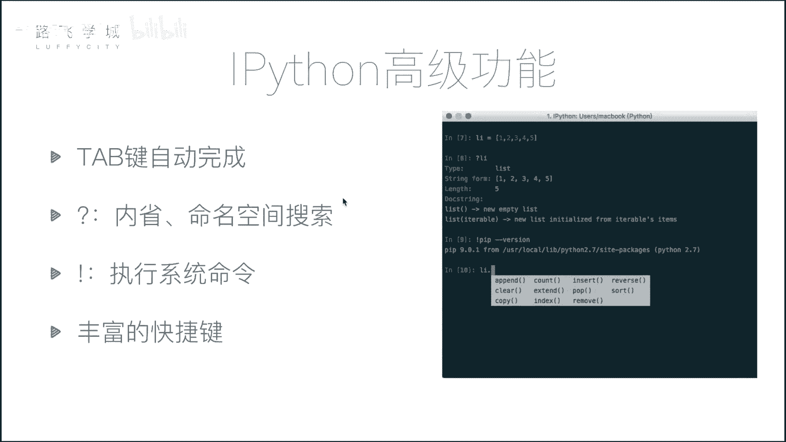
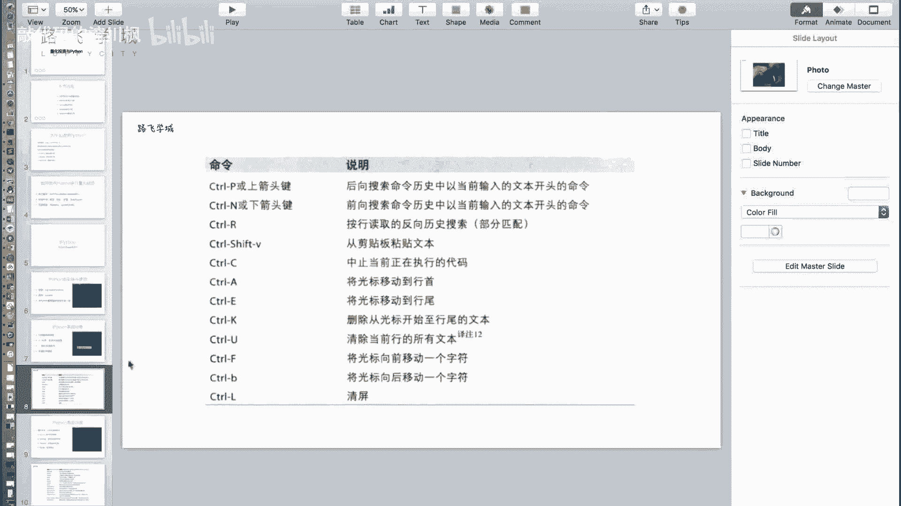

# 【2024版量化交易】全B站最实用的金融分析与量化交易实战课程，整整100集，3天从入门到项目实战，学完即可做项目，少走99%的弯路~ - P7：07 金融量化分析-量化投资与Python&ipython初识 - 敲代码的流川枫 - BV1uFCVYYETd

好，那接下来咱们讲一下这个模块的，第二部分就是投资，量化投资与Python啊，这个模块主要内容可能涉及到一些，就是我们会介绍一些额和量化投资，包括和数据分析相关的一些模块和工具，让大家学习一下。

好那首先咱们还是来宏观的看一下，怎么样哎用Python来做量化投资，或者说为什么要选择Python做量化投资，大点说，那除了精简点，那好除了Python哎，我们还有没有其他的选择呢。

有有啊啊我这列了一些工具啊，不是所有的一些工具，第一个excel啊，咱们的表格啊，这个当然没有没有编程啊，没有程序化的东西，就是更多的是人手工上那些东西，那后边还有两个。

这个是SAS或者叫SPSS这两个软件，但是功能差不多啊，是一些统计相关的东西，当然啊机器会就是也没有编程，但是机器会帮你做一些统一化的，比如说我们刚才说的创经验可以帮你算出来诶。

每天的均值那个值是多少啊，还可以给形成一些图，那当然也没有编程啊，R语言啊，这个语言是一门编程语言，有人有的同学可能听说过啊，它是可以做量化投资的，但是然而现在应用的非常少啊，为啥呢。

因为这个语言比较窄啊，他做的东西就是什么，就只限定在数据分析这一块部分，其他的没有什么太大的应用，所以有它无不如拥有的Python就什么都能用，你学了一门语言，就是各个方面都能是哪个三头六臂的感觉呀。

对吧好，那我们说量化投资啊，上一个部分我们也说过了，实际上就是什么呢，分析数据从而得出决策的过程，嗯啊就是你拿到了不管是行情数据，你的这个呃财报，财务数据或者是其他各种各样的数据，其实就是分级数据。

然后根据你的指标来做一个决策的这个过程啊，所以咱们接下来会重点讲Python，做数据处理或者数据分析的几个模块啊，主要有这么三个number py啊，它是做一个数组的批量计算，Pandas as。

这是核心的库，主要是啊会有一个数据表结构，然后根据这个表结构会有各种灵活的操作，第三个是MAD patlab，做数据可视化，就是我们有了数据之后，我们把它画出来，好那啊具体我们学的这些模块。

假如说我们学了之后，我们有哪些方法可以做量化投资呢，啊啊第一个我们可以学了之后，我们会带着大家用我们教的这三个模块，自己写一个简单的量化投资框架，哼就是从完全从零开始写，我们只用到这三个模块。

然后用到我们下载一些股票的一些数据啊，然后自己诶做一个框架，可以在里边写自己的策略，然后进行回测，看你的策略的好坏，那现在我们也可以不自己写，不用自己写啊，市场上有一些现成的我们叫做在线平台。

他给你提供了一个嗯这个量化投资的平台，你只需要写一小部分代码，然后放到平台上去运行。

你就可以看到他的回测结果啊，我给大家看一个例子啊，这个就是啊我列的几个在线平台的其中之一啊，那我们可以看到左边这一部分，其实就是啊写一些代码，写一些把你的策略写到这里边儿啊，具体这个代码写了什么。

我先不给大家讲，在后边的课程，等我们讲完了几个模块，我们会回来给大家挨个策略的进行展示啊，那右边我们将代码运行之后，我们会在右边产生好，我们可以看到我们在右边产生了这个策略，当前的一些曲线嗯。

这个曲线实际上就是我把这个策略，在一段时间内进行回测之后得到的结果，我们可以在这看看这条蓝线，这条蓝线就是在不同的时间，你这个策略导致的收益嗯，啊，那也就是最后我们这个策略。

会以这种可视化的形式反映出来，就是说你这个策略究竟是收收益了，还是说这个亏损了。

基准收益是什么，基准收益，这个我们在后面会讲到啊，它实际上是一个大盘的一个收尾曲线，这个我们后面会说，OK好好，那有一些平台我们还同样还有一些开源框架，这些等等等等啊，有兴趣的可以了解一下，那好。

那接下来咱们就开始介绍一下，我们数据分析的相关模块啊，在讲这三个模块之前，给大家说一个工具叫IPON啊，它是一个什么呢，它是一个我们叫交互式的Python命令行，大家最开始学Python的时候。

应该都应该都用过我们自带的Python命令行，嗯啊，在里边写一些这个我们的Python语句就可以执行啊，好那现在我们有了i Python这么一个交互式美达，什么叫交互式美达。

就是它提供了一些更加丰富的功能，嗯啊那怎么安装，我们用Python自带的pip工具，在Python加上运行Python好用pip进行安装即可，啊你应该用国内COCONQU哦还行，这中间应该插个广告。

没想好，我靠还很多呢，对大学，所以我说是现场，一会你再按的时候按东西，用那个豆瓣的就会快很多，这个东西很神奇啊，看这个轴承吧，应该是轴承做的非常的高精度的轴承，对，能缩能运行2分钟。

看来好像很多还有很多吗，我不知道，但是需要一些怎么办呢，豆瓣的嗯我我我那个我之前有一些动画的啊，不可能吧，命令是什么，嗯这个，重新来吧，好不好，你这块还会给他录上吗，录完就这样呗。

加上这个加上这个加上这个就行，要不然你且拦不了，我觉得，啊，你没有复制上，你就复制一个行了，你就command c呗，Ctrl c a mac，这个嗯，看到unpack file，对不对。

不知道你可能包不支持吧，那不止是我不知道我不是它是一样的东西嗯，插set，然后pip3install，好我知道这个有可能是有点问题，那你还是用原来那个吧，试一下，可不会在这方已经下载下来一些吧。

那咱们就在这尴尬的等着是吧，把这块剪掉呗，哈哈这叫花絮，你给他们看这几分钟尴尬的场面，让他自己看吧，看屏幕吧，看屏幕在进度再再进，你就把我说的那个用pip安装配上，这个放出来就好了，那你这里先暂停一下。

翻了半个小时之后，我们这个装完了半个小时之后好，我们IPAD现在安装成功了啊，那对于那些啊没有安装过Python的同学，可以直接去装一个叫anna coda的一个Python。

它是一个Python的发行版，它里边集成了我们现在要说的i Python，包括后边我们要讲的那三个啊，Number py mac，po lab跟pandas这三个库都在这个包里继承了。

可以直接去下载这个进行安装啊，那我们现在已经安装过Python了，可以用pip一个一个进行安装好，那安装完了之后，在命令行里输入IPAD就可以运行啊，我们可以看到在它和Python命令行不一样的地方。

你要玩手机吗，你们玩你机器，我听你说话呢，它和Python命令行不一样的地方在于啊，它的提示符是有标号的，我们可以看到在里边啊，随便可以写一些Python语句嗯，好你看他会有in和out的提示吧。

它的in就是你输入的，然后相应的结果就是显示在out里面，嗯啊这是我们说他可以当一个啊，和Python命令行一样的工具来用，那除此之外它有一些什么特性呢。

好我们简单介绍几个他的高级功能啊，第一个tab键自动完成自动补全。

自动补全或者自动完成，嗯啊这个切换有点来吧，我重新录，为什么切换有点感觉有点，我这幻灯片和它不能同时播放啊，就是我幻灯片播放的话没关系啊，好吧好，比如说我们先定义一个列表啊，随便定义一个列表。

然后啊输入了app，让我们按键盘的tab键会自动补全，如果说我们什么都不按，那么tab键来回把嗯嗯方法都列好了，对好这是一个tab自动补全，第二一个他在里边可以执行一些系统在的命令，比如说LS哦。

这么牛逼啊，C d，哇哦nice，我在CD回来，怎么执行下一条命令，不是这个忘记了这个啊，那就无所谓了，好那我们可以比如说这个啊，PWD这些常见的和目录相关的命令都可以嗯。

那假如说哎有的时候我们工作的时候，可能需要执行一些复杂命令，比如说if config，看这里就不行啊，基本有的时候，比如说我们自己可能在测试一些脚本的时候，我们需要用一些这个看一些系统命令啊。

那怎么办呢，加叹号嗯，好就可以了啊，比如说pip我们看一下装的一些包嗯，这都是可以的，括号加叹号，在后面就可以直接执行我们的系统命令啊，行好，那还有一个啊，你刚才说啊tab键自动完成可以做。

比如说你这个函数记不太清楚了，嗯嗯对不对，那如果说我这个函数只记住，可能中间一部分我要查它，比如说A是一个列表对吧，我要查他有什么函数名，中间比如说有一个啊，有一个append，我只记住一共有两个P啊。

我这个英语不好，那我怎么办呢，A点pp也行星啊，pp星加一个问号啊，这个问号叫做内省操作，在这个IPAD里，就是说你查相当于前面是一个模糊的匹配，嗯嗯啊good啊，比如说我查所有双下划线开头。

双下划结尾，他的私有的那些函数，特殊的函数啊，可以这样写，问对吧，然后问号就全列出来了，对啊good，不加问号不行，不加问号不行啊，不加问号他就啊掉那个方法对呀，ok good好。

那还有一个比如说啊我试一下啊，A点有pd在后边加问号，它会打印这个方法的一些字符串信息啊，比如说刚才是个A吧，我们直接在A后边加一个问号，打印打印了类型转换成字符串的格式。

长度和它的dog string，OK或者啊对于函数来说也可以，对于函数来说，如果我加两个问号啊，当然这个是自定义函数，我来写一个函数啊，写一个简单的函数好，那我对于一个函数，我后边如果加一个问号啊。

你看他打印的我的dog string，因为没有写，对不对，所以他没有啊，如果我加两个问号，他还叫什么呀，会打印圆，就是它是哪个模块的，不是哪个它的函数体函数定义的代码，OK啊。

如果说是一些系统自带的模块，有代码，这个模块我们知道列表它一些，比如说append，我刚才为什么要打印，因为它是相当于没有实函数的实现，而如果是啊已经模块实现好了的函数，它会给你把好多信息都打印出。

可以看起来比较方便，这是问号两个功能，第一个我们说那个搜索的时候，那个叫类型啊，啊不是那啊那个叫做内线，然后啊啊不好意思，之前那个我们说这个A点这个操作啊，它叫做命名空间搜索，就是你搜不搜索对模糊搜索。

然后这个功能啊这个类型啊，有可能对查看你他在Python解释器里，具体这些信息是什么，好然后接下来他还提供了一些丰富的快捷键，这些快捷键我列在了这里啊，比如说我们这个写的代码。

将光标移动到行首或者行手的ACTRLE啊，这些啊快捷键大家可以这个使用的时候，可以自己的适当的去运用，就不给大家一个一个讲了啊，可以演示一个，比如说CTRLA。

CTRLA嗯啊有的时候我们需要这个呃跳转到行尾，就是删除之类的啊。

