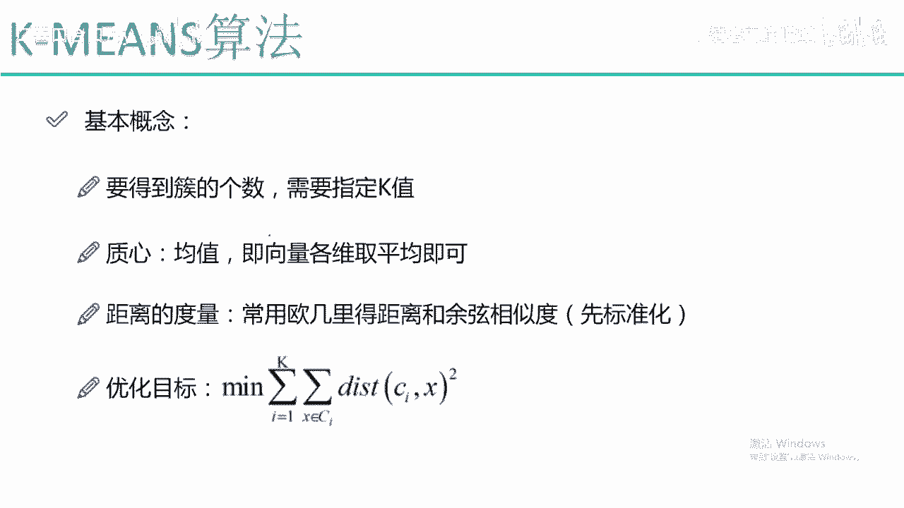
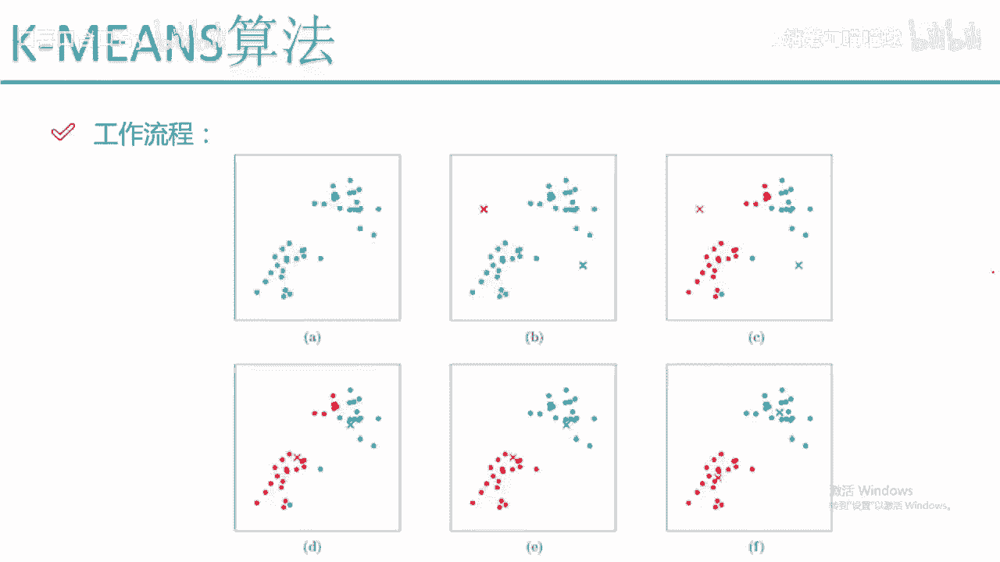
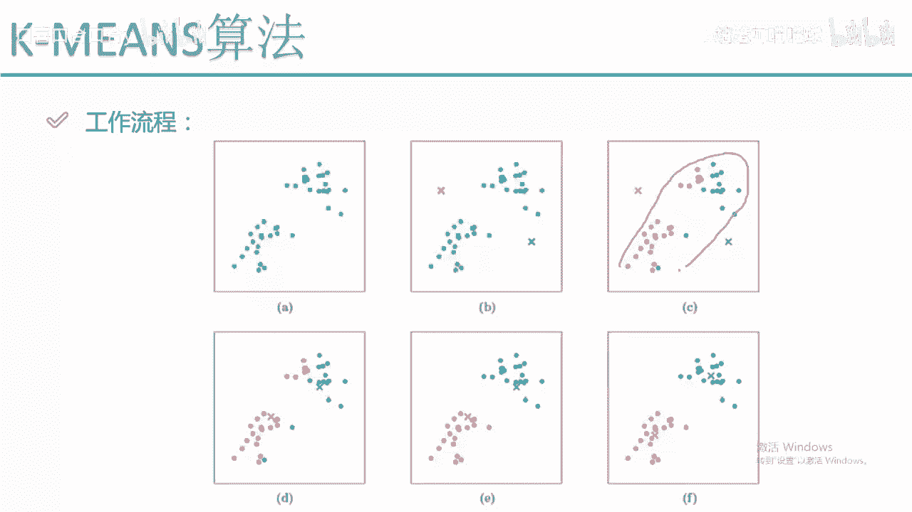
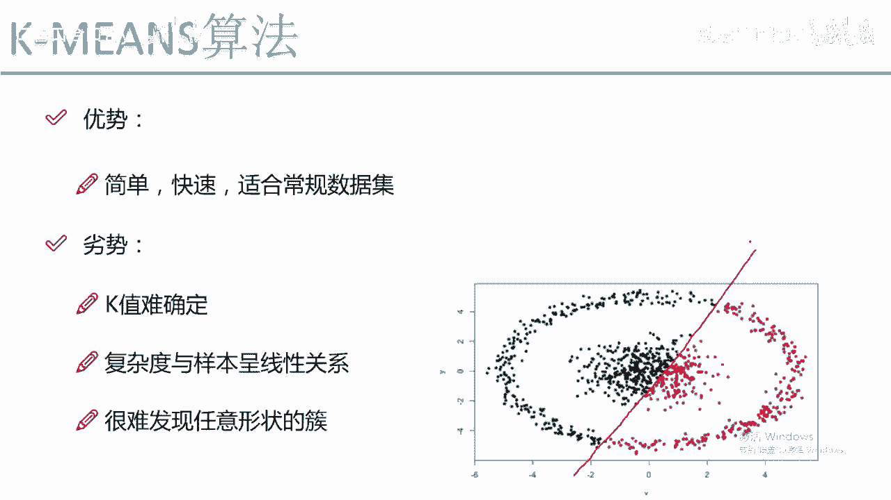
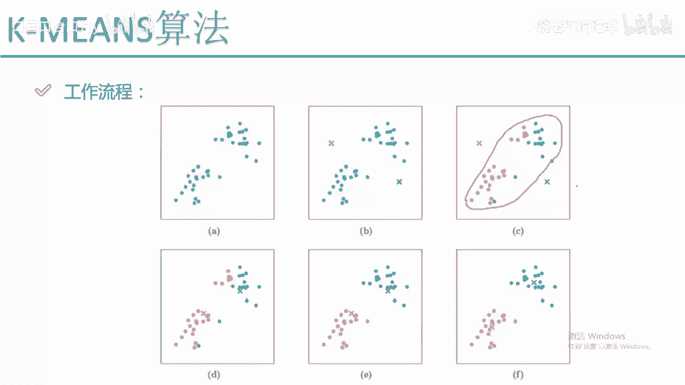
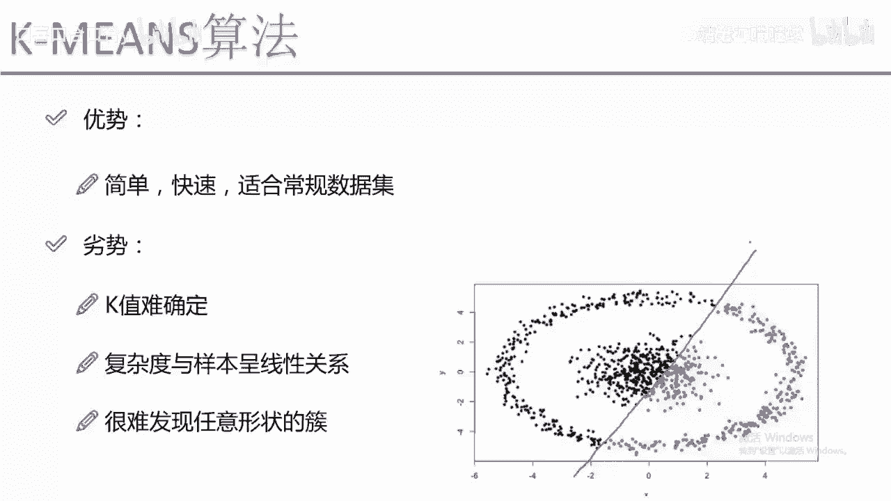

# 【2024版量化交易】全B站最用的python金融分析与量化交易实战课程，整整100集，3天从入门到项目实战，学完即可做项目，少走99%的弯路，学量化交易看这套 - P59：59. 59.59.KMEANS工作流程(Av1302064773,P59) - b站第二喵喵球 - BV1tm2mYuEbE

那下面呢咱们来看一下我的这个KM算法啊，它的一个工作流程啊，咱们从这几个图当中来看一下，首先呢就是我的一个原始数据啊，我有一堆点，一开始的情况下，就是由于我是一个无监督的问题。

我并不知道每个点它属于每一个，就是不知道每个点，它它到底属于该属于哪个簇呢，那这回啊假设说我用k ma算法，我需要指定个参数吧，我让K等于二，K等于二，什么意思啊，K等于二，首先它会在你的算法当中啊。

初始化两个点，比如说初始化两个点是一个X啊，是一个红色的和一个蓝色的，这两个点啊，基本上都是随机的进行一个初始化，假设说我在地图当中就随机初始化两个点，这两个点就落在了当前的一个位置，然后我要干什么。

然后我要基于这两个初始化点算啊，每一个其他的点都属于这个红色的还是蓝色呢，怎么办呢，对于一个点来说，比如说啊对于这个点，对于这个点来说啊，我怎么看它属于这个红色的还是蓝色呢，算他这样的一个距离。

比如说嗯这个绿色的点，然后我去看了一下它到X的距离，这是一个到红色距离，是一个第一到蓝色距离是一个第二，那有什么样的一个趋势啊，肯定第一它是小于D2的吧，第一小于第二，我们认为什么。

我们就认为当前的这个点它是属于红色的，为什么，因为距离越小啊，距离越小，它可能越相似啊，所以说我说当前这个点它是属于一个红色的，那对于另外的一个点呢，对于这个点来说，同样啊，我还是去算这样的一个距离。

还是有这样的一个D1和一个D2，也就是说对于样本当中我要进行一个便利了，所有样本点都要进行遍历，每一个点都要算啊，它跟我同色的点，它跟我红色的第一个初始化至心和蓝色，初始化至新的一个距离。

总能够算出来距离的一个大小吧，贼小我就说啊它是属于哪一个簇的，这个是我中间的一步，我要进行一个大量迭代，把每一个样本点都算一遍啊，它属于它是它离哪个至今比较近，那在C图当中啊，我们就算出来了。

对于所有点来说呀，我们算完之后嗯，一些离红色近的，我画成了红色，一些离蓝色近的，我给它画成了蓝色，这一步啊，就是说嗯现在哎呀我已经划分出来了两堆，一堆红色的，一堆蓝色的，那现在来说这堆红色的和蓝色的。

好像来说跟我的要求不太一样吧，其实呢咱们一打眼可以看出来怎么样，一打眼我应该看这是一堆，这又是一堆吧，但是当前呢画的效果并不是很好吧，所以说呢我要干什么，我要进行一个更新，更新是什么。

更新是更新我衡量的一个依据，咱们刚才是不是说嗯，我的一个至新的选择是一个随机的选择吧，随机的选到了左上角和右上角，这个红色的和蓝色的，那你随机选择肯定是不太准的吧，那这回我要进行一个更新，怎么更新呢。

咱们再来看对于所有的红色点，我们来看啊，这一块对于红有所有的一个红色点，我给它框出来了，我们来算重新的一个至新，最开始的质心是这个吧，现在我认为它至今我要进行更新了，怎么办呢，把我所有的红色点都拿出来。

都拿出来之后啊，我重新算它一个质心可不可以啊，完全可以吧，就是这些点它都是有个数值嘛，在X轴，在Y轴上都可以有一个数值，在高位也是一样的，我重新算一个质心，比如说重新算出来一个质心。

大概是在这样的一个位置，那可能这个位置啊，就是这个位置是我的红色的一个质心，那对于蓝色的数据样本点呢，同样的方式吧，我还是要算蓝色的一个质心，也就是说啊，现在啊当我进行完第一次迭代之后。

我要重新再更新一遍，我的一个至新了，咱们来看在这个地图当中啊，做点什么事啊，把至今进行了一个更新吧，我们来看红色点落到了这个位置，它的至今蓝色点落到了这样的一个位置，也就是说我要更新了我的一个至新。

那至新更新完之后要干什么呢，至新更新完之后啊，要重新进行计算了，重新呀，对于便利样本当中所有的点，比如说原来红色点，原来红色点我们还要重新算啦，我们来看它到红色的距离，和它到蓝色的距离谁大呀。

显然是到蓝色的距离距离比较小吧，那这个时候原来第一次的时候它属于红色点，现在呢在我做更新的时候，我就要给它做一个改变了，让它是等于一个蓝色点，为什么，因为它离蓝色至今比较近呢。

所以说啊我就给它更新成了一个蓝色的点，然后呢我接下来我来看，原来啊这块儿有一个蓝色点，但是它离红色的点比较近，所以说为它再次更新的时候，它就变成了一个红色的点，也就是说啊当我更新完至亲之后。

还要按照跟这个B图差不多的一个模式，再遍历一遍所有点到质心的一个距离，然后看谁小，就把每一个点划分到啊，对对应的一个簇，这个就是我的一个D啊，我要进行一个更新了，更新完之后啊。

咱们来看变成了这样的一个趋势，变成了这样的一个趋势之后，咱们要干什么，按照之前的套路，还要更新我的一个至新吧，又把我蓝色的至新更新到这个位置，红色之心又更新到这样的一个位置，更新完至新之后再进行遍历。

找每个点的一个归属，然后呢不断的更新下去，直到啊我更新到某一步的时候，咱们所有样本点基本上都不再发生变化了，不再发生变化，我们就说这个更新啊已经基本上结束了啊，因为你再更新它也不会发生变化嘛。

每次更新的时候嗯，就是后几次更新的时候啊，它的样本点就是这个属于红色，永远属于红色啊，属于红色永远是这一堆，属于蓝色，永远是那一堆，不再发生变化了，这个就是我k means这个工作的一个流程。

是长什么样子，这里呢咱们是假设啊，是说啊K等于二，那K等于三什么意思啊，K等于三，比如说在这里呢我又多了一个颜色，比如说我多了一个黄色，多了一个黄色，它至今可能是在这样的一个位置。

那可能一开始画堆的时候，我可能说这是一个黄色的墩儿，这是一个红色的墩儿，这又是一个蓝色的墩儿，就可以分成三堆了，分成三段啊，各自在更新至今，我就可以得到一个呃一个有三对，一个有三种颜色的一个醋的结果了。

那这个就是给大家看了一下，我们k miss实际的一个工作流程，从他的一个工作流程角度来说啊，还是比较简单的吧，就只是啊咱们选至新，然后更新至新，更新完之心不断迭代下去，最终就可以得出来它的一个结果了。

k ma算法是我觉得当中一个。

非常非常简单的一个算法啊，原理非常简单，但是呢它也是比较实用的，就是用起来用的也是比较广泛，然后呢咱们来说一下它的一个优点和缺点吧，首先啊优点啊，优点来说理解上非常简单吧，啊做这个事也比较快。

直接选K值就可以了，需要我们考虑的东西啊，并不是很多，考虑个K值就可以了。

然后它适合什么，适合一些比较常规的数据集啊，什么叫常规数据集啊，像我们这个数据集这个两对啊，完全就是基本上能够，咱们看起来它就能够分得开。

所以说啊这个是一个非常常规的一个数据集，然后呢我们来看啊，它就是优点啊，咱们就不多夸大了，主要来看它的一个缺点啊，缺点是什么，缺点第一个点它要设置参数吧，只要它需要设置参数，那这个问题都是比较难的。

因为这个K值啊很难去确定啊，当你拿到了一个数据之后，你能稳，就是你拿到数据之后，你可以给它做一个可视化展示，但是呢你由于不知道它的一个标签的一个呃，就是标签是什么，所以说你很难去知道。

到底这里边你给它做一个十粉，给它锯成十个醋，还是聚成五个簇，还是聚成八个簇啊，到底这个K值该选择什么是比较合适的，这个点是非常非常难确定的，普遍情况下我们都需要啊设置多组，然后看一下它的一个效果的。

然后呢他的一个复杂度啊，我们来看刚才看了，就是复杂度是跟样本个数相关的吧，因为每一次我们在更新一个质新的时候。

在更新的至新的时候，是不是说所有样本都要跟我。

至新进行一个计算啊，那如果说你的样本是特别庞大的，那它这个计算的一个复杂度啊是比较高的吧，因为它是跟样本呈现出来，这样的一个线性的关系啊，样本越多，计算越多，它一旦样本是个几千万的。

那这个复杂度就相当高了，然后它最大的一个问题是什么，最大的一个问题，他非常难发现一个任意，或者说是比较奇怪的一个形状的醋，因为你的一个数据啊，并不能完全保证它就是一个就是归了八整的，这个不能这么说。

就是一个非常规矩，非常普遍的一个错，有可能你的醋是我右图的这种形式，右图啊它是一个环绕的形式，我们可以认为它里边正常，咱们可以认为里边是一个簇，然后外边它又是一个簇吧。

那这回如果说你拿k means去做聚类的时候，他没办法把里就是把里层和外层分得开，它会分成什么，它会根据我的一个就是根据我的一个至今啊，会画生成这样的，左边是个醋，右边是一个醋。

也就是说啊我的k min算法嗯，它在聚类上虽然说用的比较广，但是呢它有一个问题啊，就是对于这种任意类型的醋啊，它很难给它发现出来，聚类出来效果并不是很好，这个是我K面算法它自身的一个缺点吧。

就是嗯对于有一些醋啊，我们还是不光就是不能用这种K面算法，尤其是你的醋哎呀，你可以画出来这个醋哎呀，长得奇形怪状的，而且环绕的呀，或者缠绕在一起的呀，就是说有一些交叉的。

这些啊我们很难用k means给它挖掘出来。

那这个就给大家讲了一下我们k ma算法，它的一个工作流程。

以及呢它的一个优缺点啊，还有它的一个基本概念都是长什么样子，一个非常简单的啊。

