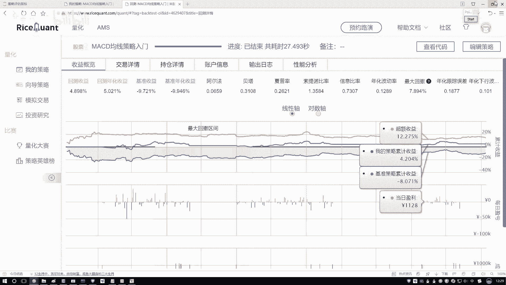
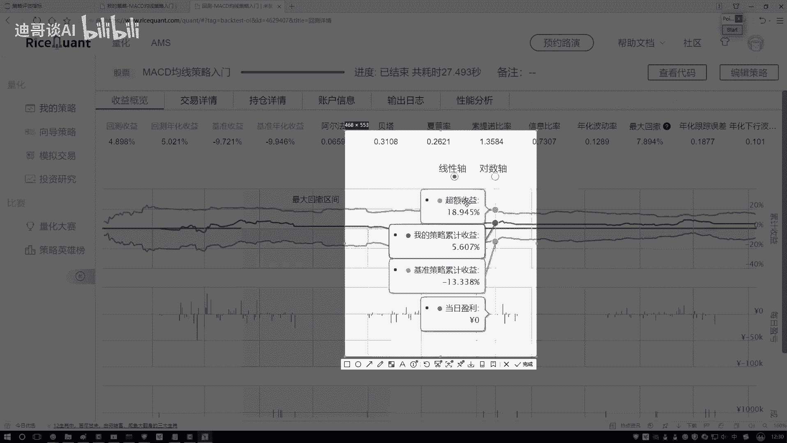
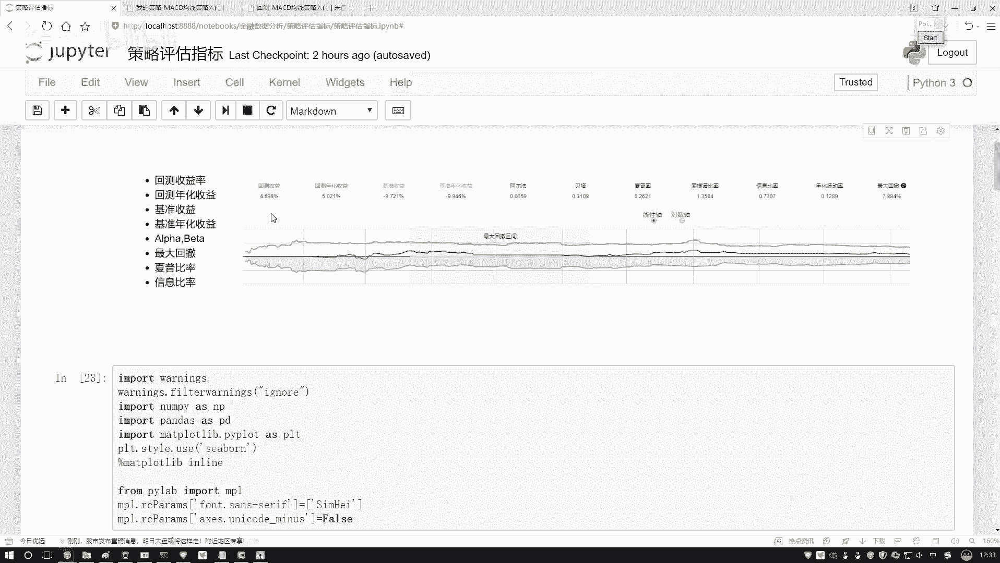

# 【2024版金融量化】AI结合金融如何做落地项目？迪哥手把手教你3天从入门到项目实战，学完即可做项目，少走99%的弯路，学量化交易看这套！人工智能／计算机视觉 - P19：5-阿尔法与贝塔概述 - 迪哥谈AI - BV1NW421R7d7

最后啊咱们再来说一下这个阿尔法，还有贝塔啊，其实就是在我们测略当中啊，还有两个值。你看这里一个阿尔法一个贝塔吧啊，咱们再来说一说呃，阿尔法贝塔是这样一件事啊，就是呃好比说吧你现在赚钱了。

那你这个钱是怎么赚呢？我说你赚这个钱啊啊是分成两部分，反正你说你写了一套代码，写了一套策略，或者说你去选了些股票吧，做一些事情，赚这个钱分两部分。

一部分呢是说哎呀现在整体这个市场那大环境就好的那大环境好，那自然你就能赚钱吧啊，就是说一部分是跟这个市场啊相关的那另一部分呢我说呀另一部分可能这样。😊，它跟市场不是太相关，跟你的一个努力是相关的。

比如说你每天哎都在去考察各个公司哎，考察他们当中财务啊或者这个信息，那个信息，哎，或者他们的一些公司的运营公司状况之类的。你独具慧眼了。然后呢你去发现了一下，哎呀，当前这个我该怎么去操作。

能够使得我去赚钱啊，相当于你有两部分一部分是跟大市场大环境相关的。另一部分呢是跟你的策略啊，跟你的一个敏锐的观察力啊，或者是跟你的一个手法吧相关的啊，组成两部分可以吧。好了。

我们所谓的一个阿尔法和贝ta就是分别去衡量我刚才说的这两部分的啊。来看一下吧，它的一个定义。说这个阿尔法啊，它叫做一个呃不用管它一个定义了，叫非系统性风险。其实它就是这样一件事啊。

它描述的是就是呃你的一个投资吧，或者是你的一些策略，或者说你做了一些什么事儿啊，与市场的波动是无关的啊，就是大市场大环境怎么样，就你做这件事跟它没关，主要是你自己努力来的。

所以说一般是跟它衡量你的策略哎，怎么样，这有个指标叫做一个阿尔法。然后呢还有指标叫贝塔贝塔是这样贝ta就是说你现在啊就是跟大妞混呗啊，跟大妞混，你也能挣钱，跟大流混。

可能就是大大大市场它的一个走势表示啊就是投资的一个系统性风险啊，就反映了你的一个策略，对大盘的一个敏感性吧，就是说白了就是市场收益啊，它是跟这个贝塔是挂钩的，超额收益是跟这个阿尔法相挂钩的。

我解释一下什么叫市场收益。😊，看这个图吧这个图这个图当中，你看这里也是有这样呃，我看这这这这这都怎么还有负的，来随便哦，这还不太好截图，这样咱随便截一个位置来看这个位置吧。

你看现在有什么？现在这里有有一个点叫做我的策略收益，是不是啊？就是你现在做了一件事儿，然后你的一个收益多少，然后基准策略收益基准策略收益就像我刚才说的，这是个大环境，这个大市场。

比如说你的一个呃金百股票，300500的股票，然后它的一个指数，整体的一个走势可以吧？相当于就是大环境它的一个走势。😊，那这里呢还有什么？还有一个超额收益，超额收益是什么？

就是用你的一个策略减去哎市场的走势。通过你哎是因为你的策略，你的努力所带来的个收益叫做超额收益啊。所以这里咱们就把这个蓝色的啊，现在所要在这个位置，你就当做是市场啊，它的一个大环境。

然后这块啊就这块的策略的不管了超额收益就是我们独具会员，咱得到的哎我想要的一个结果，那在这个任务当中呢，你看超额收益是什么？通过你的策略带来的，是不是市场收益呢就是你跟着大盘走，它所带来的一个收益吧。

所以此时啊我说最终我们的一个总收益，哎，把它比作成两部分，一个是市场收益，一个是超额收益啊，然后市场收益啊，它有个系数贝塔超额收益，它有个系数阿尔法。其实你说这两个东西就是贝塔阿尔法怎么求出来的呀。😊。

你看它像什么？我说这个东西啊，它是Y就是就是一个回归方程，可以吧？在这个回归方程当中啊，有两个什么，有一个贝塔，有一个阿尔法，我让你把这个因子给它求解出来，是不能去解呀。

咱们可以按解现有方程方法把它解出来吧。当然这个只是其中一种做法啊，等后续咱们来说因子策略分析的时候，哎给大家专门去讲啊，这些具体啊，我们这个策略该怎么去办。现在啊大家只需要知道有这么两点就行了。

一个叫啊这个贝塔贝塔意思啊就是说哎这个东西它是跟市场相关的，然阿尔法这个东西是跟市场无关的。其实你要干什么，你说我们目的是干什么，我目的是赚钱是吧？你说市场你能改吗？就前面这个东西他爱谁谁吧。

为什么这么说，市场这个东西啊，说白了你无能为力吧，你改变不了啊，你也没那个本事，所以说我们的关注点在于什么，你就关注点就在于怎么样获取一个超额收益吧，这是我们的一个目标。😊，所以说啊通常情况下。

咱更关注什么我们的一个阿尔法吧，怎么样获取更多的超额首益，这是我想要去做的啊。行了，就是简单了解一下，先了解一下这个阿尔法和贝塔，它表示的都是哎哪两哪两个层面的一个意思就行了。后续咱们再详细去说吧。

好了，这里给大家看了一下，就是呃在我们这个指标当中啊，有一些常见的啊，我都给大家举个例子，咱们来简单唠一唠公式不用去记啊，记完了后面你你也忘了，你就知道哎，比如说这样一个什么最价回撤或者一个小比率。

一说到哎，你知道什么意思就行了啊，不用去记它的一个公式，python实现简单量也行。因为实际咱运用过程当中啊，基本上也不自己去写啊，有很多工具包以及呢这些现成这些平台能帮我们去做吧啊，这块还有基本收益。

基本收益，咱我记得好像之前忘说了基本收益这样。😊，基本收益像我刚才说的，就是呃你什么都不做啊，你跟着大盘玩，然后它的一个它的一个收益的结果，那你看你什么都不做的时候，可能怎么样，还是个负的啊。

我们要做的就是去获得它的一个超额收益啊。行了，这里给大家解释了一下，就是在策略评估当中啊，一些我们的评估，还有风险指标都是什么意思。😊。

