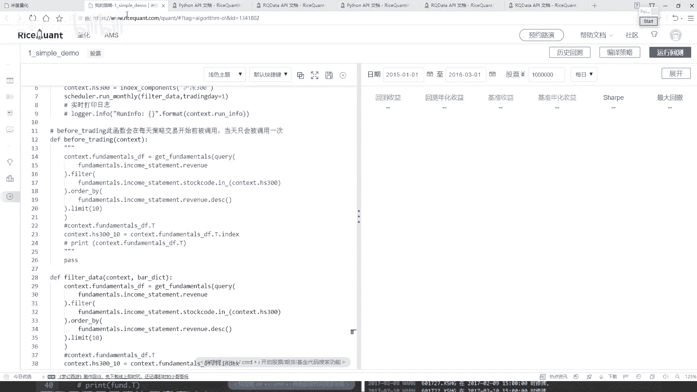

# 【2024版金融量化】AI结合金融如何做落地项目？迪哥手把手教你3天从入门到项目实战，学完即可做项目，少走99%的弯路，学量化交易看这套！人工智能／计算机视觉 - P26：4-定时器功能与作用 - 迪哥谈AI - BV1NW421R7d7

就然想起啊，就是咱们之前选的哎，这个时间，你不是2016年1月4号到这个2016年10月4号嘛？所以说啊就是每一天那咱们刚才做这个事儿，你看啊这里咱们之前说的时候。

handle part里边每一天都会去做吧。be垂顶当中也是每一天都会去做吧。那所以说咱们现在得到结果，那每一天都会去产生一些交易吧。你看这块它都是详细给你列出来了。😊，这个1月4号啊。

反正给你选出来这这这这这几个这10个是吧？选出这10个，然后肯定第一天都是买的，因为第一天只有这样一个买，并且是一个平均的一个买吧啊，就是占到你的一个总价，它是一个平均的。然后总共是10万块钱。

那就是相当于每一个买这么1万块钱呗。咱之前这里。😊，是不是指定了，我第一天第一天肯定执行的是这个东西是吧？因为第一天的时候，它这块怎么样，等于等于零了。你的仓位当中啥也没有啊，所以说第一天他是买。

那咱们刚才写的是不是平均买啊，这个平均买就是这样，就是你见有10万块钱，然后每个股票你买这么1万块钱啊，它是这个意思。😊，然后你看中国实话，然后他是有买，然后这有个成交量。

然后这个成交价费用就是你那个什么印花税啊，然后还有什么还点，还有一些其他，可能也就是几个几一点一点费用吧。一般买的时候都会存在一些费用的。😊，然后下面就是啊第二天第二天的过程当中啊，他又会进行一些买。

还有卖吧。因为它要保证就是咱们的一个。仓位吧，你要把卖出的东西了，那你还要把这10万块钱给就是给他就是你先有多少钱，你都要给他花掉吧。这个意思啊，所以说这块第二天开始它就出现了一些买卖，然后成交量。

然后成交价，这个就不给大家一个看了。大家感兴趣，自己把上去拉吧，这有很多天了啊，就是你一然往去拉，咱们能得到所有它的一个详细的一个交易的一个结果在这里，你可以把它的一个结果展开。

或者说你想看哪些指标咱全看是不是都行啊，或者说你把这个东西啊也可以下载下来啊，这个就是供你自己来去分析一下，这些东西啊都是啊你去模拟的一个实际的情况。😊，持仓持仓也是一样的，就在这里啊你的一个价格。

然后你现在比如说这个股票你手里啊，它有了多少钱，然后你可以去看每天它的一个盈亏，第一天肯定都是零。因为第一天都买了。然后第二天开始啊，是不是发生了变化了。你可以针对啊你手里有的每一个股票它给你去看啊。

当前是亏了还是赢了。😊，给我的一个感觉好像大部分情况下都是亏了，这连着亏了多少天了。你看从这里连着亏，是不是？这可能就是我看一下咱们那个最大回撤，是不是就是最开始的时候。😊，你看最佳回收区间来了。

这个是不是刚才我看的一堆绿的呀，什么？这就是我刚才说的最大回撤区间了。你能不能挺过去的一段趋势了？挺过这一段后面是不是稍微的给你涨了一点啊，有这样一件事儿吧，这个哦在这里。😊。

相应当中也会有这样一个指标，详细给你介绍每一天你的一个情况，这连着亏了多少天啊，占了整体时间的一个17点多啊，占的还是挺多的。然后你的一个账户信息。每一天你的一个呃你的一个市值吧，就是当前啊。

你就反正就是看10万块钱到底让你霍霍成多少钱了。那你可以往后最后翻。最后大概咱们刚才看是亏了点吧。我看啊最后啊最后是亏了一些，但还好啊，亏的不是特别多，这块有你的一个账户，嗯就是你就看你的一个市值。

然后它的一个变化情况吧，这就行，这就是你的一个变化日志就是你要不要去打印出来一些东西啊，警告这个东西咱可以不看性能性能这个东西呃，咱咱也不用去看了。这些就是咱们得到的一些简单的结果跟大家做了一个分析。

😊，然后呢，你把鼠标点到这里的时候，它就给你显示出来，就是这里啊有一个你的一个策略手页，就这里。

你看这块有我的一个策略收益，然后它是一个呃反正都是负的是吧？然后一个基准的，然后当前你的一个就是你的一个情况，然后这个超额收益就是你的策略的，然后减去什么，减去你的一个基准的。

相当于你比这个基准能强多少哦，这个意思。

这些啊就是呃咱们当前第一个简单小例子吧。然后大家大家可能有个问题，就是现在啊可能看这个代码，在 handle当中啊，咱怎么处理的，那每一天都处理，那你说你买股票用每天都去做这样一件事吗？

好像不一定需要去做吧。可能我说我作业间隔，我说我10天啊，去在这个池子当中洗一个牌，然后看看哪1个最好的，或者说一个月洗一次牌是不是也行啊？咱能不能把这个时间点，我说我自己来设置一下啊。😊，也可以啊。

这块我们也可以自己就是自定义一个函数。所以自定义一个函数的意算要给大家说一下啊。对这一块我们还有1个API也挺常用的。先来看一下在这里呃，这里有这个东西啊，叫做一个定时器。

大家来看一看定时器是这样一个意思就是。哦。它是就是按照一定的一个时间间隔吧，来去执行某一个函数。比如说啊你看在我们的这个测略当中啊，我们测略当中这块我说每一天哎你都要洗一下这个牌，那洗的数候太勤了。

我说这个定时器，我说我我给你设成这样吧。我说你每1天洗一次牌行不行？是不是也可以这样啊，咱可以自己去定义啊，什么时候去做这样一个洗牌操作。你看这里有每天运行，还有每周运行或者是每月运行是吧？

咱们来试试吧。举个例子，我说这个东西啊，咱就每月运行吧，然后看一下它的一个参数。第一个参数啊，它有什么，你自己写一个function，自己写一个函数吧。然后这点就是每月当中你选择呃比如这个月底吧。

有好多好多交易日啊，你选择哪个交易日啊去执行这样一个操作啊，这些是我们自己要去写的，咱默认就拿第一个交易日吧，咱一会这块写一个一，然后呢这里你看呃当我们去做的时候，这块让你写个方吧。

这个function就是呃每月然后第一个交易日的时候要做一件什么事，那这里啊就是我们不能给它写到这个before trading定当中了，咱们得稍微的改一改。😊，比如垂顶当中呃。

这里咱就是呃我看一看这里呃测略当中这个比如垂顶这一块，我说我就得给它注释起来了。好了，be如 trading定给出师起，然后我们自己得写个函数吧，直接复制个名字，先复制个名字，自己写个函数。

这个函数叫做一个呃就叫做一个filter data吧。😊，啊，去过滤一下咱们当前的一个数据。然后呢，这个代码也不用自己写了，直接把所有这个东西咱全复制过来是不是就行了呀？然后呢。

我说在这个我看一下这个它不是有个要求嘛？你看我这个当前我说这个每月运行能在哪使用，只能在你的一个构造函数int模块当中去使用其他地方不能用啊，所以说我把这个函数给它复制过来，在测略当中。指定一下吧。

好了，我说加上我们的一个定时器，加上定时器。第一个function，你自己写的函数，咱这块是不是写了一个filter data啊？好了，我说我把这个fil data给拿过来。

然后每个每个月第一个交易日吧，来去执行这样一个操作哎，是不行啊？其他代码你说我用改吗？那其他代码都一样的，再也不用去改。好了，咱每就是每个月我们做一次洗牌。

这样还是这个16年1月4号到16年10月4号吧，来试试吧，是这个结果怎么样再来运行一下？😊，看一看他的一个结果。不一定好也不一定坏啊。因为这个东西啊咱们现在指定策略相对来说比较简单啊。

可能可能还不如刚才呢，不不好说，咱来看一看。😊，呃，完了还真不如刚才刚才我记得是亏了4点多是吧？现在亏的更多了。😊，可能这个就是你自己不断的去实验啊不同的一个效果的。然后这也这样，我把这个时间点改一改。

我说你嗯可能这个16年可能这个16年不太好啊，我换一个年，我说这样吧，咱们给他指定成1个呃18年。😊，18年的1个1月1号，然后到这个。20年吧，到这个20年的1个呃3月，然后一号吧，再执行一下呃。

结果好不好，这个东西都不好说啊。咱今天给大家举这个例子，只是跟大家去说啊这些API咱怎么用啊，至于他具体这个结果到底怎么样。这次。😊，对于这个结果，我估计刚才看可能不太好，刚才看到一个负的28点多是吧？

可能这个结果还不如刚才呢来看一看吧，还不好说，等等他跑完的。😊，好了，这个结果跑完了，跑完之后。😊，果然不出咱们所料啊，咱们设计了一个非常牛策略啊，就是跟着你的指数走，哎，基本不咋亏。

跟着咱们这个策略玩，那亏的啥也不是了，是不是？所以这一点啊就是可能你选择呀一个不同时间点，或者说指定咱不同的策略方法，你看刚才我就改了一个，你把电视界刚才原来咱们是每天执行，我说现在改成每月执行了。

这个结果怎么样了，那可能就完全都不一样了吧，这个效果不太好，换一个时间点。😊，我换1个2017年吧，然后到20啊，不别别了，我换早点吧，2015年可能15年的时候能挣一点。到这个2016年吧。

咱再执行一下。啊，试试水玩一玩。其实这里啊主要给大家就是说了一下这些API啊该怎么样用。然后呢，这些指标咱们简单的做一下参考就行啊，就是呼吁大家。你看我换了一个时间点，这这哎呀刚才是正的。

现在怎么突然变成负的了？😊，可能就是这块出现点小问题。如果说咱们只取前面这一段，我看看啊，我说这个策略，你看在在哪儿啊，在当前这一块，我你看到此时的时候，哇，咱们这个收益怎么样。

你看这一块还是比较大的吧，盈利也是比较多的啊，再往后那又不行了，可能这个可能这个大盘也这样吧，15年15年初到15年中旬可能是一个好时候，后面可能就完蛋了这样一个事。行了，这里主要给大家说了一下。

就是在我们策略当中哎怎么样，基于这个平台啊进行一个基本代码的一个写法，其实基本的写法还是thon啊，然后就是参考人家API就是勤看API吧，API当中啊都有什么。😊，这些个函数吧，像我跟大家讲的，哎。

你说我怎么知道在这块有写个query，然后query当中要有什么filter，要有old by，要有la。接下来的就是参考人家的什么人家的API文档来去写的这个工具。哎，大家都开始刚开始去学。

那说白了谁也不知道他怎么去设计到最好学习方法就是参考人家文档自己来做一些实验就行了。这个现在大家说了一下，我们这个平台当中啊，基本的一个使用方法。😊。

