# 【2024版金融量化】AI结合金融如何做落地项目？迪哥手把手教你3天从入门到项目实战，学完即可做项目，少走99%的弯路，学量化交易看这套！人工智能／计算机视觉 - P28：2-基于百分位去极值实例 - 迪哥谈AI - BV1NW421R7d7

接下来啊咱们要完成这样一个操作。我说现在啊这个数据啊，它的一个范围我就不管了。我说现在那Q1我们能算Q3我也能算。我说小于这个Q1的那就都等于Q1吧，大于这个Q3的，咱就全等于Q3是不是行啊？

相当于数据你给它规范到一定的范围当中吧，我们要做这样一件事。好了，咱来看一下吧，怎么样去做。首先我先指定个列名啊，对哪个列只行这样操作。我随便选一个，咱们只是举例子，也不选什么因子了。

随便选择一个列好了，列选完了。😊。

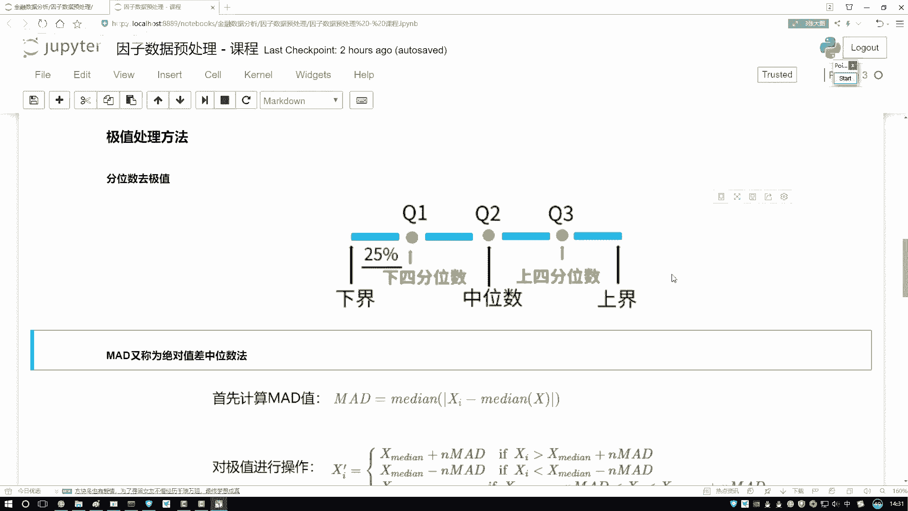

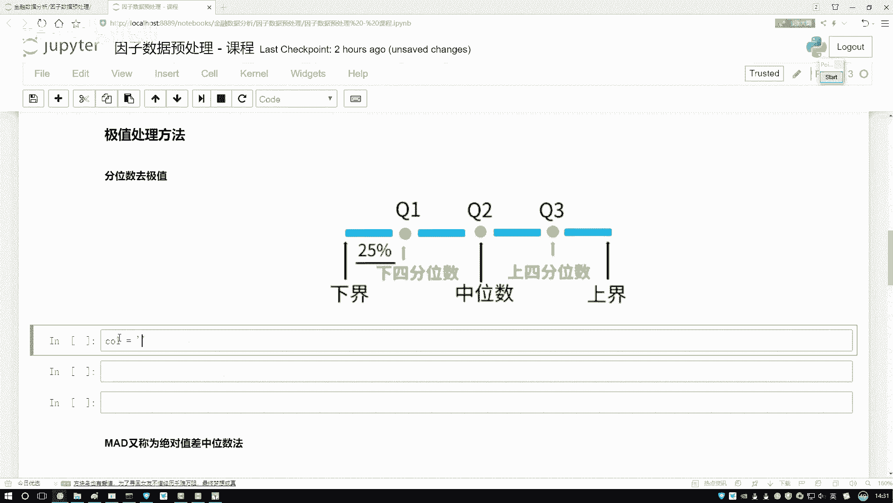

那接下来我说要写个函数了，这个函数啊帮我去做了我们当前的一个过滤操作。过滤操作谁呢？是不是说我们现在啊对我的这个极值来去执行咱们当前的一个按照什么百分比吧？其实这里啊我说的是一个按照一个Q1，还有Q3。

那你说按照一个别的百分比，咱能不能去做呀，是不是也行啊？哎，这是我们写个函数，在这里我们要过滤。那一会儿呢我会传件数据啊。

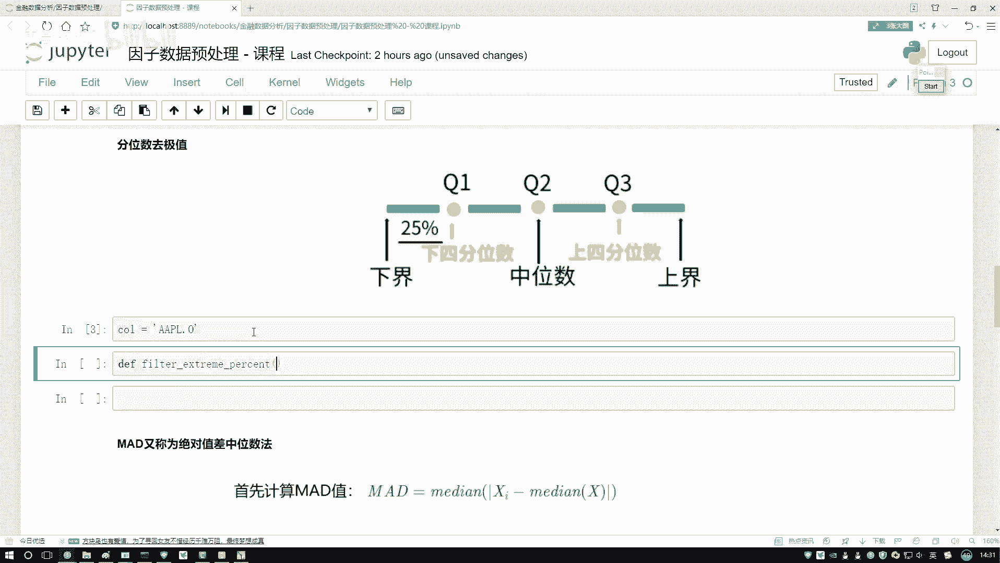

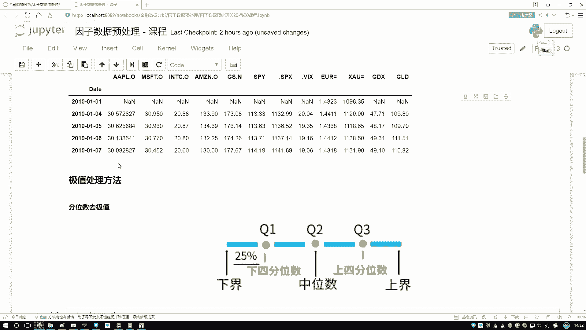

数据，这是一个datad当中我们选了一列，是不是选了一列啊？一会儿，那一列是什么？一列它是不是一个serious结构啊？所以说我传进来的就是一个serious，然后呢，你还得告我什么？哎呦。

你的一个最小哎你想保留的是一个百分之多少呢？可以，比如说这个Q一，那是25可以吧，一会儿你可以自己改这个参数，然后再来一个参数，我说最大你想保留多少呢？这个任务当中，咱是不是就是一个75%啊，好了。

在这里我们来写一下。😊。

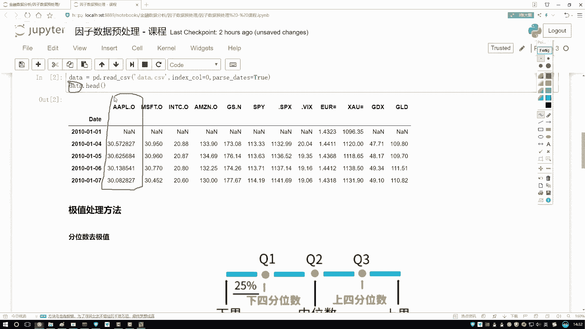

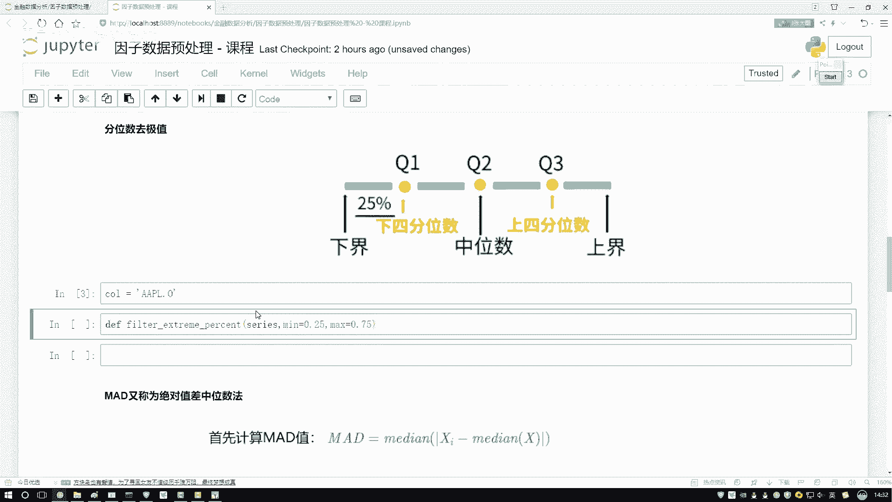

写吧，第一步干什么？哎，你说数据，你看一开始数据啊都是有大有小有大有小的不一定吧。那你说当我们去做这个中位数的时候，那数据得怎么样？那是不得按照从小到大，你得做一个排序啊。

所以说第一步咱们要对数值哎完成这样一个排序操作。因为只有啊你的一个排序完了，你才能去算哎，中间那个是哪儿，25%是哪，75%是哪儿吧？好了，对我来说。

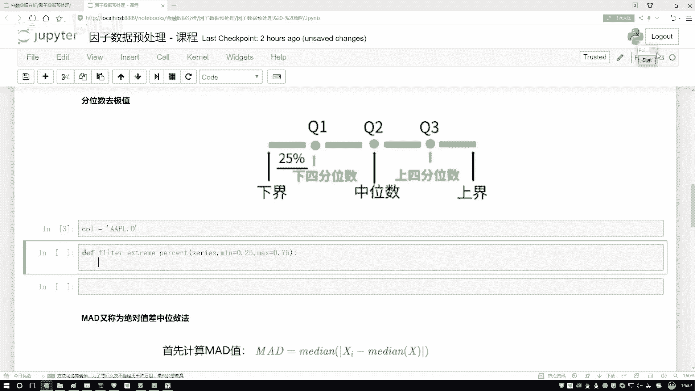

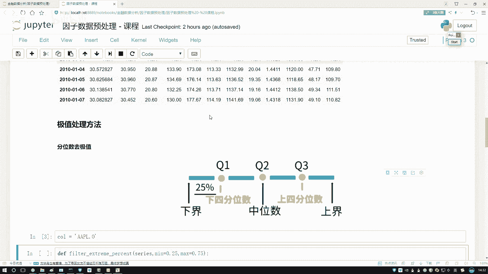

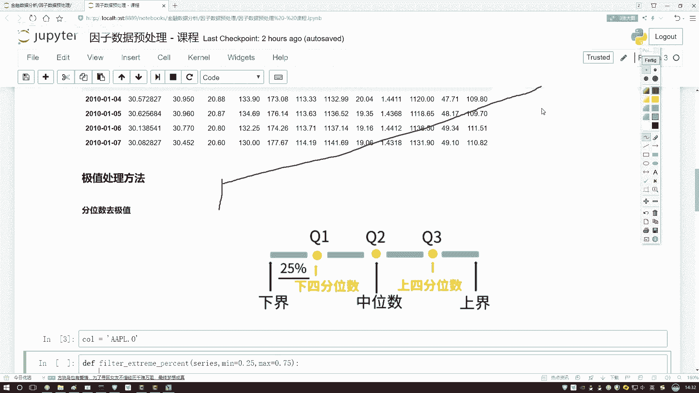

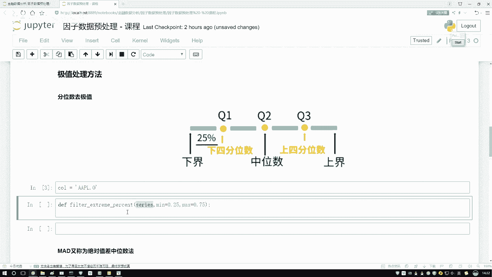

我说呀，我说对它做一个排序，st value一下st values，那就默认它就是一个从小到大排序的servious等于它当前的一个排序结果。这个是我对咱们当前这一列数据啊重新做排序了。

重新排序完之后啊，然后你是不是得告诉我，哎现在。你这里边你只给我传出一个25%和一个75%。哎，我说我是不是得知道啊这个25%是等于哪个数啊，75%是等于哪个数，我一会儿好做对比，哎。

小于这个数的都得这个数大于那个数的，哎，都得最就都都得那个大于那个数，是不是我得把这个最小和这个最大两个数算出来吧。行老，我师这里啊，咱说我现在有一个Q吧。

Q就是我的一个呃这里边存的就是我一会儿的一个最小的，和要最大的。好了，把这个ss拿到手。哎，这里咱可以直接有个函数啊，帮我们去完成这样一个计算的操作。呃，挺简单的，就是在这个判断当中啊。

很多函数咱都可以直接用起来。这个函数意思这样就是。当前啊你往这里边输进来了一个序列，然后呢，你跟我输入了两个参数。比如说你输入1个0。25和1个0。75，他就实际帮你算一下。哎。

在这在在这个Q1和这个Q3位置，它的值分别是多少？所以这块呃我把这个最小值。一个哎这块里边里边你传进来，就是传进来的是一个listlist当中，你说你要把数据当中你算哪些个值，我说算最小的AD。

25这个再算一个最大的0。75这个行了，然后呢，我说我写一个返回值吧。现在我是不是个最小有了最大有了，那接下来我是不是说得对我数据干什么了，做一个规范吧。这个n派这个函数是这样一个意思啊。

就是呃这里边比如说你现在有一个呃133579，然后1113吧。然后这一块你要传建三个参数，第一个参数就是你这个序列，哎，像咱们直接一会儿把这个ze传建就行然后第二个参数就是你希望这个序列当中啊。

一个最小值是多少一个幂。然后第三个参数就是你希望这个序列当中啊，最大的一个值哎，它是多少哦，我们要写三个参数，然后比如说你最小值它是等于三的最大值是等于一个。11到。那它会返回什么？

返回的也是一个序列啊，只不过说这个序列，我拿来策划这个序列它就变成这样了。你看第一个值小于三吧，会变成什么，小于三的哎，都变成三了，这有三3，然后呃357911。

最后什么也是一个11吧啊相当于把所有数据啊做了一个规范，在这里哎我们有三个参数，第一个参数，我的一个serv啊，我们当前的这个序列。第二个参数呢在这个Q当中啊，它会有两个返回值啊。

返回值第一个就是它的一个最小。因为这个序列当中，我不是传建两个嘛，所以说它里边就会有这么两个值那最小值我IOC以下它就是一个0是吧？要接来。😊。

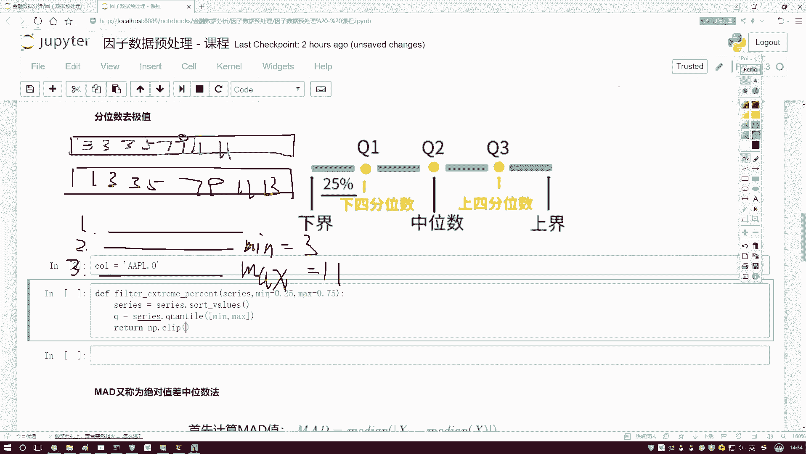

Q再点LOC下，然后第二个值最大值它就是一个一好了，这样我们就把当前这个函数给它写完了吧。相当于哎我们对应种方法，这个方法呢按照啊我传进来一个就是一个s啊一组数对这数数啊，我选了哎最小多少，最大多少。

然后呢你按照我当前这个比例把我这个数据做一个规范啊，这样我们就可以完成一个去极值的操作吧。好了，这里咱们先把哎我们的一个函数给它写完了。这个代码啊咱们是写完了，那接下来看一看它去将按集值的一个效果吧。

在这里我们来去执行一下执行下这个函数，然后呢针用这个函数就对我数据做操作吧。然后我数据就是啊咱直接写吧数据就是data对数据当中的某一列，我把这个列名给它传进去啊，这就完事了。

这样咱就完成了一个基本的按照百分位啊去一个去极值的一个操作。行了那我们去完了一个极值。哎，咱们给它指定一个。

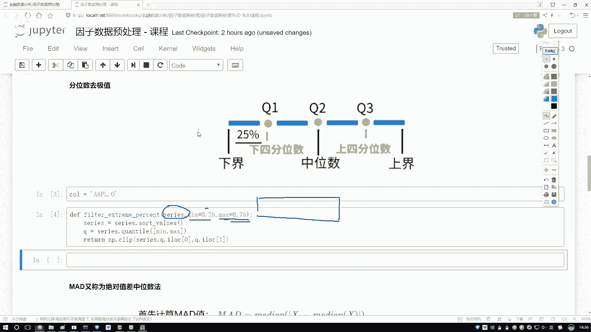

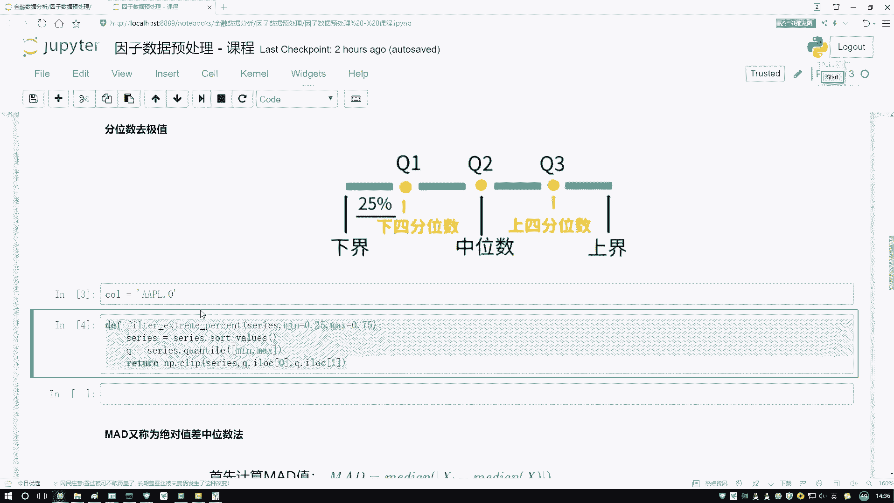

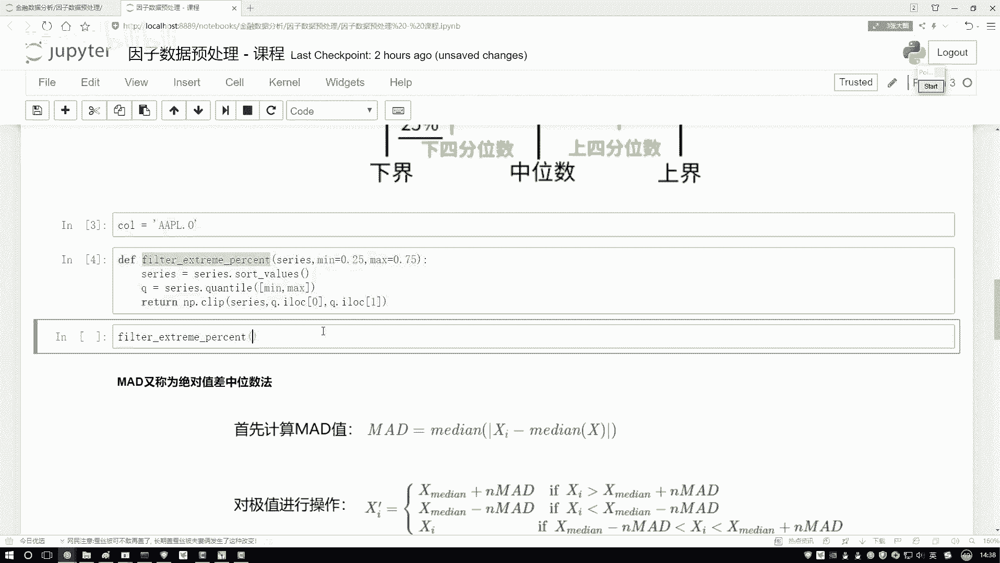

回值对于这个返回值来说呀，那咱们来给它画图看一看啊，现在这个结果它能长什么样子。呃，画一个图就是点pl一下。好了，这里我说。

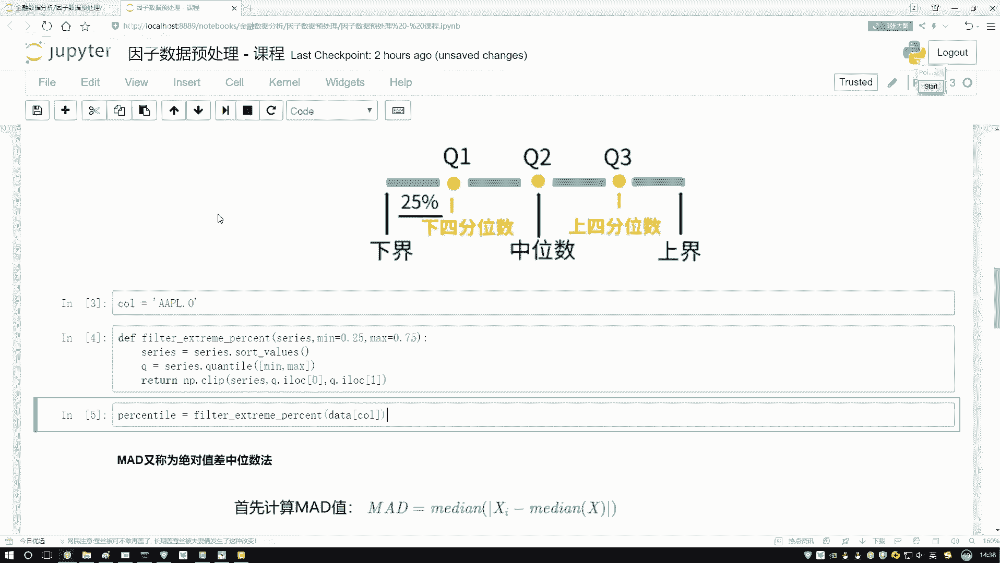

呃，哎，直接对我们这个结果吧，哎，直接对这个结果。对我当前的这个结果，我说给他点儿pute一下，p完之后，哎，这是第一步先做一个，哎呀，这样不行。这里边我们得画两个图，一个是原始的。

一个是咱们做完之后的吧。好了，我们就画两个，第一个就是一个原始的原始图啊，就是原始的一个数据，我去点pute一下数就行了。然后一个新的就是我刚才做完了我的一个规范之后，咱们再点p一下，看一下吧。

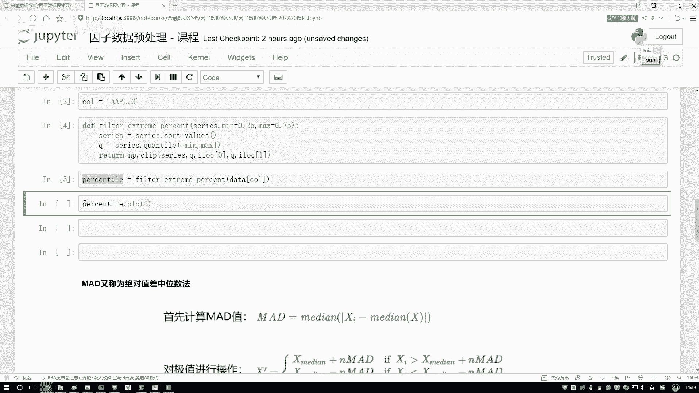

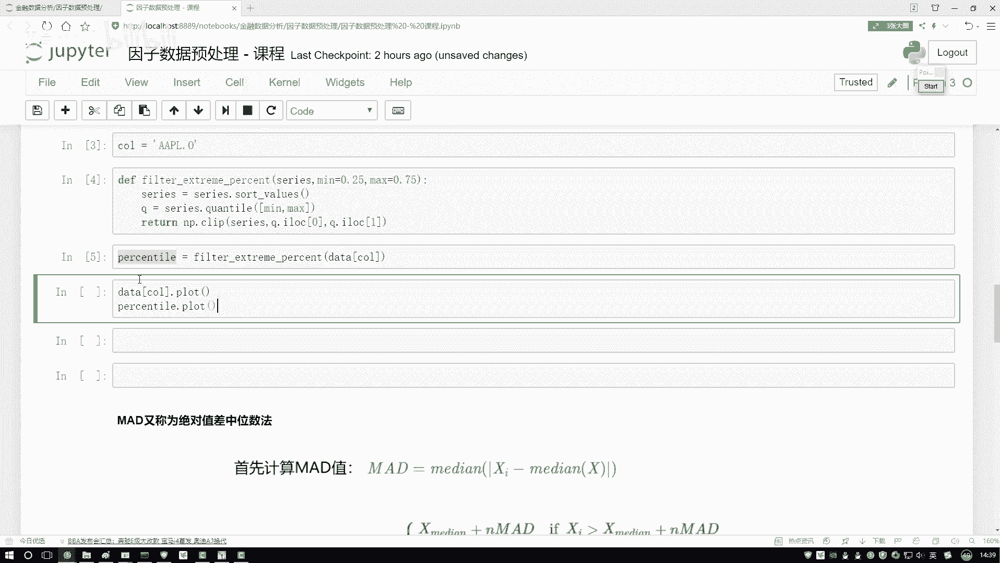

呃，看这个结果有点奇怪，我们来检查一下没有什么问题啊。第一步，在这里，我说我是对我们当前的原始数据啊做了这样一个操作。第二步呢是我现在啊执行了一个规范化之后，然后对我这个数据咱又执行了一个操作。

从这个图上来看啊，基本上就是逻辑上没有什么问题啊。因为他已经把它的一个范围给大家画出来了。但是这个呃它会有些重叠，这个重叠看起来不是特别好看，这样吧，我在把这个放到下面，把这个放到上面给它加顺序。

这样大家能够看的会更明显一些。它就是说呃这块它出现了一些什么，哎，它有一些比这个当前这个这可能是60左右，比它小的，那应该等于是个蓝色的，这块呢有一些大的，有一些大的，应该等于什么，也应该等于蓝色的。

这个这给大家先从图上，咱简单量于行啊，主要是说哎咱们的一个流程啊，该怎么去做啊，这我刚才给它打印了一下，给它删掉。

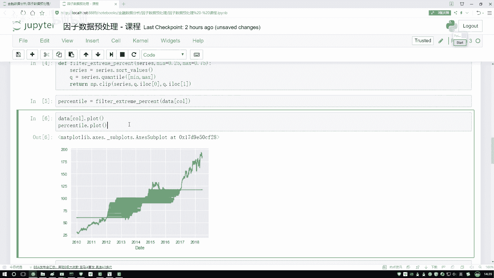

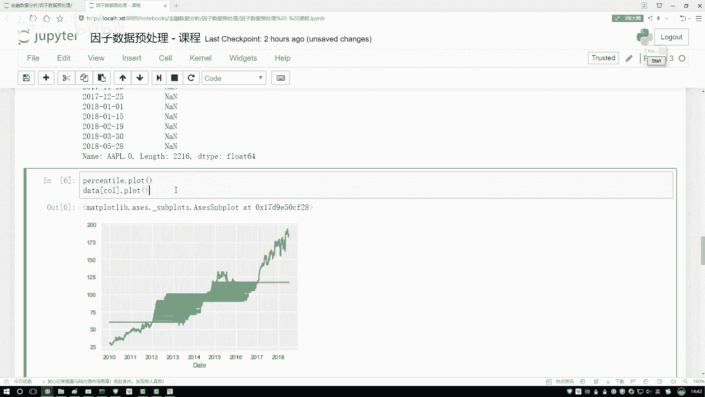

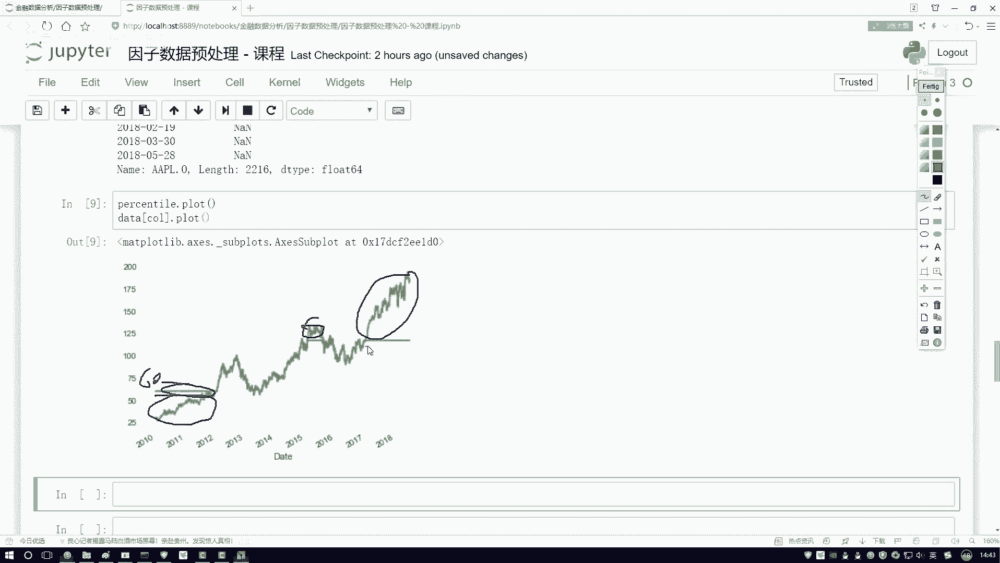

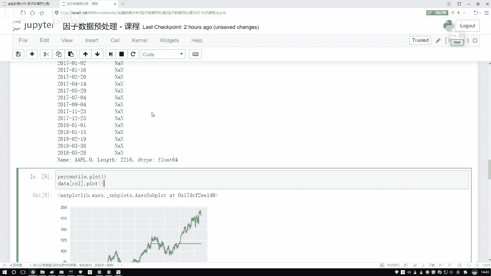

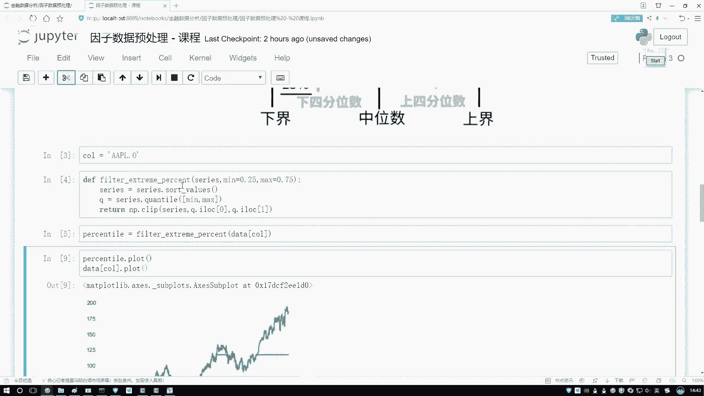

行了，这样我们完成了第一步啊，就是我们的第一种方法啊，在极值数据当中怎么样根据一个分位数去去这个极值。可能在实际操作过当中啊呃不可能说你指定个这么大一个值，0。250。75，这个相对来说也太大了。

你把绝对都是值都当做是一个异常点了，可能在很多因子当中啊，我们是可能什么样0。0250。975是吧？这两个值可能是会更常用一些啊。但是我们今天例子点为给大家展示的明显一点。

所以说啊我把这个值可能在有些地方在它啊稍微的放大了一点啊，大家明白这个意思就行。实际当中啊，我们的范围应该会更小一些啊，这个是百分数去去取极值。

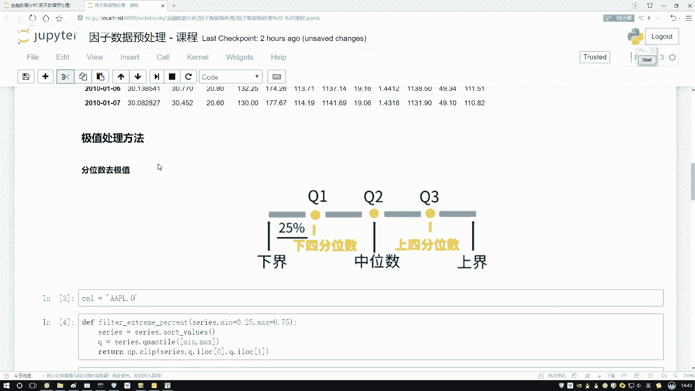

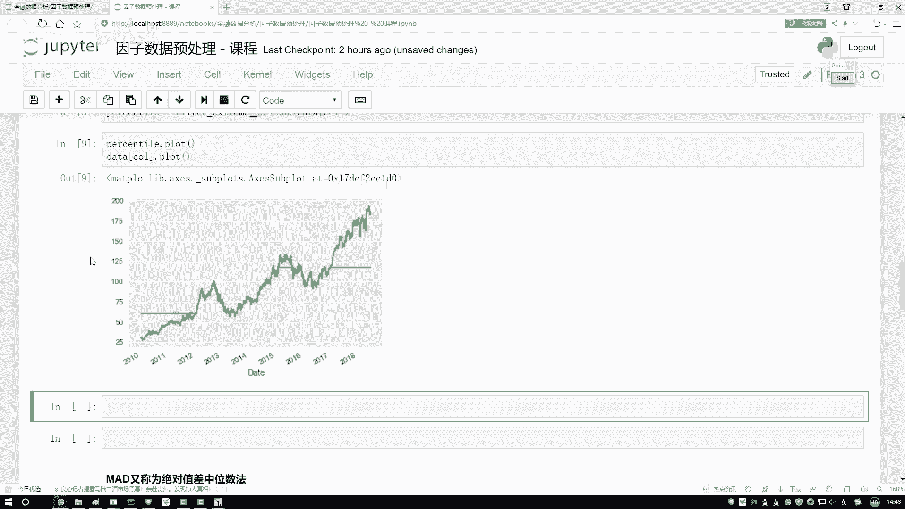

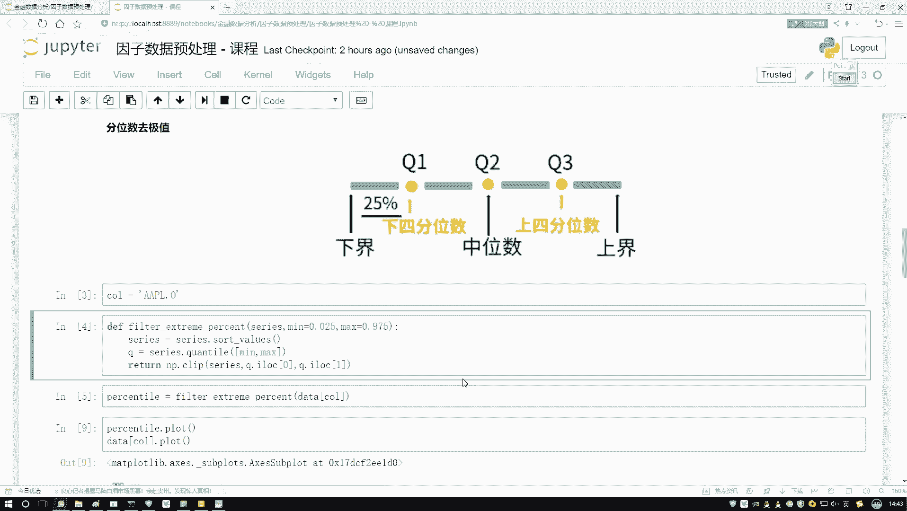

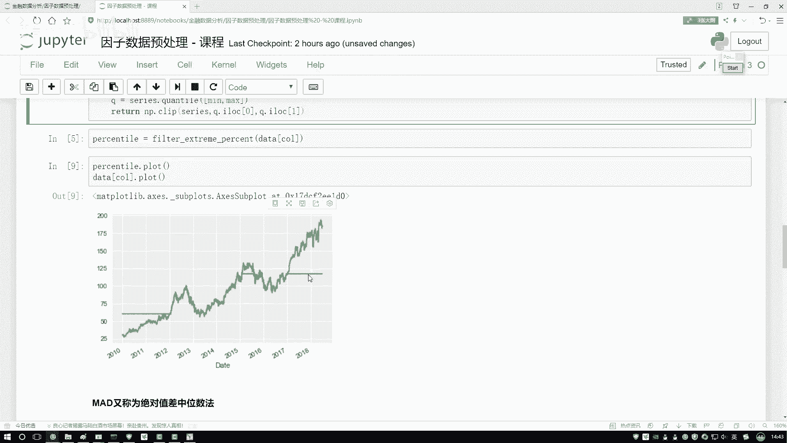

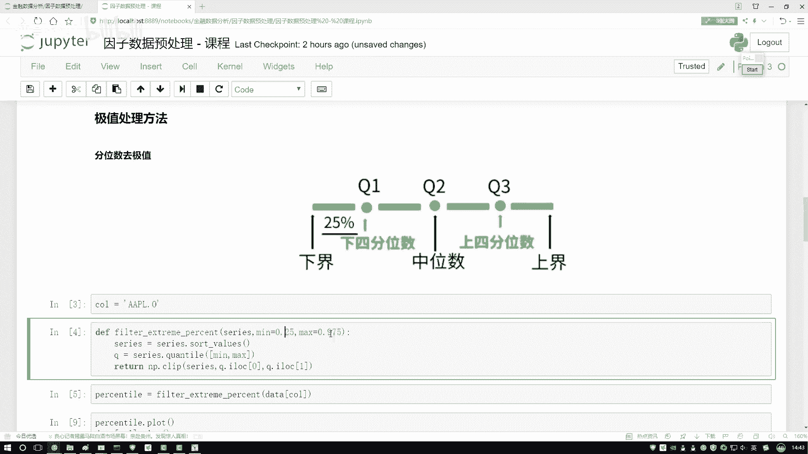

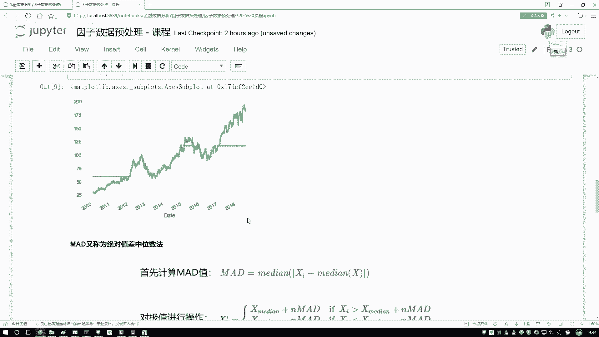