# 【2024版金融量化】AI结合金融如何做落地项目？迪哥手把手教你3天从入门到项目实战，学完即可做项目，少走99%的弯路，学量化交易看这套！人工智能／计算机视觉 - P29：3-Mad法去极值演示 - 迪哥谈AI - BV1NW421R7d7

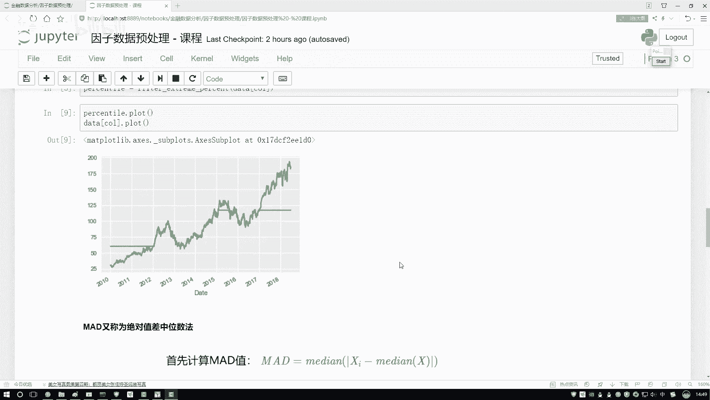

接下来啊咱们来说哎我们的聚集值当中啊，第二种方法叫做MADMAD啊给大家的感觉啊像是公式上稍微复杂。其实计算起来也蛮简单的。给大家先来看一下吧。首先啊它有这样个要求。

就是要求我们啊先算出来这样1个MAD值，哎，就是跟它名字其实是一样的。它是这个操作，咱们先来看一看，首先啊我说我先拿到了一个序列。

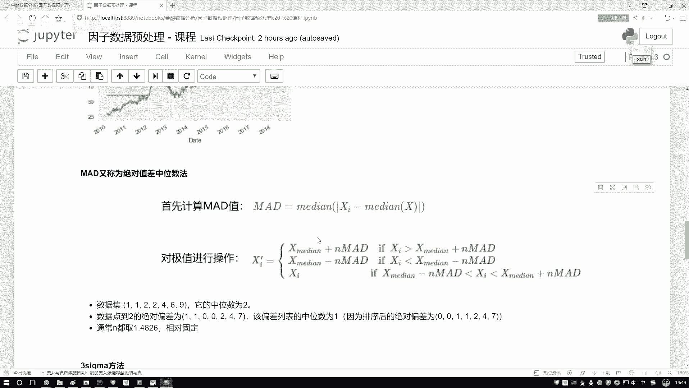

这序当中，比如说什么123，然后4点点一对数是吧？我们对这个序列可以算一个周位数吧。好了，比如这里我算周位数，它等于4，后面还有567之类的，现在呢我算周位数等于4之后，然后干什么？

对我咱们当前这个序列当中每一个数，那这块有这个一是吧？好了，我算一减4哎，注意点，这里我们是没有负号的，外面有什么一个绝对值吧。你看这里它都是有绝对值，所以说这块我们算的是一个绝对值差啊。

用我的每一个数减去周位数能算出来个绝绝对值差吧，比如第一个它等于3，然后第二个算完等于2，第三个等于一把这些啊这里，然后这零就无所谓了。然后接下来再把其他的都算完之后，我又形成了什么。

又形成这样一个序列吧。😊，对这个序列在干什么？再求一下它的一个中位数啊，相当于这个东西给我感觉是烧了两遍啊，为了求哎，咱们当前的一个范围。我说现在啊一开始先对我数据求了中位数。然后呢。

对每一个数据减去当前中位数得到一个新的序列吧。在这个序列都是正的。因为这块绝对值，再求它的一个中位数，也能求出来是什么，是不是一个值啊。那好了，有了这个MAD值之后呢？😊。

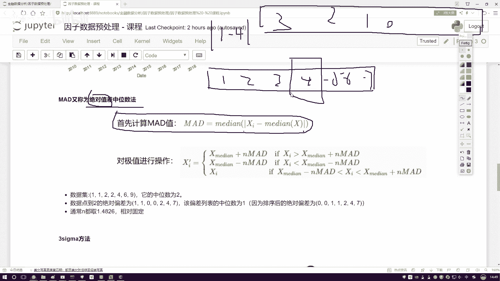

我说这样，现在你不是想对这个数据哎做一些规范的操作吗？我说这样吧，我说这个数据啊，这是一个呃数据。对于这个数据来说呀，如果说你看这块这公式当中做什么做了一个判断吧。如果说呀这个原始的数据当中，哎。

比如说一个中位数，加上N倍的一个MAD值，以及减去一个N倍的MAD值，比如这里我说这个是数据，数据当中这块是它的一个中位数，加上了N倍MAD的值，这一块是一个中位数减去了一个N倍的MAD值。

把它俩当做我的一个下界和一个上界是不是就可以了。然后剩下操作，就你刚才咱说的那个。😊，百分位的是不是一样啊？其实说白了就是怎么样去找这两个界限。然后这个N值N值通常情况下就是有一个固定取值啊，1。

4826。关于这个MAD啊，大家就简单熟悉下就行啊。哎，知道一下，它大概是做一件事的就行。这里啊相当于我们是用另外一种方法啊来去干什么来去对我的一个数据啊，做了一个去极值的一个操作。

然后代码其实也挺简单的，咱们给大家简单写一写吧。就是按照咱们上面给大家写出公式，先算什么，先算这个MAD值，然后再算我的一个上下界。😊。

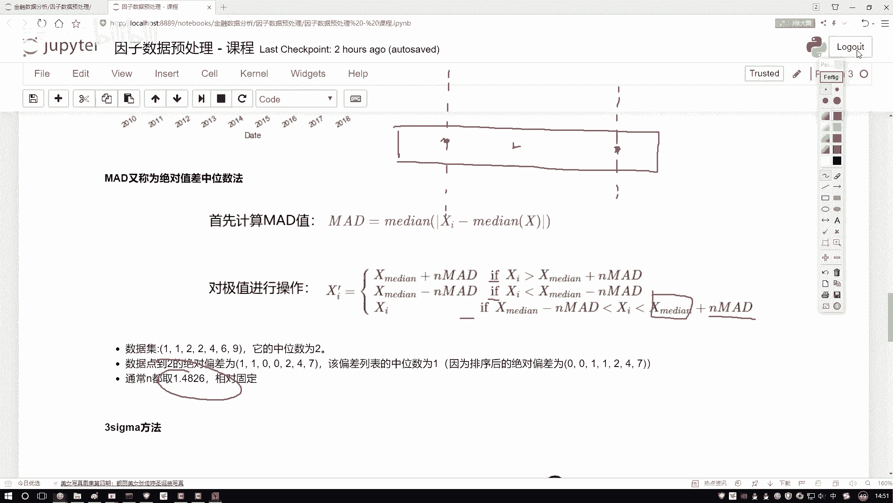

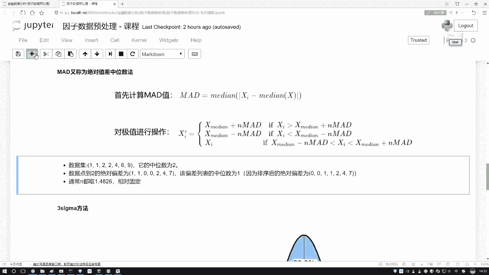

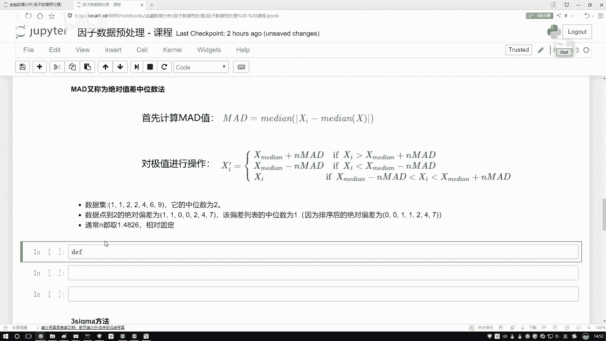

好了，一个filter filter当中我们也指定，就是呃跟之前名字咱们是一样的吧，跟之前咱的名字都是一样的。

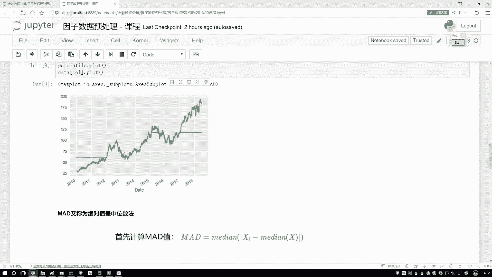

还有这东西这东西最后我说叫做1个MAD可以了，这个叫做1个MAD然后呢，这一块咱们输入也是一样的，我传进来一个s，然后这一块我需要传进来另外一个参数，叫做一个NN什么？你看这里哎这一块不是有个N吗？

多少倍的MAD咱们刚才是不是说了有个通常的一个取值吧。哎，咱们就咱们不行不认知啊，一会儿咱们自己传进来一个值。然后呢，首先。

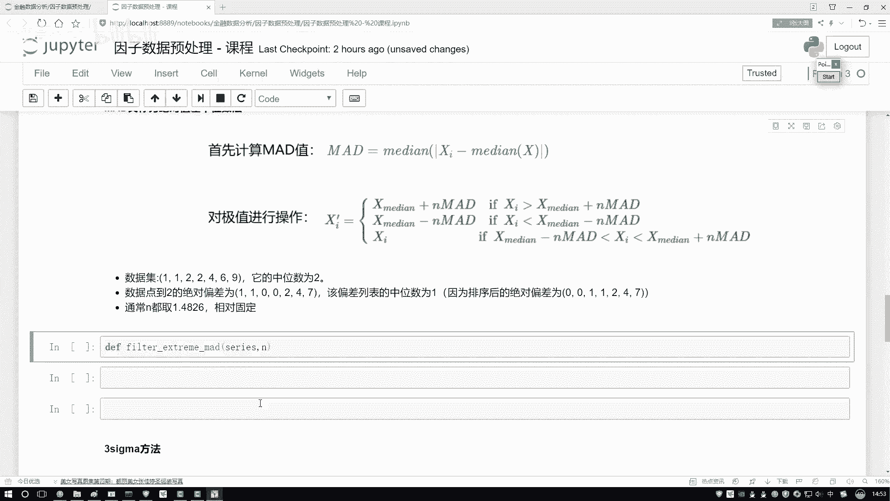

在我们这个函数当中啊，第一步要算什么？是不是我说我现在啊算的是一个中位数，中位数等于我整个序列的一个中位数啊。好了，这是我的序列中位数怎么算？刚才咱们任务当中，哎，这一块我说算的是什么来着？幂是0。

25，max0。75，我传进两个才能帮我去算，那我传进来个0。5，讲道理它是不是也可以啊，好这里我说点一下，把这个什么传进去，就传一个值为0。5，那就是一个中位数吧，好了。

现在我说我算出来了当前我的一个中位数。😊。

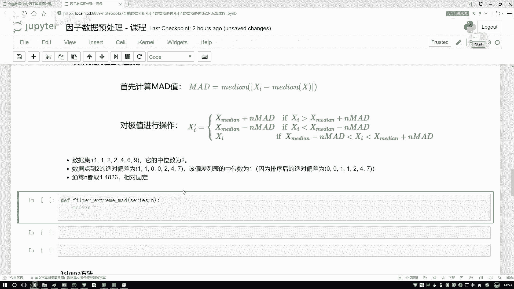

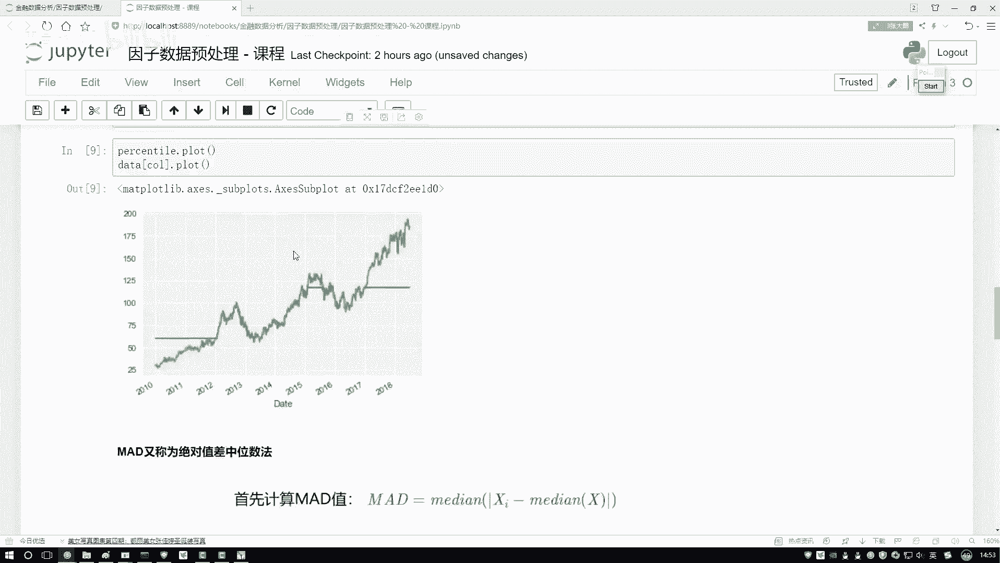

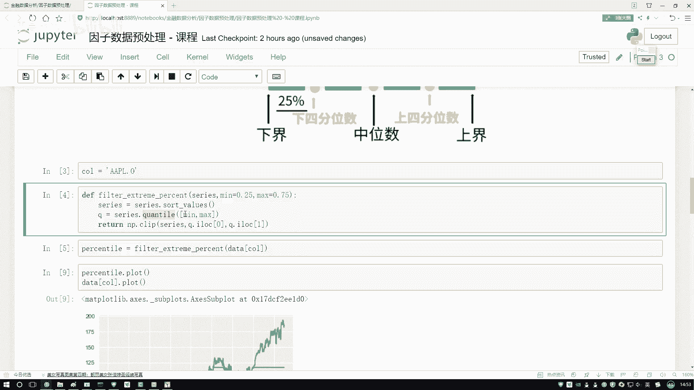

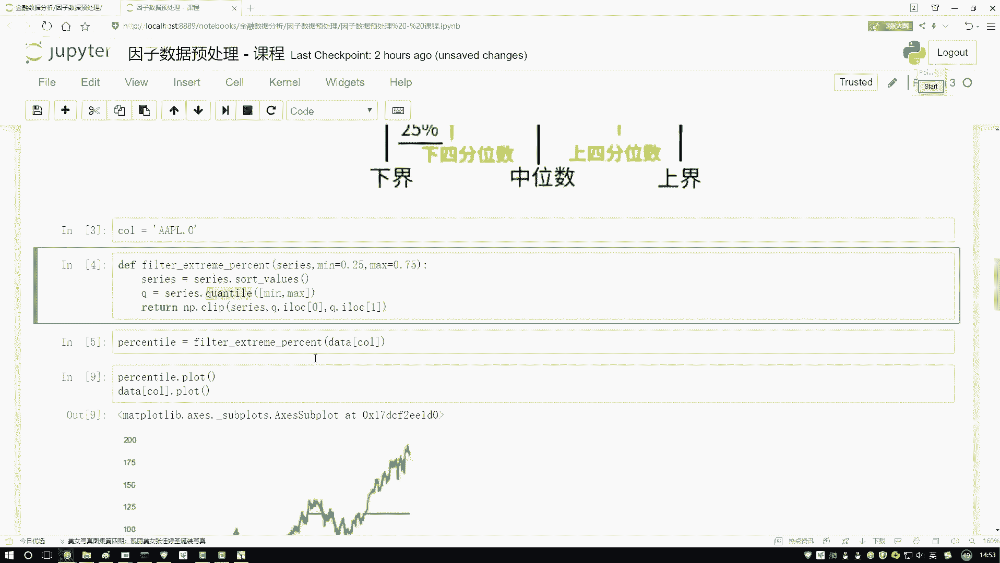

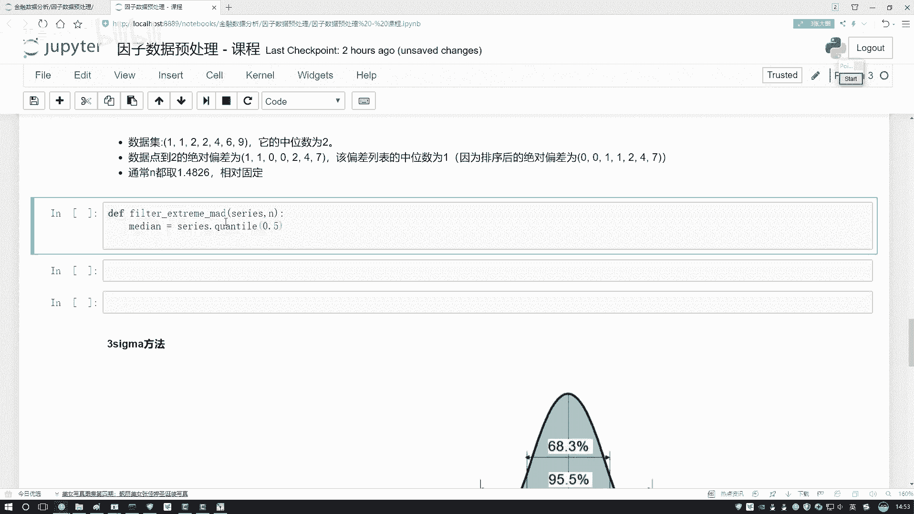

接下来呢咱要去做计算是用什么？我序列当中每一个值，你看这里序列当中每一个值减去我中位数，再算一个绝对值吧。好，这里这样我说我序列当中每一个数啊，对于这个判大来说。

一个序列减一个数相当于这个序列当中的每一个数都会减咱当前这个中位数吧。好，减完之后算什么，算一个APS我的一个绝对值是吧？把它绝对值给拿到手。然后呢，对这个绝对值干什么？😊。

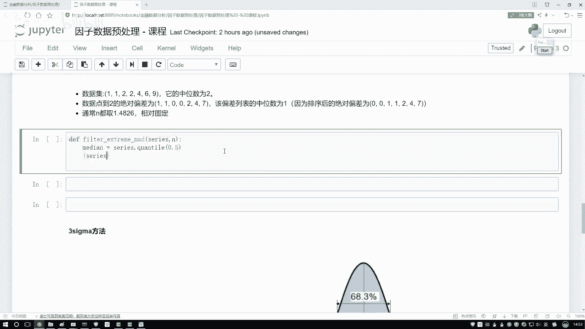

截值现在我得到的还是一个序列吧，对当前这个序列怎么样，再求一下啊，它的一个中位数吧。那好了，我把它括起来，对当前整体的一个序列，再求中位数，再求中位数方法是不是还是一样的，再求个中位数就完事了。然后呢。

我说指定咱当前的一个范围吧，我的一个啊最大还有一个最小。写一下吧，我说啊咱们当前最大的一个范围，等于啊我当前算出来的这个中位数怎么样，它应该加上你看这块中位数加上N倍的MAD值吧。好了。

这里我说我给它加上一个N乘上我刚才算出来的结果哦，算出结果咱们还没取名字，这个名字就叫做一个。得了，就叫MAD得了，把这个MAD拿过来乘上我N倍的这个结果吧。

然后下面呢用我这个中位数怎么样减去我当前的这个结果是不是就行了。好了，这现在我们算出来一个上界，还有一个下界了。那接下来呢哎你看这一块，咱之前return，它这个结果给它就是相当于做规范吧。好了。

同样return，当应这是结果，这是s，然后这个稍微改一改啊，这个就是我的一个最小的然后呢，第三个就是我的一个最大的是不就完事了。好了，这里咱们就写了一下怎么样去算什么一个MAD值吧啊。

函数给大家列出来了。那好了，那现在咱来执行一下吧。

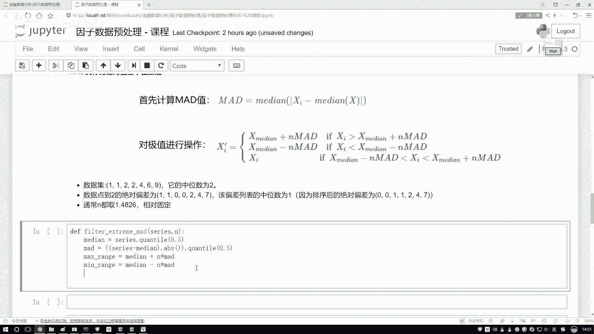

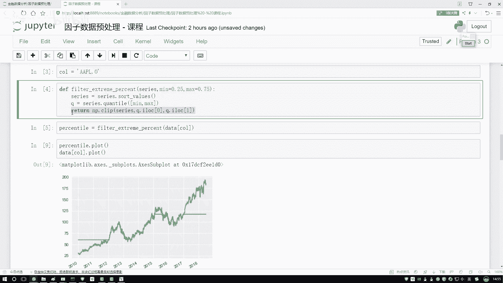

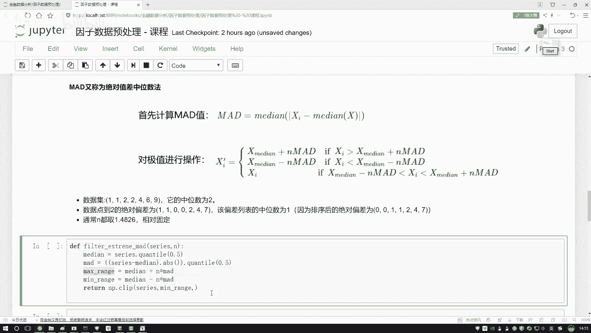

我说呃咱们当前这个结果也也叫MAD得了，然后等于执行一下这个函数，把这个函数给它复制过来。函数复制过来之后啊，然后我说把这个数据给它实际的传进去。然后这个N值啊，咱就用一个通常的一个数值来去执行一下。

是不就完事了。然后大家如果想画图，这里可以这样，我咱们再来画个图吧。😊。

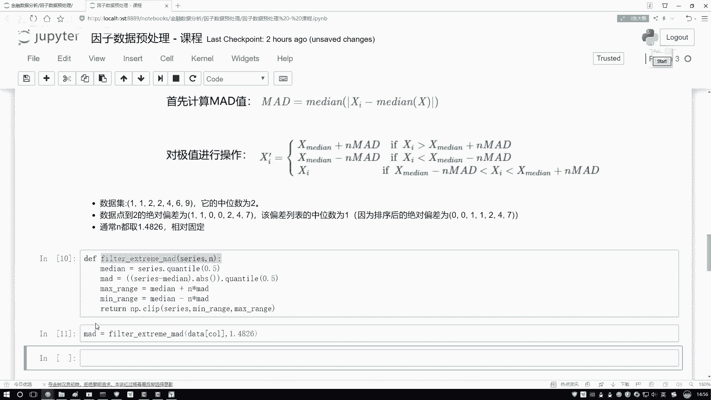

简单画了，画图不是重点，我随便画了MAD点pot一下原始数据，点plot一下。这个结果咱是不是就有了这一块部分呢大于了，我要等于这个蓝色的，这一块部分小于了，我要等于这个蓝色的啊。

这个就是第二种方法叫做1个MAD啊，大家简单熟悉就可以。

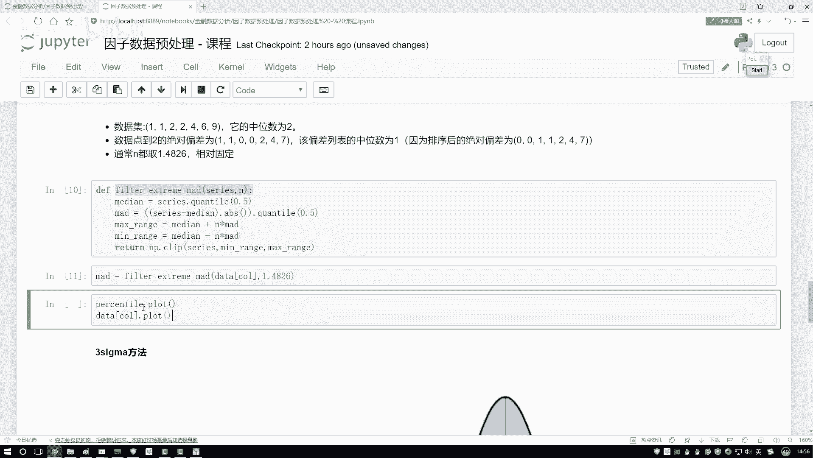

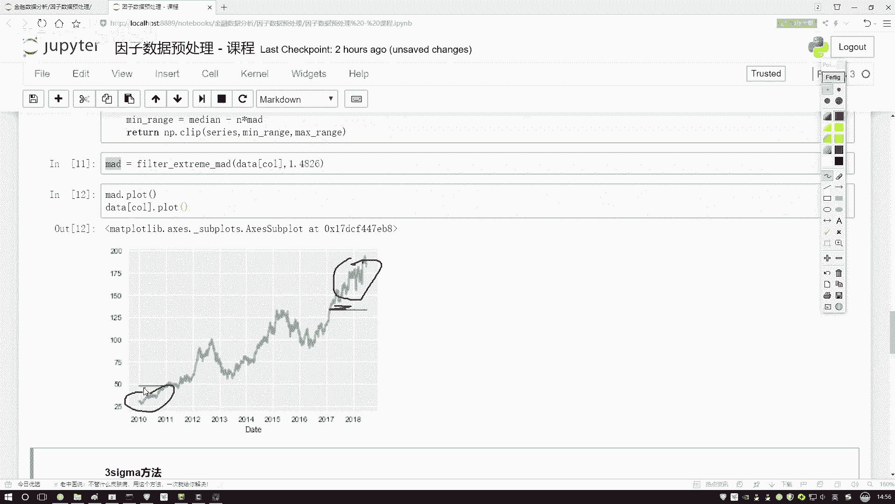

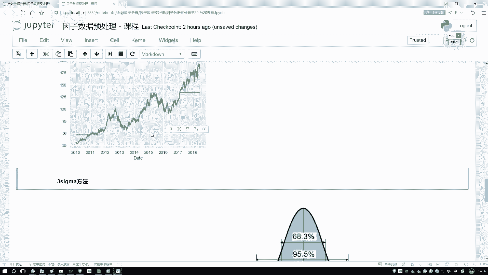