# 【2024版金融量化】AI结合金融如何做落地项目？迪哥手把手教你3天从入门到项目实战，学完即可做项目，少走99%的弯路，学量化交易看这套！人工智能／计算机视觉 - P30：4-3Sigma方法实例 - 迪哥谈AI - BV1NW421R7d7

最后啊咱们来说去移日当中啊，还有一个叫三C法方法，它的原点非常简单啊。大家先来看这张图。这张图当中啊，你看我们画了个什么，哎，大家可能一眼就看出来了，我画了一个正态分布吧。正态分布啊。

如果大家理解来比较麻烦，你就当做是一个正常的分布。什么叫正态分布啊？我以前讲机学一当状啊，今下举学个例子。😊，我说你啊现在上银行贷款，银行啊就是多借给你个3块5块的那是不是挺正常啊，多借你10万8万的。

少借你10万8万的是不就不正常了呀？咱们来看这样一个走势啊，这里我说我先画一条线，那咱们就拿标准分布来说吧，标准人分布当中，这是什么？这里有个均值均值什么理由什么意思啊？比如现在我要干一件事，哎。

我这一个误差吧，就让我去银行贷款，它可能多借有钱，也可能少借有钱吧。那多借有钱，那往右边点少就有钱往左边点，但家带是大家来看啊，我们现在这个区间来说呀，比如说你看我现在画第一个区间。😊，红色。

我现在阴影画这个区间，你看它的面积怎么样，是不是相对来说会比较大一些呀，代表着这些个事儿发生的可能性会比较高吧。那你看当我把这个区间越往外放的时候，你说这个可能性发生的概率怎么样了，是不是就越低了呀？

那来想一想，我们现在要干什么，是不是要做一个去极值的问题啊，那极值它可能落到哪儿啊，我拿这个红色也画落到这儿可能吗？这块落的，你说能是极值嘛，在均值附近了，大概率发生一件事儿，那就是正常的数据吧。

均值一般落哪儿啊，落在比较偏远的地方吧，这一块这一块这一块这些个地方越远的离均值越远的偏差越大的越有可能是一些离群点吧。哎，这样一件事，那什么叫做一个三倍的西格玛啊，它是这样一件事儿。

你看这里啊我们画的这个东西当中有什么？哎，这有一个X哎，它的均值是吧？加上一倍的减去。😊。

一倍的加上减去两倍的，加上两倍的，减去3倍的，加上3倍的那你看从这个区间当中，哎，我们能发现一件事儿。你看啊一旦你这个区间选的越大的，你看加减3倍的，嗯，得到数据它越往左右偏的可能性会怎么样。

就越小了吧？那这个三四码意思是这样，我说我现在啊做这样一份数据啊，原数据来了。然后我假设吧就是可以对数据做一个变换，使得它理论上服从这个高斯分布啊或者正加分布，哎，咱们先不知道怎么变的。

就假设它就是正加布的一个规则。那你看当我指定一个正负的3倍死码的时候，你说这个当中啊包含了百分之多少数据，这个值你给大家列出来了，这是统计当中啊，咱们经量会另外一个指标9。7%多吧。那好了。

我们现在发现一件事。哎呦，如果我认为数据当中啊，我想取最正常的999。7%的哎，当做的数据，剩下。3的，我当做一个极值给它规范一下，是不是可以啊？这个就叫做一个。

3C格马哦相当于你的一个下限和你的一个上限谁来定的，在高次分布当中啊，你要算两个值，告诉我一个均值是多少。哎，告诉我你的一个标准差是多少是不是就行了，咱就能把这个上限和这个下限全部计算出来了。好了。

这个叫做一个三C玛方法写一下吧，其实也很简单哦。

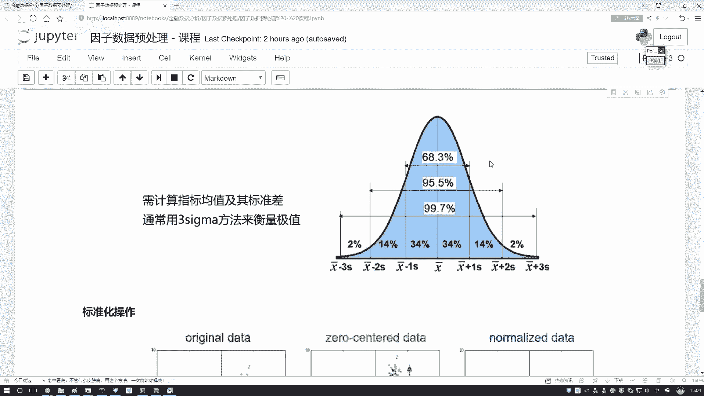

在这里名字跟之件一样吧，还是做一个复制。呃，在这里我们做个复制，然后把最后面那个值吧改成一个三格码就行了。然后这一块我们输入的值呃，这块NV等于3吧，既然你说三，咱就写个三得了。然后这块咱来写吧。

我们要需要算什么。哎，在整个数据当中这一列数据，我是不是得知道当前它的均值多少。当前这个S这个标准差多少啊，所以说对我的数据我可以算两个值，哎，一个是点幂。😊。

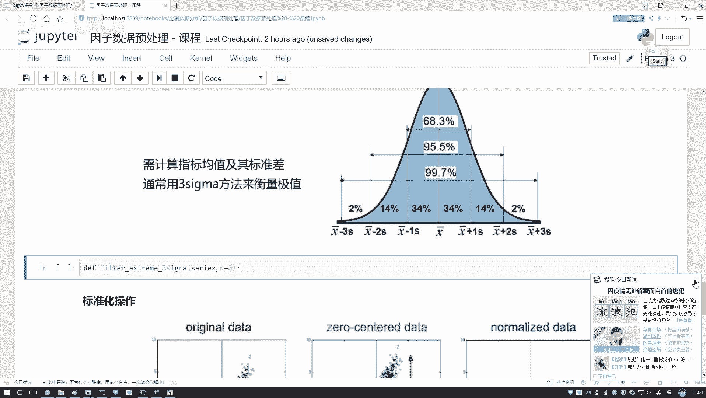

第二呢就是一个啊直接复制吧。这接第二个就它就是一个点STD这个它是一个点STD算它的一个标准差。行了，那我们指定两个变量吧，变量名字就是一个面，然后下面的它就是一个STD行了，写两个指标我算出来了。

有两张两个指标之后接来，那都复制就行了，这也不用自己写了。

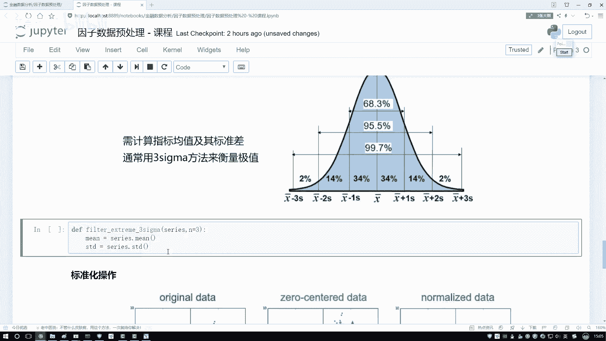

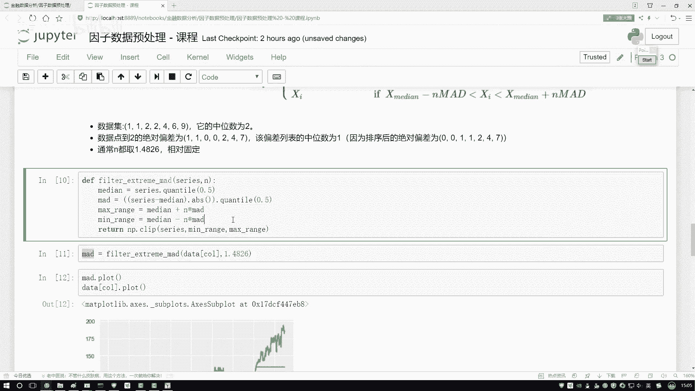

把这个东西给它复制过来。好了，这复制过来了。那你看中间等于什么一个均值，加上我N倍的1个STD吧。那下面呢就是我的一个均值减去咱N倍的一个STD是不就行了。那返回值这是一个s，然后我的一个下限。

我的一个上限，咱们指定出来，是不是就完事了，非常简单吧，咱又完成了这样一个3C嘛。这个函数呃，执行一下就是得到这个C马等于什么呢？等于我的这个数据当中。😊。

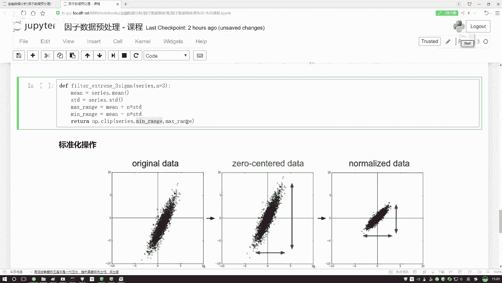

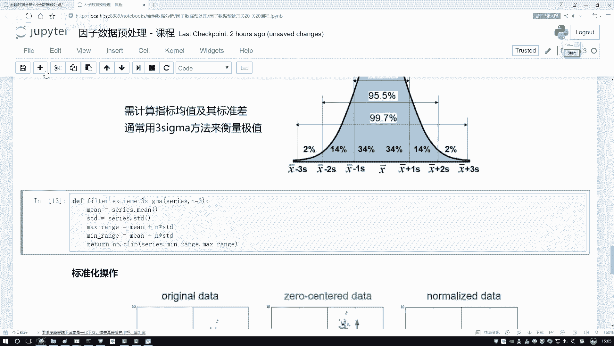

然后把我当前这个data啊，我的这一列传进来，然后N值N值我不用写了。N值哦，这个数据咱写一下吧。这个数据你要画这个9。7%啊，画的太不明显了，咱画个稍微明显的，你看谁明显683，这个挺明显。

是不是咱取683的，当正常的超出这个范围的，当不正常的。那我写个一吧，假设我N等于一，然后我们只选一下，然后来画这个图？😊。

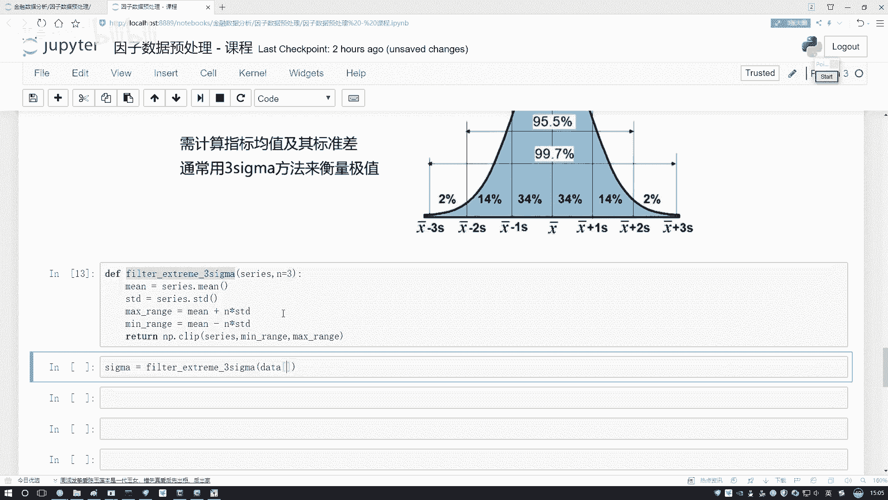

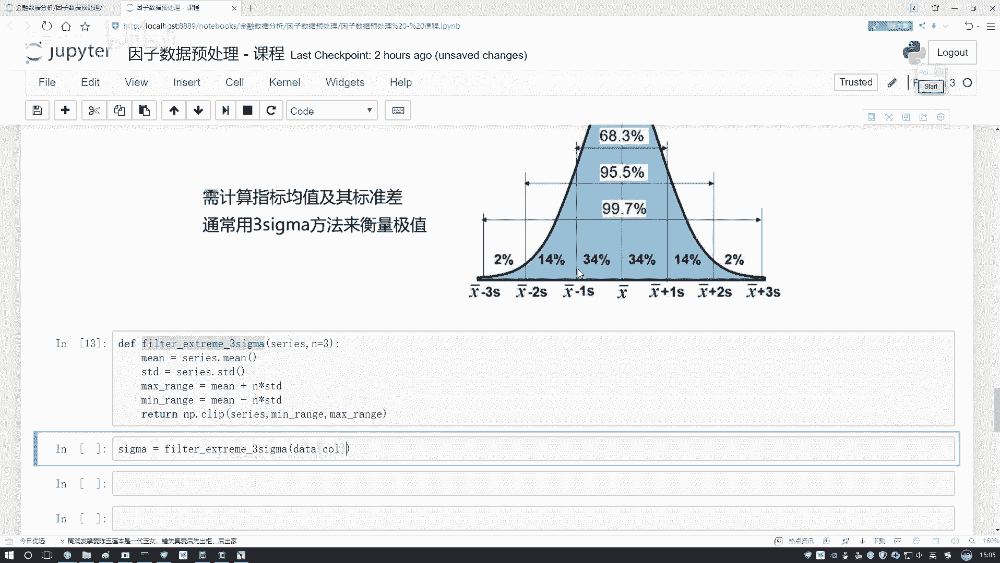

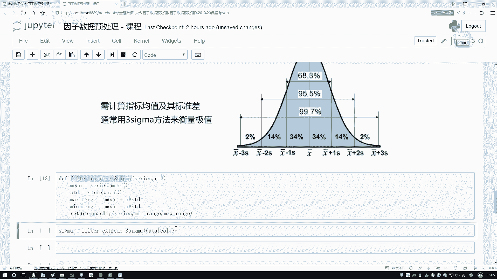

简单来看一看它的一个大概取值的一个位置，这是一个这个码执行一下吧。你看这是大概的一个位置。我们是不是算出来了，可能通过啊就是就是大家整体来看这个图就是绿色线啊，都是不会去变的。

然后这个蓝色线啊可能在不同任务当中，你看这里边可能等于60左右。然后这个里边可能等于不到50，然后这种方法可能等于50多一点，可能不同方法，咱得到的结果略微有一些差异啊，当然就是用哪个方法啊，都行。

看你的一个实际任务需求吧，这也相当于是预处理方法当中的不同的几种策略吧啊，到时候大家都可以我们自己来去做一些实验的，主要就是三种吧。我给大家说完了，我们的第一步叫什么，叫做一个哎一个去基值，注意点啊。

这个去集值不是给它丢掉，而是给它做一些规范，定义好一个下界和一个上界，然后呢让所有数值保持在我们指定好的下界和上界当中这就行了。这个是我们三步走当中啊第一。😊。

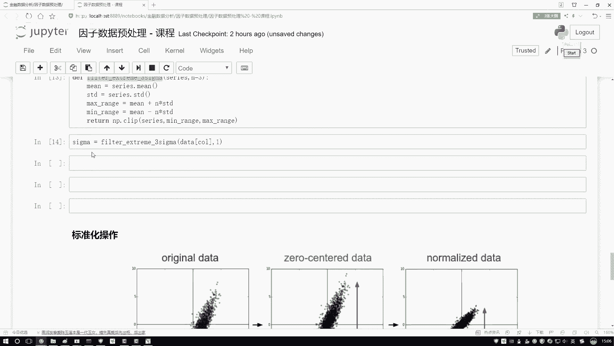

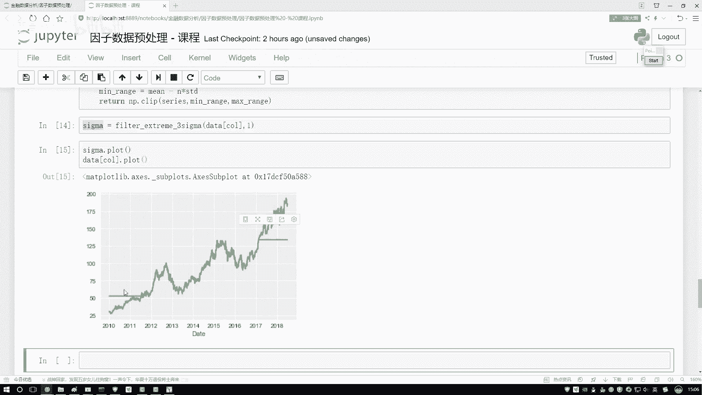

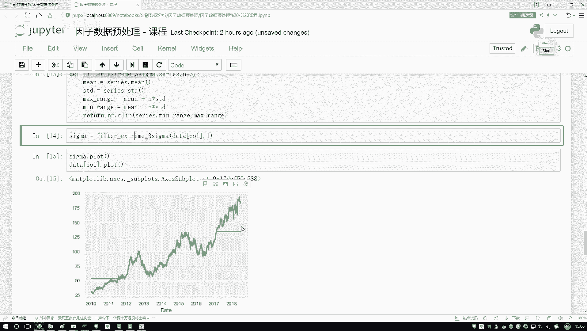

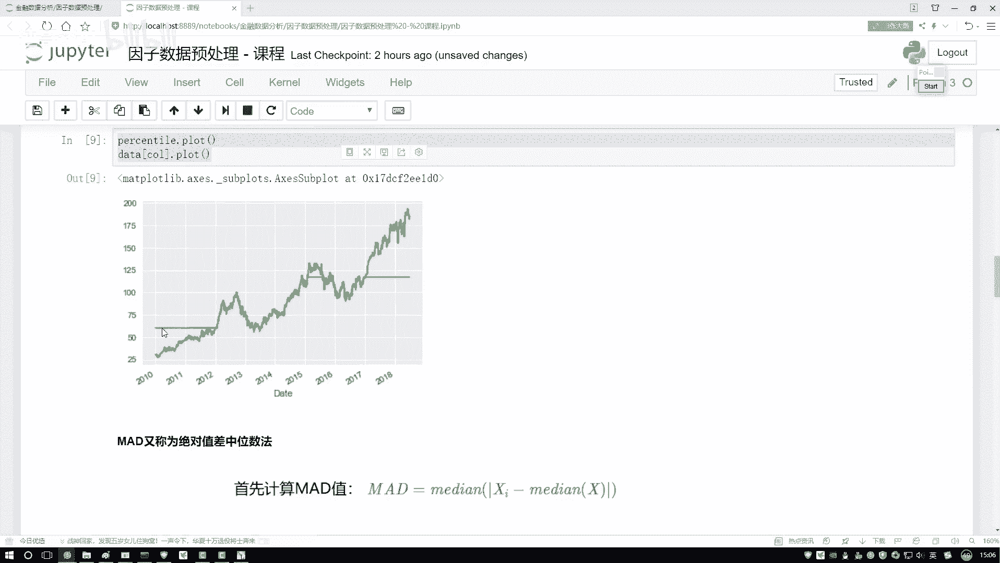

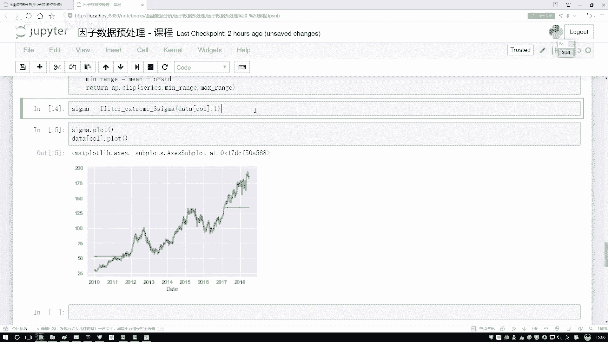

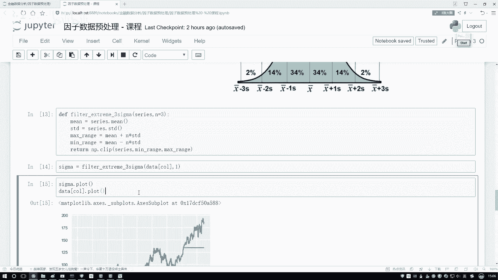

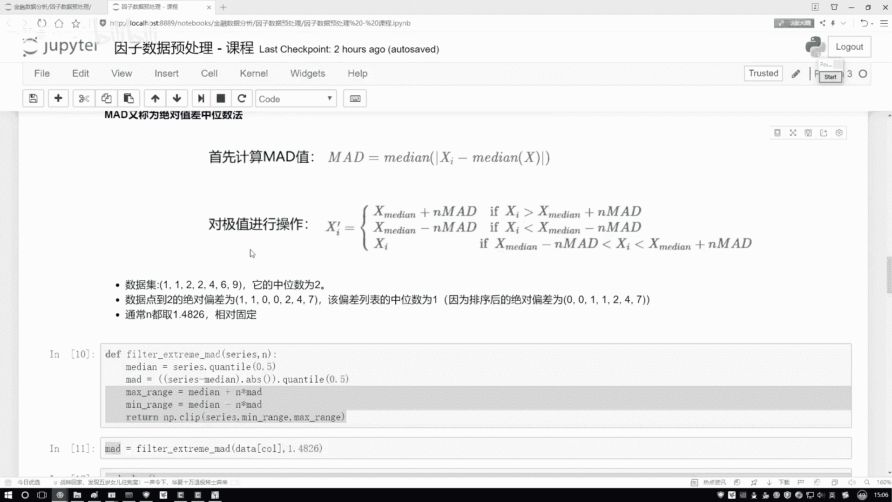

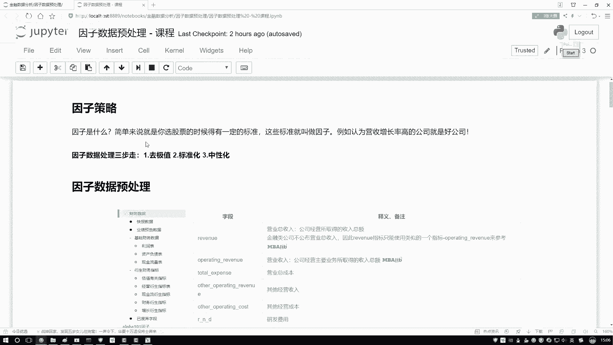

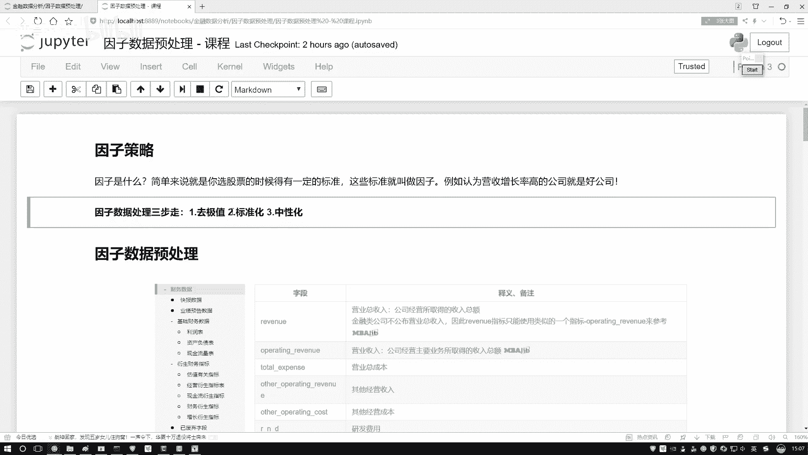

。