# 【2024版金融量化】AI结合金融如何做落地项目？迪哥手把手教你3天从入门到项目实战，学完即可做项目，少走99%的弯路，学量化交易看这套！人工智能／计算机视觉 - P31：5-标准化处理方法 - 迪哥谈AI - BV1NW421R7d7

接下来啊咱们来说这个标准化操作啊，其实标准化啊方法和原理啊也都是非常简单的。咱们先来看这个图啊，我给大家解释解释，在标准化当中啊，咱们完成了一件什么事儿啊，这张图呃，对，就这张图就行了。我们来看一下吧。

这里有这样一件事儿。那好比说我现在有一个数据，这个数据当中呢有不同的一些指标。你看这里我画了一个X轴，还有一个Y轴吧，这一块我说是一个X轴，只要我说这一块它是一个Y轴，哎。

我们的一个数据那好有这样一件事，哎，别说XY了，就说一个X1X2吧，我这X1这X2，那大家来看你说这个X1和X2取值范围一样吗。

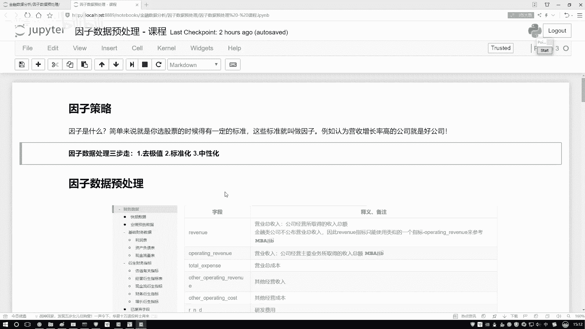

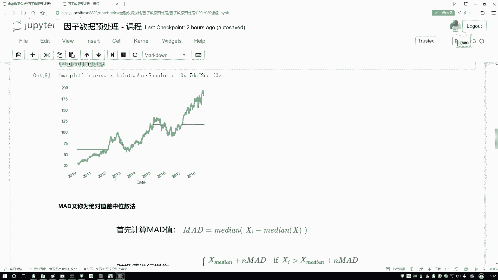

取值范围是一样吗？感觉来说肯定不是吧，X1它的取值范围稍大一点吧，它能从这里取到一个这里吧。但是你再看X2呢，它是从这儿取到一个这儿的感觉什么？我们的取值范围可能不同吧。所以说啊做标准化。

我们有这样一个出发点。为了使得呀我们的一些因子吧，或者说为使得哎咱们一些指标在各个维度上取值范围尽可能相同。哎，我用同样的眼光去观察它们，别在数值层面上产生一些差异，对结果造成一些影响吧。

所以我们要做这个标准化。标准化怎么做呢？我先给大家写下公式啊。公式就是一个X减去一个缪，比上我当前的啊，这什么比上一个标准差就行了。那大家可能会问哦，这个公式是什么意思啊？给大家解释解释啊，是这样。

你看我们的数据啊，一开始的数据肯定不是以原点为中心对称的吧。那如果咱们执行一个去均值操作，能够使得我们数据怎么样，你看这玩意写了以零为中心进行对称吧。好了，这个是我们把标准化公式啊分解完了，第一步哎。

叫做一个去均值，目的呢是让我们数据啊在各个维度上都是以零为中心，哎，有这样一个对称的。好了，这是一个对称。但是啊你看对称完之后还没完。😊，我的两个坐标轴啊，它的取值范围怎么样了，还是不一样啊？

我去了一个均值，只能让它以零哎为原点做对称，但是呢没有改变各个维度的取值范围不同这样一个问题，那咋办啊？那我问大家一件事儿吧，哎，你说这个取值范围大的数据啊，什么叫取值范围大？我说我这样吧。

我说列列两个小组吧，列两个小组。我说这是第一组，然后这是第二组。对于第一组来说，哎，第一组来说，有些人就是我啊就是我我我说我就写我吧，我然后呢还有我的一个同学A，还有我的一个同学B，还有我的一个同学C。

那感觉都是我同学，那你说以后啊就是咱们几个那工资来说，那你说我们差异性会很大吗？就不会很大吧。好了，那你说差异性不会很大前提下，我们算他的一个标准差，哎。

或者说咱说算方差方差或者标准差会比较大还是比较小啊，会比较小吧。就是说这样一件事。哎呀我们的取值范围都比较小，都是两万哎左右的，大概这样一个数值。所以说呢我们算出来一个标准差也会比较小。那如果第二组呢？

😊，第二组还有我，然后呢，我说不是我ABC3个同学了，我说有几几个几个比较牛的人吧，我说把这个马云，哎，还有把这个马化腾他们几个都放在一起。哎呦，你说把我们仨放一起啊，大家可能觉得把我放生点多余。

是不是？那如果说把我们仨放一起了，那我这可能是个1万的然后呢这是个2000亿的啊，这这是个2000亿的。然后呢，这个东西它是个3000亿的那你说我们现在在一起什么会比较大呀。

我们的标准差怎么样会非常大吧。因为我们的数值取值范围，从这个1万到这个300亿啊，这里取值范围可能只是从1万到2万啊，我是1万只有2万的，其他都在中间可以吧？那咱来看这样一件事，取值范围小的。

如果说我除上一个小的标准差，可以吧？那取值范围大的呢？我要除上一个什么大的标准差，那什么意思，取值范围本来就大了，再除上再除上一个比较大标准差，能让他。😊，取值范围稍微小一点吧。

那取值范围本来比较小的呢，再除上小的标准差，是不是这样指得我们近似的一个取值范围能怎么样做一个近似吧。啊，你看这里我做这样一件事儿。去完均值之后啊，各个维度注意点各个维度啊。

X一这个维度X2这个维度分别计算它的标准差，然后呢做一个除标准差的操作，这样使得我们的数据计算完之后怎么样了。你看它的取值范围就近乎的相同了吧。哦，这样有这样一个事啊。

叫做一个哎我们的标准化标准化在那个数据挖掘啊，或者是一些机学问题当中啊，咱用的是非常非常多的，基本上拿到一个数据来了。哎，你都什么都不用想，你都可以去执行这样一个标准化的操作啊，写一下吧。

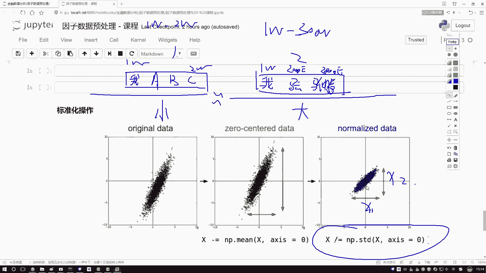

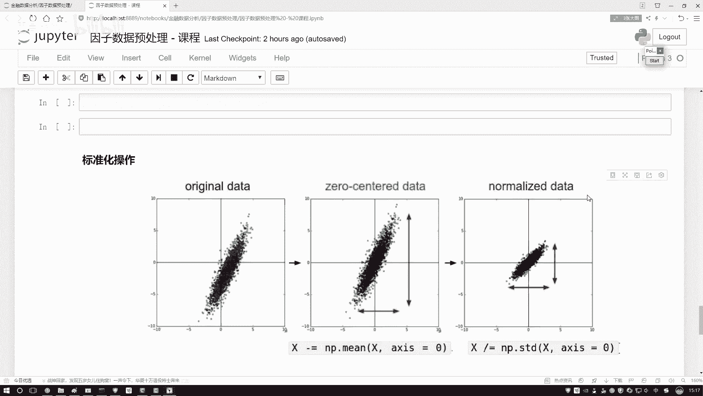

写一下我们的一个呃标准化的一个操作。标准化操作，然后对于我的一个ze传进去，这里也不用什么参数了。首先要计算两个值，什么图当中我给你画出来了吧，一个幂1个STD咱写一下吧，这里哎不用写了。

咱之前上面是不是有啊，这把这个复制过来得了，一样的，也是需要一个均值和一个标准差。然后呢，我说啊对我的一个数据怎么样。

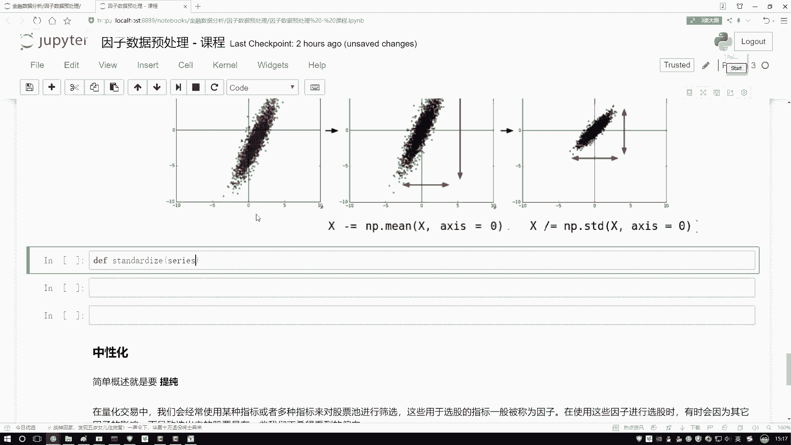

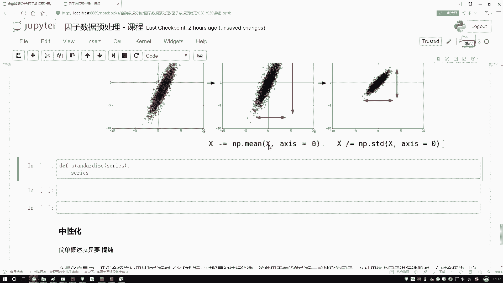

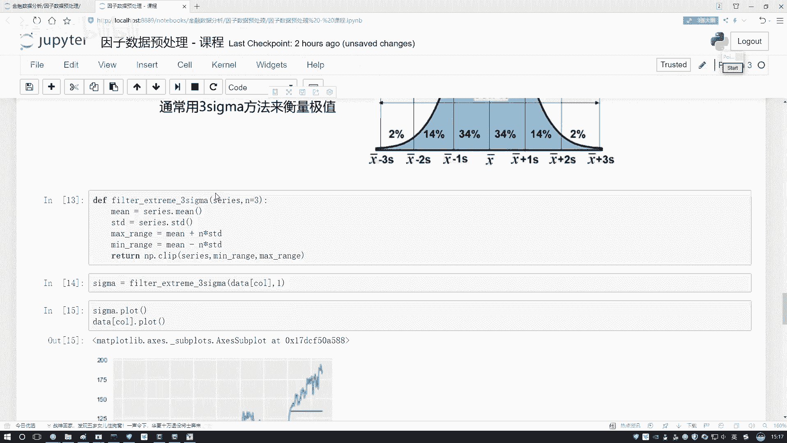

对我的数据做一个去均值，那就是减return一下return这里然后减去一个均值，再比上谁啊，再比上当前这个STD数就完事了。代码数非常简单，咱就可以去做。

那其实今天啊就给大家说几种方法大家可觉这些方法有没有一些直接的函数一行的帮我调用呢其实也有啊，这个当中啊就是有一些工具包像是当一些学工具包里边它都会有一些数据预处理模块啊。

数据数据预理中你直接啊把人家API调下来一行代码也能解决。如果大家想用SK learn去做，你就是上SK官网。

后你在AP当中搜一下搜一下这个这个东西它就有一行代码能帮你去完成这样一个事行咱写完了完之后这个不给大家画图了，这个也画不出来什么咱们来试一试吧。

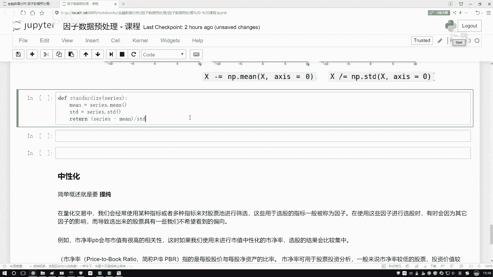

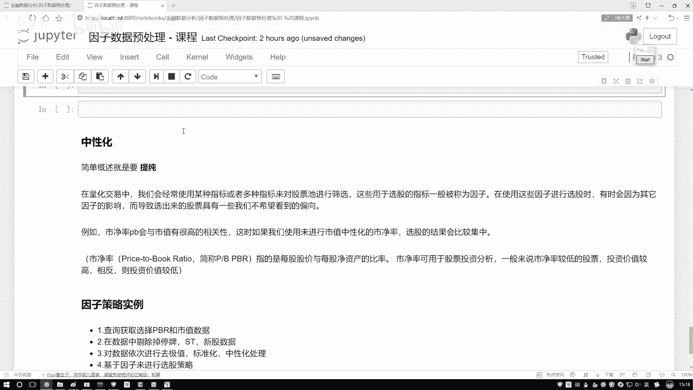

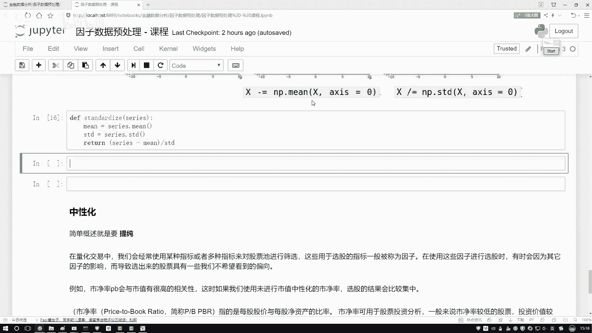

对于我们当前data，我先呃看原始数据，这是原始数据啊。你看有30多的20多的、100多的范围取值范围比较大的吧。好了，然后我们再来看一下，做完咱们这个数据操作之后的那就是把它传进来。

然后我看下这个结果呗。

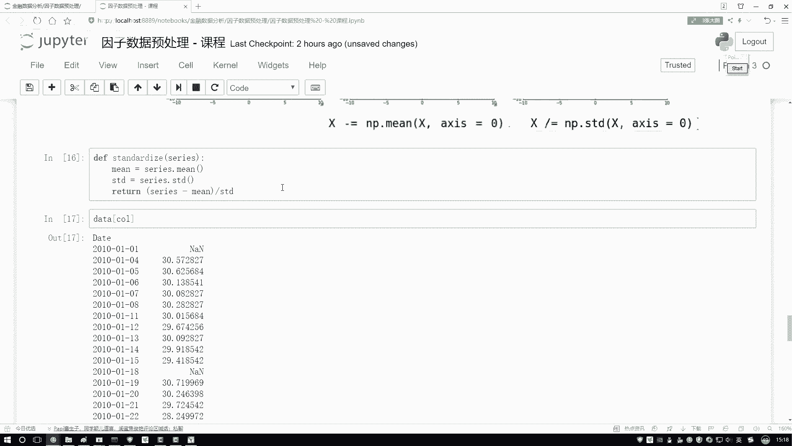

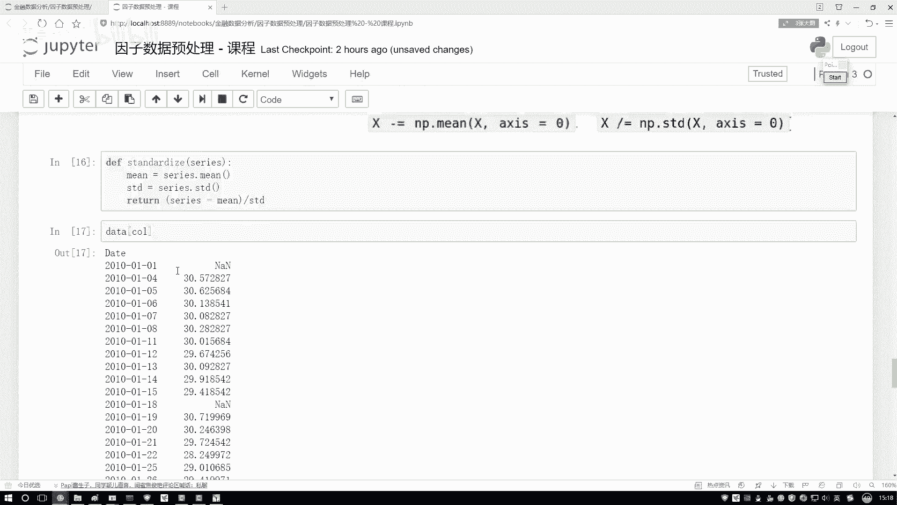

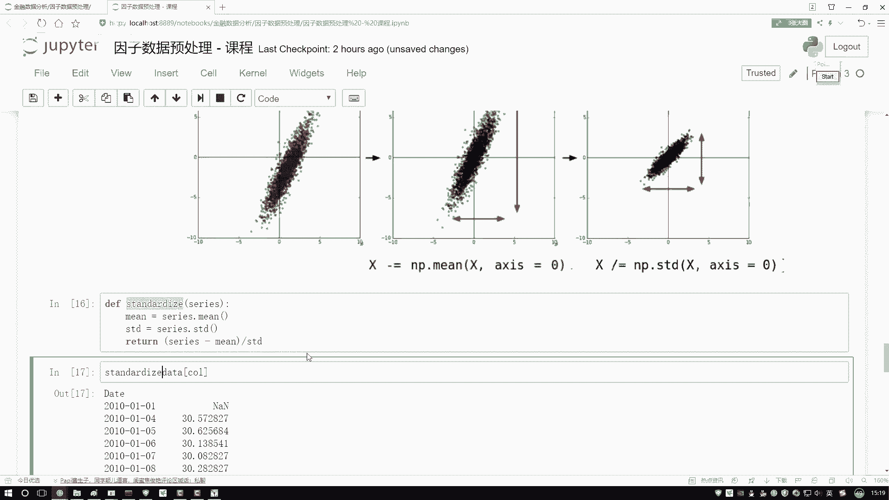

你看怎么样，都是变成了数值取值范围，相对啊在较小的一个区间当中的一个数值了吧。啊，这个就是一个标准化操作方法还是挺简单的，就是确均值，哎，在比上标准差，让数据啊第一点以零为中心做对称。

第二点呢使得我们数据啊各个维度取值范围啊，都在一个较小的区间当中啊，这是标准化。

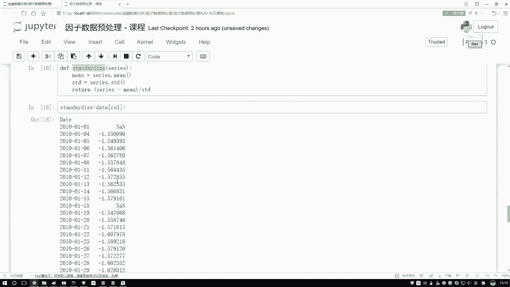

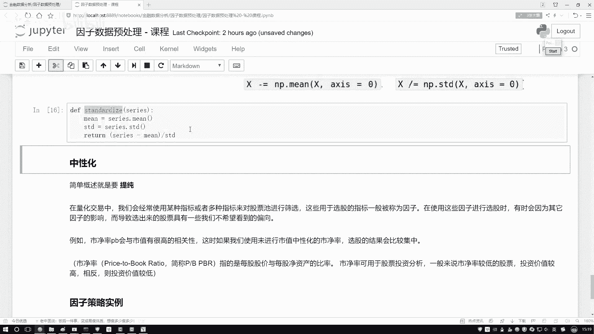

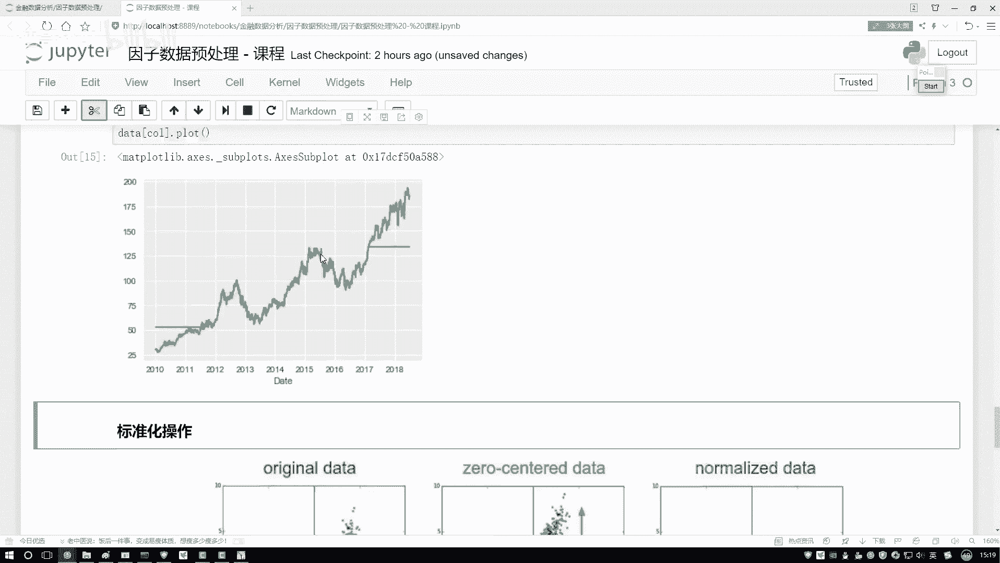

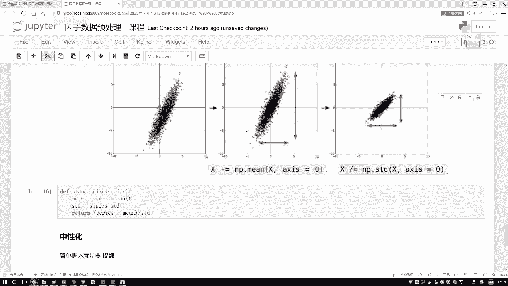