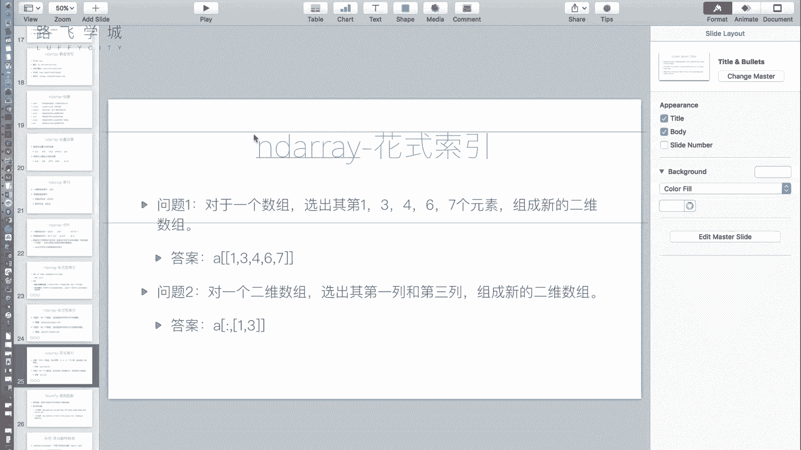
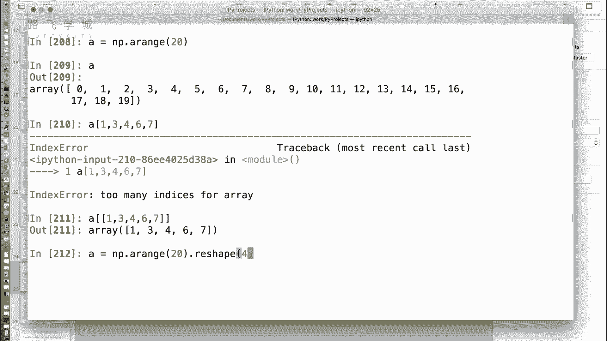
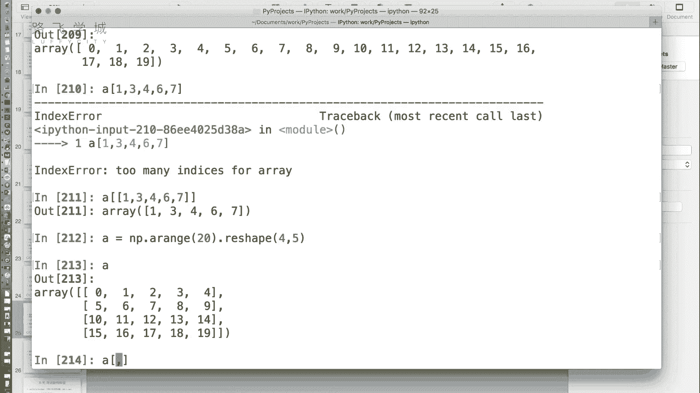
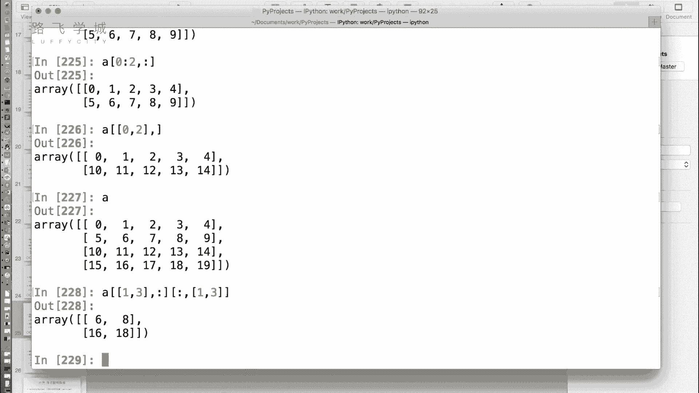
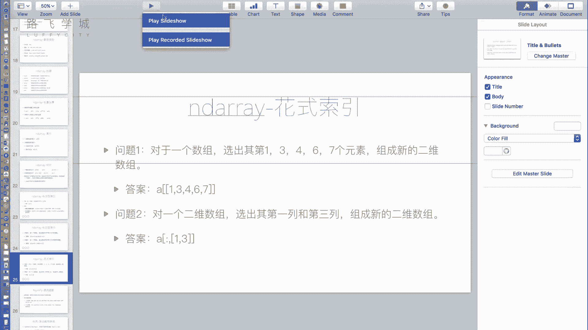

# 【2025金融量化】Numpy+Pandas实战金融量化分析，让你数据分析驱动投资决策！🚀💰 - P15：14 金融量化分析-numpy-array花式索引 - 总裁是程序猿 - BV1z6rpYuE9s

给大家讲完了我们的布尔型索引，然后接下来这里给大家讲，ND格瑞的另一种索引方式叫做花式玩法，花式作用不是花式玩法啊，花式作用是什么呢，哎这有一个问题，对于一个数组哎，我要选他的一号3号。

4号六号七号元素组成一个新的二维数组。

那个没有规律啊，对啊没有规律啊。

但是这个位置哎我可能知道，比如说哎A等于ANP点，range20吧，哈哈我就想选13467，那就输13467的索引吧，啊就只能这样了，不是不是你就在里面逗号嘛，逗号可以吗，不行吗，我说了逗号表示什么。

逗号表示分的是行和列呀，哦对你这个相当于是分的对吧，你看那怎么办呢，其实这样就可以了，括号括起来，你看你看我就说嘛，你看因为因为他为啥正好也输出13467呢，因为0号元素就是零嘛，一号元素就是一嘛。

你把它乱一下的结果也不对，对的啊，啊这个东西就是花式作业哦，就是什么呢，你在索引里边哎，刚才我们说普通的索引就是一个数对吧，我们讲了布尔的索引，你可以放一个布尔型的数组进来。

哎其实原生的那个列表也应该支持这个功能，其实也挺有用的，有的时候他就是你说应该啊，他就是不支持，对他是应该，但是他这不现在有支持的了吗，好那这个东西是布尔值，所以啊啊花式索引花式索引啊，对花式索引好。

咱们前面讲过了，普通索引切片，布尔型索引，花式索引的东西，OK那对于高位数数来说，对于二维数组来说，二维式和花式索引怎么做一样。

四行五列啊一样，我说就是这四种方法，普通索引切片列表，那个布尔特索引花式索引嗯，我们说你想让它行列搭配着来，就是中间一个逗号左右用哪种都可以，比如说左边用常规的索引零可不可以。

就是第零行，右边我用切片，别2~3了，2~4吧，嗯你看我切出来是不是这个第零行，然后是二位置切到四的位置，那是不是就这嗯，那比如说诶我这个啊左边是零，然后右边是什么呢，右边是这个A0啊，大于，大于几呢。

大于二吧，哎你看看这是不是就是左边是常规的索引，右边是布尔型索引，怎么是布尔型索引呢，你看这是第零行，对不对，然后右边是A0大于二，就说我把这一行所有大于二的值就行了，看A0啊。

大于二出来就是这么一个啊，因为后边两个是大于二的，所以最后取出来是三嗯啊那注意一点是什么呢，花式索引和花式索引不能同时出现在逗号两边，不然会出现不太一样的结果，比如说啊我想选六八十一十三。

别六八十六八十六十八，这四个值好吧，我组成一个新的二维数组，这没啥区别，那我换一个你就可以取吗，我行上取第一行和第三行，列上取第一列和第三列是不可嗯，那我想当然哎，我是不是这么写。

中括号中间一个逗号行上是不是花式作业，对一三列上是不是也是一三，但是我们看结果诶，跟我们选的不太一样，68这取了第一个，这个比较困惑啊，我也不太理解为什么这个模块需要这么设计。

它这种写法它不是解释为两种花式作用，它是解释为什么它是解释为把一一位置上的值，这个值和三三位置上的值拿出来，看到没，有，一位置上的值就是六啊，三三位上，这就是18，IC它是这样啊。

所以两边都的作用就亮了，对会出现不太一样的情况，那哎有时候我就想取这四个值，那我怎么写，那只能分步写，怎么分布呢，好我先取什么啊，看行上是不是取一三列上是不是全取就可以嗯，那所以是行上是花式作点。

一三列上是一个全部，这个冒号相当于什么，它是一个全部的切片嗯，你看他切出来，他是不是把第一行和第三行写出来了，看到没有，第一行和第三行就五这一行和15这一行，然后我们在这个基础上再切列切列的了呗。

切列是不是行全都切，然后列是多少，靠这个好复杂，列是多少呃，第一列和第三列吧，A然后先通过花式索引起到第一，就是把行和列分别切，然后后面那个冒号冒号冒号是全切片啊，全切片后面哦全都要，那不写不就完了呃。

不写的话会报错啊，你这样会擦，那好吧，你逗号后边必须有东西，如果说啊，比如说啊还是这个A比如说我想取前两行嗯，你要么就是这样0~2直接写逗号嗯，要么你写的逗号，你看你不写，都这好像也没事啊。

应该来说写应该要加个冒号，对刚才不加应该可以，这就属于它不加是切片的问题，但是再来一步，就比如说我在这一我这样用就不行了，算对我零二吧，花式索引的时候就必须也可以不用，嘿嘿变成逗号。

就代表就是后面就是所有吧，我记得就要加行行行，然后啊这是说你再写一遍吧，再写一遍是吧，换重写了还挺难麻烦的，可以写没有问题，切行啊，就是先切行，比如说这个花式索引第一行第三行逗号嗯，列全切就是个冒号嗯。

然后接下来切列就是行全切冒号逗号，接下来是第一列和第三列嗯，好的好的非常好，这就是你几种索引可以搭配的来混的啊。

好那我们这一些他的NDAR瑞的一些功能。

一些高级的索引啊，就说完了。

