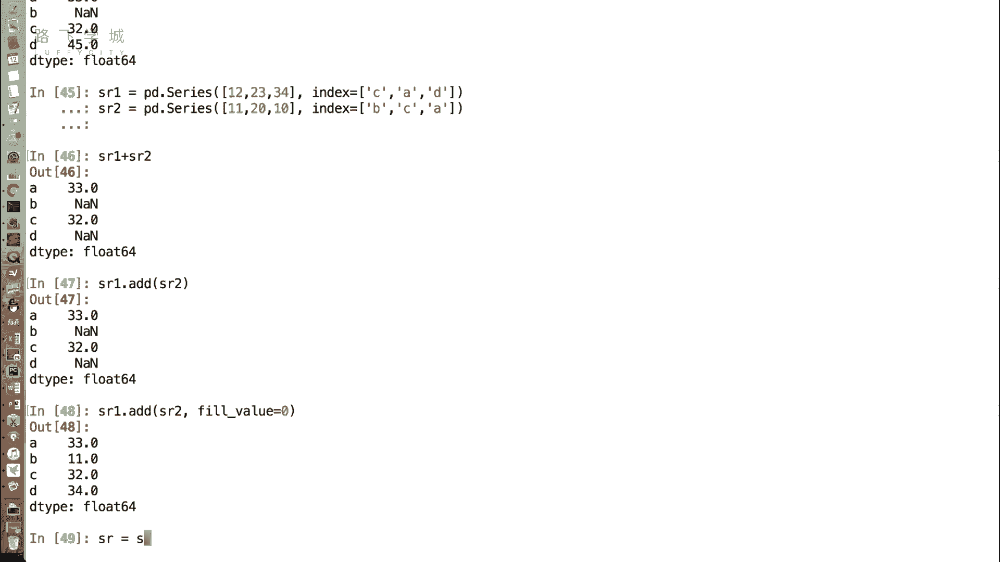
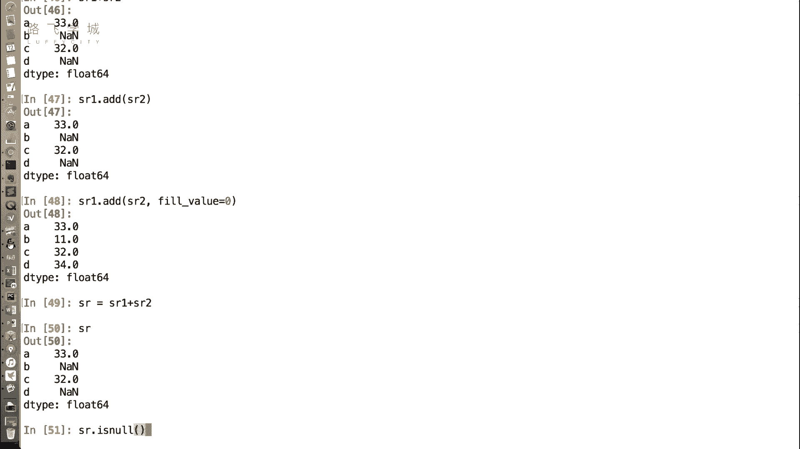
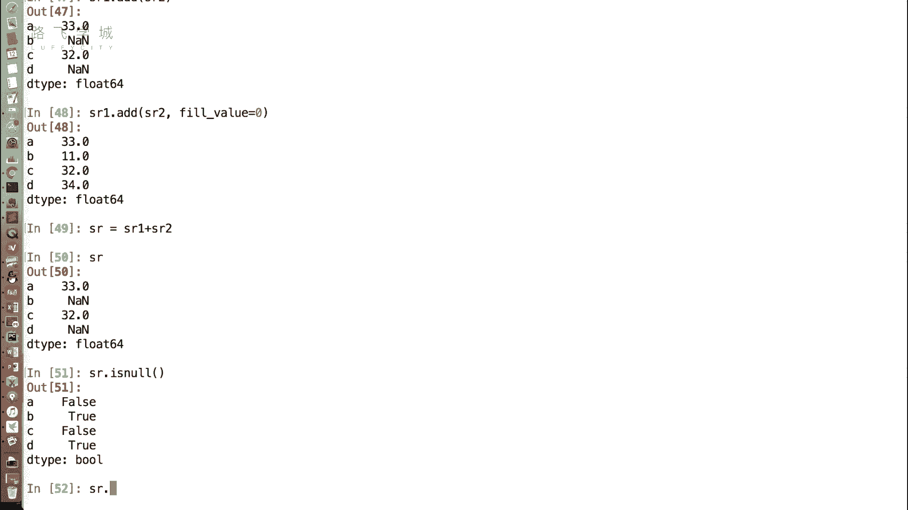
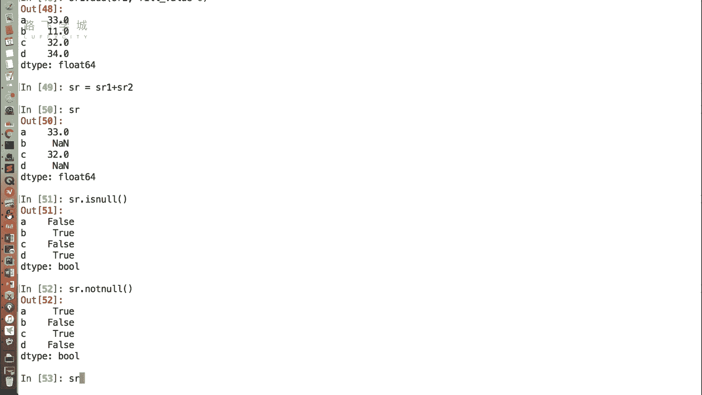
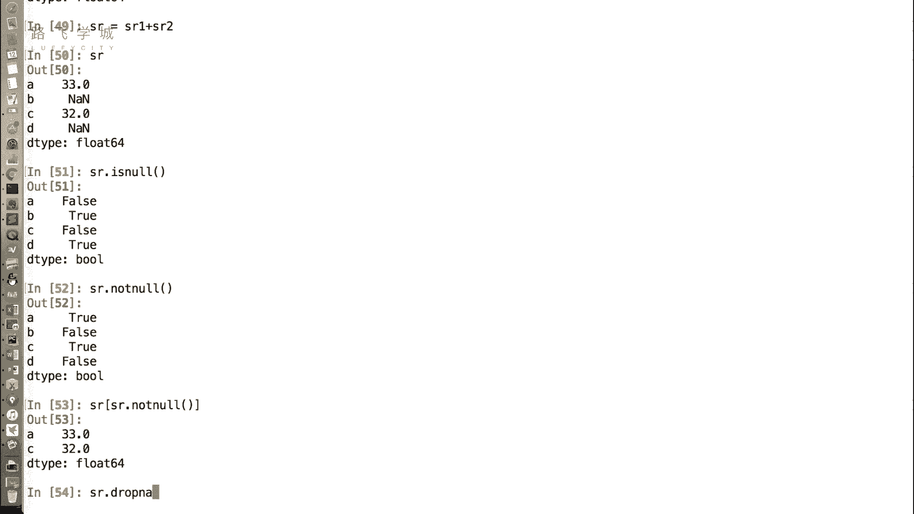
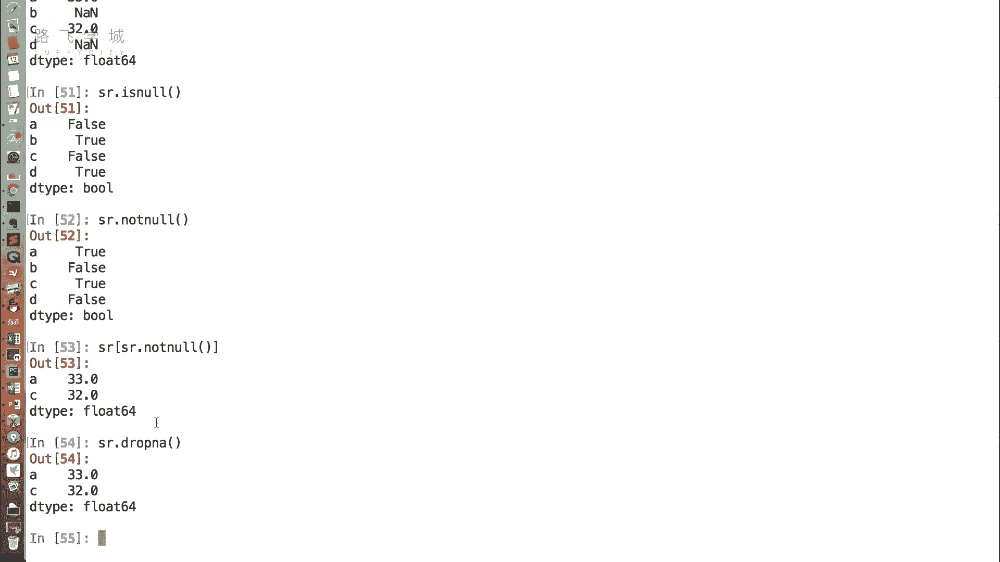
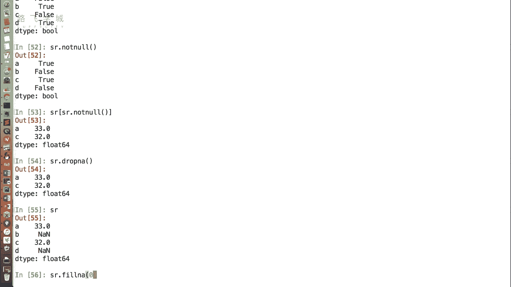
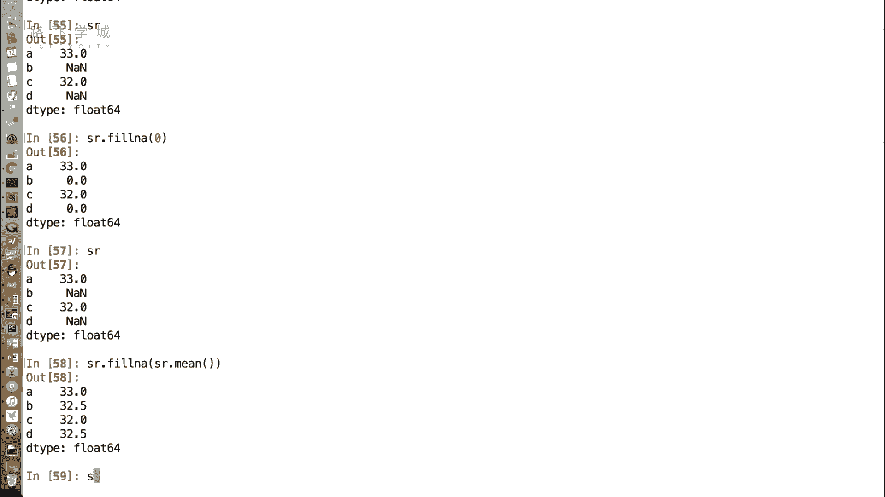
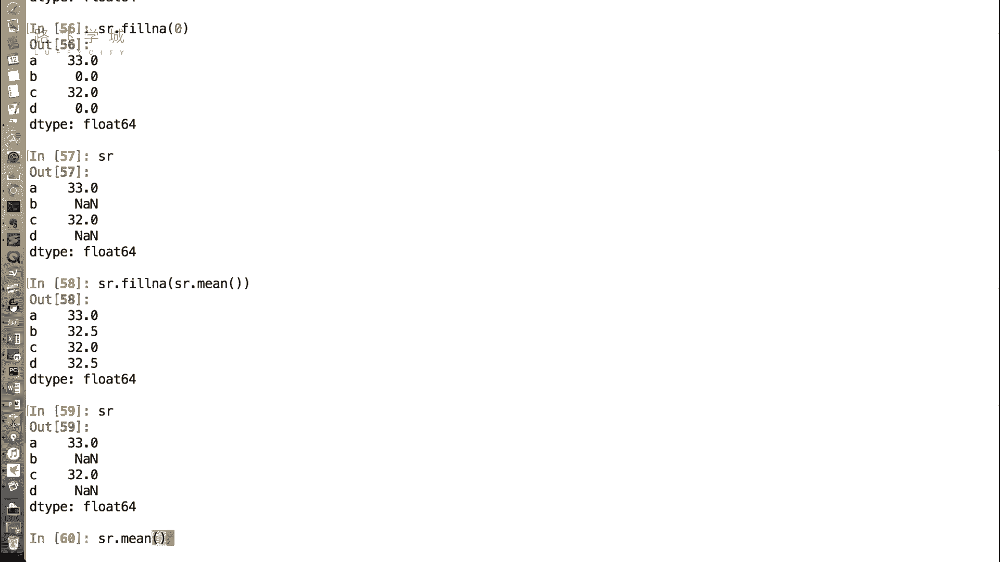
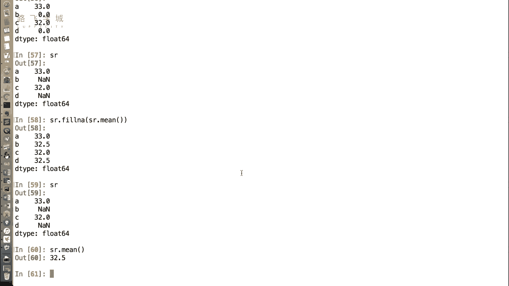

# 【2025金融量化】Numpy+Pandas实战金融量化分析，让你数据分析驱动投资决策！🚀💰 - P21：20 series缺失值处理 - 总裁是程序猿 - BV1z6rpYuE9s

好那刚才我们已经知道了，这个在series里面是可能会出现叫缺失数据的。

也就是啊这个SR里边的NN值嗯，那出现缺失数据，我们有的时候是可以放任不管的，就说我们不在乎他是不是这个优值，那但是有的时候，我们可能要进行进行进一步的运算，或者是我们要生成一些图表之类的。

但是我们看着这些缺失数据很难受，那么怎么办啊，就是要把它处理掉，那怎么做缺失数据的处理啊，我们这儿主要大概有两种方法，第一种就是把缺失数据删掉，这一行是缺失的，我就把这一行删掉嗯。

好那么删掉缺失数据的相关话有什么好，第一个，首先我们可以有判断这一行是不是缺失数据的，一个函数叫做SR点is n u l l，看看有没有确实注解对我们可以看啊。

执行这个函数，它返回的是一个布尔型，OK所以啊false true false true，也就是说是NAN的就是true，不是NN的，就是false，那注意一下这个函数名叫is now啊。

这个就是它命名的时候，就是比较有意思的地方了，就是它没有说is n a n，它是命名is now，我也不知道为什么，但是它这些词确实是一个意思啊，就是这也是表示确实值的意思，所以大家记一下。

那与之相对的还有一个叫not n。

就是倒过来嗯啊就是不是空值的地方，不是缺失值的地方，返回true是缺失值会返回false，那么首先我们可以根据这个特性，加上我们的什么布布尔就可以做缺失，处理好SRSR点not n哎。

就可以把所有的过滤掉，过滤啊，这是那它其实还提供了一个函数，直接可以扔掉，叫drop p n a啊，这个所谓NA其实也是NAN的一个别称啊，它也就是缺失值，就是drop嘛，就扔掉。

那就是把缺失值扔掉，这个也是可以直接把所有缺失行的，把所有缺失值的行全都删掉，嗯good好，这是我们说的第一种处理缺失值的方式啊，就是把它扔掉，那第二种我可以什么把它加上，他不是没有值吗。

我给它赋一个值，嗯啊那赋一个值的函数是SR。

我们看SR还是SR点FNA啊，扔掉是drop a装上是FA，比如说我们给它就成零。

那他的所有NAN的值就会变成零，OKOK吗，嗯好但是注意一点啊，我之前也说过了，就是我们现在讲的所有数据，这个数据处理的这些模块，包括NPR，包括pandas。

他们都是不会在SR这个基础上进行改的，嗯你看你我现在在打印SR还是NN，所以你feel完了之后，你如果想保存，你要记得复制啊啊不记得赋值，它是不会保存的，好好这是啊缺失值的第二种处理方式。

就是把它填充成填充成一个值，那么我们可以根据实际情况，决定它填充成什么值，比如说这个地方NN就表示它没有，那么填充成零，那有的时候他可能只是说这一，这一天或者这个月我没有记录，那还有一些常用填填充方式。

比如说我可以把缺失值填充成平均数，平均数填充成，这不是整个一列嘛，对不对，他有的时候就可能一天两天没有，但是我没有的话，我填充成零，整个数据就不连续了，就我可能要看它的趋势对，但是它没有。

我就没法表现出来的趋势，但是我又想看，那所以没有办法，我是不是可以填充一个平均值，那这就大概可能差不多对吧，可能一天的趋势对我们没有关系，但是你乘零就不好看了好。

所以这个时候我们可以比如说SR点FNA啊，平均值就是SR点min，跟我们之前讲number pi就是数组点main。

这个地方SR也可以点min，但但你这个是不是有点问题，就是哦我懂了没没问题，我以为就是他要算好几次，那个命不会不会他这个地方就是算一个值，而且就是如果有缺失值的时候。

你算mean啊，他会把这个NA的值都跳过去，对他会算是33和32。

平均值32。5，我靠这个这个挺牛，挺方便的啊，它默认的会跳过去，如果你不想跳过去，咱们会不会说就是它有一些更更别的参数，我我终于知道为什么好多人一喜欢用pandas as，因为我之前处理一些数据。

它里边我没用过这个吧，然后呢这就有各种NA就是none的数据NN，然后我直接求平均值或者加的话就会报错，所以我就要先把那个先去掉，然后再再对列表进行加对，如果你不用它，你是什么二维列表。

什么字典加列表处理缺失值特别费劲，对好OK，以上就是我们说的serious。

