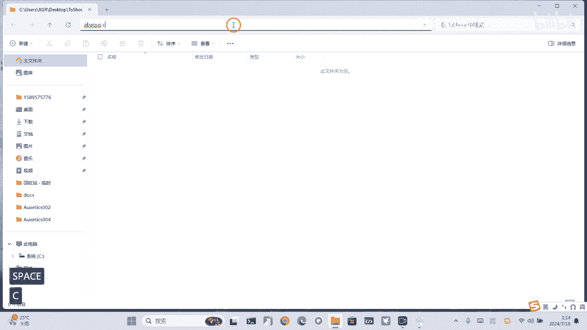
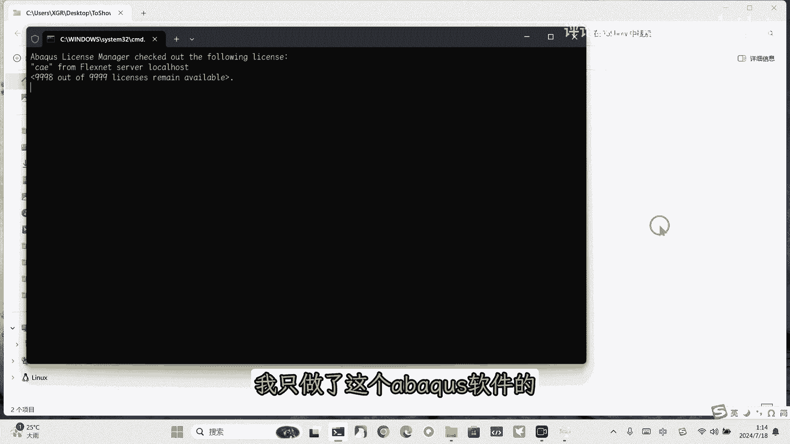
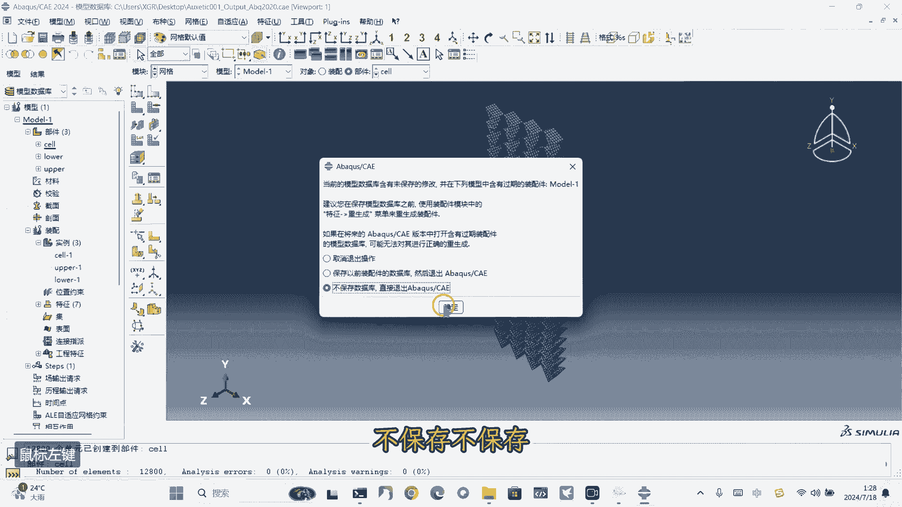
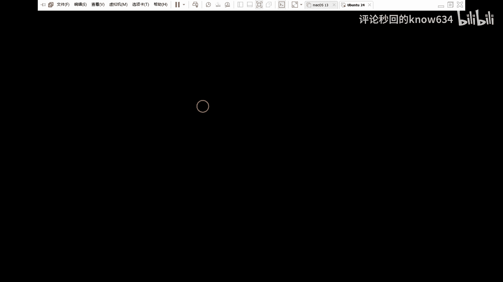
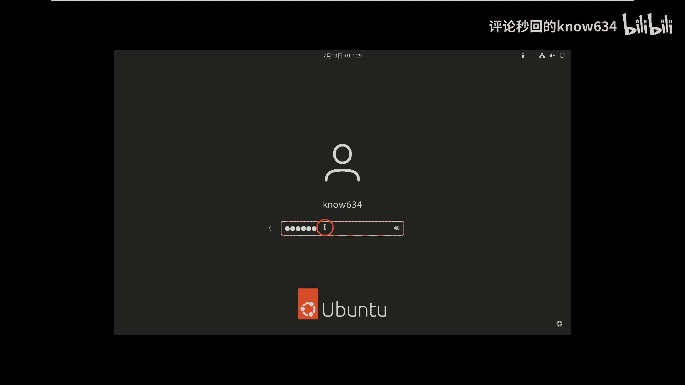
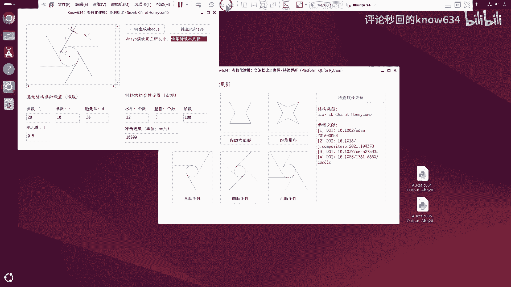
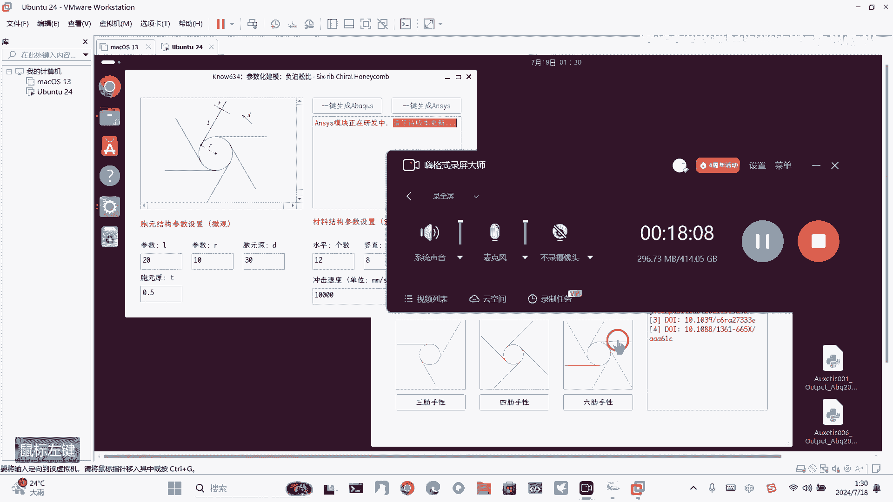

# 【Abaqus Python 二次开发】负泊松比全家桶：参数化建模，一键生成动态冲击仿真模型，持续更新！ - P1 - 评论秒回的know634 - BV1jM4m127Tj

嗯好OK，今天给大家带来的是这个富博松比全家桶啊，这是这是软件的安装包，我们双击打开它可以看到哦，就就这样直接就安装，这里可以选择这个地址创建桌面快捷方式，好安装，好完成啊，直接就运行了，这个软件的话。

我这里就目前目前就做了这么多这么多的啊，目前就做了这六个，这六个这六个经典的啊，首先的话这这里这个可以画，可以涂鸦，然后鼠标左键鼠标右键就取消检查更新对吧，当前是最新版本啊，然后持续更新的。

那就我们来看一下啊，因为他就是一键生成这个这个模型，这样的话你就不用去建模了对吧，首先我们来这里。

我们先打开这个阿布克斯啊，因为我目前啊这这是第一版，我只做了这个up quest软件的这个安cs软件的。

我还没做啊，对还没研发完啊，首先我们看下这个双箭头对吧，这个先这样吧，有双箭头对吧，这是我们的给的参数，直接一键生成生成到桌面了啊，接下来我们来看一下，直接运行脚本，桌面在这里，这是第一个对吧。

直接点击确定好，这样这样就参数化了，直接就一键生成了，这样一一个压缩实验对吧，这里模型建好了，建好了之后，后面你就啊属性装啊，属性分析部加荷载，这荷载的话，这里有一些信息。

对这个高度差也可以设置这个时间间隔，这个时间布这些，然后然后就画网格之类的都行的啊，这是第一个模型，接下来我们展示第二个模型，我直接把这个给删了，对是这个对吧，这个好是这个可插了好。

第二个是这个内凹六边形，好我们直接一键生成，好一键生成出来了，好等一下我给你讲一下这个这个参数对吧，这参数就是在图里，这同样的这这个也是可以涂鸦的，对对对，你可以做笔记什么的对吧，比如说这这这这里对吧。

鼠标左键就是画鼠标，右键就是橡皮擦之类的，点一下就没了，这这里可以设置参数对吧，好这是第二个，我们来运行一下，好第二个直接就出来了，这样一次冲击压缩实验的，这个这个这个是翘单元。

这上面两个是两个离散刚体好，这是第二个，对啊，那就中规中矩的对吧，好现在我们把它删了对吧，这里对你看这是微观参数，宏观参数十二八对吧好，这是第二个，接下来我们再看第三个是这个四角星的，对这是参考文献。

对，这是个，这当然是找对了，这个一些中综述类的参考文献对吧，那这个参数这三个参数定了，定了之后是深度对吧，接生成，一键生成对吧，这是第三个星星的，哦我这里说一下，我是用2020版本来开发的。

这里测试的话，我用的是2024版本，都一样的感觉啊，看这这这个心形是不是对吧，这个心形你这就一下就生成了，你本来建模的话，你可能需要花比较久的时间，现在，现在一下子就生成了，而且还可以调节不同的参数。

还是比较方便的对吧，然后对我也会就默认保存到桌面的，运行完之后，然后把这三个实例给删了，这个是星星的，接下来我把这个这窗口给关闭，接下来是这个属性的，这个属性的我感觉比较难做啊，但是还做出来了，好。

这个生成的对吧，已经生成了，这里讲一下那个属性，首先有两个参数，就就这个长度和这个半径参数，主要就是主要就是这两个参数好，我们运行，这是第四个吧，第四个结构，哎呀加载一会哦对了，这个软件是跨平台的。

准备了windows和LINUX的嗯，我会一一演示的，咱们不杀鸡对吧，好出来了，这个这这这个这个三类属性，我们当时啊这个这个计算这个计算有点复杂啊，复杂在哪，复杂在哪里，我要把它这样平着放对吧。

平着放的话，往往这里要旋转多少度对吧，这就有一个讲究，这是难点对吧好，这三个小数点像这里多余的一些，你可以边缘的话，可以其实是可以处理掉的，对，我是可以用这个这个功能来处理一些，边缘的细节好。

这个是三三类，显性的是在网删除类的装配的，删除了，咳咳厉害，十五六对吧，然后是四个的，直接一键生成好一键生成了这个科技鱼，鱼很滑啊，这个，这不就挺快的嘛对吧，因为计算量比较小，清明对吧啊，他就是这样的。

整这个整整齐齐的还行对吧，好接下来，改了啊，接下来删除，是对我这边负责建模对吧，然后材料那些就就按照你们嗯，实实验室是怎么取得的来就行了对吧，只要你把建模的问题解决了，其他都好，其他都好办的好。

这一个是六个吧，六个的话一样的，不同参数对吧，好在这里OK了，对他就是这样的对吧，啊最后一下对，这个这个就是这个就是守信守信的，比方说哎我之前在这里再来一下我，我把这个这个水平的，我就改成改成。

等等四吧，然后这个数字的我改改，改成它属于八个，我看看二二十个吧，我感觉20个会怎么样啊，试一下试一下看一下看一下对吧，看一下，对因为他确实是参数化的吧，这个都是用代码控制的编码。

他可以批量的做很多事情，啊这这一下一下就就这样了，好的现在现在我来看一下显示，然后你的工作就是就是什么呢，你看这个是上面是冲击板，下面是地面对吧，然后就是属性对吧，属性这里。

这这里给给你的这个这个添加一些属性，装配装配我已经给你装备好了，但在属性的时候看下这里应该有一个叫什么，你可以给那个上面的那个充气板添加一下质量，不过我好像没找到，就是用这个点以以点带面对吧。

惯性应该是创建的对吧，重点字面，呃呃这里我这里我好像也有一点遗忘了，不过不过应该叫外可以就可以查到，然后这这里试加荷载的话，等于只需要等于是林地学添加一个位移，添加一个速度对添加一个速度就行了。

后面后面画网格，画网格其实就是给这个画网格的吧，是这个报告是这个对吗，我还我还记得对，记得当时说还有要以要以这个为主对吧，然后的话我们还得检查一下，水中花，不同类型显示的恰好单元确定。

然后检查网格不部件不含有该该怎查的网，这怎么回事，哦我还没画对吧，然后我开始对我这样默默认的画一下啊，对然后就这样画一下网格搞亮，看一下，对，你看这网格网格都都没问题的，这说明这个模型是OK的。

嗯好OK这个这个是windows系统下载，接下来我们把这个关闭啊，不保存不保存了。

这个就不保存啊，这个时候对你看桌面，桌面上，其实我当时就每运行一个，他都会给你保存一下嗯，这是自动保存的，好接下来，因为有的人他的这个操作系统是这个LINUX，或者是你在那个超算平台上。

额用的是这个LINUX系统，那么。

那么你就可可能会用到这个，所以我这边也准备了这个版本。

这个这个在在这个LINUX下的话，直接对是一个其实是是一个压缩包，直接双击它，它解压完之后是在上，是在右下角，我们把它移动拖到这里来，打开这个文件文件夹，好在哪，在哪这个文件夹啊。

就直接就点击这个就可以了，直接点击就打开了，还是一模一样的，叫警察更新对吧，然后这里点击它，点击这个一键生成它，你看它就在这里键生成的，然后点击它点击生成它这样，这这个也上传的，这是up quest啊。

那这个access的话，ANCIS还在研发中，就下次版本更新再来再来嗯，好OK这次的这个视频就到这里。

本期视频就到这里。

