# 【BIT-CV2024硕士】15-神经网络量化及其在计算机视觉中的应用综述 - P1 - BIT-CV - BV1phCGYpEr8

老师同学们大家好，我是计算机学院的朱天宇，我汇报的题目是，神经网络量化技术。

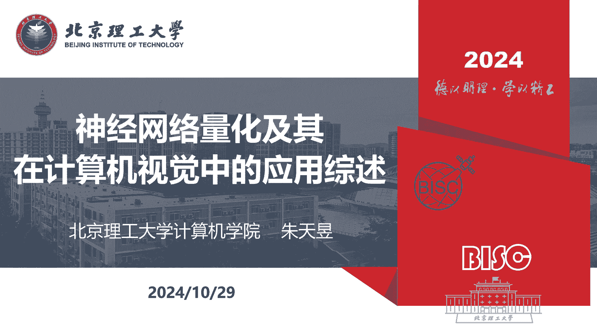

及其在计算机视觉中的应用综述，我的汇报分为以下五个部分。

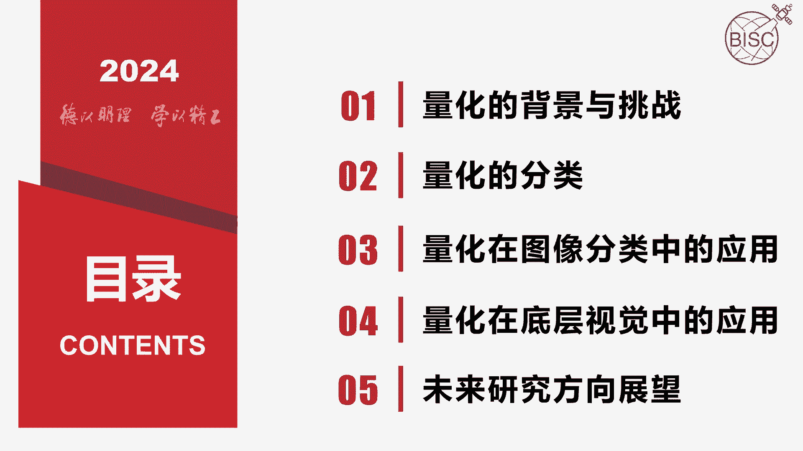

第一部分量化的背景与挑战，近年来深度神经网络飞速发展，然而神经网络包含大量的存储参数，和很高的计算复杂度，这就给其在硬件资源有限的设备上的使用，带来了挑战，因此对神经网络进行有效的压缩十分必要。

神经网络压缩技术主要有量化减脂，地质近似质蒸馏等，其中量化技术是将浮点参数表示为离散的整数，因其可以实现神经网络高压缩。

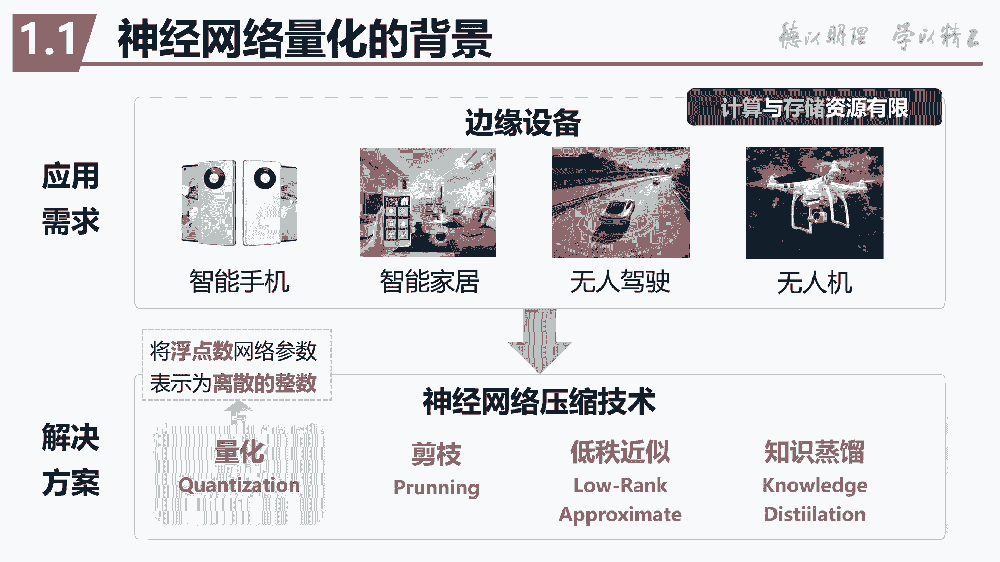

且降低性能较小等优势被广泛利用，目前深度神经网络量化主要存在以下挑战，一是性能损失，因量化导致的误差累积导致严重的性能损失，特别是在低比特量化方案中，二式分布不均，不同层的权重和激活值分布通常不相似。

这可能导致统一的量化策略失效，三是硬件限制，不同硬件对量化操作的支持差异较大。

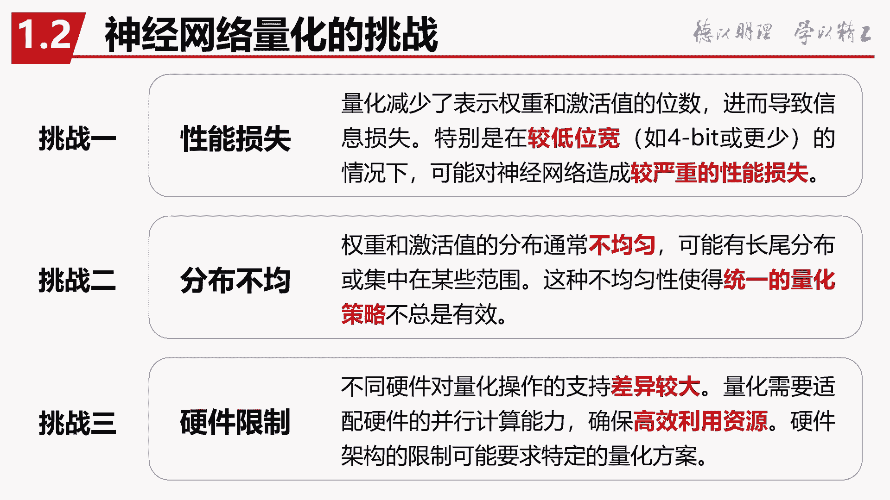

不能够保证高效的利用硬件资源，第二部分，量化的分类。

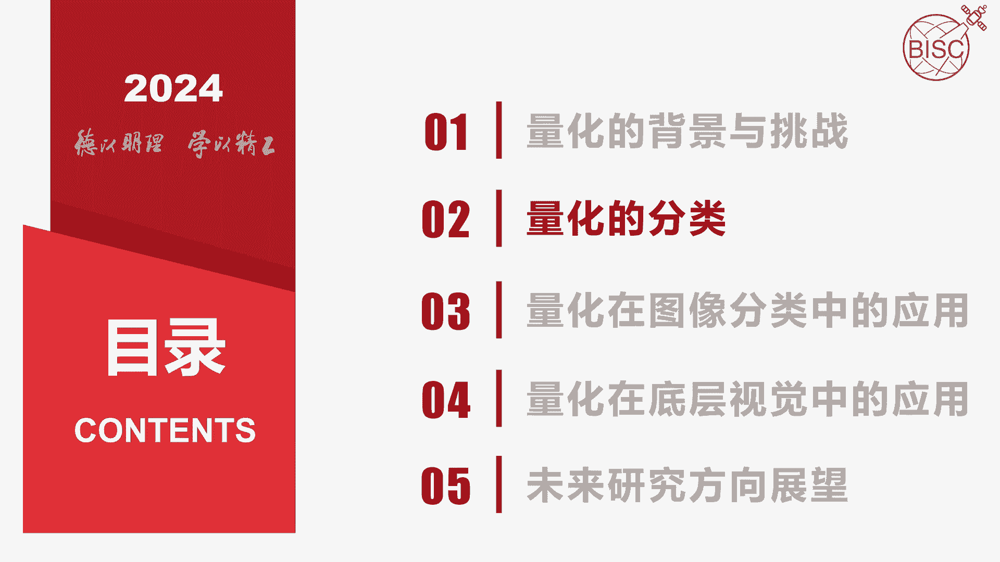

按照量化分布的不同，可分为均匀量化和非均匀量化，均匀量化是指量化网格步长相同的量化方式，反之则为非均匀量化，按照量化发生的时间点分类，可分为训练后量化，PTQ和量化感知训练QAT。

其中QAT在低比特量化及四比特及以下相比，PDQ有明显的优势，但是QAT的量化方法也普遍存在着，训练时间较长等问题，按照量化确定性分类，可分为确定性量化和随机性量化。

随机性量化通常表现出更好的模型泛化性，但是其在硬件知识方面仍有很大的挑战，按照量化力度分类，可分为层尺度量化，通道尺度量化和通道组尺度量化，如右图所示，存储的量化是一个layer中。

所有的filter均采用相同的量化参数，易于实现，通道尺度量化，是每个filter有一套独立的量化参数，其效果较好，而通道组尺度量化。

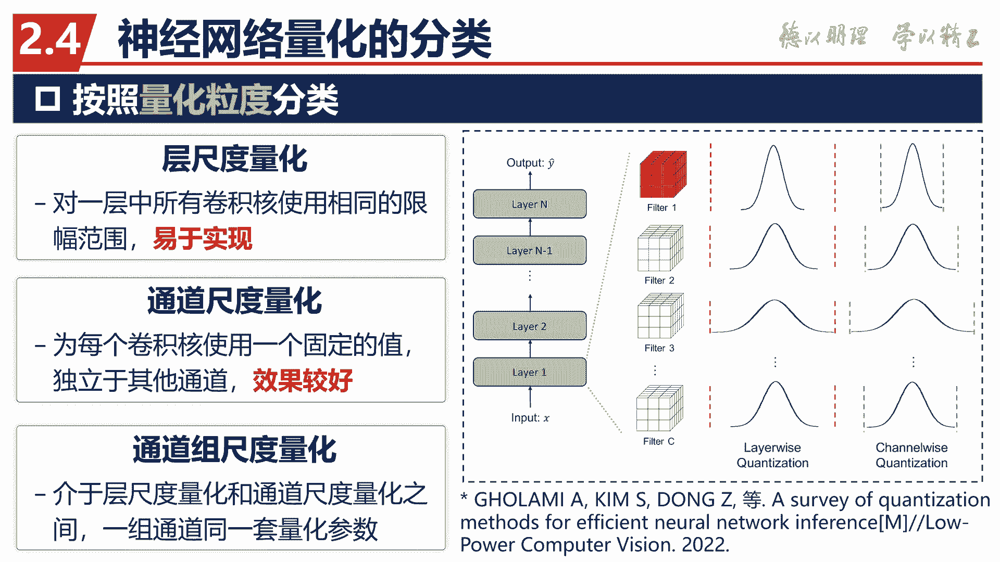

则是介于层尺度量化和通道尺度量化之间，第三部分量化在图像分类任务中的应用。

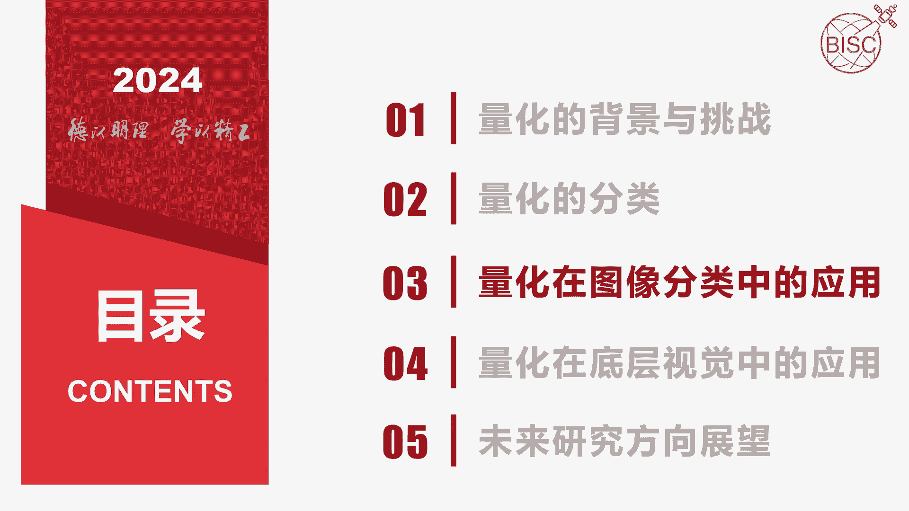

当前神经网络量化技术的研究仍处于初级阶段，大部分研究工作都是在图像分类任务上，验证其方法的有效性，部分代表性，基于CDN的网络量化方法，如表所示，这张表中的数据均为原论文中报告的。

在RESNET18网络和image net数据集上的准确率，我们看，可以看到表现最好的方法是n to u q这个方法，下面我们介绍一下这个方法。

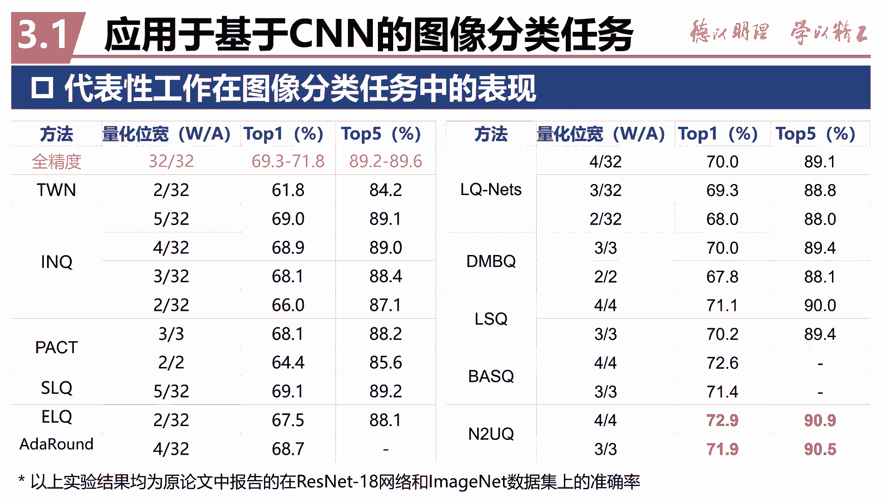

n to u q方法，提出了一种非均匀到均匀的量化方法，通过将量化映射函数中的所有阈值，都设置为可学习参数，保证硬件友好性的同时提升了精度，该方法同时引入了广义直通固定器，计算量化器的梯度。

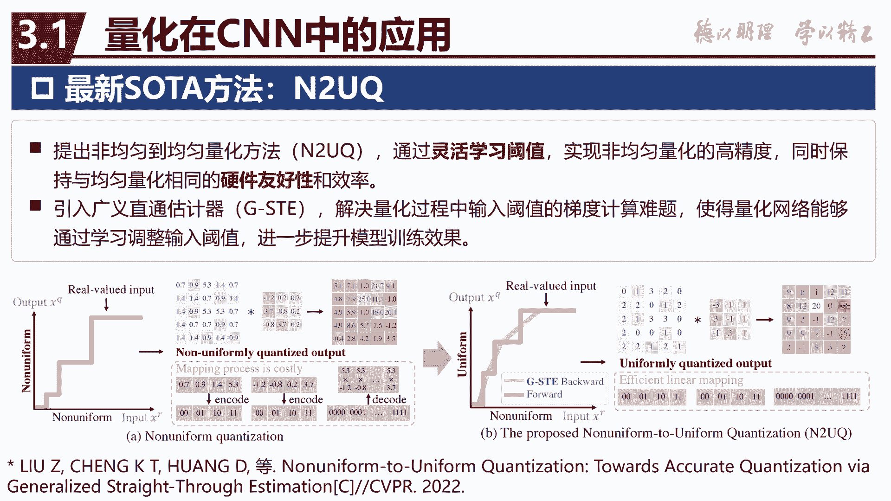

进一步提升训练效果，下面我们做了一个小实验，比较几种典型QVT优化方法，在小数据集C发时上低比特量化的有效性，实验设置如左边所示，本实验中不使用预训练模型或知识证明，辅助量化，均采用从零训练的方式。

我们可以看到，n to u q在234比特上的量化效果。

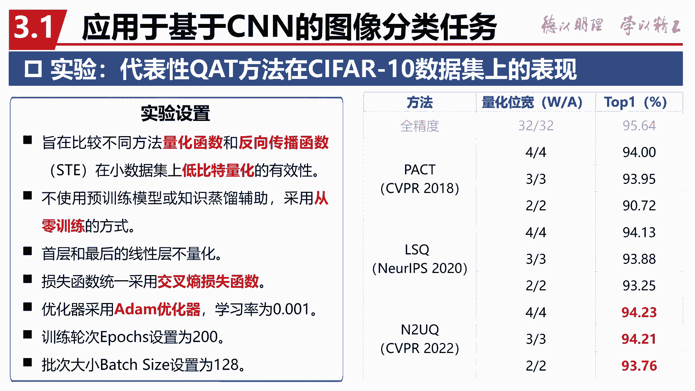

均表现最好，对于基于transformer网络的量化技术，现有的研究，主要针对算法和硬件两个方面进行改进和提升。

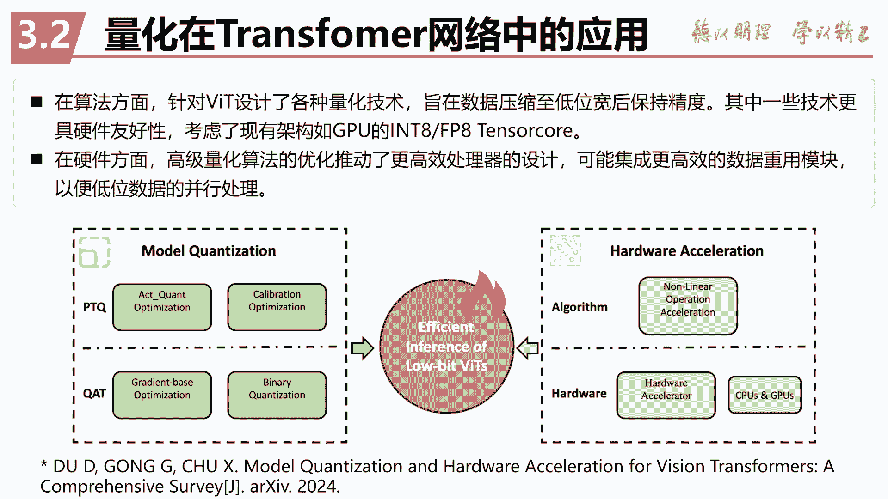

表中展示代表性量化方法，在transformer网络上的量化表现，可以看出，GPU sq lead和pack cuvet表现较为突出。

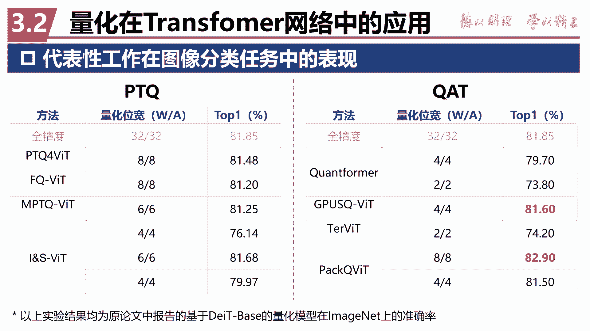

派克QVT，针对巴比特和斯比特，提出了两套不同的量化方案，针对全量化和打包量化技术，提高模型硬件效率和推理精度。

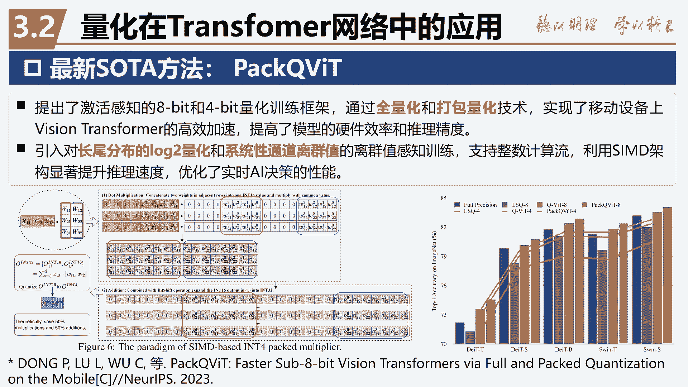

第四部分，量化技术在底层视觉任务中的应用，底层视觉任务包括图像或视频的超分辨率，去噪去模糊，去雾去雨，低光增强等等。

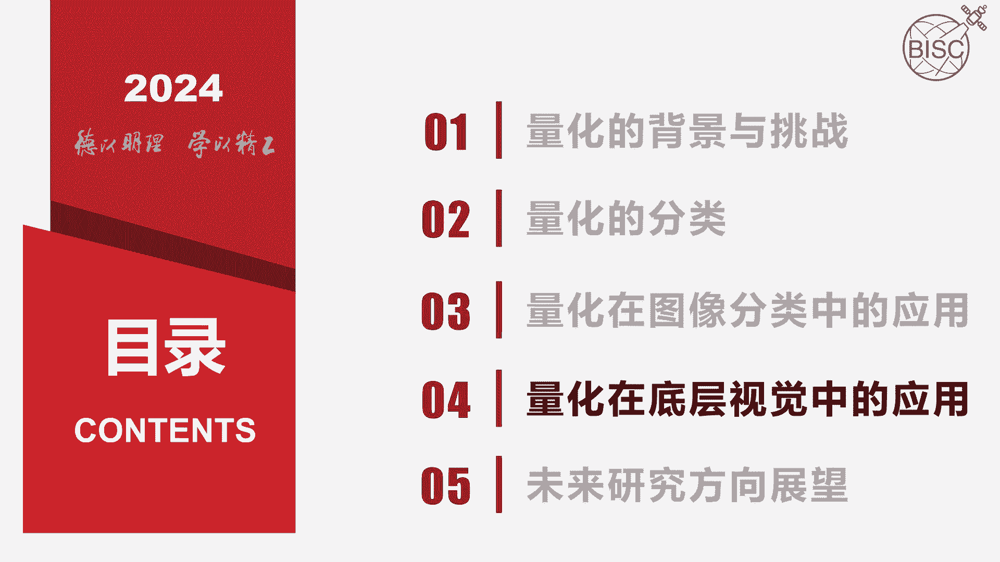

最新的图像超分辨率量化工作代表之一，矿台SR，其针对超分网络，引入了可学习量化器和动态量化架构，提升了低比特量化模型的信息表示能力，并实现了量化与精度的平衡，热片工作是针对低光照弱视频增强任务。

提出了一个二进制神经网络模型，也就是量化位宽为一比特，该方法在没有严重影响增强效果的前提下，将模型的计算量和参数量降低了98%。

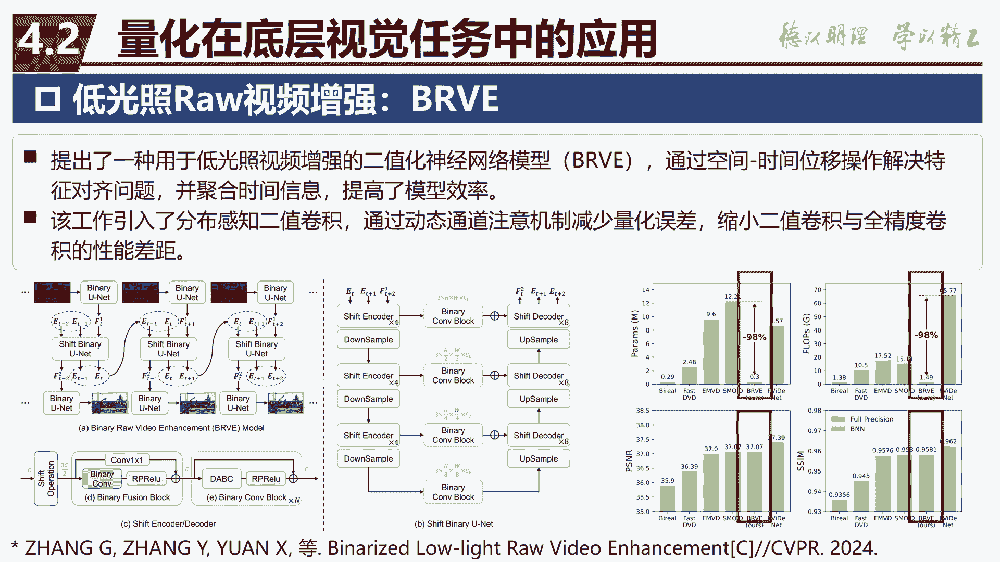

我们对这篇工作进行了复现和改进实验，我们这里对其中的空间，时间位移操作和二进制uni的层数进行调整，在进一步降低参数量的同时，提升了增强视频的PS，NR和SSM等评价指标，右边是增强后的视频可视化效果。

最后是未来研究方向的展望。

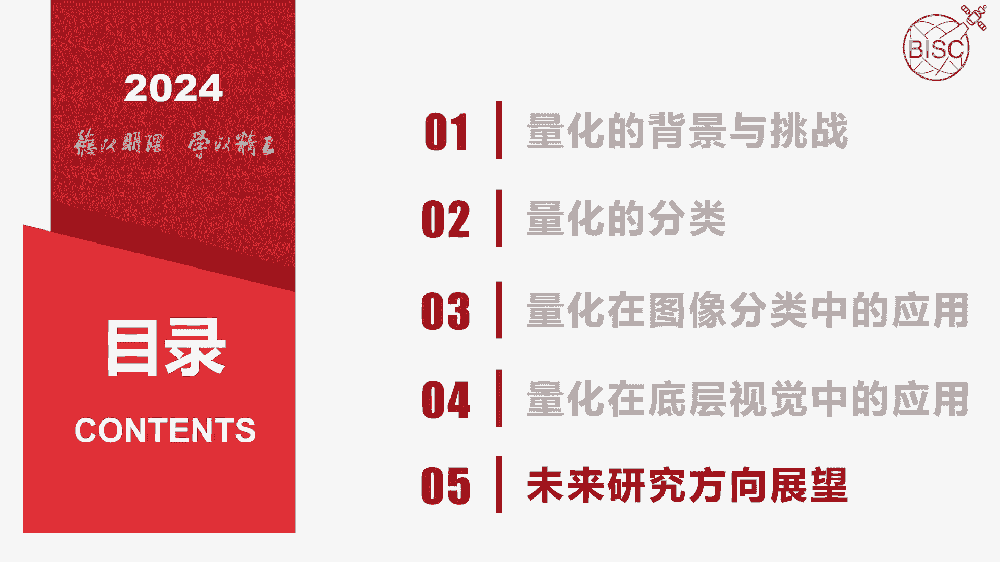

在未来可以针对特定的视觉任务，提出相应的量化方案，其次目前主流的硬件不支持，四比特及以下的量化方案，量硬件的设计也是未来的研究方向之一，同时我们还可以对量化噪声的传递，进行更精准的数学建模。

从而进一步补偿量化带来的精度损失，以上就是我汇报的全部内容。

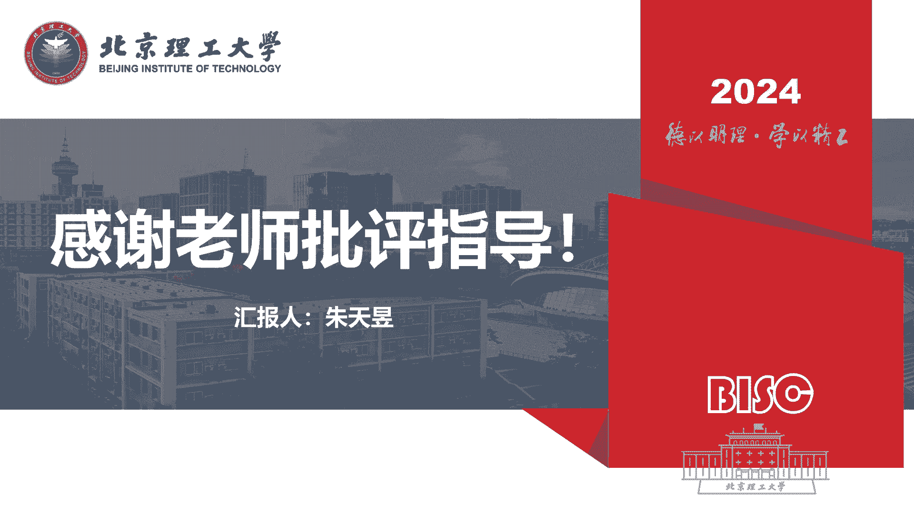