# 【Python金融分析与量化交易实战】AI结合金融如何做落地项目？迪哥手把手教你基于Python实现金融量化+股票交易，3天从入门到实战！ - P3：3.Informer时间序列预测源码解读 - 唐宇迪的AI小助理 - BV148xjemEBJ

行行行，然后对回早就回复学大了。然后这样啊就是跟大家去说一下咱们今天主要内容。我们今天这样啊，就是上次大家记不记着上次我给大家去说，哎，咱们讲完transform之后，让大家留一个预习任务。

我们预习什么，说预习一下inform这个算法原理啊，我估计啊就接下来同学得有那么起码一半啊，已经把这个东预习了，我估计大家很多这样看的，都知道咱们要讲什么。

但是我估计还有一些同学一方面是我们这周刚报名的同学，另一方面就是还没来得及去看我们这个原始知频同学你也不要担心就是跟着咱们内容先走，后续呢如果说你今天听到哪一个具体知识点啊，你说你之前可能没见过没听过。

没关系啊，因为咱们之前有些基础的东西，我们上直播会给大家去说了啊。然后后续吧咱们都会把技术补起来，然后再听也可以的。这样我先打开一下我们这个课件，叫时间序列这一个。😊，form要做这个事儿。

我再给大家看一看啊，就因为有很多同学不太熟悉要干什么。我们今天要完成的任务，咱们叫做一个时间序列的预测。跟之前咱们的CV啊NRP啊，它是都有一些区别的。我们今天做这个时间序列预测。

其实说白就这样一件事儿，就是你告诉我啊，比如说啊咱咱股票预说吧，比如说股票当中，你告诉我，比如说前一个月它每天涨跌的一个啊趋势，然后让我去预测，就预测什么，预测未来的一个序列。

咱不是预测明天我可能要预测未来10天，它每一天的一个涨跌的情况。所以说啊就是咱们这个时间序列啊，我们有很多种。一种呢哎是预测未来的一个点。咱们今天不是预测未来，不仅仅啊是预测一个点。

我们更多的是预测未来的一个序列，预测它未来的一个走势。可以说大家就是把这个东西当做股票预测，当做就是啊什么气温的预测，当做什么地址灾还要对未来影响预测等等。

我估计啊就咱们今天来很多同学你们自己任务当中都会涉及到吧啊一些跟实验学液相关的。所以说今天给大家选了一个比较通用的模型叫做一个informer。这个模型也给大家再重新介绍一下。

然后再说一个比较关键一点啊，就是今天。😊，我希望大家在学的过程当中啊，呃你不要说把它当做是咱们的informer这个源码讲解，你把它当做是一个方法啊，就是后续啊大家可能会用到各种各样的开源项目。

你把我今天教大家这个东西就当做以后你要找开源项目，你该怎么去找你该怎么去学，该怎么样去理解啊，其他开源项目的源码，其实呢我们的方法是一样的。我希望大家做一个类比吧啊，不仅是今天我们这个事。

后其他事儿咱们做法也相同的。好了，来，接下来我们就说咱们今天的一个正题吧，我们来说怎么去玩这个东西啊。😊，然后我先把这个量框啊遮蔽一下，因为一会儿因为这个东西我也是第一次讲第一次讲的东西。

我如果是盯着这个盯着这个量师去看，可能会走神儿啊，就是不太熟练的东西。我就把这个留言框链关上。然后隔一小会儿我跟大家去呃讨论一下我们今天的问题啊。😊，好了。

首先呢我们要说的第一件事就是怎么样用咱们的ge去找这个源码。咱们之前说了，我们要讲这个 informformer。那首先第一件事就是如果说呀大家拿到手一个任务，让你去做一个实验去练，你该怎么去做呢？

来给大家去梳理梳理这个流程啊，建议大家就是以后无论你是自己什么样任务，建议大家都掌握一个什么能力，叫做检索的一个能力，其实这个能力我觉得非常重要的。不仅说是对读书同学，你们要找论文。

以后工作当中啊其实也如此，很多啊就是我在给企业做一些培训的，他们对就是呃招人啊，或者是吸纳一些人才的时候，他们要求什么呢？很多总监都我说这一件事，就是第一点学习能力要比较强。第二点检索能力要比较强。

就是我们来一个需求，你要快速知道你能套什么源码，而不是说你就干做去想干做去自己在那抠哧抠这个东西，一般情况下，咱们要快速去迭代，快速开发，那怎么办呢？站在巨人的肩膀上站在这些开源项。😊，在解码上当中。

那我们来说一下怎么去找这个东西。😊，第一点，我们打开什么，打开这个万能的github。在这个万能github当中，比如给大家举个例子啊，咱们任务里边，哎，比如说我想去搜这篇论文名字。

比如叫informer嘛，那一搜是不就有这个东西了。你看这一块咱就能搜到这个，或者换句话来说，你还可以搜什么呢？可以去搜这个论文的一个名字，为什么搜论文的名字也能搜到啊，我给大家举个例子啊。

大部圈是能搜到的。我来试一试。😊，呃，你看这一块搜论那名字也能搜一些相关的，但是没有搜到这个官方的一个项目。因为很多呀就是他这个介绍的时候，会把他的一些呃read文档当中写上它论文是什么。

以及写上这些介绍。所以呢跟大家说吧，就是两种方法。第一个就是你去搜这个关键词。第二个你就搜这个项目的名字。第三个你就去搜它可能啊有的一些比如说关键指标啊，关键些东西都之类的之类的东西。但是有一点啊。

觉是ge号做的其实很差的。它不像是那个百度啊，谷歌之类的，对搜索它能搜特别好，我大家举例子，比如说你看有这块。😊，我搜这个mCN，你看他搜的这个8。8K的，但是你接下来你看我再搜一个mus杠RCN。

它可能搜到的就是1个21。7K的。就是说这一块啊，他对这个检索来说，我觉得非常不智能，你可能少打一个字符，多打一个字符，这个东西，咱搜到结果是完全不一样的，这个就需要大家咱们多看多搜了啊。好了。

第一点来我们进入到咱们fer当中跟大家说了啊，当中，直接我们搜这个informer就能到咱当前这个开源项目当中。然后接下来呢我跟大家去说啊，就是咱们该怎么用这个开源项目。第一点。😊，干什么别着急。

看到啥开源项目，就是你一搜这么多，你用哪一个咱们是不是得做一个筛选，就像你到菜市场买菜似的。嗯，谁家菜卖的好，我们选谁的？先看看这个大数，咱们优先选什么，优先选这个大数高的。因为大数就相当于点赞啊。

评论啊，就你京东似的，我买什么东西按销量去排，这个你就当做是销量这些东西就感觉就行。好了，这第一件事，我们去找这个仨数，下来说比较高的。那接下来比如说我们进到道这个项目当中。我跟大家说一下。

就是呃我一般啊按照什么样思路去学这个东西吧，或者是去熟悉这个东西。首先第一件事，千万别着急看里边这个源码，你也别着急去跑。先咱们耐住性子，从上到下去读一遍，里边人家跟你怎么去说的。

第一件事就是他先简单介绍一下。😊，啊，比如说我们这个论文啊，它是挺牛的AI2021的1个 paper啊，就是鼎会，还是个 paper这个级别它就挺牛的一件事了啊。然后下面来介绍它论文当中的一些例子啊。

这个咱不看了。之前讲原理的时候给大家去说过了，你看这些都是它原理当中的东西，咱不看。接下来大家看这个就是这一块呢，它有一个呃就是各种工具包吧，版本的一个要求，我建议大家这样，就是你先不用着急啊。

必须是跟人家一样的，就首先跟大家去强调咱们大部分工具包啊向下支持是做的都还不错的。比如这块人家要3。6。😊，你3。73。8就不能跑了吗？其实基本上是没啥问题了，你不用跟人家是完全一样的。

这一块呢只是人家作者的版本，咱没必要跟人完全一模一样啊，先跑起来实在不行的时候，我们再去换，就像这些东西你都不用去重装啊，基本上都会去做的。像这个uch。你说你现在是新版本行不行呢？基本也可以。

咱们这些大部分工具包啊就封装的线支持都行的。所以就是我其实不是特别建议大家吧，就是你们跑一个项目做一个环境，跑一个项目做一个环境，那样太浪费时间了啊，就是装一堆东西，都从往外装一遍太费劲了。

先拿我们自己手里的环境去试一试去改一改。如果能改出来，咱就没必要再去必须按照人家要求去装了啊。所以这个它并不是去必须的，它是个选择题吧。😊，大概率你是不用的。因为我给大家举个例子。

你看我就是咱们课程当中给大家讲过这么多项目，其实我这些工具包版本来回变吗？我基本上从来不变，为啥从来不变？因为我讲很多东西啊，你来回去变，我切换起来很不方便。我基本上就是说呃能跑起来，咱就跑。

然后跑不起来，稍微开下源码，基本上也没啥事。所以这一块大家自己定，你愿意新建个环境，你就做成跟人一模一样的，你不愿意新建环境，拿你当前自己的去做，我觉得大概率没什么问题。

然后这一块他介绍一下它的一个数据。😊，他这个数据当中啊他说了啊，就是数据当中有好几种，有的是什么变压器的。然后之前的一个什么我对变压器这东西其实也不是特别了解什么电力行业的预测它未来的用电量啊。

预测它未来半年的一个用电的一个趋势啊，它可能这样一件事，就是有一些故事的背景吧，比如故事背景当中，我们现在拿到我们当前这个城市。然后大家的一个用电的用电的一个趋势。

然后想预测一下下半年大家用电量会什么样的。由此呢我们去一个提前的什么提前的评估啊，或者是提前的一些电力储备等等，这就是故事背景，故事背景倒不重要。到时候我会教大家就是怎么样去做我们自己的数据集。

这个比较重要。好了，这一块就是数据，你需要先看一看，一定把人家数据集先下载下来。为什么因为咱们一会儿要去跑这个源码，在咱们能跑通源码基础上，在咱们把程序跑起来基础上，你才能去抵bug。

才能去把它改成你自己的数据集。所以说数据到时候大家自己玩的时候，咱们直接下载，今天呢我是没给大。😊，大家提供好我们的一个什么，我们的一个源码，我希望大家这样。其实后续我也会给大家提供的。但是我建议大家。

咱们今天到时候玩的时候，你就在这个get当中去下照好它文档去配一遍，咱自己去练一遍。当然我给大家一个压缩包，直接能跑可以的。但是最好练这个东西啊，一会跟大家说怎么下这个东西。然后接下来他就说了一下啊。

就是大概咱们这个事我们该怎么去做，一步一步流程是啥这些东西啊就大家可能看呀这个东西有些好像来说是什么linux才能去做的。这也不是就这些，比如下输具体脚本文件，到时候大家可以怎么样，你可以把它打开。

你把这个脚本源打开之后，它有一步的流程，你按这个底步流程自己去做也行，也不一定非什么linux才能执行这个点H文件或者windows你下一个也能玩这个东西啊，这一步咱今天可以暂时不用去做啊。

因为因为到时候我们直接把数据集放对应位置就行了。咱不用这个脚本去做。然后下面我这边速度点快啊，就是现大家简单概说一给大家说这个源码的。然后下面。😊，再举个例子。就是说怎么去训练咱们这个模型。

你看这块教你了，就是说你下载了原码之后啊，该怎么去用这个东西啊，你去执行这个min informform点PY。然后接下来它指定了一些参数参数，我一会具体给大家去说。

反正这里大家知道了read当中也告诉我们接下来咱们该怎么去做了。并且这里边大家看是不是给了咱们的一个例子，在这个例子当中就包括了比如说呃一些教程式的东西吧，它也提供出来了。这个咱最后去看它这个预测的。

一会咱们重点去说我们这个训练东西怎么去做。然后下面他介绍一下，就是我们有哪些个参数可以去选这个参数等于一会儿讲原码的时候，我在那个源码当中给大家去说吧啊，涉及到参数挺多的。这一块我不给大家一个去读了。

就是到时候大家自己去玩的时候，你先把人家说明文档去读一遍，下面有这个结果，然后最后啊有这些讨论的东西。😊，好了，这是需要大家完成第一件事儿。先从到尾啊去读一遍咱们的说明文档。然后我再跟大家说一下。

就是大家读完这个说明文档之后啊，我一般是这样，就是我会我不会直接去下这个源码，一般情况下呢，我会先看什么，先看一下这个S当中有哪些个问题，我一定跟大家讲这样一件事，就这个我之前我记得已经说过很多次了。

大家玩这些看一下项目，你们遇到一些报错，你们遇到一些问题很正常啊，大家不要觉得遇到报错，就是就怎么怎么样了，这太正常一个事儿了，谁跑代码不出现报错，谁跑一个项目不出现十几个二十几个报错，很正常啊。

咱们主要是怎么解决这个事，点什么呢？点这个S当中。😊，来接来就是我建议大家啊你们在去下这个源码之前，先看一看这个S当中，就像是你去网购啊，你买一个商品，你买什么东西，你买之前是不看看先看人家评论啊。

这样是有助于你去决定这个项目你到底用它还是不用它的。就像你买东西，看评论你就知道要买不买了，因为很多项目当中它都是少提供就是很多呀，项目它有些坑的，少提供一些东西，或者说什么版本window又跑不了。

必须咋地的S当中可能别人之前都问过了。所以说咱们先看一看别人之前提问遇到哪些个问题，这些问题一般我是这样的。我再去呃看这个源码的时候，比如说我一会儿用这个源码，我都先看这个S大概捋一遍，哎。

人家大概可能遇到哪些个问题了，啊，这里边可能问题比较多，我可能不会一个去看的，就大家瞅一眼，有哪些个问题，这些个问题可能都是一会儿你再跑代码时候能遇到的。那这样比如你看这边有问题。😊。

他说关于这个预测报错的一个问题，我们随时点开看一看吧。这个报错问题啊，这个这个项目好像没人去解释，这个项目没人去回答。那我们再看其他的其他当中啊，你看这个回答其实不是特别多。😊，很多啊。

你看这块这是有一些人就是像是大家互助的感觉，是不是这一块都有一些人的一些回答呀？所以我建议大家就是在跑原码之前先看看这个S当中，有没有别人提到一些特别怎么说，就特别恐怖的问题。

比如说别人说了这个原码干脆跑不了，缺这个缺那个好多人都说他就是缺这个东西实在跑不起来。那你就不用折腾这个事了，你就可以提前去换一个源码了。所以说S这个我建议大家有空先刷一下。

不仅是说咱们跑项目之前以及跑完跑项目过程当中，比如这一块我在跑，我跑说夸查底下报错，我说这个报错连看都看不懂，我觉得就是以前压根没见过怎么办呢？我可能第一件事不是去查百度查谷歌。

我可能第一件事查这个S当中，因为这里边就是你跑这个开项目遇到问题啊。我估计啊就是大概率别人也问到了一些工具包版本的问题，一切什么数据配置问题等等。都可以在这里找到一些答案的。

这要你让你非常快的把这个开项目跑起来。😊。

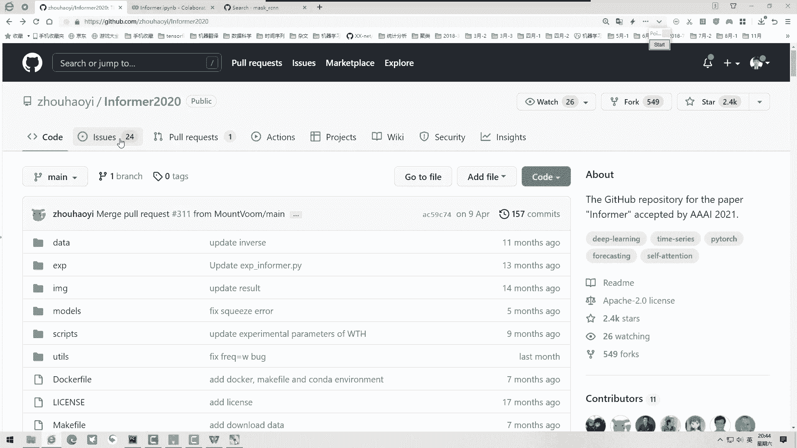

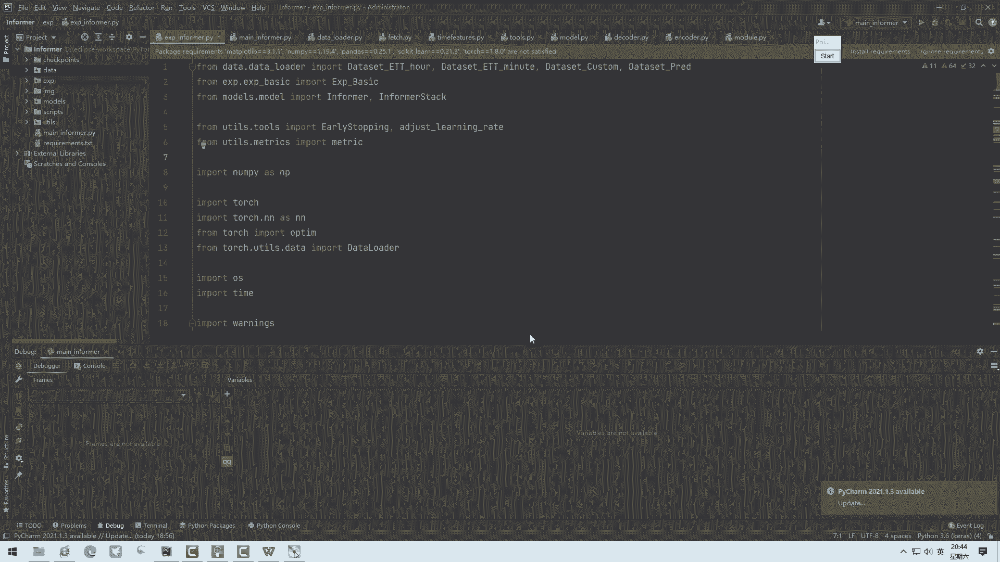

这本大家说了，就是大家记住这点。以后有问题啊，不光是这个百度和谷歌，你跑啥项目到啥项目SU当中去翻，你可以索引这个关键词，你也可以啊就是一般我是先就是如果说这个问题没有特别多的，我就去呃就一个去翻。

如果是200多太多了，我就是做一做一个索引，你查一些报错的关键词等等。这样咱也可能会找到一些答案的。好了，这个大家说了一下，就是希望大家多关注的东西叫us。

然后接下来大家能看到哎呀这个原码当中有很多东西，那我们该怎么去学呢？来点这里。😊，今天我不跟大家去讲任何的工具，你也不用去提前学一些get方面知识。我觉得你学那些东西啊，前期来说呃。

尤其是还不熟的同学前期对你来说负担太大了。咱们就是往往咱们就用最简单最朴素的一件事儿，我们就点这个code，咱不用去执行get什么什么操作啊，我怕很多同学都搞不定，你们就干什么呢？

咱们点这个code直接当load了一下这个Zip，你点这个东西，它就自动的去做这个下载，你看下载了，下载完之后，这就是说咱们把这个源码下载下来了，下载完之后，你解压到你任何的路径都行。解压完之后。

咱就拿这个拍唱给它打开就行了啊。好，这下载完了，嗯，其实我也解压完了，咱们打开。😊。

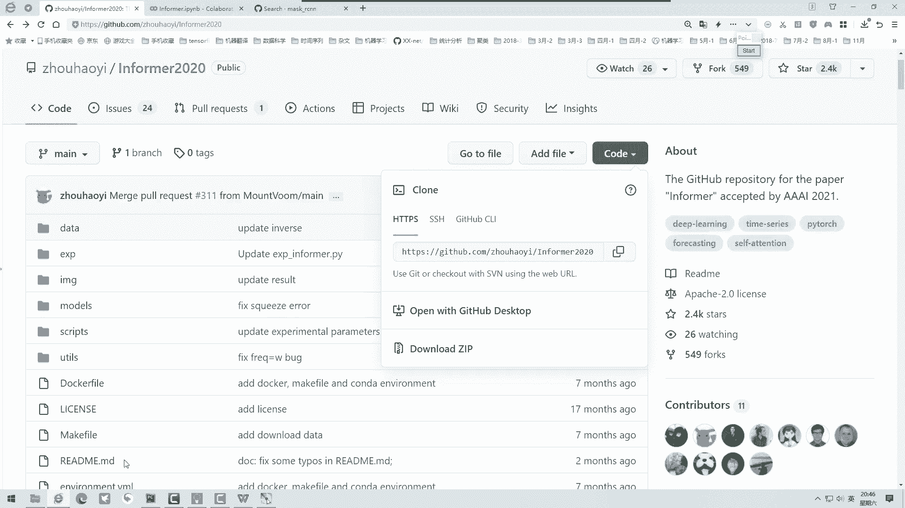

这是我打开的，打开这个任务当中啊，大家关注一下，就是我们这个左上角当中啊，你看这不就是我们的informer嘛。咱现在已经给它打开了。打开完之后它有很多个文件。

其实东西挺多的那我们该怎么像有一个切入点呢？其实切入点就是这样要这样一件事儿，我下看项目里边拉马需要约东西，我我都不知道这边怎么运行的那怎么办呢？来接着跟大家说怎么办？这件事儿，咱们干啥呢？

打开这个文档，文档当中啊，它基本上会告诉你两件事儿。第一件事就是怎么去训练。第二件事就是怎么去做一个测试。你看这里。😊。

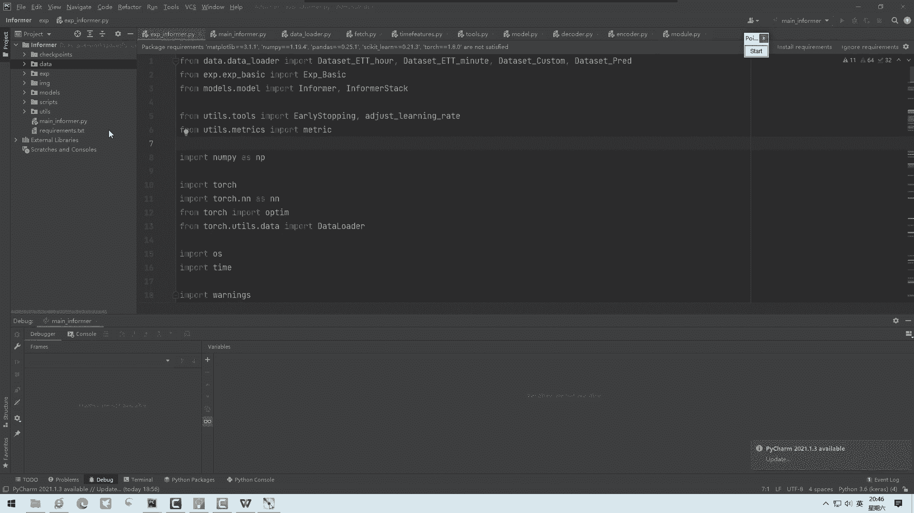

它这个UC当中是不是告诉你了，哎，我们去干什么去做一个训练和一个测试。咱们该用什么样的方法去做。其实你看到这里它是执行这个命令啊，它是命令上执行的，咱们这ID也一样。

它执行这个min inform点PY文件，然后指定一个一些参数，是不是？哎，我说咱们做的时候也这么去做呗。我把这个东西怎么样呢？啊？一般如果说你懒得来回切换了。我这里这样我就给它复制过来。😊。

然后找呗找什么找这个me inform在哪，我第一次下开下，我也不知道在哪啊，找呗你看我一找时候找到了这块不就有一个me inform这个东西吗。然后这里边啊可以说哎代码量挺多的。

然后你看我打这么多文件，大说的那我们该怎么去执行这个东西呢？首先第一件事来我们先看一看人件文当中要求我们输入的一个参数都是啥，你看我大家能猜出来model指定模型是啥，哎，到时候指定加载数据是啥。

然后这一块指定的一些attention算方式，因为时间序列的，你可能会处理一些时间的东西啊，这个frequency这个东西表示你该怎么去处理时间这些事好了，这些叫什么这些就是我们要用的些参数。

咱们怎么办呢？你看咱这家说一件事在这个当中，我们可以去编辑这个参数要就是两种方法。😊。

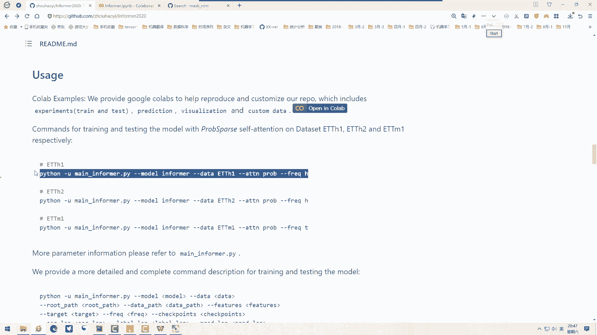

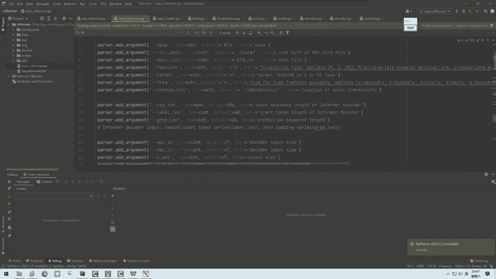

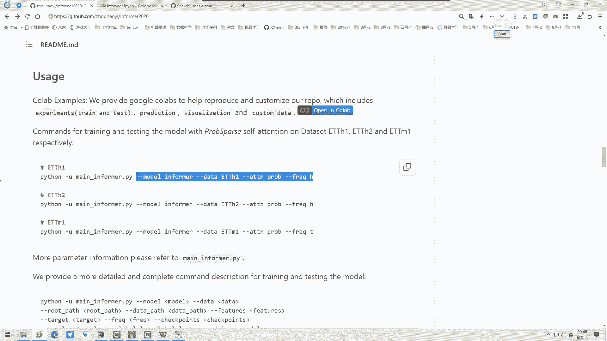

要么你去在这个model当中啊，就在这个参数当中，你加上这个deult值啊，就你看我deer值已经写好了，它有这个informer，然后这个data啊就是我选数据跟它是不太一样的，给大家换了一个。

因为也其实也是人家提供的，它提有好多种数据，然后这个是我们选数据，然后下面是咱们数据的路径，就是这里我要跟大家说的是咱们第二步，第二步干什么呢？根据人家这个说明，你去指定好这些权重参数都是啥。

把这个事咱们先搞定啊，这就跟大家说了，其实所有啊大家参考的东西都在这个readme文档当中，读这个文档咱就知道接下来该怎么去做了。那好，我们把这个参数配下参数之后接下来怎么办呢？😊。

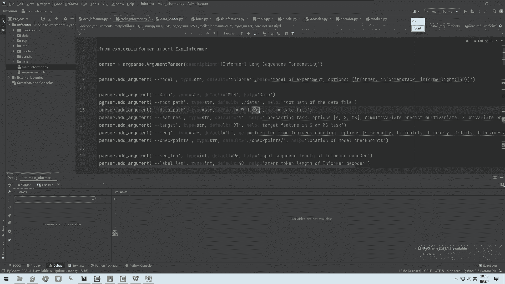

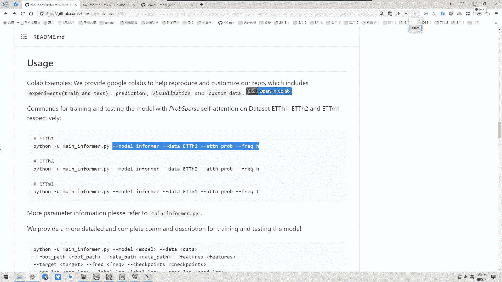

我们先执行啊，我这个已经配过了，他直接给你跑起来，然后跟大家说一下，就咱们先去跑这个东西，先确保你跑起来不报错的前提下，咱们一会儿再去研究这个源码。因为我会大家第一遍跑啊，比如这一块。

你们第一遍跑的时候，可能会遇到一堆一堆错误啊，就这一块可能开始训练了，又会打印出来很多东西啊。这我先不给大家去打印，咱一会具体去说它是啥意思？所以说要求大家啊就是第一件事，根据我们的readme文档。

把咱们的所有参数都配置好，然后我们先去跑这个模型，跑的过程当中可能会遇到各种各样的问题，遇到什么问题，咱们就现用现查边用边查都来得及啊。好，那接下来来下面我们就要进入到啊咱们这个源码当中吧。

我会给大家去梳理一下，咱们这个源码每一行什么意思？今天我会给大家说的比较细一些，包括我们的数据啊，就咱们就从开始吧，咱们就从这第一行开始。😊，一会儿咱一般情况下，我可能讲很多源码啊，不会这么细的。

但是咱们今天嗯咱今天有这个时间，咱今天也拿着看项目，现在能跟大家说这个事儿，所以说我一行一行大家去捋一遍，后续大家自己的项目，你可能就是前面不是特别重要的东西，你就可以省略掉。

你重点 debug两个地方，一会儿我用到给大家去说，其实很多项目主要我主要学两个地方。第一个就是你的数据是啥，数据怎么处理的。第二个，你的模型怎么搭建的，其实主要处理这两个地方基本上就足够了。

我们学源码，其他的一些函数可能一般情况下我不会都去看的。但是咱们今天一会我们做的全一点，咱把每一个都给大家去看一下啊。好了，接下来我们要说源码这个事儿了。😊，然后呃然后跟大家说一下，就是咱们这个任务。

就是咱们今天带你们别去下这个ge了，你们搞这个ge，我怕你们浪费太多时间，直接下载一个压缩包就完事了啊。这个配置其实很简单，就是之前我们排当中怎么去配置的，咱们建理怎么配置什么是命令行执行。

你把这些呃把我们这些项目，你放到那什么放到你的服务器当中，你的服务器，你直接SSH过去，你直接通过命令行就执行了。咱们今天是演示这个bu过程，所以说我们没有命令行执行那个过程啊？呃，可以的可以的。

就是不让大家多太多负担了。就是你们愿意用get自己去用自己假一这个东西就行了。咱们今天用最简单方法，保证每个同学都下载下来，直接去 downloadload的一个z自己解压就完事了啊。

因为我们大部分报中同学可能都是跨专业的。咱们学计算机的，学本专业同学极少极少，大部分同学还是零基础偏多一些的。行接下来来我就咱们今天不是普遍数卷啊，用给大家去说。😊，行。

接下来我们开始完成我们这个debu操作。在完成之前，我们先看一看咱们的数据是啥。来这里边打开我们任务，也是建议大家啊就是跑之前啊，就别说你这个跑完代码，很多同学之前给我我觉得最大的问题，就这个代码啊。

照着视频能跑出来，跑试啥都不知道数据在哪都不知道他问我一堆问题，我说你这个标签你检查了吗？陶顿跟我说老师什么是标签，标签在哪儿，我都不知道。其实我觉得大家这样啊，就是说咱们在学的过程当中。

一方面是带着问题去学习。另一方面，我建议大家既然咱们要落到源码这个级别了。你要怎么去做呢？就是首先起码得知道数据是啥，数据咋处理的。😊。

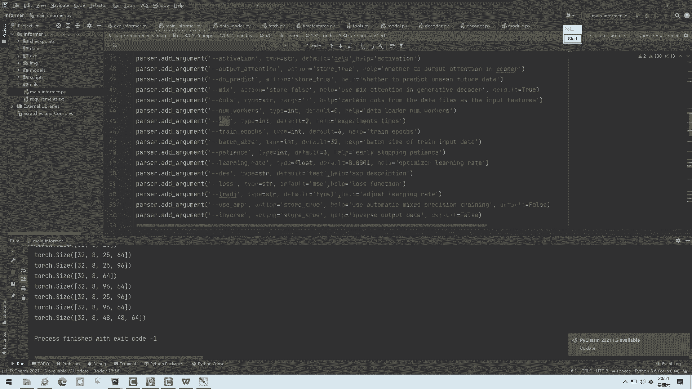

是不是啊数据处理完之后，咋扔这个模型里的，模型长啥样子，模型是怎么训练的？训练完之后咱得到啥了。比如说得到咱们这个呃保存那个我那个模型这个文件，最后再怎么去用的。建议大家就这样一个环路吧。

都要从头到尾去理解一下啊，不要说照着视频跑起来转起来就完事了， run起来都西没啥难度啊。你要把每个细节咱都掌握起来。来先看一看我们的数据呃，到时候我给大家传这个网盘啊，就是网盘里边。

我把这个数据都做好了，其实也不是我做的，就是我下载下来了而已。我们来看下这个数据。😊，它是1个CSV的数据。因为我们今天咱们做这个时间序列啊，其实并不是呃预测一个图片，也并不是预测的一个文本。

所以它是用1个CSVCSV文件来做处理的，这个无所谓，你后续啥文件格式其实无所谓的。你是TIT的格式，你是啊各种各样格式其实都无所谓，啥都可以的。我们先点来看一看。😊，来，这就是咱们今天拿手的数据啊。

做这个时间序列什么最重要，你要做这个时间序列啊，你是不是高低得有一个时间啊，不是说啥任务都是适合我们今天日今天这个这个事儿的。咱们今天这个事儿要明确的一个时间，也就是样本和样本之间。

它并不是一个独立无关的。比如说表示今天的一个天气啊，或者说哎你要预测未来的一个趋势，未来走向等等。根据这个时间来去做的。我们来可观察一下第一点。😊，第当中我们这个date dateate表什么意思啊？

时间是不是一个样本它有固定的一个时间？咱们今天这个任务选的时间间隔是你就当做吧，嗯你可以把它当做是我们的一些仪器，或者是我们的工厂流水线，每隔一个小时，他得做一些采样，或者说我们的一些什么设备。

每隔1小时他去记录一些指标。好了，这是第一件事来我们的数据当中，它是以小时为单位的，它是挺长时间之前是2010年1月1日，然后0。1。2。3。4点啊，就是这么时间序列。然后2号然后3号啊。

反正一天做24个采样点，每个采样点间隔是一个小时，这是我们数据，然后后面这些东西啊，其实无所谓。😊，后期反正大家用自己的数据解，这个东西是啥？其实我他那个数据文档我我都懒得去看的。

因为我我不太想学太多的就是跨专业的知识。这是他们说什么疯电的说什么有好多领域东西，其实我不太理解他们具体指标含义。因为实际长久我没去过，不知道他实际上是啥，你就当啥从这到这你就都当做是我们的特征啊。

你就当做每一个时间点它是有多个特征的，你看这都是每个时间点当中有这么多特征。最后这一个我忘了是不是最后这一个了啊，应该是最后这一个它就是我们的Y，这是X，这是我Y好了，这大家看下数据啊。

就是咱们今天你不用管这个数据是什么以后你就套自己的数据，但是大家要知道我们的数据格式里边定有什么有时间这东西它这个S长这你的数据其他样无所谓。一会给大家去看它怎么做处理的。咱大家自己玩的时候。

只要能把数据处理好就行的啊。其实啥格式是无所谓的好了，这就是我们的一个时间。😊，序列数据。然后他这个任务当中啊，不仅提供这一个。还有一个这一块还挺供数据呃，我我我都记不太清了。

他这个数据到底到底是哪个行业的，都都写了一些缩写啊，写些名字。你看这一块这一块我感觉更像什么？大家看一看像不像是你工厂流水线当中有很多有很多那个什么传感器，有很多零件，在每一时刻当中。

你看每一个当中这你就当做吧每一个当中这些传感器啊，它的一些指标值等等。然后最后我们可能要预测比如说预测的一些什么值吧啊，反正就是啊它的一个实验学数据。好了。

这我们数据啊给大家看了一下它是1个CSP格式CSCP数据啊，一会咱们用pandas去做处理是比较合适的。😊。

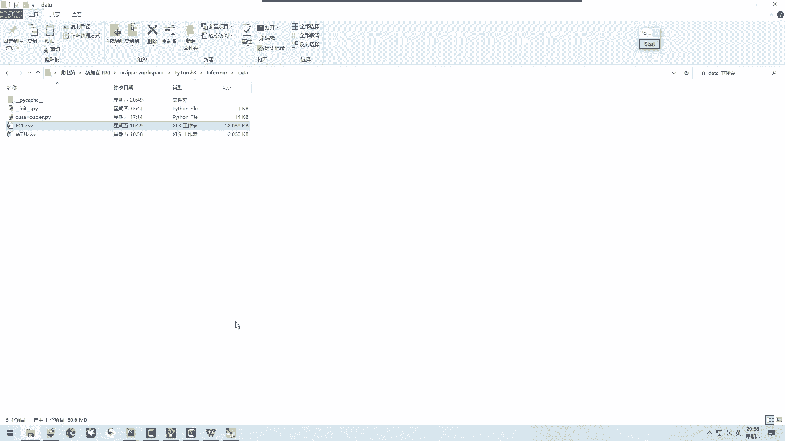

行，接下怎么办呢？来跟大家说这样一件事，拿到这个解码之后啊，就这里边有啥，咱都不关心。就你看这一块它有个data，然后什么E叉P，然后什么这个呃mods，有这个crs，有这个这个东西，就这件事。

这里边有啥咱都不用去管，不用去看，后续用到啥了，咱现用现看，然后我第一件事大家来看这是呃这是咱们的入口入口吧，这是我们这个form这个函数，我是不是在这个第一行代码这就给大家打上一个断点了。

所以说接下来咱就从这行开始，我们就一个一个一行一行，咱往下去看啊，一行一行我们去理解这个事。然后接下来就是大家到时候选错所需要做的一件事，咱我们的入口当中第一个位置你就打上断点，我们一点点去捋用到啥。

咱就讲啥，怎么办？😊，来点我们的debug操作，接下来就会进入到啊我们这个debug当中，我们就一行去捋。哎，他怎么给我调到这儿了？这一块我什么时候打到断点，我重来一下啊。哎，刚觉好奇怪。

他怎么在一个很奇怪的地方，哎，在这儿，是不是这回对了啊，刚才不知道点哪去了啊，来看这一块。这第一步解析我们这个命料参数，我给大家先来说一说吧，嗯，给大家咱们需要用什么说什么吧。命料参数是啥。哎呦。

这个东西我就说完都底都得十0分钟了，咱们今天说的细一点吧，我就从头给大家去解释。首先第一件事，我们来看一看这个面量参数都是我们自己去指定的。第一个modelmodel表示说哎你要用什么网络结构。

其实这篇论文当中，它肯定会做一些对比实验，是不是对比实验当中它肯定网络结构不仅仅是做了一个，它也是多多个，通过这样的选择，我给大家来看啊，就是它这个model当中它定义了很多类。😊。

你看有这个informer，还有一些其他的啊，还有这个form，就是它有不同的一些类，相当于不同的网络结构。这块呢让我们自己去选。哎，我们用的网络结是啥？咱们今天讲这inform我们不知它的变形体。

第二个我们的data就是你要读的数据，它是什么啊，你要读哪个类型的一个数据。这是数据的一个类型啊，反正它就是个SV文件。然后这个root pass咱们这个数据啊，它所在的一个路径在哪的啊。

属于所在的一个路径好了，然后这一块就是我们这个数据，它的一个名字，其实我们这个数据拼到一起就是点data文件当中有个WWTH点CSV文件，然后下面这个features。😊，feature这个M啊。

它是这样一件事儿，就是我先给大家解释啊，就后续咱们会用到这些东西的，后用到就看到了这个feter是这样这个M表它表示意思啊，这边他说了，你看它有注释这个M它意思是这样，就是呃我们是一个序列。

就是输入的是多个你就当做我们这个输入的，它是多个特征吧。然后预测多个值啊，你可以输入的是单面量，预测多个值，你也可以预测输入是多个值，然后预测一个单面量，这个都行啊，这个是我们预测的一些种类的方法。

然后这个tart。😊，这个他给他他是这样一件事。我我我记着我记得这个东西应该选的是你数据当中就把哪一列当做是你的一个标签吧，他给应该是个标签的一个意思啊，这是指对我们标签，然后这个这个东西。

他这块是这样的，嗯就是说你这个数据啊，因为一会我们有时间有时间的东西，如果说之前有些做数据挖掘的同学，你们可能会属于一个东西叫时间重采样，是不是重采样啥意思呢？我们现在该给大家看数据是以小时为单位的。

那我们能不能对数据这些处理呢？我说以呃4个小时为单位，我说哎那我给大家举个例子吧，其实这块能玩的东西特别多，呃，这涉及到数据挖掘了，我估计可能很多同学之前咱都不属于这个事，我给大家简单来说一说。😊。

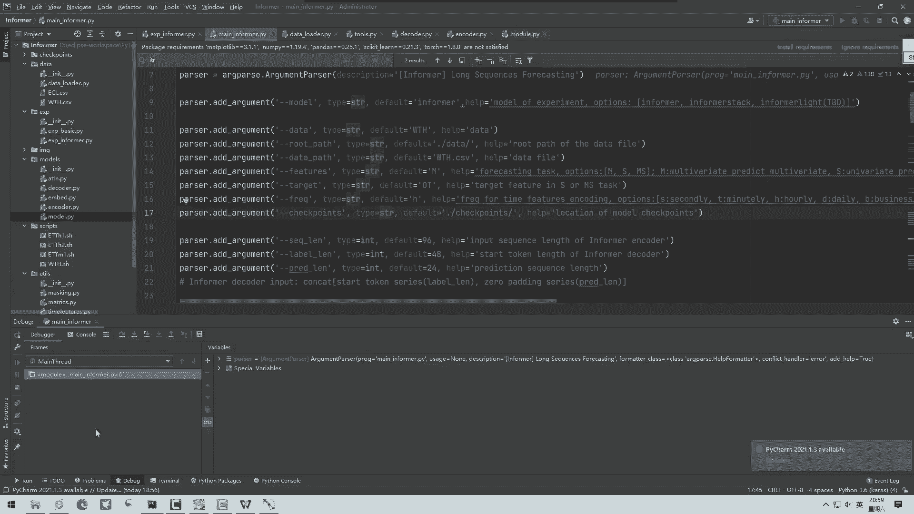

比如这样，你看这一块，我们是以小时为单位，是不是我说把这个数据做一个整合，我觉得小时为单位变化太慢了，整合成以4个小时为单位。我说这四条数据能不能合并成一条呢？可以的。

这四条数据可以这就是重采样对四条数据可以合并成一条，那怎么合并每个位置我说求它的一个均值行不行？第一个变量四个值求均值，第二变量四个值求均值行不行？求均值也行，求最大求最小，求什么周位数是不是都行啊？

这是一些重采样的操作啊，这个就是咱代码当中嘛，一会大家也看到我们默认是以小时为单位，因为原数据它就是以小时为单位的后续你的时间序列，你想怎么变了换上去玩啊。

这你自己去定咱们这块就是以小时为单位的这个后模型它要保存的一个位置。😊。

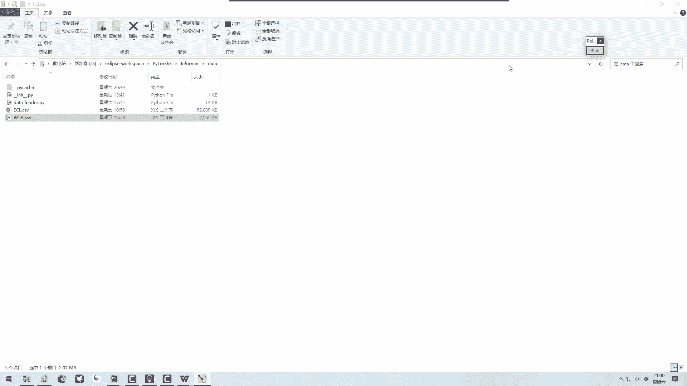

secequd lungs是这样的，就是我们现在做这个时间序列啊，它这块其实只是96，就这样的，我给大家去话啊，我们输入这个序列啊，它是输入的是1个96。

因为我们要知道它之前的一段情况好去预测它未来的一未它去它预测它未来的一个情况。所以说这个96表示就是说哎我们当前输入的一个序列长度。大家注意这个96是输入序列长度，其实这个96啊不是固定的。

是你自己任务自己定。你的任务48啊是24啥都无所谓啊，但是一般你别太长太长情况下学起来可能难度会比较大一些啊。这个是我们sequd。😊，这块还有一个label呃。

这个label它解释起来有点有点有点抽象，就是大家看没看我们之前讲这个原理，讲原理时候，咱们是不说一句话，它是这样的，就是我们再去做预测的时候，需要带一带，因为我们是个coder和抵扣的结构。

我们再去做预测的时候，需要一部分是有现验知识的。这一部分是48个值是有限知识的。然后接下来要预测什么，要预测未来的一个序列长度是24的，也相当于我蓝色画这个东西，这个24个是接下来我要做预测的。

这三个值不是固定的，你自己任务当中自己根据任务来去决定，这就可以了啊。好，这我这个参数在这来说，我就咱既然细点吧，我就一个给大家说吧。😊，然后这个 in它表示就是说呃input size它是这个意思啊。

其实这个数是根据你数据相关的。你的数据当中啊，比如说你选了7列啊，那你的Ecoder它数就是7列啊，这deder其实也也是如此编码器和解码器都要输入我们的数据一开始所以说这是咱数据的一个维度。

然后这个它就是说我们输出的呃，这个我记着这个我好像参数好像是没有用到呢。我怎么记着这个就是说你最后也要预测未来多少个值，咱们任务当中我记着好像就是预测未来12值嗯，这块是7一会我们看一看吧。

大家先记住这个值C等于7一会我们看一看，好像是我我给它写死了，我我记得这个咱们这个数据预测是1个12值啊。然后这个mod。😊，model512大家会一会看到512是我们隐藏的一个特征。

这是我们隐藏的特征transformer隐藏特征说了当中你要m啊多层注意机制当中咱们之前说过就是我做这个form我们是m attention再来m attention再来一m attention你要做几遍或是两遍啊就是两个m attention这是coder然der啊。

它也这么去做的。然后这一块就是说啊你这个co当中啊，这它可能有几个m attention。后这个它的意思就是说呃你那要堆叠多少个当中它我记着这是三个这三个就是大家后看我执行的时候你看有复循环复文当中会用到这个参数。

它就相当于叠代就执行3次这三个当中每一次要走这么一次就是么说吧，这是个。😊，这三个都是每一个都会走两遍这个Ecoder layer啊，就这种感觉。

然后这个factor这个factorctor是后续咱们会用到的，就相当于我们这里边不是要对那个Q做一个采样吗？这是采样的一个因子数啊，这个数大家后续也可以根据自己任务去改。

这是padding拿里做我们的一个padding。然后这个是我们做那个。😊，就是这个这样一件事儿，就讲讲原理时候给大家去说过，哎，这参数太多了。我说参数说半天了。这个原理是咱们说是不是啊哎。

比如一开始我们输入序列是1个96的，然后咱们怎么加速在这，我是接下来我们做完每正常这个transformer正常输出transformer是不是96完之后还是96就序列长度这块咱们序列长减半了。

是不是相当于做了一个铺ing这个操作变成48个了吧。这个操作就是说你要不要做这个减半的一个操作。然后就不用说了啊，一般都是需要去加的。然后这个tenion。😊，我们注意力机制计算的一个方法。

这是人这篇论文当中提出来的核心的东西，咱肯定要用的啊，所以说 default是有的。咱们一会儿attention这个方式挺特别的。然后这个Ebedding我们时间序列怎么做Ebedding啊。

一会儿给大家去说咱们实间这个东西，然后这个结活函数，然后这个呃输出的时候，我们要不要输出attention这个东西，然后要不要去做这个预测啊，就这一块好多好多参数。

就是到时候大家都可以一遍一遍去过一下啊，挺多的。然后这一块。😊，makeix attention这个咱咱没有去做这些论文当中也没有去出也没有咋提出的作用。这咱没有的。然后这一块就是我们要执行啊。

这些其实就是咱们读数据的时候，要读哪些个数据。然后number work当中这个大家注意啊，windows你默认是理，你windows你就不要指用其他了linux当中你可以随便指定。

因为windows你不指用理有可能去报错，咱们这个迭代次数，这个ATR它不是迭代次数。😊，它是训练的轮数，它是训练，就怎么说啊？比如说你训练20个epoke。

它会把训练20个epoke完之后之后再来一遍20个 epo。所以说你的 epo是为二的情况下，它这块再乘个2就相于40个epoke，就这种感觉啊，这是 epoke，这是 size。

这是我们那个 earlyly stopping，就是连着多少次，你那个没有没有做一些更新，然后它可能提前停止的一个策略。然后学习率啊学习率咱稍微小一点，一般情况下学习率都会稍微小一点才是比较合适的。

然后这个就是。😊，啊，这个这这个没啥用，这是损失函数默认的M不用说了，要预测一个具体值损失函数。我看其他的just这些学历衰减东西MP这东西咱暂时没用这个适合你分布式win很多都出错这也不用用转我们输出的结果。

这个建议大家去用认用这个东西默认是理就是你只有单机单卡是个理这个我没有指定为我这机器有分布式的东西分布式你指定3就完了。这大家看了一下，就咱们这些参数，后大家自开下吗？

能你们不一定都能看懂这些参数都是啥。所以说第一件事你不用都看懂，你就知道知道大概有啥，等你把这个原码bu遍你再回看这个东西就来说比较容易了。

因为今天我给大家去讲以说大家尾去导一遍都是啥大家务就是先不用去改你跑起来先bug。😊，用到啥我们看啥就行好。好了，现在大家说了一下，咱这个参数说了半天。😊，拍一定时间我们要做那个啊对。

就是蒸馏这类似蒸馏这个意思。咱们今天啊我这语速也比较快，因为东西太多了啊，它就是宣两次。正常情况下我我也觉得挺特别的。它是一次就是他他是要做，我给大家解释一下吧。

他这个论文他是要做对比对比实验的啥对比实验220个po它的结果多少？40个po结果多少，它要作为对比实验的，所以说它指定了这样一些参数CPU是跑可以的。这个这个当时意思就是就是你不用指定参数值。

你把这个参数写上去指定就为处就它要加这个东西。呃，不要着急啊，大家先别着急，就我这语速已经够快了，你那边再跑你就跟不上了啊。哪个哪个我给大家说一下这个是不是？这个意思就这样。

就是说呃你看正常我们要不要加这个东西，正常的de值有什么处e啊，还有什么foalse，是不是？然后这一块它就不用，就是在我们任务当中，你只要把这个参数指定了，就这里边回答，我给你演示一下。

你只要把这个参数在这里指定了，它就是为 true的，我只要加进去，我不用写参数值，只要指定它就为 truee，你不指定它就为foalse，它就是这个意思啊。😊，然后这就是加到我们这个参数解析当中啊。

从命令行当中解析到我们这个参数，从命令行当中把我们这个参数给它读出来啊，是这样一件事儿。我们只讲informmer这一个模型，其他模型咱就先咱今天讲不完的。呃。

我给大家发那个CSV我给大家发那个CSV嗯你就是大家你别着急，你们先别着急就下这个东西啊，先听我把这个故事说完来咱继续。😊，然后接下来来看我们执行一下，刚才给大家说了。

这些参数都是相当于加载我命令的参数，啥叫命令参数。就这里边你通过命令号写这些东西全部会在源码当中读进来的。咱现在用为排插不，你就这里边要么是这块指定默认值，要么就是这里边你自己加进去这些参数。

然后我们看看解析到底东西我是啥，你看我执行一下，是不是解析这些参数，你看我执行。😊。

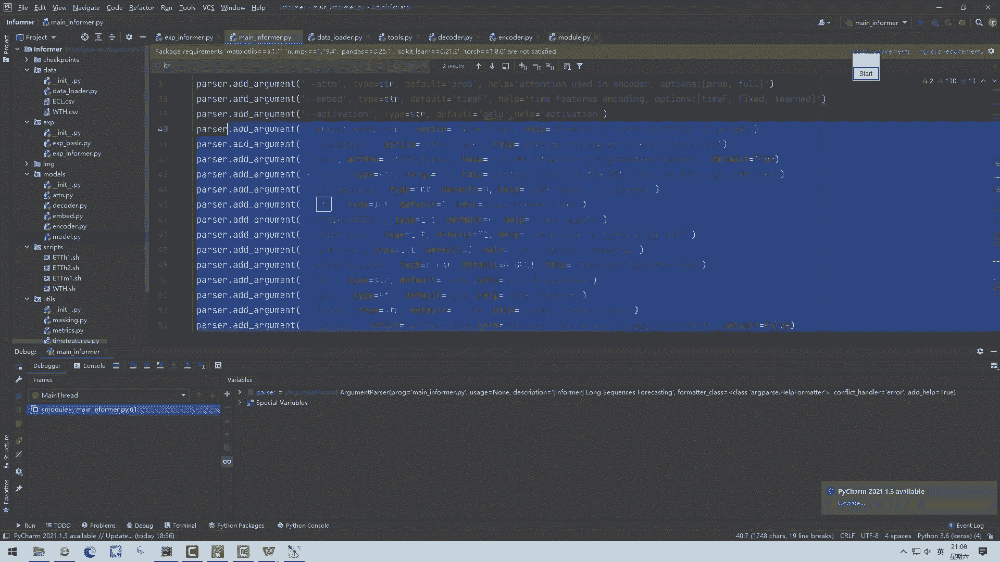

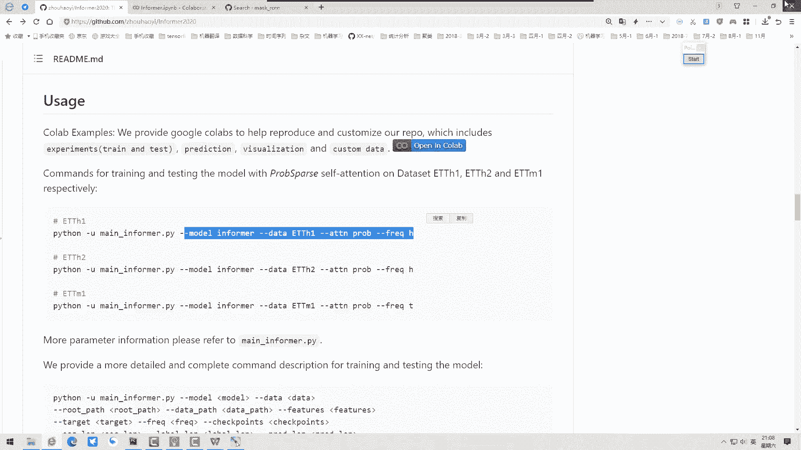

完之后，我把手往这一点来，大家看点完之后，是不是说哎这就是我们所有已经选中的默认参数。一会儿呢我们通过这些参数来去干什么去取这些值。哎比如说我建模的时候，我要取到取到这个得多少。

这是不是就是刚刚我们指定参数啊。好了，咱把这些参数全部拿到手了，都解析出来了。然后接下来这一块UGPU我是个处，就是拿GPU去跑，我估计CPU也行，我这块是一个单卡。

所以说我没有下一步这个没有下边这一步操作，这块它是个多卡操作，我会直接跳过去的。因为我们没有多卡再下一步它这一块。😊，他对这个数据啊先定义个字典，他定义这个字典，这样我先给大家执行完啊。

然后接下来大家看他定义这个字典啊，就是说哎他是提供了很多样例数据。他的意思就是说不同的样例数据啊，我们指定的标签是哪一列？😊，你看这个是指定的标签，它的一个列是哪一列，指定是哪个文件啊。

指定它这个啊比如这一块，你看这个这这些就表示说我们最后输出的一个要预测的值是12个，就相当于输入这个序列，它是输入96个，要预测未来12个，这就是说他在这个字眼当中啊。

把这字典里边预测啥都给大家去列出来了。到时候大家你们自己玩的时候，自己数据咋办？有自己数据啊，你就是面向复制粘贴编程呗，啥意思啊？来这一块，我说我自己的数据名字。😊，我就随便写一个呗，就比如说这一块。

我就叫做一个data。然后我这个数据哎呀，我是什么什么点CSB你自己写。然后这个然后接下来我看看啊，什么什么点CSB啊，然后这个你这个呃这个题这个这个参数表，就是说你你把哪一列当做标签。

你把哪列帮个标签，然后比如接下来我要预测未来的呃64个点吧，你就通通都改成64就完事了。就是说照葫芦画瓢，人家这个东西咋做的，咱就是改自己数据的时候怎么去玩就可以了。好了，这个大家简单看一下。

一会儿我们用到时候，咱们还会具体去说啊，用这个字点去解析我们的数据。然后下一步。😊，下一步啊下一步就是说他把这些参数取出来，你看这一块他把这些参数都取出来，就相当于上面写那个东西，它现在都取出来。

你看这里边我这个量infer，就上面这个数据它都取出来了。然后它的一个路径，然后它的一个标签2，然后以colder in啊，你看它是12个，说明咱们这个数据，我给大家看一下吧，它确实是12个啊。

就这是我们读一数据来数12122345678910。😊。

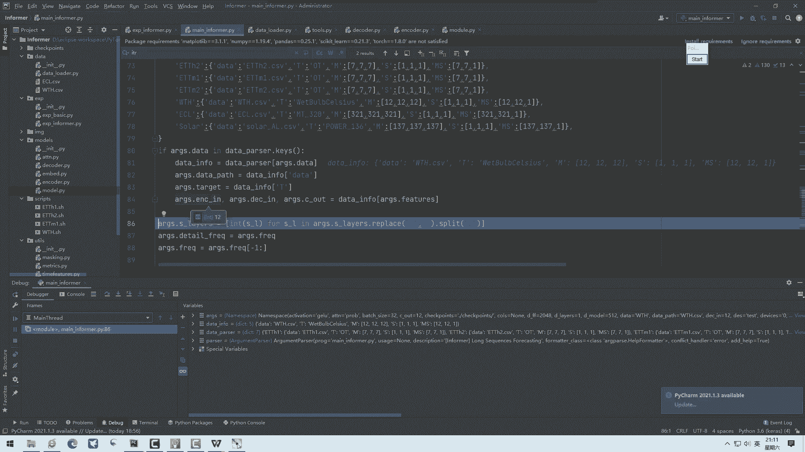

11啊，但我啊加这个12，其实我该才说1。2，那所以说加减13个，是不是13个当中我去掉一个标签是多少个，是12个是吧？所以说这个就是我们这个数据啊。好了，这个大家去看了一下，把这个关掉。😊。

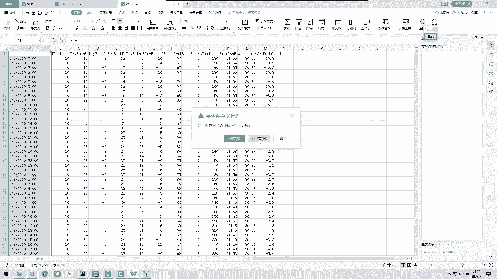

行，这块大家看了一下啊，就是咱们这块数据啊，它会指定参数，到时候咱自己熟悉完之后，你自己改成你自己就行。然后这个S layer当中也去读这个也是通过啊它这个呃该才咱们指定这个命量参数指定好了。

它是321，是不是它会循环有这么3次。然后这一些就是frequency这个东西是个H，就是说咱们是以小时为间隔去做这件事儿的。好，你看这一块它都是以小时为间隔的。然后下面呢它做了一个打印。

你看我们打印出来结果。😊，这块就是把咱们所有参数打印完了，然后再咱再往下去跳啊，指定这个类。这个类是咱一会用到的。我给大家看啊，就是比如说你冷不丁啊，看到代码当中，你有个有个东西，你都不知道是啥。

就我我当时看我说这东西它起名这么奇怪呢，那怎么办呢？摁住r咱点一下子是不是知道了它在哪进行定义的。你看在哪在这个E叉 inform点Y我说我不知道这个东西在哪，我主要这一点，它是不是告诉我这个路径了。

你看这里在 informform叉PE叉 inform点PY当中定义了这样一个类。所以说啊就是一会儿咱们会用这个类帮我们去取数据的，下面定义好了，很多咱们该取数据的一个东西。

所以说这里边它先啊把这个类写一个简名叫做P然后接下来我会通过通过它来帮我们读数据，你啥东西不知道在哪的，你用点去看在哪定义的啊。😊，来接下来接下来咱这样啊，这个这个循环这样的，我跟大家说了。

它这一块是个二，就是说我们会编辑两次，编译两次，相当于你看寸一遍，太测一遍，再寸一遍，再te测一遍。因为论文嘛要做一些对比实验啊。好了，然后接下这个sing。😊，我们直接来看它的结果。

这个sing其实说白了啊，其实我觉得这它是一个字符串，这个字符串也没啥用吧。可能一会儿对于保存什么名字来决定的。它就是把你所有那啥，就是把你指定的所有参数都写好了，我估计是一会往日志当中去写的。

或者说生成一个拆判的，生成一个保存的保存的一个文件的一个名字，让你知道你这个名字是对应的哪些的配置文件啊，就是这一块它自己起了个名字啊，写的挺长的，就把咱们刚才指定所有参数都拼一块了啊。好，来接下来。

😊，啊，接下来这一块，我们再跳进去跳啊，这这块儿没有这块它啥都没有这一块来再往下再往下，这一步核心啊，就是我们的一个寸操作。寸操作啊，按住cttrorl，咱点进去来看一看它做了啥。这一块我们打着断点了。

来，咱们跳入到这个断点当中。第一步干什么？😊，其实接下来在我们任务当中啊，我们就要去读数据啊，是不是刚才只是看了一些配置文件，没啥难度。下面呢我们要读数据。读数据当中啊这一块你看一般我是我是习惯这样啊。

就是呃我不习惯是摁住这个跳进去，因为有些它跳不进去，我一般先入crl看一下你这个ge data是在哪定义的。好，该哪定义是不是好，那我打上断点。那接下来我们就跳入到这个端点当中呗。

看一看它是怎么样去读我们这个数据的。首先呢把我们刚才就是定义好这参数拿进来。因为这个参数当中有我要用的信息，比如说有我要读数据的一个路径等等，以及我们把哪一列当中标签。

是不是都是在命令和参数当中指定好的呀。😊，好，这是把这些参数都读进来。然后接下来呃接下这一块来我先执行完。接下这一块当中啊，它是构建了一个字典。这个字典是这样的，我给大家举个例子啊，它是写了好几个。😊。

可能大家你们第一次看的时候啊，都有点懵，后续咱们就听我说完之后，你一定要再自己抵bu一遍，就啥事儿啊，你不自己做一遍，你永远不知道咋做的，一定要自己搞一遍啊。它这样它有很多类。

你看这些就是大家可能说这是个字体啊，这是数据就不同的CSB数据啊，不同数据它可能对应一些不同数据数理格式，是不是就是这样的，有的是针对小时的，有针对非中的。

咱们今天说这个我们说一个通用的叫data set customer这个东西，大家注意这个词。😊，这个cusomer这个东西啊，你在很多开项目当中啊都会遇到这个东西，它啥意思啊？就是一个你就当自定义吧。

就是我们自己的数据集，我们可以自定义，到时候大家也要改这个东西。那我们来看一下我们建天这个数据，我们数据是啥来着说你都不知道你数据是啥你点开看一看是不是咱配当中是不告诉你这个么我不知道个缩表啥意思。

反正我这W这个文件如我来看一看摁住我点进去这一块是不是它定一个类，然后继成记成个to说明这是人家自己定义的一个数据集的方法一会我们用人家的方法帮我们去取数据的，我们取数据的就走在我任当中们这data。

😊，指定好这个类了啊，叫什么date set customer，一会我们就进入到这个类当中。😊，然后这个这个没啥重要的啊，这就是说我们一会儿给大家看怎么去呃对时间序列，对那个时间内点做处理的。

它是有两种方法，一个是零的方法，一个一的方法。一会儿看到咱们就咱们就会说了啊。然后下一步它是呃这个fllock，它是这样一件事儿，就是我们单是个训练操作。所以说它没有走这个tsest的。

也没有走这个预测。我们先说训练训练操作当中啊，它指定一些参数。😊，这要是整个参时给大家说一说，第一个serser就是训练时候要洗牌，这不用说了，jo plus job plus这个事就是呃怎么说。

就是大家买菜的时候，你买菜，你你比如人家菜卖个2。95块，你给他3块，你给咱啥意思，说你不用找零了啊，就这种感觉，不用找零的一个事儿，比如说你咱们现在一个数据一共有这么。😊，啊。

写多了个1百千万10万1001的1001个。然后呢咱们这样每一个bitch是1万个，每一bitch1万个，那10个bit呢1个bitch是不是10万个，那最后一个咋办？最后一个单独做一个ch吗？不是的。

最后一个给他丢掉最后一个就给丢掉了？咱们相当于就是是一个整数啊，就是如说最后的时候你那个组不成这个ch了给呃为处就给丢掉了啊。

这个咱们丢为什么丢掉时间序列兄时间序列不是说你便上别地方凑点不是说你这个大家可能说我丢一个没关系，我拿这一个，然后像前面其他地方凑一点，你其他任务行，因为是独立的。

咱这时间序列凑不时间序列你瞎凑那时间不乱了吗？不行，就这个一定是一个这呢一定是个值。😊，然后再往下这个b sizebe size就是你的P处理的一个数量，我这块32，大家自己选啊。

咱们今天这个模型你选大点，选小点，根据你自己的配置。然后接下来我们是以小时，这些是我们需要参数数。咱们供元数据集的，是以小时为单位去处理这个数据，一会儿大家会看到啊，我们是怎么去处理的。来再往下走。😊。

来看这一块要定义咱们的de set了。注意这个data，你要时刻知道这东西它是啥，你忘了怎么办？把手上这一点是不是哎d set customer当中再不行，按住ctrl啊。

点进去看一看它是啥是不是都可以啊。那哪去我来再往转下一跳。😊，在我跳过程当中给大家跳上去看一看吧。来再往下，你看跳据当中，这是我们指定的de set customer这个东西。

首先它上面自己做了一个定义，来，咱们一个往下走啊，自己做个定义来看这一块是我们做的定义。这个size来先给大家执行完这个size就是我们刚指定的一个参数，咱们指定参数96、4824。

大家能不能记住是啥了。😊，96来看这个吧，96表示我们输入序列的长度，输入的长度是96的，居于96长度去预测它未来的一个值未来去预测未来的一个趋势。

然后这个这个label length就是嗯这个东西挺绕的啊，这是我们的1个96的，然后呢这是咱们那个48的尾单写，这个48的，它叫做一个label。我之前说给大家说，一定先看原理，你不看原理。

你根本都不知道这48是啥的。然后接下来我们还有啥，还有一个预测的，这个预测是24个，就是大家注意这一块啊。😊，有一个点哪个点呢？咱们现在这个48，我就我就这么写48加24等于多少，等于72。

是不是大家记住这个数，一会儿我会重点跟大家去说72这个数它是干什么的。因为在我们的coder，我们的der当中是对这96个做编码，我们的我我写个der啊，我们的deder当中，咱们是对这72做编码。

为什么我们的deder不直接去预测这24个呢？deder不愿做预测嘛，为什么不直接预测24个，因为直接预测24个效果太烂了，这是这天论文核心的一个思想，在抵当中，我们需要一些有标签的来去带带他啊。

就像这样一件事，比如现在你直接的去预测24个，我说他可能他可能够做好，我说给他找个师兄带带他找48个人先给他铺垫铺垫。我说前面48个，我找给你做好了，你后面24个你自己去做啊，这样咱效果能更好一些。

这是论文核心思想，你忘了回去看看咱们之前讲原野视频，再回来说，咱们这再回来。😊，看咱们这个呃讲这个原版的啊。好，然后接下来。😊，还有我这速度的挺快，因为今天咱内容太多了啊。来接下来在任务当中，咱们现在。

😊，这个t值啊表示就是说咱们是呃我们现在这是个train，你看这一块是零零表，我们现在执行是个train操作。然后指定好咱们这些这些个这些就是刚才咱们指行参数，我给大家给大家执行完吧。

然后一个看一看个ature就是我们一会会选所有的列这个M示一会多变所有的列表示是这一列就大家就是就是CS当中这一列是我们标签这能理解吧。

这一列是我们一个标签后这个是我都忘了一一用到们具体说吧到直接看不这个东西后这verse表示输出要不要反转的顺序，咱默认不反转。然后这个time记着们实验序列处理两种方式种或个H。😊，列名列名没指定。

一会儿会读数据，读数据自然会把这个列名读起来。然后这个root到哪去读这个数据，然后这个d pass去读哪个CSB数据，然后接下来执行啥，执行这个 datata是不是啊断点打进去了。

来把上就跳跳到这个略略 data当中。首先第一步首先我们的stand。😊，这三点是数据标准化，啥意思啊？咱那个数据之前也没做过啥标准化处理，我们需要先对这个数据做一个标准化。所以说指定好。大家说了，哎。

这个标准化咋指定的，咋指定的N住ctrl自己去看一眼呗，N住ctrl我们来点进去看一看咱指定的。😊，来把主角这一放。

看在哪儿是不是informer就上面informer u toth当中是不是找哪一个来着？这一块呃informer，然后ut当中这个toth文件是不是这个文件啊。

这边当中我们是不是看到这有个叫standard的东操作呀？首先各个函数当中指定了我们初始化的一个均值和标准差，然后fitfi啥意思呢？去做一个计算，算拿我们就是读建数据之后才能走这个fet啊。

咱们现在还没读数据，一会我们会走这个feit的操作，算这个均值，算这个标准差。😊，transform执行去均值，执行比上标准差异操作，返回一个预除以结果是就行了。好了，这大家去看了一下啊。

就是指定sder，咱们先指令好像没用，这就跟大家说了啊，就是自己抵蜡烛也一样。你不用一开始先把左边这这这一堆一兜子从头尾看一遍，用到啥，看啥就完全来得及要。好了，这指令完了，接下来。😊。

读数据数据当中这样参数只有好，是不是panda4。6的C一不用说了吧，来读数据来看一下结果。😊，这就是咱们读建来数据。如果说debug里边哎，你就忘了数据是啥了，你点开来瞅一瞅。

看一看这数据边是啥行不行。第一列data，然后第二列啊，第三列第四列有我们很多值是吧？然后最后这一列就着这个值吧，它就是我们要预测的一个标签。好，这就是我们的一个数据都读建了。😊，独监数据咋办？

现在数据是整体啊，我们是不是要对数据做处理啊？下面吧咱们就来去处理这个数据啊，我们来看。首先呢我们来看这一块啊，这一块它是说拿到我这个列名。😊，pa那个操作啊，跟大家这么说吧啊，这个东西呢怎么说呢？嗯。

不用啥系统学，就是我给大家这么说，就现用现查，就这个东西啊，我也没咋学过啊，就是所有东西都是现用现查，我极其不建议大家，就是你学这个源码，还记这个笔记的，同学要跟我看，把咱们代码都打印出来。

然后去记这个笔记，我不建议大家这么去做，因为记账本上的东西是没啥用的，不建议大家这么去做啥东西啊，现在做发达了，啥查不着啊，不像1年前了，啥东西你查不着的，现在啥东西查不着，用到啥查查啥是完事了。

你不知道比如da frame，你不知道点这个属性啥意思。我给大家来看，比如说你现在就不知道这啥意思，怎么办。😊。

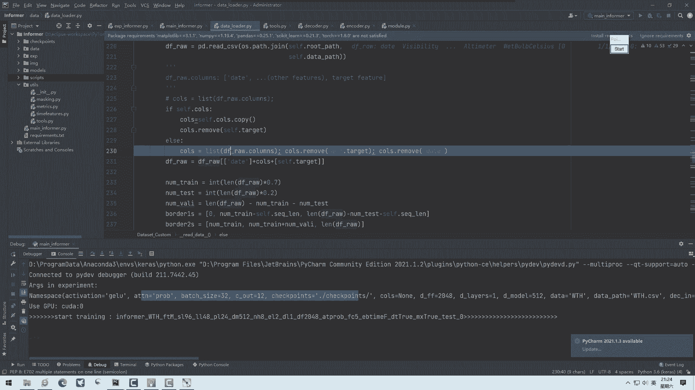

建议大家养成这个习惯，就是现用现查呗，查这个东西啊。比如说你说这个canndas，我一点这个东西，它是啥意思？哎，我说我去点开这百度一查这多快呀，人家举个例子，他说他构建了d frame大地的。然后呢。

他接来比如说呃来来看这一块，他打印了一下，打印什么，是不是这个列名就出来了。所以这个属性，就是打印地名的一件事吧？很简单啊，不用去记也不用去背，啥时候去背这个东西呢？😊。

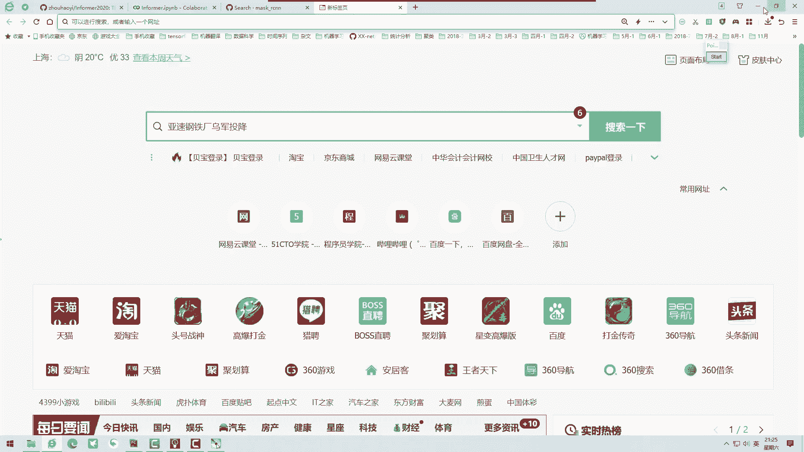

嗯，就是有时候我会背一些什背单词。我现在有一个问题，就是我单词总拼错。😊，脑子不太好使，单词容易单词容易评测，所以说现有现查吧啊，不会的东西咱去查是都可以的。来给大家说啥意思？第一步把列一名都拿到手。

第二步，在列一名当中把标签去掉，为什么要去要标签？因为标签不是我的特征，再把日期也确掉，因为日期也不是我的特征。好了，这是咱一会儿数据当中，哪些是作为我们的输入啊，哪些是作为我们特征的？

把特征地的名字显得搞不定出来。😊，然后接下来就是咱们d frame当中，我看这里啊啊这一块它是全部的，就是我们的这是啊这是咱们该去掉的，一个是target，我们那个标签的，一个是我们的特征的。

一个是我们日期的。这样合到一起之后，就是咱们整个数据节，它都是啥，这是咱们整个数据节，然后下面做了一个切分。😊，他是自己做这个切分的啊，就是没有事00分成两次SU文件，它是直接做切分的。

在清分当中大家看一看啊，整个数据量3万多吧，然后他选了0。7当训练机，选了0。2，当这啥当测试机，选了0。1，当我们的一个验证机啊，这是自己做了一个切分。接下来他指定了就是我们的一个呃这个包der。😊。

呃，这东西他啥意思？就这样指定我们那个。数据集的一个起始位置，大家看源码的时候，如果说你看不懂它啥意思，你就把它打印出来，或者说你执行完之后看到这结果。我们现在只想要看这个结果只有啥意思呢？

理然后这个2448啊，什么2759啥意思？来瞅一瞅，它的意思这样，就是说首先啊我们这个训练集这个位置表示是哎我们到时候取数据的时候，训练级我都能可以起始位置从哪去取什么叫起始位置从哪去取呢？

number你看这一块是有245544个来大家给大家我给大家话啊，这是咱们这24544个，然后这一块它为什么减去s呢？为什么减到1个96呢？它是这样就当我们再去取数据的时候啊，你说哎比如我给大家举例子。

😊，我能取最后一个点，最后的数据吗？不行，为啥？因为咱们接下来的输入是一个序列，你取最后一个点了，最后一个点它后面没东西了，它合不成这样1个96输入序列。所以怎么办呢？咱们最后一个在哪？

最后一个应该是最后一个位置，减掉这个96，当前这个点红色这个点，这个点才是我最后一个点。所以这一块大家注意啊，我们是一个序列，到时候要一次取出一个序列出来，你不能选到最后一个点，那咋办？在卷习当中。

我们减去序列的长度是不是就可以了？好了，这是我们带来这个值，然后下一个值。😊，下一个值我看看啊这个呃当中减去我的测试集，再减去我的一个s这个数没有没没有用到。我也这个数它暂时是没有用到的。

咱暂时先不用去管吧。因为它一会儿只是去取训练集，它只用到中间这个数了。最后这个数等咱看看吧，我记得是没有用到的，用到的时候咱就说吧。我想想应该是啥，应该就是说在我们去测试的时候啊。

测试集是从哪儿从我想想啊，啊，应该是我们的验证级，你看这块这所有数据减去测试的那不就是训练和验证的嘛，再减这个哦，我明白了，它这个东西应该就是就我应该这个东西，之前没注意这个东西应该就是验证级。😊。

从哪去取，是不是你看这DF这这个d frame这个东西全部的减去测试级的，减去测试级的不就是训练集和验证级的嘛？减去，然后减完之后形训练级和验证集之后再减这个那相当于就是我们因为我们是先取这个训练集的。

然后再去取我们测试验证级，再先取训练级，然后再取我们验证级的它又表示说你这个验证级最多能取到哪儿，因为它还是减去这个96，是不是这个表示你验证级最多能取到哪啊。这是第三个数好了，这是我们第一个保der。

😊，然后我们第二个包der第二包就是这样，他就是说哎你的数据集，它的样本的个数有多少个。这个我们训练节它是有这么多个。然后这一块就是说啊就是到哪截止吧，它表示一个就是终止的一个位置在数据当中。

比如这是你全部的一个数据集。然后这个2424544，它就是说哎这一块是你训练集的位置。然后这个这个数就是28502，我写啊，这是28052，这就是你验证级的一个终止的位置。

然后最后就是你测试结终止位置啊，就是大概这样一件事。好了，这是我们定义好咱的一个呃咱的两个包der。然后接下来呢。😊，接下来咱们去取啊，就是这啊我知道我知道他啥意思了。

这块大家来看啊这个set果如果大家忘了啊，就是我自己看代码也如此。你看我给大家讲的时候，我总说有些东西咱们就看到用啥我给大家说个大家找一如果你直忘了你点一下点一下是不是有啊啥意思是不啥来着他说训练集是验证集是一然后测试集是2是不是它是这么去解释对吧？

后我们来去看那这里边件零啥意思当中理是不这个位置当中是不是这个位置通过这两个位置去指定好我们训练集起始位置和终止位置是不是就这样一件事啊。

那后续你的你的什么验证集测试集是一取它一这个位置取它这个二这个位置啊，就这样一件事好了，然后接下来去构建我们这个特征。😊，一会儿啊，一会给大家说啊，这个包er用来干什么的，用来帮我们去取数据的啊。😊。

好了，公园通程当中，咱们这样咱们的feature则是啥M。😊，M这给大家说了，取就是咱们输入是多个变量是吧？来取这块为什么E冒号？就是为啥这个东西啊，大家自己看为啥E冒号呢？因为第一个位置我给大家看啊。

😊，第一位是date是不是date时间，我们现在拿的是我们的一些特征，所以说咱不要这个时间来，这是个e号。好了，把data拿出来，然后把data它这是拿它的列名啊，通过它的列名在d用当中去取这个数据。

这个D data就是咱们的数据。好啦，这是我们现在啊这 data我们把数据已经取完了。然后这个if就是说咱们才不是定义了一个参数嘛，就是要不要去哦想起来了。😊，之前给大家去说的时候，我师说了哎。

说刚才这有东西有个什么s这个东西，我跟大家说，我给大家找我想起来了，就是我大家说我说有个s，我说我不知道是干啥的。

我一会家说这时用到了眼神不太好了哪去了反正有个这个东西在这时用到了在任务当中这就是说对我们任务我们要做一个标准化处理的一个操作是不这化处理来做变化处理代当中通过我们的der个边界啊。

就起始值终止值大看起始值训练数终止值位置是24544渠道我们的数据对我们现数据下大家不知道干啥点进去点之后打成个断点行不行是不是可以的来执行一下子执行完之后这一块我们就算一下当前咱们data的一个命值。

你看这个命值咱现在说有了12值啥意思。😊，标准化大家注意啊，对每一个列分别去做的，咱们有多少个列，我们是有12列，是不是12列，每列的均值12值是12值吧？那标准差呢也如此，12列。

每个列标准差这咱是不是就算完了好了算完了我们的均值标准差接下来操作。如果说你form操作不知道是干啥的，点进去不行，打成个断点跳上去瞅一瞅是不是行了？

touch from啊这块就是说咱们现在格式N的格式我们接下来实际计算需要一个tensor的格式接给它转成tensor这个格式。😊，来都转成tensor格式，这个命，还有这个STD。

它必须都是个tensor的格式才行。为啥？因为咱们一会儿我们的一个data，它也得是这种格式才能去玩的。好了，这样我们就执行好了咱们的一个呃标准化的一个操作。然后哎我看看跳哪去了。😊，哦哦。

这一块啊我我我我该跳快了。这一步做完之后，咱们先支行标准化操作了，然后这边没完。😊，他还有操作啊，这给大家说这一块刚才没给大家说这个东西啊，它是这样。😊，呃，这一块在我们d个 frame目当中。

大家找data date这个列，在我们date这个列当中，它有啥date这个列当中，咱是不是就有啊我给大家展开还是。😊，这个热个列不要过我们那个时间，这块是他要去把我们这个时间单独取出来。哎呦。

我这个鼠标手抖来直接看这儿吧，咱看取完结果。😊，我这个这个考研技术哎呀。啊，这真考验考真考验技术。来来，我要点最后一个，来点最后一个。把这个时间这一列是不是都取出来了，最是把时间这些取出来。

大家帮我猜一猜取时间这一列该干啥了。😊，时间序列时间序列的，你是不是要对时间做一些处理啊，时间能干什么？如果大家想玩这个特征工程，时间啊能玩的东西是特别特别多的。所以说这个任务当中啊。

咱们取出取出来时间，肯定是说一会儿我们要去处理这些时间了，在时间当中去提什么特征，能提出来很多很多特征。咱放这儿这一步做完之后，咱们现在啊把时间提出来。😊，来先跟大家讨讨问题。😊，先大家去谈讨问题。

大家感觉难度怎么样？讲圆码就是让大家去理解这样的感觉吧，让大家去理解这样一个感觉。因为后续啊还要自己去抵bug的。就是讲原码这个事儿，我想一定抽出咱们一次直播可以大家去讲一遍的。要不然就是怎么说呢？

就是永远大家自己，你们不会去debug的。大家每一次问我做的问题。我说你 debug去查大家都不知道，我到会去打断点，都不知道dibu去查这个东西的。😊，就是大部分同学啊，我就得大家这么说吧。

有python基础的基本上不会觉得有啥难度。没python基础的，我觉着可能会难度觉得有点大一些的标签是啥？标签就是Y呀要预测的东西啊。所以这种箱怎么包装是要包包装成啥？咱们这里边没有啥加注射的东西。

就是我跟大家说debug啊，debug听课只是能听一个思路，后续重点干什么？后续重点哎，咱们要去自己去debug这东西的。我一会大家去说时间怎么处理。大家一定要练迪bu这个东西啊。

就是咱们在在咱们这儿啊排唱怎么用？兄弟排唱了还没还没还没用起来，看一下我们那个直播回放，就是讲这个排唱这个东西了。😊，这东西一定要一定要会啊。迪bu加断点，但是之前加速加纵了断点，怎么一键取消，查一查。

我还没一键取消过这个东西。拍唱咱之前直播回放里有啊，直播回放里有的。一会给大家去看，咱们今天给大家讲完，今天我估计讲11点多吧，得。😊，今天可能不是一时半会能讲完的，今天估计天今天会讲到1点多。

SK learn春态速列行，这我也好奇的，我也我当时看我我也觉着他用这个春态速列就完事了，他非要自己搞一个。因呃现在排唱吧，排唱比较方便一些。没事，咱们手机上也可以看的这个东西。对。

大部分大家得去呃中间回，你先把这个源码跑起来，中间是不会报错的。好，6点核酸，我天，你们你们这么拼吗？六点核酸了。刚才来回我先歇一会儿，跟大家唠唠嗑，我先歇一会儿。

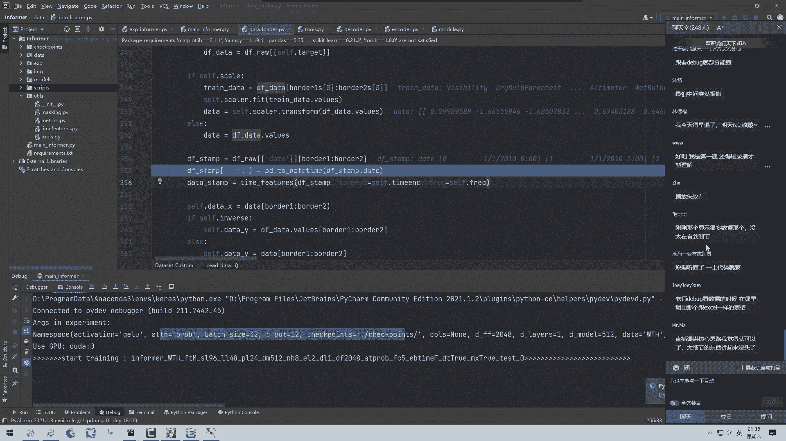

代码必须看，我跟大家说一句心里话，就是呃如果直接给大家直接直接让大家看这个以后啊。大家少不了干什么，你们少不了去阅读这些论文啊。你们少不少去阅读论文的，大家阅读论文的时候，估计你们会遇到更多的问题。

就是论文当中，我不知道他是在去做什么。我不知道这个论文讲的是啥。我跟大家这么说，就我现在读论文，我能我我就光读论文啊，我能理解个50%，我觉得都挺多了。真的你就读论文，你全理解能理解个50%就不错了。

就比如说你给我这个图，你就刚刚我这个图给我写几个名字什么叫概率压缩这个东西啊，什么叫做蒸馏这个东西啊，我光看论文我也看不懂啊，你给我数学公式摆在这，就你给我数学公摆在这，我说实话挺的，他看一么我不知道。

但是你这个东西放到原码当中你再去过一遍，他理解起来啊就非常容易了。所以建议大家就是 debu这个操作，咱就怎么说呢？真的是不能少啊，就是必须得必须得一行一行来去过的。

今天还是我带着大家大家一样解释后续大家就是怎么去锻炼你的一个学习能力呢，我希望大家就通过咱们比如像我们第五期啊，通过。

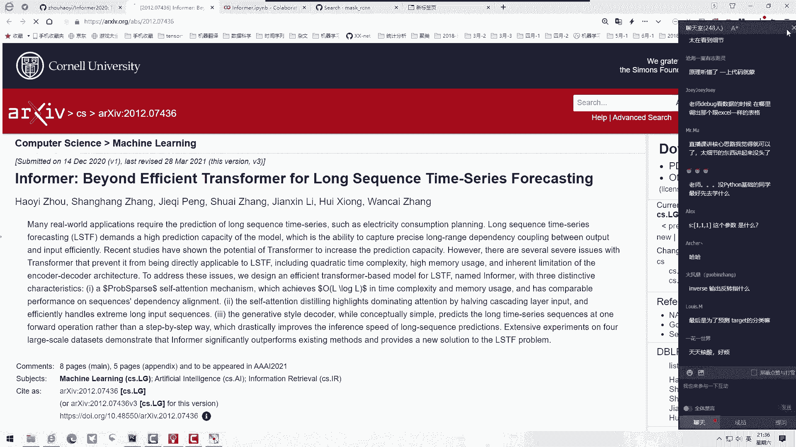

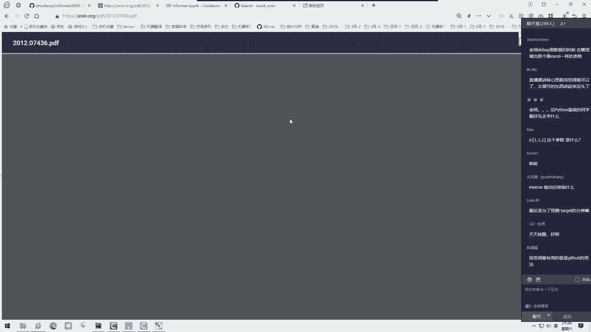

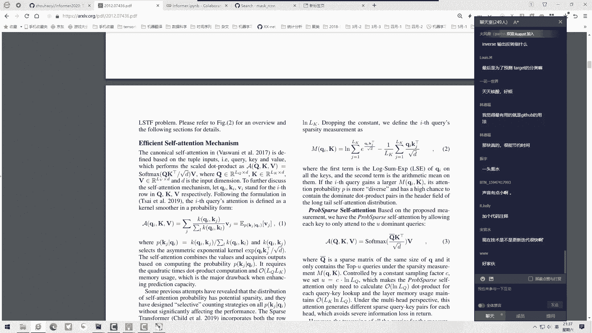

咱们这个哎我现在声音小吗？兄弟们，我声音小吗？😊，我声音也挺大吧，我声音也挺大的吧，我说音挺大的，也不小吧。😊，就是小同学咱咱咱咱们稍微调一调，就是可能大家音响设备也不一样。😊，呃。

就是大家看看自己的设备啊。😊，我知道应该正常的。然后后续啊就是大家我希望嗯怎么样呢？就是学习过程当中啊，一定要自己去多熟悉这些源码。这些对大家提升能力比较大的。无论是后续你的工作。

还是你后续阅读一些论文都需要大量去参考这个源码的。我给大家讲，相当于就是带大家去熟悉一遍这个流程，后续少不了什么，咱们得自己啊，咱们得自己来去搞这个东西的啊，代码当中都得需要自己来去做一遍，蒸馏。

后续给大家去说啊，蒸馏，就是一会儿大家看到了，让结构变得小一些。😊，服务器这个咱们最后给大家说吧，我没啥好服务器，我就22块30902，我成本也不想搞那么高。没有派on基础的，先学派on基础啊。

派on基础是必须的啊，这个东西。呃，我看同事是某网络代码，他网络做的不同字由的改变，出于这属于减，这不属于减值啊，这属于就属于改变啊。CI加部署咱们已经有了CI加部署的就于那个tenRT的。

我找另外一个老师给大家讲的啊，最后给大家说服务器这东西嗯怎么说呢？就是把台式机把台式机锁就是锁起来，锁到一个专门的地方，这种感觉实间序列不适合做ser的。😊，啊，就是那啥。

他那个沙粉就是说每一次我们不是按顺序去取，是一段一段的，一段一段随机取啊，预测不是分类，预测是回归。兄弟们，预测是回归啊。

四期四期我们那个模型部署的MM lab没有的MM lab是做CVE的兄弟们MM lab它是做CV1的啊。😊，服务器你要是配的贵的，你就直接找供应商给你报价吧啊，直接给你找这个供应商报价吧。😊，一次到位。

inverse输入怎么理解，他是那啥，我我没改这个参数，它那个参数我估计就是说正常预测四差2值。你是想从往前输出呢，还是从从前往后输出呢？我估计这个意思。这节课啥也不需要，就跑这东西，CPU都能跑。

我跟大家这么说，CPU哎，咱们先讲啥，我们先讲时间序列。😊，咱们今天讲时间序列，这个东西要比什么？要比我们的CV要比我们图像数据，咱的输入怎么样？少了小了几个数量积。兄弟们。

咱们今天这个时间序列跑起来太轻松了。CPU我会动就跑的，要少了几个数量积啊，大家体有这种感觉了，要少了几个数量积的时间序列跟图像是有不同的，这东西很小，兄弟们，这东西很小的。3670可以的啊。

3670可以的。实验序列它是既可以做回归，也可以做这个分类的。打断点点来，兄弟们，这个点就是这不就打成断点了吗？太基础的东西，大家就是怎么说呢？多练多查啊，就是不是说有时候我和咱们朱老师都大家说。

有时候东西多查一查，多查一查，不是说我不让他不给大家去回答问题。很多时候啊，就这个东西啊怎么样自己练一遍，啥东西一定要自己熟悉一遍这个事儿啊，这个东西一包括咱们debug，包括咱们对这个代码理解吧。

都要自己搞一遍，都要熟悉一遍的底bug不是往简验上去写包装项目会给大家说包装项目，你要给包装一个实际的背景，比如说咱们建设项目宣员之后怎么办。😊。

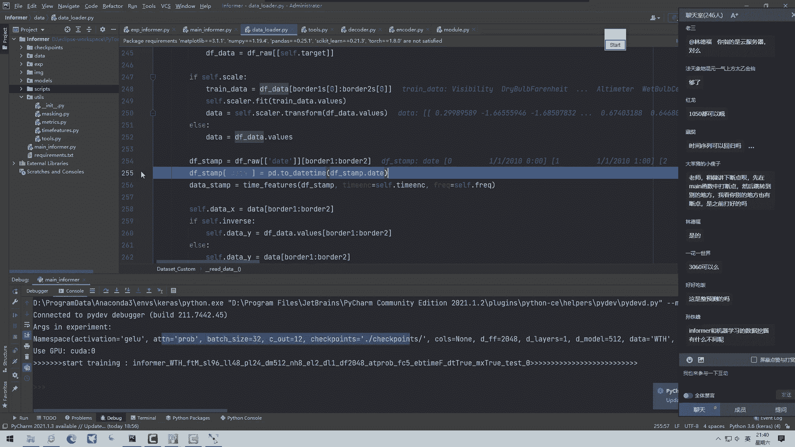

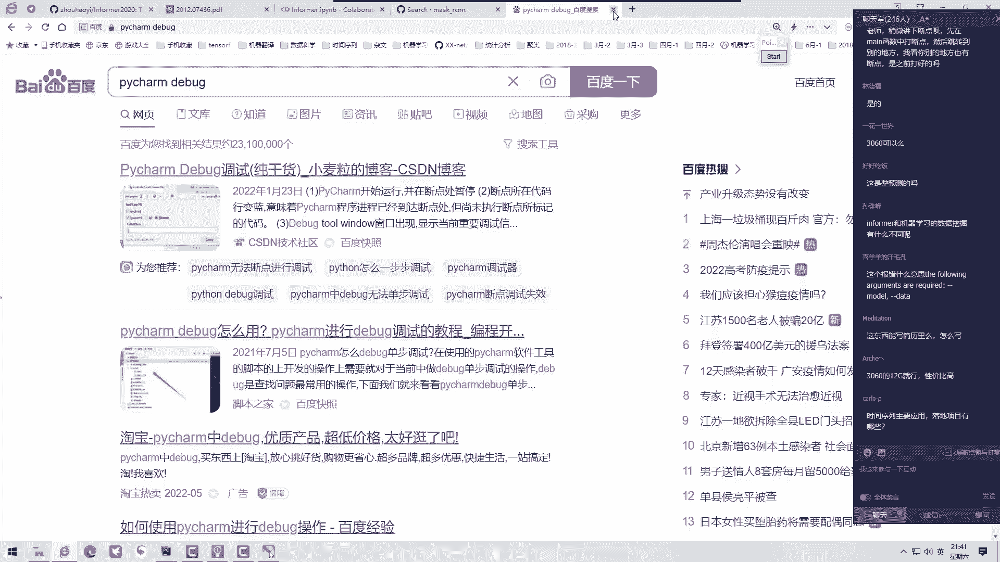

我们之前做啥项目？比如说我们之前啊给那个变压器厂啊，做这样一个做做做这样的需求。他们的任务呢就是说哎比如说我们现在这个电厂当中给用户供电，但是我们要需要用户啊提前去预缴一下下一年的一个费用。

但是预缴费用的时候，我们给他的一个一个指导价格导价格会根据他当年的一个使用情况，我们会去预测一下他未来下一年使用情况。基这个情况我让用户给我们一个预缴，这样我们有一些资金的回笼，能更方便后续去服务客户。

就这种东西就大家编还不会去编嘛，我就随机发挥编这个东西写简历大家说一遍最近写简历写跟学习笔记的啥实际场景，你们自己去写场自熟悉的，这个大家就自己写就行了。包装成和实际项目，实际项人文咋做的。

我这当中模型为什么这个模型呢？为可以预测未来区别，并且他对我们的模型做简值蒸馏操作。我们希望用户反馈时间是比较快的基它历史数据快速生出一个匹配。😊，结果咋地这个东西啊就说还不会说嘛啊。

就这个东西大家就编就完事了。每一个项目你都可以包装成你一个实际的东西。这个事儿大家自己后续想一想，看一看，你啥都用出悉，你就这么去找就行了啊。😊，我就随便说呢啊，就这也没也没也没过大闹。😊，来来来。

兄弟们，咱们准备继续了啊，说不完了。今天我估计我估计在我这进度太慢了。😊，我现在数据数据这个东西啊，我讲半个小时讲完了啊，兄弟们，大家看一看数据这个东西啊，我就讲一个多点了，数据也没讲完呢。

网络结果还没讲呢，兄弟们啊，咱们就今天说完我估计挺晚了，你们还没回宿舍同学，一会儿咱就可能得。😊，咱们拿其他设备来看行了，咱们继续说吧，我们来继续说吧。😊，呃，水分很大的啊都水分很大的。来来。

咱们继续说啊，咱们继续说。对，咱们很多都是实验半关门的服务，然后实验室有关门的，服务器关门都有。还有个哥们跟我说，老师我们老师让我10点必须关机，怕我太劳累了。好，然后然后咱们继续啊。😊。

接下来我们看这个时间处理。在我们任务当中啊，大家注意这一块啊，我们拿到时间数拿到这个时间数据了。时间数据啊，我们要去提特招加很多问老师时间不就是一个指标值嘛？它不就指定我们这个样本，它是哪个时刻吗？

不仅仅如此。时间当中啊能给我们提供信息是特别特别多的。但是大家注意点。😊，你看我们这个时间它是什么？它现在是我们这个数据的一个格式，我们数据这个格式啊不太好操作怎么办呢？大家看这块。

它是用它是借助了pandas这个操作pandas掉 to date time一下，把它转换成pandas的一个格式，我再打家看。😊，你看这个是pada的格式，跟这有点区别吧。

大家说哎老师不就格式变了有啥区别吗？你转换成pada所支持的格式，一会儿pandadas这个包，你是不是就行进行调用了？这是这一步啊，它转换格式，转换格式完之后，它可以它就是方便咱们进行调用吧。

这是我们做了一个格式转换啊。我这个注释，我直播的时候没时间大家写这个东西啊，到时候大家后期自己玩的时候自己写一写啊。然后接下来执行我们这个t features。😊，大问老师干啥，我说我也不知道啊。

摁住cttrorl，咱点进去看一看呗。然后第N住ctrol之后，我在这打上断点，我家说怎么打断点，你看这是正常跳入函数当中，它是没有这个断点的。我在这在地上打上个断点的。然后我说这一块往下执行。

它在往下执行的时候会找。如果你执行过程中有打断点的地方，它会停到这个断点当中。然后这也是这样的，它注释写了一堆哦。😊，我给大家总结一下，不给大家都说了啊，这说完咱讲后半页了，他这就是这样的。

就是针对你这个时间序列，它有多种不同处理的方法提不同的特征的啊，它提出两种方法，我们直接看第二种这个默认它用第二种啊，来往执行啊，第二种第二种当中执行的比较简单。因为上面的它题的特征太多了啊。

下面它又提了4个特征，我们一个一个来看一看。😊，首先。啊，他是啊就这一步更改重复了，其实他已他已经我们刚才已经把它转换成一个dayatetime格式了。然后下一步就是大可的说，哎呦。

我这写了一坨子原码当中，一旦我看写一坨子东西，我就恶心，我就难受。没关系，咱捋一捋，它是这样啊，咱们先捋。😊，我也没看啊。

咱们一起来捋他说fo这个feature因什么因这个哇天一大串的一大串当中又传建一个参数，它是这样把这个feature拿到手。然后对这个feature对我们这个数据做一个转换那是啥意思呢？

我估计这个feature他一会应该通过一些什么字典类似结构，找到一些转换的方法对这个转换方法来转换我们当前这个数据是不是那我们来看一看这个看出参数这个参数它H表示我们对时间数据做处理。

是不是然后这是啥我也不知道啊，controrl点进去看一看呗。rl点击之后，我们来看这一块它列了一大串的啊，咱们来读一读，它有注释啊，大部分源码是都有注释的。

尤其以后咱们大家玩的一些大厂的代码都有注释的，很少说啥注都没有的，除非是自己自己写的，来看一看。😊，它会呀返回一个list的结构啊，这个list当中包括我们的features。

这个features它会通过你指定的一个就是间隔吧，一小时以分钟为单位，会你返回咱对应的一个特征结果。那我们在这里你看本来没有电点。我说打上一个呗，来挑到这段当中，看一看人家干啥的。😊，哎呀。

就是第一第一次啊，如果说你让我看这坨的代码，就是大家可能第一次看，我估计大家也看不懂这啥东西咋办呢？😊，我们得想一想它啥结构。第一个它是个字典结构，是不是这个字眼结构当中有一些key啊。

就这个key写的名字就极其复杂，啥意思呢？我说我不知道这个off是啥咋办呢？按住crl点一下子行不行？是不是住l之后点之后发现这东西在哪，这东西是在ndadas这个包当中。

大家看一看你看这在哪ndas当中TS series当中有个offs点文件，这边当中相当于人家工具包内部给我们实现好了，一些特征提取的方式。那我一看哎，我说这东西啊是工具包内部写好的，那我可怎么办呢？

我们就不管了呗，这不就是调包的一个操作吗？咱先执行完，一会我跟大家说去干什么。😊，他这一步啊，我跟大家这么说吧，就是我总结一下，他是这样的，他做这个to赛这个操作啊，是这样。

就是说呃他要对你当前传建的东西做一个映射。我也我其实我觉得这个东西贼啰嗦，这个代码写的贼啰嗦，大家看我给大家看结果啊，你看有这一块，我传建了一个H啊，就是说我说我希望通过那个小时为单位去处理数据了。

然后大家看结果，他把这个H报名成什么呢？映射成立一个our这个东西啊，就再给大家举个这个例子，就这当中。😊，这当中如果说哎我们传接个H，它会帮我们自动判断一下，这应该设什么，这件是R这个东西。

er这东有什么用呢？一会给大家看到er这个东西，它会帮我去找到咱们当前要处理的一个类型。我觉得这块有点啰嗦了啊，你就不写这个东西，哎直接的咱把咱们的那个参数，你就直接按照这个pada这个包所知持的格式。

人判da这个包函数它一个名字去写不就完事了嘛。还搞这个映射干什么呀，我觉得这个东西嗯，当时我挺迷惑的，写了一堆啊，我也不知道他要干什么，反正你就这么去理解吧，他就要做一个映射，大家看怎么做映射。😊。

来在我们这个任务当中啊，这一块大家来看这个哦大家来看这一块吧。😊，去做了一个便利。他这个便利我觉得也是贼啰嗦的一件事儿。他作为便利啥意思呢？就是这个offset有好多种类型。

正好的类型都是pas当中我们实现好的。我给大家举个例子吧，嗯比如说。😊，来看这个。这个呃mo啥意思啊？你传进来了呃，比如说你传进来了一个一个时间数据吧，它是2012年的10，然后点08。

然后点那个什么13。00它会怎么样呢？他会告诉你当前哎，我们会把这个月份给它拿出来啊，会把月份的时间给它拿出来，就这样一件事儿，帮咱们去在里边提特征，这是潘断这个包所内置的一个操作。然后这块操作判断。

就是我们当前我们当前是一个呃这儿呢。😊，我们基于R去做，是不是它要判断哎，我们当前这个跟我们当前我 set呃跟这个类型哪一个是匹配的。我们直接跳入下端点对当中东西匹配到了。你看这是个时间是不是？

然后这个当前它也是一个时间的，相当于通过啥，我就大家说这样一件事，通过咱们这个名字，找到我们要调哪个包来，大家看调哪个包，我把手上这一点。😊，大家看是不是pandas当中。

然后TS lab当中offset当中点R我这个东西，哎，是不是说去调这个包，我们到这个我不给大家往角码上去看了啊，你就知道我们今天调哪个包就完事了。那接下来知道我们调哪个包了。

咱们是不是说可以把这个方法给它返回回去了。什么方法，就是说我们调这个包的时候，我们既然以小时为单位，以小时为单位的时候，我们都给执行哪些个操作，我再给大家去看它是这样的，我给大家找。😊，呃。

这儿呢来大家看是不是找这个东西，他的意思就是说我们把这个给他找到，就找这个东西。其实这个东西也太啰嗦了。我直接一行代码给它指定好了不就完事了吗？不用去匹配啊，这你就你就当理解就行了。

这个代码可能写的想比较高端大气上档次吧，写个比较通的方法，咱自己任务不用这么高端大一大上档次啊，跟大家说，一句话总结就是接下来我们要提把时间做成四个特征，第一个特征，当前这个时间是这一天的哪个小时。

大家可能说哎这一天哪个小时，不就是说根据他的第一个小时，第二小时，第三个小时，第四小时吗？不是的，一会儿大家看到啊，这是我们对时间题特征，这是我们对 day体特征。

当前这一天它是星期一、星期二、星期三还是星期三是星期五，当前这一天它是上旬中旬还是下旬，当前这一天在这一年当中它是第多少天，这是我们要提个特征啊，这一块就人家说了，我们要提出来有这么四个特征。

大家就只需要知道。😊，我们费了把劲儿的整了这样一个事儿就行了。所以这一块大家注意。😊，我看看啊这个名字我能不能显示出来啊，这个把鼠我这显示不出来，就是能大家能不能理解这意思。

这个这个feature啥意思？就是有4个。我为啥说它是有4个它这里大怎么来的个这里个遍之是几个咱不是4个？

今天是个小时今天是这个一天家看是个是是对这个一个分别个数据处理就后看这个复代码是常简单对这个特征取出来个是是个当中一个对们这个日期判断对每一个要对日期进行一个特征提取然这个思你提出来个特征个拼到一起那我们下怎么回大家找吧这个东西我给大家打断一住不使住不好使时因为它这块完里？

这种写法。😊，它是简便算法，所以说跳进去咱咋办找呗。😊，来往上翻，咱去找你看这个t featureature当中列出来一堆，咱一个去找我们来我来给大家打断点找第一个今天的哪个小时是不是有这个东西啊。

咱是不是有打个断点啊。然后今天呢然后今天是这这周哪一天有打断点，有打断点，然后打4个断点，大家打好的，我们往里跳一下来看一看，来看一看这里边我们今天第一个嗯这块是把我们数据拿到手了。😊。

你看还是我们这些数据是吧？我看看它能不能做展开啊，这个这个这展开挺费劲的。来，这是我们出去做展开了，你看所有数据都是0到这个23，是不是每个数据都有它对应的一个时刻，这一块它有个注释，他说啥意思呢？

把我们今天是哪个时间压缩到-0。5到正00。5之间，怎么压缩的？😊，对时间特征除23减0。5，这样啊，为啥除23？咱们那个24点不是24？我们24点是零点，大家注意24点是零点啊。

所以这块他说除23的那这样我们是不是得到了对数值做压缩，得到了-0。5到正0。5之间的一个值表示今天哎它是今天的哪一个时刻点上，因为时间序列，时间序列做预测，跟时间是有关系的。

什么时候是打游戏的黄金时间，晚上8点，什么时候是篮打打篮打篮球的黄金时间，晚上6点之后是不是什么时候是早晨吃饭时间，这都有说法的呀。什么时候你手机比较费流量，什么时候你情绪比较不稳定。

其实都是跟时间是有关系的。比如说我一会我一会儿媳妇几点会给我吵吵，几点会骂我，今天会打我等等，这都是跟时间有密切相关的东西。所以这里边咱们再提时间这个特征啊。好了，这是第一个。😊，来再体验，这是啥。

这是thefi，啥意思啊？把今天是这一周哪一天也压缩到什么？也压缩到-0。5到1。5之间。我们这个。😊，一样的，我估计他应该是我记应该是0123456吧，这边除个6再减0。5是不是行了？

来再往下再往下再找。今天是这个月的哪一天也压缩到负的0。5到正0。5之间，大家能说哎，为啥要压缩占样个值啊，其实这个东西不是固定的。你想怎么压缩都可以。这一天我说它是这一年哪一天也压缩到-0。5到重。

5之间，为啥这么做？你不要拿一个具体的数值，你拿一个具体的数值，那数值大小有差异的。我们把所有数值都压缩在相同的一个取值范围当中，这就是我们对时间特征，怎么去预处理的。我希望大家就看到这之后。

我们要干什么呢？有一些想法了。😊，人家这个源码怎么做的？人家这个源码对时间做处理了。大家说哎老师，我接下来搞论文，我也搞时间序列，我这个时间序列我可以怎么搞呢？人家对时间做处理了。

你的任务当中有没有一些什么特别的东西呢？比如说你的任务当中。😊，有一些文本哎，文本当中提涉及到啥呢？涉及到一些什么地点呢？哎，然后涉及到一些什么场景啊，涉及到一些什么场。

就是我可想想有地点有场所或有人名这些东西，我们是不是也可以把这个地点做成一些特征，把一些其他东西也做成一些特征啊，人家提拿时间做了一个拆分，提出一些特征。

你自己任务咋玩是不是都是根据你的故事自己来去说呀，言之有理即可，这篇论文当中大量去说了，人家对时间咋咋地咋咋地的，其实就是很简单处理，是不是大家自己任务根据你的特征想呗啊，就发挥你的想象力能做啥。

咱就往多去做，然后最后怎么办？咱们来是不是做了4个。😊，我看看是不是4个来4个，最后拼到一起，我们看结果。😊，咱四个啊拼到一起之后，来我们看这个结果啊，来看这个结果。你看0123这个零表什么意思啊？

今天是那个咱们先刚开庭啥，零是那个那个那个小小时是不是一是啥忘了二三十啥都忘了，然后哎我估计这个三应该是哪一天吧。你看这都是0。5的，然后最后看最后一天最后一天是正的啊。

这就是对我们这个天来也做了一个什么全加缩到所有数值负的0。5到正。0。5之间了，这是我们对时间做的特征，你别看我这东西讲起来讲的挺慢的，就大家自己你们 debug，我估计你们思路如果是比较快的话。

你们bug这个东西应该很快的，我自己看这个圆码，我咱们上课之前我花了20分钟 debug一遍。然后可能就是我讲的比较慢，但是你自己去 debug一遍之后，很快的这个东西，他肯定不会比我讲的快的多了。

你自理解这个东西来接下再往下。😊，Bder一der之前说过了训练机在俩去取dataX是我们的训练机。然后这块它多做了一个多余的事儿，就这块它这个dataY啊和data X是一样的东西。

我也不知道他为啥这么做啊，挺多余的啊，就是一会儿分别在dataX当中去取dataY当中也去取。其实他俩看看这个东西是一模一样的。大家先记住，他俩现在目前来说都是一个一模一样的东西，还没有任何的改变啊。

就是。😊，你就当做吧，这是我们出理数据了，出理数据包括什么？时间数据时间数据处理好了，是不是？然后呢，接下来我们这些特征拿到手了，再通过这个列名标签指定了标签最后一列是吧？啊。

这反正就是我们现在做数据基本处理，咱们现在已经把数据处理给做完了。哎呦，我这次费了好大劲儿啊，才讲完咱们这个reta datata这个函数，那你快点了啊，这这一步初始化的数据集啊。

咱们这个cus data set完事了。😊，来再往下最后这个dloader，这个dloader比较简单了，就是大家看我会大家再填一句，还有个函数没说呢，呃，这里边我给大家找。😊，哎，咱来找一下。

我看一下啊，这儿呢。😊，咱们该给大家看这什么data customer是不是这里边构造函数，我们是现在把数据读进来了，先把数据处理好了是吧？大家注意这一块我们是刚把数据读进来，刚把数据处理好，但没完事。

他现在跟我们出现好之后得什么的，我们是不是得到了当前这些数据了？接下来还有一个get item函数，我先打上个断点，一会咱就用到这个get item函数就是我们制作dloader所必须要去用的。

大家记不记着我在那个当中给大家去说了有deload这个东西，这里边我们现在就要去构建我们的数据集，我们也需要去做这个dloader这个东西现在get函当中我们还没走，大家先知道有这个东西啊。

因为一会儿我们要构建这个数据集。😊，来看。来看哪需要这儿呢？dloader构建数据集。因为这里咱们连原版也写好了，所以说我们可以指定这个dloader，这是套尺内部的函数，咱就不说了啊。

套制内部跟我们之前做法是一样的，封装成一个dloader格式来做上dloader。好了，现在我们把dloader做完了，呃，费了海大劲儿。😊，把训练集做完了，接下来来接下来不往一跳了啊。

你看这个代码当中，我们训练集怎么去做的。😊，我们的验证机，和我们测试姐，我喘岔气了关。😊，我们的训练级验证级，还有测试结是不是咱做法都一样的，都是相同的啊。咱做法都是一模一样的。来，接下来我们再往下走。

这个不给再往跳了。我直接也是大断点，咱直接跳这个段点当中了，同样的操作我们就看一遍来再往下跳。😊，这时我们验证几个测试结，咱不往里一个走了啊，我直接呃正常应该把这个段都取消掉来都取消掉吧。你取消掉。

就是把它点给取消掉，这样它就一会儿不会往这些这些当中去跳了。来，我都取消掉。😊，这是咱们都是我们该打的嘛？该给大家说这个数据集的时候，打了这么多断点。来，我们都取消掉都取消掉来跳出来。哦，还没完事。

我们打的太多了啊，这里也打了，基本上每个地方咱们都打了。😊，呃，来跳到这儿了，来把之间取掉掉。这是我们现在啊把这个数据去做完了，训练集验证集测试集对应大loader是不是都有了。然后接下来干啥了。

是不是该去训练我们这个模型了啊？来，接下来我们指定咱们往下走啊，下面这一步它做一个判断，就是你这个拆point这个路径没有如果没有给你新建一个路径不用说的，然后指定大家时间，我们可能会计算啊。

每个epo执行时间。然后这个就是说我们会执行多少个t，我们的 batch多大，这是根据你那个 batch来指定的。😊，好了，这个不给大家妈去看了啊，A做一个提前停止策略。这个东西聊一聊也知道就行。

就是模型如果连续多少次不更新，我们给它提前停止掉，然后优化器，还有这个损失函数，这都不你跳了，直接给大家看结果得了。优化器用这个ADM这没得说啊，这东西也不用看。😊，百分之大家玩这个模型啊。

基本上就万年不变的一个数。你无论跑啥都用ADM去做。因为所有人都用这个东西去做的，你也不用想ADM我有没有改进空间了。别人这什么大佬级别人物都没有改进空间，你有啥改进空间啊，这东西就用就得了啊。

损时函数啊，这个很简单。😊，他这里没有改啊，这篇录音当中我觉着可能后续大家如果想去改的话。损失函数可以去改到它的损失函数最简单的1个MSE loss。😊，做这个回归的就是touch当中。

to当中内置的这个MIClo很简单的一个没有考没有加任何其他的操作吧。然后这个咱咱没加。lin你去加这个东西，windows别加这个东西了啊，加这容容易崩。那下面面我们去来去迭代。

我们一共跑多少一po看一看6个，它跑的比较它跑的比较小，大家自己玩的时候，你拜ch可以稍微大一点，时间序列不像图像啊，图像你ch为一，你觉得你都玩不起了。时间序列它怎么说呢？它的输入没有那么大啊。

你 batchch可以稍微大一点，然后指定这个例子就不用说了，损失做计算。然后第一开始我们训练指定猫都为。😊，然后下一步来去遍利这个遍利啥意思？哎呀，又又给大家又给大家打断点了。遍利这个电loader。

它又遍利啥，之前给大家说好多次，遍利这个量loader，它会遍利这个get item函数，是不是这比较核谐。我们还得给大家跳到断点打进去看一看。因为你要理解一个原码，就理解两步两步就行了。😊。

数据咋搞的，从头到尾把数据咋搞捋明白，从头到尾把网络结构咋搭建搞明白，把这两件事搞明白了。后续啊就是你做啥呀，那就都都能理解了啊。来打上断点，就是建议大家这样，你跳之前啊，都是提前打断点啊。

跳每一行都瞅瞅张干啥，提前把这个断点打进去，这样我们再往里一跳，手就跳到这个断点当中了。这一块指定了索引随机传建了一个索引啊，大家注意随机传建索引。咱这个时间序列啊怎么训练的？再给大家去画一画。😊。

这是我们现在有1万个样本数据。在我们这个1万个样本数据当中，我们会选什么呢？随机的一个起始位置。比如这一块随意选这个起始位置，以它为我们的起始位置，in index为起始位置，找什么呢？

找到终止位置什么？以当前这个位置为起始位置，再加多少，再加上1个96。因为我们说咱们要基于的序列长度是每96个序列，预测它接下来预测值。所以这个呃这个起始位置是随机的值，比如说它是3000吧。然后呢。

终止位置，它就是个3096啊，这样一件事。然后这个R。😊，这个R是这样的，就是呃它是啊嗯跟大家这么说，它是跟我们这个呃96它有重叠的，重叠多大呢？我给大家画它的重叠是这一块，它有了48个。

因为一会儿大家看到了，在我们那个transformer以der当中，我们会用这48个啊来当做我们的一个线知识，然后去带着我们后面做预测的。所以弱大家注意它是通过这个SN减48啊。

这个label done48，所以这一块绿色画出这个是48，然后这个Rend得多少呢？😊，等于多少大家来看等于是R begin啊，就这个东西从它的开始加上什么，加上这个48到这儿再加上预测的一个长度。

预测长度我们是24，这个黄色它这个东西它是1个24的。最后我们要预测结果，就是这24个值，但是这48是我在抵扣当中需要先带带它的。好了，这是咱们先指定好啊，就是我给大家写一下吧，咱们来找个对应关系。

自己玩的时候自己自己呃我给大家这一看就能看明白，我可能说有点啰嗦都这是啊这个SB这个东西，这是S and。😊，这个是SN，然后这个R的R的起始位置，R的起始位置我给大家来画啊，这就是R的一个起始位置。

这就是R的一个终止位置。好了，这个大家说了一下，咱们指定的索引发现什么？咱把这数据去定，在一会儿都能取明白。好，指定列索引来来来，随以指定的缩引，就是这个部给大家完全去看了啊，看这看列值吧啊。

就我们来说指定列值。然后接天取数据。这个s这台S啥东西来着，你要忘的情况下，你往前瞅一瞅，是不是赛尔得意的，我们处理好数据之后，看看这是不是处理好数据之后，在数据当中指定好这个训练节位置，是吧？😊。

接着干什么？通过我们指令缩引，把这96个数据读进来，来手往这一点，看看啥。😊，9612是不是96啥意思？96表示我们输入的一个长度。这个12呢表示哎我们每一个就是每一个我一般就叫token啊。

就是卷当中每一个它是有12维的一个向量。好了，然后接下来咱不做这个没有这个反转这个东西啊，然后接下来我们要预测的呃要预测的。我看这啥啊，这是我们要预测的一个结果，这是大家来看，这是不要预测结果。

进我们这个序列整定好了吧，多少个72，是不是。😊，来，大家看7212，但是大家注意啊，我为啥一定跟大家说，让之前看原理。因为刚才说过，72当中48个是有标签的，另外24个是我要做预测的啊。

所以说48加24等于这72个。好了，接下来来问问大家这个这个带mark。他起这个名字啊，哎呦，很烦呐，呃，叫什么呢？就是叫做那个时间吧，他不都不如叫个time这个东西，这是啥？这是我们时间的特征。

大家记不记得我们该处理时间特征，除以出来时间特征几个，我手上这一放，他是不是有是4个来时间特征拿到手看一下。😊，时间特征964是吧？然后再往下，我们Ecoder的是不是也是个724啊，输入和输出啊。

都会用到咱们的一个时间的信息的。时间信息当中，它是有4个特征。好了，return回确，这样咱们现在啊就哎啊这块我执行多次，我把这个断点取消掉了，你看现在又回到这儿了，问大家为什么回到这儿了。

看一下我们刚才打刚才停止到这个位置，咱把这一块啊去取这个数据，这个dloader，它会帮我取多少个呢？它会帮我取bach个数据。咱们这个 batchch是32的，所以说它会在这个复局环当中啊。

就是这里边它会在这个副环当中帮我重复的去跑这么32次。你看这一次完之后再来一次，你看再来一次，再来一次跑32次，我不给得跑完了怎么办？把这个断点取消掉，然后回到我们刚才这个函数当中，在下一行打上断点。

点这个绿色箭头跳入到下一个断点，这32个咱就取完了，瞬间的事啊，取完之后看一看是不是32个。😊，bechX我们的以codeder输入32、961232是不是bechY瞅一瞅呗。

就大家自己体自己抵八过程当中就看呗，这东西一看回大家都能看出来32、7212是不是，然后跟事间相关的32、32、964。这个跟以codeder之间相关的32、724是不是这才就做完了。好了。

接下来来我们去走这个网络结构。😊，来这一块先剔听顶，剔听完之后，这一块它这函数叫那个去呃proces one batch。它的意思就是说通过输入是这个ch数据，大家来看这是不是我输入的一个be数据啊。

通过咱们输入的这个ch的一个数据，然后得到预测值，然后真实值是也有的真实这里不取出来了吗？你看这个bachY当中它这72值72值当中包括我要预测的24个，它真实是不是都有啊，都在这里了。

所以说预测值真实值咱们都可以得到的啊，摁住cl点进去咋办？打上的断点跳进去是不是就行了，来跳进去吧。😊，哦，来先看看大家有啥问题。😊，来来，先跟大家说个问题，就是72楼旅明吧。

我问问就是大家看没看看没看之前讲那个informer那个原理的，我群里哎我班主任老师艾大家不下三四遍了，真的，你们看没看这个东西，看了是吧？看了同学一定知道这个24个48是啥吧。😊。

就是咱们这个分的一个Ecoder和那个deder是吧，deder当中是不是有那个48个48个，我说要带带着他去预测那24个啊，就是大家如果你你实在捋不明白什么什么7964824的回头吧。

咱们看一遍那个原理吧，那不是一句话两句话的啊，后去对我给大家说了，就我我爸从小我爸从小怎么教我骑自行车这事，先去扶着我骑，然后再手手撒开啊，就这样一件事，72个就是72时间点的啊，就是72时间点的。

就咱这个说的。我是没想到我这我这我这数据处理讲了一个多小时，讲太慢了。咱马上说网络结构了啊，来，咱继续。😊，然后接下来大家来看把这个这个数据给它放这个ku当中，这不用说了。

放到我这个ku达我就一个GPU啊，所以说就是这个ku达点点0就完事了。放到我这个扩当中。然后接下来接下来大家注意啊，构建这一块大家注意一下，这一块怎么说呢？有点难有点绕啊。

大家一定要理解我们现在这网络结构，我们是一个Eder加上个deder这块需要大家基础就比较多了啊。首先你知道什么叫transformer。

你还得知道transform当时der跟deder分别做些什么事，来，我们下来看这块有点绕，我们现在构建deder的一个输入。😊，decodeder的一个输入deder这个输入啥意思？

大家帮我大家帮帮我看一下，我是怎么构建的。就是这块的细节啊，大家在找源码的时候，一定要看这个细节怎么构建的？以零为初始化进行构建的。大家注意deder输入，来给大家看，这是我Ecoder输入。

是96个序列，这是我deder输入，现在是以零为初始化进行构建的，有72个，现在72都是零大家可能说老师不是说有48个要带代我吗？不是有48个是先有值的吗？来继续看啊。

现在是以零为初始化的来给大家往这一看。😊，已定为数主化的，马上烦跟大家说为啥？然后接下来在抵扣数当中，我们刚才不是说了吗？有48个应该怎么样是有值的那怎么体现出来呢？来，大家看这个代码。😊，冒号啥意思？

python基础这东西啊边练边学，遇到不会的。这有同学问过老师冒号啥意思？就这东西遇到啥不会，咱就查查就行了。冒号表取全部。第一个维度表示什么？第一个维度表示表示bach这个维度bach这个维度。

我们是都要考虑的。第二维度大家记不记着这是我们参数多少？48冒号到48啥意思？我这个序液当中啊一共长度是72个，我现在要对前48个做处理，大家注意这是冒号48对前48做处理，这个冒号啥意思？

每一个序液当中48当中每一个都有啥都有12特征，是不是每个特征我说哎他们都是要取的，这也是个冒号好了，这是ca操作，操作当中跟谁做一个拼接呢？

跟我的一个deder的一个刚才我们构建全零的一个输入去做了这样一个拼接全零当中哎呀。😊，全文当中大家怎么说，程当中刚好写错一个数圈文当中大家注意我们该对24个啊，这该数出成18个，说成12个了。

大家注意这块啊，你看这个长度是我这块是个24，这块是24个零我们构建是24我忘说啥了我怎么记数24呢？到这块这构建24为零的这块我们取了接下来们什么咱们48个它是有值的那它俩拼到一起多少？

你看沿着哪个维度拼接沿着第一个维度这个一表示什么意思？零表示的是ch这个维度一表示什么一表示是你的token的一个个数就是你的序列长度这个维度。

沿着序列长度这个维度拼接是不是48加24等于72个操作那这一步拼完之后啥意思？😊，这48个是有实际值的，就是有真实值的。因为这是我们该取出借数有的。然后后24个是拿零做初始化的。我问大家一件事。

后24个为什么咱们要拿零作为初始化？大家不要想这个问题，这个问题很关键。为什么说后24个拿零做初始化，因为接下来这是我要预测值，这是我要实际预测的，它是没有的东西，我要预测它是什么，好不好？

所以说这24个，首先拿零作为初始化啊？好了，接下来做个拼接，拼完之后大家看。😊，多少327212是不是这72当中前48个是有真实值的，后24个是拿零作为初始化的啊。大家注意这一点。

为什么大家看源码就不看这个源码，你永远不知道哪些细节咋做的啊，大家接着再往下走。😊，再往下走，我来看这块来再往下走走这个网络结构了，看一下。😊，网络结构当中啊输入的是4个东西。

我一个一个给大家去捋一捋这四个分别是啥。第一个bachX我们以codeder当中需要去先编码，你告诉我的一个输入序列，当前输入序列它是96长度，32962表示bitch为32。

96是长度12特征X mark我们该说过，对于什么？对于我们的时间也要干什么？对于咱们这个时间，我说咱们也要去做一个编码时间这个事儿我也需要给编码特征，32964是吧？deder输入啊。

一会我们抵der当中，这就是咱们在解码层deder怎么输入的deder输入过程当中，我们的时间的特征也要做一个输入好了，这是咱们这四个啊四个它的分别是啥。然后这块呢mod一下。😊，我们到现在为止啊。

终于啊真的啊费了老大劲了，终于咱要去说这个网络结构了，往这个model上去传了，我cttrol点一下，看这个model在哪定义的啊，这个build model啊，这块他没有去指定。那我们接来看吧。

找什么。找类名吧，在这个model里边找，你看它这么多，怎么找呢？如果说那如果说大家第一次看这个源码，我第一次看源码，我是全打开，我一般会全打开这个源码怎么办呢？先从一个找呗。

先找一般叫mod因为其他的一看就是attentionderbedding这个东西，这都是啥，这都会用到的东西，是不是？所以一般这个model它是呃咱们这个入口找呗，这个叫inform不是我们要找的东西。

我们参数指要什么？我们边参数指定的叫inform这个东西inform这个东当中有一边有构造函数，我先不给大家看这个构造函数，咱直接怎么样。😊，在forward这块打上一个断点。

forward这块打断点就是咱一会儿模型走进来之后，第一步要执行啥来点上的断点，是不是我再往下跳一步，就会跳入到这个断当中来跳。是不是跳到这里了。

看一看我们现在这个输入这里边这四个参数是不是咱们该要的东西啊，Ecoder的Xecoder  X mark EderX decoder X mark decoder是不是都是我们现在想要的一些东西啊？

那接下来要干什么呢？😊。

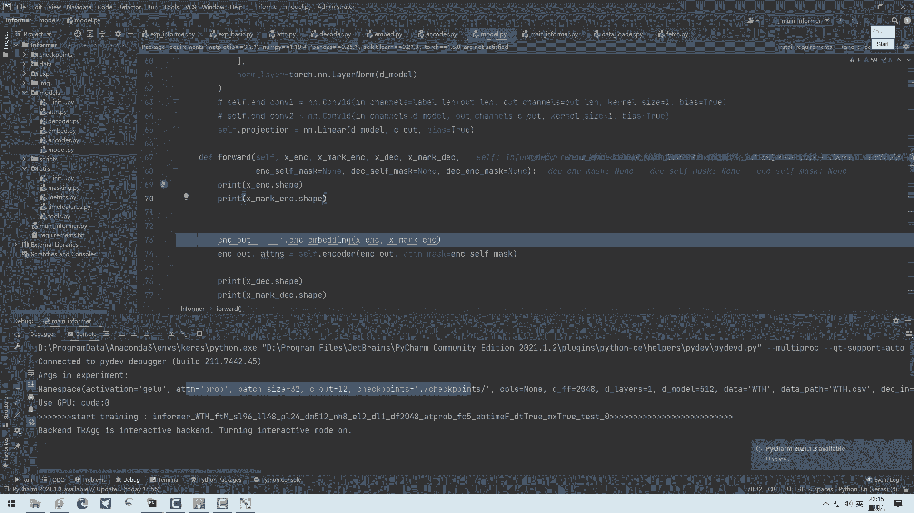

结合呗来打个PPT吧，结合着咱这个PPT给大家说这个故事，来再往下。😊，放到我们这个串封手当中，然后。呃，我找哎实验序列那个是吧，来找实验序列这个东西。😊，在我们这个时间序列当中，我们来去找啊，来来来。

咱一步一步去看啊嗯。来来来，我想一下。咱们。这样吧，我先调到这儿，一会儿用了这个公式，咱们就结合代码来去说，先放到这儿来教学走地方干什么？😊。

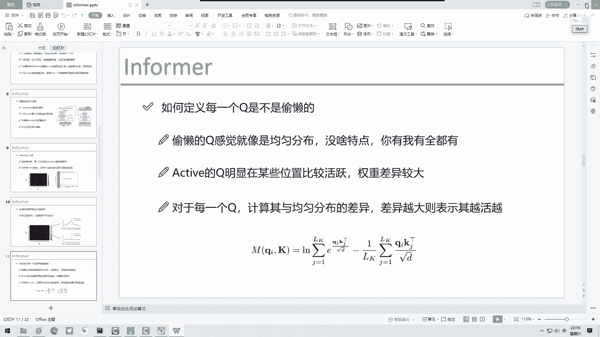

我们讲过很多啊不是讲过很多了。我们之前讲过transformer，我不知道大家有没有看过我们讲的其他的东西。transformer当中第一步要什么，叫做一个embedding。对于图像数据。

我们要通过一个卷积做这个inbedding对文本数据，我们需要通过它词所对应的向量来做这个inbedding。但是现在我们是一个时间序列数据，时间序列怎么做inbedding呢。

全连接FFC是不是也可以的，来看一下，这给大家说一下怎么整啊，是很重要来这里如果大家不知道我们这东西怎么定义的。😊，按住ctrl点进去之后，你会发现这一块它定义了一个datainbedding这个模块。

是不是在按住crl点进去，这就是咱们这个data embedding这个模块是吧？然后怎么办？在这里去打上一个断点哦，我再给大家演示一遍，就是我希望咱们同学啊都得去熟悉咱们该怎么去抵bug。

尤其是这里边我再大家使用方法。第一个按住ctrl点。第二个，我们去拿眼睛看。😊，展开呗。这接展开完之后，这块明显这有什么有个类叫data in。😊，那你说有电与白景这个类该咋办呢？

就是面向复制粘贴编程呗，你说怎么找？如果说如果说你ctrol找不着的话，把它cttrol加C一下，然后这儿我ctrol F，我cttrol加V一下，看一看在哪定义的，在哪定义的，我说定义都找到了。

我在按住ctrl跳进去是不是就找到这个东西了，或者你再实在找不着，你就找这个类的名字，是不是咱也能找到这个东西啊。好了，找完之后打上断点来我们添去。😊，看一看你班领做一件什么事儿。inbe当中啊。

大家注意，这是我们eccoder。我们先对eccoder来去做我们的inbedding。第一个我们做什么？大家来看。XX呢是我们输入的序列，输入序列当中32962，它是不是我们输入序列啊。

96长度12倍特征这一块呢做这 embedding其实很简单，它呃哦我刚才说的那个FC是不是其实这个任务当中，他用这个嗯。他用的是1个ED的卷机去做的也行，就是你拿ED卷接去做，还是你拿那个全键动去做。

这东西都行的。咱们手当中它ED选机行，输入是112，输出是512，然后con度 set为3，衰为一排点为一，问问大家输入多少。😊，一列的卷机啊，它的输出是不是就是说把我们12特征映射成512特征了。

是不是这样一件事啊，position embedding这不用给大家强调了吧。来这一块加上一个position embedding所有的任务当中，这个position embedding都是类似的啊。

这个大家要知道有这么回事就行了inbedding当中啊就是说我们的序列长度是512的。这个任务当中我们也需要啊，不是这个序列长度是96的，我们也需要对9696当中每一个加上一个inbedding的编码。

接下来对我这个呃时间特征。😊，实间特征是有几个是有4个，把这四个映成几个呢？哎，让大大家大家帮我猜一猜，你说把这四个咱应该映射成几个呢？这一块它是把12映射成512个了。这一块呢，它是要把什么？

把4个映射成几个。😊，也是512个，为什么咱们要做加法操作啊？所以说大家来看这一块，我们也是一个一定的卷积。通过这样一个一定卷积，你看输入是4，我们四个实验特征输出多少，输出是512个输完事了。

来直线一下。这完之后啊，大家来看我们现在这是一个embedding3296Y12了，把咱们的特征做了一个整合，时间特征跟我们的呃本身带的序列的一个特征，以及我们的位置变尔特征都做加法都融入到一起了。

这是第一步啊，咱们对Ecoder，我们要做一个inbedding的操作。Ecoder做 embedding操作。其实我们deder也需要做这个操作。来这一步。

咱们第一步啊做inbedding所有的transformer第一步都是做inbedding。第二步。咱们去执行这个eccoder这个操作。当我们在执行这个eccoder的操作过程当中啊，看一看。

把我们刚才inbeending结果要传进来了。然后这个tmus是没有的啊，咱们这个任务当中没有ter mask，什么叫term可能？它是这样。😊，就比如说呃就比如当中啊。呃，我给大家举个例子吧。

比如说咱们这一块我是123点2到96。在这个任务当中，如果说我说我知道三呢是个坏人，就是群众当中有坏人。我说有这个坏人，大家都大，你们都别跟他玩臭着他就。😊，就跟我们小时候似的，说谁谁下课踩始了。

大家离得远一点啊，什么要离他远一点，给他指一个musask。比如说我说mus太为0，mus为0，一般我们指用m都说它是一个负无穷的值。因为这样做attention之后啊，他就是没有没有亏他ten了。

这样做完之后就说一跟2一跟4一跟5一跟6一跟96啊，就不会跟三做计算了。mus表就是说你不想跟谁做这个计算，咱们任务当时没有考这个东西啊，很多一些特殊任务吧，会考这个东西，所以咱没有加这个mus这个事。

然后接下看这个coder。😊，可以扣der咱们同样的方法啊。来，首先第一步我一般愿意这样。😊，我愿意啊，就是先展开看一看这东西是啥，你应该展开看一看呗。看完之后，有一看一裤兜子，这太多了。

就感觉看起来挺多的，是不是？没不没关系，咱一行一行往的去捋这里东西。😊，这里东西可多了，咱得一个来就看了咋办？按住ctrl点去呗，看d的Ecoder，咱俩这在这定义的来Ecal当中打上个断点行吧？

通过这个断点，咱就一行一行往里去跳呗，来跳跳入一下。😊，attentiontion主要定一个例子啊，里边一会装啥，咱不管先往下跳来客户用来啊，这块是我们对应好这些层来遍地吧，咱们直接着看。😊。

tention这个 layer这是说啊就是在我们上面上面都他自己做这个定义啊，就是每层到都是啥定义这个操作啊，我就不给大家去看了啊，就自己定义你这些层当中都是啥，自己把这个定义写好，咱们来看。第一个呢。

我们这个t layer当中，我给大家展开。😊，呃，哎，这个这个来大家看这这你ctrol点去就不行了。哎，大家看这你ctrol点去就不行，是不是？因为这是过循环编辑出来的东西，这个变量在不断变。

所以这一块你ctrol点就不行，那咋办？我跟大家说怎么办啊，怎么去找这个东西来展开。😊，展开之后呢，你去找找啥找类名，这叫啥这叫Ecoder layer，是不是今天我给大家更多想去说的就是咱的方法吧。

其实这个源码啊，后续大家自己玩都能玩明白，但是方法这个东西是所有任务都都通用的啊，找这个复制这个名字 layer，然后面向什么面向复制粘贴编程啊。

先crl加C一下然后你说我找不着这个东西一开始定义的conttrol加Fctrl再加V一下，是不是找到这个Eco layer当中了，在它的哪儿在它的for当中去打上一个断点，是不是就行了。哎。

回到我们这里，你看这是er layer其实这 layer它做了很多东西，它做很多动我不管这些东西都是在什么Ecode layer当中，第一个我们先找第一个找第一个就顺藤摸瓜，你后面的后面再说。

先找第一个咱就顺着咱去找第二个了。来打断点是不是来挑到这个断点当中。😊，看一扣雷眼当中，咱们是不是就跳进去了，跳儿之后啊，就是人家这个定义啊都不管了，用到啥啊，就给大家说这个定义吧，咱直接用了啊。

然后下面来我们来看下一步。😊，下一步做啥呢？他是把我们这个X，哎呀，问大家一件事儿，这一块它为啥输入了三个X啊，像三只松鼠一样，为啥输入三个X，这个X是啥？我们先看一看啊，这个X它是个哎这里。😊。

它是1个32、96、512的，是不是我们那个要输入的一个序列啊？我们一会儿做这个transformer啊，大家帮我捋一捋。咱之前讲个原理，讲原理的过程当中呢，我们怎么说的？我们说任务当中啊。

我们有要做QKV是不是Q矩阵K矩阵V矩阵QKV矩阵，他们的输入都是啥？😊，都是X，是不是X乘Q矩阵得QX乘K矩阵得KX乘V矩阵得V是不是每个项项怎么得到的？是不是要需要这么三个矩阵啊？

所以这块为什么有三个X呢？因为他们乘的都是相同的一个X啊，所以这里边啊，这是咱们那个个X咱们说过是没有的来看我们要往这个跳在哪呢？我一ctrol点进去呃，哎，这cl点进去，没找着就不太好找怎么办呢？

这样咱们再找还是面向复制边程点view一下。😊，attention layer是不是contrl加Cctrl加Fctrl加V没找到没找到咋办？不是这个模块当中的了，不是这个模块往上翻呗。

来看一看inport啥了。呃，看一看哎呀，它这里边inport里边也没定什么东西啊，来，我我我我再看一眼啊。😊，呃tention当中我是不复制错了。attention哎。

往上找一找attention当中，我看一看在哪定义的attention等于这attention，这attention是传件哦，这是传件的东西。那我们别找了，我们还是复制一下来。😊，啊。

因为我不找传来的东西了，我懒得去回头看了，来复制什么attention layer这个类找呗，大家猜一猜，你说就attention layer这个类大概率会在哪个里边呢？就是大家猜大概率会在哪个里边。

是不是这个attention点PI当中啊，我们来稍新找一找进去之后面面面向复制一编程ctrl加Fctrl加一下来往上找是不是找到了attention layer这个东西，找完之后fo的来打上断点。

咱跳去瞅一瞅呗。😊，大去瞅一瞅，来跳进去QKV我们的数咱都是相同的。给大家说了，它都是我们X。好了，这一块拿到我们的这个值，就给大家说的啊bitch长度。

然后512特征个数H表示mutty tension当中的当中的头的个数啊，然后这一步干什么？😊，现在大家看这一块先在看这个吧query projection512512。

然后key呢大家先看512512。然后V呢512512啥意思？分别啊对我们的什么分别哎对我们的QKV通过一个圈重参数矩阵不要什么呢？query向量K向量V向量是不像我刚大家画的图，X啊。

不是就是三个X分别对我们的什么分别我们要去做咱们的QKV三个向量，这就是咱们 transformformer当中完成了一件事。这个query这个K这个V咱们家说的，咱们看参数是不都是X嘛？

X传到Q矩阵X传到K矩阵X传到V矩阵是不是这样一件事啊，是不是做完了吗？QKV向量得到手了，看一看吧。😊。

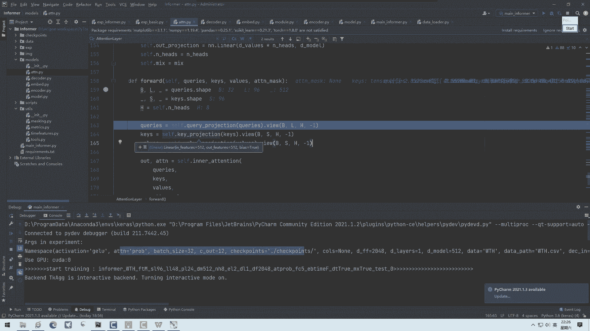

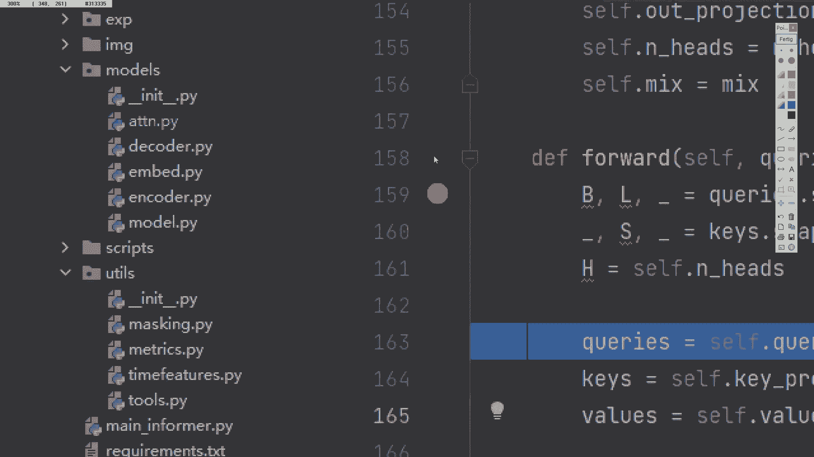

来先看这个QQ多少个呢？大家来看这个数它是多少？哎，对，这块有个re操作正常啊你会得到这个啊大家来看这里正常你是得512，是不是这个点view啥意思？做以加了一个纬度，加了点H这个负一表是什么？

负一表自动计算，512H是多少？H8，那负1多少？512除8不就是64嘛？所以说这个query当前呢它是多少？😊，当前它这个query啊3296864啊，这是我们query这个8啥意思？

做mutty head attention，做一个多头注意的机制啊，这一步咱现在做这个多头注意机制QKV我们现在就都拿到手了啊。然后接下来你看QKV咱辅助相有了，这个回大的也比较简单了。

咱们之前已经说过这个transformer了。然后下一步又来了。😊，就来什么，你看他做这个inten这个东西呃，怎么做呢？来看这个名字来名什么，就是大家你看这个源码，我第一遍看，我也不知道啥呀。

那就往里跳呗，走走一走呗。来复制个名字。哎呀，他这怎么不让我展开呢？😊，那我怎么复制这个名字？哎，他呃，他这个我看看啊嗯。哎呦，那咱找吧，他不知道他这个鼠标不让我复制来找，就大家记住这个名字啊。

proten这个东西来找找找找，看没有叫这个名字，应该就在附近啊，还是个ten这个东西，我看是不是这块哎，是不是找到了是不是来找之后怎么办？第一步找forward来找找找找找这啥。

这这啥我我都不知道是啥，我先不管别别管他，一会儿咱再说，你这个代码估计讲后半页去了，来找for是不是来就到这里我们来看。😊，这一块是不是QVB有了，我们要算咱们注意机制了吧，来跳哪端打进去了，跳这里啊。

这这这还没跳进去呢，来跳跳跳来这一步跳来，是不是？接下来咱就要看颗心了。也就是这篇论文当中啊说的一个事儿，怎么去找这个Q我给大家再回顾回过，大家可能忘了正常QKV是不是96个K。😊。

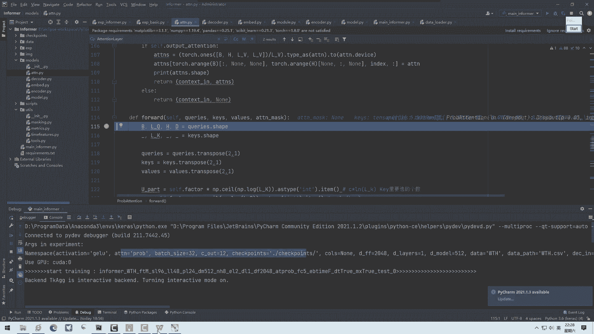

96个Q跟96个K要一一对应去算慢不慢很慢。那这个咋办呢？他说这样吧，他说我这个Q当中啊，我说我不选96个选个代表选个25个代表就完事了。就好比说咱班出去参加竞赛，咱班所有人都上人太多了，算的太慢了。

算25个代表就得了，选25个什么代表得是学的比较好的那接下来咱就想怎么去定义出来这25呢？什么叫做一个学的比较好的呢？这就是这篇论文当中啊最核心一个东西了，你看这个代码量。

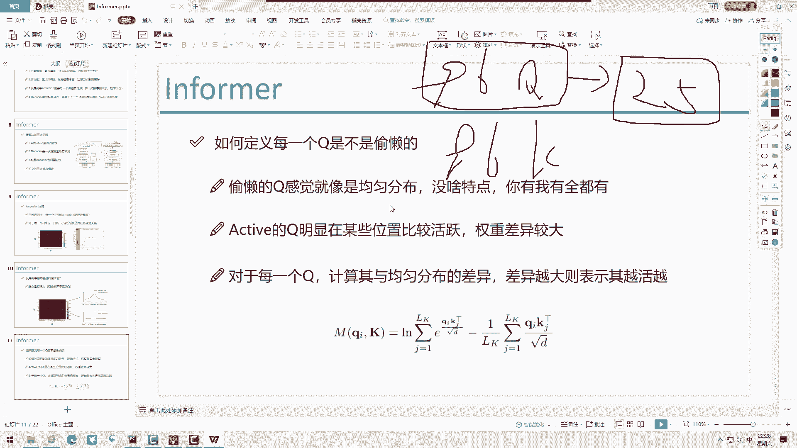

挺多的啊呃挺多的，没关系，咱一个去说他每一步怎么去做的。😊，来看看大家有啥问题，大家是不是。😊，大家感怎么感觉怎么样，还能不能坚持住啊？兄弟们，你们怎么样，你们还能不能坚持住了？😊。

嗯点m head他有啥就是多头注业机制。大家能不坚持住，你们你们可能坚持住越小，我没事，我怕你们坚持不住了。就是对于没基础同学啊，怎么说呢？没基础同学可能真的有点难了。

尤其是你们transformer之前自己没有抵bu住的。行，细姐，为什么在for打断点？因为这是拍套纸的机制，拍套当中呃，它的机制就是在这里打断点。然后我再跟大家去说啊，就是这里边怎么样呃，对，挺像的。

就这里边给大家选的。我先在大家说唠两句嗑啊，然后一会儿再讲，先缓冲缓冲。form这个代码难度呢其实算是简单级别的啊，这个代码难度其实在我们后面这个源码当中算是个简单级别的。它是代码量很少。

就是它这代码量非常非常少了，已经啊，这算是个简单级别的。因为我我当时想是直播给大家讲，我不没想给大家讲太难的，想给大家先讲个简单的，这是怎么说呢？就是比较简单级别代码了。后面大家可能看一些比较复杂的。

你可能看什么三维重建的，你可能看什么3D目标检测的那个比这个难一个数量级以上的，这个已经算是比较容易的源码了。对，大家休息一分钟吧，上厕吧，大家休息一分钟吧。我我兄弟们。😊，兄弟们。

咱们咱咱咱们讲10点半了，有帅熊问我，你former是啥？行，大大家大家休5分钟，我们我们10点35，我们10点35，咱们咱们继续10点35，我们再继续。咱们休息5分钟，大家该干啥干啥啥啊。

我们休5分钟，我给大家来说说问题。1点30我们继续搞行为识别需要这个吗？哎，兄弟，行为识别你也真需要这个行为识别，你你有很多算法是需要transformer的。😊。

就真的有很多需要transformer的。原始数据是个大序列，数据拆分一个拜痴。对对对，是这样一件事儿。呃，拍唱就用吧，这个没办法，就是嗯这东西不会，你就硬着头皮上，硬着头皮上边用边学。我我用排。

其实我我大家说，我用排用多长时间了？从咱们我从录这个MM lab开始到现在我我算一下，应该是4月现在才5月我才用个月，我以前从来不用这个排的，我才用个月，我我也没找教程，我就是会我只会这个操作其压操作。

你像这里边这么多东西我都先用现查的，你也没必要一次性的都学会这些东西，先现查就完事了。以前大家有老同学知道我以前那个是不是就这都西用起来行了，用现查吧，不用把所有东西都会先知道这些钮干啥就行了。

就好多按钮，这这一排这一片一片的，我都没用过，我都没用过，暂时用不上的。之前维特利不斯。

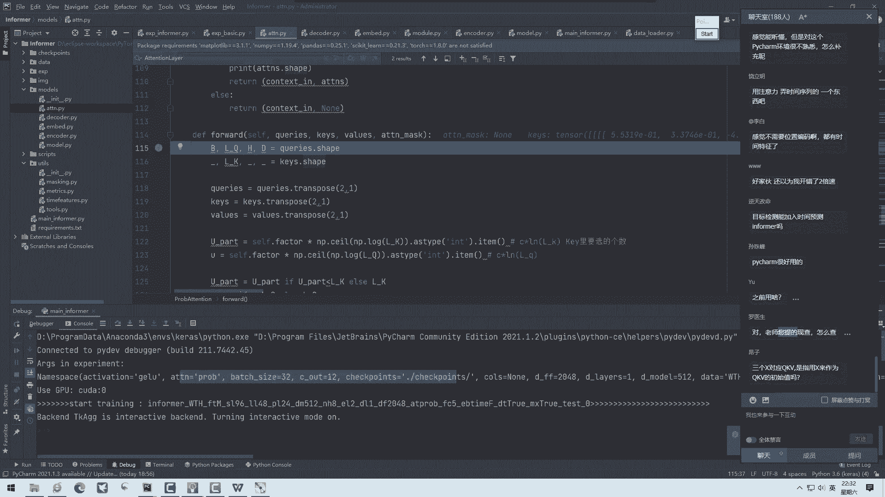

怎么查百度查呀，兄弟们，百度查呀。我之前我第一次我就查，我说。😊，第一次我我查了排唱第一个东西就是拍唱怎么改字体大小。啊，就是就是这样呗，就是现不现查呗。哎，艾尼康da跟艾妮康da是环境。

排查是ID它也不一样。雅里尔忘了Q25名96为了速度。对这篇队文核心的一点怎么去加速炫耀用的东西。你可以当做呃，你可以当它是一个压缩吧。行，我们三5继续。拍套只跟拍唱有什么关系？

这应该都是我们那个跨方向的同学。拍套是个框架，拍唱是我们的个ID。拍上交肯定有百度找呗，但是你不用前期把每个键都学一遍。常用的也就那几个。informal怎么下载数据，我给大家提供。

我到会给大家提供好它这里边底翻墙，嗯，它这个原版底翻墙吧。我看他给不给那个百度网盘啊，他我记得给了一，我当年下的时候给了呃哎，有啊啊，你可以这不有吗？来仔细看一看， download录的有百度网盘。

有谷歌网盘。😊，贝你不一定主要为了做什么？就是让把我们的就是理解当做就是把我们特征做一个升维。我们输入值是12位向量，把我们12位向量映射到一个高别空间，就跟ARP当中处理是一样的，我们处理是一样的。

self attention和你想说那个local attention，其中好多at叫法，self attention是自己句子跟自己句子去做。一会我们看到两个，一个叫self attention。

一个叫cross attention。就是以coder z以 codeder抵 Z去做s火ten。对对对，就这B站能啥这些基础啊都能查到，闹的嗡嗡的。3个X对应QKV是指用来X作为Q约初是时吗？不是的。

是这样，X就是咱们级别我们之前讲transformerX乘QX乘KX乘V才能得到我们实际的一个向量，是这样一件事儿。讲过了啊，看我们直播回放，讲过这个配环就了。这篇文章搞科研的呃，对对对。

这篇文章跟大家这么说吧。嗯，你从他这个创新点来说，其实我觉着。特别多嘛？其实创新点一会儿大家刚刚讲源码，你觉得不会特别多。但是为什么能拿一个bs paper呢？写作很关键。写作很关键。

这东西啊就是什么事儿啊，怎么说呢？就是你就像是大家都知道，就是啊你做的好，不如说的好，说的好，不如唱的好，公司也一样。你干活的比不过做PPT的就是这种感觉吧，就论文你想发的比较好的。

你这写作功力相当强的。😊，这些都有的这些都有的，为啥特是相加12和12拼接成16特征，特征一般都做加法，融合到一个想象当中吧。对，512是指定的，512是指定的这个加法是很常见的操作。

就像是我们特征跟位置编码做加法跟实验特征不也是做加法嘛？做一个融合呗。时间为什么进行预处理？时间为什么预进去处理得到更多特征啊，时间一定要进行预处理啊，要不然你怎么拿多特征，要不然你时间只是个缩引。

你你只是一个缩引而已，是不是？VIT对对对，VIT是没有decodeder的VIT只是个分类，这个比VIT难的多啊，VIT那个代码太简单了，这个起码比VIT要难一些的。

96和12聊聊这个其这个这个是个漫长的过程。你得把那个咱们前置的讲informer原理的具体看一看。那里边会具体说的这起码也说半天的。对，非茄肉没有tyic扣，来我们继续，兄弟们，大家回来了吧，来。

我们准备继续啊。😊。

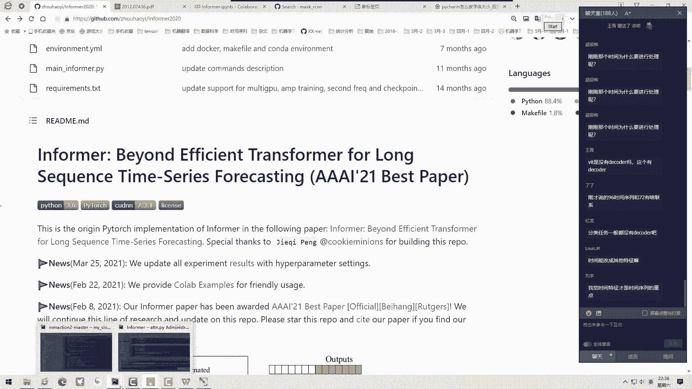

说完吧，咱今天一会有点说完，我也不想拖这个东西。之前啊同学我真没想到这个东西能能讲这么久啊。嗯，我我我我当时寻思一个多小时差不多了，因为我自己抵bu一遍，我觉得贷款量不是不是特别多，咱继续吧，兄弟们。

我们继续吧。😊，来，兄弟们，你们帮包包包帮帮我给这兄弟回答一下，为什么要把时间拿到更多特征。说白了就是更多特征，你才能有更多的信息啊，这是必须的一件事儿啊。😊，来，我们继确声音小吗？最后同学说我声音小。

我我也不太确定声音小不小，兄弟们。😊，时间特征很重要，时间特征是非常重要的。你因为你想一想时间序列，哎，你你时间序列当中什么对结果影响最最大时间对结果影响最大。比如预测这个温度，那8月份温度就高。

12月份温度就低。那你说时间重不重要，时间当然重要了，时间序列时间序列当然是呃要搞这个时间了。😊，来，咱们继续啊，刚才我们说到这个啊就这里边人家的attention，注意这一块啊，咱们也不同了。

正常的attention是不是我们的Q和key算这个内机，然后再去做我们这个soft max一个操作啊。这回咱不试了，我们不是Q跟key内做内机了。我们在Q当中。😊，要做一个筛选。

我这也拎出个值Q当中我们选出25个啥意思？就像是我们说序列96个，96个序列，它一定每一个都非常重要吗？对于时间序月来说，什么重要。平淡无奇的时间序列不重要，就像我们活着似的，我们活了。

可能我们活80年，咱们活这80年当中如果说咱们有20年能比较精彩的。哎，你给你孙子以后讲，哎，我想起我当年咋咋地的，你给他讲讲你就是那20年比较光辉的事迹。

你不用把你这80年每一年做什么事儿都说一说是不是？那对于时间序液也如此。😊，想想实间学当中哪些比较重要，哪比较重要拐点拐点重不重要重要啊。哎，这些中心哪比较重要啊。比如最高点也重要，最低点也重要。

所以说这一块啊，咱们需让模型学是什么？你不要学我平平淡淡的一生，你学有什么学我就怎么说呢？就是既有既有人生巅峰，又有人生的低谷吧，你给你老了以后给你家孩子讲故事，估计你也会讲这些故事。

咱们任务当中也如此，我们要选什么9六当中该大家说选25个，这个是这篇论文当中啊给出我们的一个经验值啊，但实际任务当中你爱选多少个，这是我们自己去定的一件事啊，来看怎么做的吧。😊。

首先是不值这些值不用强调了，说一万遍了啊，咱们不给大家去说了。来QKV这块做一个transpo操作。看transpo完之后，结果32bach8m head当中，我们投的个数96序列的长度64。

每一个token所对应向量的一个维度，是不是都有了QKV它们的维度都是相同的，都是这个东西。然后接下来。😊，他起个名字叫Upart啊，其实起名叫什么无所谓了。我跟大家说一下，它是什么意思。这一块呢。

它是嗯其实啊它是算了一个对数值。我觉得这个东西啊，反正你就当做给的一个实验值，跟给的现验值差不多的。你看我们得到结果调得多少等25，它是前面乘了个系数乘上了一个5，然后又乘认对数这个东西。

我就觉得这个东西反正也没啥说法吧，你承认了对数这个东西，这有什么说法，什么讲究吗？刘也没说成了5有啥讲究也没说，其实我估计大概觉着96当中选25个，还有这个比例是差不多的，所以这一块就选了1个25个啊。

这种感觉。😊，然后接下来啊，这也是25啊，就是反正你就当做吧，一会儿咱们的96当中你就当做选25个就完事了啊。不重要的东西我就得我就给大家不一个就强调了啊，咱们主要说重点东西，重点接下来来了。

我们来看我们要在这个Q和这个Q当中，这一块有simple simpleim查选25个，这个就比较重要了啊，我们来看怎么去做的，还是把鼠标往这一点。😊，我们来看呃，这个我直接contrl点，就点进去。

点进来之后打上断点来看怎么去做的啊。shift个值这几个值啊，咱都不用去说了，挺简单的。第一步再家来看，我给大家这么说啊，这边这边有点难度，因为这个代码嗯就怎么说呢？就是理论上没什么难度啊。

但是代码上说有点绕一些。我们现在看这个K。😊，现在这个T是4个，是不是3289664这一块它做一个什么？它这一块在-3这个位置加上一个维度，然后去exand一下exent当中，大家注意它扩充什么维度。

96，就是这个你看这个这几个也没变啊，328，然后接来9696，它扩充了什么呢？大家注意它扩充了一下我们第负3个维度，我给大家来看，你看吧手上这一点。😊，在这块当中啊。

就是这个96前面就是8和96中间又加了一个维度，做了一个复制，复制什么？复接来又复制出来1个96。我们来看你看得到这个维度结果。😊，你看加上个纬度边什么？32、8、96、96、64。

相当于把所有结果都复制了96遍。注意这一块，我们是呃相当于复制吧，这块我们扩充一个维度，我们进行一个复制。大方方说哎这个复制他会做什么呢？我们继续往下看，就我一开始看我光看这个东西我也不知道复制要干啥。

咱们继续往下去瞅，看他复制要去做一下什么事儿。😊，接下来啊咱们也知道我们就要复制完之后啊，它是96乘96的。然后接下来呢这个任务当中啊，我们说哎咱们做一个随机值。😊，随机值是啥意思呢？大家来帮我看啊。

这一块我们要做一个随机采样。在我们随机材样当中，这里它是96个，这里它是96个，这里它是25。我给大家说啥意思，这里边我再给大家解释一下什么叫边用边查就是你们说你们这么看就to这个专这个东西。

你能知道啥意思吗？如果说你忘了就第一个是啥意思，第二第三怎么办？就复制百度，我给大家示百度去查啊，但我用的多，我知道就第一个值第一个值它96，就是说我们取值范围是它默认值是从零开始。

就是它的第一个值取值范围，在0到96之间我们选择一些数值啊，这边写个96，就是说取值最大值960到96之间去选随机选值啊，这是说取值范围。第二个。😊，第二参数叫这个size，就是说你采用完之后。

我们希望采样出来的结果。大家注意我们采用出来的结果多少是96乘25的一个矩阵。大家来看这里是96乘25的矩阵，啥意思？😊，刚才我们构建出来了96乘就是大家注意这一块，至不有点绕啊。嗯，怎么说呢？

你到时候还得自己提拔一遍，96乘96是不是我们扩充一个维度嘛？相当于增加维度，增加维度也是96。接下这一块这一块我们选完之后它是多少？我换小点B，这一块我们选完之后。

它是1个9625是不是9625啥意思啊？对这96当中每一个，我要看一看你跟这25个之间的关系是啥？所以说这一块大家选完之后，注意啊，我们采样是随机进行采样的。我再给大家去捋一遍。

为什么这一块我们要进行一个随机的采样。来大家看这里。😊。

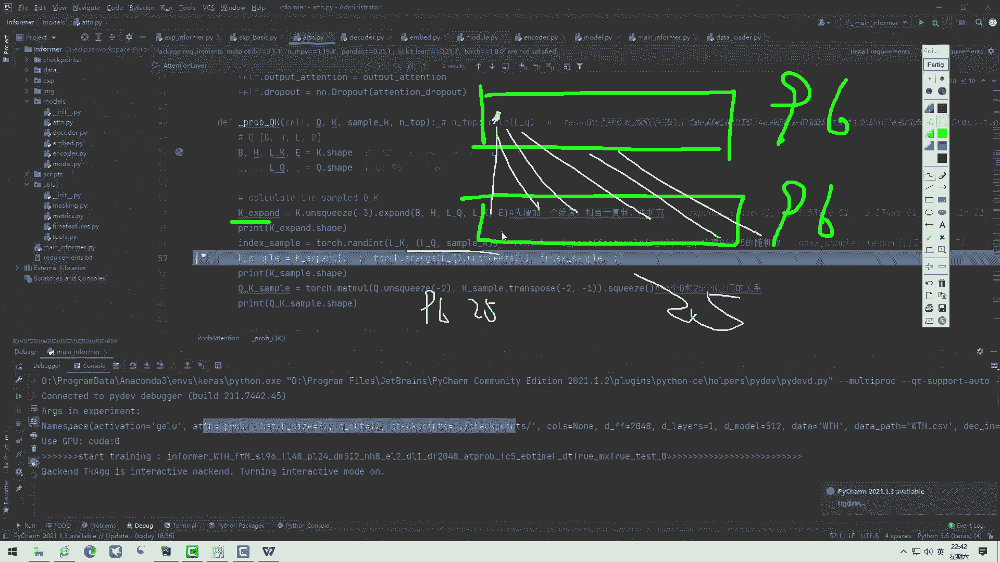

看一下我们这个PP当中呃，我给大家找啊，在这在PPT我记得跟大家说过。呃哦，这儿呢大家来看。你看啊就是说我们现在找出来，这这是我这前给大家讲PPT对大对大家讲过的东西啊，咱再回顾一下。正常的。

我们现在找这个Q，是不是？但是我们说现在啊我怎么去找这个东西呢？来，大家这一块我重要的Q啊，不用咱们去算那么多，选出多少个，选出来其中的25个就行。这里大家说这样一件事。

回去再理解理解有咱们的思想这一块我们再选Q的时候，我们要选择出来的是随机的有这么25个。嗯，其实我感觉说的还是绕为大家再看一看。😊，这是Q和K的一个故事。我看我之前PP当有没有。😊。

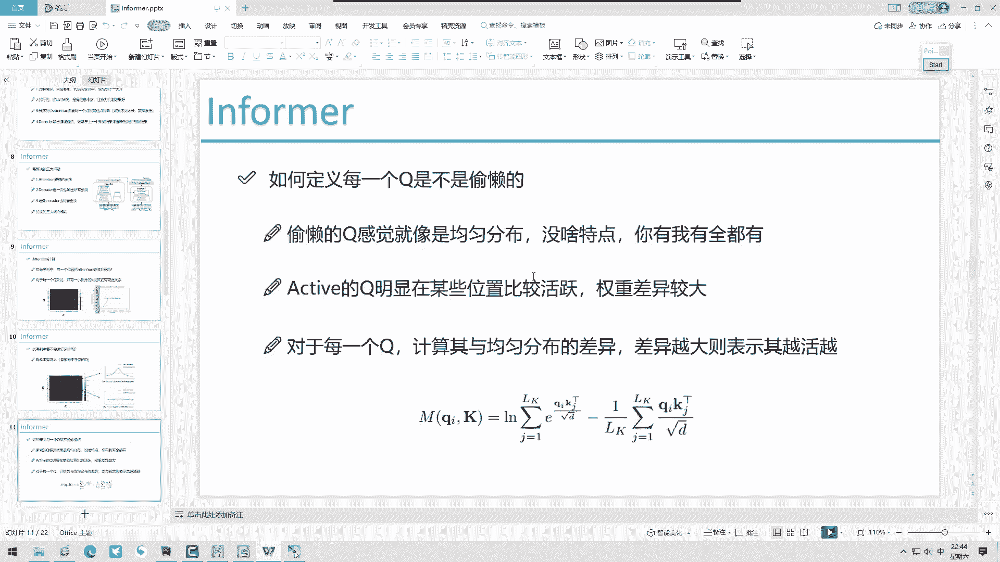

呃，来吧，咱们咱们接着接接着往说吧，来先记住这个这个数啊，9625，这是我们随机采的结果，它是9625。然后大家注意把我这个随机的index值传给谁了呢？这一块需要大家注意一下，传到谁。

传到的是key当中，我们扩充是谁，扩充的是一个K的维度，就大家可能会好奇，哎，现在我们应该选的不是Q吗？看老师你不是说在96个Q当中，哎，去选择出来一去选择出来25个比较重要的Q吗？

我们该才不是这么去说的吗？但是我们现在为什么是对key做操作呀？😊，这个问题就来了啊，就是说你Q当中怎么你哎你你靠什么评判出来这96个Q哪个Q好，哪个Q不好呢？我们之前是给大家去看那个论文了，论文说了。

他是这样的啊，他说这里边是96个Q。96个Q当中呢，大部分Q平淡的过了一生，什么叫平淡？就是平淡的过了一生。😊，啊，就这种感觉，比如这是Q1，这是Q2，就是第一个token。

每个token跟其他之间的关系都是平平淡淡的啊，都是就咱们怎么说呢？平凡人过一辈子吧。然后比如说我给大家说一个不平凡的这个Q4它就不平凡的一件事，他经历了人生的大起，中彩票中了3000万。

又经历了人生的大落啊，彩票把把彩票整丢了，没对上角，然后最后再去大起大落，就这种Q我们希望为啥它是有爱恨情仇的，有鲜明的一个特点的，它能把它的特点体现出来，我们提特征，其实我们不要平淡无奇的。

我们希望一些有特点特征，是不是但是有特点这个特征，我问大家，这个Q怎么体现出来的。😊，我画这个线，我的X轴是什么？我这个X轴啊，这块有点难度了啊，就是哎呀这个这有难度，就是跟K的关系。

是不是这个线咋算的？是不是K一K2一直到我们的K96啊，是不是这样一件事啊，所以说Q4哎他是有这样的一个故事的那接下来大家想怎么去判断出来哪个Q他的人生过得比较精彩呢，他是有这个量起伏呢？

是不是看这个Q跟K的关系啊，但是我在想，比如说我现在这个Q4哎，这个Q4啊，我或者说从Q一开始吧，Q1我要跟96个K去算Q2，我也要跟96K去算Q3，我也要跟9696K去算，就像是你你给别人讲故事。

你要给别人讲你96年的故事，是不是太多了，人家听不完，那怎么办呢？咱们这要做一个随机采样，什么叫做一个随机采样呢？他的意思就是说在我们这个K当中，哎，我说你对于每一个来说呀。

我说我不去听完你96年的一个故事，你随机的告诉我你25年，你这个人要做的你这个人的。😊，人生要比较精彩的，你应该是随机选入25年都比较精彩的。就像这样一样。哎也很清楚表现出来了。

随机25个怎么样也是比较也是也比较精彩的。就像你考试一样，你考试考96个题。哎，我说你总分挺高的，你随机考25个，你总分也挺高的。那啥也不是呢？考96个题，啥也不是考25题，它不照样啥也不是吗？

所以说这个任务当时大家注意啊，我们现在对谁做采样。我们现在在做一个K做采样，这个需要大家注意一下啊，就是有点绕，但是我希望大家知道我们要去干什么，我们现在是在K当中去做这个采样。

我们一共有96个Q96个Q当中每一个Q都会对应96个K，但是我现在希望96个Q当中每一个Q，你只对25个K做采样，这样能大快这样能非常快的让我们的计算速度变快起来。所以大家看这里。😊，这里边当中啊。

大家来看这个任务当中，你看我们这个key当中取什么bech这个维度，m维度都都不置都不管。接下来取什么？大家来看，接下来来取Q当中这96个，然后呢key是取谁？key取谁？兄弟们key当中啊。

这96不变key当中是不是说我们这个index simple indexdex simple是什么？我们随机去选的是不是这样一件事啊？所以说大家注意每个Q跟随机25个K要去做这样一个计算。

这是我们采样出来的key。来，大家注意这是我采样完的K你看。😊，最后25是不是啊，这里给大家说了，对于96Q当中，每个Q跟K它对应的一个关系是谁？这25它就是具体的一个随机索引。

这个随机索引值是咱们从0到96之间的。大家看这里。😊，这个数是1个96，所以随以所应值是0到96之间的，这个大家能理解吧。来再往下再往下能干什么？😊，再往下，我们就要去执行咱们Q跟key之间的关系了。

这是啥？这是大家看这个名字，这是我们的Q，这是啥？这是一个key simple，这是我们采样完的啊。大家注意，这是我们采样完的结果。这一步定完之后，大家看结果，你看结果一定是9625。😊。

32ch8m8种关系，96什么96个Q跟25个K跟它96个Q每一个Q，我跟25个K之间的关系是不是就算完了。大家注意啊，这个K是我们现在这里做了一个采样。好。

这一步96个K跟2096个Q跟25K关系都做完了。我们现在是不是心里有数了，这Q一咋地的，Q2咋地的Q3Q4，然后这K都是随机存25个，我们说是不是关系都有了。接下来要干什么？😊。

接下来我们还没我们还这样事没做完。我们还要去判断一下当前我这个Q它到底是我像化的啊，就跌宕起伏的。哎，这个人生比较精彩的。大家看过那个康熙王朝，康熙王朝当中怎么样，就是那个那个他要闪挨着那个太后。

太后去劝那个康熙要去那个薛藩要去打败那个吴三桂，就说你在人生当中哪怕有一天干过一件司幕江，一件惊天动地的大事儿，你这辈就值了，这就是说我们的Q当中找一找哪一个他干过什么惊天大动地的大事儿，那怎么找的呢？

大家注意这里。😊，怎么去衡量这个Q，它到底干嘛过大事呢？就是不是成大事的人呢？来看这个公式。😊。

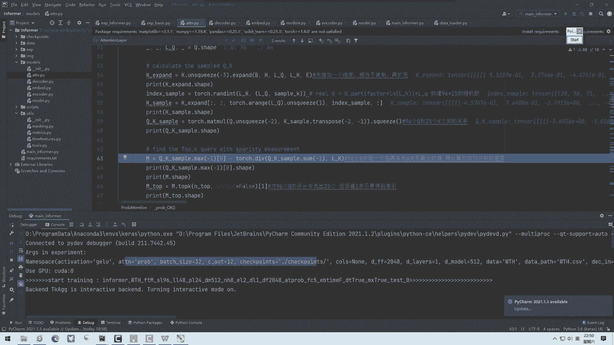

啊。怎么说呢？就是论文当中啊说的极其复杂。论文当中当是我看少了，但是你直接看这个原码，它就很简单，怎么做呢？第一步嗯，我们来看这个第一步啊，哎呀我们来说这这个东西吧。😊，这个这个是我的啥。😊。

这个其实不是这个公式，我找一找，我看是哪个公式来着，是一个max啊，这呢是这个公式。我就说嘛，怎么不像是这个公式来大家看我们现在对于每个Q求个什么呢？求它最大值什么叫求的最大值。就像我说的。

就像是你接下来啊要去给你孙子讲你的故事，你会讲什么故事，你最牛逼的一件事，你干过最大的一件事是啥，而不是说你讲二三十件都那么差不多的，人家听着也没啥意思。

就像我爷给我讲当年发射导弹咋咋地的我给给我说啥了，说这些事啊，就找一件什么意思？max。😊，你跟25个Q，你跟25个K之间啊都有都算出来了。你25个都有这个关系，找什么呢？找最大的一件事儿。

什么叫最大的一件事儿？你的关系最紧密的，我给大家画个图吧。

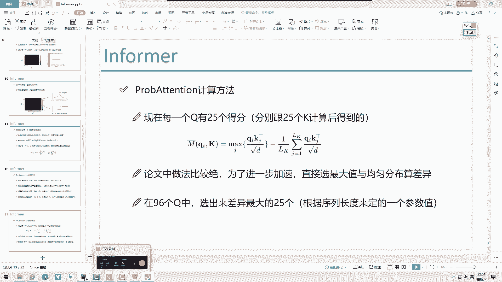

挺绕啊，就这一块。挺绕，但是我尽可能给大家去描述吧，就就这样，就这个Q一我给大家说，它是这样哎哎哎。😊，哎，最后这么高，你说他选的Q是谁，他就选最大这个点，他就选最大这个点，他只去讲述他最牛逼那一次啊。

最以说大家来看这一块，在QK simpleim当中，我们取什么？第二max-1。😊，取它数值最大的那一次数值最大那一次当做是啊它的一个结果。这个零我想一想，这个零应该是它它的一个数值吧。

应该反回它具体的一个值。好了，这给大家说了一下，就是选它最大就是最牛逼的一次。然后接下来呢他最牛逼的一次，那我们做个比较啊，他最牛逼一次他有多厉害呢？跟谁去做一个差异呢？

大家来看跟什么跟一个均匀分布去算它的一个差异是有多大的，均匀分布是什么？就是我们QK当中哎，就是所有的Q当中，哎，我们算一算，就是Q2Q3一直到我们这个Q96。他们的一个平均分布，哎。

就大家都平均什么样的，算我最牛逼的一次比咱平均分高多少分，当我我考试成绩最高那一次比咱班平均分高多少次，我就能拿出去回家给我爸说让我爸给我买手机啊，就是拿出去吹这个事。这一步大家能够能理解这是。😊，来。

大家看这是我们做这个平均，是不是咱们先对它总数做一个求和啊，再求一个这样一个平均操作，这就相当于我们平均分布了吧。这里大家注意啊，就是说对于每一个Q，我都要算一算，它最牛逼那一次，你跟平均差异有多大。

那我们来说什么呢？你最牛逼那一次你跟平均差异比较大。我们就说你这个Q挺精彩的。我们要在Q当中一会做一个排序，把它的分值由高到低去排来大家看我们现在执行啊。😊，截完之后大家看这个结果，结果领于什么？

97果没变，还是8还是32896，但是这96表示什么？这96表示96Q当中的每一个Q啊当中它最牛逼那一次跟平均的一个差异是等于多少的。大家注意这96啊，表示什么意思？你看这个你就看这里吧。😊。

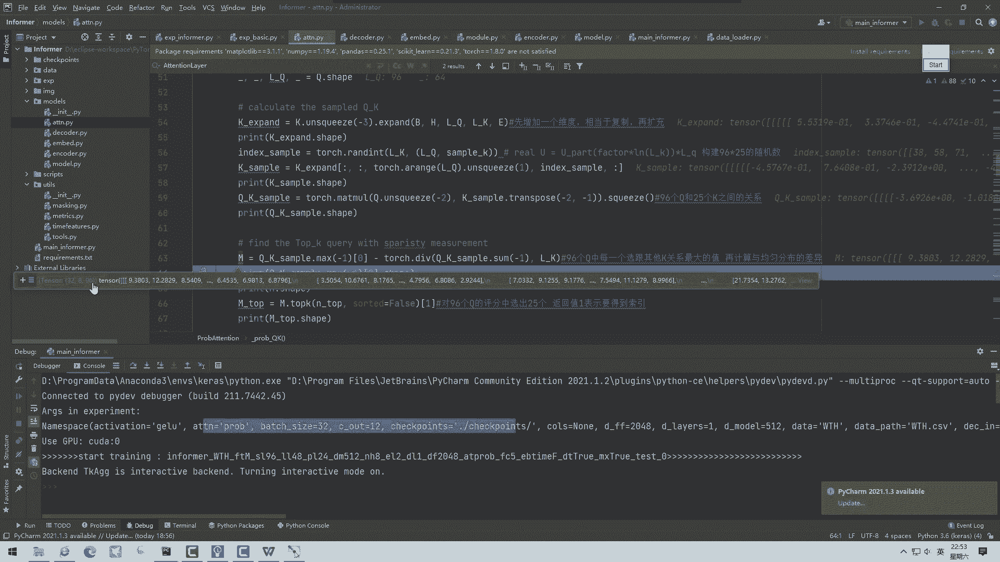

来看这个任务当中，这是不是一个max操作，maxJ啥意思？你最强的那一次，你这个QJ嗯给大家说细点，看这个J的角标是在哪儿的？这个角标是对于K来说的。你这个Q啊有25个K。

我要看一看你跟哪个K是你关于最紧密那一次代表你的一个程度代表你最牛逼那一次啥样了。来注意这个角标减去谁呢？😊，减去平均的LK是咱的长度，这不就是96吗？

所有的长度加一起之后来算一下跟平均的一个差异是不是就可以了。好了，这一步做完之后，咱是不是就得到了哎96Q当中每一个Q的啥，它牛逼的程度是不是叫的得分值也行了。来每一个牛逼程度，咱是不得完了。

那怎么办呢？我们说我们去干什么？选一个topK呗，topK啥意思？选多少个来追这个是25是不是对他做一个排序，在96当中你得分值都有了，考试一下了，选什么，选那25个最强的不就完事了吧？来看这结果。

32825由96变成25了，选出来25个最强的是不是就行了。那现在我们这个索引，大家看这种索引。😊。

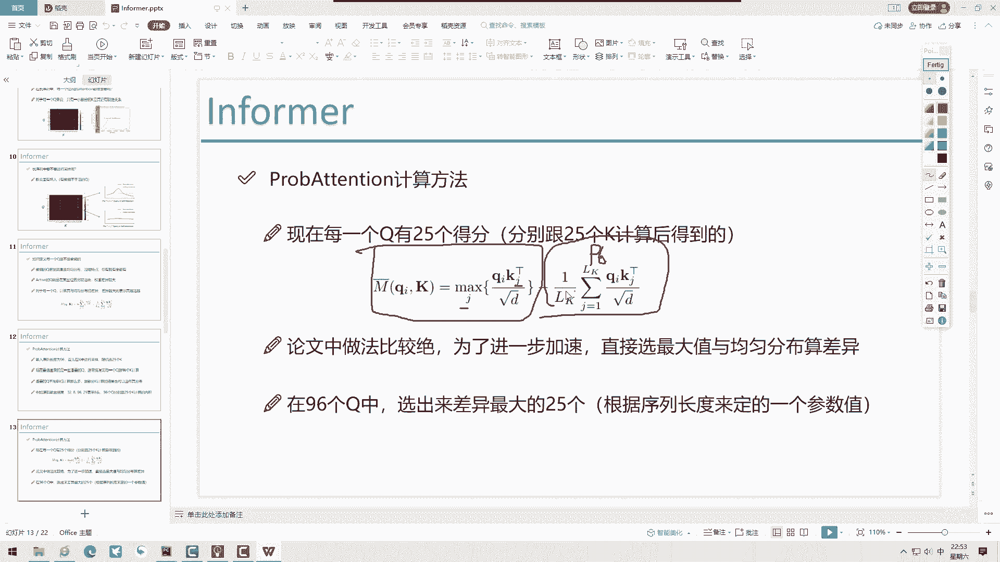

这个排序完之后，我们返回的是一个索引值啊，注意这块返回值我写个一，返回值是理由是返回一个数值，返回一是返回个缩引这块呢，你看我们把这个索引值都返映出来了，这都是我们的索引吧。有了这个索引之后呢。😊。

我们把这个所引传给晒？传到实际的Q当中去找这个东西是不就行了。在原来看实际的Q，实际Q是96，是不是96个当中去找出来你那25个不就完事了吗？大家看这结果，328、2564是不就完事了。

这一步操完之后啊，咱们现在相当于得到了啊，就是采样完的25个Q，但是大家注意这个流程，25Q哪来的，是要通过我们跟K的关系，每个Q跟25个K之间的关系，然后再去排序，再去得这个中线。

那现在相当于什么万事俱备，只欠东风了，Q也有了K是不是也有了K没变要，兄弟们注意K还是96个之前给K和采样值位要算Q。但是现在Q25算完了。😊，25个Q要跟谁要跟还是96个K算。

他们之间的attention来算这个attention到底是多少。得出的结果是不是1个25乘上1个96啊，328、25、96。这一步做完之后，咱们的attention是不是就算完了，来费了吧劲。

我们终于算什么了，终于算完这个attention了。也就是说咱们公事当中这一步。😊。

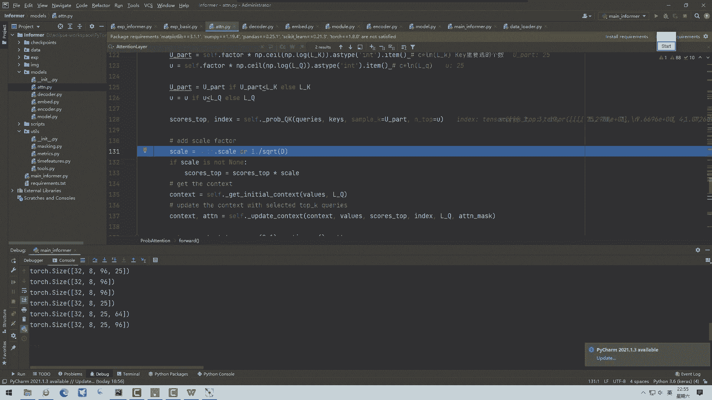

啊，来再再往下走，其实已经走挺多了，再往下去走。😊，再往下去走走哦，我看一看，哎呀，这个这个这个这个没写这个公式，这一步算完之后啊，相当于哎就是我们的attention。咱算完了。

这就是咱们的attention96个Q跟25K关系，咱拿到手了。😊。

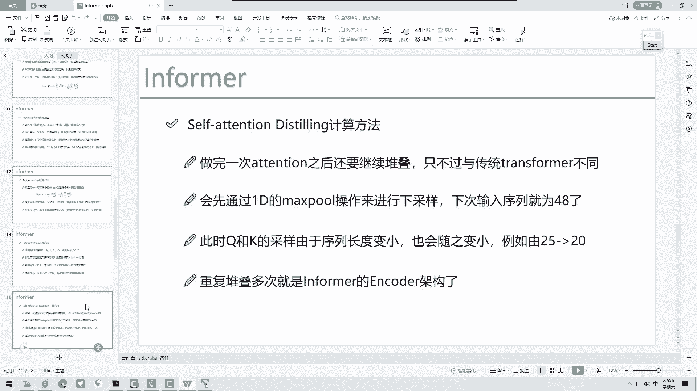

然后看大家有啥问题来看大家有啥问题。能不能理解？兄弟们，这一步能不能理解？这步有点绕了。是25K，什么叫两个Q，什么叫两个Q。

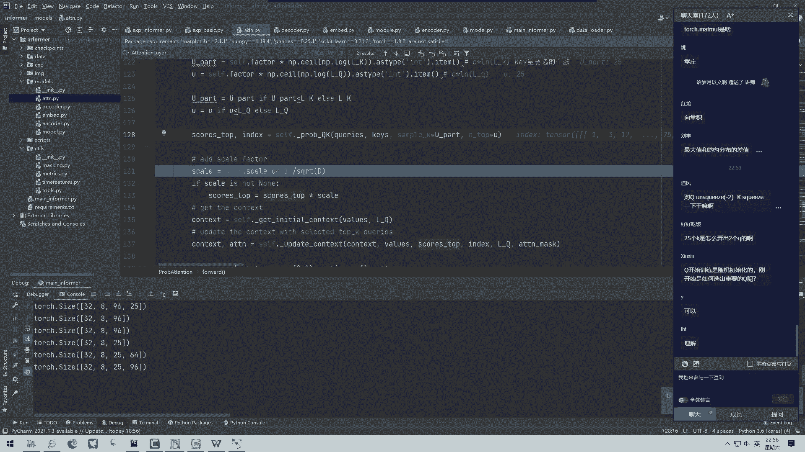

这块就是我这么说还好，你看论文去，就是大家你们第一遍看论文，我第一遍看论文我都看傻了。我我我我我都想问题，我说25个Q为什么论文里边公式要给我取25K呢？

我当时我都怀疑我说这个论文是不是是不是公式写错了，为什么我在K上做采样，不是在Q上做采样啊。哇，这个东西大家看论文，你你就会发现这样一件事了。论文当中贼难。真的。第一遍我看论文。

我我第一反就是论文写错了，绝对是Q采样，绝对不是K采样？😊，呃，25个P怎么弄成25个Q了？排序啊，兄弟排序啊，每个Q都会跟K算啊，算attention算值最大的一个。然后一会儿一会儿结合B。

一会儿结合B。对，原理有的原理有，大家需要看一看。对对对，就这一块，他是为了解我跟大家说，为什么要这样？他就是说他的意思就是说以后啊你的输入序列无论是多长的。这个比如说啊你的序列可以用到图像当中。

你的图像可能非常长是3000的。但是呢我们我们Q和K都采样，都采生30的，只要你的计算量就由33000乘3000的一个级别降到300乘300的一个级别了，就想一想人家计算方式，在你的图像任务当中。

在你的论文当中，如果你的论文想做一个点睛之笔，做这个事行不行，加快速度可以吧，是不是这个数量级3000乘3000的图像这个就非常大了，不像你这里96乘96了。

图像你可能真就是300乘3000再变成一个30乘30了，这个数变得会比较大，为啥全是数这是你当现验值吧，这就是一个线验值而已。

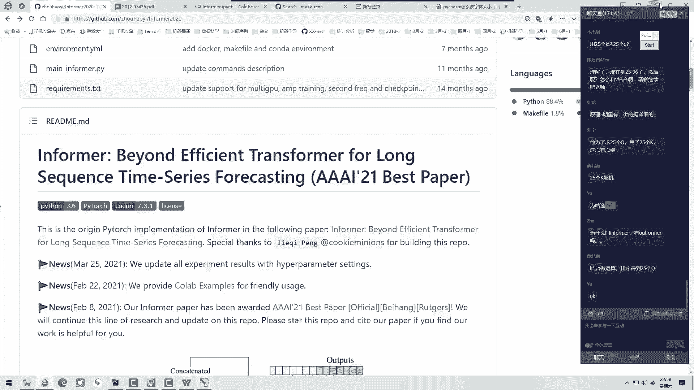

好了，来，咱们继续啊。代码里初始化QK刚才刚说完啊，初始化Q key咱们刚说完的全是参数矩阵啊，为什么叫informer不叫autoformer？问问问多文作者吧哈。加一个维度啊，兄弟。加一个维度啊。

不加维度，怎么去取这个数据啊？这个你要具体看代码了，到时候都打印一行打印，这都是细节的东西了。来来来来，咱们继续，咱们继续，一会儿就有下讨论。😊，行，现在呢我们把这个这啥做完了。

我们把这个tenion做完，是不是ten做完之后，接下来不要忘记这根号D啥意思。第看这个数值是64。之前咱们群里有同学问我说跟我说老师这个代码里边我没有看到对这个维度做了一些什么操作。

有没有咱们这样transformer是不是排除掉维度对接对接有影响，有没有说有了加加进来，把维度对接有影响，拷虑进来，再就个除法，然后继续。😊，继于干什么呢？来。

大家注意这一块就是sll值对我们结果再做映射，相当于排除掉维度，对结果影响。然后接来哎呀接下来要照这个V了。这个V这个东西啊，我跟大家说啊还有难度。

他们是Ecoder和deder都需要这个V在咱们那个Ecoder当中啊，这个V还挺简单的，decodeder这个V贼难啊，decode这个V贼难。我们先来看先看这个V啊，这块重点了。😊。

来注意这个V的维度，咱们这个V的维度啊，它还是1个32896、64，还是这个维度啊。然后看一下我们哲学的长度，它是96的，我们进去啊，来先做一个初始化，给大家跳进去，我们先做一个初始化。

在咱们这个数化当中啊，这一块这几个数值都挺简单的。我们来继续看啊。在这个任务里边，大家注意这块我们对V竟然算了一件什么事儿，正常啊大家帮我想。正常当中啊，咱们对这个呃就好比说正常。

我们算这个tention应该怎么算，是不是这个Q点上key之后，然后经过这个soft max，然后再怎么办？再乘上这个V不就完事了吗。但是现在大家帮我想。帮我想一件事儿，我们这里是不是做了一个采样。

大家帮我想，我们这里是不是做采样96K啊，Q1Q2一直到Q96，采样几个呢？采用出25个。那比如说我这个Q3哎采样了，Q96采样了。那没采样的，他能算出来这个attention，没采样的。

你有attention吗？大家帮我想一想，哎，大家帮我想一想，你没采样的，我绿色这个东西。哎，刚才咱们选2是，我没有它只有黄色这个东西，那怎么办？绿色的你怎么办？你能再去算滩势吗？

你不能你都没有你都没有啊，你只采了黄色的，那黄色能更新，它黄色哎，一会儿自己该咋更新跟咋更新，跟25摄前互相更新，哎，绿色咋办？😊，绿色咱们不是说它是比较平庸的吗？它比较平庸的，他该怎么更新。

比较平庸的，我们就这么说吧，它继续平庸下去吧，啥要继续平庸下去啊，那你继续平庸下去，光是他自己的吗？不是是啥？大家来看代码当中告诉你一切，读论文当中其实我也没有理解，他对这个东西怎么操作的。

因为论文也没有去细讲，论文当中只告诉我采25个，当时在想你采25个，没踩上人怎么办？你看代码当中是不是告诉我们这答案了，对V求均值啥意思？我现在有很多V啊。😊，我这个V1V2啊1直点到V96都有的。

把它们做什么，把它们做一个均值，是不是会得到一个平均向量。大家帮想这个平均向量怎么样非常平庸的就大家平均向量非常平庸的这个平均向量会交给谁呢？这个平均向量会交给绿色的之前没有被选中的没有被选中。

既然你只表自己的特征。那这样你用全局的平均特征来表示你自己因为你本身就比较平庸。我加上全局的思想呢，全局平均向量当做是你的啥当做就是你更新完结果就行了。黄色的重要的给你们ten做完之后该咋更新咋更新。

不重要的，或者说刚才没有算tention的，全部拿平均向量啊，这是跟大家说了，一定要看原码看一看V当中。😊，沿着啥沿着-二-二谁-一-2-296，是不是对96个求什么求这个平均向量来看这个结果。

这是不是平均向量就有了。有了平均向量之后怎么办？来，大家看一下，在我们这个任务当中，我们把这个平均向量给它交给谁了呢？交给到我这上下文当中，也就是说现在我构交往上下文。

咱们上下文当中啊都是平均向量就这块，现在我开始用这个conts这个东西，conts这个东西它都是平均向量96个现在都用均值来做替换了，为大家可以放大看一看。😊，哎呀，这是96它展不开，能展开。

你就发现都都是一样的。大家看这个数值，你看这个数值怎么样，是不是都是一样的，他们都是平均的啊，都是平均的。那你说接下来，我们是不是还有啥？哎，这只是做一个数始化啊。

我们说现在上下文都是平均平均的那我们说不是有25个Q，它不是平均的嘛？那咋办？来找我们刚才算出来东西，这一块咱们有一个s top值它是多少个是啊，就是这你看25个是不是2596是吧？来把它传件之后。

我们要进行一个更新，完之ctrl点进去，咱们看怎么更新的啊，来咱还是打断点。😊，在这个当中是个值咱是不是都有啊啊m这个操作咱时没有的。接下来哎咱们继续对这个25个，我刚才不是说了吗？

那25个算是transformer该咋做咋做，算什么？来去是不是去执行咱们的一个soft操作，你看正常执行soft操作算tention来执行完了，执行完之后怎么办？赋值了。大家记没记着，这是我该说的。

咱们一开始全用随机做处，全用平均做初始化了。但是此时我们要进行个赋值了，对谁赋值呢？😊，我们刚哪25个Q是不是都有唯一的一个缩引值啊？大家看这里25个是不是都有唯一的缩引值，把索引传进去。

在位置上找到这25个，这样是我咋更新呢？用attension乘上V。看我们的权重乘上V表示它对这25个做更新。那其他的原封不动保持不变，啥意思？其他的都是原来的均值啊。

你就这么当做96个当中只有25个做ten更新，其余的啊，你一点就剩下其他的吧，都是拿均值向量，拿这96个均值向量当做它输出的一个结果，这一步完成之后，咱来看。😊，啊，来这里这一步之后，我们返回这上下文。

第上文当中啊还是96、64。但是这96是我们更新25个，其他的都用均值来做一个替换了。好了，这一步咱费了好大劲儿，就大家一定要知道V是咋去做的啊，均值那个东西啥意思。这个大家去理解。好了。

那么现在来看一下，我们现在跳哪儿了。😊，这一步哎呦，我的天哪，就这。😊，就这一个咱讲了好久，讲了半大半个多点，是不是来这一个跟大家说了一下，就是录音当中啊比较核心的。

为大家看着人家这个gutitub当中，你看这一。😊。

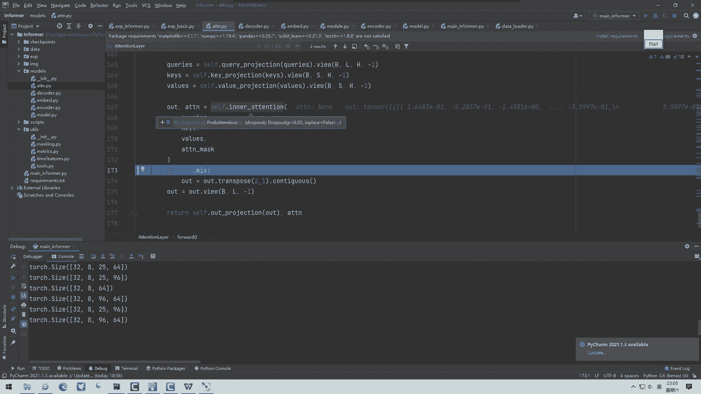

这里是啥？这里咱们哎呀，咱黎书完还草核呢。😊，讲了啥东西？来这一块我给大家说整个论文结构图。我们看这里我们讲完啥了，我们讲完红色这一块了。😊，看起来啊看起来讲了很少，但是没关系啊，就是红色是核心。

其他地方我们都是套用这个红色，其他地方都是套用这个红色啊，就现在为止，咱费了老毕大劲，把这个mhead注意看prob啊，这个self attention它是啥意思？大家能不能理解通过去选Q选Q啊。

咱加速做计算，一方加速做计算。另一方面，实验学当中，我也希望重点的咱多关关注补重点也提出掉，咱找红色这一块，终于是给他讲完了啊，来继续。😊。

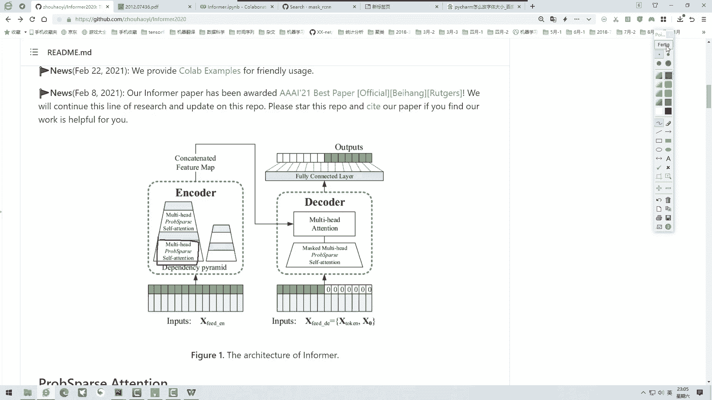

没完啊，他没有这个子操作来接下来来我们看把这个输入结果怎么样。一般情况下就是经过了transform完之后，这不是经过attenion之后嘛，我们要再连个圈员阶层是吧？

全阶层in features512output features也是512啊，给它返回为就完事atten没有它没有返tenion没有返回那个权重。

因为这训练论文啊它是后续会画了一些图画图的时候你可能需要这个权重，咱们做训练不需要这个权重这个东西啊好了，512512是不是有了来这是连个圈员接对结果再做一个映射好，这一步做完之后来再跳。😊。

这部段完之后来下一步做招泡这这一些我不用给大家强调了吧。想一想原始的transformer咋做的。原始的transformer当中是不是经过了一个ten认之后，再连一个FC，再连FC完之后。

再连一个什么叫残叉连接的操作，是不是来我们看这一块，接下来我们就要做咱们当前这个残叉连接的一个操作了。来看这里。😊，但是啊这呢这是残差连接的一个操作。然后下面这有个迷值操作，我给大家来说。

这个是残差操作，是不是原来的X没经过这个ten的，看X输入是不是没经过ten的，加上经过这个tens的，这是返回值加过加经过ten的做这个残差连接跟transform当中都是一模一样吧。

下面呢我为啥说这块做了一个迷值操作呢？😊，特别迷。呃，就这块大家来看吧，简单聊一聊就行，这是X。然后他说把这个X啊XY都一样的，这是Y吧，XY都一样的。然后呢，大家看这里这里边它是呃我看看啊。

对这个Y经过了一个卷积，然后经过ED卷积，然后经过了激果函数，然后接下来又对这个Y经过激函减积经过函数，然后再跟那个X加一起，它是这样，就这个Y，你就我他所谓这个卷积啊，你就当FC是一样的。

因为是ED的卷积嘛，类似的，来得到Y一撇，然后再点我说类似FC吧，然后得到那个Y两撇，然后他是把这个X跟Y两撇做个加法。😊，这步操作是迷职操作啊，其实这这个YX还是等价的。一开始这个YX还是等价的。

看这里YX还是等价的，为啥说迷职操作挺迷的，就这块你不清楚为啥它又多余整这个东西，我觉得直接输出就行的。嗯，我感觉这个事挺多余的啊，就是就做了一个加法。虽然说类似残差连接吧，也没啥太大影响。

至少比原来差，但是好有点多余。这块是我觉得人家做了点多余的东西啊，来把这个结返回。😊，翻完之后，咱们看做哪了？来这一步。做完之后，我们看啊咱们输入结果，输入结果还是没变的。

32、96、512输入跟输出纬度是不变的。但是我们也经过attention，接下来没完。看这里我们就拿着it举例子吧，来看这里这块为啥是一个T形，为啥是个T形。我们都知道。

就是说基于这个transformer，我们再去做这个tention的时候，咱这个tenstion要做几次，我们这个tenstion咱不是做一次的，我们是要做多次的。

是不是当我们再去做多次tension的时候，我们第二次是不是跟第一次正常情况一样啊，正常情况下，哎，我们第二次跟第一次是完全相同的。但是现在呢现在我是这样这篇论文当中啊，它说了一个蒸馏这个操作。

什么叫做一个蒸馏呢？我大家举个例子。😊。

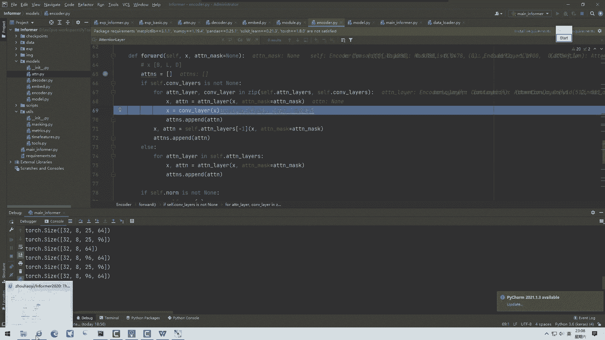

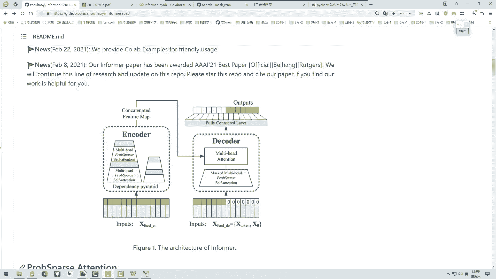

前面咱们用96的序列，我说表示我整理上下文，但是这块说做一个压缩，我给大家展开来看啊。😊，咱们展开展开看一看它是啥意思，这块的作压缩啥意思呢？你看啊是通过ED剪接输入512，输入512。

但是看接下来啊这块他多做一个东西，做什么多做了一个mpoing操作tra为2的一个mED的m啥意思？96两个里选一个两个里选一个接下来大家看结果它又怎么样。😊，你看这个结果变成3248，是不是？

所以说这一步操作相当于我们是做了一个采样。在96这个长度当中，我们做了一个采样变成48啊，就是人家这里边人家是往上画，你看人家是往上画的，咱们是往下画，其实一样的，这是96，这就是48了。好。

接下来我们做第二层，但是第二层当中我们就不是基于96去做了。因为它想速度更快一些啊。我所以这块做了一个采样，变成48了，48完之后接下怎么办。😊。

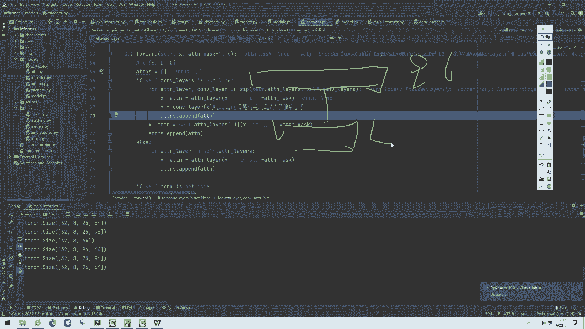

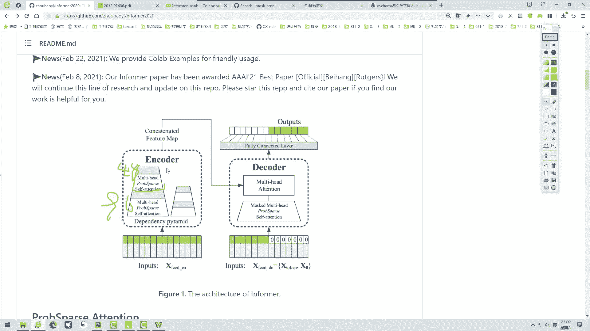

来，接下来这一步短转啊没完哦，我们会往往下再看。😊，你看这里边他又做这样一个事儿，我给大家看啊，这个我就不以往往外跳了，因为一样的操作，你看它是啥？😊，看一下这个名字。

这个名字来这里还是我们刚大家说的吧，这个pro attention啥意思？attention layers当中又做了一遍，又做了啥，又做了一遍。刚才我给大家说那个事儿，也就是说在整个任务当中啊。

接下来就是循环了，它是循环只有两次。第一次当中我们是做这个pro。第二次当中又做这样一件事儿。第二做当中啊有有几个变动点我给大家说一下，就是这块大家聊一聊就行了。原码就不给大家往里跳了，因为都是一样的。

就是参数变一变。第一个当中我们是96。😊。

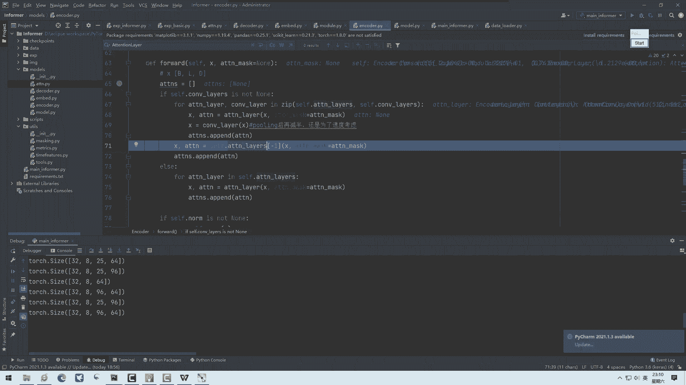

选25是不是？第二个我有点忘了，都第二个应该是现在已经变成48了吧。48当中选什么，那就不能再选25，不能选那么多了，可能是十0，可能是20啊，可能是48当中选10个是不是行了？那接下做输出。

还是输出48个结果是不就可以了。来，我们看这个结果，我在这打着断点吧，来，咱再往里去走，这个我就不给大家往里跳了，又跳什么又跳到相同这个层了啊，还是之前再跳这个东西，不给大往里跳了。

直接啊我们把这些咱就取消掉吧啊，来跳出我们这个断点，这个操作都是一样的，所有接下来操作都是我们跟刚才是完全相同的。我把之前断点，所有的咱都取消掉，直接跳出回来。😊。

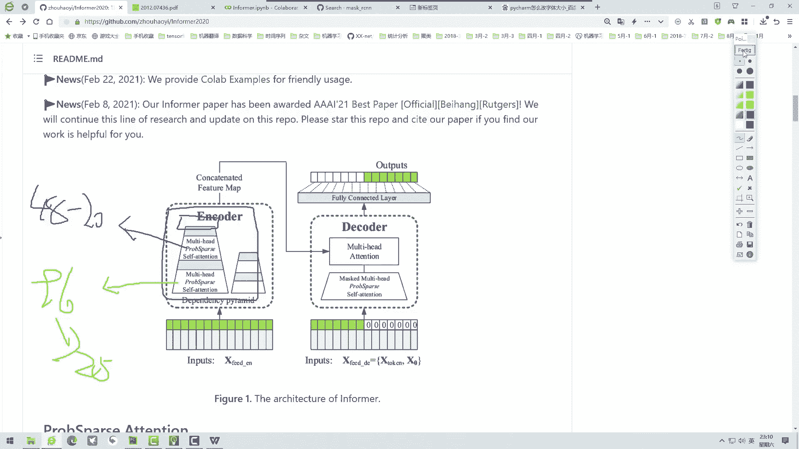

来跳入回来这一步钻业之后，我们来看咱们得到X变成多少了，是不是还是48的，相当于做的事是一样的。刚才做了一个事儿，只不接来我们输入大小变了，以及刚才选25个。现在我们选20个是不就可以了。

来再往下执行这个结果来再往下走。😊，啊，b那我这不说了。来，这个结果这一步做完之后啊，咱们相当于做完什么了。来大家看这个结果。现在为止我们才怎么说呢？就是原码当中啊，看起来我们这个整体架构跑了两行。

看起来跑了两行，但是咱说了好多，是不是咱们现在完成了Ecoder，注意这一块啊，我们完成了Ecoder我们编码层这里边咱现在就完成了啊，这一块编码层完成了。接下来我们要去做这个解码层。😊。

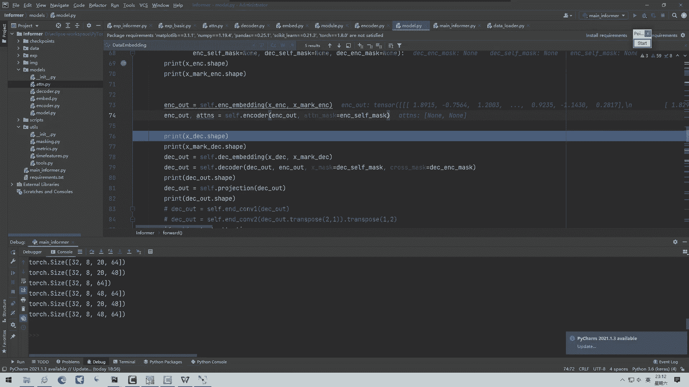

下面咱们就要做这个解码层了，来回顾回顾吧。这个解码层当中，我们看这任务当中这零啥意思啊？我们刚才述说了，有48个要带带我的这零的，咱们刚说零拿零做初始化的，是不是我们要去做预测的一个结果啊。

那接下来我们就要看咱们的decoder当中，我们要去做一件什么事了啊，下面费有这么大件，咱们终于要去说这个decoder了，一码当中，你看下面是不是都是跟Ecoder相关了，Ecoder大家不要有恐惧。

其实做法跟decoder啊，跟那个deder做法跟我们那个Ecoder是比较类似的啊。😊。

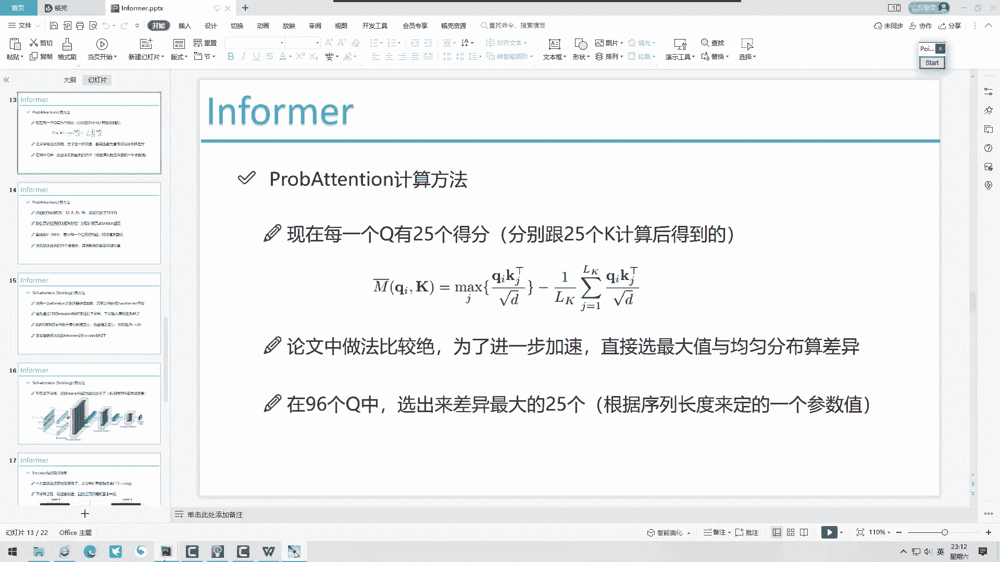

来看看大家啊，第沿着第二维度，沿着第二维度。大均做均职那个大家大家理解啥意思吧。我看咱们人数骤减了，已经干到100来人了。咱这个直播间人数不准的，谁际人数比这个少的多的。来，大家都能理解吧。

咱们准备继续说一会就说完吧，咱们再家坚持坚持，再坚持坚持啊。😊，来坚持坚持啊，然后已经木了，是不是嗯这个这个第一遍还好，你后续你自己再去debug一遍，那你木的地方多了啊，听我说可能还好一点。

自己你看这个论文原原码我估计会更木的，咱们后续还得需要自己再折磨一下自己来来，咱们继续说来咱咱咱们把这个底扣软件一起说完啊，还有还有挺多东西。😊，来来，我没事，我习惯了。来，咱们继续说啊。

下面我们来看这个dederdeder当中啊，其实我们做法一样的。来看一看我们这个deder，咱们的输入deder咱们输入啥？来注意，这是我们原始输入，来来看一看，我们做一下对比啊。

Eder当中对我们原始输入做了这个inbedding是不是我们这个de当中也要对我们的输入做inbedding这个inbedding是一模一样的。因为它俩的输入都是我们的特征和我们的时间是吧？

输入都是完全一样的。所以说这一块咱们做的embedding也是一模一样的。为呃这块还断点给大家看一下吧。😊，你看这个类都没变，这个类是不都没变啊，你跳去之后还是这个东西啊，给它跳进去。

你看还是这个东西它本身这个特征，位置的特征，时间的特征都做完之后返回是不是行了？这就抵code当中，我们第一步咱是没有任何变化的。然后关键就是deder啊，就是de扣这个层，我们接接下来还是一行去跳啊。

contrl点去啊，deder哎，这一块deder打完断点是不是哎，帮你去跳吧。😊，底后也也是一样，做遍利，给大家看这个layer是啥？这个lay其实这一块我们已经轻松多了，VR轻松多了。

就是接下来你看其实每一个层我就这里这给大家怎么说了，每一个层你看这个ten layer，这个pro tension layer每一层怎么样都是一模一样的呀，都是没有任何区别的。但是关键区别是什么？

大家来看前面两个词是有区别的。第一个词要什么呢？😊，第一个我们叫self attention。第二个呢我们叫做cross attention。也就是说在我们的de当中，最呃它是有两件事儿。

这个self attention它是跟我们那个呃Ecoder是完全一样的。大家来看这个self attention我跟我们说可以说这里啊跟我们的那个Ecoder是完全一模一样的。

decoder输入的是76个，76个之间要互相去算的啊，这个是完全一点一点变化都没有的。所以说这一步咱就不给大家去跳了啊，跟我们的Ecoder是一模一样的。就这里边大家来看。😊。

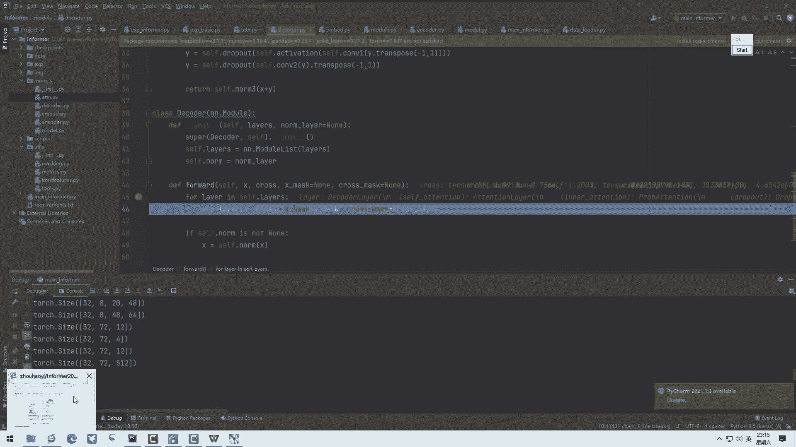

这里边这一步啊这里边这一步和这里边这一步它俩是完全相同的，是没有任何区别的，完全是一致的这样一件事儿。然后这块呢，为啥说呃它是有一个m这个东西呢？大家这么理解吧，它m作用是这样的。

就是当我们在预测值的时候，呃，你说我预测后天股票涨什么价格。我这个后天股票价格跟谁相关？肯定是跟明天相关的。但是我问他一件事儿。你说后天肯定要跟明天算这个关系，但是我说我问大一件事儿。

我想算明天股票的价格，我能知道后天的事儿吗？明天还没发生呢，后天更没发生呢，后天来的时候，我说已经后天了。哎，我说到那天的时候，他前想知道，但是我当前是明天这一天的时候，我要预测明天后天大后天等等。

明天能去跟后天算吗？后天还没发生呢？明天怎么跟后天算啊，所以说大家看这一块，他是什么。😊，来看这个名字叫做一个mus attention来看这个名字，名字只是多了一个东西。

其他的这个梯型是没变的这块我就不给大家往去跳入了，是一模一样的。就像我说的，你是明天后天能有明天的但是明天不能用后天的啊，这是加一个m表示说哎我们这个序列比到这了猜它的时候它可以用前面的。

但是它不可以用后面的啊，就这样一件事多了一个m这个操作好了，这大家说了一下，就是这有个m mask是没有的cros mask一会抵扣大家说吧。第一个这一块它就走两个。

一个是我们self attention，一个是我们的cro attention我现在给大家打断点。😊。

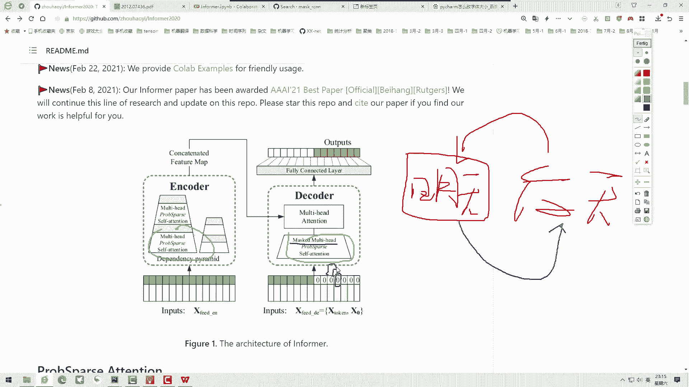

然后哦我看这个tenion layer当中那个那啥就是self tension，我想把这个断眼都取消了。然后咱们把这个self tension，我看图都取消了啊，都取消了。

是不是咱直接看那个c tension吧，往里去跳。😊，我看这是哪儿。哦，这跳到哪儿当中了，我看一下啊。来，我看看这一块，这一块是self attention啊。

这self tension咱咱往里跳了self tension咱不里跳了啊，咱直接跳那个croer tension来跳这个我看这个啊，这个它名字叫啥，我看名字名字叫呃ful attention这个东西。

atten layerten layer但跳我不跳了，直接跳for tension这个东西来跳这里。😊，哦，就这里是不是来直往里装，直接往这里跳，来直接跳这里了。

看一看我们这个cross attention。其实cross attention当中，咱的做法是没有任何区别的。咱做的事儿是完全一样的。跟咱们之前来我给大家看一看啊。

就是在这里跟大家说什么叫做我们的一个cross attention。😊。

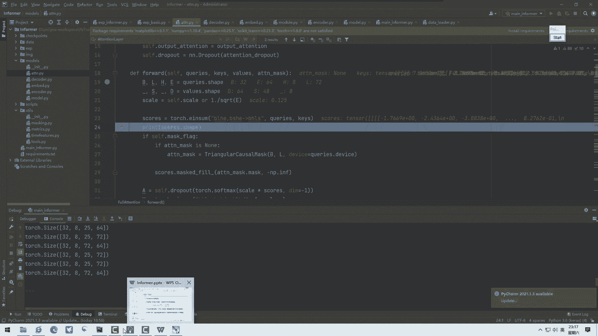

cscs它是这样，就我们现在这个序列当中啊，大家怎么去理解我们这里边多少个72，是不是？😊，72当中，我们这里边前面是不是说在预测出来48个了，72当中每一个我都要跟我展开吧。

都要跟48个当中的每一个去算啥去算它们之间这个attion做法跟之前是一样的。这就是一个cross attention唯一跟之前不同的一点。

就是现在我们不是就是在deder当中它两个一个是一个self一个是一个cross啊，它俩做法是一样的，就是对象不同self是我们就是说它是自己跟自己的cross呢就是deder跟ecoder之间的。

就这样不同啊，其他都一样，就是都跟我们刚才大家说这个模块是完全一模一样的，没啥太俩差异。好了，这块当中我就不给大家一个看了啊，内容当中都是一模一样的就完事了。这就是de当中，时大家可以自己咱也去走吧。

其实走的方法都是一样的。我们走的模块也都是一样的。然后看咱们收入结果。😊。

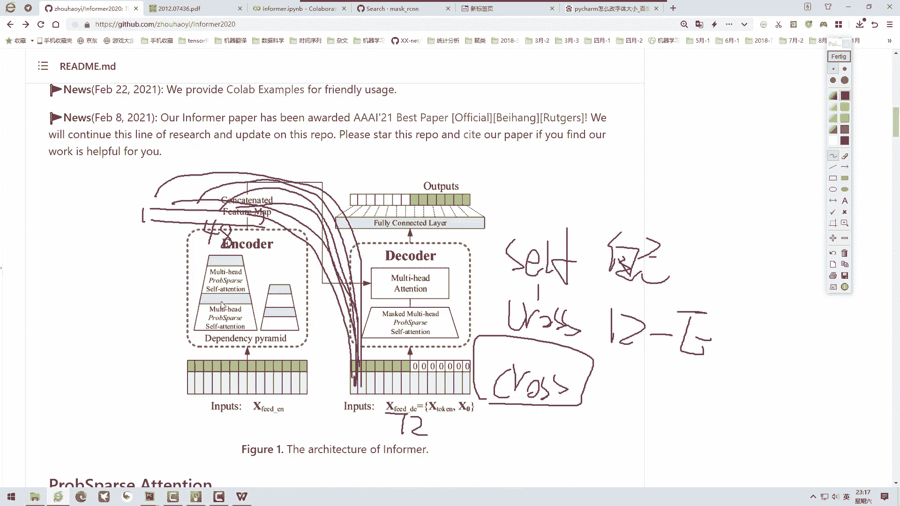

收结果其实没变动，还是多少，还是72，是不是相当于72，我们是走两遍，大家注意这一块，它是有两遍啊，一遍是我们要先走是selften啊，注意这个顺序，先走selften，走完selften之后。

接下先走我们的cross tension。然后接下来我们走完之后再连个圈接层啊，你看跟我们一扣的是一样，是不是再连圈接层还是512位向量，这就完了。来完之后我们接往下走。你看这一步。😊。

来来cross attention self这呢cros attention attention是不是都有其实啊唯一的不同是啥？唯一的不同啊，就是说咱们的输入是不一样的，其他的东西我们都是相同对吧。

没有啥太大的一个区别。好了，这给大家解释了一下，就是说咱们任务当中啊，你看我给大家看一看你看这个这是cross这啥意思。你看这个数猜出来我给大家再点开，你看这是啥3248。

我们说谁是48der我们96减变成48是不是你看这里X是我们的呃der输入cros跟我们的coder去做这块呢XX自己去做啊，是这样一件事啊，就要这么去理解吧。这样是我们做Q。😊。

对于我们的selfat QKV都是谁来的QKV都是我们的deder大家来看是不是都是X都这个X是谁？这X是我们的deder是72那个东西是吧？然后再看我们这个cross attention。

你再看这个cross attentionQ谁来的Q是我们的那个der的Q但是key呢 key已经变成der的 key了。你看cross？然后V呢是已经变成der的V了。

这样是不就是cros attention我的Q跟你的key和你的V来去重新算，咱们之间的一个关系，把你的特征融进来，是不这样一件事啊，好了，那这个之后，接下来到底是一样的？😊，还是相同的操作。

做咱们对参数连接，参数链接之后做个加法，来把截果值返回去。返回去之后来咱们胜利即将到眼前了。来接来把这个结果拿到手，我们来看啊。😊，来接下这块，我们做dederdeder输出，咱是有了。

是不是72都有了。那既要预测什么？😊，72当中我们要预测啥？来大家看这一步，这一步就是我们最终输出结果了。512预测12啥意思？我们要预测未来的一个时间点啊，就不是未来时间点，预测未来的一个值吧。

就相当于我们也是做一个多变量的一个预测。咱们这六务当中，我想起来了，它不是做一个单变量。😊，我们是做一个多变量的一个预测，来看这个结果，我们这个结果率多少。来大家看327212啊。

预测出来有这么12个值了。但是接下来我说没完啊，我们说这72值它不是我们多要的，72值当中有48个是说我们带带我们的有标签的，实际真实值，我们要的什么呢？我们要的是负我们要是其中24个，是不是？

所以说这一块做了一个采样啊，做了一个不是采样做了一个就是呃筛选吧，-24啊，就是我们刚才说了，前面有20前面有48个是带带我的，后面有这24个是要实际做预测的，把这24个东西拿到手是不是就行了。

来咱返回这个结果。😊，返回这个就完之后，来，咱这行代码是终于给它走完了，来看看输出322412，我们是不是就做完了。终于啊我的天哪，给他预测出来了。咱们这任务当中。

我我刚才我刚才一开始是不是说我们做单变量了，我可能记错了，他最后是做12指是做一个多变量预测，它做了一个多变量预测啊，MS做了一个多变预测。然后看看这个呃来看这个我看看预测值啊。😊，预测值这一块。

他有没有去做一个取值啊，没有的。它是取全部的，你看这是取全部，它说是负一或者是理1，这就说明是你预测是一个值，还预测是多个值啊这样一件事儿。咱们这儿预测多个值，也可以做多变预测，其实也可以做单量预测。

这个无所谓。根据你自己任务。那看我出出结果24个值，每个值预测12个标签是不都可以了。把这个结果返回去，那接然简单了，这是啥？😊，这是我们那个MIC啊，套上自带的预测值有了真实值真实值咱也有。

是不是维度都一样的。下面呢我说算一个损失，这咱不就算出这个损失了吗？算这个损失完之后啊，接下来怎么做，反向传播参数更新这个事儿是不是就完事了呀？好了，这给大家去捋了一下啊，就是说在咱们这个任务当中。

我们整体的流程，其实我们现在 debug的是一次迭代。后续所有迭代咱的道理，我们的方法都是完全相同的，这是咱们迭代的一个方法，然后再给大家去说啊，就是咱们这个预测。😊。

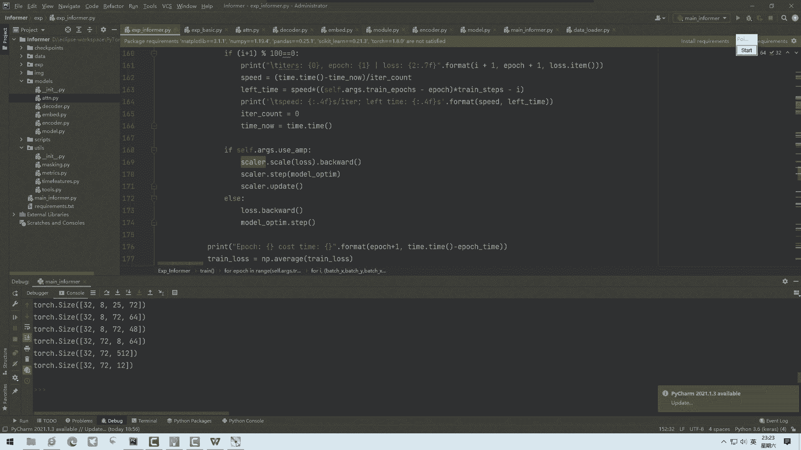

实际用这个模型实际用这个模型过程当中啊，这一块是人家给了一个脚本，就是怎么样去把你这个预测值和真实值给它画出来。这个脚本给的是现成的，以及论文当中这个图怎么画的啊，这个论文当中图怎么画的，都告诉你了。

我估计大家搞论文的同学能想到点东西了啊，是不是你的任务当中也可以画这个图呢？帮我tention，你说我ten这个东西，哎，我说我不会去改，那你把它做一个压缩总会吧。像这个方法式的，做个压缩说也行。

然后速度更快一些，也可以去提一提啊。这个预测的东西啊，人家脚本你可以给好了，到时候大家我们可以自己去玩啊。这个预测脚本其实也一样的。😊，就是用这个模型去得输出结果，我觉得它比训练还要简单的多的啊。

这个就是把训练当中一部分代码拿出来之后啊，这一块，然后他你看这块有预测，把数据拿出来之后做相同的预数理操作。做完预到之后，然后不断去输出一个结果，把预测结果给它画出来，很简单。这个东西。

所以这一个我就不给大家一细说了啊，我跟大说在哪在任务到这里。😊，他有个这个这个东西呃，就是自备踢的自备col这东西白嫖白嫖GPU白嫖玩都可以他玩起来。这个到时候大家我们也可以去玩一玩啊。好了。

这给大家梳理一下，就是informer这个原码吧，从头到尾，主要其实咱们今天主要说一说就是训练阶段，其实测试也如此的。测试大家后期自己看吧，这个任务当中，这里边是都有的，咱可以自己去玩一玩。

主要包括两点数据怎么处理，模怎么搭建。嗯，其实数据是咱讲的有点太慢了。所以说进度有点慢啊，然后这个原码当中其要这一块，你知道人家核心的一个思想，后面整理大架构是不变的，关键就是核心思想。

核心逻辑是怎么去玩的。😊，行了，来看看大家问题吧。😊，迭代迭代很多次，起码20个依po克拉。他俩没有组合。他俩怎么他俩没有组合的self attention输出的是向量。

向量之后再走cross attention，输出还是向量。经常无法提交，没没关系，无法提交，无法提交吧。那个我我们每个月会有那个什么，我们每个月老板都会让大家评价我们课程的，每个月我都会让大家扫码的。

到时候。😊，感觉怎么样？兄弟们。画图这里人家人家人家是论文当中，哇，这个论文真的开源的到位啊，真的开源很到位，把人家论文图怎么画的都都给你开源了，挺够意思，是不是？论文作者北北航的论文作者北航的。

我这个书据籍人家的不是我的嗯。这里兄弟们，这里啊百度网盘谷歌网盘自己下的，这都不是我的。论文图怎么画的这东西大家自己过一遍吧啊，人就详细的过程col labb当中。有的有的，我给大家录了啊。

我给大家录了，都有录播的。红龙应该是我们老同学了，第一遍学啊，第一遍学肯定难。因为我想咱那个课程进度快一点嘛，所以说哎呀也没给大家直播讲太有基础的，直接讲这个东西难度肯定有的。行，到时候都都都有的。

咱们这个PDL这都都有的。debug这个事儿啊，debug这个事儿怎么说呢？就是不是说。迪坝一次的需要花一些时间的。能CV领域论，咱们CV经讲很多了，我们四期大家想看CV之前讲论文，四期我都没讲其他的。

咱四期只讲CV了。都。这个压缩方法可以的，我觉得比较通用吧。我觉得相起来说是比较通用的。时间序列这么快，protenion有有意义吗？看看人家效果不仅是速度上，在效果上人间有很大的一个提升。

在效果上也有很大的提升。就出说十4呃，11012是那啥。最后输出啊24表示我要预测未来的24个时间点。24个时间点。然后那个12就是说24个点当中每一个点它是预测12个值。每个点他预测12个值。啊。

它是个多变量预测，不是一个单面量，每个点预测是2值这个意思。对，第一次出来的是一次出来的。随于写论文。首先写论文看有没有自己的数据集，人家这都自己的数据集啊，人家拿自己的数据啊，公开数据都里稍微照的。

写论文其实都差不多吧，我觉着检测分割，做人多，但数据也好做。所以路播明天会传的，明天会传的。可以分类的呃可以分类的。其实NRP啊NRP都是分类的NRP都是分类问题。论文画的什么图，就是来回到我们那啥。

回到我们那个讲原理的时候给大家说他那个图的。数据集大家自己看吧，数据集这东西。解码器mus怎么生成？mus克人为指定的？mus克是人为指定的这东西人为指定啊，倒三角矩阵人为指定的，只能看到前。

而不能看到后面人为指定的啊。每个点预测12值可以啊，他的任务嗯，为什么12他的任务叫预测12制？他的任务。人家这个任务叫预测12个，我也没具体看人家啥任务。公安数据集不好发，兄弟们真跟大家这么说。

公安数据集不好发。啊，你自己数据就好发，公开数据真的挺难的。decodeder mask前从前48个还是从24个decodeder是那啥，我们是会预测72个，就是这48和24都会做预测的。

但是最后取只取24个。因为这48个是有真实值的，这48个是已知的。transform做分类回归操作，体现在体现在输出层，体现在输出层和损失函数，只是输出层损失函数不一样。对，这跟命3是一样的。

有自己数据集加入代码。对呀，时间序列它这是通用的，哎，就是大家听完这节课之后啊，你自己数据集会被处理了。自己去数据咋处理是不是一样啊。就数据格式做成跟一样的，是完事了，不难啊，都不难，就啥东西有原码。

你去改都不难，你自己写可难了。你自己写可可可真难了。

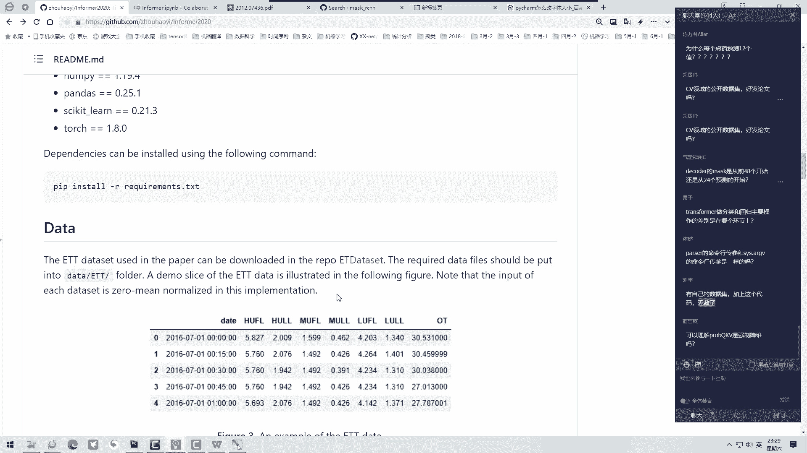

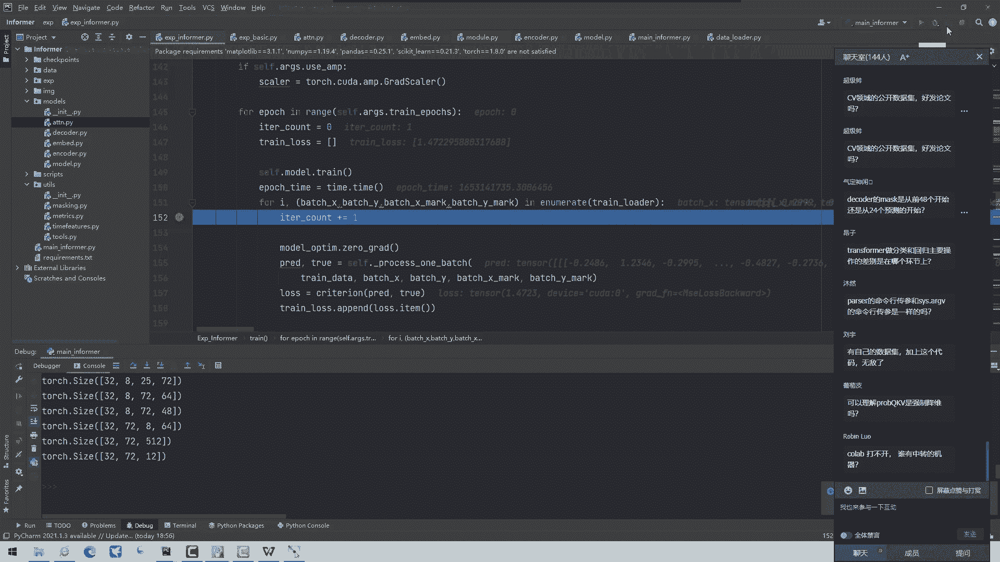

对，可以当做是强制降维。呃，那啥就是不是不是中转的机器，扎个梯子啊，咱们群里互相问一问梯子这东西。大家很多同学都有啊。哦哦，对，自己可能第一遍debug有点难吧。

但是这个可能在我们原码当中并不算难度特别大的。咱们我觉得我真觉着讲的难度比较大的是那个三维重建那个。我觉得可能三维重建那个源码是拿最大的。因为三维因为这个源码可能不需要花太多时间吧，就看看懂挺接地气的。

我三维重建那个源码，我看了两三贴。这玩意儿对这玩意不用标注，数据都固定的。25个是看论文吧，论文是指那个对数值。论文当中论文当中给这个公式是5乘对数96，指令个这个值，他指令个这个值。说实话原因为啥。

我也没我也没整明白，你就当个经验值就行了。对对，一定是我们上次跟国大家说了嘛，VIT的原码要给大家去看这个故事也大家去看。然后跟大家说一说就是。自己写论文抄实验过程，你这个抄这个词用的不准确啊。

自己论文是用人家源码套到自己的任务当中去改这个东西。呃，你抄可能都抄错的，嗯，抄这个东西我觉得难度还很大的。你直接套都是直接套的，在上面做微调啊，抄是很难的，超容易抄错。这个是为啥？

这我没我没具体去看啊，这个东西。图像自动标如咋标，嗯特斯拉都都不一定搞定的东西，这东西不太不太很难的这只有大厂，他们算法极其强大，才能搞这个东西。对。还有我跟大家说下声小啥。😊，下周呢跟大家说一说啊。

咱们四期啊给大家去讲了太多啥。四期我们是一个纯CV的。然后五期当中呢，接下来我们会给大家也是呃其实也是跟transform有关的。我们会给大家讲什么呢？呃，是偏一些文本相关的。

因为咱文本啊最近已经好久没更新了，大家会催索了，咱们讲这个东西讲ho face。我我会给大家先上传一个就是呃介绍这个东西的。然后下次课咱们因为我因为呃这如果介绍咱们放直播讲，我觉得太耽费大家时间了啊。

ung face我会给大家录一个小时左右吧。然后先给大家介绍介绍它是啥，让大家有基本认识。然后呢接下来我们明我们下下次课重点去讲这个 face，大家可以先不用知道是啥，你等我给你录完一个录播的。

会给大家提前录好录播，让大家做预习的这个东西很重要。😊，这个东西很重要，你就可以当做吧，就是CV领域当中，我们讲了什么，讲了MM lab这系列是吧？我好多都看到了。然后呢。

NLRP这个领域跟MM lab非常类似。😊，不能说一完全一样吧，比这还简单的就是hunging face了。这是现在最火的东西了。要大家说这个。啊，要大家说说这套东西。嗯，还邮费这个工具。

其实这呃到时候我跟大家说一说，下周需要预习的东西挺多的。how费这一套也是去transformer去做的，这个这个很有用，这个很有用。飞的很简单，咱们很多同学搞毕设的，都拿这个东西做的，很好用。

就大家就是进度尽快刷吧啊，我这个进度大家就。这就是尽快刷吧，因为咱这内容说实话也挺多的啊，内容挺多的。关键就是其实只要学会了我们这种debug的思想，你后续自己看论文，自己看原码也都不难。

也都也都可以去执行下去了。就这个事儿大家就多做几遍吧啊，我去看论文也如此，看论文一般啊就是。从来到尾从来到看一遍呗，第一遍看论文，你别说大家是懵逼状态，就第一遍我看这东西，我也懵逼状态。

我这个角标我对不准，我这个角标我对寻思这个这个这个这个角标都啥意思啊。那第一遍还能全这样，那很难都理解这么多公式，你看其实代码没那么难。但是公式写的，我觉得挺难的，里一遍去看，就是写作也是个技巧吧。

你这公公式里写的挺难写的，然后结合原码去看，我觉得就没那么难了，反正一般先看论文，然后再看源码没有原码论文就不要看，因为真的看不懂。😊，对face是以后大家做实际项目真的最大的一帮手。这这都神了。

NRP这个东西，其实我跟大家这么说吧，NRP有这个东西之后啊，你还要学基础吗？嗯，不太需要学基础了。CV我们讲的好多基础NRP我跟大家这么说，你有我们现在学这些东西基础。你再去跨到LRP这个领域。

结合这个face跟玩一样，很轻松很轻松行了，今天哎呀咱今天也是大家大家也挺辛苦的啊，咱们干到这么晚行，今天到这儿啊，兄弟们，然后下周我们会明天吧，明后天给大家说我们的留的一些任务，还会给大家留很多任务。

下周我要讲新东西了。😊，行，那就到这。兄弟们，嗯，今晚咱到这儿。嗯，兄弟们，拜拜拜拜。下周咱继续。下周我们讲那个航ingfaceCV跟LP其实很多本质都一样啊，就是输出和输据不一样。

本质啊大部分都一样的。呃，也不需要大家普多少技数。行，今天今天到这，兄弟们，大家拜拜嗯，大家拜拜。😊。

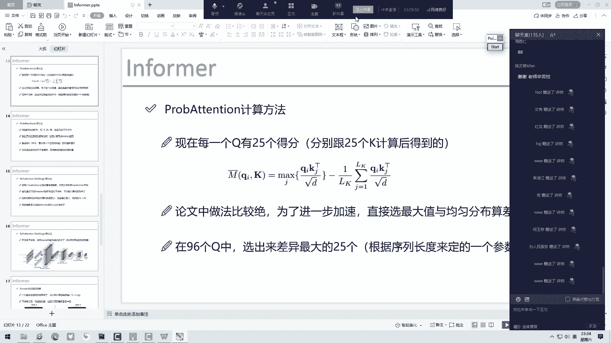

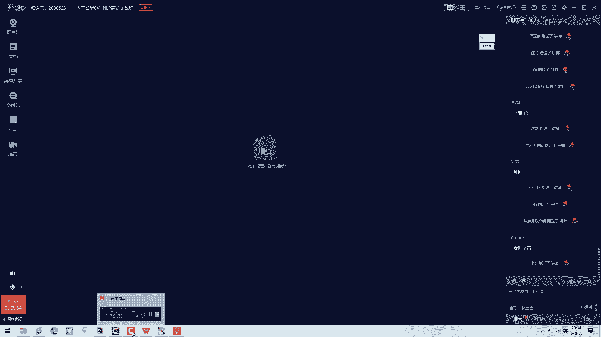