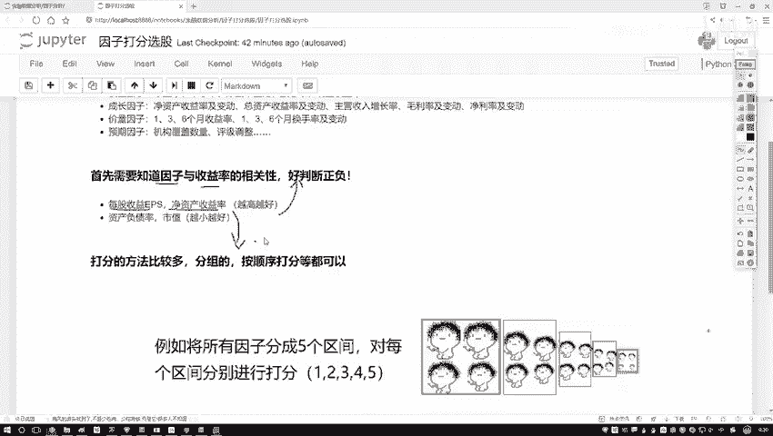
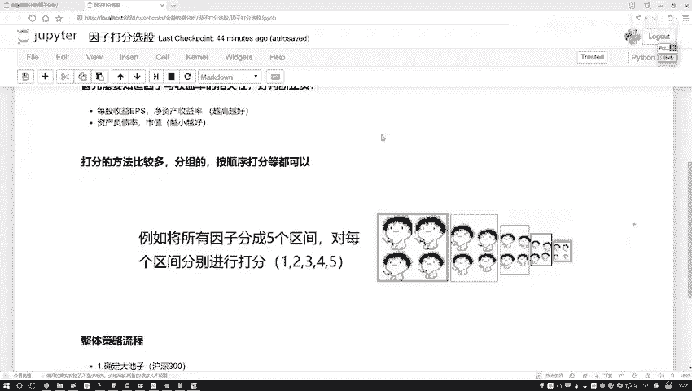
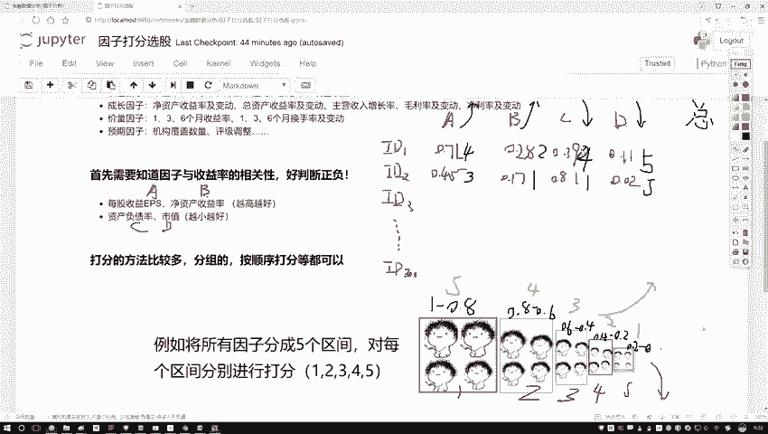
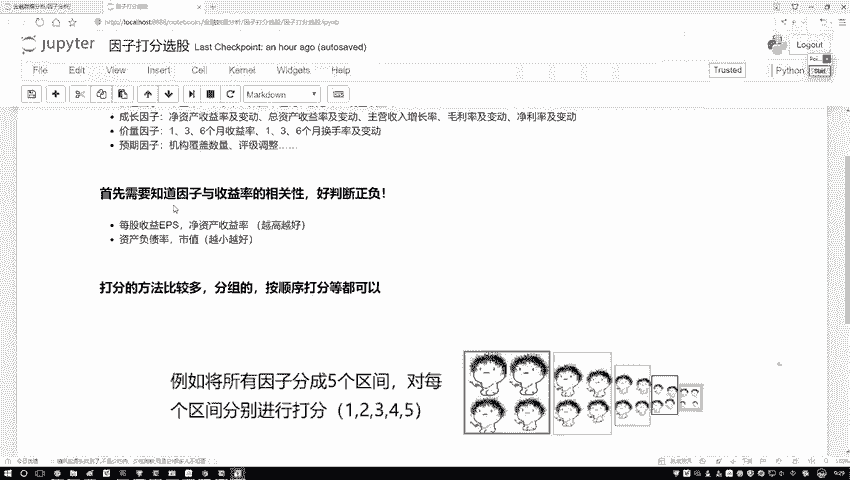
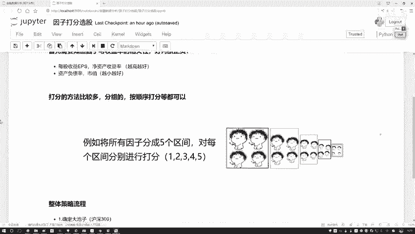
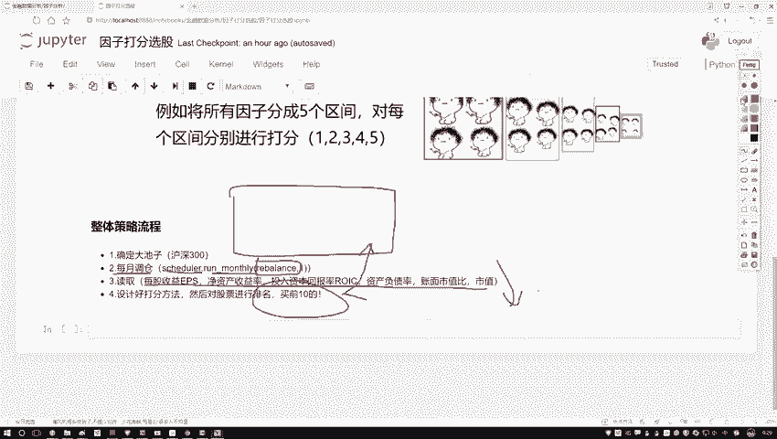

# 【Python金融分析与量化交易实战】完整版教程，含配套课程资料，想学就点进来看看 - P43：46.45.2-整体任务流程梳理P45 - 多模态大模型_ - BV1LM4m1Q7z9

那有了这个已知条件之后啊，接下来我该怎么做啊，那是不是我们就要去打分了。

那好了，给大家来说一下吧，咱们打分该怎么去打啊，这里啊能打分的方法嗯，其实来说还是蛮多的啊，咱们举几个例子来。

先看第一个例子，或者这样我先把这个数据给大家画一下吧，咱就拿这个数据举例子呃，我说这样吧，咱们就有几页数据，有一些样本数据，样本数据当中啊，咱有这个我说有这个IDE啊，第一个第一个股票行吧。

然后呢我说还有这个第二第二只，然后多多写几个id3，然后假设吧，咱们就沪深300，当初一直到这个id300啊，咱们三百三百股票，然后呢咱有几个指标啊，我说咱们就把这几个刚才说的来了，我说这个是个A啊。

这是越大越好，B也是越大越好，然后C和D啊，就是这个负债率还有一个市值越小越好，然后呢这里有这个各科成绩ab c，还有这样一个D行了，那我说这样一件事，我现在把这些指标拿到手了。

并且我也知道他们的一个大小是好还是不好，然后呢比如说咱们现在有些值吧，呃是不是说每个股票，我ABCD4个值都能拿出来啊，那我随便写啊，先随便给大家举个例子呃，我就拿这个红色写吧，比如说它的一个值哦。

IDE这个它是个0。71，然后这个是个0。28，然后这个是个0。39，我就当做关于归一化的结果吧，这是0。11，然后呢再写id得了，这是一个0。45，这是0。17，这是0。81，然后这是一个0。02吧。

好了，随便买个股票都有指标值，这个是在咱们那个数据当中，我们直接可以取到的吧，query一下，把这些数据我就取到了，然后呢我说这样吧，我说嗯对于每个因子来说，那我是不是对于每个因子都要打分啊。

我说这样我是先把咱们这个区间分一分，不管这个A它是从小到大的，还是从大到小的，哎我说都分一个区间，那你看下面说这样，这样在这里我列出一个区间呃，比如说这里吧，我说咱们先按照一个从大到小的吧。

比如说这个呃A因子咱们就说了，哎它是一个越大越好的，哎这里写一下，对于A来说，我希望它是越大越好的，B也是越大越好，C是越小越好，D是越小越好啊，这是咱们的一个方向，然后呢我说这样。

我说对于这个每个人来说吧，这里还有一个取值范围，这个取值范围是最大的，最大的一个取值范围就是从啊这个一到0。8，就相当于你可以分成几个区间，把这个数值我就假设啊，咱们的取值范围是从零一到。

就是从0~1之间了，或者说啊你可以把这个东西当成百分位啊，就是你一旦你的数值不是从0~1，从这个0~1的，那我们是不是也能做一些百分位啊，啊从这个零到20%的，从20%到40%的。

这里呢我们就拿0~1的数值给大家举例子了，其实不是零一的零和一的数值，你自己写百分位数到底是一样的，好了，说这个取值范围是从一到0。8的，然后这个是从这个0。8到这个0。6的，然后这个是从这个0。

6到0。4的，然后这个是0。4到0。2的，最后呢就是一个0。2到一个零的，好了，这样一个数据给他按大小个排一下吧，拍完之后我说诶咱们是不是得设计个分值啊，那好了，我说咱有两个方向，一个是呃换个颜色吧。

一个是从小到大，一个从大到小是吧，好啦那我先说这样吧，就是如果说诶我们的指标是越大越好的时候，越大越好的时候，是不是数值诶，落到这个一到0。8的，我说他可能打分会越高啊。

因为像是你的一个就是你的一个成绩似的，既然越大越好，那我肯定要落在大区间当中的，比如说落到一到0。8的，我说给他一个五分行吧，然后呢0。8到0。6的，我说这四分这三分这两分这一分行吧。

那不光那可能在我们这个任务当中啊，咱怎么样不光有一个算多大的数据，还有什么越小越好的数据吧，在这里好了，那我说第二指标，那如果说这个它是个越小越好的，当它是越小越好的时候，那这个打分怎么打。

那可能越小的时候分越高吧，那可能这就是个五分，那这是个四分，这是三分，这是两分，这是一分吧，好了这是对于数据来说，我们分了两个分支诶，越大越好的，还有一个越小越好的，然后呢既然我们这样方向发展了。

那么打分来看一看吧，先看这个A第一个值我拿这个黑色来画吧，第一个值它等于0。71落到哪了，哎对于A来说，他是希望越大越好，它落到了这个就是0。8到0。6这个区间，所以我说他是个四分行吧，然后0。

28028落到哪了诶，第二区间它是个两分，02390239落到也是一个两分吧，0。01是一个一分，那下面的D2是一样啊，咱们来写一下呃，哎对对哎，这这这题写错了，这个C和D不是啊，C和D你看02390。

39落到哪儿了，落到这里就到，就是我们是需要越小越好的吧，所以说此时他不是一个两分诶，他应该是一个四分给改过来，只要0。01呢，它不是一个一分，他是个五分吧，改也疏忽了，这还有越小越好的。

然后呢第二咱们再算两个得了，第二这个0。450。45啊，它落到了是一个这是个三分，找0。17，0。17，它是个一分，0。81，0。81啊，是什么，是落到这里，但是它是越小越好的，所以它也是个一分吧。

然后呢0。02它是最好的，所以说这是个五分行了，最终啊我们要干什么，那是不是说把它的总总成绩这一块我写个总分，把他们的一个总分我再汇总到一起就行了，那第一个4+2得六，6+4得十。

这是个15分，是不是下面呢四分，然后这个五分，然后这是个十分，那好了，我们现在是不是把两只股票的总分算出来了，那其他股票300只股票，我们是不是说它的一个总分，我全部都能算出来啊，那全部算出来总分之后。

唉，我说在这个总分当中我排个序吧，排序完之后，我说选前十个排名最高的成绩拿出来，当做我下次调仓当中诶，我要关注这个对象，说就行了，这个就是呃咱们的一个打分法，基本的计算方法啊。

这个是你如果说想去分这个区间，或者说部分区也行，那部分缺点怎么办，那300个股票啊，第二种方法，比如说300个股票，每个值是不是都有了，我把直接把这个300个值，我说按照从大到小就从1~300。

从大排序吧，如果越大越好，那肯定就是呃第300个，我说给他300分，第一个我说给他一分是不是也行啊，还大有个给分呗，其实方法有挺多啊，你给的分区间去做也行啊，直接打个分去做也行啊。

反正最终我们只要一个指标，你把总分告诉我汇总出来，我能做排名啊，这就行了，这个就是我们的一个打分法啊，也是在因子策略当中啊。

咱会经常用到的一种方法啊，效果其实来说还是不错的。

然后呢我们来看一下整体的流程，这个流程也就是我们一会儿要去做的策略，在这里先给大家捋一遍，第一步，第一步你得告诉我啊，你要去到哪儿找咱们当前的一个数据，一会儿呢我们是到这个大池当中。

哎就是我们第一步在那个contest当中啊，咱们先指定好那个沪深300，一会儿咱们基于这300个股票去选啊，这是我们现有的一个池子，然后呢，既然我们要调仓了，哎咱们不拿这个每日啊。

其实正常情况下每月每个季度是比较常见的啊，每月可能更常见一些，再拿每月做一个调仓，所以说我们要设置定时器诶，在这里写这样一个函数，然后呢我们重点啊，其实就要实现这个函数就是一个REBALANCE。

在这个REBELANCE当中啊，我们要去干什么，那首先呢我们是不是说啊，哎我们要把数据给它先读进来，那比如这里我们有几个指标，刚才就给大家说了，我们前三个是越大越好的，后三个是越小越好的。

哎这就当做我们的一个先验知识，或者是我们的经验值吧，那做完数据之后，我们是不是要去计算一下，当前诶每个指标打好分了，到了分完之后还没完，我们是还要汇总得到一个总分，得完总分之后，还有说买前十的。

说就行了，看起来流程相对来说还是比较简单哦。

一会儿呢咱们就拿这种打分法来去试试水诶，看一看用打分法啊，我就随便选了几个指标，看一看能够能不能够使得咱们的收益诶，能够翻多少倍吧，哦这个意思行了。

