# 【Python金融量化投资分析与股票交易】14天拿下Python金融量化，股票分析、数据清洗，可视化Python金融量化投资分析与股票交易，附项目实战 - P10：09 金融量化分析-ipython高级功能 - 程序员艾雷克斯 - BV1d4U5YhETr

好，我们接下来再介绍最后一个魔术命令，就是这个PDB名。啊，我们知道我们在自己写代码的时候，经常会遇到，比如说啊我这个代码不知道哪一行就报错了。呀，那我报错的时候，我遇到报错我们怎么办？

我们肯定就是调试到处加断点，然后进行调试。我又不知道在哪一行具体出错了。那这个时候我们就会比较烦躁。嗯，好，我ipad给我们提供了一个什么呢？PDB命令啊，这个PDB命令。和其他的不一样。

它是一个开关性质的啊PDB。用法PDB on是把它打开这样调试模式。对，这个时候会怎么样呢？当你粘一个代码过来。嗯，好，假如你这个代码中间有一行报错了，嗯，它会在你这一行报错之前那一行。

就把代码停在那里，自动进入一个调试模式啊，然后你可以打印相关的信息OK。

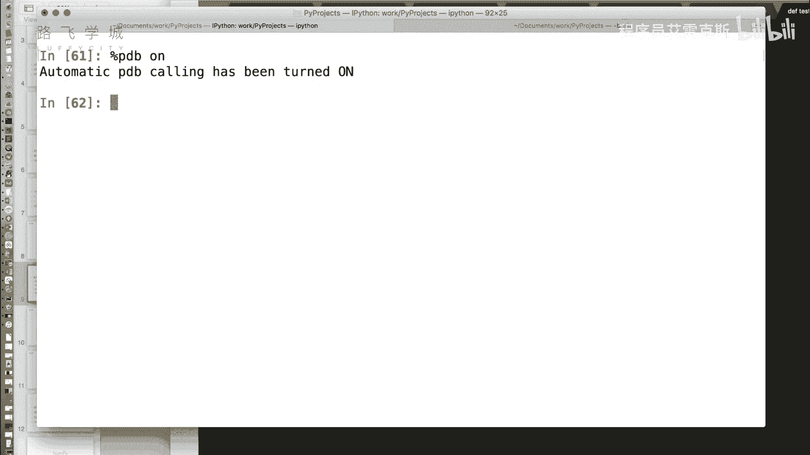

啊，比如说看这个我写一段测试代码啊，就test函数是计算A除以B啊，可以看到我传了一个3，1个0，肯定会是报一个出零的错误，对，对不对？好，我把这粘过来。

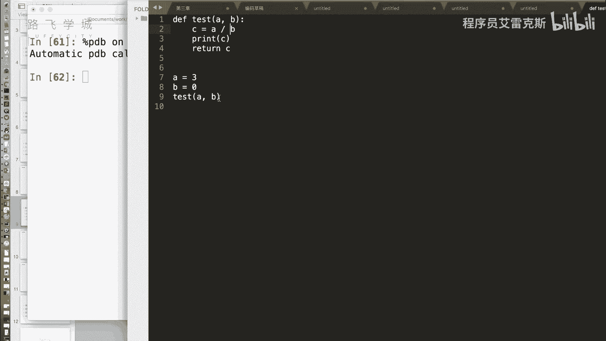

比刚才的paste命令运行啊，首先我们可以看到啊，上面我们打印了什么报错信息啊，就是除零错误嗯啊打印了，然后出错出错在这些行两层，第一层是test这个函数报存。然后下一层是什么？test函数里哪一行呢？

是C等于H除B这一行的问题啊。OK好，那下边哎这儿进入了一个交互式的调试器，我们可以看到现在第八个模式停在这儿了啊，成绩状态对，下一行马上就要执行这啊，这个时候我们可以用什么呢？

这个PDB的一些命令来查看一些查看当前这些所有变量的一些状态常用的不就不是查看他那命令。嗯，我们可以看一下用什么命令呢？P命令啊。

就是print那是PAA打印A的值发现是三啊BB打印B的值A发现是谁我们啊，对。

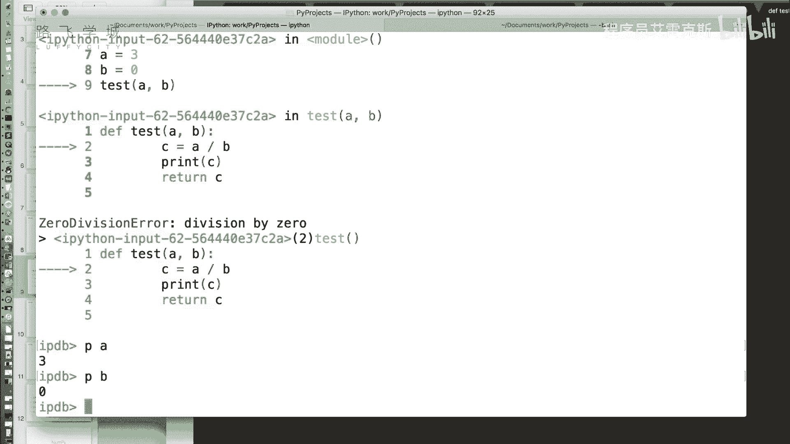

没错好，那一些这个PDB的相关的命令。啊，在这里大家可以看一下啊，H命令打印文档啊，Q命令退出啊，break设置断点等等。但是因为什么呢？我们现在这个呃命令啊，它下一行肯定是会出错的，啊。

所以你看我们这有个nex命令嘛，那定就是我们俗称的执行下一行，当前行当前对执行当前行，因为现在你看箭头指向第二，说明第二行马上就要这第二行还没有啊，还没。但是我们打印一个N它肯定就退出了，为什么？

因为这个地方报错了，所以他肯定会退出啊，所以其实PDB这个命令，我们基本上用的只有P，就看一下当前的变量。好吧，就一个在交器下的一个调出了。当然对呃对，当然这个ipad它提供了一个就是呃叫做第八个名。

就是你可以自己的就是相当于是开启你的真实的调试模式可以加断你从第一行开始一行一行或者任意加点。对，那这个时候就需要用到它了啊，那当然大家可能更喜欢用拍 time一。我觉得对对所以我觉得就没有必要讲。

但是这个PDB的命令还是挺好用的。嗯你可以自动找到错误的嗯嗯。

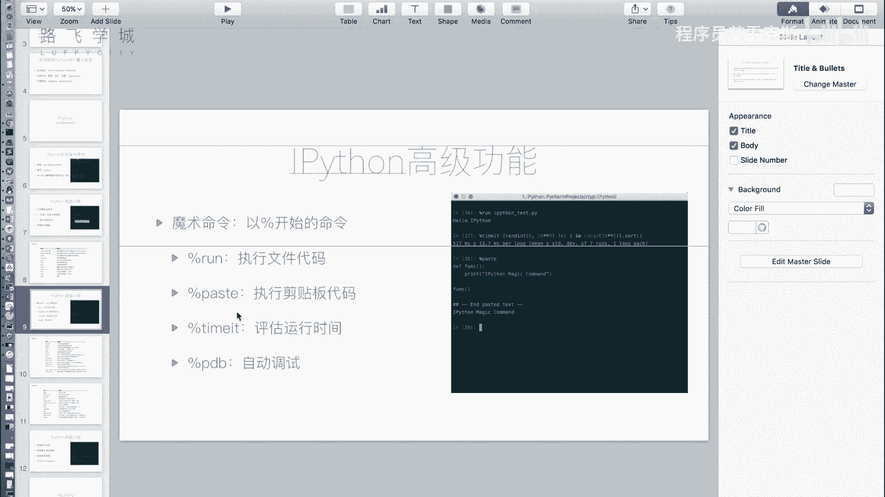

好，不用的时候你就设置成off啊，就可以关掉了。那这个时候你如果再。哎，能再把这个代码复制过来吧，off状态。就没什么，他就直接报错了，他就直接报错了。对，就不会让你撤到底啊，就是这个嗯PDB名名。

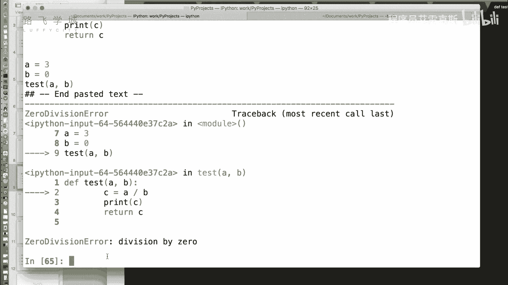

あこ。

那接下来这两页给大家提供了这是啊ipad常用的一些魔术命令。啊，有一些东西不太常用，没有讲到啊啊然后这是我们的PDB的一些常见的。就是PDB调试器常用的命令啊，可以相当于是命令行进行调试模式这。好。

那还有几个高级功能。第一个使用命令历史。

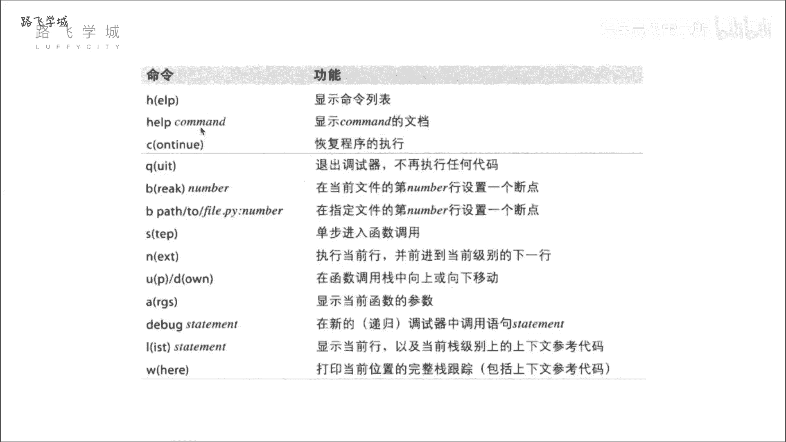

啊，就是大家用这个用linux的这个命令行，很就是很常用作，就是上箭头，它会获取什么？它就会上一个命令上一个命令上一个命令，我们可以看到两一样的，这也是一样的，上箭头就是这样，那还有一个比如什么呢？

看我试试着写一个啊，A等于一啊B等于2比如说我就这两个代码。那我想啊我可能写了好多代码。我想去获取上一行是A开头的嗯，那我就在这输入一个A然后摁上这个时候它会出现什么？

它会出现AA加还能搜索对你如果在这是A加BA乘B啊A这个我们输入一个A星号，那它上出现的是A星星B，然后就是AB然后就没了当于是你给定前面几个字，它可以搜索部分的进行搜索，这是这个叫做使用命令历史。

然后下一个它可以。获取输入输入结果，这个什么意思呢？啊，我们之前用pyy命令行的时候，会遇到这么一个问题。比如说我想算一加啊啊A加B吧，比如说有了A等于1一B等于2就有了啊，我们想算A加B。

如果我给他复制一个C，那这个A加B的结果是不会在命令行内被打印出来的。如果我不复制C，它是会被打印出来的。但是会保存结果会保存结果。那这个时候我挺牛解，一方面我又想。把它存起来，嗯，你后边接着算，对吧？

一方面我又想看一下值。你如果我看我C等于A加B，它还是不会打印啊，我还得print C。我多打好几个字，我懒对。那ipad里我们可以这样啊，A加B，哎，我就是不保存3、我们可以看到是三。

那用的时候怎么用啊？一个下划线。啊，一个下划线表示它上一行的输出嗯，就直接可以获得了它那了3，这简肯定也可以。他人聊起来也可以。嗯，可以吗？来测试一下应该是可以。我记得我没我不记得我是。I还真是。

俩就不行了，他俩形成？哎，哎牛逼，你看我来一个啊，A加B等于3A乘B等于2。我想要3乘以2我怎么办？俩下划线乘以一个下滑三乘。没有人这么干，下划线是上一个变量，两个下划线就是上两个的变量。虽然可以。

但没人这么干。我还有3个。行行下，可以可以，那比如说我想获去。哎，比如说我想获去69行的这个变量，A乘成B这个这个结果那怎么办？写69。写69。69轻69啊，星轻69也不对，下划线69啊，酷滚。

大谢 good。啊，还有点用的，还是有点用的啊。对，有的时候你真的是没存下来，当时就想看一下结果，但是你后边想要用它了啊，你就可以用下。可以还有我还没说完呢啊，还有一个我如果我想拿输入啊。

我刚才讲的就是拿输出对吧？嗯，我想拿输入，怎么想拿这个A加B嗯，就是下划线啊，I72。😊，啊，加个I对，加个I音库是吗？那怎么是拿出A加B的这个字2，对，拿个字符串。因为他拿的是输入嘛，呃可以获取输入。

但是输入不太常用啊。对啊，就打印自动串。对。

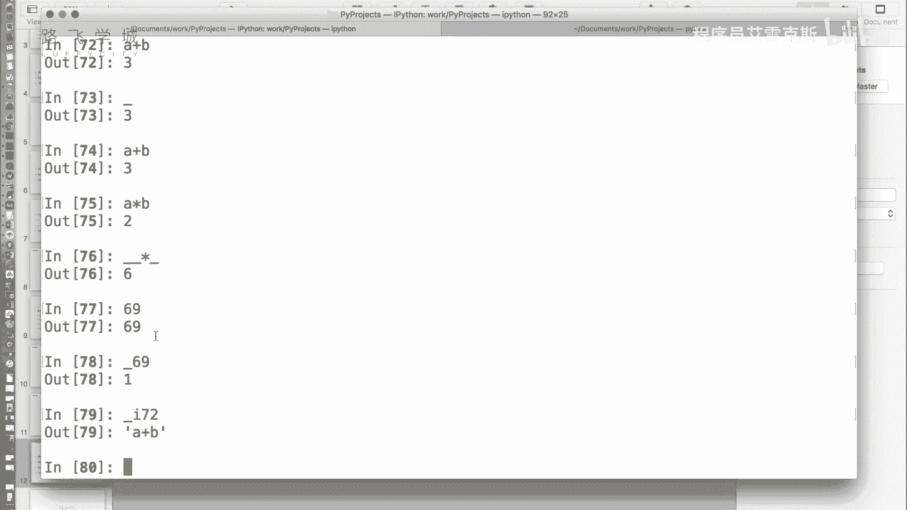

就是你拿的这个代码好吗？啊。

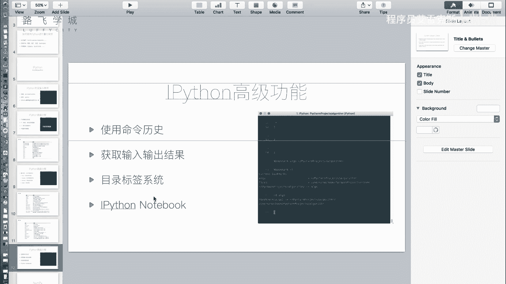

那接下来还有一个叫做目录标差系统，对应的就是另一个模术命令叫bookmark。这个命令涉及到什么呢？大家写代码可能会出现到几个项目来回转，或者是几个几个目录来回转。嗯嗯对，那你目录来回跳。

你要用CD要一直机密的很复杂，不够杂，很费劲，不费费劲，我觉得费劲。那bookman给我们提供了一个叫啥就是啊。快捷的目录。比如说啊当前的你把常用的目录存下来，存进来mark对标签。对，你可以看一下。

比如说当前的这个目录我再存看啊嗯book mark它百分号book mark嗯，然后加一个你常见的命，比如说我就是TLG吧表示哎好，然后第三个第二个参数是你这个目录目录回照。

然后你能查看我有所有的bookmark吗。book max这个问题问的好啊，OK杠L命啊，你下次就s mark了PRO这就跳槽那个工作了。好，比如说我再我我我给两个吧嗯。home啊，我设置成这个好吧。

我们自己的这个就是加目。好，那我么用的是怎么办？直接CD。后嘛。好。KDpro对。那就可以直接进行切换啊，那bookmark L。可以查看当前所有的你的bookmark。嗯嗯，然后bookmark。

D可以删除掉某一个。比如说删除ho嗯。啊。这个时候就没有了。嗯，然后bookommarkR是删除所有的动画嗯。这是不干。大看除此之外，还有一个最后一个啊。

也是做科学计算方面的人用的比较多的一个叫做notepyy notebook twoipon notebookotebook。嗯啊，那用这个功能，我们需要下一个模块，那有现在需要装一个。

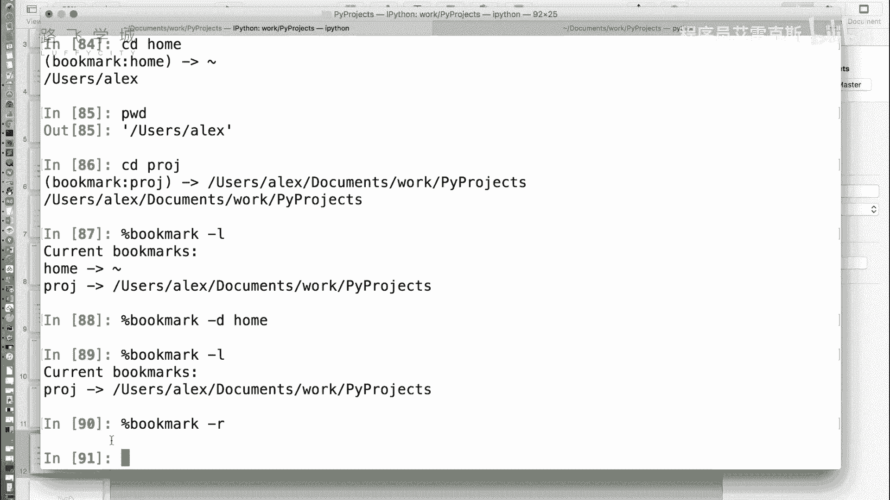

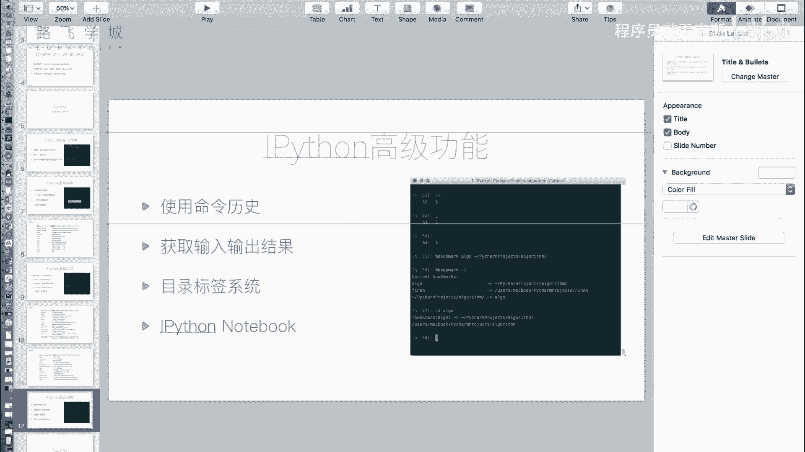

叫做。他不在你知道没wopeter。就就皮特了。嗯。啊，就是这个模块就是他是开发对它是开发ipad的这个机构啊啊，这个模块就是他。

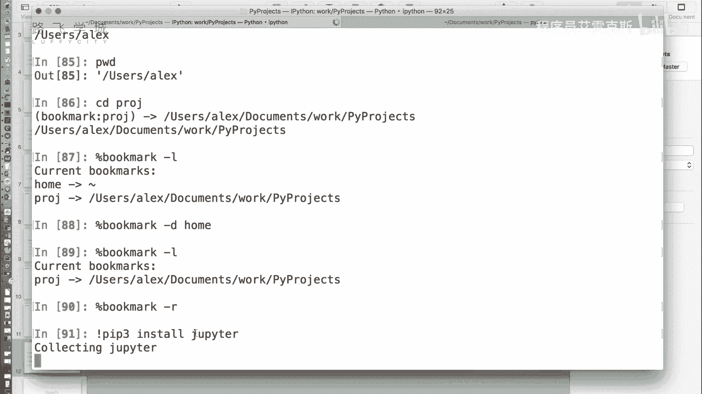

啊，现下来就是尴尬的等的时间。是很快，我快这个模块挺大的，操。so我总结我先总结，那ipadthon其实就是一个为懒人开发的一个python交互器。是吧我们这种存坏人不用这个东西。普通写的你发现了没有？

就是因为我之前在金融公司，我发现好多做金融的就喜欢用这个。做科业卷都喜，但是平常写代码的程序员就不用。对你如果开发网站对外部这种做没法这面不太专就是一些做程。比如说我后边我讲我为啥要讲这个。

因为我咱们后边一些就是可能是哎只看一个函数。有的时候你就是数据拿过来，我调一个函数，看看结果，拿后再调一个函做结主要它是这种一步一步的相当于其实是代码不是替你做编程是看看，相当于做了一个计算。

就高级计算器都没用。那这个用户用的比较多。他好像还有一个web页面吧。就是这个哦。啊啊，就是张这个。他之前看那些搞金融的同事们，经常用这东西。然后我心想这玩意有什么意思啊，就有了个高点。用熟了挺好。

你这个有8张好大的好，我们的这个tripyer已经安装完了。那运行的时候啊，我们要回到系统密俩啊，输入tripytternotebook。好，它会给我们自动在浏览器上打开一个这个页面。

可以看到这个页面就是一个文件管理器啊，这里边是前的目录大建目录的一些文件啊。那我们可以再创建一个新的notebook。啊，python notebook book我们可以看到。

这相当于就是一个web版的ipad。嗯嗯那你可以在里边输入一些。愉悦嗯嗯。然后点run啊，就可以给你有预先结果出来。嗯嗯空啊，那我觉得这个可以大家当一个博客来做啊，它不光支持拍thon。

你还可以把这个换成markdown。啊。那写这个干嘛呀？用m克这干嘛呀？你可以拿它来写博客呀，它可以保存成PDF保存成HML都可以。啊，运行一下，那就对。哦哦啊就是你可以代码，但是你平常写报告的话。

你不会有代码的结果。啊，而且我们说这个notebook为啥好用？因为就是ipad这一套，它们是成体系的，到后边会给大家讲，我这之前写了一个。给大家讲这个我们的pandas模块。

我们的number PMM或者mpl lab嗯看运行出来打印的效果其实挺好看的啊，也包括们macpl lab一些图可以直接打印在这啊，这是运行之后的结果啊。

这是它的那个data frame啊都会打印在这嗯，相当于是一个外部版的代码展示器。嗯啊，然后你可以把它保存。啊，保存成这个。保存成看可以保存成pathon文件HML啊等等都可以PDF嗯。

常见的一些都是可以问好。

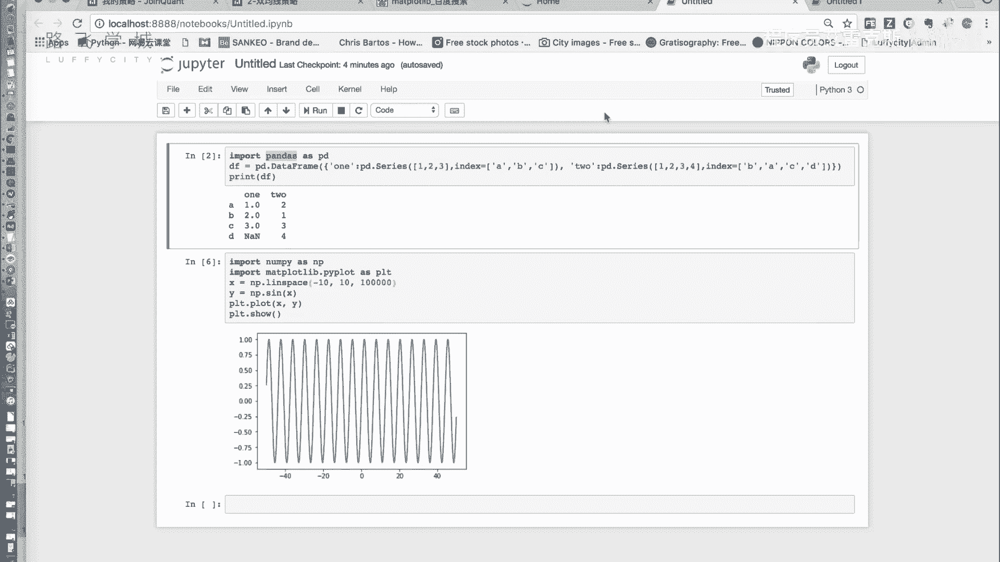

那啊到此为止，我们的ipad就是一个小的这个。

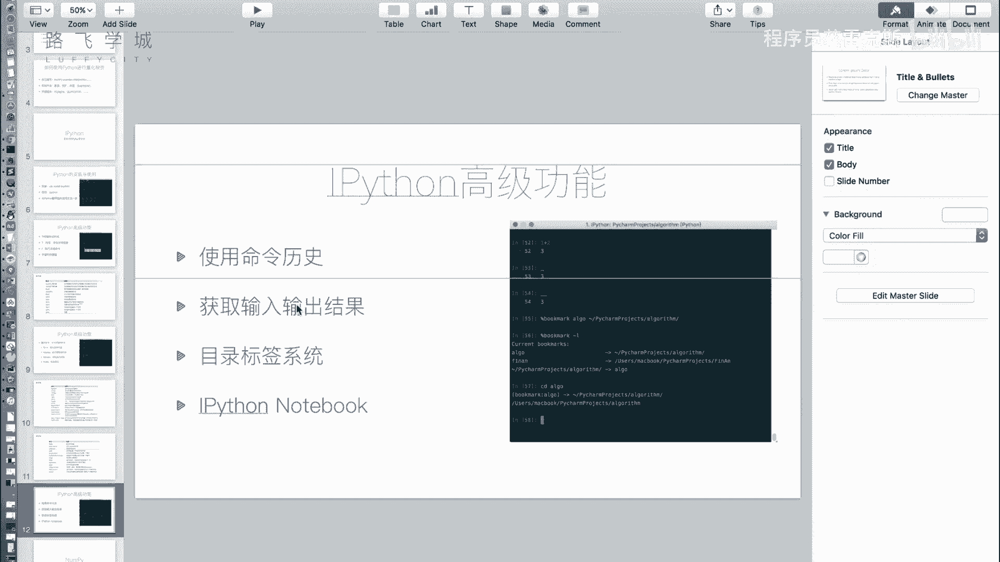

啊，升级版的节时器就讲解完了。嗯，然后接下来开始我们的三大模块之一，numberP oney。

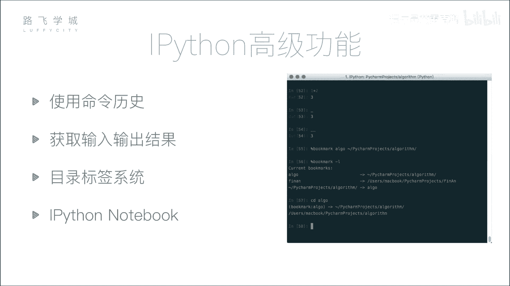

