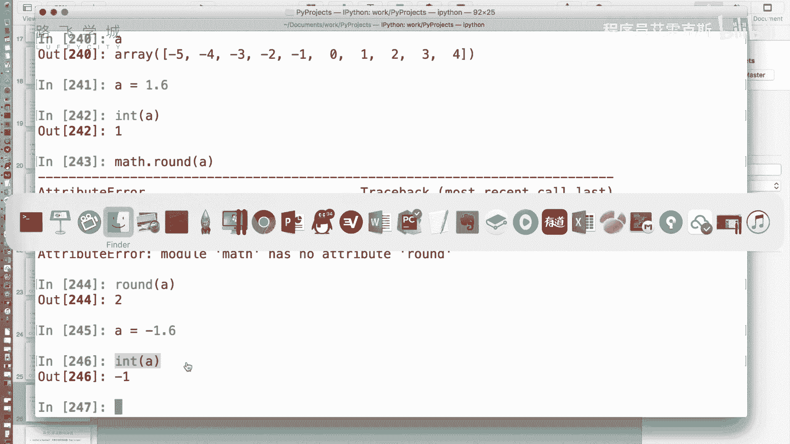
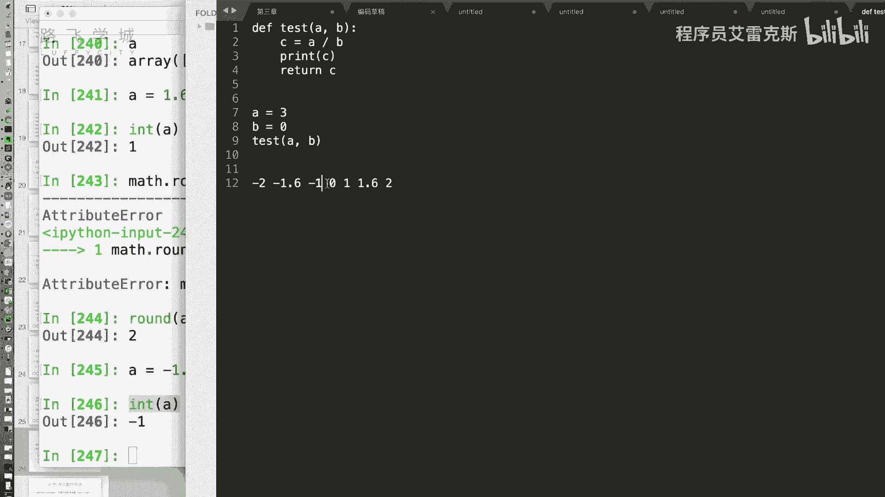
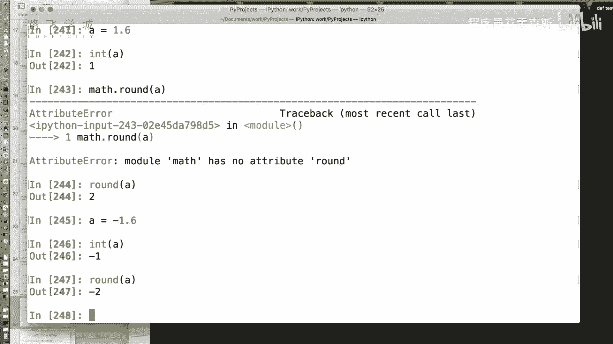
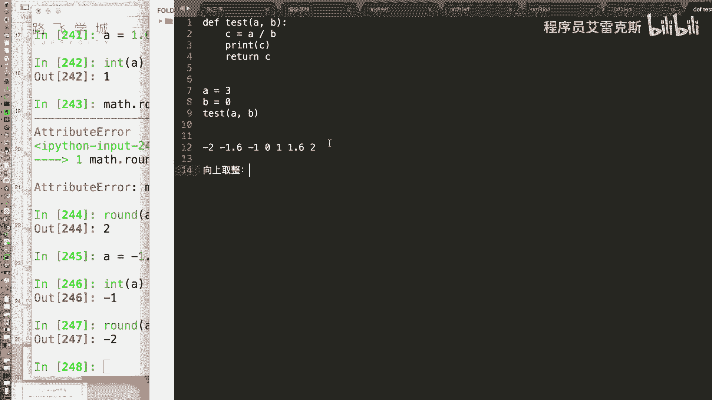
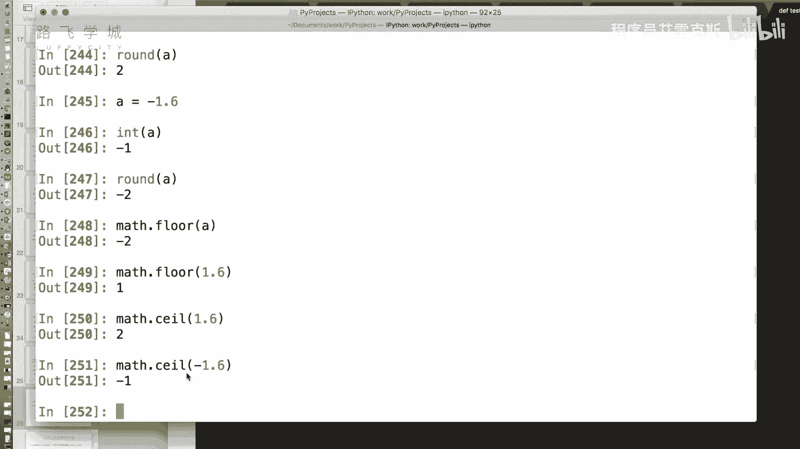
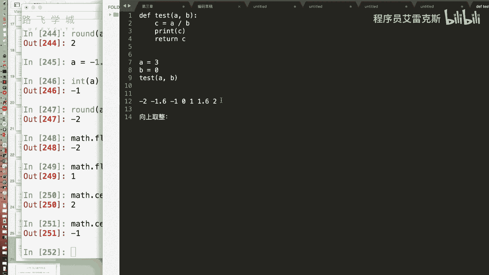
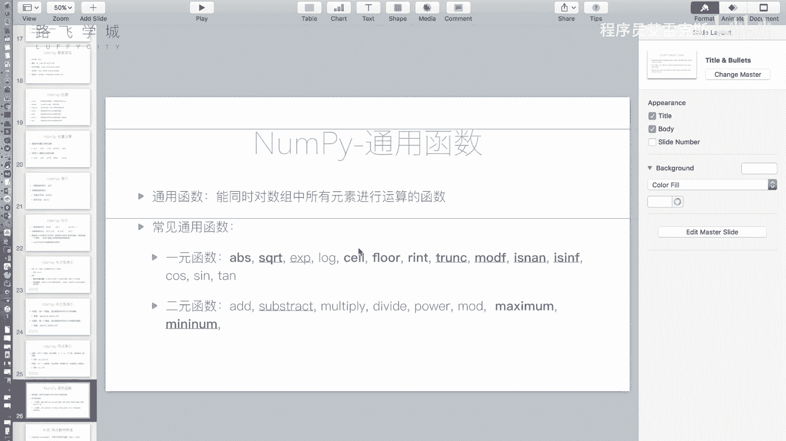

# 【Python金融量化投资分析与股票交易】14天拿下Python金融量化，股票分析、数据清洗，可视化Python金融量化投资分析与股票交易，附项目实战 - P14：13金融量化分析-numpy-array通用函数 - 程序员艾雷克斯 - BV1oozzYyEj2

好，那我们讲完了那个array，这个数组对象的一些索引功能之后，我来说一下number py还提供了哪些功能啊，首先一个常用的通用函数嗯，哼它是什么呢，它是我们说之前的我们的数组对象，加减乘除这些运算。

Yes，是不是都可以批量的运行，Yes，那一些其他的稍微复杂一点的运算的，我是不是也想让它P它一下，哼好有哪些呢，比如说还记得标准库里有一个叫abs的函数吗，是不是取绝对值哎。

这个东西我也想把它P上去算怎么办，对数组里的所有的值取绝对值A等于NP点，再来一个重复5~5诶，看是不是有负有正的，如果我们用abs传一个AT的话，肯定是肯定是跟你的期待不一样是吗，跟我的期待不太一样。

因为我想的是应该是不行的，应该要用NP点ABS，因为原版的ABS的话可能是升级了派成员，嗯你看他原版的abs他肯定没有考虑到number py啊，这个真的有可能是number py升级的。

它想了某些办法hack了这个函数啊，不应该是NP点a abs嗯，然后A那事实证明啊，直接写a abs a也是八也是可以的，对也是可以的，那咱们就不说了，不说了，就这么写啊，abs那除了abs。

这还有一个SPIT这个还是什么来着，其实那个多少平方开放开放啊，开放，哎你看这就这个是在哪个，这个是在哎，不是在max那个部下，那我们把它引过来，sq RT不行吧。

Only one spy can be，只能是对那个，那我们怎么办，这个时候你看那个a abs可能真的是个特例啊，sq r p用这个嗯，这是对谁开的吗，对你那个数是几啊，你看前面NA是什么意思啊。

嗯后边马上回收，为啥呢，你想想负数开方是不是不可能开放嗯，只有正数才能开放啊，负数开方就会出现这个东西，叫做not a member，咱们马上就会讲这一页啊，好除了开方运算，这两个我没有标粗的。

就是一些数学函数，这个是指数运算，对数运算啊，不说了，然后后边这几个其实挺有意思的，不知道大家基础的时候讲没讲过，没讲过CEL函数，floor函数，这个是啥呢，地板图不是地板出啊。

我们说想把一个小数变成整数，有几方法嗯，int啊，比如说我想给一个A等于1。6，我想把它变成整数，哎他说了int是一，但是不对呀，我应该四舍五入变成二，我应该四舍五入变成二对，所以怎么办，所以怎么办。

run max点吧，普通run还不行吗，哎应该是应该是run普通run吧，应该是普通run，ok round4舍五入嗯，啊那哎我们来看你说int是不是round，就是四舍五入int，你理解的是什么。

是把小数点后边的去掉是吧对好，那比如说A等于负的1。6，int a是多少一负一对不对，一嗯好，那我们说这种取整方法，这种取证方法我们叫做什么，四舍五入也明白了，这种取证方法我们叫做什么。

就是矩阵叫做向零取哦，为什么呢，为什么呢，来看一下啊。

如果对于在数轴上来说，我们看这几个数的关系是什么啊，零在中间对不对，然后是一，然后是1。6，然后比零小的是不是一呀，-1。6是不是比一还要小，对，所以你看-1。6啊，它左边是二嗯，1。6，右边是啊二嗯。

我们看啊1。6变成了一负一点就变成他负，他是什么，向零取向零方向对向零那个方向沿那四舍五入。

我们别说了，一点到四舍五入多少呃，就就就还是一半哦，不是那就是像他那个比他大的那个四舍五入不，四舍五入就是小于零点，就是点小于0。5的时候，小数部分小于0。5的时候是向零去的。

小数部分大于我就是向零的外边去的啊。

那还有两种区分方式，叫做向上去的和向下去的啊，向上取整，所谓向上取整是什么意思呢，所谓向量数呢就是说1。6要变成二负一点的，要变成一位移，就是往上去找，往比他大的那个数去找，OK那对应的有一个向下去找。

就比他小了对，就是1。6看变成一等负，1。6变成二，就是往小的方向去找好。

那原版的函数向上取整和向下取整都有，向下取整floor，嗯看一点就变成二了，为什么是flow，flow是地板，所以是向下的，那你看如果如果是1。6，它就变成一了，那向上去找这个函数叫做ARCEE哦。

这个CEING天花板的那个算起来对，所以你看1。6会变成二负，1。0会变成一负一啊，所以这是四种取整方向，零取整向下取整，向下取整和45，你记住那个方向就就OK了。

记住你不记不太清的话，画一下这个这个东西，在一些某些数学运算上很有用，因为好多数学的东西会要求说必须是怎么的，取得方式。

嗯啊嗯好，那哎咱们再说回来，对于，这个东西啊，我就我就不要来一个5。5到5。5，哎你看这都是小数了，因为我要变成小数嘛，整数不太好取整好，那给他批量的进行批量的向上改下啊。

你直接用max点floor a肯定是不对的，嗯啊那这四个函数对应在NT点NP里都有A对，NP点flog，这是NT的向下去的，全都向上取整，对都是往往你看六倍太小了吧，太小了对。

那NP点seeing就全下上去的，全下上去了啊，然后NP点round round hold on round，都是向向那个比它大的方向，round是四舍五入啊，四舍五入嘛，对大于大于小于0。5就向里。

大于0。5就向外，对对对对对，因为什么，因为我这都是0。5，都是点五，所以它就是下班了，淘汰了啊，好那还有一个叫做什么项零取整嗯，记得吗，相当于取整是int对不对，但是我们能直接用int吗。

你想想也知道不能，因为他是一个内置类型来，所以是zero t r u NC chunk好，就给它截断了，不对好吧，那对这是这四个啊，round的话还有一个叫做r int，r int和RT是一样的啊。

r int和round是一样的，印象对哎好，那这是四种方式啊，向下向上向四舍五入和向内旋，嗯啊对，这是我套这四个函数，OK然后接下来还有一个mod f是什么意思啊，这个有的地方有用啊，来看还是A啊。

NNP点MMOTFA看，首先看它返回的是两个数组，其实你很明显就可以看出来，我看不出来，你看不出来，你看一眼哦，我看出来了，我懂了，就是把小数和整数部分分分开啊，为什么有可能我整数部分有用。

我小数部分还要再做一，那还行，就是这个整数部分和小数部分分开，那你用的时候啊，记得返回值的话，你记得是个元组，或者是你这样算来，X逗号Y现在就返回了两个值啊，它返回的是两个值，OK啊，这是mod f。

那接下来这两个A就涉及到is n a n和，Is i n f，is nine和is in啊，这两个就涉及到你刚才问的那个问题了，为什么会出现，比如说啊刚才之前你举到过两个例子，第一个例子啊。

abs a等于啊，不是A等于N值，先给大家看一下什么情况，A等于a range，0~5诶，好ANP点a range嗯好，我让五除以A看第一个值INF嗯，哼，然后第二个是什么时候出现的呢。

第二个是这个时候出现的啊，等于-5~5，那我对它取一个开方的时候，Imagine rain company in，开放fun roil，他直接给啊好了，它是给提示有错误，为啥，因为是有负数开方。

所以给提示一个错误，但是他结果给你嗯哼啊，结果还是给刚才只是存到A里边了，没有显出，你看这出现了NNN，那这个NAN和NF是什么东西呢，这是两个特殊的浮点数的值，n a an是not a number。

inf是infinity啊，大家标准这个Python标准库的时候可能没见过，其实有这个东西，我们的float函数是不是可以把数转换成小数，你拿个字符串3。5传进去，他就给你转换成3。5，好，可以看啊。

你没有见过NAN这个东西，显示大家应该会想什么时候报错，你随便传一个字符串肯定报错对吧，但是你看NANA啊，没有报错，没有报错，那同样inf也没有报错，这是两个特殊的小数值嗯，啥意思呢。

n a an表示not a number，就是它不是一个数，它不等于任何一个浮点数，甚至它不等于自己啊，就是你看啊，你你见过这个flow float nan啊，哎你就随便一个A是就无限无限循环。

不不是无限循环，就是不是一个数，它就不是一个数，是这个不是一个数，什么时候会出现嗯，0。0÷0。0的哦，这不是一个数，对负数开方的时候，你数学上是不是学过好多不存在的，是负数开方不存在，对不对。

0÷0不存在啊，零的零次方不存在，这些东西都是AOK那懂了，就标记一些对不同立的对不存在的东西，那标准里边，你比如说你输0。0÷0。0的时候，是不会报错的，嗯因为啥，因为你一个数，这个就给你报个错。

很正常，我就不给你返回N了对吧，就报个错，但是你比如说啊，我们的A等于我看下A还在不在啊，不在，好A等于它，我们要A除以A看啊，后边都是一对不对，但是你看00是NAN看到没有嗯。

相对于第一个位置是0÷0嘛呀，那他为什么不给报错的呢，我们假设一下我们这个实际这个工作的地方，可能这个数组好几千了吧，里边可能有一些零啊，我除一下可能里边有俩吧，0÷0的，你要给我报错。

那我其他白白运算对那几百万个值就白扔了吧，不太可能对，所以就把这个值给你标记成下哦，i see啊，这个值获取就是NP点NN也是可以的，就获取所有的NN不是就是它是这个值，它的值就是NPLAN。

但是一个有意思的地方嗯，NP点NNN等于NP点NNN吗，不等于不等于嗯，这个是他特别迷惑人的地方，我也不懂为什么，因为他不等规则只能是is吗，is那你is字应该是可以的吧，is是可以。

但是不判断的时候不这么写，就是为什么，因为它规定n a an不等于任何值，所以他也不能C，所以你判断你的结果吉利有没有NNA，只能是判断哎你这个这个问题问得好，那我怎么判断呢，我来保存一下啊。

A除以A啊，来看一下B这个值B点head它是NNNN对吧，你如果我们说用哎，我有我可以有这个什么布尔索引嗯，对布尔索引的N这个B等于NP点NNN，我满心欢喜的以为第一个是true，后边都是false。

但是不是全是false嗯所以这么判断不行，嗯那你要是用is的话，是不是也不行，因为你is的话是判断B肯定不是NN啊，对你说，我这个用等于，是不是想让它每一个数都是NAINB吧。

应该是你返回的是一个数组吗，这么写吗，对你现在B是什么先锋B是个数组，它的第一个值是A硬币也不行了啊，哎这个就涉及到什么呢，is n a n这个函数，我们用NP点is n a n这个函数把B传进去。

看第一个位置是true，其他的位置都是false哦，所以NAN这个值特别重要，到后边咱们学pandas这个库的时候，会知道NAN这个值是作为缺失值出现的啊，啊就比如说你一张数据表，你可能有几个是缺失的。

就有可能他这一天就没有这个数据，对方也有可能是各种单位，你就放N可能这个缺失值，那后边我们讲遇到NN的时候，我是给它填充一个数，还是把这一把这个数给它去掉，嗯啊那is nn a这个方法哎。

如果说我想说我这个B可能有一些是NN，我想把一些NN删掉，有的有NN的就给他删掉，那我怎么写，那你就是是结合is nn和BT就可以看啊，B中括号NT点SNN嗯，对对对对，是的啊不对。

你把这个是把所有NA的选not not，叹号或者有not吗，没有那前面就只能这样了，对前面加叹号对行不行，括号，难道不是Python的语法吗，JS的文件，not前面加个not呢不行吗。

前面加个not应该是不行的，前面加号怎么变的，来额我看一下啊，这样X哦，不是不是，怎么会是叹号呢，你这是误导我，是这个哦，这取反，嘶想想为啥取反吗，这个是各位观众，我真的是被他误导了。

好我们说在这个布尔值索引里，我们用到的是不是这个这个tab是不是非运算符，这搭配的是这个这个取反啊，嗯好吧对，因为有的语言里有叹号吗，他这真的是误导我啊，是这个记得啊啊is n n啊就可以出来。

这是第一种特殊的值，叫n a n not a number，第二种INF啊，在原来里float n f也是可以的，NF这是啥，表示无穷大的数，它比任何一个数都大，不是一个自然数了，它比任何的数都大。

什么时候会出现无任何一个数不等于零的数，除以零的时候都是无穷5÷5除以个零，为啥这个是微积分的知识啦，不懂没学好啊，五除以X的时候，你这X越小，这个结果是不是越大，嗯你五比如说除以0。

00000000嗯，是不退大一数嗯，那你这个数越来越小，小到零，它是不是就无限大了，嗯啊这个啊这是微积分上的知识啊，这就不展开讲了，所以inf记得它比任何一个大，我也不能放一起来。

我们判断一个它嗯哎返回true说明它比它还，你这个不管输多少都是返回true嗯，好它比任何一个数都大，这是inf，那NF就是在X就是不等于零的时候，除以零的时候出现啊，刚才举了说哎A等于啊。

34567好，哎我让B等于我把B的几个值设成零，我们让A除以B，你看是不是这个位置和这个位置变成IF，就是40是infinite，6÷0是零，嗯啊这是这两个特殊值，那这个特殊值怎么判断啊。

这个因为NNF是等于NNF的啊，首先可以通过它获取出来啊，我们可以看到NNF是等于NF的，NN不等于NN的差，那这个我们当然可以啊，来C等于A除以B啊，这是4A，什么叫，哦哦对没错，我输入了A好。

我们来看C是不是这个值，我们要把C里的NNF都扔去，怎么办，C中括号C是不是不等于NP点NF就可以了，对不对，这是一种写法，第二种写法，同样我们刚才不是有一个is nn吗，对吧。

现在有一个is inf is，好我们传C进去，记得什么算一个算三个，全全写出来了，对好就是这个啊，就是过滤一些这个特殊值的时候，OK这是我们说常见的通用函数，一些一元函数。

所谓一元函数其实就是啊参数只有一个啊，就叫一元函数，二函数参数有两个啊，前面的这些我们没有必要和你可以看看，加减乘除嗯，这个是平方乘方，这是模就等于号，这些东西我没有标黑，为啥，因为我们有一开方嗯。

那重点我说说后边两个maximum和minimum，这两个类型啊，同样是NP点maxi，好先看一下啊，还看一下A和B对照这条写出来啊，我B重新写一个吧，好我们看一下，这是A的值，这是B的值。

我们调用一下NB点maximum，AB看它返回的什么啊，看看能看懂吗，两个都算进去了，因为这是一个二元函数，我们知道麦克财富知道啊，求求大概是3M32是多少，是不是3maximum相当于max的NB啊。

嗯它是啥，它是每一个值对应的是都执行一下max哦，我懂了，相当于两个列表对比，三和2max是几，是三四和五是max和五，我以为你是分别取出哪个数组里的最大的，我想这个跟那个Mac的方法不一样吗。

这个你可以，那你就是A点max就可以对对我懂了好好，那minimum就是取两个这个最小的值，最小了，就反过来嘛，对这个结果相反，mini m m u y哦，哦拼错了吧，MMINI没那个嗯。

固定想法取一下，就是哎这是我们说的number py的一些通用函数。

其实就是一些数学函数，OK周到，我不会的。