# 【QMT量化交易实战】3.Python环境安装 - P1 - 量化投资技术 - BV1Cw4m117Eq

大家好啊，这里来讲一下Python环境安装，首先呢还是来过一下我们的内容啊，首先啊因为我们要用KMT这个软件啊，它呢是基于Python语言的，所以我们要在本地安装Python这个语言的环境啊。

Python语言环境呢有两种安装方式，一种是通过官网去安装啊，这有网址啊，我们这里呢建议下载啊，3。0的版本啊，然后第二种方式是通过PYEENV啊，就是一个虚多个虚拟环境的安装啊。

我个人呢比较喜欢用这种啊，但这个呢安装起来会更复杂一点啊，一会都给大家演示一下，这是第二种方式的安装的命令，让我们执行一下，然后就是代码编辑器，代码编辑器呢我这里推荐用vs code。

当然有些朋友可能会喜欢用py charm，就是专门写Python的，但是近些年的vs啊，vs code呢是比较广泛的一款脚本编辑器啊，嗯我个人呢是一直用这个，所以推荐大家也是用这个。

当然变器呢不一定非得用它啊，这个选一个大家自己喜欢用的就可以了啊，啊这是它的下载链接，另外呢是啊git管理工具git和GBS啊，因为我们是做k mt的话，是它只能在windows上去安装对吧。

然后那我们的编写策略呢，和后面的一些代码，也得在windows环境下进行一个编写啊，然后这里呢我们需要安装啊，做代码管理呢就做安装git，git bus呢是我认为windows环境下的一个比较好用的啊。

终端工具啊，所以这里推荐，因为你按G同时呢，GBS也会同时安装在windows环境下啊，这是它的下载链接，再往下呢就是设置这个Python的啊，换那个国内源，因为派森它会涉及你要安装第三方包啊。

那第三方包呢默认是上pp pi的官网，他这个官网的镜像呢在国外，然后我们这里推荐用一个清华的镜像源，这样的话你下载第三方包的时候会更快，然后这是它的配置方法，然后这里有几个常见的这个镜像源。

也是给大家列了一下，想用哪个都可以，Python这块呢我们推推荐用清华的源，然后最后呢就是这个啊Python的包管理器的安装，Python的默认的包管理器是P的，但PB呢它是一个全局环境的管理啊。

包管理器呃，当我们本地有多个项目的时候呢，用这个啊policy啊，它更好的，它可以更好地管理你的项目啊，啊这是它的相关的安装命令啊，那这节呢大概就这些内容，下面的话我们还是带大家实操一下啊。

首先呢我们介绍一下这个Python的官网啊。

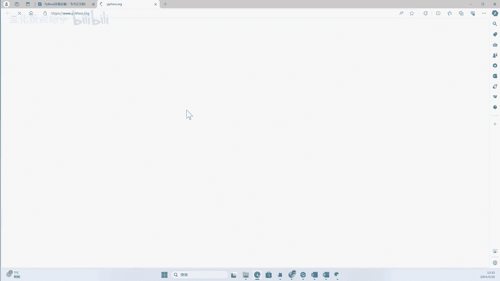

嗯这里这个点过来就是Python的官网，这里可以下载相应版本的Python啊。

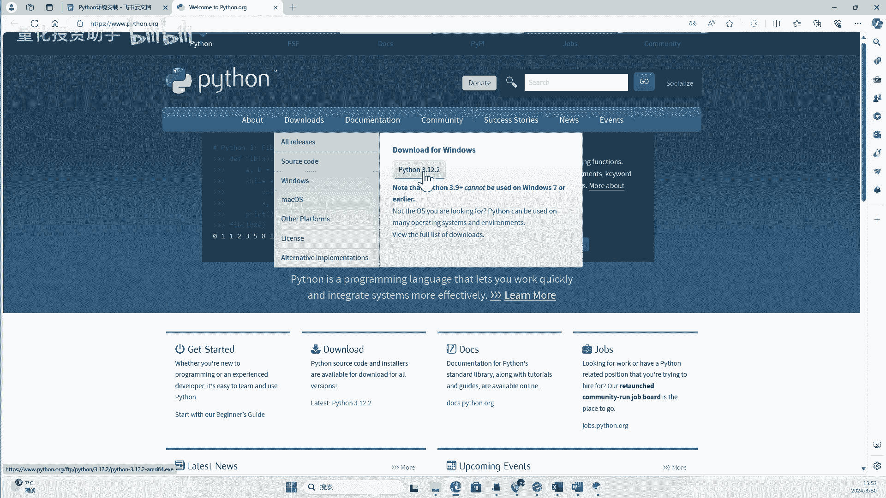

然后这里是最新版本啊，在这里呢能找到它的历史版本啊，就下载相应的版本就可以了，比如说嗯那就13。10下载这个就可以了，它会随着时间的更新呢，不断的去更新每个小版本以及大版本。

那这里呢我们我这里不采用这种方式了，因为这种方式比较简单啊，就是下载下载下来这个安装包之后呢，在本地进行一个啊，一个EXE的安装就可以了啊。

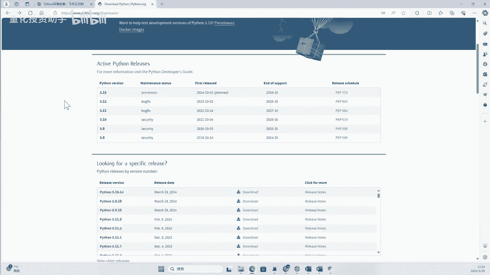

然后我这里呢我去采用一下第二种方式，给大家演示一下。

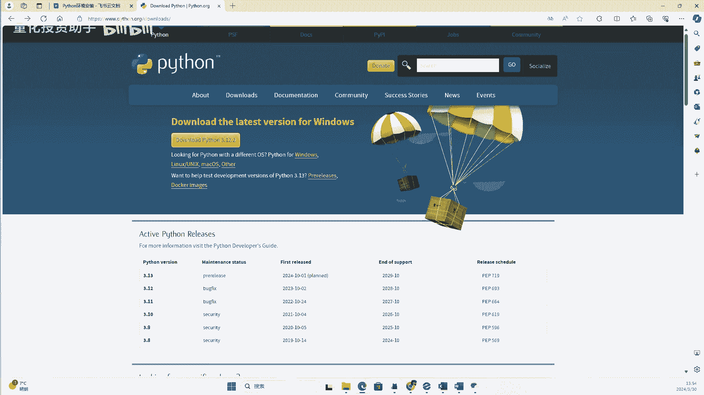

啊，我们再说一下第二个PYEENV的，这个包的安装啊，我们先看一下他的GITHUB主页啊，可以看到呢他这个star量是很高的啊，36K啊，然后他就是一个啊Python版本的管理工具，为什么要用它呢。

因为很可能我们的在一个电脑上呢，嗯不同的项目或者不同的嗯，那你做不同的事呢，需要不同的Python版本，很有可能这件事因为一些比较老的程序，它可能只是基于python3。6的，那比较新的程序呢。

可能是分3。8以上或者3。10都有可能，所以我们有这么一个工具呢，我们就可以在本地啊维护多个Python版本，这是比较好啊，比较好的，因为啊如果只是简单使用呢，就是按一个版本就可以了。

当你做的事情越来越复杂的时候呢，那有这样一个工具啊，是比较方便的啊，下面我们就看了一下他怎么安装啊，install e部分，store部分呢可以看到啊，他每个操作系统的安装的流程是不一样的啊。

因为嗯它是如系操作系统的差异的啊，原因那这里呢我们如果要安装windows版的，它需要一个嗯专门专门为windows环境做的包啊，然后这里它有它的安装方法啊，那我们就基于这个我们尝试一下啊。

嗯我这里我文档里写的命令呢就是这个复制啊，可以看到他说要打开power shell，执行这个命令啊，我们把它复制一下，然后把power shell打开啊。

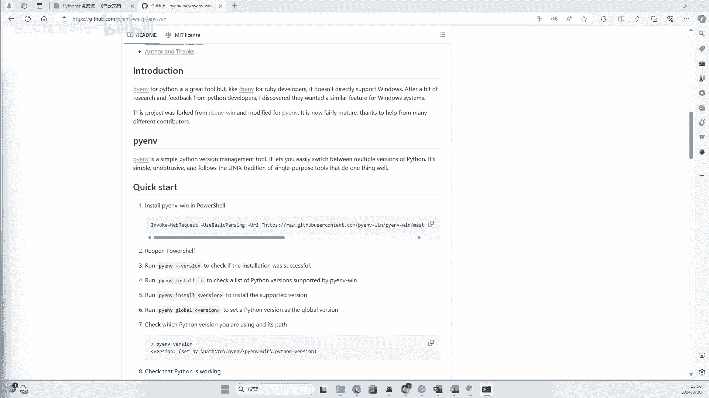

这样坡下又打开了，然后我们把它复制过来执行一下，可以看到他已经在执行了，我们稍微等一下啊，等了一会儿呢，可以看到他这里提示安装成功了，然后理论上我们这就可以用了，我们尝试一下啊，安装成功之后呢。

它提示我们需要重启终端啊，这里我已经重启了，刚才然后我们试一下这个命令，那就可以看到了这里啊啊这个命令就生效了，然后我们，可以去我们的GBS里试一下，因为我刚才说我装了GBS。

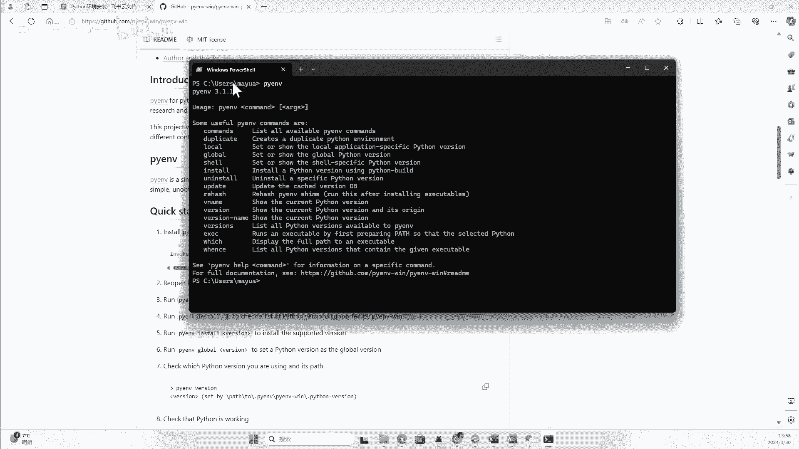

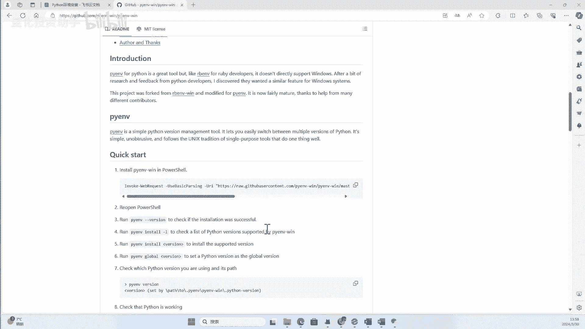

啊这里呢我的vs code和GBS已经装完了啊。

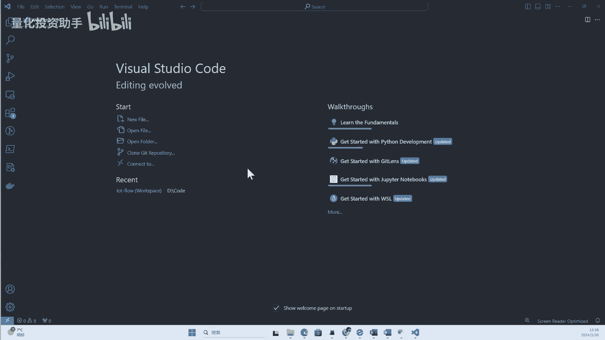

这里如果大家没装的话呢，啊，推荐大家参考我这个文档里面的相关的链接啊，git呢就是去这里去下载啊，这个git呢不仅仅是GBS有用啊，他在后续我们维护代码的时候，包括你从GITHUB上去拉代码都有用啊。

这个如果是嗯做嗯嗯那个编程专业的啊，这个大家做技术的应该都懂啊，如果如果不是做这些的呢，大家了解一下get是干什么的，我这里就不展开去讲啊，啊windows版本呢就在这里下载啊。

然后呢vs code呢它也有官网啊，我们我们去相应的官网去下载就可以了啊。

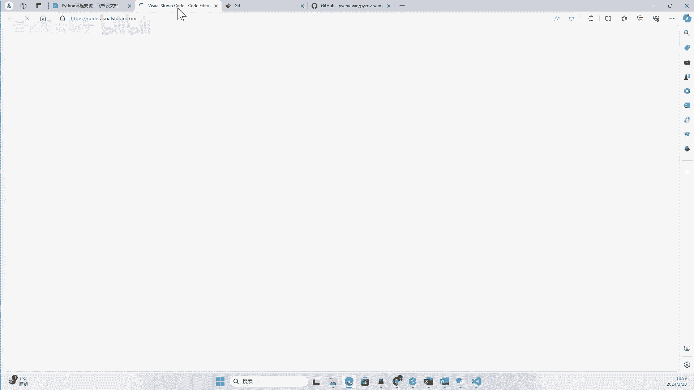

在我这里这个相关的环境呢。

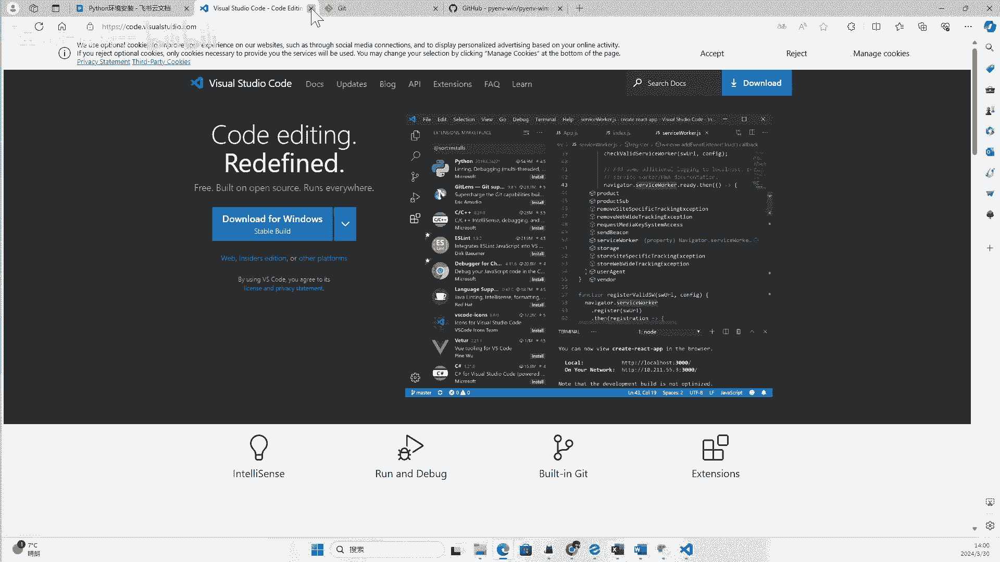

我这里已经装完了，然后给大家看一下啊，这这个就是vi的code VR code，它可以新建项目什么的，之后呢，我们的代码都会在vs code里去编辑啊，然后呢我们在这里新建一个终端啊。

啊这里默认的话是power shell，我们GBS，因为你GBS安装完之后呢，他就会在这里显示啊，这里就GBS试一下PY，啊BYEVN的这个命令，可以看到也是已经可以用了，是吧嗯，然后我们接下来呢。

我们去安装一个特定版本的Python啊，好我们尝试一下啊，这里呢我们先试一下本地的Python，因为我是新装的环境，所以我的Python还没装呢，可以看到这里的话，我的这个命令是没有反应的。

他调出来的这个啊，嗯那个微软的store的这个安装界面啊，但我这由于网络问题呢，这个这个打不开啊，那也就说明我们本地还没装，然后我们看一下它这个嗯，看一下这个嗯。

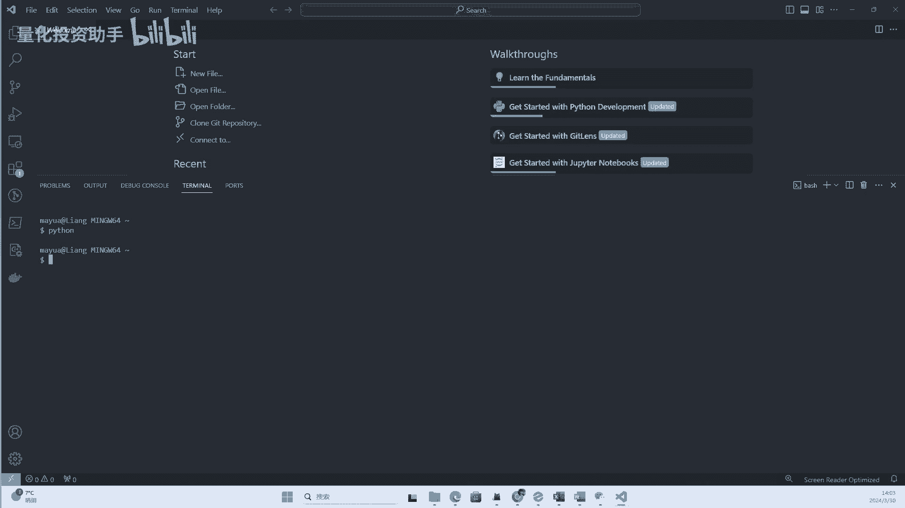

PY一般支持的一些命令，你可以看到这个啊，这里可以比如说执行这个啊，嗯py EV e n v in store l gl。

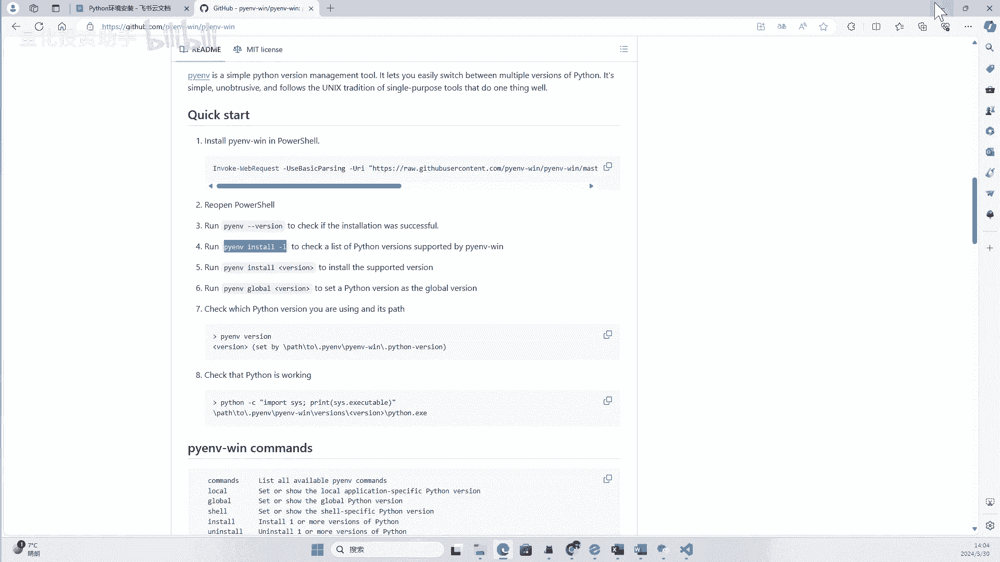

这里会列出来呢它支持的所有的版本啊，然后然后可以看到各种各样的版本都支持我们，但是这些目前还没有安装啊。

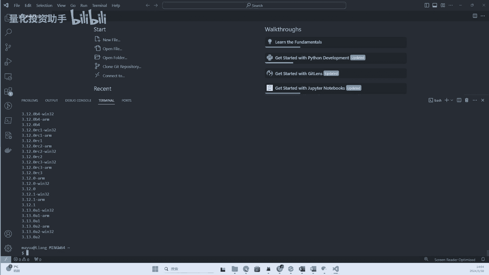

我们要选一个去安装，然后这里的话啊。

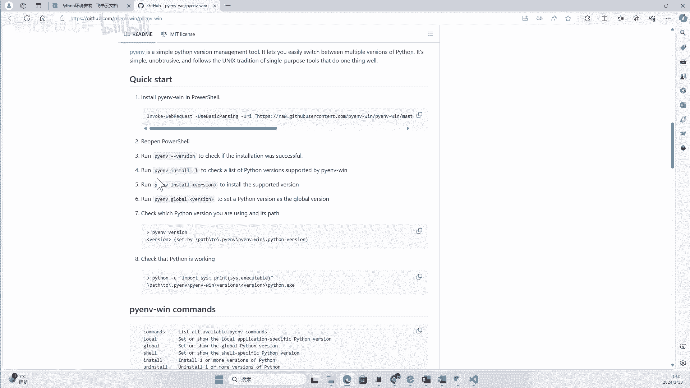

这个呢这个命令呢，可以看到本地安装了哪些版本啊，啊PYVERSON，Py e n e n v version，可以看到它显示本地和和格鲁，他有两个环境变量，一个是global的，一个是local。

global呢就代表这个整个系统全局的，local是代表你可以设置某个目录下的Python版本，比如说你两个文件夹呢可以同时嗯，比如说文件夹IE设置python3。8啊，然后文件夹B设置python3。

4都是可以的，然后他让我们执行这个相应的命令，那我们现在先没安装，我们尝试执行一下啊，拍py e e n v global啊，比如说我们要装一个3。10的最新版本啊，3。10。11，3。10。11啊啊。

它提示我们并没有安装这个版本对吧，然后呢我们就安装一下，看一下能不能执行成功啊，可以看到现在就在下载了啊，这个我们要等一下他的时间比较长，可以看到啊，这个目前的话呢。

还是去Python官网去下载个Python的版本，它会去拉取相应的安装包，所以这个过程呢还是比较慢的，因为我们用国内网站访问，在这些东西速度都不是很快啊，我们要稍微等一下，好的我们现在安装完成了啊。

然后我们试一下，看看Python的命令可以执行。

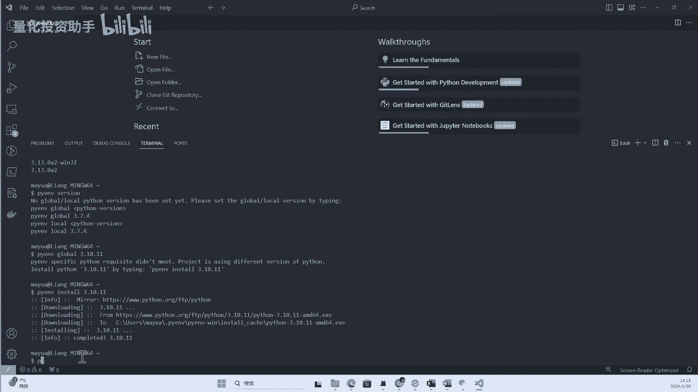

哦目前还不行。

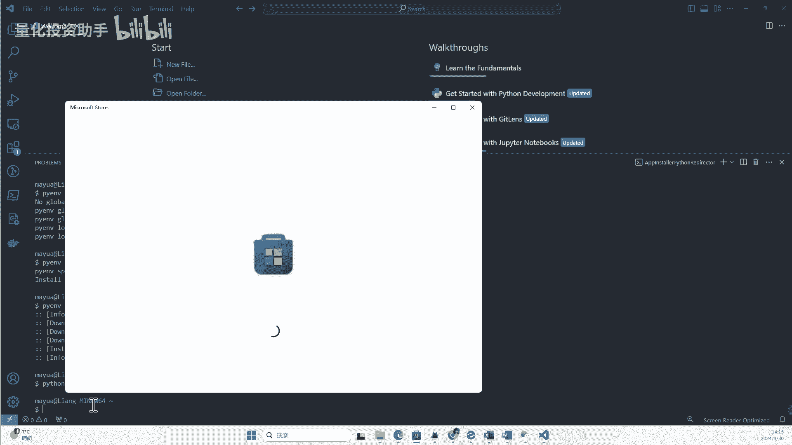

我们重启一下终端啊，嗯我们把终端重启了一下，然后再执行Python，可以看到现在提示说啊，没有设置这个local或者是global的这个相应的版本啊，我们设置一下，我们设置个logo啊。

刚才我们装的是3。10。11对吧，设置成功了再试一下，可以看到现在Python就安装成功了啊，那这样呢我现在在我的电脑的全局呢，就安装成安装了一个嗯，全局的3。10。11的Python环境啊。

先退出一下啊，那如果我们要切换这个环境呢，可以这样，比如说我们在装一个啊3。8版本啊，我们用一下刚才的命令啊，这个看一下哦，刚才的命令找一下啊，我们还是用这个这个命令，去看一下相应的版本啊。

找一下这个3。8。10，3。8点是最后一个，那我就按这个嗯，那我们再install，然后3。8点，8。10再按一个啊，还要等一段时间，等，由于这个网络问题呢，这个我最后就直接用代理安装的啊。

这个啊有条件的朋友们可以本地搞一个代理，然后下载相应的这个呃一些国外的软件包啊，那我这里用代理启动终端之后呢，就成功安装安装了，然后我们再看一下哎呀相关的版本啊。

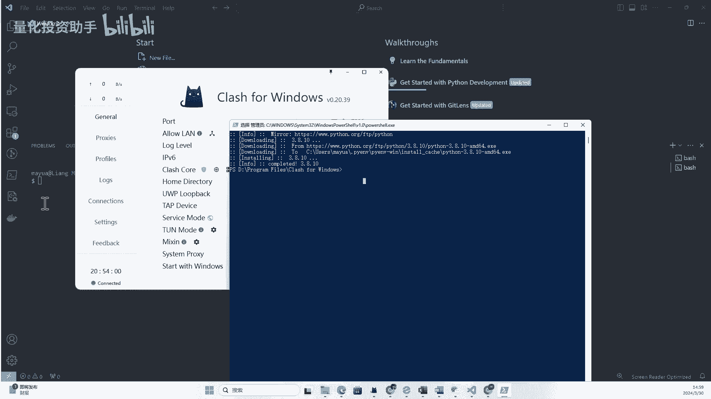

沃森的，可以看到现在的version呢是3。10。11，切换一下PVN又是又是命令3。8。10哦，global写错了，global pu机会，Global 3。8。10，啊那这时候再看一下这个相关的啊。

可以看到切换到3。8。10了，然后我们再执行一下Python，3。8。10没问题，然后我们再切回去啊，3。10。11，可以看到那这样的话呢嗯这个Python就又切回来了，可以看到这样的话。

我们可以在两个Python版本之间的随意的切换啊，那这样的这个Python呢，一个灵活的，Python的多版本的虚拟环境就安装成功了啊，啊那这个安装过程中可能会遇到一些困难，比如网络问题啊。

把再就是一些安装步骤比较复杂，如果那这块有困难的朋友们呢。

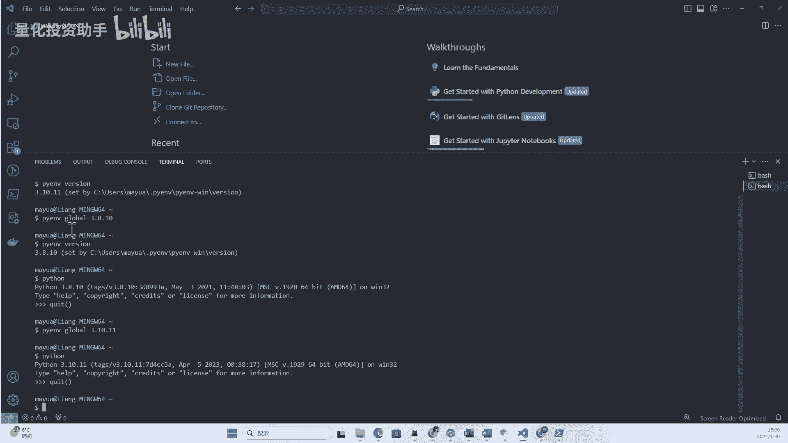

建议直接使用第一种，就官网下载一个合适的版本就好了，也能满足大部分的情况啊，那这里呢我是最后安装的还是多版本的，因为我这边做的东西比较多，就说多版本的更适合我的场景啊。

然后这里呢我们最后来设置一下这个啊，镜像源，刚才我们下Python的时候呢就很慢啊，这是因为我们访问的是国外的地址，但是PYEEVENV的那个经远呢不，我搜了一下，不是很好设置。

所以这块呢我直接用了代理，但是我们当我们下一步呢，就是我们如果了解Python的呢，可以知道它有一个这个pip命令，那这个pip呢嗯会安装一些第三方包，比如说pandas啊。

嗯比如说back china这些第三方包啊，那我们安装它的时候会用p store这个命令，那这呢还是要上外网去安装啊，走外网的这个镜像，那我们现在呢不想走外网的镜像。

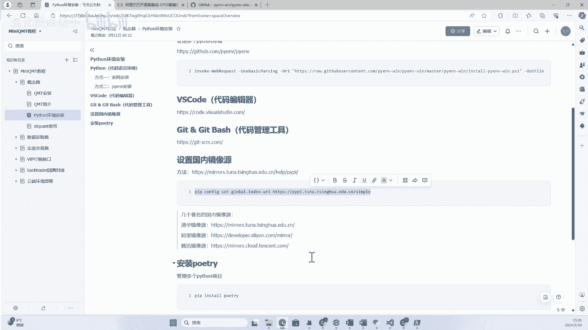

我们把它设置为内网的啊，就是也不是内网吧，国内应该是国内大陆网大陆的啊，这是一个清华的原，然后我们把它设置一下啊，可以看到这样的话，这个清华的镜像源呢就写到了我们这里，我们这里随意安装一个吧。

比如说pip install，嗯嗯back trader，Back china，可以看到这从清华园去安装了，那这就很快啊，很快啊，可以看到这就安装完成了，很快如果要是不设置这个镜像源呢，那就会比较慢啊。

那之后呢我们在安装这些包的时候。

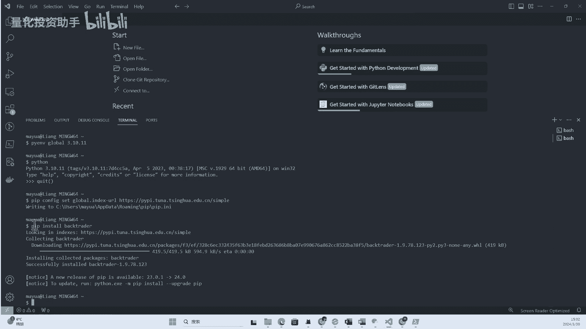

就会比较方便啊，啊这个啊相关的接线员呢我们也设置完了，然后这里我刚才说这里有几个常用的镜像源，我们可以打开看一下，我们现在设置的是清华园，这是国内的比较大的一个开源软件源啊。

一些其他的原这个程序呢也可以在这里找到啊，比如说你做node js啊，做其他的pm的相关的经验源也有阿里的呢，这个也有相应的那PYPI的镜像源，但为什么我这里没采用阿里的呢。

就因为阿里现在的话他会他会屏蔽一些包啊，这些包他认为是有风险的啊，啊包括一些爬虫的包啊，这些这些包被屏蔽之后呢，你用阿里的镜像源，如果你的程序中用到了这些包，那可能就安装不成功啊。

这个有以前有朋友反跟我反馈过嗯，比如说这个包它怎么安装，安装不成功，我怀疑他用的呢，所以就是这个阿里的镜像源，改一下镜像源应该就可以了，然后腾讯也有自己的镜像源，几个大厂都有自己的镜像源。

啊啊啊功能都大差不差啊，喜欢用哪个就用哪个好，那这个镜像这一块呢我们也是成功的，下面我们看一下这个嗯，啊这个包裹的工具的安装啊，这个为什么要用这个poly try呢。

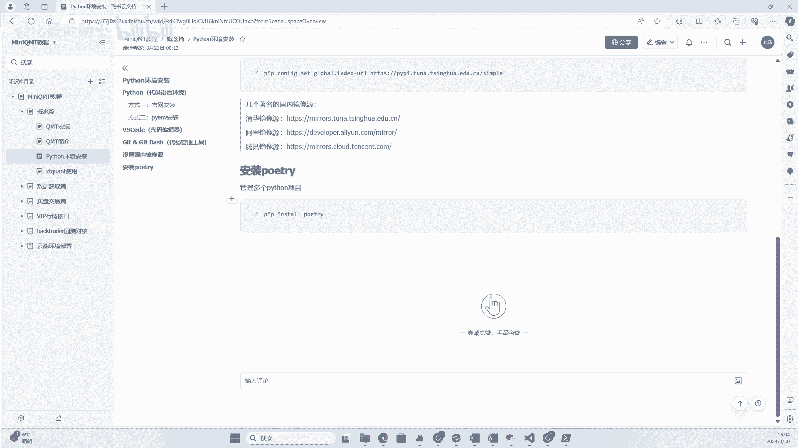

是这样的啊，比如说我们刚才我们安装了一个BACKTR子，其实它是安装在全局的啊，那在我们真正做项目之后呢，嗯很可能你本地有多个Python项目，那我们想每个Python项目自己维护自己的嗯。

第三方包依赖的版本，那这个时候呢peep就显得有点单薄了啊。

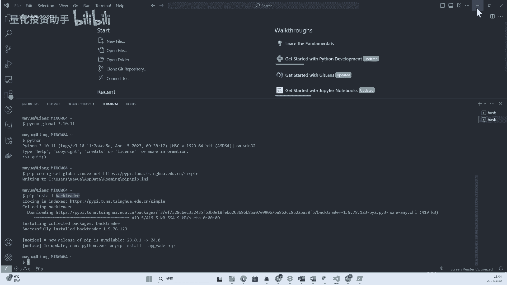

你可能用他的用peep的去管理这个包呢，就不是，那么我认为啊不是那么顺畅，因为它比较简单，项目一旦复杂起来呢就比较麻烦，所以呢这里我们去安装一下poetry。

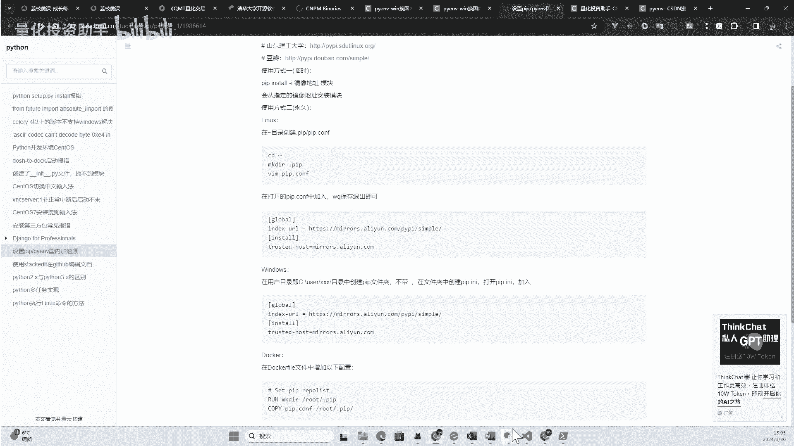

也是到终端里去执行相应的命令啊，clear一下啊，pip install p o e p o e p o e吧，看一下p o e polish，这个包呢我们就全局安装就可以了啊。

啊这个包需要依赖的东西比较多，可以看到他一直在下载，我们还是稍微等他一下啊，好我们现在这个包安装成功了，我们试一下啊，哎这个包现在的就已经安装成功了，可以看到他有很多的命令嗯。

这是我用过的用到的一个找到的比较好的，Python的项目的管理工具啊，它类似于这种呃，这大家如果写过写过node js呢，它类似于NPM的那种管理方式呃，我觉得是比较好吧。

好这里呢我们下一步可以尝试一下，怎么去使用它啊，可以这样我们到一个文件夹里先创建一个文件，创建一个文件夹好，我现在到了一个我自己的目标文件夹下，然后我们比如说我们创建一个那个电影叫迷你，QMT嗯。

嗯mk m t demo demo啊，比如说我们创建一个这样一个文件夹，然后我们进去，Demo，然后我们用poetry的一些命令。

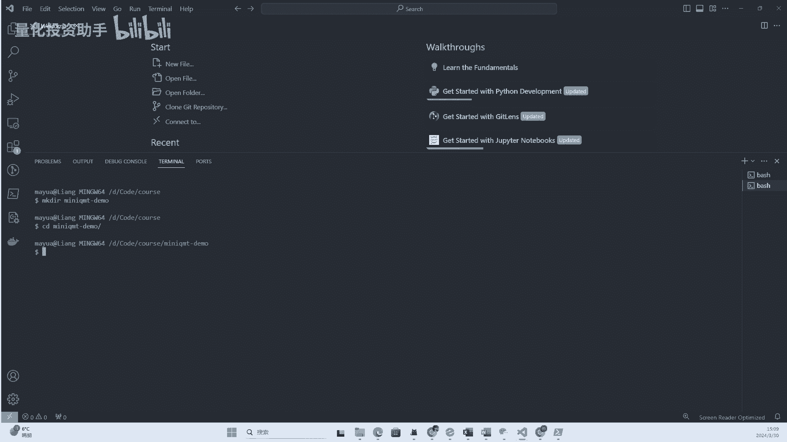

这个polish的官网呢我也给他加到文档里了，然后我们看一下它啊，他的这个也有相关的文档啊，我们看一下我们去使用它，这是讲的安装，然后base use可以看到我们可以初始化一个项目啊，啊。

啊就可以初始化这么一个项目啊，那我们现在刚才创建了一个文件，其实不用创建啊，在这里在这里，我们现在已经创建了一个文件夹了，那我们直接在这里执行poltry int。

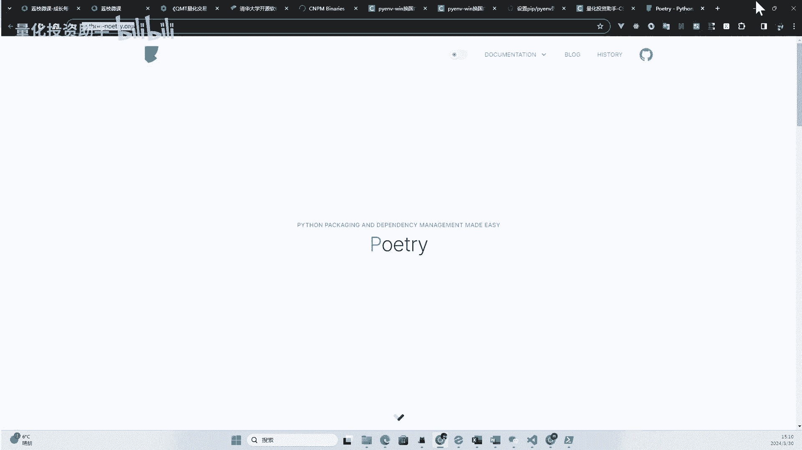

执行一下p r int啊，你看到这里就会创建一个叫这个py project的点呃，TOMIMO的这么一个文文件，这是它的配置文件，然后这里有有些，你让你设定一些这个项目的相关的啊。

嗯一些信息吧啊名称版本描述，我们这里就都不都不改了啊，然后兼容是3。10以上可以啊，然后我们就would you like to，等下嗯，嗯这里的话我先选NO啊，不先不先不定义这个依赖包啊。

然后这里先不定义选NO啊，这样的话呢，呃这个相关的这个配置文件就创建完成了啊，然后选yes啊，然后可以看到，我们这里就会生成这么一个文件啊，那比如说呢下一步我们要在这里装一些，装一些那个呃。

嗯比如说我们现在安装这个啊，Pandas，那我们这里就是用这个命令就可以了，就不再需要用pip啊，比如pandas啊，我们安装pandas a a的命令，可以看到，因为第三装呢。

他在我本地创建了一个虚拟的Python的Python，基于3。0的这个虚拟环境，然后开始安装依赖，那这个过程呢也比较耗时啊，我们暂停一下，等一下，OK现在我们这个安装完成了，我们可以看一下啊。

本地除了这个刚才配置文件之外呢，还加了还多了一个点lock文件啊，这个是记录那个安装的包的锁定的版本的啊，这个大家都了解一下就行，目前还不需要去改它诶，不需要没什么特大的问题，不需要去碰它啊。

然后我们在这里把我们这个。

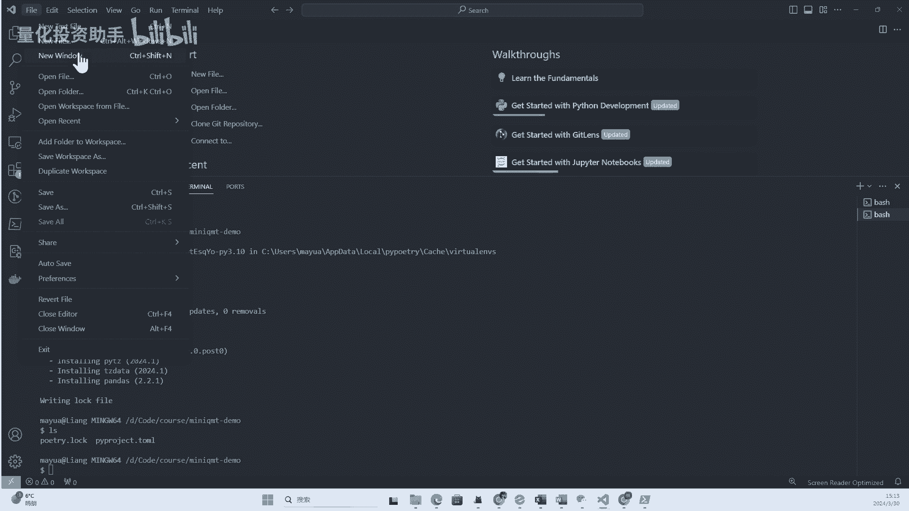

把我们这个相应的文件夹呢项目的文件夹加到，找一下，7cos。

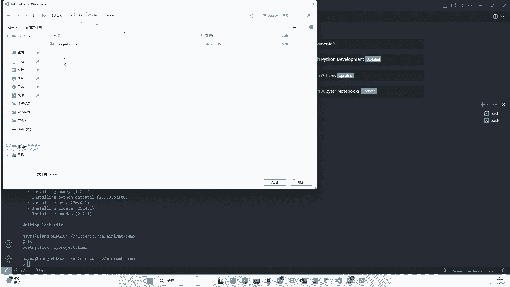

嗯把我们这个刚才建的项目呢，我们加到vs code，可以看到这相应的文件就加进来啊，这里就是我们刚才创建的啊这么一个项目，那这里呢就可以看到，我们可以在这里用到pandas了。

这个pandas呢就是他只针对于这个项目项目的，比如说我们再创建一个其他项目呢，我们可以装pandas，一点几版本的都是可以的，那这样呢你的本地呢嗯，多个项目的就可以用不同的版本对吧。

不同的第三方包的版本啊，这样的维护起来是比较好用的啊，这个有一定开发经验的，应该知道我这个在做什么东西啊，然后，嗯然后我们可以简单的试一下啊，嗯好我搞了一个测试程序啊。

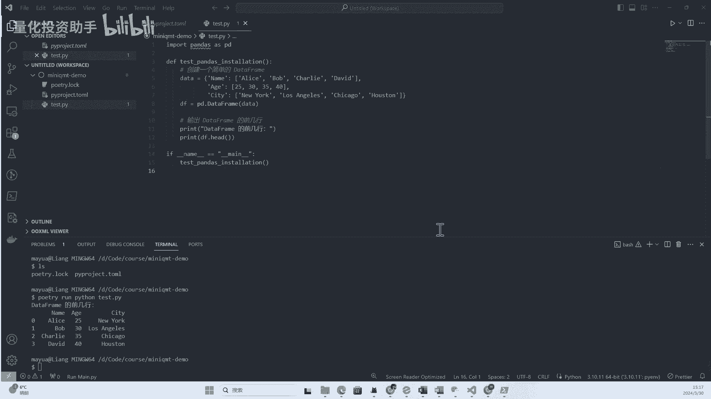

这个测试程序也很简单，现在因为有XGPT，我们用叉叉GPT去写一个pandas的，让他给我写一个pas的测试程序就可以了，让他定义了一个相应的数据表。

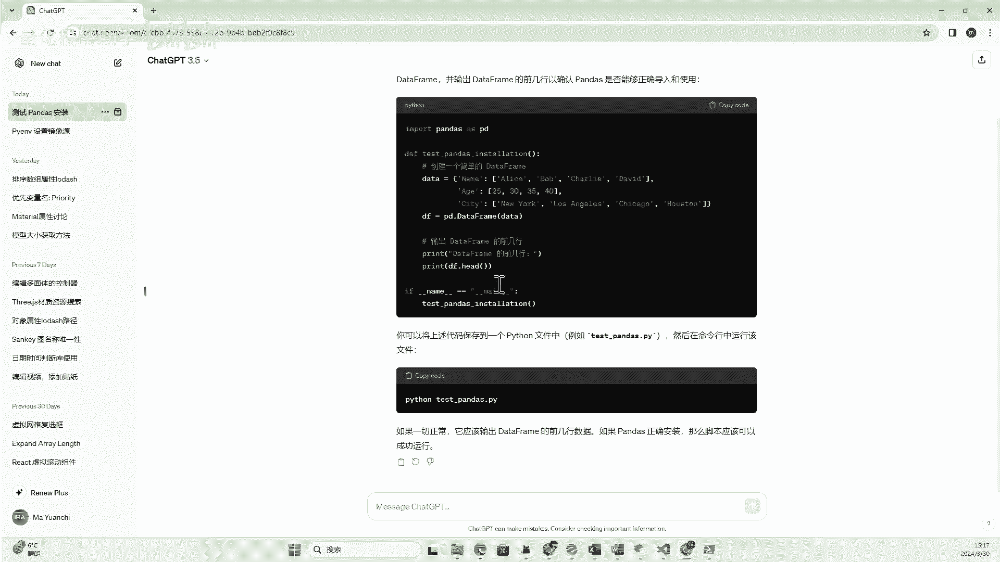

然后要打印前几行啊，我直接把它复制过来啊，这里看到引入pas的时候会有一个下划线，说明他没找到这个包，这里的话是可以通过vs code的，这下面的选择，可以看到，我们选择的是默认的这个PYE。

NN的全局环境，那这里刚才用polishing创建了一个他本地的环境，我们就把它选成这个，选到这个之后呢，可以看到这个就啊呃横线就没了，那就是已经找到了，可以看到都有相应的这个说明啊。

然后然后我们在这里去执行的话，刚才我执行了一次，我们再来一把啊，这里的执行那就不是呃，这不是这个直接Python点啊，这个了啊，文件名了，是要把这个前面的抓加上啊，嗯泡水run。

然后嗯嗯然后那个Python test它是等于PY，然后我们执行一下，还可以看到就正常执行了，说明我们这个包已经安装成功了啊，啊，那这样呢就可以看到，我们现在在本地创建了一个项目，然后这个项目呢可以啊。

可以呃控制他的，维护他的呃不知基于的第三方包的版本啊，啊然后可以用相应的拍摄环境啊，在不同的情况下呢，我们还可以在本地切换Python环境啊，那这样的一个本地的呃。

比较呃完善的Python的运行环境和编写环境了，我觉得就安装成功了，这是我个人比较喜欢的一种使用方式啊，当然这种使用方式呢会相对比较复杂，大家如果就是刚接触编程这一块呢，可以不用搞得这么复杂啊。

先把程序运行起来。

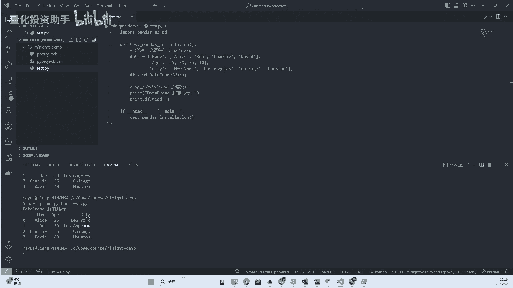

比如说我们就嗯就用最原始的方式，然后在官网安装，然后第三方包包呢用pip去安装这种Python的呃，呃入门视频呢也有很多嗯，嗯怎么去搞这些环境，在网上先搜一搜，包括用叉叉GBT啊。

你去问他一下都能搞定啊，那我这里介绍的呢是一个我认为比较好的啊，就应该算最佳实践也好，还是我本地的环境的配置啊，就是这样的嗯，那好这一节呢我们就介绍到这里。

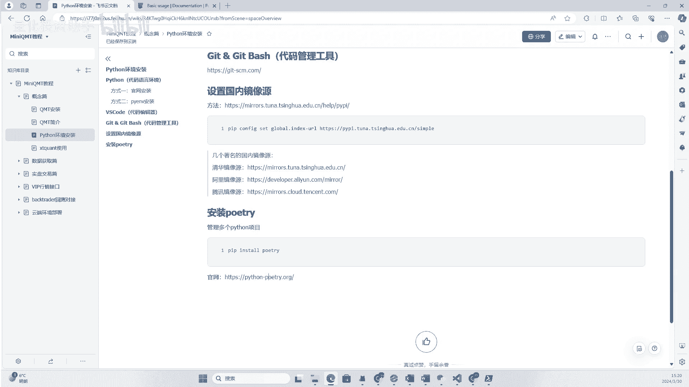